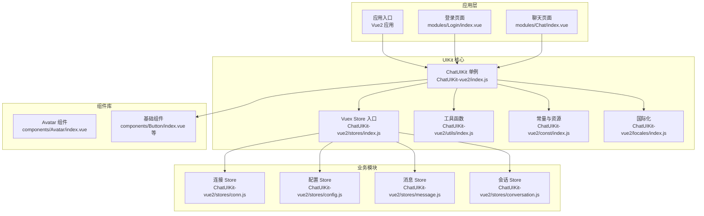
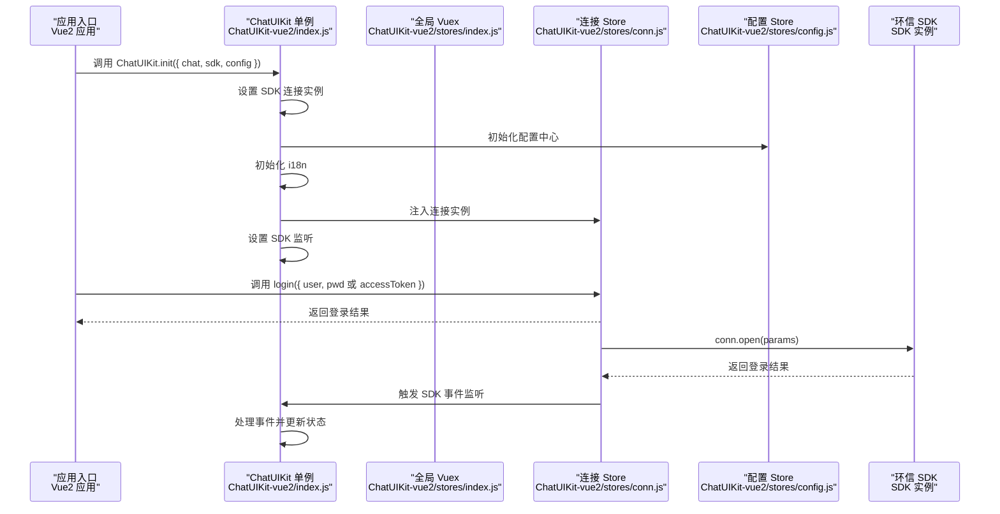
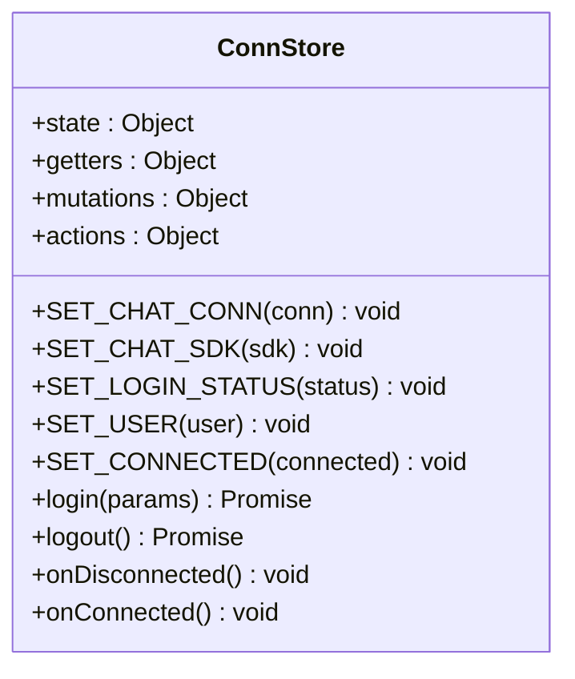
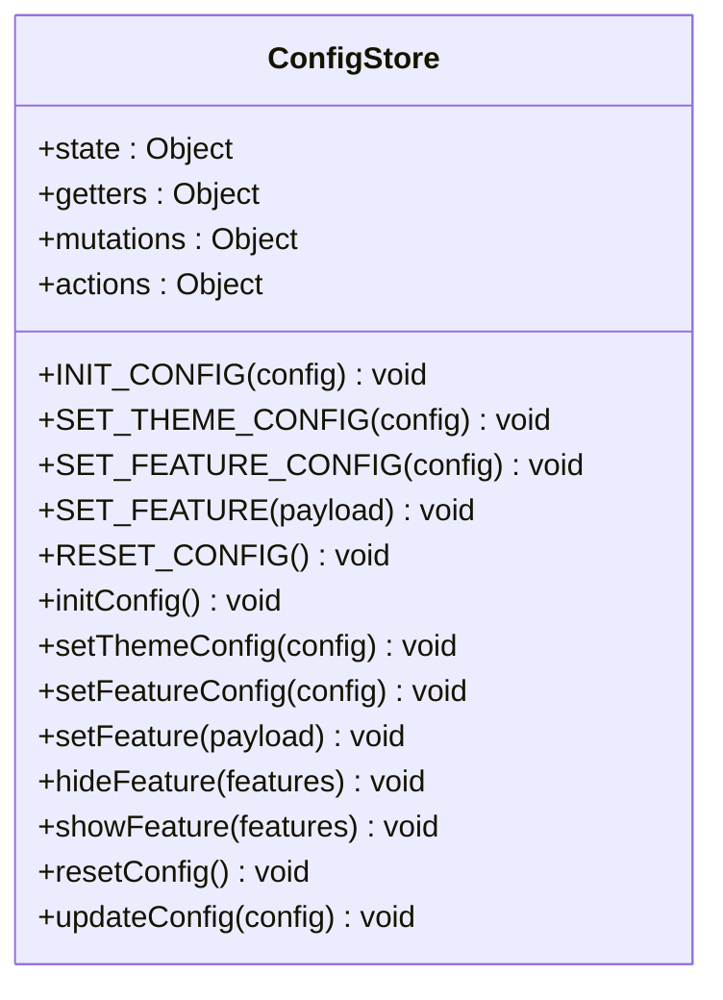
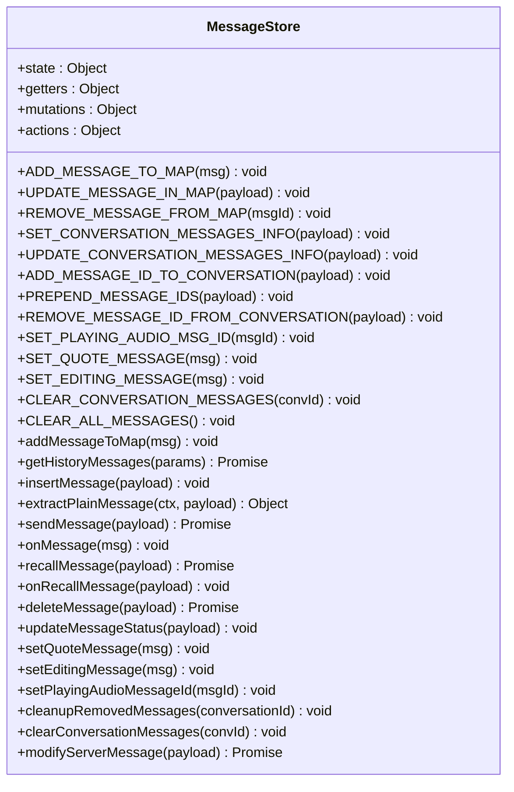
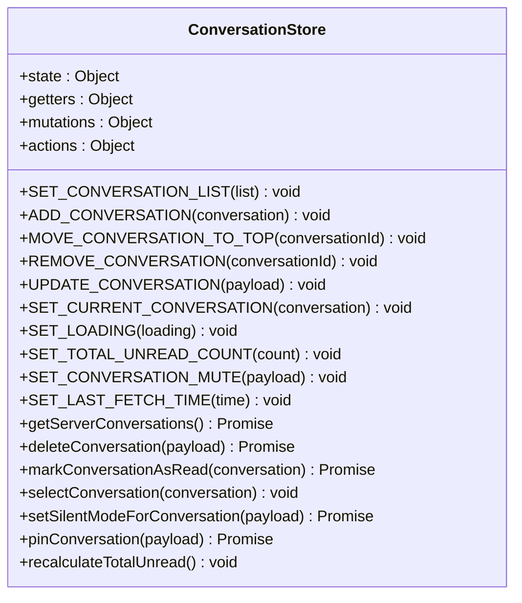
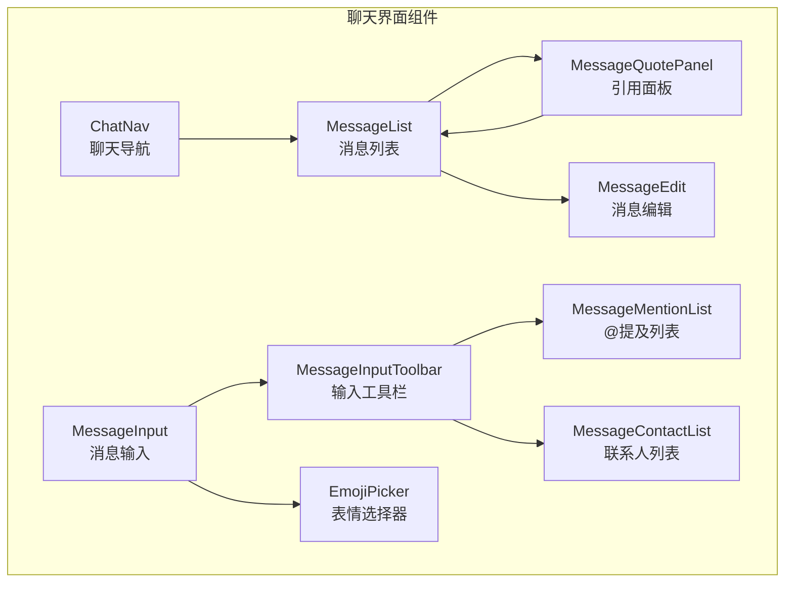
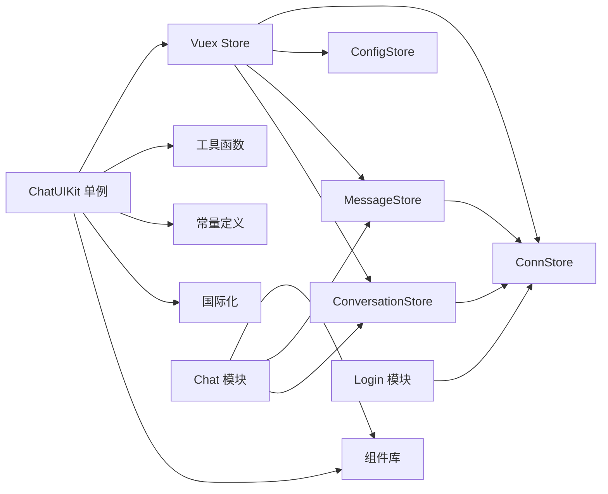

# API参考

<cite>
**本文引用的文件**
- [ChatUIKit-vue2/index.js](file://ChatUIKit-vue2/index.js)
- [ChatUIKit-vue2/stores/index.js](file://ChatUIKit-vue2/stores/index.js)
- [ChatUIKit-vue2/stores/conn.js](file://ChatUIKit-vue2/stores/conn.js)
- [ChatUIKit-vue2/stores/config.js](file://ChatUIKit-vue2/stores/config.js)
- [ChatUIKit-vue2/stores/message.js](file://ChatUIKit-vue2/stores/message.js)
- [ChatUIKit-vue2/stores/conversation.js](file://ChatUIKit-vue2/stores/conversation.js)
- [ChatUIKit-vue2/modules/Chat/index.vue](file://ChatUIKit-vue2/modules/Chat/index.vue)
- [ChatUIKit-vue2/modules/Login/index.vue](file://ChatUIKit-vue2/modules/Login/index.vue)
- [ChatUIKit-vue2/utils/index.js](file://ChatUIKit-vue2/utils/index.js)
- [ChatUIKit-vue2/const/index.js](file://ChatUIKit-vue2/const/index.js)
- [ChatUIKit-vue2/locales/index.js](file://ChatUIKit-vue2/locales/index.js)
- [ChatUIKit-vue2/components/Avatar/index.vue](file://ChatUIKit-vue2/components/Avatar/index.vue)
</cite>

## 目录
1. [简介](#简介)
2. [项目结构](#项目结构)
3. [核心组件](#核心组件)
4. [架构总览](#架构总览)
5. [详细组件分析](#详细组件分析)
6. [依赖关系分析](#依赖关系分析)
7. [性能与优化](#性能与优化)
8. [故障排查指南](#故障排查指南)
9. [结论](#结论)
10. [附录](#附录)

## 简介
本文件为 Easemob UIKit（Vue2 实现）的完整 API 参考，覆盖初始化、连接管理、配置与主题、事件处理、登录登出、消息与会话、联系人与群组、用户状态与资料、国际化、组件库以及调试与性能优化等。文档以"可读性优先"的原则，结合 Vue2 实现的代码结构进行说明，并通过图示展示关键流程。

## 项目结构
- 核心入口与单例：ChatUIKit-vue2/index.js 提供全局单例 ChatUIKit，封装初始化、连接获取、主题与功能配置访问、生命周期联动等。
- 存储层（Vuex）：stores 目录下按领域拆分，如 conn.js（连接）、config.js（主题/功能配置）、message.js（消息）、conversation.js（会话）等。
- 工具函数：utils/index.js 提供消息转换、日期格式化、权限检查等通用工具。
- 常量与资源：const/index.js 定义资源地址、最大消息数、群组成员分页大小、@相关常量等。
- 国际化：locales/index.js 提供 i18n 管理，支持多语言切换。
- 组件库：components 目录提供 Avatar、Button、Empty、IndexedList、MenuItem、NavBar、PopMenu、SearchButton、SearchInput 等基础组件。
- 示例模块：modules 目录包含 Chat、Conversation、Login 等业务模块组件。

**图表来源**
- [ChatUIKit-vue2/index.js:1-405](file://ChatUIKit-vue2/index.js#L1-L405)
- [ChatUIKit-vue2/stores/index.js:1-27](file://ChatUIKit-vue2/stores/index.js#L1-L27)
- [ChatUIKit-vue2/stores/conn.js:1-121](file://ChatUIKit-vue2/stores/conn.js#L1-L121)
- [ChatUIKit-vue2/stores/config.js:1-196](file://ChatUIKit-vue2/stores/config.js#L1-L196)
- [ChatUIKit-vue2/stores/message.js:1-880](file://ChatUIKit-vue2/stores/message.js#L1-L880)
- [ChatUIKit-vue2/stores/conversation.js:1-340](file://ChatUIKit-vue2/stores/conversation.js#L1-L340)
- [ChatUIKit-vue2/utils/index.js:1-820](file://ChatUIKit-vue2/utils/index.js#L1-L820)
- [ChatUIKit-vue2/const/index.js:1-36](file://ChatUIKit-vue2/const/index.js#L1-L36)
- [ChatUIKit-vue2/locales/index.js:1-219](file://ChatUIKit-vue2/locales/index.js#L1-L219)
- [ChatUIKit-vue2/components/Avatar/index.vue:1-267](file://ChatUIKit-vue2/components/Avatar/index.vue#L1-L267)

**章节来源**
- [ChatUIKit-vue2/index.js:1-405](file://ChatUIKit-vue2/index.js#L1-L405)
- [ChatUIKit-vue2/stores/index.js:1-27](file://ChatUIKit-vue2/stores/index.js#L1-L27)

## 核心组件
本节聚焦 ChatUIKit 单例提供的公共 API，包括初始化、连接获取、主题与功能配置访问、生命周期联动与 Vuex 获取等。

- ChatUIKit.init(params)
  - 功能：初始化 UIKit，设置主题配置、注入 IM 连接实例、可选设置 SDK 实例、初始化国际化。
  - 参数：
    - params.chat：环信 SDK 连接实例（EMClient/connection）。
    - params.sdk：环信 SDK 本身（包含 message 方法）。
    - params.config：配置项（可选），支持主题配置、功能配置、语言设置等。
  - 行为：若已初始化则不重复初始化；设置 SDK 连接实例；初始化配置中心；初始化 i18n；设置 SDK 监听；标记已初始化。
  - 注意：初始化后可通过 getChatConn() 获取连接实例；支持语言切换与配置持久化。
  - **章节来源**
    - [ChatUIKit-vue2/index.js:22-66](file://ChatUIKit-vue2/index.js#L22-L66)
    - [ChatUIKit-vue2/stores/config.js:138-194](file://ChatUIKit-vue2/stores/config.js#L138-L194)

- ChatUIKit.getChatConn()
  - 功能：返回当前 IM 连接实例。
  - 行为：内部通过外部变量获取连接实例；避免 Vue 响应式系统影响。
  - **章节来源**
    - [ChatUIKit-vue2/index.js:395-397](file://ChatUIKit-vue2/index.js#L395-L397)
    - [ChatUIKit-vue2/stores/conn.js:25-27](file://ChatUIKit-vue2/stores/conn.js#L25-L27)

- ChatUIKit.getStore()
  - 功能：返回全局 Vuex Store 实例。
  - 行为：提供对底层状态管理的直接访问。
  - **章节来源**
    - [ChatUIKit-vue2/index.js:381-383](file://ChatUIKit-vue2/index.js#L381-L383)

- ChatUIKit.isLoggedIn()
  - 功能：获取当前登录状态。
  - 行为：通过 getters 检查登录状态与连接状态。
  - **章节来源**
    - [ChatUIKit-vue2/index.js:388-390](file://ChatUIKit-vue2/index.js#L388-L390)
    - [ChatUIKit-vue2/stores/conn.js:22-24](file://ChatUIKit-vue2/stores/conn.js#L22-L24)

- ChatUIKit.onShow()
  - 功能：在应用 onShow 生命周期调用，检测并维护 IM 连接有效性（仅当已登录时）。
  - 行为：调用 SDK 的 onShow 方法维持连接。
  - **章节来源**
    - [ChatUIKit-vue2/index.js:368-376](file://ChatUIKit-vue2/index.js#L368-L376)

**章节来源**
- [ChatUIKit-vue2/index.js:22-397](file://ChatUIKit-vue2/index.js#L22-L397)
- [ChatUIKit-vue2/stores/conn.js:22-121](file://ChatUIKit-vue2/stores/conn.js#L22-L121)
- [ChatUIKit-vue2/stores/config.js:78-194](file://ChatUIKit-vue2/stores/config.js#L78-L194)

## 架构总览
下图展示应用启动、初始化、登录与事件处理的关键交互：

**图表来源**
- [ChatUIKit-vue2/index.js:22-66](file://ChatUIKit-vue2/index.js#L22-L66)
- [ChatUIKit-vue2/stores/conn.js:59-108](file://ChatUIKit-vue2/stores/conn.js#L59-L108)
- [ChatUIKit-vue2/stores/config.js:138-194](file://ChatUIKit-vue2/stores/config.js#L138-L194)

## 详细组件分析

### 连接管理（ConnStore）
- 职责：管理 IM 连接实例，提供初始化、登录、登出、连接状态管理。
- 关键点：
  - 使用外部变量存储 SDK 实例，避免 Vue 响应式系统影响。
  - 支持密码或 Token 登录方式。
  - 提供登录状态、连接状态、当前用户信息管理。
- **章节来源**
  - [ChatUIKit-vue2/stores/conn.js:1-121](file://ChatUIKit-vue2/stores/conn.js#L1-L121)

**图表来源**
- [ChatUIKit-vue2/stores/conn.js:30-121](file://ChatUIKit-vue2/stores/conn.js#L30-L121)

### 配置管理（ConfigStore）
- 职责：统一管理主题与功能配置，支持设置、隐藏/显示、重置与本地存储。
- 关键点：
  - 默认主题：avatarShape(circle|square)。
  - 默认功能：输入区、消息、消息操作、会话、其他等全量开启。
  - 支持单个功能开关设置与批量更新。
  - 配置持久化到本地存储。
- **章节来源**
  - [ChatUIKit-vue2/stores/config.js:1-196](file://ChatUIKit-vue2/stores/config.js#L1-L196)

**图表来源**
- [ChatUIKit-vue2/stores/config.js:70-196](file://ChatUIKit-vue2/stores/config.js#L70-L196)

### 消息管理（MessageStore）
- 职责：管理消息内容映射、会话消息列表、消息状态、语音播放等。
- 关键点：
  - 深克隆消息对象，移除 SDK 特殊原型方法，避免微信小程序 JSON.stringify 错误。
  - 支持消息发送、接收、撤回、删除、编辑等操作。
  - 处理消息状态更新、引用消息、编辑消息等功能。
  - 限制每个会话的消息数量，自动清理超量消息。
- **章节来源**
  - [ChatUIKit-vue2/stores/message.js:1-880](file://ChatUIKit-vue2/stores/message.js#L1-L880)

**图表来源**
- [ChatUIKit-vue2/stores/message.js:50-880](file://ChatUIKit-vue2/stores/message.js#L50-L880)

### 会话管理（ConversationStore）
- 职责：管理会话列表、当前会话、未读消息总数、静音状态等。
- 关键点：
  - 从服务器获取会话列表，防重机制避免频繁请求。
  - 支持会话删除、标记已读、静音设置、置顶操作。
  - 计算总未读数，支持重新计算。
  - 深克隆对象，移除 SDK 特殊原型方法。
- **章节来源**
  - [ChatUIKit-vue2/stores/conversation.js:1-340](file://ChatUIKit-vue2/stores/conversation.js#L1-L340)

**图表来源**
- [ChatUIKit-vue2/stores/conversation.js:47-340](file://ChatUIKit-vue2/stores/conversation.js#L47-L340)

### 聊天模块（Chat 模块）
- 职责：提供聊天界面，包含消息列表、输入框、工具栏、表情选择器等。
- 关键点：
  - 支持消息编辑、引用回复、@提及、用户卡片等功能。
  - 根据功能配置动态显示/隐藏组件。
  - 处理键盘高度变化，自动滚动到底部。
  - 发送名片消息时使用 SDK message.create 方法。
- **章节来源**
  - [ChatUIKit-vue2/modules/Chat/index.vue:1-310](file://ChatUIKit-vue2/modules/Chat/index.vue#L1-L310)

**图表来源**
- [ChatUIKit-vue2/modules/Chat/index.vue:62-86](file://ChatUIKit-vue2/modules/Chat/index.vue#L62-L86)

### 登录模块（Login 模块）
- 职责：提供用户登录界面，支持 Token 登录和密码登录两种方式。
- 关键点：
  - 支持登录方式切换（Token/密码）。
  - 检查 AppKey 配置，提供配置提示。
  - 获取 SDK 版本信息显示。
  - 登录成功后跳转到会话列表页面。
- **章节来源**
  - [ChatUIKit-vue2/modules/Login/index.vue:1-382](file://ChatUIKit-vue2/modules/Login/index.vue#L1-L382)

### 工具函数（Utils）
- 职责：提供通用工具函数，包括消息转换、日期格式化、权限检查、文件处理等。
- 关键点：
  - toPlainMessage：将 SDK 消息对象转换为纯数据对象，解决 Long 类型问题。
  - formatDate：日期格式化工具。
  - 权限检查：支持相机、相册、录音等权限检查。
  - 文件处理：文件大小格式化、扩展名识别、图标类型判断等。
- **章节来源**
  - [ChatUIKit-vue2/utils/index.js:1-820](file://ChatUIKit-vue2/utils/index.js#L1-L820)

### 常量与国际化（Const & I18n）
- 常量：定义资源 URL、@所有人标识、群组成员分页大小、最大消息数、用户状态列表等。
- 国际化：支持简体中文和英文，提供语言切换、模板替换、批量翻译等功能。
- **章节来源**
  - [ChatUIKit-vue2/const/index.js:1-36](file://ChatUIKit-vue2/const/index.js#L1-L36)
  - [ChatUIKit-vue2/locales/index.js:1-219](file://ChatUIKit-vue2/locales/index.js#L1-L219)

### 组件库（Components）
- Avatar 组件：支持圆形/方形头像、在线状态显示、占位图处理。
- 基础组件：Button、Empty、IndexedList、MenuItem、NavBar、PopMenu、SearchButton、SearchInput 等。
- **章节来源**
  - [ChatUIKit-vue2/components/Avatar/index.vue:1-267](file://ChatUIKit-vue2/components/Avatar/index.vue#L1-L267)

## 依赖关系分析
- ChatUIKit 单例依赖 Vuex（全局实例由 ChatUIKit 管理），并通过各 Store 协调业务。
- Store 之间存在领域耦合：ConnStore 依赖 ConfigStore、MessageStore 依赖 ConnStore、ConversationStore 依赖 ConnStore 等。
- 工具函数与常量集中管理，便于复用与维护。
- 组件库提供基础 UI 能力，模块组件基于组件库构建。
- 国际化系统独立管理，支持多语言切换。

**图表来源**
- [ChatUIKit-vue2/index.js:1-405](file://ChatUIKit-vue2/index.js#L1-L405)
- [ChatUIKit-vue2/stores/index.js:1-27](file://ChatUIKit-vue2/stores/index.js#L1-L27)
- [ChatUIKit-vue2/stores/message.js:1-880](file://ChatUIKit-vue2/stores/message.js#L1-L880)
- [ChatUIKit-vue2/stores/conversation.js:1-340](file://ChatUIKit-vue2/stores/conversation.js#L1-L340)
- [ChatUIKit-vue2/modules/Chat/index.vue:1-310](file://ChatUIKit-vue2/modules/Chat/index.vue#L1-L310)
- [ChatUIKit-vue2/modules/Login/index.vue:1-382](file://ChatUIKit-vue2/modules/Login/index.vue#L1-L382)

**章节来源**
- [ChatUIKit-vue2/stores/index.js:1-27](file://ChatUIKit-vue2/stores/index.js#L1-L27)
- [ChatUIKit-vue2/stores/message.js:1-880](file://ChatUIKit-vue2/stores/message.js#L1-L880)
- [ChatUIKit-vue2/stores/conversation.js:1-340](file://ChatUIKit-vue2/stores/conversation.js#L1-L340)

## 性能与优化
- 消息处理优化：深克隆消息对象，移除 SDK 特殊原型方法，避免 Vue 响应式系统影响。
- 数据存储优化：使用外部变量存储 SDK 实例，避免响应式追踪带来的性能损耗。
- 频繁请求控制：会话列表获取增加防重机制，5秒内不允许重复获取。
- 内存管理：限制每个会话的消息数量（默认100条），自动清理超量消息。
- 配置持久化：配置信息保存到本地存储，减少重复初始化成本。
- 组件渲染优化：Avatar 组件支持占位图和错误处理，提升用户体验。
- **章节来源**
  - [ChatUIKit-vue2/stores/message.js:13-48](file://ChatUIKit-vue2/stores/message.js#L13-L48)
  - [ChatUIKit-vue2/stores/conn.js:3-6](file://ChatUIKit-vue2/stores/conn.js#L3-L6)
  - [ChatUIKit-vue2/stores/conversation.js:163-169](file://ChatUIKit-vue2/stores/conversation.js#L163-L169)
  - [ChatUIKit-vue2/stores/config.js:62-68](file://ChatUIKit-vue2/stores/config.js#L62-L68)
  - [ChatUIKit-vue2/components/Avatar/index.vue:160-167](file://ChatUIKit-vue2/components/Avatar/index.vue#L160-L167)

## 故障排查指南
- 连接未初始化
  - 现象：调用 getChatConn 抛错或返回 null。
  - 原因：未先执行 ChatUIKit.init 注入连接实例。
  - 处理：确保在应用启动早期调用 init，并传入有效的 SDK 连接实例。
  - **章节来源**
    - [ChatUIKit-vue2/stores/conn.js:25-27](file://ChatUIKit-vue2/stores/conn.js#L25-L27)

- 登录失败
  - 现象：login 抛错或返回错误描述。
  - 原因：网络、凭证错误、服务端限流或鉴权失败。
  - 处理：检查凭证、网络与服务端返回；查看控制台日志；必要时重试或切换服务器。
  - **章节来源**
    - [ChatUIKit-vue2/stores/conn.js:59-108](file://ChatUIKit-vue2/stores/conn.js#L59-L108)
    - [ChatUIKit-vue2/modules/Login/index.vue:144-205](file://ChatUIKit-vue2/modules/Login/index.vue#L144-L205)

- SDK 事件处理异常
  - 现象：消息接收、撤回、已读等事件处理异常。
  - 原因：SDK 事件回调中的消息 ID 类型问题或状态更新异常。
  - 处理：检查 toPlainMessage 转换逻辑；验证消息 ID 类型；查看控制台错误日志。
  - **章节来源**
    - [ChatUIKit-vue2/index.js:315-350](file://ChatUIKit-vue2/index.js#L315-L350)
    - [ChatUIKit-vue2/stores/message.js:497-555](file://ChatUIKit-vue2/stores/message.js#L497-L555)

- 配置持久化失败
  - 现象：配置更改后重启应用丢失。
  - 原因：本地存储权限问题或存储空间不足。
  - 处理：检查 uni.setStorageSync 调用；确认存储权限；清理无效配置。
  - **章节来源**
    - [ChatUIKit-vue2/stores/config.js:62-68](file://ChatUIKit-vue2/stores/config.js#L62-L68)
    - [ChatUIKit-vue2/stores/config.js:103-107](file://ChatUIKit-vue2/stores/config.js#L103-L107)

- 组件渲染问题
  - 现象：头像显示异常、在线状态不更新。
  - 原因：组件 props 传递问题或状态同步问题。
  - 处理：检查 Avatar 组件的 props 传递；验证用户状态更新逻辑；确认配置开关。
  - **章节来源**
    - [ChatUIKit-vue2/components/Avatar/index.vue:80-129](file://ChatUIKit-vue2/components/Avatar/index.vue#L80-L129)
    - [ChatUIKit-vue2/components/Avatar/index.vue:130-149](file://ChatUIKit-vue2/components/Avatar/index.vue#L130-L149)

## 结论
本参考文档梳理了 ChatUIKit Vue2 实现的核心 API、数据流与事件处理机制，明确了初始化、连接管理、配置与主题、登录登出、消息与会话、联系人与群组、用户状态与资料、国际化、组件库等关键能力。相比 Vue3 实现，Vue2 版本在以下方面有显著差异：
- 使用 Vuex 替代 Pinia 进行状态管理
- 采用外部变量存储 SDK 实例，避免响应式系统影响
- 提供更完善的工具函数和组件库
- 支持国际化多语言切换
- 增强的消息处理和内存管理机制

结合示例模块，开发者可快速集成并稳定运行即时通讯功能。

## 附录

### HTTP 方法、URL 模式与认证
- 登录方式
  - Token 登录：调用业务侧接口获取 token，随后以 accessToken 方式登录。
  - 密码登录：直接使用用户名和密码登录。
- 请求/响应要点
  - 登录接口返回 token 与 chatUserName；随后使用 SDK conn.open({ user, accessToken }) 完成 IM 登录。
  - 错误信息通过响应体的 errorInfo 字段体现，前端可据此提示用户。
- 服务器配置
  - 示例工程通过 const/index.js 读取服务端配置（APPKEY、API_URL、URL），用于构建登录与资源访问。
- **章节来源**
  - [ChatUIKit-vue2/modules/Login/index.vue:144-205](file://ChatUIKit-vue2/modules/Login/index.vue#L144-L205)
  - [ChatUIKit-vue2/const/index.js:1-36](file://ChatUIKit-vue2/const/index.js#L1-L36)

### WebSocket API 与实时交互
- 连接处理
  - SDK 通过 chatSDK.connection(options) 创建连接；连接参数由业务侧提供。
  - ChatUIKit._setupSDKListeners 注册 SDK 事件处理器，涵盖连接、消息、联系人、群组、会话等事件。
- 消息格式与事件类型
  - 文本/图片/语音/视频/文件/自定义消息事件分别对应 onTextMessage/onImageMessage/onAudioMessage/onVideoMessage/onFileMessage/onCustomMessage。
  - 撤回消息 onRecallMessage、已读回执 onReadMessage、消息修改 onModifiedMessage、联系人事件、群组事件、会话事件等均有对应处理。
- 实时交互模式
  - 登录后自动初始化事件监听；消息到达时交由 MessageStore 处理并异步拉取发送者信息。
  - 支持消息状态跟踪（发送中、已发送、已读、已撤回）。
- **章节来源**
  - [ChatUIKit-vue2/index.js:72-309](file://ChatUIKit-vue2/index.js#L72-L309)
  - [ChatUIKit-vue2/stores/message.js:497-555](file://ChatUIKit-vue2/stores/message.js#L497-L555)

### 协议特定示例与最佳实践
- 协议示例
  - 登录流程：见 modules/Login/index.vue 的 handleLogin 方法。
  - 连接初始化：见 ChatUIKit-vue2/index.js 的 init 方法。
  - 消息发送：见 stores/message.js 的 sendMessage 方法。
- 最佳实践
  - 在应用入口注册 ChatUIKit，确保 Store 全局一致性。
  - 在 onShow 生命周期调用 ChatUIKit.onShow，维持连接有效性。
  - 使用 toPlainMessage 转换 SDK 对象，避免响应式系统问题。
  - 按需隐藏功能项，减少 UI 与交互复杂度。
  - 使用深克隆处理 SDK 特殊对象，避免序列化错误。
- **章节来源**
  - [ChatUIKit-vue2/modules/Login/index.vue:144-205](file://ChatUIKit-vue2/modules/Login/index.vue#L144-L205)
  - [ChatUIKit-vue2/index.js:368-376](file://ChatUIKit-vue2/index.js#L368-L376)
  - [ChatUIKit-vue2/utils/index.js:9-45](file://ChatUIKit-vue2/utils/index.js#L9-L45)
  - [ChatUIKit-vue2/stores/config.js:162-178](file://ChatUIKit-vue2/stores/config.js#L162-L178)

### 错误处理策略
- 连接未初始化：捕获 getChatConn 返回 null，提示先初始化。
- 登录失败：捕获 login 抛错，解析服务端返回的错误信息并提示用户。
- SDK 事件处理：对异常分支记录日志，避免影响主流程。
- 配置持久化：检查本地存储权限，处理存储失败情况。
- 组件渲染：处理头像加载错误和在线状态更新异常。
- **章节来源**
  - [ChatUIKit-vue2/stores/conn.js:25-27](file://ChatUIKit-vue2/stores/conn.js#L25-L27)
  - [ChatUIKit-vue2/stores/conn.js:89-92](file://ChatUIKit-vue2/stores/conn.js#L89-L92)
  - [ChatUIKit-vue2/stores/config.js:50-59](file://ChatUIKit-vue2/stores/config.js#L50-L59)
  - [ChatUIKit-vue2/components/Avatar/index.vue:160-167](file://ChatUIKit-vue2/components/Avatar/index.vue#L160-L167)

### 安全考虑
- 凭证保护：登录使用的 token 与用户 ID 应安全存储，避免明文泄露。
- 传输安全：服务端地址采用 HTTPS/WSS，防止中间人攻击。
- 响应式安全：使用外部变量存储 SDK 实例，避免 Vue 响应式系统影响。
- 数据序列化：使用深克隆处理 SDK 特殊对象，防止序列化错误。
- 权限检查：在敏感操作前检查用户权限，如相机、相册、录音等。
- **章节来源**
  - [ChatUIKit-vue2/stores/conn.js:3-6](file://ChatUIKit-vue2/stores/conn.js#L3-L6)
  - [ChatUIKit-vue2/utils/index.js:13-48](file://ChatUIKit-vue2/utils/index.js#L13-L48)
  - [ChatUIKit-vue2/utils/index.js:755-794](file://ChatUIKit-vue2/utils/index.js#L755-L794)

### 速率限制与版本信息
- 速率限制：静态资源访问存在频率限制，建议迁移至自有服务器。
- 版本信息：SDK 版本通过 utils/index.js 的 getSDKVersion 方法获取。
- 配置持久化：配置信息保存到本地存储，避免重复初始化。
- **章节来源**
  - [ChatUIKit-vue2/modules/Login/index.vue:122-142](file://ChatUIKit-vue2/modules/Login/index.vue#L122-L142)
  - [ChatUIKit-vue2/stores/config.js:62-68](file://ChatUIKit-vue2/stores/config.js#L62-L68)

### 常见用例与客户端实现指南
- 快速集成
  - 在应用入口调用 ChatUIKit.init 注入 SDK 连接实例与配置。
  - 使用 Vuex 管理状态，确保 Store 全局一致性。
  - 在 onShow 生命周期调用 ChatUIKit.onShow。
  - 按需隐藏功能项，提升用户体验。
- 客户端实现要点
  - 使用深克隆处理 SDK 对象，避免响应式系统问题。
  - 实现防重机制，避免频繁请求。
  - 使用外部变量存储 SDK 实例，提升性能。
  - 实现配置持久化，提升用户体验。
- **章节来源**
  - [ChatUIKit-vue2/index.js:22-66](file://ChatUIKit-vue2/index.js#L22-L66)
  - [ChatUIKit-vue2/stores/conversation.js:163-169](file://ChatUIKit-vue2/stores/conversation.js#L163-L169)
  - [ChatUIKit-vue2/stores/conn.js:3-6](file://ChatUIKit-vue2/stores/conn.js#L3-L6)
  - [ChatUIKit-vue2/stores/config.js:62-68](file://ChatUIKit-vue2/stores/config.js#L62-L68)

### 调试工具与监控方法
- 调试工具
  - 启用调试日志：ChatUIKit.init 时传入 config.isDebug=true。
  - 观察 SDK 事件：在 ChatUIKit._setupSDKListeners 中查看事件回调日志。
  - 检查消息转换：使用 toPlainMessage 验证消息对象转换。
- 监控方法
  - 连接状态：通过 ConnStore.getters.isLoggedIn 获取当前状态。
  - 登录/登出：在登录与登出前后记录日志，便于定位问题。
  - 配置状态：检查本地存储中的配置信息。
  - 组件状态：监控 Avatar 组件的加载状态和在线状态更新。
- **章节来源**
  - [ChatUIKit-vue2/index.js:62-63](file://ChatUIKit-vue2/index.js#L62-L63)
  - [ChatUIKit-vue2/index.js:315-327](file://ChatUIKit-vue2/index.js#L315-L327)
  - [ChatUIKit-vue2/utils/index.js:9-45](file://ChatUIKit-vue2/utils/index.js#L9-L45)
  - [ChatUIKit-vue2/stores/conn.js:22-24](file://ChatUIKit-vue2/stores/conn.js#L22-L24)
  - [ChatUIKit-vue2/stores/config.js:50-59](file://ChatUIKit-vue2/stores/config.js#L50-L59)
  - [ChatUIKit-vue2/components/Avatar/index.vue:160-167](file://ChatUIKit-vue2/components/Avatar/index.vue#L160-L167)