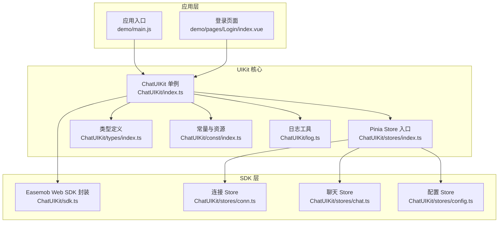
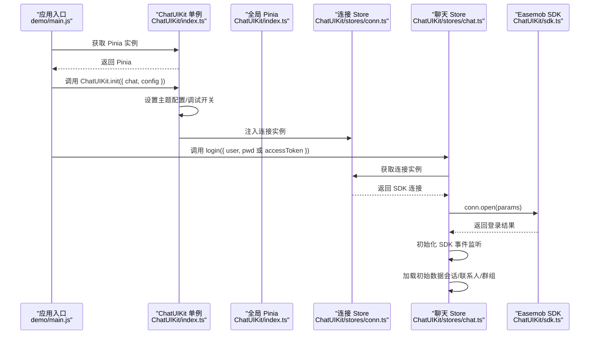
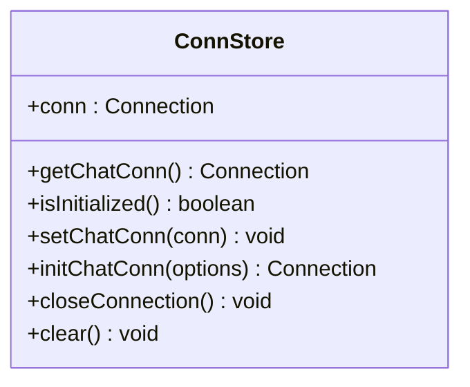
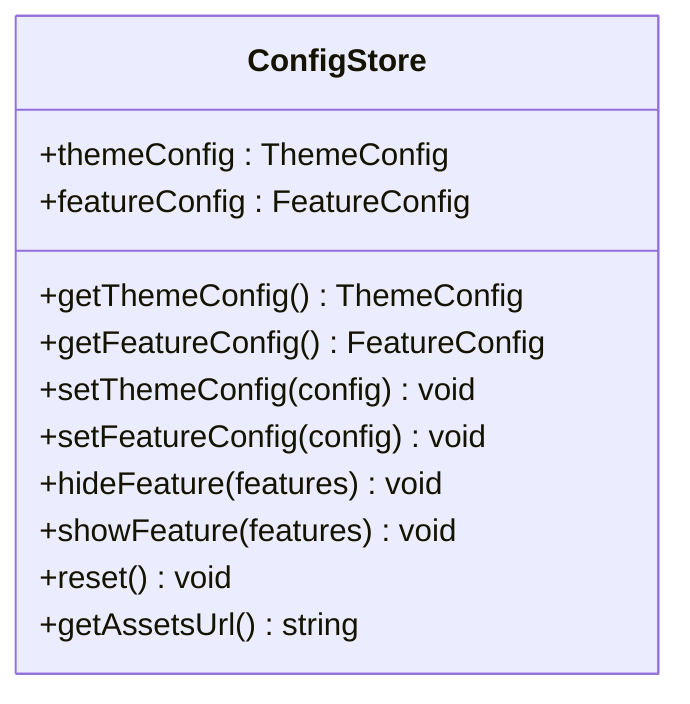
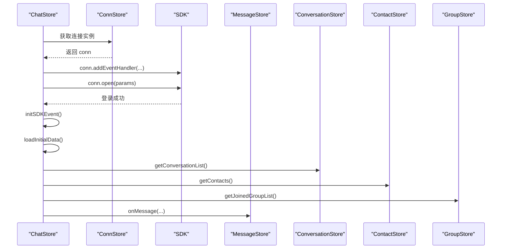
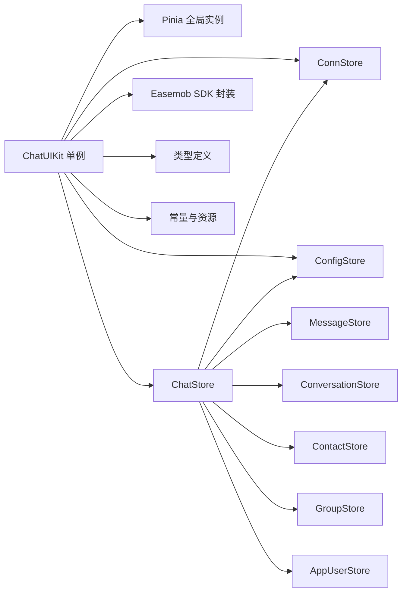

# API参考

<cite>
**本文引用的文件**
- [ChatUIKit/index.ts](file://ChatUIKit/index.ts)
- [ChatUIKit/sdk.ts](file://ChatUIKit/sdk.ts)
- [ChatUIKit/stores/index.ts](file://ChatUIKit/stores/index.ts)
- [ChatUIKit/stores/conn.ts](file://ChatUIKit/stores/conn.ts)
- [ChatUIKit/stores/config.ts](file://ChatUIKit/stores/config.ts)
- [ChatUIKit/stores/chat.ts](file://ChatUIKit/stores/chat.ts)
- [ChatUIKit/types/index.ts](file://ChatUIKit/types/index.ts)
- [ChatUIKit/configType.ts](file://ChatUIKit/configType.ts)
- [ChatUIKit/const/index.ts](file://ChatUIKit/const/index.ts)
- [ChatUIKit/log.ts](file://ChatUIKit/log.ts)
- [demo/main.js](file://demo/main.js)
- [demo/pages/Login/index.vue](file://demo/pages/Login/index.vue)
- [demo/const/index.ts](file://demo/const/index.ts)
- [demo/ChatUIKit/stores/appUser.ts](file://demo/ChatUIKit/stores/appUser.ts)
</cite>

## 目录
1. [简介](#简介)
2. [项目结构](#项目结构)
3. [核心组件](#核心组件)
4. [架构总览](#架构总览)
5. [详细组件分析](#详细组件分析)
6. [依赖关系分析](#依赖关系分析)
7. [性能与优化](#性能与优化)
8. [故障排查指南](#故障排查指南)
9. [结论](#结论)
10. [附录](#附录)

## 简介
本文件为 Easemob UIKit（UniApp/Vue3）的完整 API 参考，覆盖初始化、连接管理、配置与主题、事件处理、登录登出、消息与会话、联系人与群组、用户状态与资料、以及调试与性能优化等。文档以“可读性优先”的原则，结合仓库内现有实现进行说明，并通过图示展示关键流程。

## 项目结构
- 核心入口与单例：ChatUIKit/index.ts 提供全局单例 ChatUIKit，封装初始化、连接获取、主题与功能配置访问、生命周期联动等。
- 存储层（Pinia）：stores 目录下按领域拆分，如 conn.ts（连接）、config.ts（主题/功能配置）、chat.ts（事件与登录登出）、message/contact/group 等。
- SDK 封装：sdk.ts 对接 easemob-websdk 的 uniApp 版本，导出类型与实例。
- 类型系统：types/index.ts 定义 UIKIT 使用的消息、会话、状态、通知等类型。
- 常量与资源：const/index.ts 定义资源地址、最大消息数、群组成员分页大小、@相关常量等。
- 日志：log.ts 提供统一日志工具，支持按需开启调试。
- 示例工程：demo 展示如何在 Vue3 应用中接入 ChatUIKit 并完成登录流程。

图表来源
- [ChatUIKit/index.ts](file://ChatUIKit/index.ts#L1-L139)
- [ChatUIKit/stores/index.ts](file://ChatUIKit/stores/index.ts#L1-L31)
- [ChatUIKit/stores/conn.ts](file://ChatUIKit/stores/conn.ts#L1-L84)
- [ChatUIKit/stores/chat.ts](file://ChatUIKit/stores/chat.ts#L1-L407)
- [ChatUIKit/stores/config.ts](file://ChatUIKit/stores/config.ts#L1-L124)
- [ChatUIKit/sdk.ts](file://ChatUIKit/sdk.ts#L1-L13)
- [ChatUIKit/types/index.ts](file://ChatUIKit/types/index.ts#L1-L100)
- [ChatUIKit/const/index.ts](file://ChatUIKit/const/index.ts#L1-L37)
- [ChatUIKit/log.ts](file://ChatUIKit/log.ts#L1-L78)
- [demo/main.js](file://demo/main.js#L1-L28)
- [demo/pages/Login/index.vue](file://demo/pages/Login/index.vue#L1-L332)

章节来源
- [ChatUIKit/index.ts](file://ChatUIKit/index.ts#L1-L139)
- [ChatUIKit/stores/index.ts](file://ChatUIKit/stores/index.ts#L1-L31)

## 核心组件
本节聚焦 ChatUIKit 单例提供的公共 API，包括初始化、连接获取、主题与功能配置访问、生命周期联动与 Pinia 获取等。

- ChatUIKit.init(params)
  - 功能：初始化 UIKit，设置主题配置、注入 IM 连接实例、可选开启调试日志。
  - 参数：
    - params.chat: IM SDK 的连接实例（类型来自 SDK 封装）。
    - params.config.theme: 主题配置对象（含 avatarShape 等）。
    - params.config.isDebug: 是否启用调试日志。
  - 行为：若连接实例已存在则不重复初始化；设置主题配置；记录调试开关；标记已初始化。
  - 注意：初始化后可通过 getChatConn() 获取连接实例；getThemeConfig()/getFeatureConfig() 返回当前配置快照。
  - 章节来源
    - [ChatUIKit/index.ts](file://ChatUIKit/index.ts#L84-L96)
    - [ChatUIKit/configType.ts](file://ChatUIKit/configType.ts#L55-L65)

- ChatUIKit.getChatConn()
  - 功能：返回当前 IM 连接实例。
  - 行为：内部通过 connStore.getChatConn 访问；若未初始化会抛出异常。
  - 章节来源
    - [ChatUIKit/index.ts](file://ChatUIKit/index.ts#L98-L101)
    - [ChatUIKit/stores/conn.ts](file://ChatUIKit/stores/conn.ts#L25-L34)

- ChatUIKit.getThemeConfig()
  - 功能：返回当前主题配置对象。
  - 章节来源
    - [ChatUIKit/index.ts](file://ChatUIKit/index.ts#L102-L105)
    - [ChatUIKit/stores/config.ts](file://ChatUIKit/stores/config.ts#L65-L74)

- ChatUIKit.getFeatureConfig()
  - 功能：返回当前功能配置对象。
  - 章节来源
    - [ChatUIKit/index.ts](file://ChatUIKit/index.ts#L106-L109)
    - [ChatUIKit/stores/config.ts](file://ChatUIKit/stores/config.ts#L71-L74)

- ChatUIKit.hideFeature(features)
  - 功能：隐藏指定功能项（传入 FeatureConfig 的键名数组）。
  - 章节来源
    - [ChatUIKit/index.ts](file://ChatUIKit/index.ts#L110-L113)
    - [ChatUIKit/stores/config.ts](file://ChatUIKit/stores/config.ts#L97-L113)

- ChatUIKit.onShow()
  - 功能：在应用 onShow 生命周期调用，检测并维护 IM 连接有效性（仅当已登录时）。
  - 章节来源
    - [ChatUIKit/index.ts](file://ChatUIKit/index.ts#L114-L125)

- ChatUIKit.getPinia()
  - 功能：返回全局 Pinia 实例，便于在应用入口注册。
  - 章节来源
    - [ChatUIKit/index.ts](file://ChatUIKit/index.ts#L127-L131)

章节来源
- [ChatUIKit/index.ts](file://ChatUIKit/index.ts#L84-L131)
- [ChatUIKit/configType.ts](file://ChatUIKit/configType.ts#L55-L65)
- [ChatUIKit/stores/config.ts](file://ChatUIKit/stores/config.ts#L65-L113)
- [ChatUIKit/stores/conn.ts](file://ChatUIKit/stores/conn.ts#L25-L34)

## 架构总览
下图展示应用启动、初始化、登录与事件处理的关键交互：

图表来源
- [demo/main.js](file://demo/main.js#L14-L27)
- [ChatUIKit/index.ts](file://ChatUIKit/index.ts#L84-L96)
- [ChatUIKit/stores/conn.ts](file://ChatUIKit/stores/conn.ts#L42-L63)
- [ChatUIKit/stores/chat.ts](file://ChatUIKit/stores/chat.ts#L299-L328)
- [ChatUIKit/sdk.ts](file://ChatUIKit/sdk.ts#L1-L13)

## 详细组件分析

### 连接管理（ConnStore）
- 职责：管理 IM 连接实例，提供初始化、关闭、清空与访问器。
- 关键点：
  - getChatConn：未初始化时抛错，避免空引用。
  - initChatConn：首次初始化时创建 SDK 连接实例。
  - closeConnection：关闭连接并清空状态。
- 章节来源
  - [ChatUIKit/stores/conn.ts](file://ChatUIKit/stores/conn.ts#L1-L84)

图表来源
- [ChatUIKit/stores/conn.ts](file://ChatUIKit/stores/conn.ts#L15-L82)

### 配置管理（ConfigStore）
- 职责：统一管理主题与功能配置，支持设置、隐藏/显示、重置与资源地址访问。
- 关键点：
  - 默认主题：avatarShape(circle|square)。
  - 默认功能：输入区、消息、消息操作、会话、其他等全量开启。
  - hideFeature/showFeature：批量控制功能开关。
- 章节来源
  - [ChatUIKit/stores/config.ts](file://ChatUIKit/stores/config.ts#L1-L124)
  - [ChatUIKit/configType.ts](file://ChatUIKit/configType.ts#L3-L67)

图表来源
- [ChatUIKit/stores/config.ts](file://ChatUIKit/stores/config.ts#L59-L123)

### 聊天状态与事件（ChatStore）
- 职责：协调连接状态、SDK 事件监听、登录/登出、初始数据加载、消息与群组事件处理。
- 关键点：
  - initSDKEvent：注册多种 SDK 事件（连接、文本/图片/语音/视频/文件/自定义消息、撤回、已读、联系人、群组、会话置顶/免打扰等）。
  - login/logout：封装 SDK open/close，初始化事件与初始数据，清理 Store。
  - loadInitialData：登录后拉取会话列表、置顶会话、联系人、群组。
  - onShow：在应用 onShow 时调用 SDK onShow 维持连接。
- 章节来源
  - [ChatUIKit/stores/chat.ts](file://ChatUIKit/stores/chat.ts#L1-L407)

图表来源
- [ChatUIKit/stores/chat.ts](file://ChatUIKit/stores/chat.ts#L67-L221)
- [ChatUIKit/stores/conn.ts](file://ChatUIKit/stores/conn.ts#L25-L34)

### 类型与常量
- 类型：定义消息体、会话、状态、通知、提及类型、连接状态、用户信息扩展等。
- 常量：资源地址、最大消息数、群组成员分页大小、@ALL、在线状态列表等。
- 章节来源
  - [ChatUIKit/types/index.ts](file://ChatUIKit/types/index.ts#L1-L100)
  - [ChatUIKit/const/index.ts](file://ChatUIKit/const/index.ts#L1-L37)

### 日志与调试
- Logger：单例日志工具，支持启用/禁用调试模式，提供 info/warn/error/log 等方法。
- 章节来源
  - [ChatUIKit/log.ts](file://ChatUIKit/log.ts#L1-L78)

## 依赖关系分析
- ChatUIKit 单例依赖 Pinia（全局实例由 ChatUIKit 管理），并通过各 Store 协调业务。
- Store 之间存在领域耦合：ChatStore 依赖 ConnStore、ConfigStore、Message/Conversation/Contact/Group/AppUser 等 Store。
- SDK 依赖 easemob-websdk 的 uniApp 版本，类型与实例通过 sdk.ts 暴露。
- 常量与资源路径集中于 const/index.ts，便于替换与定制。

图表来源
- [ChatUIKit/index.ts](file://ChatUIKit/index.ts#L1-L139)
- [ChatUIKit/stores/index.ts](file://ChatUIKit/stores/index.ts#L1-L31)
- [ChatUIKit/stores/chat.ts](file://ChatUIKit/stores/chat.ts#L1-L407)
- [ChatUIKit/sdk.ts](file://ChatUIKit/sdk.ts#L1-L13)
- [ChatUIKit/types/index.ts](file://ChatUIKit/types/index.ts#L1-L100)
- [ChatUIKit/const/index.ts](file://ChatUIKit/const/index.ts#L1-L37)

章节来源
- [ChatUIKit/stores/index.ts](file://ChatUIKit/stores/index.ts#L1-L31)
- [ChatUIKit/stores/chat.ts](file://ChatUIKit/stores/chat.ts#L1-L407)

## 性能与优化
- 初始数据加载策略：登录成功后优先拉取全部会话列表，再按需拉取置顶会话，减少二次请求。
- 连接状态管理：通过 ChatStore 统一维护连接状态（none/reconnecting/connected/disconnected），避免重复初始化事件监听。
- 资源访问：静态资源托管于远端存在访问频率限制，建议迁移至自有服务器并修改资源地址。
- 日志控制：生产环境建议关闭调试日志，降低 I/O 开销。
- 章节来源
  - [ChatUIKit/stores/chat.ts](file://ChatUIKit/stores/chat.ts#L377-L396)
  - [ChatUIKit/const/index.ts](file://ChatUIKit/const/index.ts#L7-L8)
  - [ChatUIKit/log.ts](file://ChatUIKit/log.ts#L18-L30)

## 故障排查指南
- 连接未初始化
  - 现象：调用 getChatConn 抛错。
  - 原因：未先执行 ChatUIKit.init 注入连接实例。
  - 处理：确保在应用启动早期调用 init，并传入有效的 SDK 连接实例。
  - 章节来源
    - [ChatUIKit/stores/conn.ts](file://ChatUIKit/stores/conn.ts#L25-L34)

- 登录失败
  - 现象：login 抛错或返回错误描述。
  - 原因：网络、凭证错误、服务端限流或鉴权失败。
  - 处理：检查凭证、网络与服务端返回；查看日志定位；必要时重试或切换服务器。
  - 章节来源
    - [ChatUIKit/stores/chat.ts](file://ChatUIKit/stores/chat.ts#L299-L328)
    - [demo/pages/Login/index.vue](file://demo/pages/Login/index.vue#L165-L198)

- 断线重连
  - 现象：连接状态变为 disconnected/reconnecting。
  - 处理：ChatStore 已自动维护状态；在 onShow 生命周期调用 ChatUIKit.onShow 以恢复连接。
  - 章节来源
    - [ChatUIKit/stores/chat.ts](file://ChatUIKit/stores/chat.ts#L67-L88)
    - [ChatUIKit/index.ts](file://ChatUIKit/index.ts#L114-L125)

- 调试与日志
  - 建议：在开发阶段启用调试日志，观察 SDK 事件与数据流；生产关闭调试。
  - 章节来源
    - [ChatUIKit/log.ts](file://ChatUIKit/log.ts#L18-L74)

## 结论
本参考文档梳理了 ChatUIKit 的核心 API、数据流与事件处理机制，明确了初始化、连接管理、配置与主题、登录登出、消息与会话、联系人与群组、用户状态与资料等关键能力。结合示例工程，开发者可快速集成并稳定运行即时通讯功能。

## 附录

### HTTP 方法、URL 模式与认证
- 登录方式（示例页面展示）
  - 用户名/密码登录：调用业务侧接口获取 token，随后以 accessToken 方式登录。
  - 手机号/验证码登录：调用业务侧接口获取 token，随后以 accessToken 方式登录。
- 请求/响应要点
  - 登录接口返回 token 与 chatUserName；随后使用 SDK conn.open({ user, accessToken }) 完成 IM 登录。
  - 错误信息通过响应体的 errorInfo 字段体现，前端可据此提示用户。
- 服务器配置
  - 示例工程通过 demo/const/index.ts 读取服务端配置（APPKEY、API_URL、URL），用于构建登录与资源访问。
- 章节来源
  - [demo/pages/Login/index.vue](file://demo/pages/Login/index.vue#L134-L152)
  - [demo/pages/Login/index.vue](file://demo/pages/Login/index.vue#L206-L241)
  - [demo/const/index.ts](file://demo/const/index.ts#L1-L31)

### WebSocket API 与实时交互
- 连接处理
  - SDK 通过 chatSDK.connection(options) 创建连接；连接参数由业务侧提供（示例工程使用 demo/const/index.ts 中的 URL）。
  - ChatStore.initSDKEvent 注册 SDK 事件处理器，涵盖连接、消息、联系人、群组、会话等事件。
- 消息格式与事件类型
  - 文本/图片/语音/视频/文件/自定义消息事件分别对应 onTextMessage/onImageMessage/onAudioMessage/onVideoMessage/onFileMessage/onCustomMessage。
  - 撤回消息 onRecallMessage、已读 onReadMessage、联系人邀请/同意/拒绝/删除 onContactInvited/onContactAgreed/onContactRefuse/onContactDeleted/onContactAdded/onContactDeleted、群组事件 onGroupEvent、会话删除/已读/置顶/免打扰等均有对应处理。
- 实时交互模式
  - 登录后自动初始化事件监听；消息到达时交由 MessageStore 处理并异步拉取发送者信息；群组事件触发群详情刷新或新增/移除群组。
- 章节来源
  - [ChatUIKit/stores/chat.ts](file://ChatUIKit/stores/chat.ts#L67-L221)
  - [ChatUIKit/stores/chat.ts](file://ChatUIKit/stores/chat.ts#L226-L294)
  - [ChatUIKit/stores/conn.ts](file://ChatUIKit/stores/conn.ts#L54-L63)
  - [demo/const/index.ts](file://demo/const/index.ts#L8-L10)

### 协议特定示例与最佳实践
- 协议示例
  - 登录流程：见 demo/pages/Login/index.vue 的 loginWithPassword 与 loginWithTel。
  - 连接初始化：见 ChatUIKit/index.ts 的 init 与 ChatUIKit.getPinia。
- 最佳实践
  - 在应用入口注册全局 Pinia（ChatUIKit.getPinia），保证 Store 全局一致性。
  - 在 onShow 生命周期调用 ChatUIKit.onShow，维持连接有效性。
  - 按需隐藏功能项（hideFeature），减少 UI 与交互复杂度。
  - 将静态资源迁移至自有服务器，避免远端访问限制。
- 章节来源
  - [demo/main.js](file://demo/main.js#L14-L27)
  - [ChatUIKit/index.ts](file://ChatUIKit/index.ts#L114-L131)
  - [ChatUIKit/stores/config.ts](file://ChatUIKit/stores/config.ts#L97-L113)
  - [ChatUIKit/const/index.ts](file://ChatUIKit/const/index.ts#L7-L8)

### 错误处理策略
- 连接未初始化：捕获 getChatConn 抛错，提示先初始化。
- 登录失败：捕获 login 抛错，解析服务端返回的错误信息并提示用户。
- 事件处理：对异常分支记录日志，避免影响主流程。
- 章节来源
  - [ChatUIKit/stores/conn.ts](file://ChatUIKit/stores/conn.ts#L25-L34)
  - [ChatUIKit/stores/chat.ts](file://ChatUIKit/stores/chat.ts#L324-L327)

### 安全考虑
- 凭证保护：登录使用的 token 与用户 ID 应安全存储，避免明文泄露。
- 传输安全：服务端地址采用 HTTPS/WSS，防止中间人攻击。
- 资源访问：静态资源建议迁移至自有服务器，避免被风控或限速。
- 章节来源
  - [demo/pages/Login/index.vue](file://demo/pages/Login/index.vue#L170-L175)
  - [demo/const/index.ts](file://demo/const/index.ts#L8-L10)
  - [ChatUIKit/const/index.ts](file://ChatUIKit/const/index.ts#L7-L8)

### 速率限制与版本信息
- 速率限制：静态资源访问存在频率限制，建议迁移至自有服务器。
- 版本信息：示例工程中包含版本标识（见 demo/pages/Login/index.vue 的版本展示）。
- 章节来源
  - [ChatUIKit/README.md](file://ChatUIKit/README.md#L56-L58)
  - [demo/pages/Login/index.vue](file://demo/pages/Login/index.vue#L5)

### 常见用例与客户端实现指南
- 快速集成
  - 在应用入口注册 ChatUIKit.getPinia。
  - 调用 ChatUIKit.init 注入 SDK 连接实例与配置。
  - 在登录页完成登录后跳转会话列表。
- 客户端实现要点
  - 使用 Pinia 管理状态，避免跨组件共享复杂状态。
  - 在 onShow 生命周期调用 ChatUIKit.onShow。
  - 按需隐藏功能项，提升用户体验。
- 章节来源
  - [demo/main.js](file://demo/main.js#L14-L27)
  - [ChatUIKit/index.ts](file://ChatUIKit/index.ts#L84-L131)
  - [ChatUIKit/stores/config.ts](file://ChatUIKit/stores/config.ts#L97-L113)

### 调试工具与监控方法
- 调试工具
  - 启用调试日志：ChatUIKit.init 时传入 config.isDebug=true。
  - 观察 SDK 事件：在 ChatStore.initSDKEvent 中查看事件回调日志。
- 监控方法
  - 连接状态：通过 ChatStore.getConnState 获取当前状态。
  - 登录/登出：在登录与登出前后记录日志，便于定位问题。
- 章节来源
  - [ChatUIKit/index.ts](file://ChatUIKit/index.ts#L92-L95)
  - [ChatUIKit/stores/chat.ts](file://ChatUIKit/stores/chat.ts#L39-L51)
  - [ChatUIKit/log.ts](file://ChatUIKit/log.ts#L18-L74)