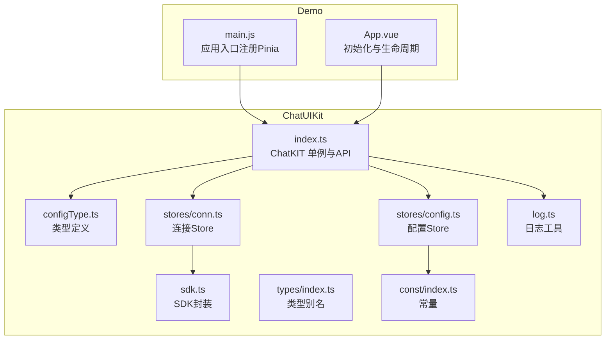
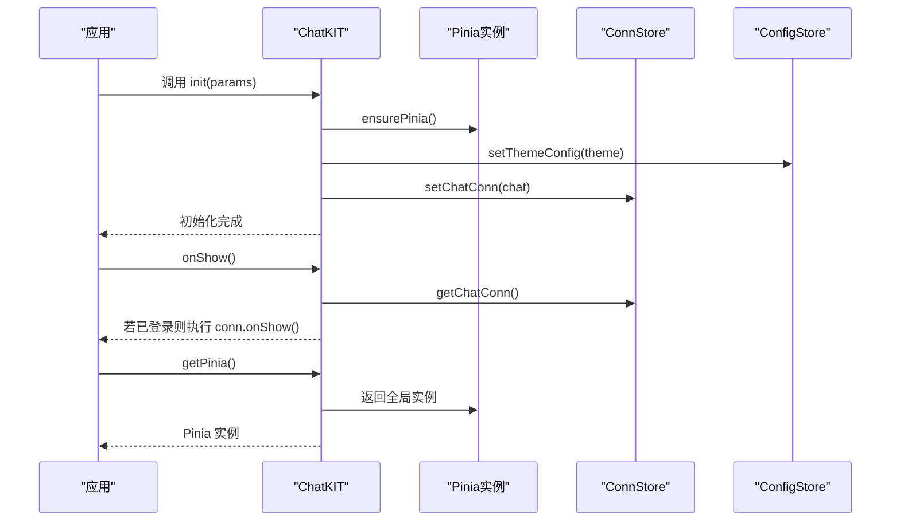
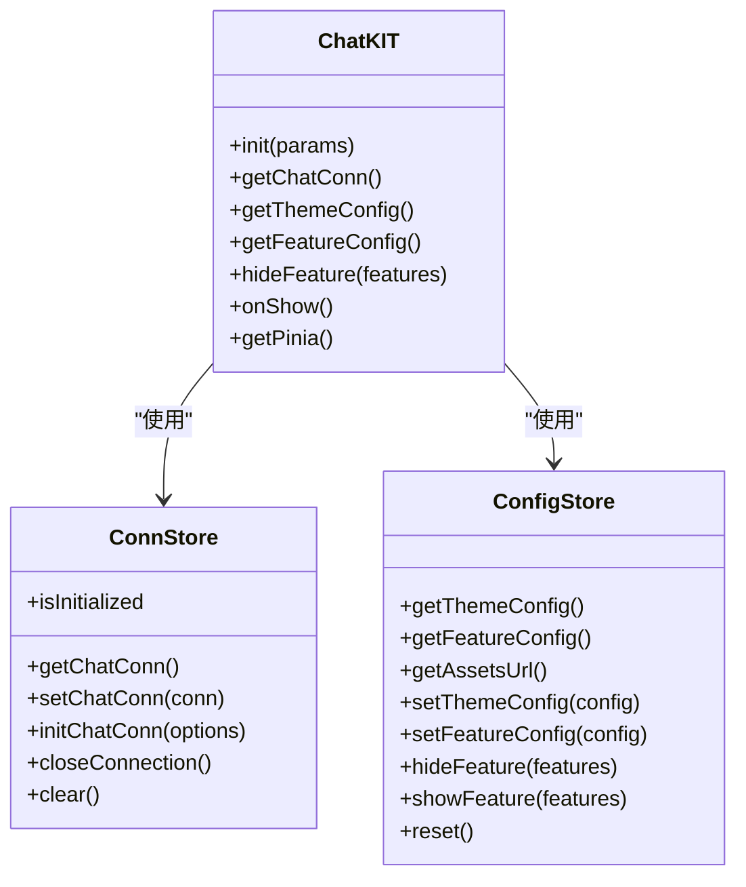
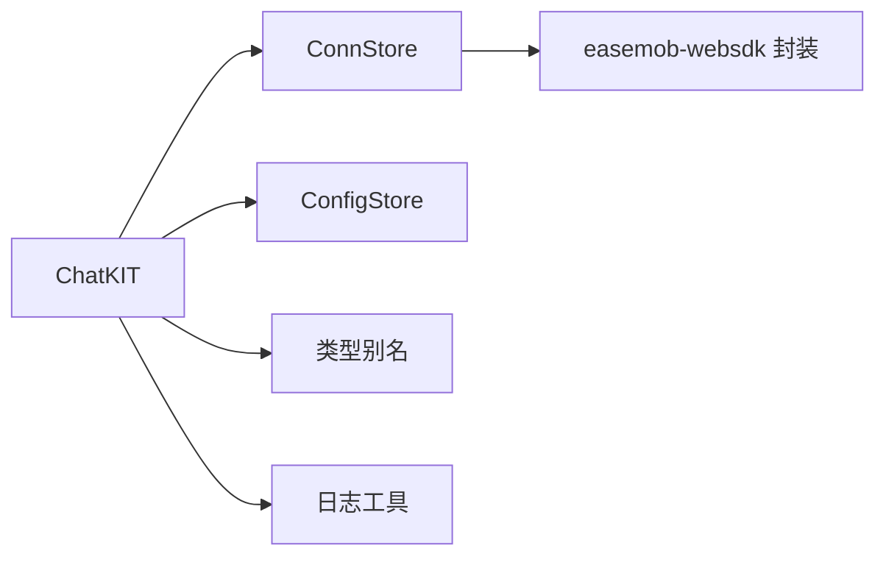
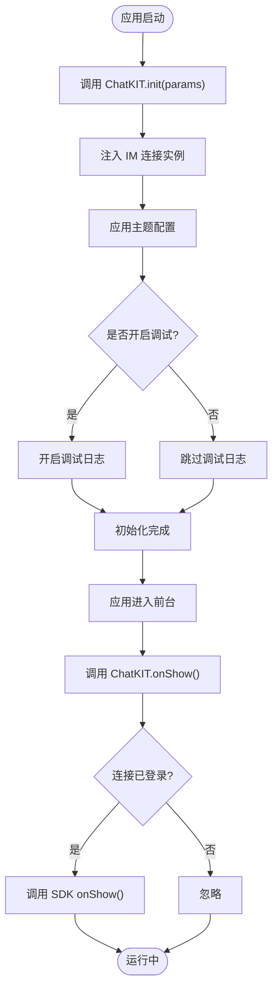

# 核心API

<cite>
**本文引用的文件**
- [ChatUIKit/index.ts](file://ChatUIKit/index.ts)
- [ChatUIKit/configType.ts](file://ChatUIKit/configType.ts)
- [ChatUIKit/stores/config.ts](file://ChatUIKit/stores/config.ts)
- [ChatUIKit/stores/conn.ts](file://ChatUIKit/stores/conn.ts)
- [ChatUIKit/sdk.ts](file://ChatUIKit/sdk.ts)
- [ChatUIKit/types/index.ts](file://ChatUIKit/types/index.ts)
- [ChatUIKit/log.ts](file://ChatUIKit/log.ts)
- [ChatUIKit/const/index.ts](file://ChatUIKit/const/index.ts)
- [demo/App.vue](file://demo/App.vue)
- [demo/main.js](file://demo/main.js)
- [README.md](file://README.md)
</cite>

## 目录
1. [简介](#简介)
2. [项目结构](#项目结构)
3. [核心组件](#核心组件)
4. [架构总览](#架构总览)
5. [详细组件分析](#详细组件分析)
6. [依赖分析](#依赖分析)
7. [性能考虑](#性能考虑)
8. [故障排查指南](#故障排查指南)
9. [结论](#结论)
10. [附录](#附录)

## 简介
本文件为 Easemob UIKit 的核心 API 参考文档，聚焦 ChatKIT 类的公共方法与配置体系，涵盖初始化、连接获取、主题与功能配置、功能隐藏、生命周期检测以及全局 Pinia 实例获取等关键能力。文档同时提供方法签名、参数与返回值说明、使用场景、调用示例路径、参数校验规则、异常处理策略与最佳实践，帮助开发者正确集成与扩展组件库。

## 项目结构
- ChatUIKit 为核心包，包含入口、类型、配置、存储、SDK 封装与日志等模块。
- demo 为示例工程，演示如何在应用生命周期中正确初始化与使用 ChatKIT。

图表来源
- [ChatUIKit/index.ts](file://ChatUIKit/index.ts#L1-L139)
- [ChatUIKit/configType.ts](file://ChatUIKit/configType.ts#L1-L68)
- [ChatUIKit/stores/config.ts](file://ChatUIKit/stores/config.ts#L1-L124)
- [ChatUIKit/stores/conn.ts](file://ChatUIKit/stores/conn.ts#L1-L84)
- [ChatUIKit/sdk.ts](file://ChatUIKit/sdk.ts#L1-L13)
- [ChatUIKit/types/index.ts](file://ChatUIKit/types/index.ts#L1-L100)
- [ChatUIKit/log.ts](file://ChatUIKit/log.ts#L1-L78)
- [ChatUIKit/const/index.ts](file://ChatUIKit/const/index.ts#L1-L37)
- [demo/main.js](file://demo/main.js#L1-L28)
- [demo/App.vue](file://demo/App.vue#L1-L134)

章节来源
- [README.md](file://README.md#L1-L63)
- [ChatUIKit/index.ts](file://ChatUIKit/index.ts#L1-L139)
- [demo/App.vue](file://demo/App.vue#L1-L134)

## 核心组件
- ChatKIT 单例：提供初始化、连接获取、主题与功能配置、功能隐藏、生命周期检测、全局 Pinia 获取等公共 API。
- 配置 Store：集中管理主题与功能配置，支持默认值、覆盖与隐藏/显示控制。
- 连接 Store：封装 IM SDK 连接实例，提供类型安全的访问与初始化能力。
- 日志工具：统一调试日志输出，支持按需开启/关闭。
- 类型系统：对 SDK 类型进行二次封装，提供 UIKIT 使用所需的类型别名与约束。

章节来源
- [ChatUIKit/index.ts](file://ChatUIKit/index.ts#L18-L132)
- [ChatUIKit/stores/config.ts](file://ChatUIKit/stores/config.ts#L1-L124)
- [ChatUIKit/stores/conn.ts](file://ChatUIKit/stores/conn.ts#L1-L84)
- [ChatUIKit/log.ts](file://ChatUIKit/log.ts#L1-L78)
- [ChatUIKit/types/index.ts](file://ChatUIKit/types/index.ts#L1-L100)

## 架构总览
ChatKIT 通过延迟初始化机制确保在首次使用时才创建并激活 Pinia；随后通过 Store 层完成配置与连接的注入与管理。应用层在启动与前台可见时调用 ChatKIT 的生命周期方法以维持连接有效性。

图表来源
- [ChatUIKit/index.ts](file://ChatUIKit/index.ts#L84-L131)
- [ChatUIKit/stores/conn.ts](file://ChatUIKit/stores/conn.ts#L25-L40)
- [ChatUIKit/stores/config.ts](file://ChatUIKit/stores/config.ts#L82-L95)

## 详细组件分析

### ChatKIT 类与公共API

- 单例与延迟初始化
  - ChatKIT 为单例，内部维护全局 Pinia 实例并在首次使用时创建并激活。
  - Store 访问采用 getter 延迟初始化，避免在构造阶段产生副作用。

- 方法清单与说明
  - init(params: ChatUIKitInitParams)
    - 参数
      - chat: IM SDK 连接实例（类型由 SDK 封装提供）
      - config.theme: 主题配置对象
      - config.isDebug: 是否开启调试日志
    - 行为
      - 若已存在连接实例则直接返回
      - 写入主题配置
      - 注入 IM 连接实例
      - 按需开启调试日志
      - 标记初始化完成
    - 异常处理
      - 连接实例缺失时由连接 Store 的 getter 抛出明确错误
    - 最佳实践
      - 在应用启动早期调用，确保后续组件可直接使用
      - 仅在必要时开启 isDebug，避免生产环境过多日志
    - 示例路径
      - [demo/App.vue](file://demo/App.vue#L24-L32)

  - getChatConn()
    - 行为
      - 返回连接 Store 中的 IM 连接实例
      - 若未初始化则抛出错误
    - 返回值
      - 类型为 SDK 定义的连接实例
    - 使用场景
      - 获取 accessToken、调用 SDK 方法（如 recallMessage、request 等）
    - 示例路径
      - [demo/App.vue](file://demo/App.vue#L51-L51)

  - getThemeConfig()
    - 行为
      - 返回当前主题配置快照
    - 返回值
      - ThemeConfig 对象
    - 使用场景
      - UI 渲染时依据头像形状等配置调整样式
    - 示例路径
      - [demo/App.vue](file://demo/App.vue#L27-L29)

  - getFeatureConfig()
    - 行为
      - 返回当前功能配置快照
    - 返回值
      - FeatureConfig 对象
    - 使用场景
      - 动态控制输入区、消息操作、会话管理等功能开关
    - 示例路径
      - [ChatUIKit/stores/config.ts](file://ChatUIKit/stores/config.ts#L65-L74)

  - hideFeature(features: Array<keyof FeatureConfig>)
    - 参数
      - features: 功能键数组（FeatureConfig 的键）
    - 行为
      - 将指定功能标记为禁用
    - 使用场景
      - 按业务需求隐藏特定功能（如复制、撤回、文件等）
    - 示例路径
      - [demo/App.vue](file://demo/App.vue#L34-L34)

  - onShow()
    - 行为
      - 在应用前台可见时检查连接状态，若处于登录态则调用 SDK 的 onShow
      - 若连接 Store 未初始化则静默忽略
    - 使用场景
      - 保证网络切换或后台返回前台后连接有效性
    - 示例路径
      - [demo/App.vue](file://demo/App.vue#L121-L124)

  - getPinia()
    - 行为
      - 确保 Pinia 已创建并激活，返回全局实例
    - 返回值
      - Pinia 实例
    - 使用场景
      - 在应用入口注册 Pinia，确保全局状态一致
    - 示例路径
      - [demo/main.js](file://demo/main.js#L22-L23)

- 方法签名与类型来源
  - ChatUIKitInitParams、FeatureConfig、ThemeConfig 定义于配置类型文件
  - SDK 类型通过 SDK 封装导出
  - 类型别名与扩展见类型文件

章节来源
- [ChatUIKit/index.ts](file://ChatUIKit/index.ts#L84-L131)
- [ChatUIKit/configType.ts](file://ChatUIKit/configType.ts#L55-L65)
- [ChatUIKit/types/index.ts](file://ChatUIKit/types/index.ts#L1-L100)
- [ChatUIKit/sdk.ts](file://ChatUIKit/sdk.ts#L1-L13)

### 配置与连接 Store

- 配置 Store（ConfigStore）
  - 默认主题与功能配置
    - 主题：头像形状默认圆角
    - 功能：默认全部开启
  - Getter
    - getThemeConfig、getFeatureConfig、getAssetsUrl
  - Action
    - setThemeConfig、setFeatureConfig、hideFeature、showFeature、reset
  - 使用建议
    - 通过 hideFeature/showFeature 精细化控制功能开关
    - 通过 setThemeConfig 覆盖默认主题

- 连接 Store（ConnStore）
  - Getter
    - getChatConn：若未初始化则抛错
    - isInitialized：判断连接是否已设置
  - Action
    - setChatConn：注入 IM 连接实例
    - initChatConn：按参数创建连接实例（若未初始化）
    - closeConnection：关闭连接并清空状态
    - clear：清空连接状态
  - 使用建议
    - 在 ChatKIT.init 中完成连接注入
    - 在登出或退出时调用 closeConnection 并 clear

图表来源
- [ChatUIKit/stores/config.ts](file://ChatUIKit/stores/config.ts#L59-L123)
- [ChatUIKit/stores/conn.ts](file://ChatUIKit/stores/conn.ts#L20-L83)
- [ChatUIKit/index.ts](file://ChatUIKit/index.ts#L84-L131)

章节来源
- [ChatUIKit/stores/config.ts](file://ChatUIKit/stores/config.ts#L1-L124)
- [ChatUIKit/stores/conn.ts](file://ChatUIKit/stores/conn.ts#L1-L84)

### 类型与SDK封装

- 类型别名
  - 对 SDK 的类型进行二次封装，提供 UIKIT 使用所需的类型别名与扩展（如 MixedMessageBody、UIKITConversationItem、ConnState 等）
- SDK 封装
  - 统一导出 SDK 静态类与类型，便于 ChatKIT 与各 Store 使用

章节来源
- [ChatUIKit/types/index.ts](file://ChatUIKit/types/index.ts#L1-L100)
- [ChatUIKit/sdk.ts](file://ChatUIKit/sdk.ts#L1-L13)

### 日志与常量

- 日志工具
  - 提供调试模式开关与多级日志输出，便于问题定位
- 常量
  - 包含资源地址、最大消息数、群成员分页大小、支持的 Presence 状态等

章节来源
- [ChatUIKit/log.ts](file://ChatUIKit/log.ts#L1-L78)
- [ChatUIKit/const/index.ts](file://ChatUIKit/const/index.ts#L1-L37)

## 依赖分析
- ChatKIT 依赖
  - stores：通过 getter 延迟访问各 Store，降低耦合
  - configType：提供类型约束
  - log：统一日志输出
- Store 间关系
  - ConfigStore 与 ConnStore 由 ChatKIT 统一协调
  - ConnStore 依赖 SDK 封装以创建与管理连接
- 外部依赖
  - easemob-websdk（通过 SDK 封装导入）

图表来源
- [ChatUIKit/index.ts](file://ChatUIKit/index.ts#L1-L139)
- [ChatUIKit/stores/conn.ts](file://ChatUIKit/stores/conn.ts#L1-L84)
- [ChatUIKit/sdk.ts](file://ChatUIKit/sdk.ts#L1-L13)
- [ChatUIKit/types/index.ts](file://ChatUIKit/types/index.ts#L1-L100)
- [ChatUIKit/log.ts](file://ChatUIKit/log.ts#L1-L78)

章节来源
- [ChatUIKit/index.ts](file://ChatUIKit/index.ts#L1-L139)
- [ChatUIKit/stores/conn.ts](file://ChatUIKit/stores/conn.ts#L1-L84)
- [ChatUIKit/sdk.ts](file://ChatUIKit/sdk.ts#L1-L13)

## 性能考虑
- 延迟初始化
  - ChatKIT 与 Store 采用延迟初始化，避免应用启动时不必要的开销
- 日志控制
  - 仅在 isDebug 为 true 时输出调试日志，减少生产环境日志噪声
- 连接复用
  - 通过 ChatKIT.init 一次性注入连接实例，避免重复创建
- 功能开关
  - 使用 hideFeature 精准裁剪功能，减少渲染与交互成本

[本节为通用指导，不直接分析具体文件]

## 故障排查指南
- “连接未初始化”错误
  - 现象：调用 getChatConn 时抛出错误
  - 原因：未先调用 ChatKIT.init 注入连接实例
  - 处理：确保在应用启动早期完成初始化，并在调用前检查连接状态
  - 参考
    - [ChatUIKit/stores/conn.ts](file://ChatUIKit/stores/conn.ts#L25-L40)

- onShow 无效
  - 现象：应用回到前台后连接未刷新
  - 原因：未在应用生命周期中调用 ChatKIT.onShow 或连接未处于登录态
  - 处理：在应用 onShow 中调用 ChatKIT.onShow，并确认 conn.logout 为 false
  - 参考
    - [ChatUIKit/index.ts](file://ChatUIKit/index.ts#L114-L125)
    - [demo/App.vue](file://demo/App.vue#L121-L124)

- 功能未生效
  - 现象：隐藏/显示功能后 UI 未变化
  - 原因：未正确调用 hideFeature/showFeature 或未触发组件重新渲染
  - 处理：调用 hideFeature 后确保组件订阅了 getFeatureConfig 的变更
  - 参考
    - [ChatUIKit/stores/config.ts](file://ChatUIKit/stores/config.ts#L97-L113)

- 调试日志未输出
  - 现象：设置 isDebug=true 后无日志
  - 原因：未在 ChatKIT.init 中传入 config.isDebug
  - 处理：在初始化时传入 config.isDebug=true
  - 参考
    - [ChatUIKit/index.ts](file://ChatUIKit/index.ts#L94-L94)
    - [ChatUIKit/log.ts](file://ChatUIKit/log.ts#L18-L30)

章节来源
- [ChatUIKit/stores/conn.ts](file://ChatUIKit/stores/conn.ts#L25-L40)
- [ChatUIKit/index.ts](file://ChatUIKit/index.ts#L114-L125)
- [demo/App.vue](file://demo/App.vue#L121-L124)
- [ChatUIKit/stores/config.ts](file://ChatUIKit/stores/config.ts#L97-L113)
- [ChatUIKit/log.ts](file://ChatUIKit/log.ts#L18-L30)

## 结论
ChatKIT 通过清晰的 API 设计与延迟初始化机制，为应用提供了稳定、可配置且易于扩展的即时通讯 UI 能力。结合 ConfigStore 与 ConnStore，开发者可在启动阶段完成连接与配置注入，并在生命周期中保持连接有效性。建议遵循本文的最佳实践与排障指引，确保在多端环境下获得一致的用户体验。

[本节为总结性内容，不直接分析具体文件]

## 附录

### 完整初始化与使用流程（步骤图）

图表来源
- [ChatUIKit/index.ts](file://ChatUIKit/index.ts#L84-L125)
- [demo/App.vue](file://demo/App.vue#L24-L32)
- [demo/App.vue](file://demo/App.vue#L121-L124)

### 调用示例路径索引
- 初始化与主题配置
  - [demo/App.vue](file://demo/App.vue#L24-L32)
- 获取连接与使用 accessToken
  - [demo/App.vue](file://demo/App.vue#L51-L51)
- 隐藏功能
  - [demo/App.vue](file://demo/App.vue#L34-L34)
- 应用生命周期 onShow
  - [demo/App.vue](file://demo/App.vue#L121-L124)
- 注册全局 Pinia
  - [demo/main.js](file://demo/main.js#L22-L23)

章节来源
- [demo/App.vue](file://demo/App.vue#L24-L32)
- [demo/App.vue](file://demo/App.vue#L51-L51)
- [demo/App.vue](file://demo/App.vue#L121-L124)
- [demo/main.js](file://demo/main.js#L22-L23)