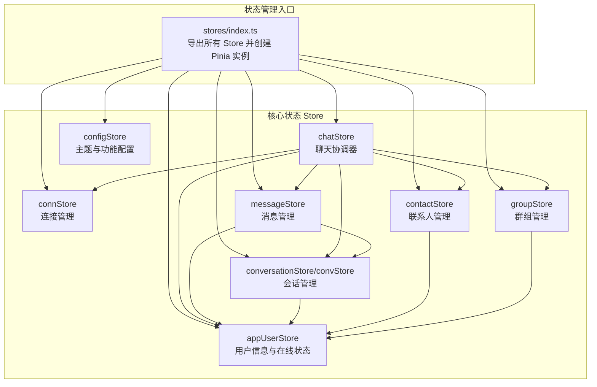
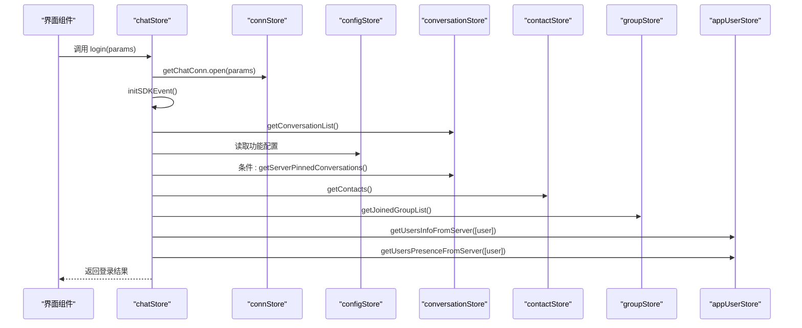
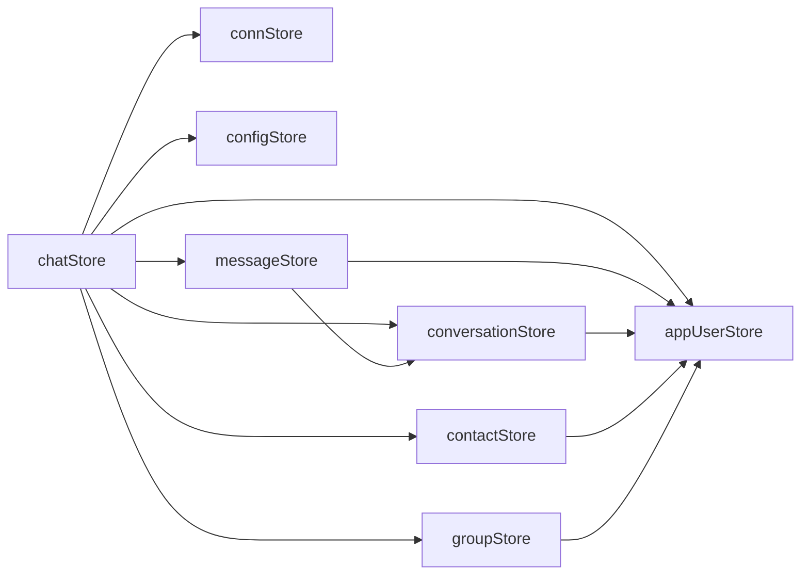

# 状态管理API

<cite>
**本文档引用的文件**
- [ChatUIKit/stores/index.ts](file://ChatUIKit/stores/index.ts)
- [ChatUIKit/stores/conn.ts](file://ChatUIKit/stores/conn.ts)
- [ChatUIKit/stores/message.ts](file://ChatUIKit/stores/message.ts)
- [ChatUIKit/stores/conversation.ts](file://ChatUIKit/stores/conversation.ts)
- [ChatUIKit/stores/contact.ts](file://ChatUIKit/stores/contact.ts)
- [ChatUIKit/stores/group.ts](file://ChatUIKit/stores/group.ts)
- [ChatUIKit/stores/appUser.ts](file://ChatUIKit/stores/appUser.ts)
- [ChatUIKit/stores/chat.ts](file://ChatUIKit/stores/chat.ts)
- [ChatUIKit/stores/config.ts](file://ChatUIKit/stores/config.ts)
- [ChatUIKit/types/index.ts](file://ChatUIKit/types/index.ts)
- [ChatUIKit/const/index.ts](file://ChatUIKit/const/index.ts)
- [ChatUIKit/sdk.ts](file://ChatUIKit/sdk.ts)
- [ChatUIKit/modules/Chat/index.vue](file://ChatUIKit/modules/Chat/index.vue)
</cite>

## 目录
1. [简介](#简介)
2. [项目结构](#项目结构)
3. [核心组件](#核心组件)
4. [架构概览](#架构概览)
5. [详细组件分析](#详细组件分析)
6. [依赖关系分析](#依赖关系分析)
7. [性能考虑](#性能考虑)
8. [故障排查指南](#故障排查指南)
9. [结论](#结论)

## 简介
本文件为 Easemob UIKit 状态管理系统 API 的权威参考文档，覆盖所有 Store 的公共方法与属性，包括连接状态管理（connStore）、消息状态管理（messageStore）、会话状态管理（conversationStore/convStore）、联系人状态管理（contactStore）、群组状态管理（groupStore）、用户状态管理（appUserStore）以及聊天状态管理（chatStore）。文档详细说明每个 Store 的职责、管理的数据类型、提供的方法与事件，并给出状态更新流程、数据同步机制与状态查询方法的使用示例路径。

## 项目结构
Easemob UIKit 采用 Pinia 状态管理，Store 位于 ChatUIKit/stores 目录，按功能模块划分，入口导出统一于 stores/index.ts。各 Store 通过依赖注入的方式协作，形成完整的 IM 应用状态闭环。

图表来源
- [ChatUIKit/stores/index.ts](file://ChatUIKit/stores/index.ts#L8-L21)
- [ChatUIKit/stores/chat.ts](file://ChatUIKit/stores/chat.ts#L10-L20)

章节来源
- [ChatUIKit/stores/index.ts](file://ChatUIKit/stores/index.ts#L1-L31)

## 核心组件
本节概述各 Store 的职责与关键数据结构。

- connStore（连接状态管理）
  - 职责：维护 IM 连接实例，提供连接初始化、关闭与状态检查。
  - 关键状态：conn（IM 连接实例）
  - 关键方法：setChatConn、initChatConn、closeConnection、clear；getter：getChatConn、isInitialized
  - 数据类型：Chat.Connection

- chatStore（聊天状态管理）
  - 职责：SDK 事件监听与分发，协调各 Store 的数据流，提供登录/登出、初始数据加载、连接状态管理。
  - 关键状态：isInitEvent（事件监听初始化标志）、connState（连接状态 none/reconnecting/connected/disconnected）
  - 关键方法：initSDKEvent、login、logout、loadInitialData、clearStore、onShow、handleReceivedMessage、handleGroupEvent
  - 事件：onConnected、onDisconnected、onReconnecting、onTextMessage、onImageMessage、onAudioMessage、onVideoMessage、onFileMessage、onCustomMessage、onRecallMessage、onReadMessage、onContactInvited、onContactAdded、onContactDeleted、onContactAgreed、onContactRefuse、onGroupEvent、onConversationDelete、onConversationRead、onMuted、onUnMuted、onConversationPinned、onConversationUnpinned

- messageStore（消息状态管理）
  - 职责：消息的本地存储、历史拉取、发送、接收、撤回、删除、状态更新、播放音频控制、引用/编辑消息管理。
  - 关键状态：messageMap（消息 ID -> 消息体）、conversationMessagesMap（会话 ID -> 消息 ID 列表与游标）、playingAudioMsgId、quoteMessage、editingMessage
  - 关键方法：addMessageToMap、removeMessageFromMap、getHistoryMessages、insertMessage、sendMessage、onMessage、recallMessage、onRecallMessage、deleteMessage、updateMessageStatus、setQuoteMessage、setEditingMessage、setPlayingAudioMessageId、cleanupRemovedMessages、clearConversationMessages、clear
  - 数据类型：MixedMessageBody、MessageStatus

- conversationStore/convStore（会话状态管理）
  - 职责：会话列表管理、置顶/取消置顶、免打扰设置、标记已读、最后一条消息更新、会话创建与移动置顶。
  - 关键状态：conversationList、currConversation、muteConvsMap、pageParams、pinParams
  - 关键方法：getConversationList、getServerPinnedConversations、mergeConversations、pinConversation、setSilentModeForConversation、deleteConversation、markConversationRead、updateConversationLastMessage、moveConversationTop、createConversation、setAtTypeByMessage、clear
  - 数据类型：UIKITConversationItem、ConversationBaseInfo、AT_TYPE

- contactStore（联系人状态管理）
  - 职责：联系人列表、好友申请通知、添加/删除好友、接受/拒绝申请、查看用户信息。
  - 关键状态：contacts、contactsNoticeInfo（列表与未读数）、viewedUserInfo
  - 关键方法：getContacts、addContact、deleteContact、acceptContactInvite、declineContactInvite、addContactNotice、removeContactNotice、clearContactNoticeUnread、setViewedUserInfo、deepGetUserInfo、clear
  - 数据类型：ContactNotice、ContactNoticeInfo

- groupStore（群组状态管理）
  - 职责：加入群组列表、群组详情缓存、创建/解散/退出群组、申请加入群组、群组通知、头像与名称查询。
  - 关键状态：groupList、groupInfoMap、groupNoticeInfo、pageParams
  - 关键方法：getJoinedGroupList、fetchGroupDetails、createGroup、destroyGroup、leaveGroup、removeGroupFromList、addNewGroup、joinGroup、addGroupNotice、setGroupAvatar、clear
  - 数据类型：GroupNotice、GroupNoticeInfo

- appUserStore（用户状态管理）
  - 职责：用户信息缓存与拉取、在线状态订阅/发布、当前用户信息更新。
  - 关键状态：userInfoMap、userPresenceMap
  - 关键方法：getUserInfo、getSelfUserInfo、getUserPresence、hasUserInfo、getUsersInfoFromServer、getUsersPresenceFromServer、subscribePresence、unsubscribePresence、publishPresence、setUserInfo、updateUserInfo、setUserPresence、clear
  - 数据类型：UserInfoWithPresence、PresenceInfo

- configStore（配置管理）
  - 职责：主题与功能开关配置，支持隐藏/显示特定功能。
  - 关键状态：themeConfig、featureConfig
  - 关键方法：getThemeConfig、getFeatureConfig、getAssetsUrl、setThemeConfig、setFeatureConfig、hideFeature、showFeature、reset

章节来源
- [ChatUIKit/stores/conn.ts](file://ChatUIKit/stores/conn.ts#L15-L84)
- [ChatUIKit/stores/chat.ts](file://ChatUIKit/stores/chat.ts#L22-L398)
- [ChatUIKit/stores/message.ts](file://ChatUIKit/stores/message.ts#L33-L581)
- [ChatUIKit/stores/conversation.ts](file://ChatUIKit/stores/conversation.ts#L27-L421)
- [ChatUIKit/stores/contact.ts](file://ChatUIKit/stores/contact.ts#L16-L282)
- [ChatUIKit/stores/group.ts](file://ChatUIKit/stores/group.ts#L16-L317)
- [ChatUIKit/stores/appUser.ts](file://ChatUIKit/stores/appUser.ts#L17-L242)
- [ChatUIKit/stores/config.ts](file://ChatUIKit/stores/config.ts#L14-L124)

## 架构概览
以下序列图展示了登录、事件监听初始化与初始数据加载的完整流程，体现 chatStore 作为协调器的角色。

图表来源
- [ChatUIKit/stores/chat.ts](file://ChatUIKit/stores/chat.ts#L299-L396)
- [ChatUIKit/stores/conversation.ts](file://ChatUIKit/stores/conversation.ts#L126-L160)
- [ChatUIKit/stores/contact.ts](file://ChatUIKit/stores/contact.ts#L112-L130)
- [ChatUIKit/stores/group.ts](file://ChatUIKit/stores/group.ts#L102-L131)
- [ChatUIKit/stores/appUser.ts](file://ChatUIKit/stores/appUser.ts#L86-L125)

## 详细组件分析

### 连接状态管理（connStore）
- 作用：封装 IM 连接实例，提供类型安全的连接访问与生命周期管理。
- 数据类型：Chat.Connection
- 关键方法与行为
  - setChatConn(conn: Chat.Connection)：设置连接实例
  - initChatConn(options: Chat.ConnectionParameters)：若未初始化则创建连接
  - closeConnection()：关闭连接并清空实例
  - clear()：清空状态
  - getter getChatConn：返回连接实例（未初始化抛错）
  - getter isInitialized：检查连接是否已初始化
- 使用示例路径
  - [ChatUIKit/stores/chat.ts](file://ChatUIKit/stores/chat.ts#L310-L311)
  - [ChatUIKit/stores/message.ts](file://ChatUIKit/stores/message.ts#L138-L144)

章节来源
- [ChatUIKit/stores/conn.ts](file://ChatUIKit/stores/conn.ts#L15-L84)

### 聊天状态管理（chatStore）
- 作用：SDK 事件监听与分发，协调各 Store 的数据流，提供登录/登出、初始数据加载、连接状态管理。
- 关键状态：isInitEvent、connState
- 关键方法与行为
  - setConnState(state: ConnState)：设置连接状态
  - initSDKEvent()：注册 SDK 事件处理器（连接、消息、联系人、群组、会话等）
  - login(params)：打开连接、初始化事件、加载初始数据、获取当前用户信息与在线状态
  - logout()：关闭连接并清空所有 Store
  - loadInitialData()：加载会话列表、置顶会话、联系人、群组
  - handleReceivedMessage(msg)：处理接收到的消息并异步获取发送者信息
  - handleGroupEvent(event)：根据群组事件更新群组与会话状态
  - clearStore()：清空所有 Store 数据并重置状态
  - onShow()：检测连接有效性（在页面 onShow 生命周期调用）
  - getter getConnState、isLogin
- 事件映射
  - 连接：onConnected、onDisconnected、onReconnecting
  - 消息：onTextMessage、onImageMessage、onAudioMessage、onVideoMessage、onFileMessage、onCustomMessage
  - 撤回与已读：onRecallMessage、onReadMessage
  - 联系人：onContactInvited、onContactAdded、onContactDeleted、onContactAgreed、onContactRefuse
  - 群组：onGroupEvent
  - 会话：onConversationDelete、onConversationRead、onMuted、onUnMuted、onConversationPinned、onConversationUnpinned
- 使用示例路径
  - [ChatUIKit/stores/chat.ts](file://ChatUIKit/stores/chat.ts#L67-L221)
  - [ChatUIKit/modules/Chat/index.vue](file://ChatUIKit/modules/Chat/index.vue#L211-L219)

章节来源
- [ChatUIKit/stores/chat.ts](file://ChatUIKit/stores/chat.ts#L22-L398)

### 消息状态管理（messageStore）
- 作用：消息的本地存储、历史拉取、发送、接收、撤回、删除、状态更新、播放音频控制、引用/编辑消息管理。
- 关键状态：messageMap、conversationMessagesMap、playingAudioMsgId、quoteMessage、editingMessage
- 关键方法与行为
  - addMessageToMap(msg)：添加消息到映射表（去重）
  - removeMessageFromMap(msgId)：从映射表移除消息
  - getHistoryMessages(conversation, cursor?, onSuccess?)：拉取历史消息并合并到本地
  - insertMessage(msg)：插入消息到会话消息列表末尾
  - sendMessage(msg, uploadFileFunc?)：准备本地消息、可选上传附件、发送、更新本地状态与会话
  - onMessage(msg)：处理接收到的消息，更新 @ 类型、会话未读数与置顶
  - recallMessage(msg)：请求撤回消息并在本地标记
  - onRecallMessage(mid, from)：将消息标记为已撤回并更新会话最后一条消息
  - deleteMessage(cvs, msg)：删除历史消息并清理本地映射
  - updateMessageStatus(msgId, status)：更新消息状态（仅当未读）
  - setQuoteMessage(msg|null)、setEditingMessage(msg|null)、setPlayingAudioMessageId(msgId)
  - cleanupRemovedMessages(conversationId)：清理超过阈值的消息
  - clearConversationMessages(convId)、clear()
- 数据类型：MixedMessageBody、MessageStatus
- 使用示例路径
  - [ChatUIKit/stores/message.ts](file://ChatUIKit/stores/message.ts#L108-L579)
  - [ChatUIKit/modules/Chat/index.vue](file://ChatUIKit/modules/Chat/index.vue#L190-L209)

章节来源
- [ChatUIKit/stores/message.ts](file://ChatUIKit/stores/message.ts#L33-L581)
- [ChatUIKit/types/index.ts](file://ChatUIKit/types/index.ts#L46-L61)

### 会话状态管理（conversationStore/convStore）
- 作用：会话列表管理、置顶/取消置顶、免打扰设置、标记已读、最后一条消息更新、会话创建与移动置顶。
- 关键状态：conversationList、currConversation、muteConvsMap、pageParams、pinParams
- 关键方法与行为
  - getCvsIdFromMessage(msg)：根据消息类型与方向推导会话 ID
  - getConversationList(cursor?)：获取会话列表并合并用户信息
  - getServerPinnedConversations(cursor?)：获取置顶会话并标记 isPinned
  - mergeConversations(newConversations)：合并服务器与本地会话，保留本地置顶状态
  - pinConversation(conversation, isPinned)：置顶/取消置顶
  - setSilentModeForConversation(conversation, isMute)：设置/清除免打扰
  - deleteConversation(conversation)：删除会话并清理相关消息
  - markConversationRead(conversation)：发送已读回执并清零未读数
  - updateConversationLastMessage(conversation, message, unReadCount)：更新最后一条消息与未读数
  - moveConversationTop(conversation)：将会话移动到列表顶部
  - createConversation(conversation, message, unReadCount)：创建新会话
  - setAtTypeByMessage(msg)：解析 @ 类型（ALL/ME/NONE）
  - clear()
- 使用示例路径
  - [ChatUIKit/stores/conversation.ts](file://ChatUIKit/stores/conversation.ts#L100-L419)
  - [ChatUIKit/modules/Chat/index.vue](file://ChatUIKit/modules/Chat/index.vue#L215-L218)

章节来源
- [ChatUIKit/stores/conversation.ts](file://ChatUIKit/stores/conversation.ts#L27-L421)
- [ChatUIKit/const/index.ts](file://ChatUIKit/const/index.ts#L5-L5)

### 联系人状态管理（contactStore）
- 作用：联系人列表、好友申请通知、添加/删除好友、接受/拒绝申请、查看用户信息。
- 关键状态：contacts、contactsNoticeInfo、viewedUserInfo
- 关键方法与行为
  - deepGetUserInfo(userIdList, pageNum?)：分页递归获取用户信息
  - getContacts()：获取联系人列表并异步获取用户信息
  - addContact(userId)、deleteContact(userId)：添加/删除好友
  - acceptContactInvite(userId)、declineContactInvite(userId)：接受/拒绝好友申请
  - addContactNotice(notice)、removeContactNotice(userId)、clearContactNoticeUnread()
  - setViewedUserInfo(userInfo)、clear()
- 使用示例路径
  - [ChatUIKit/stores/contact.ts](file://ChatUIKit/stores/contact.ts#L78-L280)

章节来源
- [ChatUIKit/stores/contact.ts](file://ChatUIKit/stores/contact.ts#L16-L282)

### 群组状态管理（groupStore）
- 作用：加入群组列表、群组详情缓存、创建/解散/退出群组、申请加入群组、群组通知、头像与名称查询。
- 关键状态：groupList、groupInfoMap、groupNoticeInfo、pageParams
- 关键方法与行为
  - getJoinedGroupList(pageNum?)：获取加入的群组列表并异步获取详情
  - fetchGroupDetails(groupIds)：分批获取群组详情并缓存
  - createGroup(params)、destroyGroup(groupId)、leaveGroup(groupId)
  - removeGroupFromList(groupId)、addNewGroup(group)
  - joinGroup(groupId, message?)：申请加入群组
  - addGroupNotice(notice)、setGroupAvatar(groupId, avatarUrl)、clear()
- 使用示例路径
  - [ChatUIKit/stores/group.ts](file://ChatUIKit/stores/group.ts#L98-L316)

章节来源
- [ChatUIKit/stores/group.ts](file://ChatUIKit/stores/group.ts#L16-L317)

### 用户状态管理（appUserStore）
- 作用：用户信息缓存与拉取、在线状态订阅/发布、当前用户信息更新。
- 关键状态：userInfoMap、userPresenceMap
- 关键方法与行为
  - getUserInfo(userId)、getSelfUserInfo()：获取用户信息（带默认值与在线状态）
  - getUserPresence(userId)、hasUserInfo(userId)
  - getUsersInfoFromServer({ userIdList })：过滤已缓存用户并批量拉取
  - getUsersPresenceFromServer({ userIdList })：获取在线状态并更新缓存
  - subscribePresence({ userIdList })、unsubscribePresence({ userIdList })、publishPresence({ presenceExt })
  - setUserInfo(userId, userInfo)、updateUserInfo(params)、setUserPresence(userId, presence)
  - clear()
- 使用示例路径
  - [ChatUIKit/stores/appUser.ts](file://ChatUIKit/stores/appUser.ts#L81-L240)

章节来源
- [ChatUIKit/stores/appUser.ts](file://ChatUIKit/stores/appUser.ts#L17-L242)

### 配置管理（configStore）
- 作用：主题与功能开关配置，支持隐藏/显示特定功能。
- 关键状态：themeConfig、featureConfig
- 关键方法与行为
  - getThemeConfig()、getFeatureConfig()、getAssetsUrl()
  - setThemeConfig(config)、setFeatureConfig(config)
  - hideFeature(features)、showFeature(features)、reset()

章节来源
- [ChatUIKit/stores/config.ts](file://ChatUIKit/stores/config.ts#L14-L124)

## 依赖关系分析
- Store 间耦合
  - chatStore 作为协调器，依赖 connStore、configStore、appUserStore、contactStore、conversationStore、groupStore、messageStore
  - messageStore 依赖 connStore、conversationStore、appUserStore
  - conversationStore 依赖 connStore、appUserStore、messageStore
  - contactStore 依赖 connStore、appUserStore
  - groupStore 依赖 connStore、appUserStore
  - appUserStore 依赖 connStore、configStore
- 外部依赖
  - SDK：通过 chatSDK 访问底层 IM 能力
  - 日志：logger 输出运行时日志
  - 常量：MAX_MESSAGES_PER_CONVERSATION、AT_ALL 等

图表来源
- [ChatUIKit/stores/chat.ts](file://ChatUIKit/stores/chat.ts#L12-L18)
- [ChatUIKit/stores/message.ts](file://ChatUIKit/stores/message.ts#L18-L21)
- [ChatUIKit/stores/conversation.ts](file://ChatUIKit/stores/conversation.ts#L19-L21)
- [ChatUIKit/stores/contact.ts](file://ChatUIKit/stores/contact.ts#L12-L13)
- [ChatUIKit/stores/group.ts](file://ChatUIKit/stores/group.ts#L12-L13)
- [ChatUIKit/stores/appUser.ts](file://ChatUIKit/stores/appUser.ts#L13-L14)

## 性能考虑
- 消息上限与清理
  - 会话消息数量阈值：MAX_MESSAGES_PER_CONVERSATION，默认 100
  - 超限时清理最早消息并更新游标，避免内存膨胀
  - 参考：cleanupRemovedMessages、MAX_MESSAGES_PER_CONVERSATION
- 批量与分页
  - 用户信息与群组详情分批获取，降低单次请求压力
  - 联系人分页递归获取，避免阻塞主线程
- 响应式更新
  - 使用 Pinia getters 缓存派生状态（如 totalUnreadCount、sortedConversationList），减少重复计算
- 功能开关
  - 通过 configStore 控制功能启用/禁用，避免不必要的网络请求与渲染

章节来源
- [ChatUIKit/const/index.ts](file://ChatUIKit/const/index.ts#L14-L15)
- [ChatUIKit/stores/message.ts](file://ChatUIKit/stores/message.ts#L530-L554)
- [ChatUIKit/stores/conversation.ts](file://ChatUIKit/stores/conversation.ts#L54-L66)

## 故障排查指南
- 连接未初始化
  - 现象：调用 getChatConn 抛出未初始化错误
  - 处理：先执行 initChatConn 或 login，再访问连接实例
  - 参考：getChatConn 抛错逻辑
- 登录失败
  - 现象：login 抛错或连接状态异常
  - 处理：检查参数、网络与 SDK 配置；确认 initSDKEvent 已初始化
  - 参考：login、initSDKEvent
- 消息发送失败
  - 现象：sendMessage 后状态停留在 sending 或失败
  - 处理：检查网络与权限；确认附件上传回调正确返回 URL；查看本地状态更新逻辑
  - 参考：sendMessage、updateMessageStatus
- 会话未读数异常
  - 现象：未读数不更新或重复累加
  - 处理：确认 onMessage 与 markConversationRead 流程；检查 isSelf 判断
  - 参考：onMessage、markConversationRead
- 群组事件未生效
  - 现象：成员变更、群信息更新后 UI 未刷新
  - 处理：确认 handleGroupEvent 分支与 fetchGroupDetails 调用
  - 参考：handleGroupEvent、fetchGroupDetails

章节来源
- [ChatUIKit/stores/conn.ts](file://ChatUIKit/stores/conn.ts#L29-L34)
- [ChatUIKit/stores/chat.ts](file://ChatUIKit/stores/chat.ts#L299-L328)
- [ChatUIKit/stores/message.ts](file://ChatUIKit/stores/message.ts#L223-L336)
- [ChatUIKit/stores/conversation.ts](file://ChatUIKit/stores/conversation.ts#L314-L339)
- [ChatUIKit/stores/group.ts](file://ChatUIKit/stores/group.ts#L247-L294)

## 结论
Easemob UIKit 的状态管理以 Pinia 为核心，通过明确的 Store 分工与事件驱动的协调机制，实现了连接、消息、会话、联系人、群组与用户状态的统一管理。开发者可通过本文档提供的 API 参考与使用示例路径，快速集成并扩展聊天功能。建议在生产环境中结合功能开关与性能策略，确保良好的用户体验与系统稳定性。