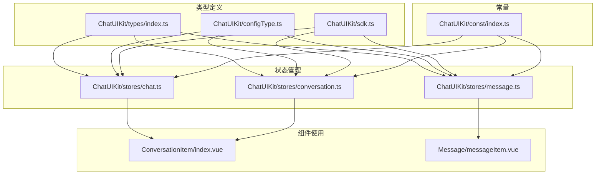
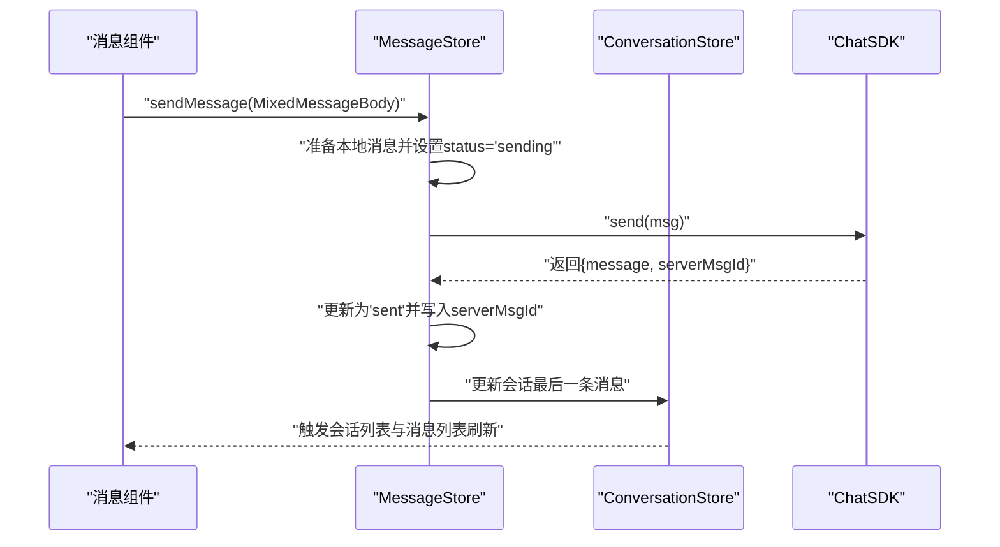
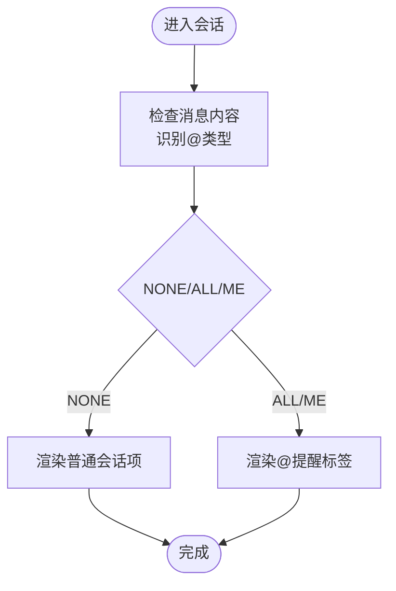
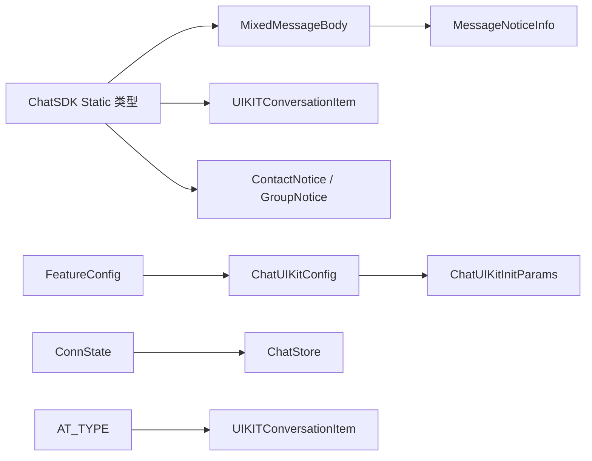

# 类型定义

<cite>
**本文档引用的文件**
- [ChatUIKit/types/index.ts](file://ChatUIKit/types/index.ts)
- [ChatUIKit/configType.ts](file://ChatUIKit/configType.ts)
- [ChatUIKit/sdk.ts](file://ChatUIKit/sdk.ts)
- [ChatUIKit/stores/chat.ts](file://ChatUIKit/stores/chat.ts)
- [ChatUIKit/stores/conversation.ts](file://ChatUIKit/stores/conversation.ts)
- [ChatUIKit/stores/message.ts](file://ChatUIKit/stores/message.ts)
- [ChatUIKit/modules/Conversation/components/ConversationItem/index.vue](file://ChatUIKit/modules/Conversation/components/ConversationItem/index.vue)
- [ChatUIKit/modules/Chat/components/Message/messageItem.vue](file://ChatUIKit/modules/Chat/components/Message/messageItem.vue)
- [ChatUIKit/const/index.ts](file://ChatUIKit/const/index.ts)
</cite>

## 目录
1. [简介](#简介)
2. [项目结构](#项目结构)
3. [核心组件](#核心组件)
4. [架构总览](#架构总览)
5. [详细组件分析](#详细组件分析)
6. [依赖关系分析](#依赖关系分析)
7. [性能考量](#性能考量)
8. [故障排查指南](#故障排查指南)
9. [结论](#结论)

## 简介
本文件为 Easemob UIKit 类型系统的权威参考，覆盖 TypeScript 接口、类型别名、枚举与泛型定义，重点围绕以下核心数据类型展开：
- 消息类型：MixedMessageBody
- 用户信息：UserInfoWithPresence、PresenceInfo
- 会话信息：UIKITConversationItem、ConversationBaseInfo
- 功能配置：FeatureConfig、ThemeConfig、ChatUIKitConfig、ChatUIKitInitParams
- 其他常用类型：MessageStatus、AT_TYPE、MessageQuoteExt、MessageNoticeInfo、ConnState、ContactNotice、GroupNotice 等

文档不仅给出字段语义、数据类型、可选性与典型使用场景，还提供类型安全最佳实践与常见问题排查建议。

## 项目结构
类型系统主要分布在以下位置：
- 类型声明与导出：ChatUIKit/types/index.ts
- 配置与主题：ChatUIKit/configType.ts
- SDK 类型桥接：ChatUIKit/sdk.ts
- Store 层使用：ChatUIKit/stores 下各模块
- 组件层使用：ChatUIKit/modules 下各组件
- 常量与默认值：ChatUIKit/const/index.ts



图表来源
- [ChatUIKit/types/index.ts](file://ChatUIKit/types/index.ts#L1-L100)
- [ChatUIKit/configType.ts](file://ChatUIKit/configType.ts#L1-L68)
- [ChatUIKit/sdk.ts](file://ChatUIKit/sdk.ts#L1-L13)
- [ChatUIKit/stores/chat.ts](file://ChatUIKit/stores/chat.ts#L1-L407)
- [ChatUIKit/stores/conversation.ts](file://ChatUIKit/stores/conversation.ts#L1-L421)
- [ChatUIKit/stores/message.ts](file://ChatUIKit/stores/message.ts#L1-L581)
- [ChatUIKit/modules/Conversation/components/ConversationItem/index.vue](file://ChatUIKit/modules/Conversation/components/ConversationItem/index.vue#L1-L260)
- [ChatUIKit/modules/Chat/components/Message/messageItem.vue](file://ChatUIKit/modules/Chat/components/Message/messageItem.vue#L1-L264)
- [ChatUIKit/const/index.ts](file://ChatUIKit/const/index.ts#L1-L36)

章节来源
- [ChatUIKit/types/index.ts](file://ChatUIKit/types/index.ts#L1-L100)
- [ChatUIKit/configType.ts](file://ChatUIKit/configType.ts#L1-L68)
- [ChatUIKit/sdk.ts](file://ChatUIKit/sdk.ts#L1-L13)

## 核心组件
本节对关键类型进行逐项说明，包括字段含义、数据类型、可选性与典型使用场景。

- MixedMessageBody
  - 定义来源：ChatUIKit/types/index.ts
  - 说明：扩展 SDK 的 ExcludeAckMessageBody，增加 UI 层通用字段，如 noticeInfo、status、serverMsgId 等，用于统一承载各类消息体（文本、图片、音频、视频、文件、自定义等）。
  - 字段要点：
    - noticeInfo?: MessageNoticeInfo；用于承载“撤回”“群组”等通知类消息元信息。
    - status?: MessageStatus；消息发送状态（sending/sent/received/read/unread/failed）。
    - serverMsgId?: string；服务端生成的消息 ID，用于跨端一致性与撤回定位。
  - 使用场景：消息发送/接收、消息列表渲染、消息状态更新、引用/回复消息等。

- MessageStatus
  - 定义来源：ChatUIKit/types/index.ts
  - 说明：消息状态枚举，用于表示消息生命周期中的不同阶段。
  - 可选字段：是；通常由消息 Store 在发送过程中动态更新。

- MessageNoticeInfo
  - 定义来源：ChatUIKit/types/index.ts
  - 说明：消息通知信息，type 固定为 "notice"，noticeType 区分 "recall" 或 "group"，ext 为扩展字段。
  - 使用场景：消息被撤回时，将原消息包装为通知消息，提示用户“某条消息已被撤回”。

- MessageQuoteExt
  - 定义来源：ChatUIKit/types/index.ts
  - 说明：消息引用/回复的扩展信息，包含被引用消息的 ID、预览、发送者与类型。
  - 使用场景：渲染“引用某消息”的 UI。

- UIKITConversationItem
  - 定义来源：ChatUIKit/types/index.ts
  - 说明：在 SDK ConversationItem 基础上扩展 atType 字段，用于标识群聊 @ 提醒类型（NONE/ALL/ME）。
  - 使用场景：会话列表渲染、@ 提醒标签展示、置顶/免打扰等交互。

- ConversationBaseInfo
  - 定义来源：ChatUIKit/types/index.ts
  - 说明：会话基础信息，包含 conversationId 与 conversationType，常用于操作会话（置顶、免打扰、删除、标记已读）。
  - 使用场景：会话 CRUD、消息路由到对应会话。

- PresenceInfo 与 UserInfoWithPresence
  - 定义来源：ChatUIKit/types/index.ts
  - 说明：PresenceInfo 表示 Presence 状态（在线/离线/忙碌等）与扩展字段；UserInfoWithPresence 在 SDK 用户信息基础上增加 UI 展示所需的 name 与 avatar，并整合 PresenceInfo。
  - 使用场景：用户卡片、在线状态展示、用户信息面板。

- ConnState
  - 定义来源：ChatUIKit/types/index.ts
  - 说明：连接状态枚举，用于描述 SDK 连接生命周期（none/reconnecting/connected/disconnected）。
  - 使用场景：聊天页连接状态指示、错误提示、重连策略。

- AT_TYPE
  - 定义来源：ChatUIKit/types/index.ts
  - 说明：@ 提醒类型枚举（NONE/ALL/ME），配合 UIKITConversationItem 使用。
  - 使用场景：群聊 @ 提醒标签渲染。

- ContactNotice 与 GroupNotice
  - 定义来源：ChatUIKit/types/index.ts
  - 说明：联系人与群组事件的通知消息体，扩展了 ext 与 time 字段，便于 UI 展示与统计未读数。
  - 使用场景：联系人类别/群组事件通知列表。

- FeatureConfig、ThemeConfig、ChatUIKitConfig、ChatUIKitInitParams
  - 定义来源：ChatUIKit/configType.ts
  - 说明：功能开关（useUserInfo、muteConversation、pinConversation、deleteConversation、messageStatus、copyMessage、deleteMessage、recallMessage、editMessage、replyMessage、inputEmoji、inputImage、inputAudio、inputVideo、inputFile、inputMention、userCard、usePresence）、主题配置（avatarShape）、整体配置（features/theme）以及初始化参数（chat/config）。
  - 使用场景：运行期功能开关控制、主题定制、初始化注入。

章节来源
- [ChatUIKit/types/index.ts](file://ChatUIKit/types/index.ts#L1-L100)
- [ChatUIKit/configType.ts](file://ChatUIKit/configType.ts#L1-L68)

## 架构总览
类型系统与 Store/组件的协作关系如下：

```mermaid
classDiagram
class MixedMessageBody {
+noticeInfo? : MessageNoticeInfo
+status? : MessageStatus
+serverMsgId? : string
}
class MessageNoticeInfo {
+type : "notice"
+noticeType : "recall"|"group"
+ext : Record<string, any>
}
class MessageStatus {
<<enum>>
"sending"|"sent"|"received"|"read"|"unread"|"failed"
}
class UIKITConversationItem {
+atType? : AT_TYPE
}
class ConversationBaseInfo {
+conversationId : string
+conversationType : Chat.ChatType
}
class FeatureConfig {
+useUserInfo? : boolean
+muteConversation? : boolean
+pinConversation? : boolean
+deleteConversation? : boolean
+messageStatus? : boolean
+copyMessage? : boolean
+deleteMessage? : boolean
+recallMessage? : boolean
+editMessage? : boolean
+replyMessage? : boolean
+inputEmoji? : boolean
+inputImage? : boolean
+inputAudio? : boolean
+inputVideo? : boolean
+inputFile? : boolean
+inputMention? : boolean
+userCard? : boolean
+usePresence? : boolean
}
class ThemeConfig {
+avatarShape? : "circle"|"square"
}
class ChatUIKitConfig {
+features : FeatureConfig
+theme : ThemeConfig
}
class ChatUIKitInitParams {
+chat : Chat.Connection
+config : { theme : ThemeConfig; isDebug : boolean }
}
MixedMessageBody --> MessageNoticeInfo : "包含"
UIKITConversationItem --> ConversationBaseInfo : "组合"
ChatUIKitConfig --> FeatureConfig : "包含"
ChatUIKitConfig --> ThemeConfig : "包含"
ChatUIKitInitParams --> ChatUIKitConfig : "包含"
```

图表来源
- [ChatUIKit/types/index.ts](file://ChatUIKit/types/index.ts#L1-L100)
- [ChatUIKit/configType.ts](file://ChatUIKit/configType.ts#L1-L68)

## 详细组件分析

### 消息类型 MixedMessageBody
- 字段与语义
  - noticeInfo?: MessageNoticeInfo；当消息为“通知”类型（如撤回）时使用。
  - status?: MessageStatus；消息发送状态，便于 UI 展示发送进度与失败提示。
  - serverMsgId?: string；服务端消息 ID，用于跨端一致性与撤回定位。
- 使用流程（发送/接收）
  - 发送：Store 在发送前设置 status 为 sending，发送成功后更新为 sent，并写入 serverMsgId。
  - 接收：Store 将消息插入本地映射与会话消息列表，同时根据 chatType/from 判断是否需要标记已读。
- 典型场景
  - 文本、图片、音频、视频、文件、自定义消息均以 MixedMessageBody 形式进入 UI 渲染。
  - 引用/回复消息通过 msg.ext.msgQuote 使用 MessageQuoteExt。



图表来源
- [ChatUIKit/stores/message.ts](file://ChatUIKit/stores/message.ts#L223-L336)
- [ChatUIKit/stores/conversation.ts](file://ChatUIKit/stores/conversation.ts#L344-L354)

章节来源
- [ChatUIKit/types/index.ts](file://ChatUIKit/types/index.ts#L56-L61)
- [ChatUIKit/stores/message.ts](file://ChatUIKit/stores/message.ts#L223-L336)
- [ChatUIKit/stores/conversation.ts](file://ChatUIKit/stores/conversation.ts#L344-L354)

### 会话信息 UIKITConversationItem 与 ConversationBaseInfo
- 字段与语义
  - UIKITConversationItem 在 SDK ConversationItem 基础上扩展 atType，用于群聊 @ 提醒。
  - ConversationBaseInfo 仅包含 conversationId 与 conversationType，用于会话级操作。
- 使用流程
  - 会话列表渲染：组件接收 UIKITConversationItem，根据 atType 渲染 @ 提醒标签。
  - 会话操作：通过 ConversationBaseInfo 调用 Store 的置顶/免打扰/删除/标记已读等方法。
- 典型场景
  - 置顶会话：调用 pinConversation 并更新本地 isPinned/pinnedTime。
  - 免打扰：调用 setSilentModeForConversation 并维护 muteConvsMap。
  - 标记已读：构造 channel 类型已读回执并发送。



图表来源
- [ChatUIKit/stores/conversation.ts](file://ChatUIKit/stores/conversation.ts#L392-L407)
- [ChatUIKit/modules/Conversation/components/ConversationItem/index.vue](file://ChatUIKit/modules/Conversation/components/ConversationItem/index.vue#L35-L39)

章节来源
- [ChatUIKit/types/index.ts](file://ChatUIKit/types/index.ts#L63-L65)
- [ChatUIKit/stores/conversation.ts](file://ChatUIKit/stores/conversation.ts#L194-L213)
- [ChatUIKit/modules/Conversation/components/ConversationItem/index.vue](file://ChatUIKit/modules/Conversation/components/ConversationItem/index.vue#L107-L110)

### 用户信息与 Presence
- 字段与语义
  - PresenceInfo：isOnline、presenceExt，用于展示用户在线状态与扩展信息。
  - UserInfoWithPresence：在 SDK 用户信息基础上增加 name、avatar，并整合 PresenceInfo。
- 使用流程
  - 登录后异步拉取当前用户信息与 Presence。
  - 用户卡片/头像点击面板展示 name/avatar 与在线状态。
- 典型场景
  - 用户卡片渲染、在线状态徽标、用户信息面板。

章节来源
- [ChatUIKit/types/index.ts](file://ChatUIKit/types/index.ts#L67-L80)
- [ChatUIKit/stores/chat.ts](file://ChatUIKit/stores/chat.ts#L299-L321)

### 功能配置 FeatureConfig 与主题 ThemeConfig
- 字段与语义
  - FeatureConfig：控制 UI 能力开关（消息状态、复制/删除/撤回/编辑/回复、输入能力、名片、Presence 等）。
  - ThemeConfig：控制主题细节（头像形状）。
  - ChatUIKitConfig：features 与 theme 的组合。
  - ChatUIKitInitParams：初始化参数，包含 chat 实例与 config（含 isDebug）。
- 使用流程
  - 初始化时传入 ChatUIKitInitParams，Store 读取 FeatureConfig 决定 UI 能力。
  - 组件根据 FeatureConfig 条件渲染菜单/按钮。
- 典型场景
  - 动态关闭“复制消息”“回复消息”等能力，降低复杂度或满足合规要求。

章节来源
- [ChatUIKit/configType.ts](file://ChatUIKit/configType.ts#L3-L67)
- [ChatUIKit/stores/chat.ts](file://ChatUIKit/stores/chat.ts#L377-L396)

## 依赖关系分析
类型之间的依赖关系如下：



图表来源
- [ChatUIKit/sdk.ts](file://ChatUIKit/sdk.ts#L1-L13)
- [ChatUIKit/types/index.ts](file://ChatUIKit/types/index.ts#L1-L100)
- [ChatUIKit/configType.ts](file://ChatUIKit/configType.ts#L1-L68)
- [ChatUIKit/stores/chat.ts](file://ChatUIKit/stores/chat.ts#L29-L61)

章节来源
- [ChatUIKit/sdk.ts](file://ChatUIKit/sdk.ts#L1-L13)
- [ChatUIKit/types/index.ts](file://ChatUIKit/types/index.ts#L1-L100)
- [ChatUIKit/configType.ts](file://ChatUIKit/configType.ts#L1-L68)
- [ChatUIKit/stores/chat.ts](file://ChatUIKit/stores/chat.ts#L29-L61)

## 性能考量
- 消息去重与上限控制
  - Store 使用 messageMap 与 conversationMessagesMap 管理消息，避免重复渲染与内存膨胀。
  - 通过 MAX_MESSAGES_PER_CONVERSATION 控制单会话消息上限，定期清理过量消息。
- 会话列表排序与未读统计
  - 使用计算属性缓存 totalUnreadCount 与 sortedConversationList，减少重复计算。
- 连接状态与事件处理
  - ConnState 与 SDK 事件解耦，避免频繁重绘；事件回调中仅做必要更新。

章节来源
- [ChatUIKit/stores/message.ts](file://ChatUIKit/stores/message.ts#L530-L554)
- [ChatUIKit/stores/conversation.ts](file://ChatUIKit/stores/conversation.ts#L54-L66)
- [ChatUIKit/const/index.ts](file://ChatUIKit/const/index.ts#L15-L15)

## 故障排查指南
- 消息状态异常
  - 现象：消息一直显示“发送中”或“失败”。
  - 排查：确认发送前 status 设置为 sending，发送成功后更新为 sent；若失败，Store 会将其置为 failed。
  - 参考路径：[ChatUIKit/stores/message.ts](file://ChatUIKit/stores/message.ts#L223-L336)
- 撤回消息未生效
  - 现象：点击撤回后 UI 未变化。
  - 排查：确保 recallMessage 调用成功并触发 onRecallMessage；Store 会将原消息替换为带 noticeInfo 的通知消息。
  - 参考路径：[ChatUIKit/stores/message.ts](file://ChatUIKit/stores/message.ts#L393-L457)
- 会话未读数不更新
  - 现象：消息已读但未清零。
  - 排查：确认已读回执发送成功且 ConversationStore 正确更新 unReadCount。
  - 参考路径：[ChatUIKit/stores/conversation.ts](file://ChatUIKit/stores/conversation.ts#L314-L339)
- @ 提醒未显示
  - 现象：群聊中发送 @ALL 或 @某人，会话项未显示 @ 标签。
  - 排查：确认 setAtTypeByMessage 已被调用，且消息内容包含 AT_ALL 或目标用户 ID。
  - 参考路径：[ChatUIKit/stores/conversation.ts](file://ChatUIKit/stores/conversation.ts#L392-L407)

章节来源
- [ChatUIKit/stores/message.ts](file://ChatUIKit/stores/message.ts#L393-L457)
- [ChatUIKit/stores/conversation.ts](file://ChatUIKit/stores/conversation.ts#L314-L339)
- [ChatUIKit/stores/conversation.ts](file://ChatUIKit/stores/conversation.ts#L392-L407)

## 结论
本文档系统梳理了 Easemob UIKit 的类型体系，明确了消息、会话、用户、配置等核心类型的字段与使用方式，并结合 Store 与组件的实际使用路径，提供了类型安全的最佳实践与故障排查建议。建议在开发中：
- 明确区分 SDK 原生类型与 UI 扩展类型（如 UIKITConversationItem、MixedMessageBody）。
- 严格遵循 MessageStatus 的流转，确保 UI 与业务一致。
- 通过 FeatureConfig 动态裁剪能力，兼顾可用性与合规性。
- 对消息与会话列表采用去重与上限控制策略，保障性能与稳定性。