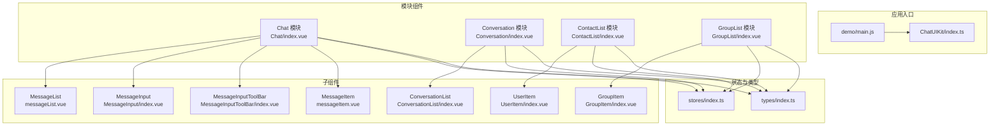
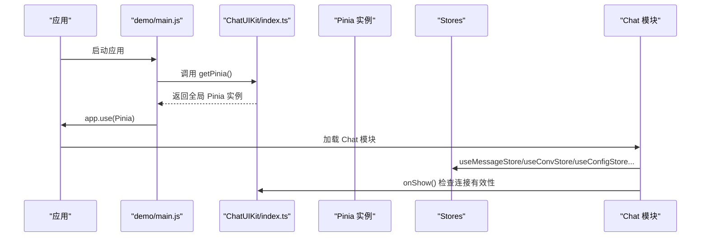
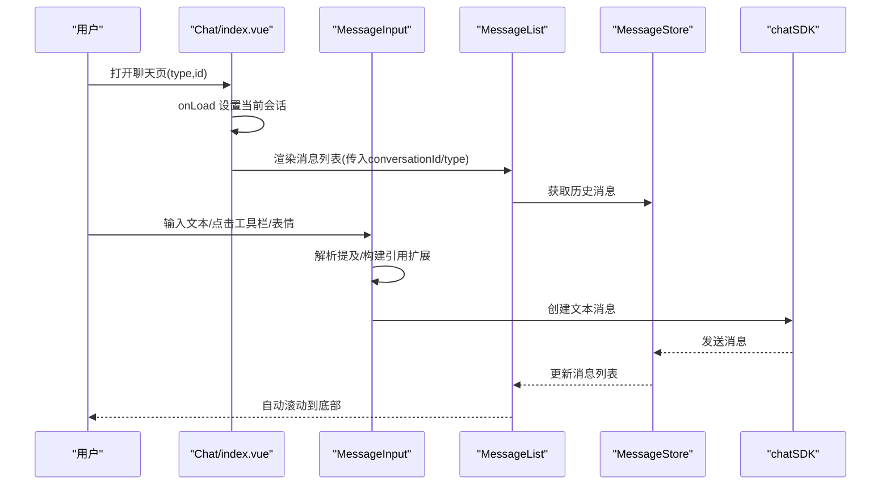
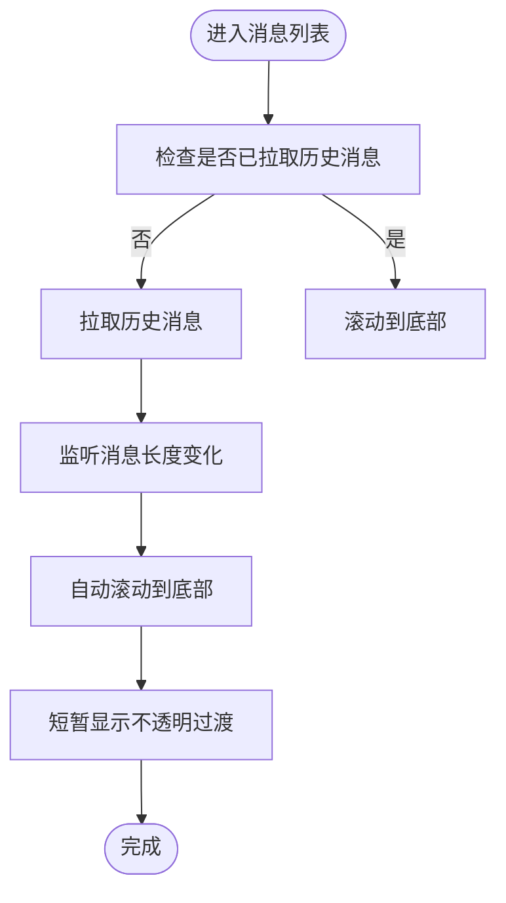
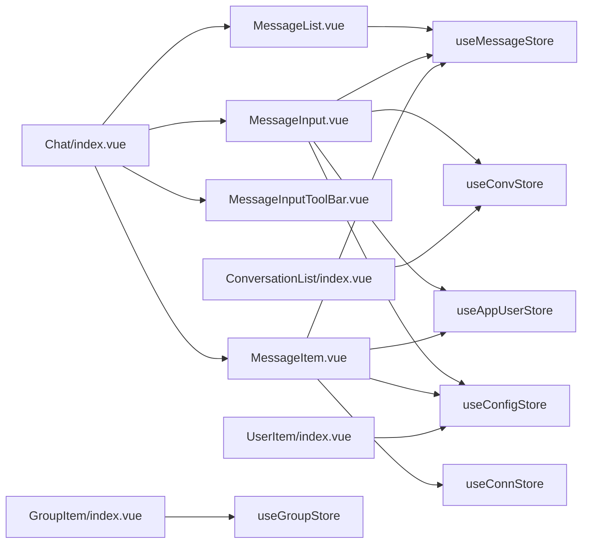

# 组件API

<cite>
**本文引用的文件**
- [ChatUIKit/index.ts](file://ChatUIKit/index.ts)
- [demo/main.js](file://demo/main.js)
- [ChatUIKit/modules/Chat/index.vue](file://ChatUIKit/modules/Chat/index.vue)
- [ChatUIKit/modules/Chat/components/Message/messageList.vue](file://ChatUIKit/modules/Chat/components/Message/messageList.vue)
- [ChatUIKit/modules/Chat/components/MessageInput/index.vue](file://ChatUIKit/modules/Chat/components/MessageInput/index.vue)
- [ChatUIKit/modules/Chat/components/MessageInputToolBar/index.vue](file://ChatUIKit/modules/Chat/components/MessageInputToolBar/index.vue)
- [ChatUIKit/modules/Chat/components/Message/messageItem.vue](file://ChatUIKit/modules/Chat/components/Message/messageItem.vue)
- [ChatUIKit/modules/Conversation/index.vue](file://ChatUIKit/modules/Conversation/index.vue)
- [ChatUIKit/modules/Conversation/components/ConversationList/index.vue](file://ChatUIKit/modules/Conversation/components/ConversationList/index.vue)
- [ChatUIKit/modules/ContactList/index.vue](file://ChatUIKit/modules/ContactList/index.vue)
- [ChatUIKit/modules/ContactList/components/UserItem/index.vue](file://ChatUIKit/modules/ContactList/components/UserItem/index.vue)
- [ChatUIKit/modules/GroupList/index.vue](file://ChatUIKit/modules/GroupList/index.vue)
- [ChatUIKit/modules/GroupList/components/GroupItem/index.vue](file://ChatUIKit/modules/GroupList/components/GroupItem/index.vue)
- [ChatUIKit/types/index.ts](file://ChatUIKit/types/index.ts)
- [ChatUIKit/stores/index.ts](file://ChatUIKit/stores/index.ts)
</cite>

## 目录
1. [简介](#简介)
2. [项目结构](#项目结构)
3. [核心组件](#核心组件)
4. [架构总览](#架构总览)
5. [详细组件分析](#详细组件分析)
6. [依赖关系分析](#依赖关系分析)
7. [性能考量](#性能考量)
8. [故障排查指南](#故障排查指南)
9. [结论](#结论)
10. [附录](#附录)

## 简介
本文件为 Easemob UIKit 组件系统的完整参考文档，覆盖聊天组件（Chat）、会话组件（Conversation）、联系人组件（ContactList）、群组组件（GroupList）等主要模块的 API 规范。内容包括各组件的 props 属性、events 事件、slots 插槽与 exposed 方法，并提供使用示例、配置与事件处理最佳实践。

## 项目结构
- 核心入口与全局状态
  - ChatUIKit/index.ts 提供单例 ChatUIKit，负责初始化 IM SDK、主题与功能配置、生命周期 onShow 的连接有效性检测，并导出全局 Pinia 实例。
  - demo/main.js 在应用入口通过 ChatUIKit.getPinia() 注册 Pinia，保证全局状态一致性。
- 模块化组件
  - Chat 模块：聊天界面、消息列表、输入框、工具栏、表情选择器、提及列表、用户名片等。
  - Conversation 模块：会话列表与导航。
  - ContactList 模块：联系人列表、索引列表、用户项滑动菜单。
  - GroupList 模块：群组列表与群组项。
- 类型与状态
  - types/index.ts 定义了消息体、会话项、状态枚举、提及类型、用户信息扩展等类型。
  - stores/index.ts 暴露所有 Pinia Store 的命名导出，便于在组件中按需引入。

图表来源
- [ChatUIKit/index.ts](file://ChatUIKit/index.ts#L1-L139)
- [demo/main.js](file://demo/main.js#L1-L28)
- [ChatUIKit/modules/Chat/index.vue](file://ChatUIKit/modules/Chat/index.vue#L1-L255)
- [ChatUIKit/modules/Conversation/index.vue](file://ChatUIKit/modules/Conversation/index.vue#L1-L12)
- [ChatUIKit/modules/ContactList/index.vue](file://ChatUIKit/modules/ContactList/index.vue#L1-L115)
- [ChatUIKit/modules/GroupList/index.vue](file://ChatUIKit/modules/GroupList/index.vue#L1-L66)
- [ChatUIKit/modules/Chat/components/Message/messageList.vue](file://ChatUIKit/modules/Chat/components/Message/messageList.vue#L1-L284)
- [ChatUIKit/modules/Chat/components/MessageInput/index.vue](file://ChatUIKit/modules/Chat/components/MessageInput/index.vue#L1-L217)
- [ChatUIKit/modules/Chat/components/MessageInputToolBar/index.vue](file://ChatUIKit/modules/Chat/components/MessageInputToolBar/index.vue#L1-L69)
- [ChatUIKit/modules/Chat/components/Message/messageItem.vue](file://ChatUIKit/modules/Chat/components/Message/messageItem.vue#L1-L264)
- [ChatUIKit/modules/Conversation/components/ConversationList/index.vue](file://ChatUIKit/modules/Conversation/components/ConversationList/index.vue#L1-L158)
- [ChatUIKit/modules/ContactList/components/UserItem/index.vue](file://ChatUIKit/modules/ContactList/components/UserItem/index.vue#L1-L165)
- [ChatUIKit/modules/GroupList/components/GroupItem/index.vue](file://ChatUIKit/modules/GroupList/components/GroupItem/index.vue#L1-L67)
- [ChatUIKit/stores/index.ts](file://ChatUIKit/stores/index.ts#L1-L31)
- [ChatUIKit/types/index.ts](file://ChatUIKit/types/index.ts#L1-L100)

章节来源
- [ChatUIKit/index.ts](file://ChatUIKit/index.ts#L1-L139)
- [demo/main.js](file://demo/main.js#L1-L28)
- [ChatUIKit/stores/index.ts](file://ChatUIKit/stores/index.ts#L1-L31)
- [ChatUIKit/types/index.ts](file://ChatUIKit/types/index.ts#L1-L100)

## 核心组件
本节概述主要模块组件的职责与对外 API。

- ChatUIKit 单例
  - 功能：初始化 IM 连接、设置主题与功能配置、提供 getPinia 以统一状态管理、onShow 生命周期检查连接有效性。
  - 关键方法：init(params)、getChatConn()、getThemeConfig()、getFeatureConfig()、hideFeature(features)、onShow()、getPinia()。
  - 章节来源
    - [ChatUIKit/index.ts](file://ChatUIKit/index.ts#L84-L131)

- Chat 聊天模块
  - 功能：承载聊天界面，包含消息列表、输入框、工具栏、表情选择器、提及列表、用户名片、引用消息面板、编辑态消息遮罩等。
  - 关键交互：键盘高度监听、工具栏与表情面板开关、提及与用户名片插入、引用消息编辑、会话标记已读。
  - 章节来源
    - [ChatUIKit/modules/Chat/index.vue](file://ChatUIKit/modules/Chat/index.vue#L1-L255)

- Conversation 会话模块
  - 功能：渲染会话列表，支持搜索、置顶、免打扰切换、删除会话等操作。
  - 章节来源
    - [ChatUIKit/modules/Conversation/index.vue](file://ChatUIKit/modules/Conversation/index.vue#L1-L12)
    - [ChatUIKit/modules/Conversation/components/ConversationList/index.vue](file://ChatUIKit/modules/Conversation/components/ConversationList/index.vue#L1-L158)

- ContactList 联系人模块
  - 功能：联系人列表，支持分组、新请求计数、滑动删除、跳转到聊天或请求列表。
  - 章节来源
    - [ChatUIKit/modules/ContactList/index.vue](file://ChatUIKit/modules/ContactList/index.vue#L1-L115)
    - [ChatUIKit/modules/ContactList/components/UserItem/index.vue](file://ChatUIKit/modules/ContactList/components/UserItem/index.vue#L1-L165)

- GroupList 群组模块
  - 功能：已加入群组列表，支持跳转到群聊。
  - 章节来源
    - [ChatUIKit/modules/GroupList/index.vue](file://ChatUIKit/modules/GroupList/index.vue#L1-L66)
    - [ChatUIKit/modules/GroupList/components/GroupItem/index.vue](file://ChatUIKit/modules/GroupList/components/GroupItem/index.vue#L1-L67)

## 架构总览
下图展示应用启动、状态注入与模块间调用关系：

图表来源
- [demo/main.js](file://demo/main.js#L14-L27)
- [ChatUIKit/index.ts](file://ChatUIKit/index.ts#L114-L125)
- [ChatUIKit/modules/Chat/index.vue](file://ChatUIKit/modules/Chat/index.vue#L211-L227)

## 详细组件分析

### Chat 聊天组件 API
- 组件路径：ChatUIKit/modules/Chat/index.vue
- 功能概览：承载聊天界面，组合消息列表、输入框、工具栏、表情选择器、提及列表、用户名片等子组件；处理键盘高度、遮罩层、引用消息与编辑态消息；在挂载时标记会话已读。
- Props
  - 无显式 props（通过页面参数 onLoad 注入 conversationId 与 conversationType）。
- Events
  - 由子组件触发并向上派发：
    - onInputTap：输入框被点击。
    - onMention：触发提及列表。
    - onRecordAudio：录音按钮事件。
    - onShowToolbar：显示/隐藏工具栏。
    - onShowEmojiPicker：显示/隐藏表情选择器。
    - onUserCardButtonTap：用户名片按钮点击（来自工具栏）。
    - onSelect：用户名片选择回调。
- Slots
  - 无具名插槽。
- Exposed Methods
  - 无显式 expose。
- 子组件与交互要点
  - MessageList：接收 conversationId 与 conversationType，负责消息分页加载、滚动到底部、闪烁高亮等。
  - MessageInput：文本输入、发送、提及解析、引用消息扩展、权限申请（录音）。
  - MessageInputToolBar：图片/视频/文件/用户名片等扩展能力。
  - EmojiPicker：表情选择后插入文本。
  - MessageMentionList：提及列表选择后插入提及文本与用户ID。
  - MessageContactList：用户名片选择后发送自定义消息。
- 最佳实践
  - 使用 computed 代替 autorun，避免副作用。
  - 监听 quoteMessage 变化，动态聚焦输入框。
  - 键盘高度变化时滚动消息到底部。
  - 在 onShow 中检测连接有效性，避免无效网络导致异常。
- 章节来源
  - [ChatUIKit/modules/Chat/index.vue](file://ChatUIKit/modules/Chat/index.vue#L1-L255)
  - [ChatUIKit/modules/Chat/components/Message/messageList.vue](file://ChatUIKit/modules/Chat/components/Message/messageList.vue#L61-L201)
  - [ChatUIKit/modules/Chat/components/MessageInput/index.vue](file://ChatUIKit/modules/Chat/components/MessageInput/index.vue#L58-L211)
  - [ChatUIKit/modules/Chat/components/MessageInputToolBar/index.vue](file://ChatUIKit/modules/Chat/components/MessageInputToolBar/index.vue#L26-L43)

#### 聊天组件交互序列图

图表来源
- [ChatUIKit/modules/Chat/index.vue](file://ChatUIKit/modules/Chat/index.vue#L229-L245)
- [ChatUIKit/modules/Chat/components/Message/messageList.vue](file://ChatUIKit/modules/Chat/components/Message/messageList.vue#L117-L134)
- [ChatUIKit/modules/Chat/components/MessageInput/index.vue](file://ChatUIKit/modules/Chat/components/MessageInput/index.vue#L137-L189)

### MessageList 消息列表组件 API
- 组件路径：ChatUIKit/modules/Chat/components/Message/messageList.vue
- Props
  - conversationId: string
  - conversationType: Chat.ConversationItem["conversationType"]
- Events
  - 无显式 emits。
- Slots
  - 无具名插槽。
- Exposed Methods
  - scrollToBottom(): 将滚动视图滚动到底部。
- 处理逻辑
  - 基于 Pinia store 获取指定会话的消息列表，自动滚动到底部，支持分页加载历史消息，长按选择消息，跳转到指定消息位置并高亮闪烁。
- 性能建议
  - 初次加载时仅在未获取过历史消息时触发拉取，避免重复请求。
  - 分页加载时根据平台差异设置 currentViewMsgId，提升滚动锚定体验。
- 章节来源
  - [ChatUIKit/modules/Chat/components/Message/messageList.vue](file://ChatUIKit/modules/Chat/components/Message/messageList.vue#L61-L201)

#### 消息列表加载流程图

图表来源
- [ChatUIKit/modules/Chat/components/Message/messageList.vue](file://ChatUIKit/modules/Chat/components/Message/messageList.vue#L117-L134)
- [ChatUIKit/modules/Chat/components/Message/messageList.vue](file://ChatUIKit/modules/Chat/components/Message/messageList.vue#L100-L115)

### MessageInput 文本输入组件 API
- 组件路径：ChatUIKit/modules/Chat/components/MessageInput/index.vue
- Props
  - preventEvent: boolean（是否阻止事件冒泡）
- Events
  - onMessageSend：发送成功后触发。
  - onShowToolbar：显示工具栏。
  - onShowEmojiPicker：显示表情选择器。
  - onRecordAudio：录音按钮事件。
  - onInputTap：输入框被点击。
  - onBlur：输入框失焦。
  - onFocus：输入框聚焦。
  - onMention：检测到“@”触发提及列表。
- Slots
  - 无具名插槽。
- Exposed Methods
  - insertText(emoji: string): 在输入框追加文本。
  - setIsFocus(focus: boolean): 控制输入框焦点。
  - addMentionUserIds(userIds: string[]): 添加提及用户ID（去重）。
- 处理逻辑
  - 输入文本处理、提及解析（群聊且开启 inputMention 时），引用消息扩展构建，发送前清理引用状态，权限申请（录音）。
- 最佳实践
  - 在发送前 trim 文本，避免空消息。
  - 群聊场景下对“@”进行监听，及时弹出提及列表。
  - 录音权限在 Android 平台需动态申请。
- 章节来源
  - [ChatUIKit/modules/Chat/components/MessageInput/index.vue](file://ChatUIKit/modules/Chat/components/MessageInput/index.vue#L58-L211)

### MessageInputToolBar 工具栏 API
- 组件路径：ChatUIKit/modules/Chat/components/MessageInputToolBar/index.vue
- Props
  - 无显式 props。
- Events
  - onUserCardButtonTap：用户名片按钮点击。
- Slots
  - 无具名插槽。
- Exposed Methods
  - 无显式 expose。
- 处理逻辑
  - 条件渲染图片/视频/文件/用户名片等入口，基于功能配置决定显示项。
- 最佳实践
  - 通过功能配置开关控制入口可见性，减少 UI 复杂度。
- 章节来源
  - [ChatUIKit/modules/Chat/components/MessageInputToolBar/index.vue](file://ChatUIKit/modules/Chat/components/MessageInputToolBar/index.vue#L26-L43)

### MessageItem 消息项组件 API
- 组件路径：ChatUIKit/modules/Chat/components/Message/messageItem.vue
- Props
  - msg: MixedMessageBody
  - isSelected: boolean
- Events
  - onLongPress：长按消息气泡。
  - jumpToMessage：跳转到被引用的消息。
- Slots
  - 无具名插槽。
- Exposed Methods
  - 无显式 expose。
- 处理逻辑
  - 根据消息类型渲染文本、图片、视频、音频、文件、用户名片等；支持长按触发上下文菜单；显示消息状态（发送中/已读等，取决于功能配置）。
- 最佳实践
  - 长按检测结合 touchstart/touchend/touchmove，避免误触。
  - 引用消息预览与跳转需与 messageList 协同。
- 章节来源
  - [ChatUIKit/modules/Chat/components/Message/messageItem.vue](file://ChatUIKit/modules/Chat/components/Message/messageItem.vue#L91-L181)

### Conversation 会话模块 API
- 组件路径：ChatUIKit/modules/Conversation/index.vue
- 功能：渲染 ConversationList。
- Props
  - 无。
- Events
  - 无。
- Slots
  - 无。
- Exposed Methods
  - 无。
- 章节来源
  - [ChatUIKit/modules/Conversation/index.vue](file://ChatUIKit/modules/Conversation/index.vue#L1-L12)

#### ConversationList 会话列表 API
- 组件路径：ChatUIKit/modules/Conversation/components/ConversationList/index.vue
- Props
  - 无。
- Events
  - mute：切换免打扰。
  - pin：置顶/取消置顶。
  - delete：删除会话。
  - leftSwipe：左滑事件。
- Slots
  - 无。
- Exposed Methods
  - 无。
- 处理逻辑
  - 基于 Pinia store 获取排序后的会话列表，支持搜索跳转、置顶、免打扰、删除、左滑菜单等。
- 最佳实践
  - 使用 computed 直接引用 store 状态，避免深拷贝。
- 章节来源
  - [ChatUIKit/modules/Conversation/components/ConversationList/index.vue](file://ChatUIKit/modules/Conversation/components/ConversationList/index.vue#L33-L106)

### ContactList 联系人模块 API
- 组件路径：ChatUIKit/modules/ContactList/index.vue
- Props
  - 无。
- Events
  - onGroupTap：点击“群组”。
  - onContactTap：点击联系人。
  - onNewRequestTap：点击“新的请求”。
- Slots
  - indexedItem：插槽传入用户数据，配合 UserItem 渲染。
- Exposed Methods
  - 无。
- 处理逻辑
  - 合并联系人与用户信息，计算新请求与群组数量，支持滑动删除联系人。
- 最佳实践
  - 删除前弹窗确认，删除后清空选中状态。
- 章节来源
  - [ChatUIKit/modules/ContactList/index.vue](file://ChatUIKit/modules/ContactList/index.vue#L1-L115)

#### UserItem 用户项 API
- 组件路径：ChatUIKit/modules/ContactList/components/UserItem/index.vue
- Props
  - user: { userId, name?, avatar?, presenceExt? }
  - showMenu?: boolean（默认 false）
- Events
  - onTap：点击用户项。
  - onDelete：滑动删除。
  - onSwipe：左滑反馈。
- Slots
  - 无。
- Exposed Methods
  - setShowMenu(show: boolean)：外部控制菜单显示。
- 处理逻辑
  - 支持滑动手势，左滑显示删除菜单；根据配置决定是否展示在线状态文案。
- 最佳实践
  - 滑动距离阈值与方向判断，避免误触。
- 章节来源
  - [ChatUIKit/modules/ContactList/components/UserItem/index.vue](file://ChatUIKit/modules/ContactList/components/UserItem/index.vue#L30-L108)

### GroupList 群组模块 API
- 组件路径：ChatUIKit/modules/GroupList/index.vue
- Props
  - 无。
- Events
  - 无。
- Slots
  - 无。
- Exposed Methods
  - 无。
- 处理逻辑
  - 渲染已加入群组列表，空状态显示 Empty；点击跳转到群聊。
- 最佳实践
  - 群组名称与头像优先使用传入对象，否则回退到 store 查询。
- 章节来源
  - [ChatUIKit/modules/GroupList/index.vue](file://ChatUIKit/modules/GroupList/index.vue#L1-L66)

#### GroupItem 群组项 API
- 组件路径：ChatUIKit/modules/GroupList/components/GroupItem/index.vue
- Props
  - group: { groupId/groupid?, groupName/groupname?, avatar/avatarurl? }
- Events
  - onTap：点击群组。
- Slots
  - 无。
- Exposed Methods
  - 无。
- 处理逻辑
  - 兼容驼峰与小写字段，优先使用传入值，否则回退到 store 查询。
- 章节来源
  - [ChatUIKit/modules/GroupList/components/GroupItem/index.vue](file://ChatUIKit/modules/GroupList/components/GroupItem/index.vue#L14-L50)

## 依赖关系分析
- 状态依赖
  - 各模块通过 useXxxStore() 引用 Pinia Store，实现解耦与集中管理。
- 类型依赖
  - types/index.ts 提供消息体、会话项、状态枚举、提及类型等类型定义，贯穿消息列表与输入组件。
- 组件耦合
  - Chat 模块内部组件通过 props 与事件通信，保持低耦合；通过 provide/inject 传递 InputToolbarEvent。
- 外部依赖
  - SDK：chatSDK 用于创建与发送消息。
  - 平台能力：键盘高度监听、导航跳转、权限申请等。

图表来源
- [ChatUIKit/modules/Chat/index.vue](file://ChatUIKit/modules/Chat/index.vue#L74-L95)
- [ChatUIKit/modules/Chat/components/Message/messageList.vue](file://ChatUIKit/modules/Chat/components/Message/messageList.vue#L56-L68)
- [ChatUIKit/modules/Chat/components/MessageInput/index.vue](file://ChatUIKit/modules/Chat/components/MessageInput/index.vue#L44-L66)
- [ChatUIKit/modules/Chat/components/Message/messageItem.vue](file://ChatUIKit/modules/Chat/components/Message/messageItem.vue#L74-L103)
- [ChatUIKit/modules/Conversation/components/ConversationList/index.vue](file://ChatUIKit/modules/Conversation/components/ConversationList/index.vue#L33-L45)
- [ChatUIKit/modules/ContactList/components/UserItem/index.vue](file://ChatUIKit/modules/ContactList/components/UserItem/index.vue#L23-L28)
- [ChatUIKit/modules/GroupList/components/GroupItem/index.vue](file://ChatUIKit/modules/GroupList/components/GroupItem/index.vue#L8-L12)

章节来源
- [ChatUIKit/stores/index.ts](file://ChatUIKit/stores/index.ts#L9-L16)
- [ChatUIKit/types/index.ts](file://ChatUIKit/types/index.ts#L56-L99)

## 性能考量
- 响应式与计算
  - 使用 computed 替代 autorun，避免不必要的订阅与更新。
- 滚动与渲染
  - 消息列表首次加载与分页加载时，合理设置 scrollTop 与 currentViewMsgId，减少重排与滚动抖动。
- 事件与交互
  - 长按检测结合 touchstart/touchend/touchmove，避免误触与重复触发。
- 网络与连接
  - onShow 中检测连接有效性，避免无效网络导致异常。
- 权限与平台差异
  - 录音权限在 Android 平台动态申请，避免静默失败。
- 章节来源
  - [ChatUIKit/modules/Chat/components/Message/messageList.vue](file://ChatUIKit/modules/Chat/components/Message/messageList.vue#L100-L115)
  - [ChatUIKit/modules/Chat/components/Message/messageItem.vue](file://ChatUIKit/modules/Chat/components/Message/messageItem.vue#L136-L180)
  - [ChatUIKit/modules/Chat/components/MessageInput/index.vue](file://ChatUIKit/modules/Chat/components/MessageInput/index.vue#L92-L109)
  - [ChatUIKit/index.ts](file://ChatUIKit/index.ts#L114-L125)

## 故障排查指南
- 无法发送消息
  - 检查输入文本是否为空，发送前已 trim。
  - 确认当前会话是否正确设置。
  - 查看权限申请结果（录音）。
- 消息列表不滚动到底部
  - 确认 mounted 与 watch 分支逻辑是否命中自动滚动。
  - 检查键盘高度变化监听是否生效。
- 长按无反应
  - 检查 touchstart/touchend/touchmove 事件绑定与阈值设置。
  - 确认 preventEvent 未阻断事件传播。
- 会话未标记已读
  - 确认 onMounted 中已调用 markConversationRead。
- 章节来源
  - [ChatUIKit/modules/Chat/components/MessageInput/index.vue](file://ChatUIKit/modules/Chat/components/MessageInput/index.vue#L137-L142)
  - [ChatUIKit/modules/Chat/components/Message/messageList.vue](file://ChatUIKit/modules/Chat/components/Message/messageList.vue#L117-L134)
  - [ChatUIKit/modules/Chat/index.vue](file://ChatUIKit/modules/Chat/index.vue#L211-L219)
  - [ChatUIKit/modules/Chat/components/Message/messageItem.vue](file://ChatUIKit/modules/Chat/components/Message/messageItem.vue#L136-L180)

## 结论
本参考文档梳理了 Easemob UIKit 的核心组件 API，明确了各组件的 props、events、slots 与 exposed 方法，并提供了交互流程与时序图、性能与故障排查建议。建议在实际集成中遵循最佳实践，确保跨平台一致性与用户体验。

## 附录
- 类型与状态
  - MixedMessageBody：扩展消息体，包含通知信息、状态与服务端消息ID。
  - MessageStatus：消息状态枚举。
  - AT_TYPE：提及类型枚举。
  - UIKITConversationItem：增强的会话项，包含 atType。
- 章节来源
  - [ChatUIKit/types/index.ts](file://ChatUIKit/types/index.ts#L56-L99)