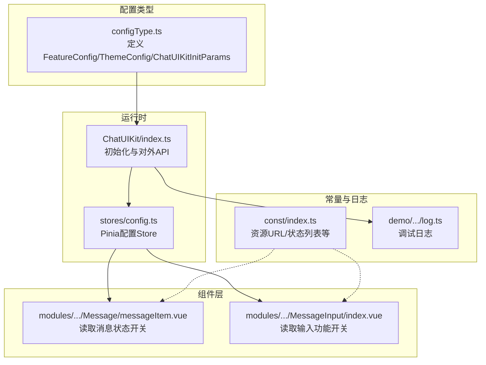
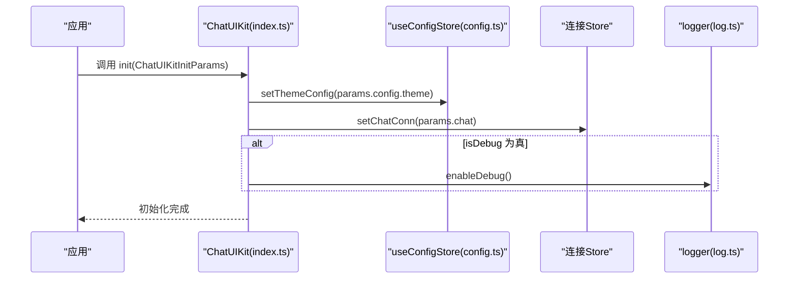
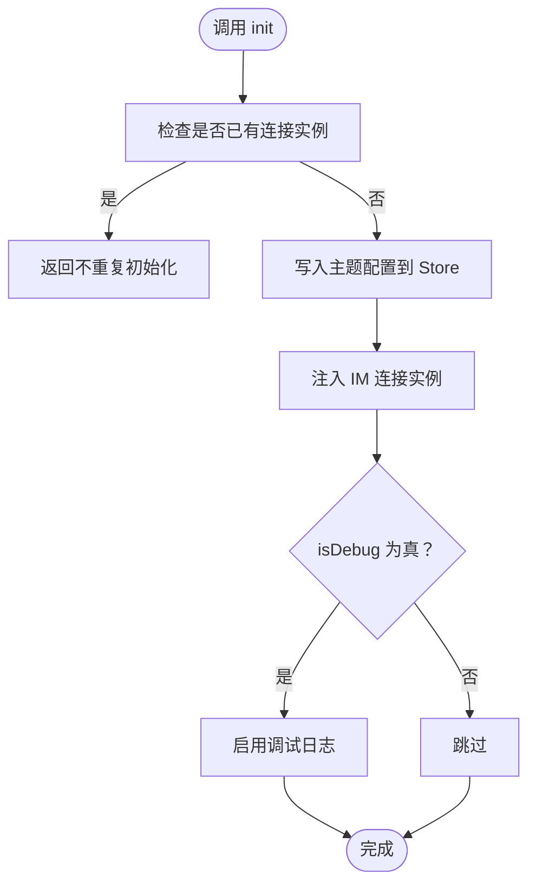
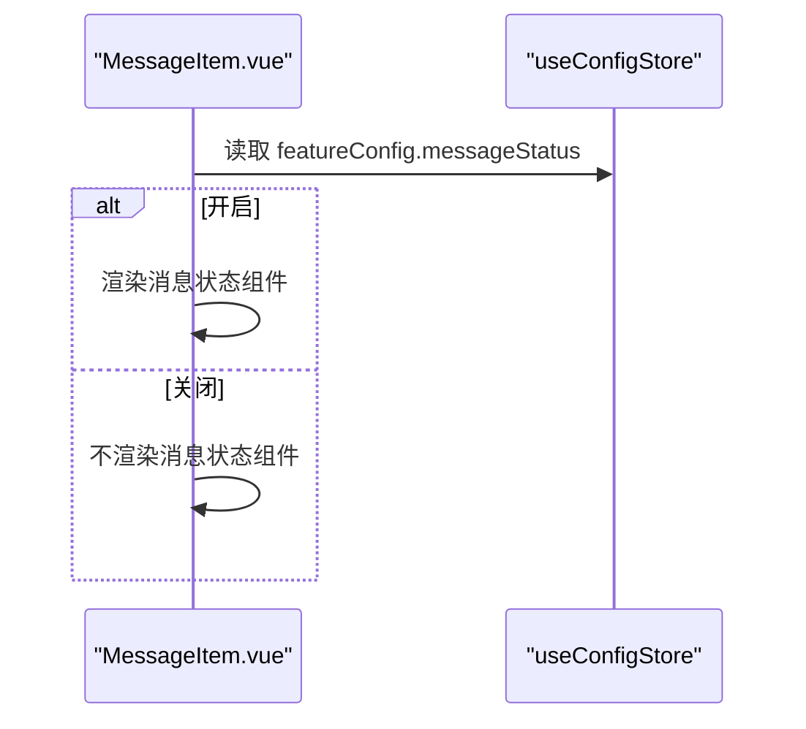
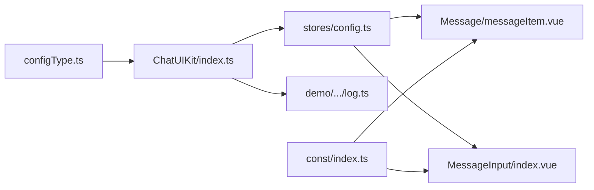

# 配置API

<cite>
**本文引用的文件**
- [ChatUIKit/configType.ts](file://ChatUIKit/configType.ts)
- [ChatUIKit/index.ts](file://ChatUIKit/index.ts)
- [ChatUIKit/stores/config.ts](file://ChatUIKit/stores/config.ts)
- [ChatUIKit/modules/Chat/components/Message/messageItem.vue](file://ChatUIKit/modules/Chat/components/Message/messageItem.vue)
- [ChatUIKit/modules/Chat/components/MessageInput/index.vue](file://ChatUIKit/modules/Chat/components/MessageInput/index.vue)
- [ChatUIKit/const/index.ts](file://ChatUIKit/const/index.ts)
- [demo/ChatUIKit/configType.ts](file://demo/ChatUIKit/configType.ts)
- [demo/ChatUIKit/index.ts](file://demo/ChatUIKit/index.ts)
- [demo/ChatUIKit/log.ts](file://demo/ChatUIKit/log.ts)
- [demo/pages/ServerConfig/index.vue](file://demo/pages/ServerConfig/index.vue)
</cite>

## 目录
1. [简介](#简介)
2. [项目结构](#项目结构)
3. [核心组件](#核心组件)
4. [架构总览](#架构总览)
5. [详细组件分析](#详细组件分析)
6. [依赖分析](#依赖分析)
7. [性能考虑](#性能考虑)
8. [故障排查指南](#故障排查指南)
9. [结论](#结论)
10. [附录](#附录)

## 简介
本文件为 Easemob UIKit 配置系统的完整参考文档，聚焦于以下类型与接口：
- ChatUIKitInitParams：初始化参数类型
- FeatureConfig：功能配置类型
- ThemeConfig：主题配置类型
- ChatUIKitConfig：整体配置对象（由 features 与 theme 组成）

文档将详细说明各配置项的含义、默认值、可选范围，并结合组件使用场景给出最佳实践与常见配置示例。

## 项目结构
与配置系统直接相关的文件分布如下：
- 类型定义：ChatUIKit/configType.ts、demo/ChatUIKit/configType.ts
- 初始化与入口：ChatUIKit/index.ts、demo/ChatUIKit/index.ts
- 配置存储：ChatUIKit/stores/config.ts
- 组件使用示例：messageItem.vue、MessageInput/index.vue
- 常量与资源：ChatUIKit/const/index.ts
- 日志与调试：demo/ChatUIKit/log.ts
- 示例页面（服务器配置）：demo/pages/ServerConfig/index.vue

**图表来源**
- [ChatUIKit/configType.ts](file://ChatUIKit/configType.ts#L1-L67)
- [ChatUIKit/index.ts](file://ChatUIKit/index.ts#L1-L138)
- [ChatUIKit/stores/config.ts](file://ChatUIKit/stores/config.ts#L1-L124)
- [ChatUIKit/modules/Chat/components/Message/messageItem.vue](file://ChatUIKit/modules/Chat/components/Message/messageItem.vue#L1-L200)
- [ChatUIKit/modules/Chat/components/MessageInput/index.vue](file://ChatUIKit/modules/Chat/components/MessageInput/index.vue#L1-L217)
- [ChatUIKit/const/index.ts](file://ChatUIKit/const/index.ts#L1-L37)
- [demo/ChatUIKit/log.ts](file://demo/ChatUIKit/log.ts#L1-L77)

**章节来源**
- [ChatUIKit/configType.ts](file://ChatUIKit/configType.ts#L1-L67)
- [ChatUIKit/index.ts](file://ChatUIKit/index.ts#L1-L138)
- [ChatUIKit/stores/config.ts](file://ChatUIKit/stores/config.ts#L1-L124)
- [ChatUIKit/modules/Chat/components/Message/messageItem.vue](file://ChatUIKit/modules/Chat/components/Message/messageItem.vue#L1-L200)
- [ChatUIKit/modules/Chat/components/MessageInput/index.vue](file://ChatUIKit/modules/Chat/components/MessageInput/index.vue#L1-L217)
- [ChatUIKit/const/index.ts](file://ChatUIKit/const/index.ts#L1-L37)
- [demo/ChatUIKit/log.ts](file://demo/ChatUIKit/log.ts#L1-L77)

## 核心组件
本节对配置相关的类型与运行时进行深入解析。

- ChatUIKitInitParams
  - 字段说明
    - chat: Chat.Connection（必填）—— IM SDK 连接实例
    - config: 对象
      - theme: ThemeConfig（必填）—— 主题配置
      - isDebug: boolean（必填）—— 是否开启调试模式
  - 行为说明
    - 初始化时写入主题配置到配置 Store
    - 将 IM 连接实例注入到连接 Store
    - 若 isDebug 为真，启用调试日志

- FeatureConfig（功能配置）
  - 输入区域功能
    - inputEmoji: 是否启用表情输入
    - inputImage: 是否启用图片输入
    - inputAudio: 是否启用语音输入
    - inputVideo: 是否启用视频输入
    - inputFile: 是否启用文件输入（当前仅 H5 与小程序支持）
    - inputMention: 是否启用@提及
    - inputQuote: 是否启用消息引用
    - inputEdit: 是否启用消息编辑
  - 消息功能
    - useUserInfo: 是否使用 SDK 用户属性
    - usePresence: 是否启用 Presence
    - messageStatus: 是否显示消息状态
  - 消息操作功能
    - copyMessage: 是否允许复制消息
    - deleteMessage: 是否允许删除消息
    - recallMessage: 是否允许撤回消息
    - editMessage: 是否允许编辑消息
    - replyMessage: 是否允许回复消息
  - 会话功能
    - pinConversation: 是否允许置顶会话
    - muteConversation: 是否允许免打扰
    - deleteConversation: 是否允许删除会话
  - 其他
    - userCard: 是否启用名片消息
    - isDebug: 是否启用调试（通常由 ChatUIKitInitParams.config.isDebug 控制）

- ThemeConfig（主题配置）
  - avatarShape: "circle" | "square" —— 头像形状

- ChatUIKitConfig（整体配置）
  - features: FeatureConfig
  - theme: ThemeConfig

**章节来源**
- [ChatUIKit/configType.ts](file://ChatUIKit/configType.ts#L3-L67)
- [ChatUIKit/index.ts](file://ChatUIKit/index.ts#L84-L96)
- [ChatUIKit/stores/config.ts](file://ChatUIKit/stores/config.ts#L19-L57)

## 架构总览
配置系统采用“类型定义 + 运行时初始化 + Pinia Store”的分层设计：
- 类型层：通过 configType.ts 定义强类型接口
- 运行时层：ChatUIKit.init 接收 ChatUIKitInitParams，写入配置 Store 并注入 IM 连接
- 存储层：useConfigStore 提供主题与功能配置的读写、隐藏/显示功能、重置能力
- 组件层：各 UI 组件根据配置开关决定渲染与行为

**图表来源**
- [ChatUIKit/index.ts](file://ChatUIKit/index.ts#L84-L96)
- [ChatUIKit/stores/config.ts](file://ChatUIKit/stores/config.ts#L82-L95)
- [demo/ChatUIKit/log.ts](file://demo/ChatUIKit/log.ts#L21-L23)

## 详细组件分析

### 类型与默认值
- FeatureConfig 默认值（全部开启）
  - 输入区域：inputVoice、inputEmoji、inputMention、inputQuote、inputEdit、inputImage、inputAudio、inputVideo、inputFile
  - 消息功能：useUserInfo、usePresence、messageStatus
  - 消息操作：copyMessage、deleteMessage、recallMessage、editMessage、replyMessage
  - 会话功能：pinConversation、muteConversation、deleteConversation
  - 其他：userCard、isDebug
- ThemeConfig 默认值
  - avatarShape: "circle"

这些默认值来源于配置 Store 的默认配置对象。

**章节来源**
- [ChatUIKit/stores/config.ts](file://ChatUIKit/stores/config.ts#L19-L57)

### 初始化流程与配置写入
- ChatUIKit.init 接收 ChatUIKitInitParams
  - 写入主题配置：configStore.setThemeConfig(params.config.theme)
  - 注入 IM 连接：connStore.setChatConn(params.chat)
  - 调试模式：params.config.isDebug 为真时启用日志

**图表来源**
- [ChatUIKit/index.ts](file://ChatUIKit/index.ts#L84-L96)

**章节来源**
- [ChatUIKit/index.ts](file://ChatUIKit/index.ts#L84-L96)

### 功能开关在组件中的使用
- 消息项组件（messageItem.vue）
  - 通过 computed 读取配置：messageStatus = configStore.featureConfig.messageStatus
  - 依据开关决定是否渲染消息状态组件
- 输入组件（MessageInput/index.vue）
  - 通过 computed 读取配置：inputAudio、inputEmoji、inputVideo、inputImage
  - 依据开关决定是否渲染对应按钮与弹窗

**图表来源**
- [ChatUIKit/modules/Chat/components/Message/messageItem.vue](file://ChatUIKit/modules/Chat/components/Message/messageItem.vue#L116-L116)

**章节来源**
- [ChatUIKit/modules/Chat/components/Message/messageItem.vue](file://ChatUIKit/modules/Chat/components/Message/messageItem.vue#L37-L40)
- [ChatUIKit/modules/Chat/components/MessageInput/index.vue](file://ChatUIKit/modules/Chat/components/MessageInput/index.vue#L5-L12)

### 主题配置的应用
- 当前仅支持 avatarShape（头像形状），默认为 "circle"
- 可通过 ChatUIKitInitParams.config.theme 或在运行时通过 configStore.setThemeConfig 更新

**章节来源**
- [ChatUIKit/configType.ts](file://ChatUIKit/configType.ts#L42-L45)
- [ChatUIKit/stores/config.ts](file://ChatUIKit/stores/config.ts#L19-L22)

### 隐藏/显示功能
- 提供 hideFeature 与 showFeature 方法，按需关闭或开启某项功能
- 适用于动态控制 UI 行为与交互

**章节来源**
- [ChatUIKit/stores/config.ts](file://ChatUIKit/stores/config.ts#L97-L113)
- [ChatUIKit/index.ts](file://ChatUIKit/index.ts#L110-L113)

### 资源与常量
- ASSETS_URL：统一资源地址
- USER_AVATAR_URL / GROUP_AVATAR_URL：默认头像地址
- PRESENCE_STATUS_LIST：支持的 Presence 状态列表

**章节来源**
- [ChatUIKit/const/index.ts](file://ChatUIKit/const/index.ts#L7-L25)

## 依赖分析
- 类型依赖
  - ChatUIKit/configType.ts 为运行时与组件提供强类型约束
- 运行时依赖
  - ChatUIKit/index.ts 依赖 useConfigStore 与连接 Store
  - 组件通过 useConfigStore 读取配置
- 外部依赖
  - 日志模块 demo/ChatUIKit/log.ts 与 ChatUIKit/index.ts 协作实现调试开关

**图表来源**
- [ChatUIKit/configType.ts](file://ChatUIKit/configType.ts#L1-L67)
- [ChatUIKit/index.ts](file://ChatUIKit/index.ts#L1-L138)
- [ChatUIKit/stores/config.ts](file://ChatUIKit/stores/config.ts#L1-L124)
- [ChatUIKit/modules/Chat/components/Message/messageItem.vue](file://ChatUIKit/modules/Chat/components/Message/messageItem.vue#L1-L200)
- [ChatUIKit/modules/Chat/components/MessageInput/index.vue](file://ChatUIKit/modules/Chat/components/MessageInput/index.vue#L1-L217)
- [demo/ChatUIKit/log.ts](file://demo/ChatUIKit/log.ts#L1-L77)
- [ChatUIKit/const/index.ts](file://ChatUIKit/const/index.ts#L1-L37)

**章节来源**
- [ChatUIKit/configType.ts](file://ChatUIKit/configType.ts#L1-L67)
- [ChatUIKit/index.ts](file://ChatUIKit/index.ts#L1-L138)
- [ChatUIKit/stores/config.ts](file://ChatUIKit/stores/config.ts#L1-L124)
- [ChatUIKit/modules/Chat/components/Message/messageItem.vue](file://ChatUIKit/modules/Chat/components/Message/messageItem.vue#L1-L200)
- [ChatUIKit/modules/Chat/components/MessageInput/index.vue](file://ChatUIKit/modules/Chat/components/MessageInput/index.vue#L1-L217)
- [demo/ChatUIKit/log.ts](file://demo/ChatUIKit/log.ts#L1-L77)
- [ChatUIKit/const/index.ts](file://ChatUIKit/const/index.ts#L1-L37)

## 性能考虑
- 配置读取为轻量级计算属性（computed），对渲染性能影响极小
- 隐藏/显示功能通过布尔开关控制，避免复杂逻辑分支
- 调试日志仅在 isDebug 为真时生效，减少生产环境日志开销

[本节为通用建议，无需特定文件引用]

## 故障排查指南
- 初始化后配置未生效
  - 检查是否已调用 ChatUIKit.init，并传入正确的 ChatUIKitInitParams
  - 确认 configStore.setThemeConfig 已被调用
- 功能开关无效
  - 确认 FeatureConfig 对应键名正确
  - 使用 hideFeature/showFeature 动态调整
- 调试日志未输出
  - 确认 ChatUIKitInitParams.config.isDebug 为真
  - 检查 logger.enableDebug 是否被调用

**章节来源**
- [ChatUIKit/index.ts](file://ChatUIKit/index.ts#L84-L96)
- [ChatUIKit/stores/config.ts](file://ChatUIKit/stores/config.ts#L97-L113)
- [demo/ChatUIKit/log.ts](file://demo/ChatUIKit/log.ts#L21-L23)

## 结论
Easemob UIKit 的配置系统以强类型接口为基础，配合运行时初始化与 Pinia Store，实现了主题与功能的灵活配置。通过默认全开的功能策略与按需隐藏/显示的能力，既保证了易用性，也提供了足够的扩展空间。建议在集成时明确业务需求，合理裁剪功能开关与主题样式，以获得更佳的用户体验与维护效率。

[本节为总结，无需特定文件引用]

## 附录

### 配置项速查表
- ChatUIKitInitParams
  - chat: Chat.Connection（必填）
  - config.theme: ThemeConfig（必填）
  - config.isDebug: boolean（必填）
- FeatureConfig（默认全部开启）
  - 输入区域：inputEmoji, inputImage, inputAudio, inputVideo, inputFile, inputMention, inputQuote, inputEdit
  - 消息功能：useUserInfo, usePresence, messageStatus
  - 消息操作：copyMessage, deleteMessage, recallMessage, editMessage, replyMessage
  - 会话功能：pinConversation, muteConversation, deleteConversation
  - 其他：userCard, isDebug
- ThemeConfig
  - avatarShape: "circle" | "square"

**章节来源**
- [ChatUIKit/configType.ts](file://ChatUIKit/configType.ts#L3-L67)
- [ChatUIKit/stores/config.ts](file://ChatUIKit/stores/config.ts#L19-L57)

### 常见配置场景与最佳实践
- 仅启用文本与图片输入
  - 将 inputAudio、inputVideo、inputFile、inputMention 等设为 false
  - 保留 inputEmoji、inputImage、inputQuote、inputEdit
- 隐藏消息状态显示
  - 将 messageStatus 设为 false
- 使用方形头像
  - 在初始化时传入 { theme: { avatarShape: "square" } }
- 开启调试模式
  - 在初始化时传入 { isDebug: true }，并在运行时通过 ChatUIKit.getPinia() 获取全局 Pinia 实例

**章节来源**
- [ChatUIKit/index.ts](file://ChatUIKit/index.ts#L84-L96)
- [ChatUIKit/stores/config.ts](file://ChatUIKit/stores/config.ts#L82-L113)

### 示例页面与外部配置
- 服务器配置页面（demo/pages/ServerConfig/index.vue）
  - 展示如何持久化服务器参数（非 ChatUIKit 配置，但与 SDK 连接相关）
  - 可作为集成时“先配置后初始化”的参考

**章节来源**
- [demo/pages/ServerConfig/index.vue](file://demo/pages/ServerConfig/index.vue#L44-L69)