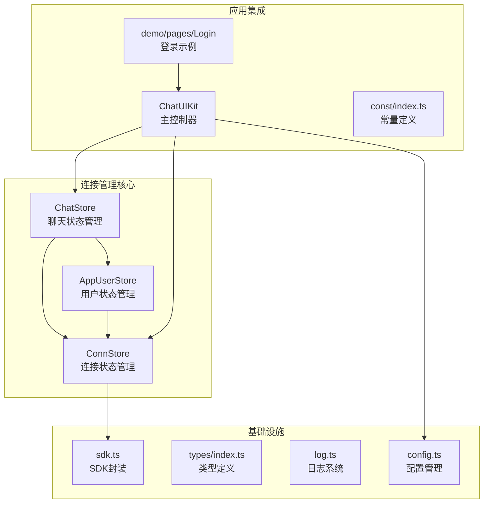
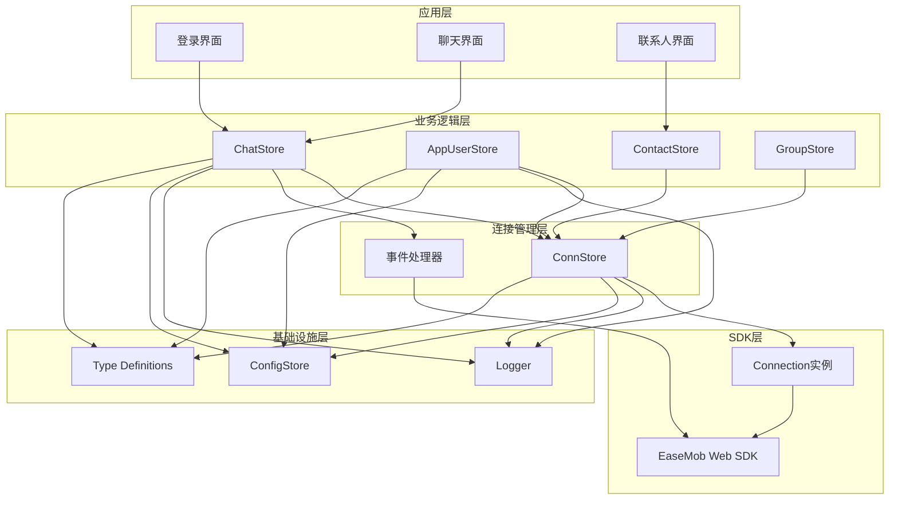
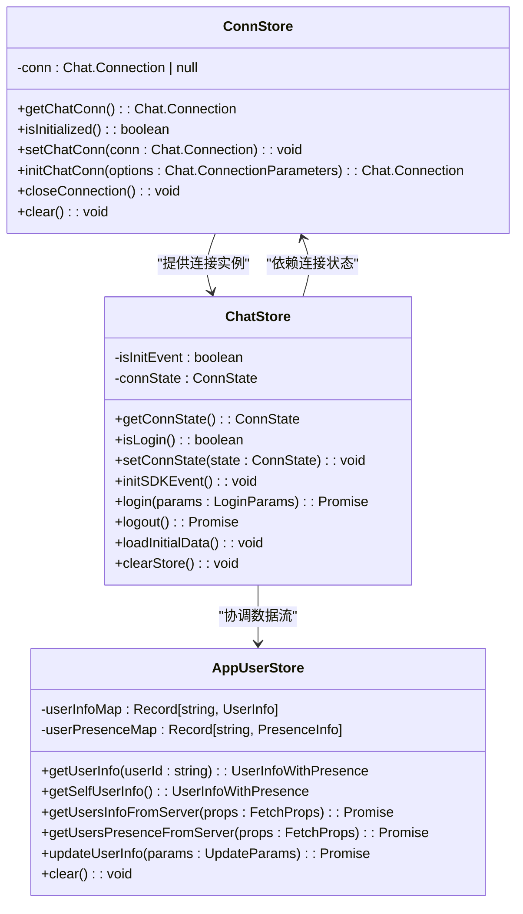
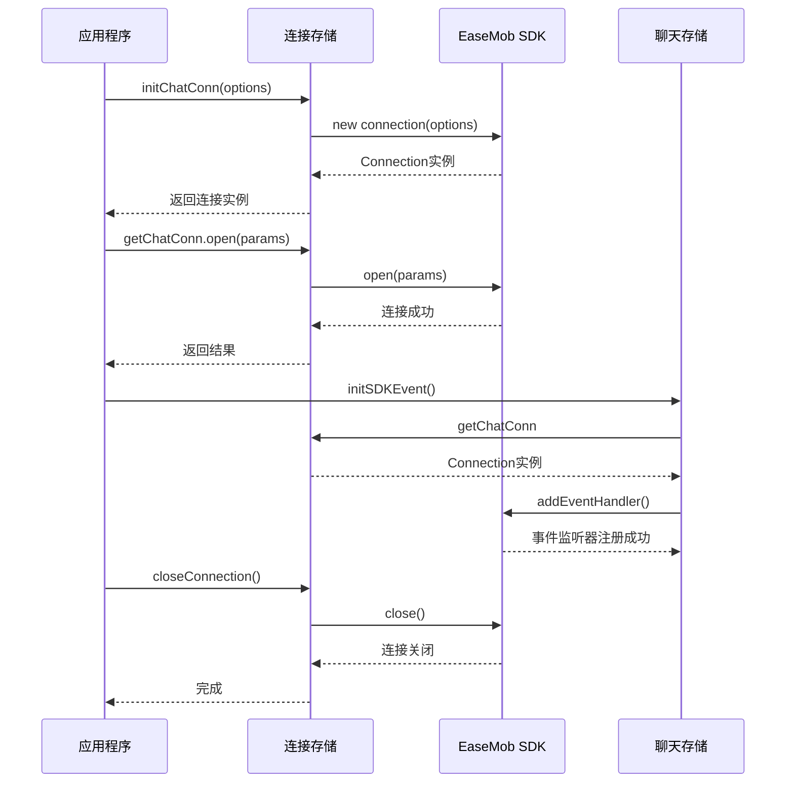
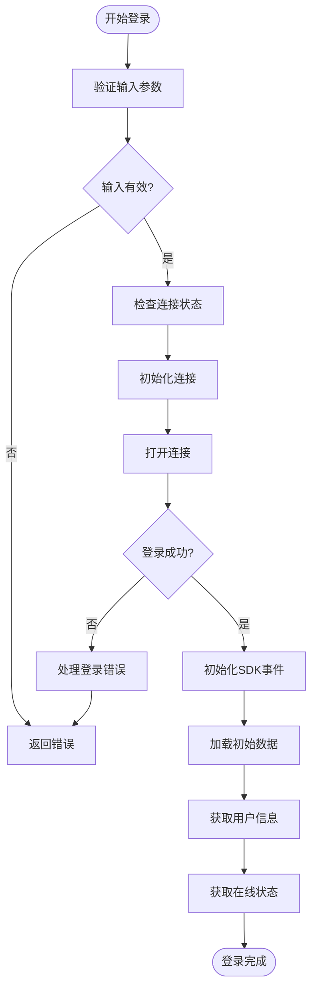
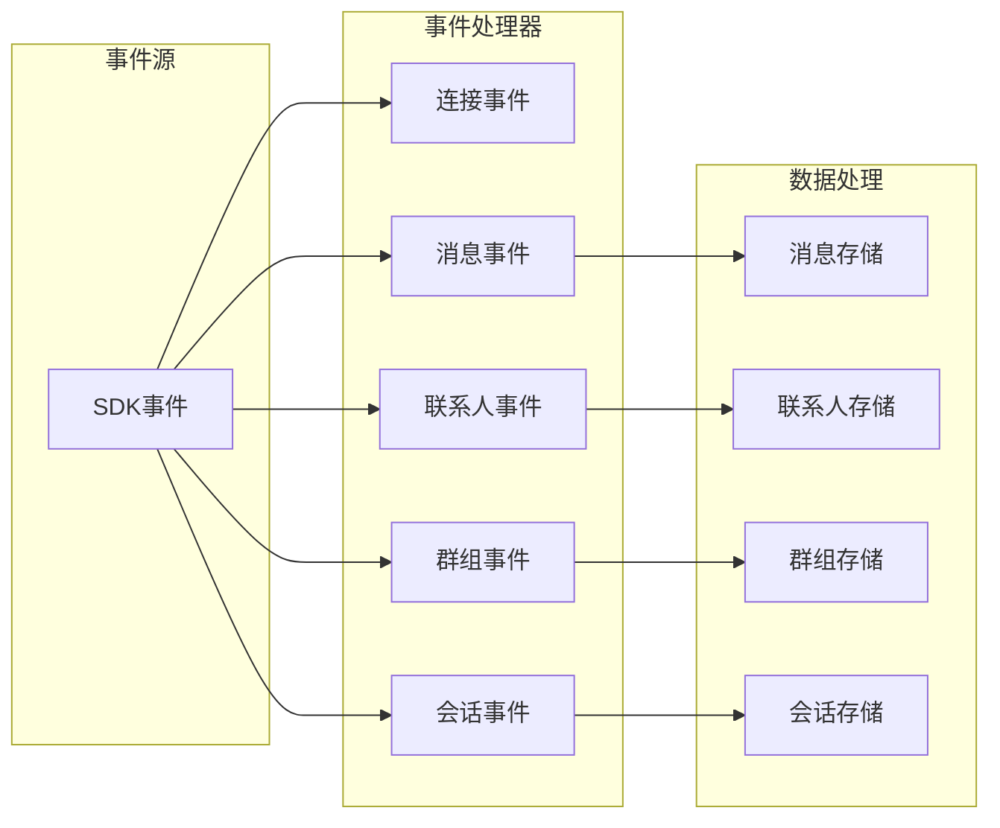
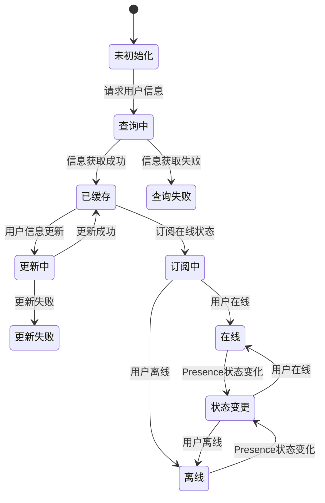
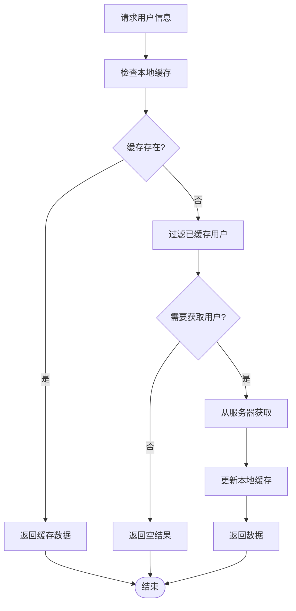
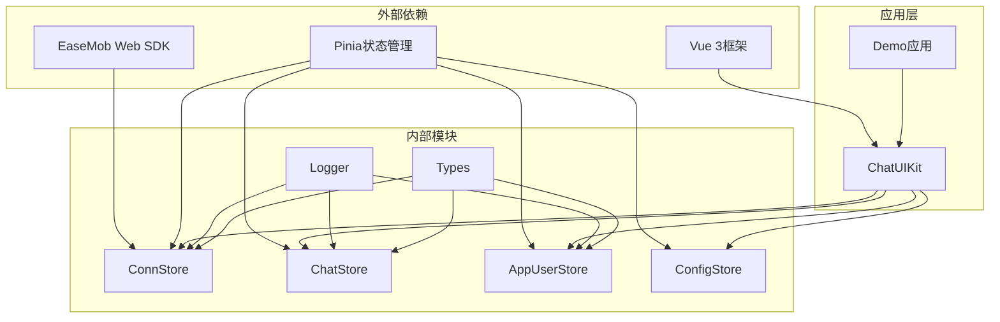

# 连接管理系统

<cite>
**本文档引用的文件**
- [ChatUIKit/stores/conn.ts](file://ChatUIKit/stores/conn.ts)
- [ChatUIKit/stores/chat.ts](file://ChatUIKit/stores/chat.ts)
- [ChatUIKit/stores/appUser.ts](file://ChatUIKit/stores/appUser.ts)
- [ChatUIKit/stores/config.ts](file://ChatUIKit/stores/config.ts)
- [ChatUIKit/sdk.ts](file://ChatUIKit/sdk.ts)
- [ChatUIKit/types/index.ts](file://ChatUIKit/types/index.ts)
- [ChatUIKit/log.ts](file://ChatUIKit/log.ts)
- [ChatUIKit/configType.ts](file://ChatUIKit/configType.ts)
- [ChatUIKit/const/index.ts](file://ChatUIKit/const/index.ts)
- [ChatUIKit/index.ts](file://ChatUIKit/index.ts)
- [demo/pages/Login/index.vue](file://demo/pages/Login/index.vue)
</cite>

## 目录
1. [简介](#简介)
2. [项目结构](#项目结构)
3. [核心组件](#核心组件)
4. [架构概览](#架构概览)
5. [详细组件分析](#详细组件分析)
6. [依赖关系分析](#依赖关系分析)
7. [性能考虑](#性能考虑)
8. [故障排除指南](#故障排除指南)
9. [结论](#结论)

## 简介

连接管理系统是EaseMob UIKit项目的核心基础设施，负责管理IM SDK的连接生命周期、事件处理和状态同步。该系统基于Vue 3的Pinia状态管理库构建，提供了类型安全的连接管理、完善的错误处理机制和高效的性能优化策略。

系统主要包含以下关键特性：
- 类型安全的连接实例管理
- 完整的连接生命周期控制
- 实时事件监听和处理
- 用户状态和在线状态管理
- 配置化的功能开关
- 统一的日志记录系统

## 项目结构

连接管理系统采用模块化设计，主要分布在以下目录结构中：

**图表来源**
- [ChatUIKit/stores/conn.ts](file://ChatUIKit/stores/conn.ts#L1-L84)
- [ChatUIKit/stores/chat.ts](file://ChatUIKit/stores/chat.ts#L1-L407)
- [ChatUIKit/stores/appUser.ts](file://ChatUIKit/stores/appUser.ts#L1-L242)

**章节来源**
- [ChatUIKit/stores/conn.ts](file://ChatUIKit/stores/conn.ts#L1-L84)
- [ChatUIKit/stores/chat.ts](file://ChatUIKit/stores/chat.ts#L1-L407)
- [ChatUIKit/stores/appUser.ts](file://ChatUIKit/stores/appUser.ts#L1-L242)

## 核心组件

### 连接状态管理 (ConnStore)

ConnStore是连接管理系统的基石，负责维护和提供IM SDK的连接实例。它提供了类型安全的访问接口和完整的生命周期管理。

**核心功能**：
- 连接实例的创建和销毁
- 连接状态的查询和验证
- 类型安全的连接访问
- 连接清理和重置

### 聊天状态管理 (ChatStore)

ChatStore协调整个聊天系统的连接状态，处理SDK事件并管理与其他store的数据流。

**核心功能**：
- SDK事件监听器的注册和管理
- 连接状态的实时更新
- 初始数据的批量加载
- 用户登录登出流程管理

### 用户状态管理 (AppUserStore)

AppUserStore专门处理用户信息和在线状态的获取、缓存和更新。

**核心功能**：
- 用户信息的服务器同步
- 在线状态的订阅和发布
- 用户信息的本地缓存
- Presence状态的管理

**章节来源**
- [ChatUIKit/stores/conn.ts](file://ChatUIKit/stores/conn.ts#L15-L84)
- [ChatUIKit/stores/chat.ts](file://ChatUIKit/stores/chat.ts#L22-L398)
- [ChatUIKit/stores/appUser.ts](file://ChatUIKit/stores/appUser.ts#L17-L242)

## 架构概览

连接管理系统采用分层架构设计，确保了良好的模块分离和可维护性：

**图表来源**
- [ChatUIKit/index.ts](file://ChatUIKit/index.ts#L18-L139)
- [ChatUIKit/stores/chat.ts](file://ChatUIKit/stores/chat.ts#L1-L407)
- [ChatUIKit/stores/conn.ts](file://ChatUIKit/stores/conn.ts#L1-L84)

## 详细组件分析

### 连接状态管理组件

**图表来源**
- [ChatUIKit/stores/conn.ts](file://ChatUIKit/stores/conn.ts#L15-L84)
- [ChatUIKit/stores/chat.ts](file://ChatUIKit/stores/chat.ts#L22-L398)
- [ChatUIKit/stores/appUser.ts](file://ChatUIKit/stores/appUser.ts#L17-L242)

#### 连接生命周期管理

连接生命周期管理是系统的核心功能之一，涵盖了从连接建立到断开的完整过程：

**图表来源**
- [ChatUIKit/stores/conn.ts](file://ChatUIKit/stores/conn.ts#L54-L74)
- [ChatUIKit/stores/chat.ts](file://ChatUIKit/stores/chat.ts#L67-L221)

#### 登录流程管理

系统支持多种登录方式，包括密码登录和Token登录：

**图表来源**
- [ChatUIKit/stores/chat.ts](file://ChatUIKit/stores/chat.ts#L299-L328)
- [demo/pages/Login/index.vue](file://demo/pages/Login/index.vue#L166-L198)

**章节来源**
- [ChatUIKit/stores/conn.ts](file://ChatUIKit/stores/conn.ts#L42-L82)
- [ChatUIKit/stores/chat.ts](file://ChatUIKit/stores/chat.ts#L54-L396)
- [ChatUIKit/stores/appUser.ts](file://ChatUIKit/stores/appUser.ts#L81-L240)

### 事件处理机制

系统实现了完整的SDK事件监听和处理机制：

**图表来源**
- [ChatUIKit/stores/chat.ts](file://ChatUIKit/stores/chat.ts#L75-L217)

#### 事件类型分类

系统支持多种类型的SDK事件，每种事件都有相应的处理逻辑：

| 事件类别 | 事件类型 | 处理逻辑 |
|---------|---------|---------|
| 连接事件 | onConnected | 更新连接状态为connected，加载初始数据 |
| 连接事件 | onDisconnected | 更新连接状态为disconnected |
| 连接事件 | onReconnecting | 更新连接状态为reconnecting |
| 消息事件 | onTextMessage | 处理文本消息，更新消息状态 |
| 消息事件 | onImageMessage | 处理图片消息，更新消息状态 |
| 联系人事件 | onContactInvited | 添加联系人邀请通知 |
| 联系人事件 | onContactAdded | 更新联系人列表 |
| 群组事件 | onGroupEvent | 处理群组相关事件 |

**章节来源**
- [ChatUIKit/stores/chat.ts](file://ChatUIKit/stores/chat.ts#L74-L294)

### 用户状态管理

用户状态管理是连接系统的重要组成部分，负责维护用户信息和在线状态：

**图表来源**
- [ChatUIKit/stores/appUser.ts](file://ChatUIKit/stores/appUser.ts#L86-L182)

#### 用户信息缓存策略

系统采用了智能的用户信息缓存策略，避免重复的网络请求：

**图表来源**
- [ChatUIKit/stores/appUser.ts](file://ChatUIKit/stores/appUser.ts#L86-L125)

**章节来源**
- [ChatUIKit/stores/appUser.ts](file://ChatUIKit/stores/appUser.ts#L81-L240)

## 依赖关系分析

连接管理系统具有清晰的依赖关系，确保了模块间的松耦合：

**图表来源**
- [ChatUIKit/index.ts](file://ChatUIKit/index.ts#L1-L139)
- [ChatUIKit/stores/conn.ts](file://ChatUIKit/stores/conn.ts#L1-L84)

### 循环依赖检测

系统通过以下机制避免循环依赖：

1. **单向依赖链**：连接存储 -> 聊天存储 -> 其他存储
2. **延迟初始化**：使用getter实现延迟初始化
3. **接口隔离**：通过接口定义模块边界
4. **类型约束**：严格的TypeScript类型定义

**章节来源**
- [ChatUIKit/index.ts](file://ChatUIKit/index.ts#L38-L78)
- [ChatUIKit/stores/chat.ts](file://ChatUIKit/stores/chat.ts#L10-L20)

## 性能考虑

连接管理系统在设计时充分考虑了性能优化：

### 内存管理
- 使用Set数据结构存储群组事件来源ID，避免重复处理
- 实现智能的用户信息缓存，减少网络请求
- 连接实例的懒加载和延迟初始化

### 网络优化
- 批量获取用户信息，避免多次网络请求
- 条件性加载功能，根据配置动态启用/禁用功能
- 智能的重连机制，减少不必要的重新连接

### 并发控制
- 使用Promise处理异步操作
- 防止重复初始化连接
- 合理的事件处理顺序

## 故障排除指南

### 常见连接问题

**连接失败**
- 检查网络连接状态
- 验证AppKey和服务器配置
- 查看日志中的错误信息

**登录失败**
- 确认用户名和密码正确
- 检查Token的有效期
- 验证用户权限

**事件处理异常**
- 检查事件监听器的注册状态
- 验证连接实例的有效性
- 查看具体的错误堆栈信息

### 调试技巧

1. **启用调试模式**：通过配置项启用详细的日志输出
2. **监控连接状态**：使用连接状态getter监控连接状态变化
3. **事件跟踪**：在关键事件点添加日志标记
4. **内存泄漏检测**：定期检查连接实例的生命周期

**章节来源**
- [ChatUIKit/log.ts](file://ChatUIKit/log.ts#L5-L78)
- [ChatUIKit/stores/chat.ts](file://ChatUIKit/stores/chat.ts#L333-L345)

## 结论

连接管理系统展现了现代前端应用的最佳实践，通过以下关键特性实现了高效、可靠的IM连接管理：

1. **类型安全**：完整的TypeScript类型定义确保编译时安全性
2. **模块化设计**：清晰的模块边界和职责分离
3. **性能优化**：智能缓存、批量操作和并发控制
4. **错误处理**：完善的异常处理和恢复机制
5. **可扩展性**：灵活的配置系统和插件化架构

该系统为EaseMob UIKit项目提供了坚实的基础设施，支持大规模的实时通信应用开发。通过合理的架构设计和性能优化，系统能够处理高并发场景下的连接管理需求，为用户提供流畅的聊天体验。