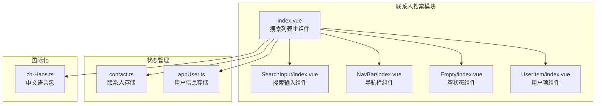
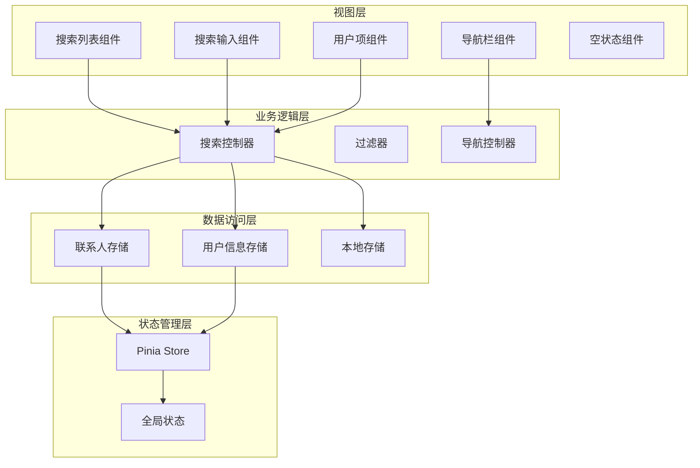
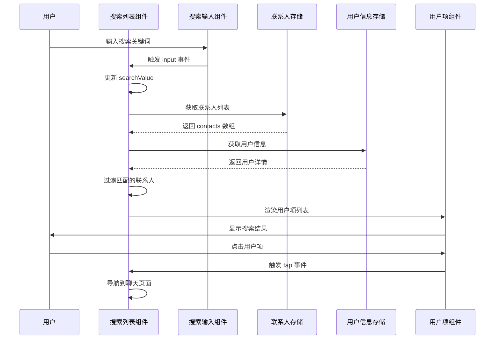
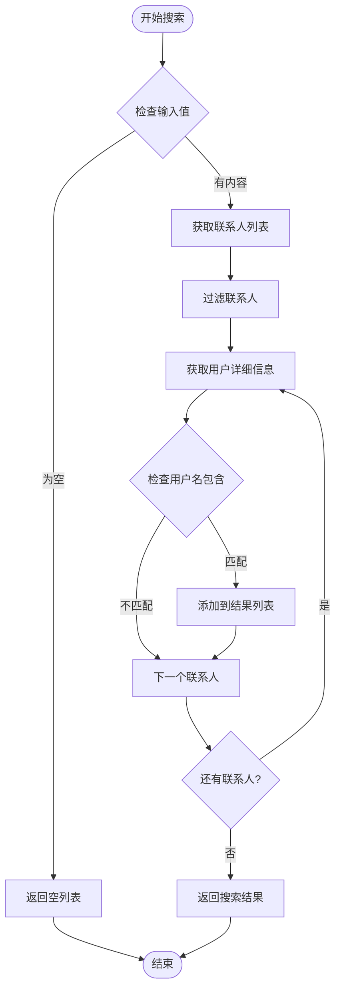
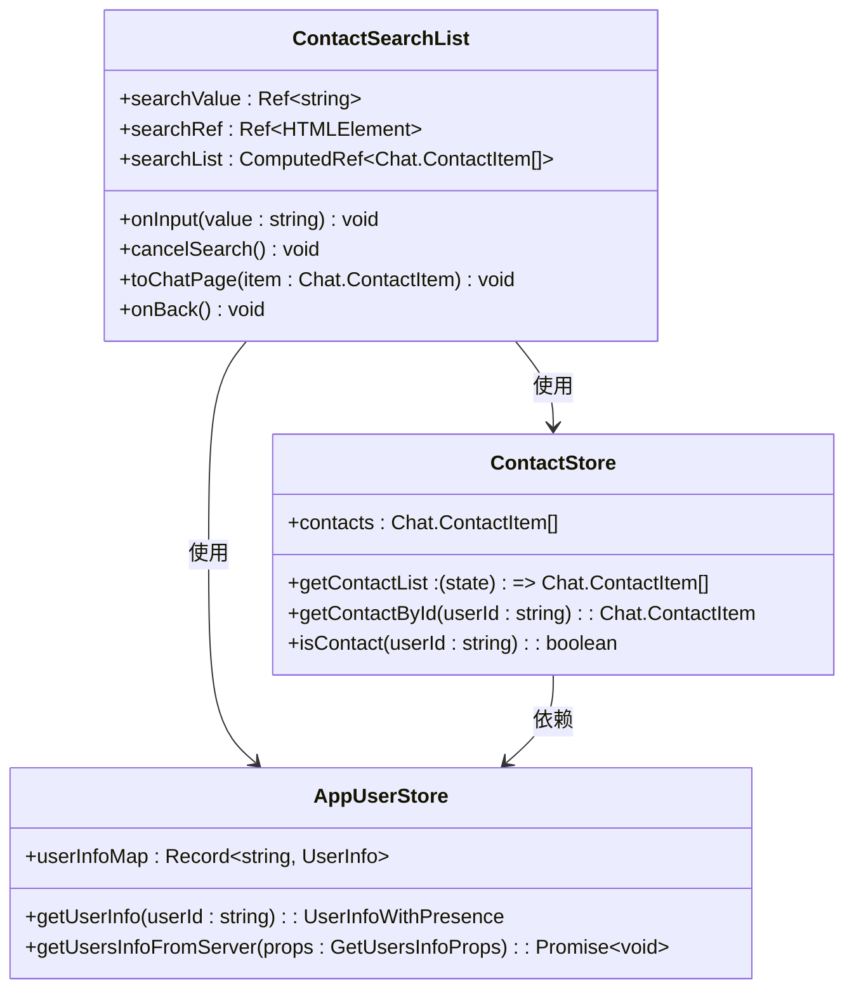
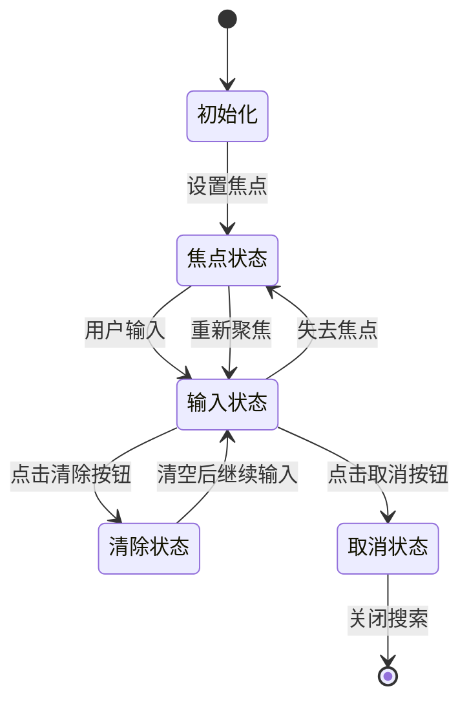
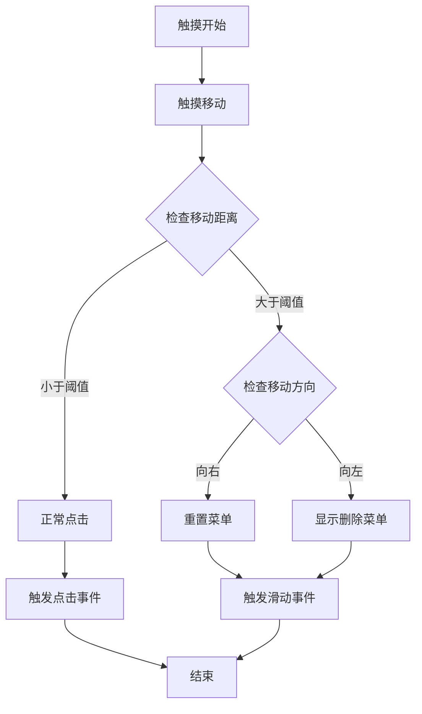
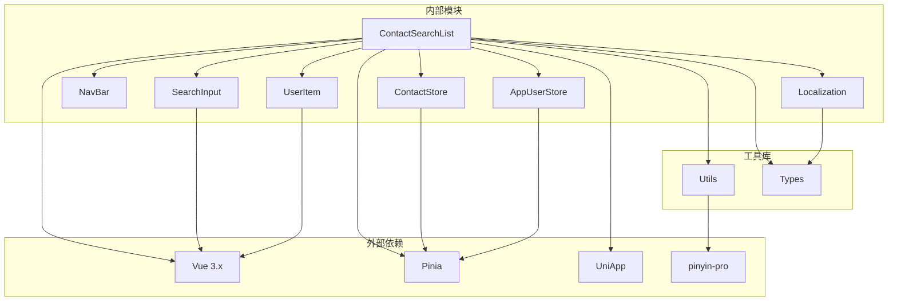

# 联系人搜索列表

<cite>
**本文档引用的文件**
- [ChatUIKit/modules/ContactSearchList/index.vue](file://ChatUIKit/modules/ContactSearchList/index.vue)
- [ChatUIKit/components/SearchInput/index.vue](file://ChatUIKit/components/SearchInput/index.vue)
- [ChatUIKit/components/NavBar/index.vue](file://ChatUIKit/components/NavBar/index.vue)
- [ChatUIKit/components/Empty/index.vue](file://ChatUIKit/components/Empty/index.vue)
- [ChatUIKit/modules/ContactList/components/UserItem/index.vue](file://ChatUIKit/modules/ContactList/components/UserItem/index.vue)
- [ChatUIKit/stores/contact.ts](file://ChatUIKit/stores/contact.ts)
- [ChatUIKit/stores/appUser.ts](file://ChatUIKit/stores/appUser.ts)
- [ChatUIKit/types/index.ts](file://ChatUIKit/types/index.ts)
- [ChatUIKit/locales/zh-Hans.ts](file://ChatUIKit/locales/zh-Hans.ts)
- [ChatUIKit/utils/index.ts](file://ChatUIKit/utils/index.ts)
- [ChatUIKit/stores/index.ts](file://ChatUIKit/stores/index.ts)
</cite>

## 目录
1. [简介](#简介)
2. [项目结构](#项目结构)
3. [核心组件](#核心组件)
4. [架构概览](#架构概览)
5. [详细组件分析](#详细组件分析)
6. [依赖关系分析](#依赖关系分析)
7. [性能考虑](#性能考虑)
8. [故障排除指南](#故障排除指南)
9. [结论](#结论)

## 简介

联系人搜索列表是 Easemob UIKit 中的一个重要功能模块，允许用户通过输入关键词来快速查找和定位联系人。该功能提供了实时搜索、智能匹配和便捷的导航体验，是即时通讯应用中不可或缺的核心功能之一。

该模块采用现代化的 Vue 3 Composition API 构建，结合 Pinia 状态管理，实现了高效的搜索算法和流畅的用户体验。通过集成联系人存储、用户信息管理和国际化支持，为用户提供了一个完整而强大的联系人搜索解决方案。

## 项目结构

联系人搜索列表功能位于 ChatUIKit 模块的 ContactSearchList 目录中，采用标准的模块化组织方式：

**图表来源**
- [ChatUIKit/modules/ContactSearchList/index.vue](file://ChatUIKit/modules/ContactSearchList/index.vue#L1-L117)
- [ChatUIKit/components/SearchInput/index.vue](file://ChatUIKit/components/SearchInput/index.vue#L1-L126)

**章节来源**
- [ChatUIKit/modules/ContactSearchList/index.vue](file://ChatUIKit/modules/ContactSearchList/index.vue#L1-L117)
- [ChatUIKit/components/SearchInput/index.vue](file://ChatUIKit/components/SearchInput/index.vue#L1-L126)

## 核心组件

### 搜索列表主组件

搜索列表主组件是整个功能的核心，负责协调各个子组件的工作流程。它采用了响应式编程模式，通过计算属性实现智能搜索功能。

主要特性包括：
- 实时搜索过滤机制
- 智能空状态处理
- 导航栏集成
- 用户界面优化

### 搜索输入组件

SearchInput 组件提供了完整的搜索输入功能，包括：
- 输入框焦点管理
- 清除按钮功能
- 取消按钮处理
- 国际化占位符支持

### 用户项组件

UserItem 组件负责显示单个联系人的信息，集成了滑动删除功能：
- 头像显示
- 用户名展示
- 在线状态指示
- 滑动菜单操作

**章节来源**
- [ChatUIKit/modules/ContactSearchList/index.vue](file://ChatUIKit/modules/ContactSearchList/index.vue#L29-L86)
- [ChatUIKit/components/SearchInput/index.vue](file://ChatUIKit/components/SearchInput/index.vue#L24-L71)
- [ChatUIKit/modules/ContactList/components/UserItem/index.vue](file://ChatUIKit/modules/ContactList/components/UserItem/index.vue#L23-L108)

## 架构概览

联系人搜索列表采用分层架构设计，各层职责明确，耦合度低：

**图表来源**
- [ChatUIKit/modules/ContactSearchList/index.vue](file://ChatUIKit/modules/ContactSearchList/index.vue#L35-L45)
- [ChatUIKit/stores/contact.ts](file://ChatUIKit/stores/contact.ts#L25-L33)
- [ChatUIKit/stores/appUser.ts](file://ChatUIKit/stores/appUser.ts#L24-L28)

## 详细组件分析

### 搜索列表组件分析

搜索列表组件是功能的核心实现，采用了现代 Vue 3 的 Composition API：

**图表来源**
- [ChatUIKit/modules/ContactSearchList/index.vue](file://ChatUIKit/modules/ContactSearchList/index.vue#L47-L77)
- [ChatUIKit/stores/contact.ts](file://ChatUIKit/stores/contact.ts#L35-L75)
- [ChatUIKit/stores/appUser.ts](file://ChatUIKit/stores/appUser.ts#L30-L79)

#### 搜索算法实现

搜索功能的核心在于高效的过滤算法：

**图表来源**
- [ChatUIKit/modules/ContactSearchList/index.vue](file://ChatUIKit/modules/ContactSearchList/index.vue#L51-L60)

#### 状态管理集成

组件通过 Pinia 状态管理实现数据共享：

**图表来源**
- [ChatUIKit/modules/ContactSearchList/index.vue](file://ChatUIKit/modules/ContactSearchList/index.vue#L39-L45)
- [ChatUIKit/stores/contact.ts](file://ChatUIKit/stores/contact.ts#L16-L33)
- [ChatUIKit/stores/appUser.ts](file://ChatUIKit/stores/appUser.ts#L17-L28)

**章节来源**
- [ChatUIKit/modules/ContactSearchList/index.vue](file://ChatUIKit/modules/ContactSearchList/index.vue#L47-L81)
- [ChatUIKit/stores/contact.ts](file://ChatUIKit/stores/contact.ts#L35-L75)
- [ChatUIKit/stores/appUser.ts](file://ChatUIKit/stores/appUser.ts#L30-L79)

### 搜索输入组件分析

SearchInput 组件提供了完整的输入处理功能：

**图表来源**
- [ChatUIKit/components/SearchInput/index.vue](file://ChatUIKit/components/SearchInput/index.vue#L43-L64)

**章节来源**
- [ChatUIKit/components/SearchInput/index.vue](file://ChatUIKit/components/SearchInput/index.vue#L24-L71)

### 用户项组件分析

UserItem 组件实现了滑动删除功能：

**图表来源**
- [ChatUIKit/modules/ContactList/components/UserItem/index.vue](file://ChatUIKit/modules/ContactList/components/UserItem/index.vue#L82-L101)

**章节来源**
- [ChatUIKit/modules/ContactList/components/UserItem/index.vue](file://ChatUIKit/modules/ContactList/components/UserItem/index.vue#L55-L108)

## 依赖关系分析

联系人搜索列表功能涉及多个层次的依赖关系：

**图表来源**
- [ChatUIKit/modules/ContactSearchList/index.vue](file://ChatUIKit/modules/ContactSearchList/index.vue#L30-L36)
- [ChatUIKit/stores/index.ts](file://ChatUIKit/stores/index.ts#L6-L16)
- [ChatUIKit/utils/index.ts](file://ChatUIKit/utils/index.ts#L4)

**章节来源**
- [ChatUIKit/modules/ContactSearchList/index.vue](file://ChatUIKit/modules/ContactSearchList/index.vue#L30-L36)
- [ChatUIKit/stores/index.ts](file://ChatUIKit/stores/index.ts#L6-L16)

## 性能考虑

### 搜索性能优化

搜索功能采用了多项性能优化策略：

1. **响应式计算优化**：使用 computed 属性避免不必要的重新计算
2. **懒加载机制**：联系人信息按需加载，减少初始渲染负担
3. **防抖处理**：输入事件采用防抖机制，避免频繁的搜索操作
4. **虚拟滚动**：对于大量联系人的情况，可考虑实现虚拟滚动

### 内存管理

1. **组件生命周期管理**：正确处理组件的创建和销毁
2. **事件监听器清理**：避免内存泄漏
3. **状态数据清理**：及时清理不再使用的搜索结果

### 网络优化

1. **批量用户信息获取**：通过分页机制批量获取用户信息
2. **缓存策略**：利用 Pinia 的响应式特性实现智能缓存
3. **错误处理**：完善的网络异常处理机制

## 故障排除指南

### 常见问题及解决方案

#### 搜索结果不准确

**问题描述**：搜索结果与预期不符

**可能原因**：
1. 用户名包含搜索关键词但显示不匹配
2. 联系人信息未完全加载
3. 搜索算法逻辑问题

**解决方法**：
1. 检查联系人数据完整性
2. 验证搜索算法实现
3. 确认用户信息缓存状态

#### 性能问题

**问题描述**：搜索响应缓慢

**可能原因**：
1. 联系人数量过多
2. 状态更新过于频繁
3. DOM 操作过多

**解决方法**：
1. 实现分页加载
2. 优化计算属性
3. 减少不必要的重新渲染

#### 导航问题

**问题描述**：返回导航功能异常

**可能原因**：
1. 页面参数传递错误
2. 路由配置问题
3. 页面栈管理异常

**解决方法**：
1. 检查页面参数传递
2. 验证路由配置
3. 处理页面栈状态

**章节来源**
- [ChatUIKit/modules/ContactSearchList/index.vue](file://ChatUIKit/modules/ContactSearchList/index.vue#L62-L81)
- [ChatUIKit/stores/contact.ts](file://ChatUIKit/stores/contact.ts#L112-L130)

## 结论

联系人搜索列表功能展现了现代前端开发的最佳实践，通过合理的架构设计和优化策略，为用户提供了高效、流畅的搜索体验。该功能模块具有以下特点：

1. **模块化设计**：清晰的组件分离和职责划分
2. **响应式编程**：充分利用 Vue 3 的响应式特性
3. **状态管理**：通过 Pinia 实现高效的状态共享
4. **性能优化**：多层面的性能优化策略
5. **用户体验**：注重细节的交互设计

该功能为即时通讯应用提供了坚实的基础，可以根据具体需求进一步扩展和完善，如添加高级搜索过滤、历史搜索记录等功能。