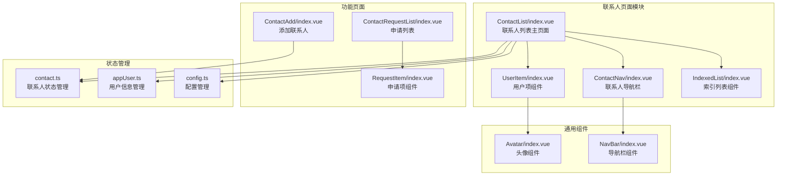
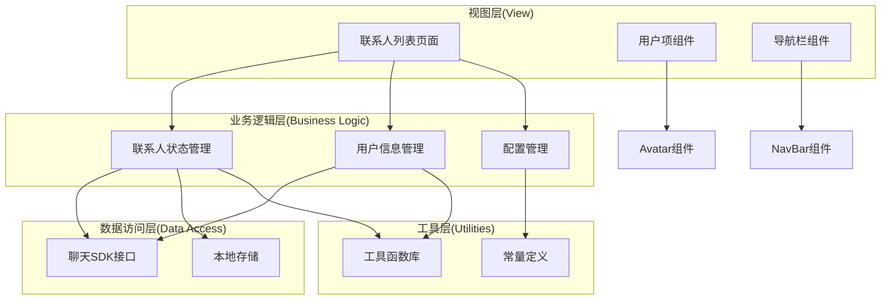
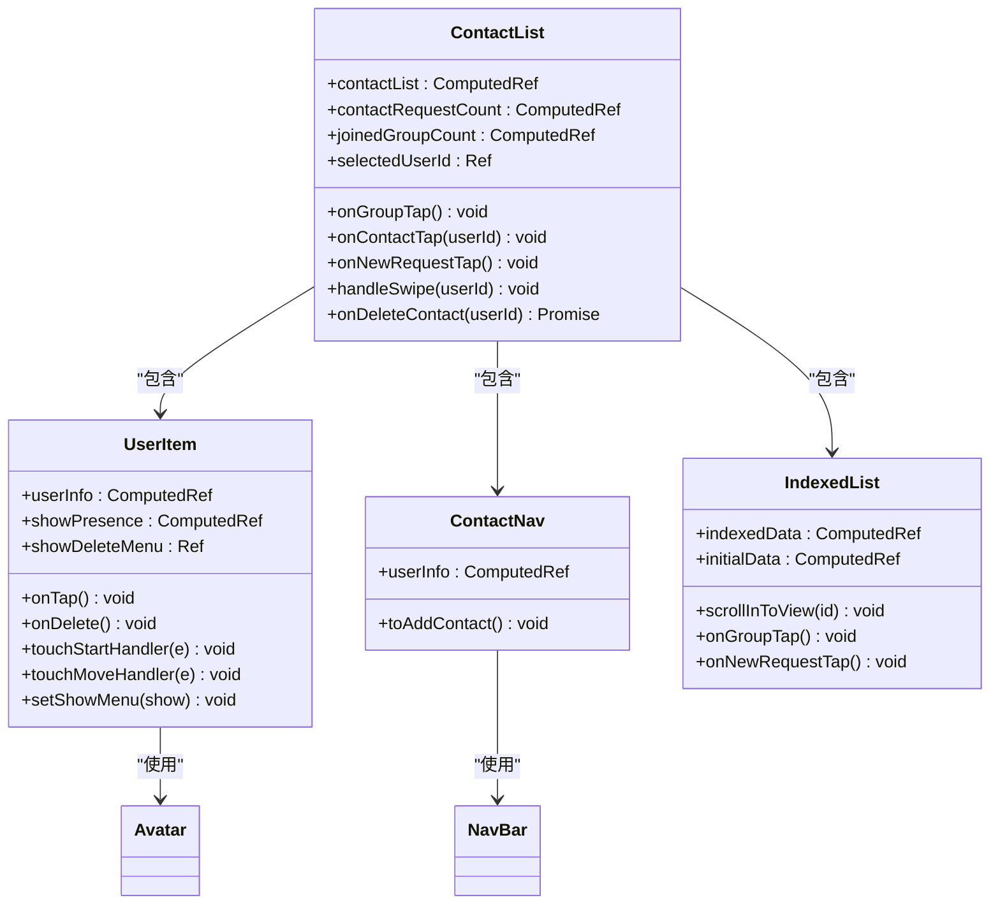
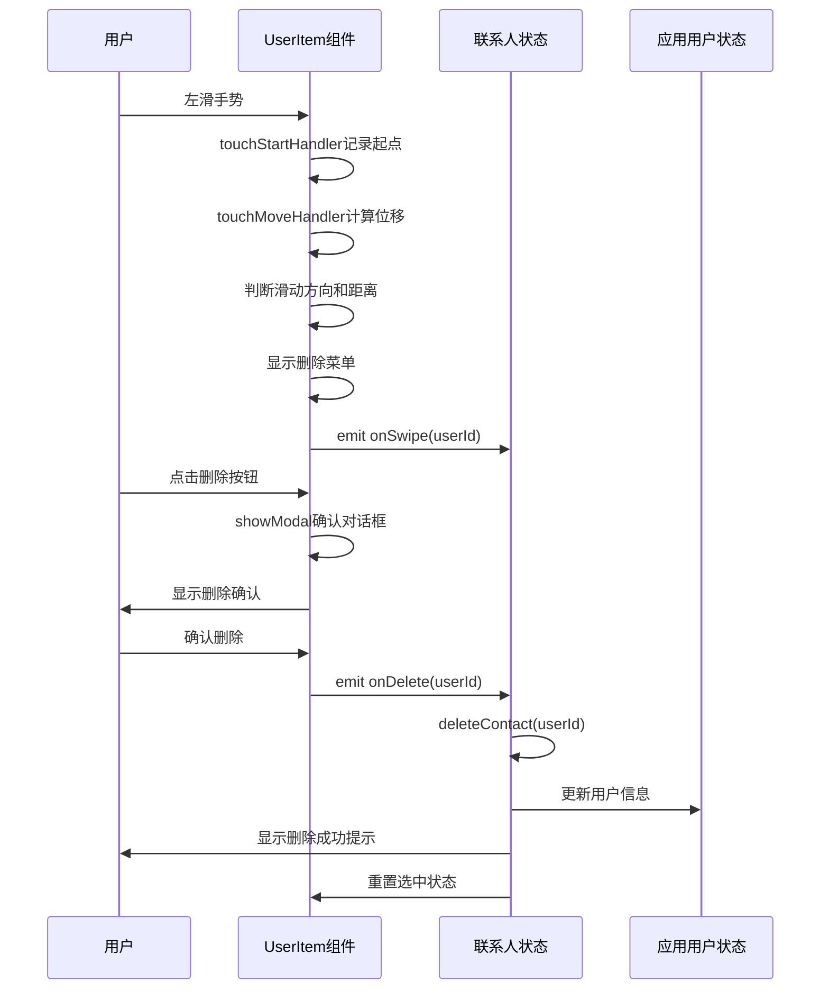
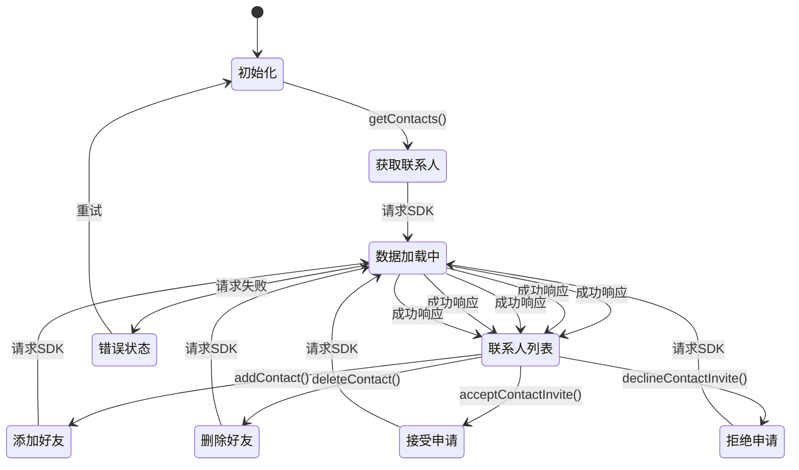
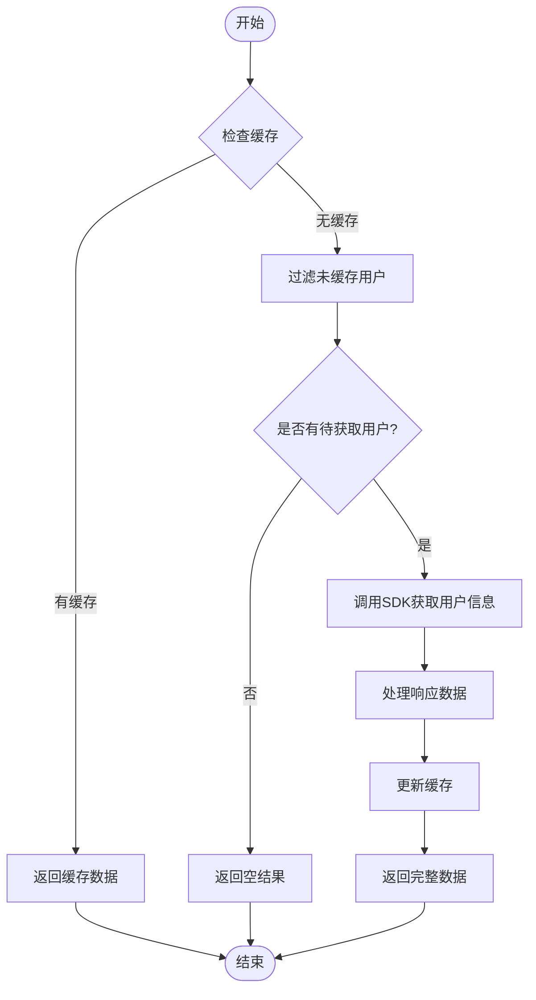
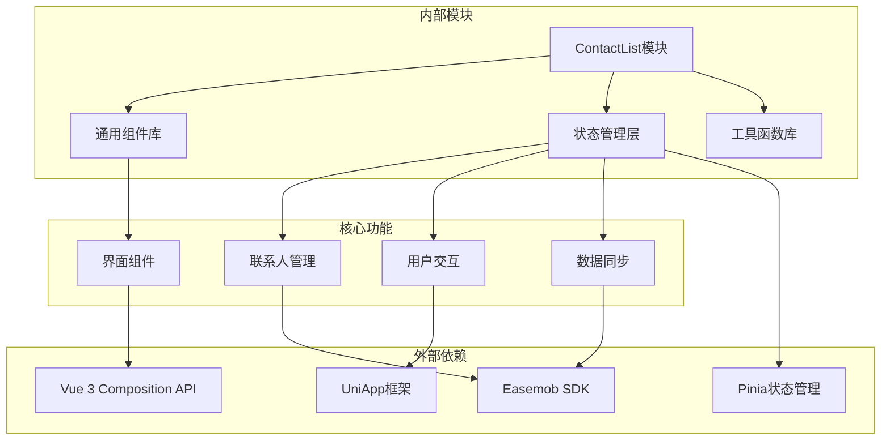

# 联系人页面文档

<cite>
**本文档引用的文件**
- [ChatUIKit/modules/ContactList/index.vue](file://ChatUIKit/modules/ContactList/index.vue)
- [ChatUIKit/modules/ContactList/style.scss](file://ChatUIKit/modules/ContactList/style.scss)
- [ChatUIKit/modules/ContactList/components/UserItem/index.vue](file://ChatUIKit/modules/ContactList/components/UserItem/index.vue)
- [ChatUIKit/modules/ContactList/components/ContactNav/index.vue](file://ChatUIKit/modules/ContactList/components/ContactNav/index.vue)
- [ChatUIKit/components/IndexedList/index.vue](file://ChatUIKit/components/IndexedList/index.vue)
- [ChatUIKit/stores/contact.ts](file://ChatUIKit/stores/contact.ts)
- [ChatUIKit/stores/appUser.ts](file://ChatUIKit/stores/appUser.ts)
- [ChatUIKit/stores/config.ts](file://ChatUIKit/stores/config.ts)
- [ChatUIKit/utils/index.ts](file://ChatUIKit/utils/index.ts)
- [ChatUIKit/components/Avatar/index.vue](file://ChatUIKit/components/Avatar/index.vue)
- [ChatUIKit/components/NavBar/index.vue](file://ChatUIKit/components/NavBar/index.vue)
- [ChatUIKit/const/index.ts](file://ChatUIKit/const/index.ts)
- [ChatUIKit/modules/ContactAdd/index.vue](file://ChatUIKit/modules/ContactAdd/index.vue)
- [ChatUIKit/modules/ContactRequestList/index.vue](file://ChatUIKit/modules/ContactRequestList/index.vue)
- [ChatUIKit/modules/ContactRequestList/components/RequestItem/index.vue](file://ChatUIKit/modules/ContactRequestList/components/RequestItem/index.vue)
</cite>

## 目录
1. [简介](#简介)
2. [项目结构](#项目结构)
3. [核心组件](#核心组件)
4. [架构概览](#架构概览)
5. [详细组件分析](#详细组件分析)
6. [依赖关系分析](#依赖关系分析)
7. [性能考虑](#性能考虑)
8. [故障排除指南](#故障排除指南)
9. [结论](#结论)

## 简介

联系人页面是Easemob UIKIT项目中的核心功能模块之一，提供了完整的联系人管理界面。该页面实现了联系人列表展示、好友申请处理、联系人搜索、滑动删除等核心功能，采用Vue 3 Composition API和Pinia状态管理，结合UniApp跨平台框架，支持微信小程序、H5等多种运行环境。

## 项目结构

联系人页面主要由以下核心文件组成：

**图表来源**
- [ChatUIKit/modules/ContactList/index.vue](file://ChatUIKit/modules/ContactList/index.vue#L1-L115)
- [ChatUIKit/modules/ContactList/components/ContactNav/index.vue](file://ChatUIKit/modules/ContactList/components/ContactNav/index.vue#L1-L99)
- [ChatUIKit/modules/ContactList/components/UserItem/index.vue](file://ChatUIKit/modules/ContactList/components/UserItem/index.vue#L1-L165)

**章节来源**
- [ChatUIKit/modules/ContactList/index.vue](file://ChatUIKit/modules/ContactList/index.vue#L1-L115)
- [ChatUIKit/modules/ContactList/style.scss](file://ChatUIKit/modules/ContactList/style.scss#L1-L53)

## 核心组件

### 联系人列表主组件

联系人列表主组件负责整个联系人页面的布局和功能协调，主要特性包括：

- **响应式联系人列表**：通过computed属性动态合并联系人信息和用户信息
- **滑动删除功能**：支持联系人项的滑动删除操作
- **导航功能**：跳转到群组列表、聊天页面、申请列表
- **平台适配**：针对微信小程序和H5平台的不同UI适配

### 用户项组件

用户项组件提供单个联系人的展示和交互功能：

- **滑动手势**：实现左滑显示删除菜单
- **头像展示**：支持在线状态显示
- **用户信息**：显示用户名、头像、在线状态
- **交互反馈**：点击、删除等操作的视觉反馈

### 索引列表组件

索引列表组件提供高效的联系人浏览体验：

- **字母索引**：支持按拼音首字母分组
- **快速定位**：点击右侧字母快速跳转到对应分组
- **特殊入口**：包含群组入口和新朋友入口
- **性能优化**：使用虚拟滚动和懒加载

**章节来源**
- [ChatUIKit/modules/ContactList/components/UserItem/index.vue](file://ChatUIKit/modules/ContactList/components/UserItem/index.vue#L1-L165)
- [ChatUIKit/components/IndexedList/index.vue](file://ChatUIKit/components/IndexedList/index.vue#L1-L341)

## 架构概览

联系人页面采用MVVM架构模式，结合响应式编程和状态管理：

**图表来源**
- [ChatUIKit/stores/contact.ts](file://ChatUIKit/stores/contact.ts#L1-L282)
- [ChatUIKit/stores/appUser.ts](file://ChatUIKit/stores/appUser.ts#L1-L242)
- [ChatUIKit/stores/config.ts](file://ChatUIKit/stores/config.ts#L1-L124)

## 详细组件分析

### 联系人列表组件分析

联系人列表组件是整个联系人页面的核心，实现了复杂的状态管理和用户交互：

**图表来源**
- [ChatUIKit/modules/ContactList/index.vue](file://ChatUIKit/modules/ContactList/index.vue#L30-L94)
- [ChatUIKit/modules/ContactList/components/UserItem/index.vue](file://ChatUIKit/modules/ContactList/components/UserItem/index.vue#L23-L108)
- [ChatUIKit/modules/ContactList/components/ContactNav/index.vue](file://ChatUIKit/modules/ContactList/components/ContactNav/index.vue#L33-L53)

#### 滑动删除功能流程

滑动删除功能通过手势识别和状态管理实现：

**图表来源**
- [ChatUIKit/modules/ContactList/components/UserItem/index.vue](file://ChatUIKit/modules/ContactList/components/UserItem/index.vue#L82-L101)
- [ChatUIKit/stores/contact.ts](file://ChatUIKit/stores/contact.ts#L150-L165)

**章节来源**
- [ChatUIKit/modules/ContactList/index.vue](file://ChatUIKit/modules/ContactList/index.vue#L30-L94)
- [ChatUIKit/modules/ContactList/components/UserItem/index.vue](file://ChatUIKit/modules/ContactList/components/UserItem/index.vue#L23-L108)

### 状态管理系统

联系人页面采用Pinia状态管理，实现了高效的数据流管理：

**图表来源**
- [ChatUIKit/stores/contact.ts](file://ChatUIKit/stores/contact.ts#L112-L130)
- [ChatUIKit/stores/contact.ts](file://ChatUIKit/stores/contact.ts#L135-L147)
- [ChatUIKit/stores/contact.ts](file://ChatUIKit/stores/contact.ts#L152-L165)

### 用户信息管理

用户信息管理通过AppUserStore实现，提供了完整的用户数据缓存和同步机制：

**图表来源**
- [ChatUIKit/stores/appUser.ts](file://ChatUIKit/stores/appUser.ts#L86-L125)

**章节来源**
- [ChatUIKit/stores/contact.ts](file://ChatUIKit/stores/contact.ts#L1-L282)
- [ChatUIKit/stores/appUser.ts](file://ChatUIKit/stores/appUser.ts#L1-L242)

## 依赖关系分析

联系人页面的依赖关系体现了清晰的分层架构：

**图表来源**
- [ChatUIKit/stores/index.ts](file://ChatUIKit/stores/index.ts#L1-L31)
- [ChatUIKit/utils/index.ts](file://ChatUIKit/utils/index.ts#L1-L344)

### 关键依赖关系

1. **状态管理依赖**：所有组件都依赖于Pinia状态管理
2. **SDK集成**：通过ConnStore间接依赖Easemob SDK
3. **平台适配**：通过工具函数适配不同运行环境
4. **组件复用**：通用组件被多个页面复用

**章节来源**
- [ChatUIKit/stores/index.ts](file://ChatUIKit/stores/index.ts#L1-L31)
- [ChatUIKit/utils/index.ts](file://ChatUIKit/utils/index.ts#L94-L103)

## 性能考虑

联系人页面在设计时充分考虑了性能优化：

### 内存管理
- 使用computed替代autorun，避免不必要的重新计算
- 采用懒加载策略，只在需要时获取用户信息
- 合理使用响应式数据，避免深层嵌套

### 网络优化
- 分页获取用户信息，避免一次性请求大量数据
- 缓存用户信息，减少重复网络请求
- 批量处理联系人操作

### UI渲染优化
- 使用虚拟滚动技术处理大量联系人列表
- 滑动删除功能使用CSS变换而非DOM操作
- 图片懒加载和错误处理

## 故障排除指南

### 常见问题及解决方案

1. **联系人列表不显示**
   - 检查网络连接状态
   - 验证用户登录状态
   - 查看控制台错误信息

2. **滑动删除功能失效**
   - 确认触摸事件绑定正常
   - 检查CSS样式冲突
   - 验证手势识别逻辑

3. **用户信息显示异常**
   - 检查用户信息缓存状态
   - 验证SDK接口调用
   - 确认权限设置

4. **平台兼容性问题**
   - 检查条件编译指令
   - 验证平台特定样式
   - 测试不同平台表现

**章节来源**
- [ChatUIKit/modules/ContactList/index.vue](file://ChatUIKit/modules/ContactList/index.vue#L79-L93)
- [ChatUIKit/stores/contact.ts](file://ChatUIKit/stores/contact.ts#L152-L165)

## 结论

联系人页面作为Easemob UIKIT的核心功能模块，展现了现代前端开发的最佳实践。通过采用Vue 3 Composition API、Pinia状态管理、UniApp跨平台框架，实现了高性能、可维护、用户体验优秀的联系人管理功能。

该页面的主要优势包括：
- **模块化设计**：清晰的组件分离和职责划分
- **响应式架构**：基于computed的自动状态管理
- **性能优化**：合理的缓存策略和渲染优化
- **平台适配**：良好的多平台兼容性
- **扩展性强**：易于添加新功能和定制化需求

未来可以进一步优化的方向包括：
- 增加更多的用户交互反馈
- 优化大数据量场景下的性能表现
- 增强离线状态下的功能支持
- 提供更丰富的个性化配置选项