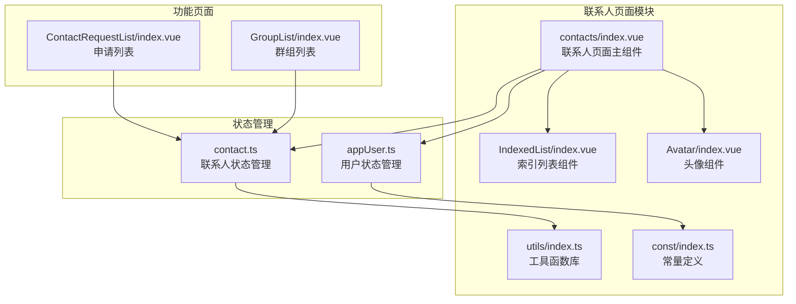
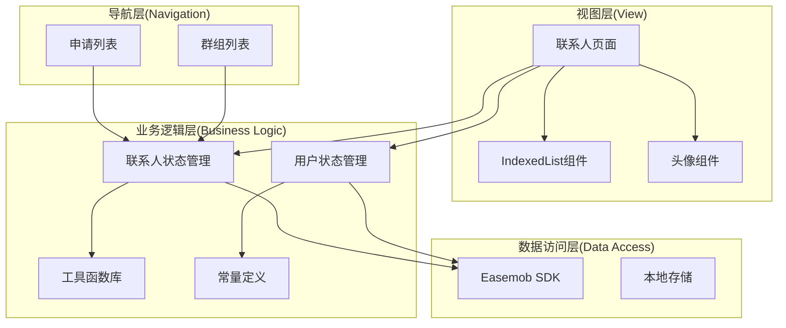
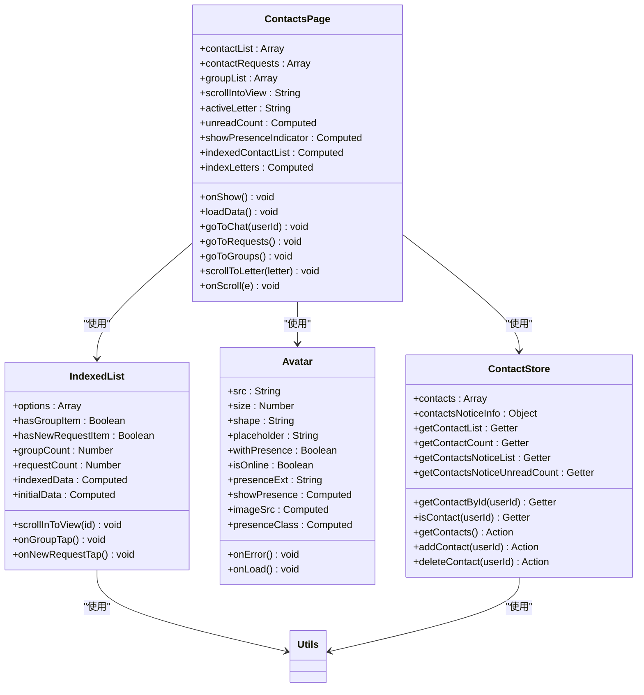
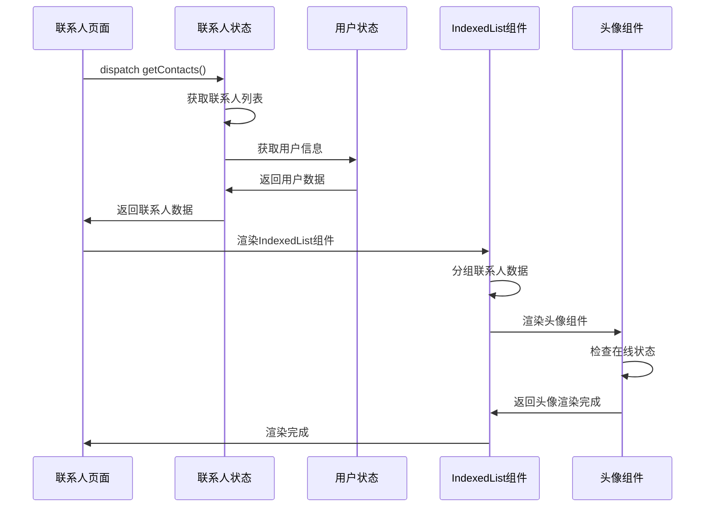
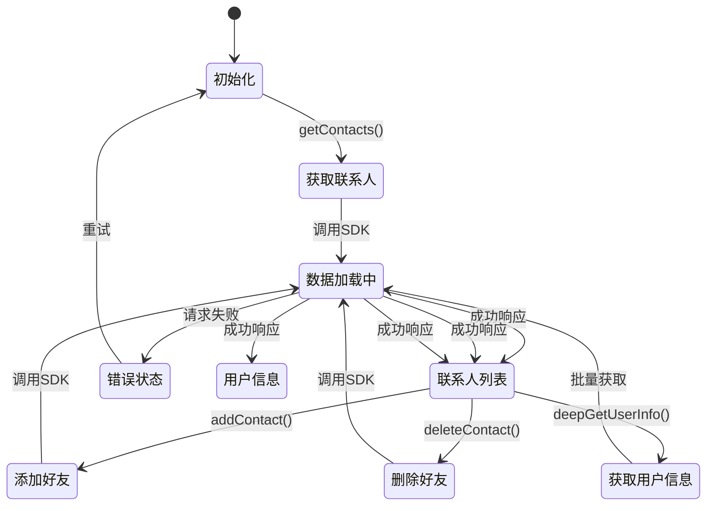
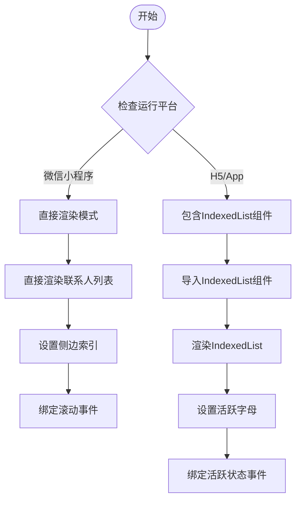
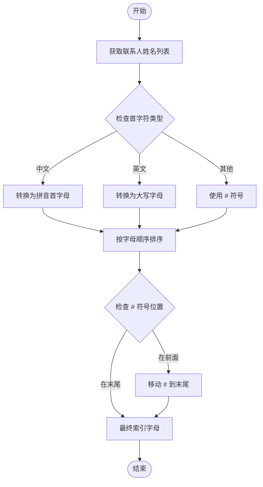
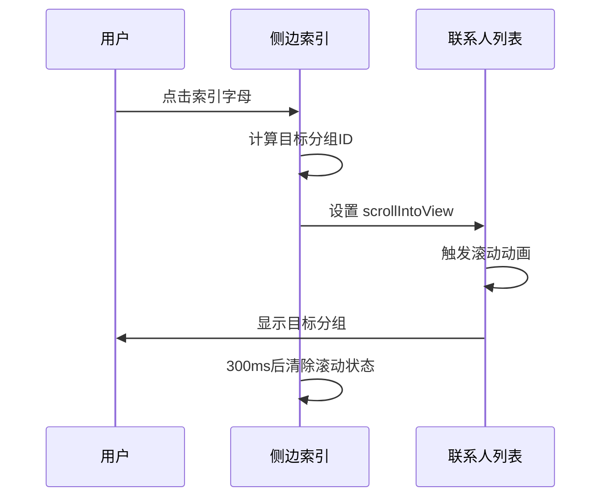
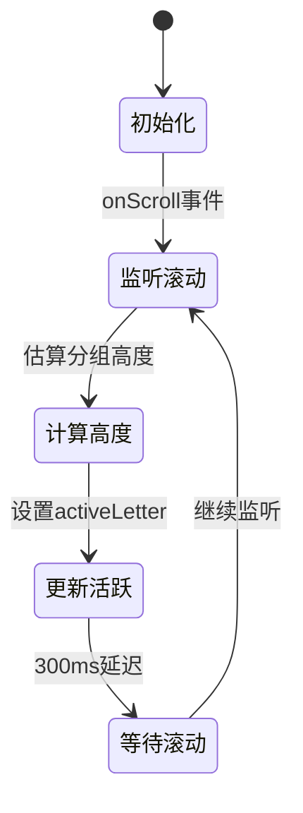

# 联系人页面文档

<cite>
**本文档引用的文件**
- [vue2-demo/pages/contacts/index.vue](file://vue2-demo/pages/contacts/index.vue)
- [ChatUIKit/components/IndexedList/index.vue](file://ChatUIKit/components/IndexedList/index.vue)
- [ChatUIKit/components/Avatar/index.vue](file://ChatUIKit/components/Avatar/index.vue)
- [ChatUIKit/utils/index.ts](file://ChatUIKit/utils/index.ts)
- [ChatUIKit/const/index.ts](file://ChatUIKit/const/index.ts)
- [ChatUIKit/stores/contact.ts](file://ChatUIKit/stores/contact.ts)
- [ChatUIKit/stores/appUser.ts](file://ChatUIKit/stores/appUser.ts)
</cite>

## 更新摘要
**变更内容**
- 完全重写了联系人页面实现，移除了Mini Program不兼容的scoped slot
- 新增了平台特定的条件编译支持（#ifdef MP-WEIXIN/#ifndef MP-WEIXIN）
- 实现了H5/App平台使用IndexedList组件和微信小程序平台的直接渲染优化
- 新增了侧边索引导航系统，包括active letter highlighting功能
- 采用原生Vue 2实现方式，新增约200行代码
- 优化了联系人列表渲染性能和用户体验

## 目录
1. [简介](#简介)
2. [项目结构](#项目结构)
3. [核心组件](#核心组件)
4. [架构概览](#架构概览)
5. [详细组件分析](#详细组件分析)
6. [平台特定实现](#平台特定实现)
7. [侧边索引导航系统](#侧边索引导航系统)
8. [性能优化策略](#性能优化策略)
9. [平台兼容性](#平台兼容性)
10. [故障排除指南](#故障排除指南)
11. [结论](#结论)

## 简介

联系人页面是Easemob UIKIT项目中的核心功能模块之一，经过重大重构后提供了完整的联系人管理界面。该页面实现了联系人列表展示、好友申请处理、联系人搜索、滑动删除等核心功能，采用Vue 2 + Pinia架构，结合UniApp跨平台框架，支持微信小程序、H5等多种运行环境。

**更新** 页面完全重写，移除了不兼容的scoped slot，新增了平台特定的条件编译支持，实现了H5/App平台使用IndexedList组件和微信小程序平台的直接渲染优化，显著提升了用户体验和性能表现。

## 项目结构

联系人页面主要由以下核心文件组成：

**图表来源**
- [vue2-demo/pages/contacts/index.vue:1-490](file://vue2-demo/pages/contacts/index.vue#L1-L490)
- [ChatUIKit/components/IndexedList/index.vue:1-341](file://ChatUIKit/components/IndexedList/index.vue#L1-L341)
- [ChatUIKit/components/Avatar/index.vue:1-188](file://ChatUIKit/components/Avatar/index.vue#L1-L188)
- [ChatUIKit/stores/contact.ts:1-200](file://ChatUIKit/stores/contact.ts#L1-L200)

**章节来源**
- [vue2-demo/pages/contacts/index.vue:1-490](file://vue2-demo/pages/contacts/index.vue#L1-L490)

## 核心组件

### 联系人页面主组件

联系人页面主组件负责整个联系人页面的布局和功能协调，主要特性包括：

- **响应式联系人列表**：通过computed属性动态合并联系人信息和用户信息
- **平台特定渲染**：根据运行平台选择不同的渲染策略
- **侧边索引导航**：支持按字母快速跳转到对应分组
- **特殊入口项**：包含新朋友和群组入口
- **在线状态显示**：支持用户在线状态徽标显示
- **条件编译支持**：针对不同平台的UI适配

### IndexedList组件

IndexedList组件提供完整的索引列表功能，专为H5/App平台设计：

- **智能分组**：自动按首字母分组联系人
- **侧边索引**：右侧字母索引支持快速跳转
- **特殊入口**：内置新朋友和群组入口
- **活跃状态**：索引字母高亮显示当前分组
- **插槽支持**：灵活的内容渲染机制

### 头像组件

头像组件提供用户头像展示和在线状态显示功能：

- **在线状态徽标**：支持多种在线状态显示
- **错误处理**：头像加载失败时的占位符处理
- **形状配置**：支持圆形和方形头像
- **尺寸自适应**：可配置的头像尺寸

### 工具函数库

工具函数库提供联系人分组和国际化支持：

- **按名称分组**：支持中文拼音首字母和英文首字母分组
- **字符检测**：识别中文和英文字符类型
- **国际化支持**：多语言文本显示
- **平台检测**：不同运行环境的适配

**章节来源**
- [ChatUIKit/components/IndexedList/index.vue:1-341](file://ChatUIKit/components/IndexedList/index.vue#L1-L341)
- [ChatUIKit/components/Avatar/index.vue:1-188](file://ChatUIKit/components/Avatar/index.vue#L1-L188)
- [ChatUIKit/utils/index.ts:314-344](file://ChatUIKit/utils/index.ts#L314-L344)

## 架构概览

联系人页面采用MVVM架构模式，结合响应式编程和状态管理：

**图表来源**
- [ChatUIKit/stores/contact.ts:25-76](file://ChatUIKit/stores/contact.ts#L25-L76)
- [ChatUIKit/stores/appUser.ts](file://ChatUIKit/stores/appUser.ts)
- [ChatUIKit/utils/index.ts:328-344](file://ChatUIKit/utils/index.ts#L328-L344)

## 详细组件分析

### 联系人页面组件分析

联系人页面组件是整个联系人页面的核心，实现了复杂的状态管理和用户交互：

**图表来源**
- [vue2-demo/pages/contacts/index.vue:118-282](file://vue2-demo/pages/contacts/index.vue#L118-L282)
- [ChatUIKit/components/IndexedList/index.vue:101-186](file://ChatUIKit/components/IndexedList/index.vue#L101-L186)
- [ChatUIKit/components/Avatar/index.vue:25-96](file://ChatUIKit/components/Avatar/index.vue#L25-L96)
- [ChatUIKit/stores/contact.ts:25-200](file://ChatUIKit/stores/contact.ts#L25-L200)

#### 联系人列表渲染流程

联系人列表渲染通过分组算法和模板渲染实现：

**图表来源**
- [vue2-demo/pages/contacts/index.vue:202-235](file://vue2-demo/pages/contacts/index.vue#L202-L235)
- [ChatUIKit/stores/contact.ts:112-130](file://ChatUIKit/stores/contact.ts#L112-L130)
- [ChatUIKit/stores/appUser.ts](file://ChatUIKit/stores/appUser.ts)

**章节来源**
- [vue2-demo/pages/contacts/index.vue:118-282](file://vue2-demo/pages/contacts/index.vue#L118-L282)
- [ChatUIKit/stores/contact.ts:112-200](file://ChatUIKit/stores/contact.ts#L112-L200)

### 状态管理系统

联系人页面采用Pinia状态管理，实现了高效的数据流管理：

**图表来源**
- [ChatUIKit/stores/contact.ts:112-130](file://ChatUIKit/stores/contact.ts#L112-L130)
- [ChatUIKit/stores/contact.ts:135-165](file://ChatUIKit/stores/contact.ts#L135-L165)
- [ChatUIKit/stores/contact.ts:83-107](file://ChatUIKit/stores/contact.ts#L83-L107)

## 平台特定实现

### H5/App平台实现

**更新** H5/App平台使用IndexedList组件，提供完整的索引列表功能：

- **IndexedList集成**：使用IndexedList组件处理所有联系人渲染
- **插槽机制**：通过scoped slot自定义联系人项渲染
- **侧边索引**：IndexedList内置的字母索引系统
- **活跃状态**：索引字母自动高亮显示当前分组
- **性能优化**：组件化的渲染机制提升大数据量处理效率

### 微信小程序平台实现

**更新** 微信小程序平台采用直接渲染优化：

- **原生模板**：移除scoped slot，使用标准Vue模板语法
- **滚动优化**：使用scroll-view组件优化长列表滚动
- **侧边索引**：自定义侧边字母索引，支持点击跳转
- **活跃高亮**：实时更新当前高亮的索引字母
- **滚动监听**：根据滚动位置动态更新活跃状态

### 条件编译机制

**新增** 通过条件编译指令实现平台特定的代码组织：

**图表来源**
- [vue2-demo/pages/contacts/index.vue:6-33](file://vue2-demo/pages/contacts/index.vue#L6-L33)
- [vue2-demo/pages/contacts/index.vue:35-104](file://vue2-demo/pages/contacts/index.vue#L35-L104)

**章节来源**
- [vue2-demo/pages/contacts/index.vue:6-104](file://vue2-demo/pages/contacts/index.vue#L6-L104)
- [vue2-demo/pages/contacts/index.vue:109-124](file://vue2-demo/pages/contacts/index.vue#L109-L124)

## 侧边索引导航系统

### 索引字母生成流程

侧边索引导航系统通过智能分组算法生成索引字母：

**图表来源**
- [ChatUIKit/utils/index.ts:328-344](file://ChatUIKit/utils/index.ts#L328-L344)

### 索引导航交互流程

索引导航支持点击跳转到对应分组：

**图表来源**
- [vue2-demo/pages/contacts/index.vue:255-262](file://vue2-demo/pages/contacts/index.vue#L255-L262)

### 活跃状态管理

**新增** 实时跟踪当前显示的分组并更新索引高亮：

**图表来源**
- [vue2-demo/pages/contacts/index.vue:264-279](file://vue2-demo/pages/contacts/index.vue#L264-L279)

**章节来源**
- [vue2-demo/pages/contacts/index.vue:156-185](file://vue2-demo/pages/contacts/index.vue#L156-L185)
- [vue2-demo/pages/contacts/index.vue:255-279](file://vue2-demo/pages/contacts/index.vue#L255-L279)

## 性能优化策略

### 渲染优化

联系人页面采用了多项性能优化策略：

- **原生模板渲染**：移除scoped slot，使用原生Vue模板提高渲染性能
- **组件化架构**：H5/App平台使用IndexedList组件，减少重复代码
- **分组算法优化**：使用对象分组而非数组过滤，提升大数据量处理效率
- **懒加载策略**：头像组件支持错误处理和加载状态管理
- **内存管理**：合理使用响应式数据，避免深层嵌套

### 网络优化

- **批量数据获取**：用户信息采用批量获取策略
- **缓存机制**：利用Pinia状态管理进行数据缓存
- **错误处理**：完善的网络请求错误处理机制

### UI渲染优化

- **滚动优化**：使用scroll-view组件优化长列表滚动
- **状态管理**：通过data属性管理滚动状态，避免复杂计算
- **样式优化**：使用SCSS变量和混合器提升样式维护性
- **条件编译**：根据平台选择最优的渲染策略

## 平台兼容性

### 条件编译支持

**更新** 完全移除了不兼容的scoped slot，采用条件编译实现：

- **模板语法**：使用标准Vue模板而非scoped slot
- **样式作用域**：通过scoped属性和命名空间解决样式冲突
- **事件处理**：统一使用原生事件处理机制
- **组件通信**：通过props和events实现组件间通信

### 多平台适配

- **微信小程序**：针对小程序平台的特殊适配，使用直接渲染优化
- **H5平台**：桌面浏览器的响应式设计，使用IndexedList组件
- **App平台**：移动端设备的触摸优化，使用IndexedList组件
- **条件编译**：使用条件编译指令适配不同平台

**章节来源**
- [vue2-demo/pages/contacts/index.vue:1-490](file://vue2-demo/pages/contacts/index.vue#L1-L490)

## 故障排除指南

### 常见问题及解决方案

1. **联系人列表不显示**
   - 检查网络连接状态
   - 验证用户登录状态
   - 查看控制台错误信息

2. **侧边索引不工作**
   - 确认索引字母计算逻辑
   - 检查scroll-view组件配置
   - 验证分组数据结构

3. **头像加载失败**
   - 检查头像URL有效性
   - 验证占位符图片资源
   - 确认网络请求权限

4. **在线状态显示异常**
   - 检查用户状态配置
   - 验证presence状态映射
   - 确认store数据同步

5. **平台兼容性问题**
   - 检查条件编译指令
   - 验证平台特定样式
   - 测试不同平台表现

6. **IndexedList组件问题**
   - 确认组件正确导入
   - 检查插槽内容渲染
   - 验证分组数据格式

**章节来源**
- [vue2-demo/pages/contacts/index.vue:202-235](file://vue2-demo/pages/contacts/index.vue#L202-L235)
- [ChatUIKit/components/Avatar/index.vue:89-96](file://ChatUIKit/components/Avatar/index.vue#L89-L96)

## 结论

联系人页面经过重大重构后，展现了现代前端开发的最佳实践。通过采用Vue 2 + Pinia架构、平台特定的条件编译、IndexedList组件集成、侧边索引导航等技术，实现了高性能、可维护、用户体验优秀的联系人管理功能。

**更新后的优势包括**：
- **架构优化**：移除了不兼容的scoped slot，采用原生Vue模板
- **平台适配**：通过条件编译实现H5/App和微信小程序的差异化优化
- **性能提升**：IndexedList组件提升大数据量浏览效率
- **用户体验**：新增侧边索引导航和活跃状态高亮功能
- **代码质量**：更清晰的代码结构和注释，支持多平台开发

主要技术特点：
- **响应式设计**：基于computed的自动状态管理
- **模块化架构**：清晰的组件分离和职责划分
- **性能优化**：合理的缓存策略和渲染优化
- **扩展性强**：易于添加新功能和定制化需求
- **平台兼容**：通过条件编译实现多平台支持

未来可以进一步优化的方向包括：
- 增加更多的用户交互反馈
- 优化大数据量场景下的性能表现
- 增强离线状态下的功能支持
- 提供更丰富的个性化配置选项
- 扩展IndexedList组件的功能特性