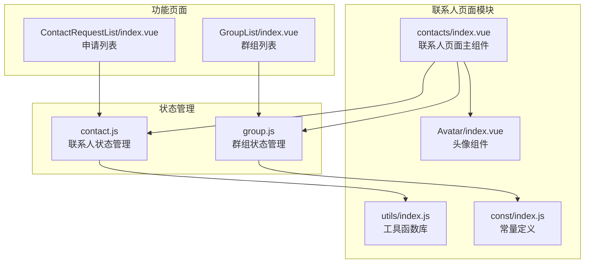
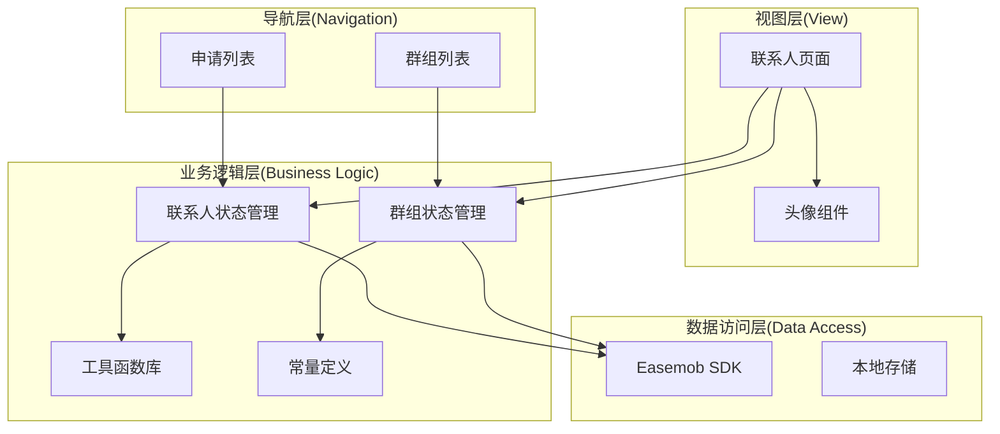
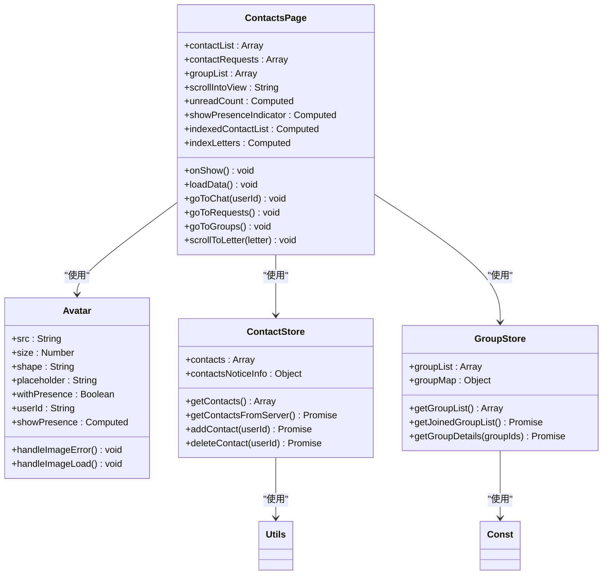
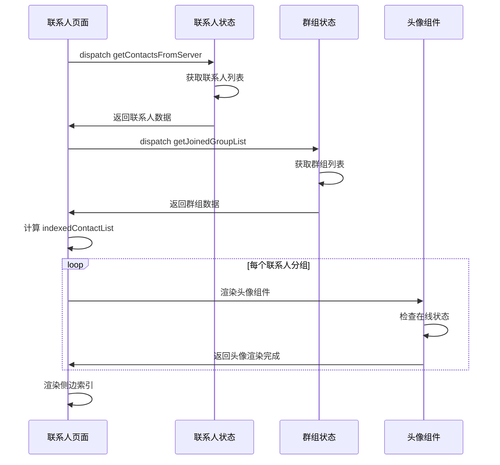
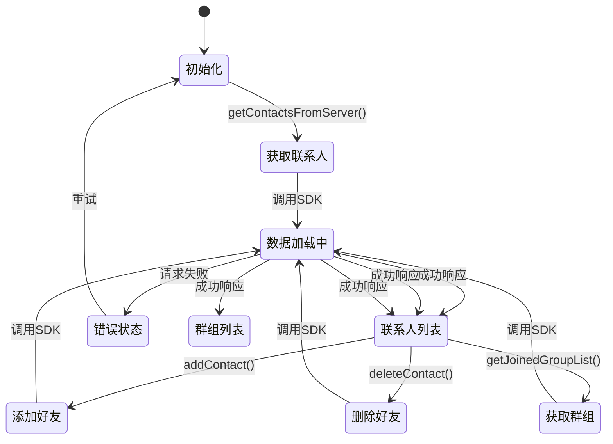
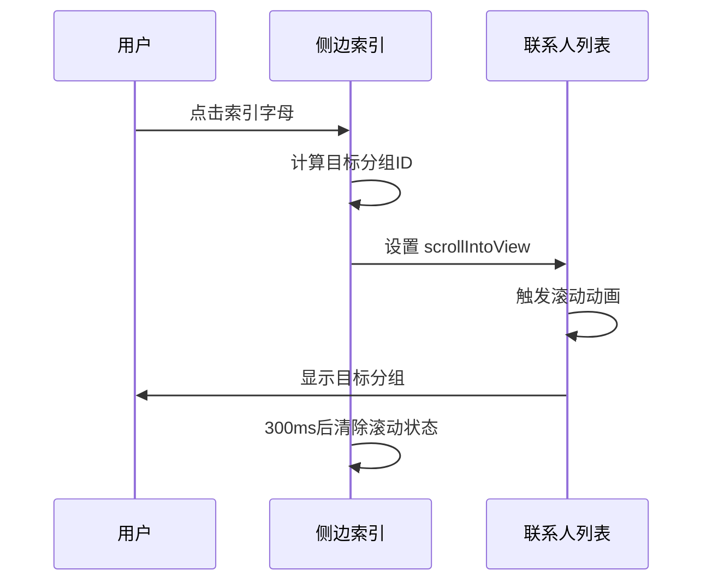

# 联系人页面文档

<cite>
**本文档引用的文件**
- [vue2-demo/pages/contacts/index.vue](file://vue2-demo/pages/contacts/index.vue)
- [vue2-demo/ChatUIKit/components/Avatar/index.vue](file://vue2-demo/ChatUIKit/components/Avatar/index.vue)
- [vue2-demo/ChatUIKit/utils/index.js](file://vue2-demo/ChatUIKit/utils/index.js)
- [vue2-demo/ChatUIKit/const/index.js](file://vue2-demo/ChatUIKit/const/index.js)
- [vue2-demo/ChatUIKit/stores/contact.js](file://vue2-demo/ChatUIKit/stores/contact.js)
- [vue2-demo/ChatUIKit/stores/group.js](file://vue2-demo/ChatUIKit/stores/group.js)
</cite>

## 更新摘要
**变更内容**
- 完全重写了联系人页面实现，移除了Mini Program不兼容的scoped slot
- 新增了侧边索引导航功能，提升联系人浏览效率
- 采用原生Vue 2实现方式，新增约200行代码
- 优化了联系人列表渲染性能和用户体验

## 目录
1. [简介](#简介)
2. [项目结构](#项目结构)
3. [核心组件](#核心组件)
4. [架构概览](#架构概览)
5. [详细组件分析](#详细组件分析)
6. [侧边索引导航系统](#侧边索引导航系统)
7. [性能优化策略](#性能优化策略)
8. [平台兼容性](#平台兼容性)
9. [故障排除指南](#故障排除指南)
10. [结论](#结论)

## 简介

联系人页面是Easemob UIKIT项目中的核心功能模块之一，经过重大重构后提供了完整的联系人管理界面。该页面实现了联系人列表展示、好友申请处理、联系人搜索、滑动删除等核心功能，采用Vue 2 + Vuex架构，结合UniApp跨平台框架，支持微信小程序、H5等多种运行环境。

**更新** 页面完全重写，移除了不兼容的scoped slot，新增了侧边索引导航功能，提升了用户体验和性能表现。

## 项目结构

联系人页面主要由以下核心文件组成：

**图表来源**
- [vue2-demo/pages/contacts/index.vue:1-373](file://vue2-demo/pages/contacts/index.vue#L1-L373)
- [vue2-demo/ChatUIKit/components/Avatar/index.vue:1-267](file://vue2-demo/ChatUIKit/components/Avatar/index.vue#L1-L267)
- [vue2-demo/ChatUIKit/stores/contact.js:1-222](file://vue2-demo/ChatUIKit/stores/contact.js#L1-L222)

**章节来源**
- [vue2-demo/pages/contacts/index.vue:1-373](file://vue2-demo/pages/contacts/index.vue#L1-L373)

## 核心组件

### 联系人页面主组件

联系人页面主组件负责整个联系人页面的布局和功能协调，主要特性包括：

- **响应式联系人列表**：通过computed属性动态合并联系人信息和用户信息
- **侧边索引导航**：支持按字母快速跳转到对应分组
- **特殊入口项**：包含新朋友和群组入口
- **在线状态显示**：支持用户在线状态徽标显示
- **平台适配**：针对不同平台的UI适配

### 头像组件

头像组件提供用户头像展示和在线状态显示功能：

- **在线状态徽标**：支持多种在线状态显示
- **错误处理**：头像加载失败时的占位符处理
- **形状配置**：支持圆形和方形头像
- **尺寸自适应**：可配置的头像尺寸

### 工具函数库

工具函数库提供联系人分组和国际化支持：

- **按名称分组**：支持中文拼音首字母和英文首字母分组
- **国际化支持**：多语言文本显示
- **平台检测**：不同运行环境的适配

**章节来源**
- [vue2-demo/ChatUIKit/components/Avatar/index.vue:1-267](file://vue2-demo/ChatUIKit/components/Avatar/index.vue#L1-L267)
- [vue2-demo/ChatUIKit/utils/index.js:752-776](file://vue2-demo/ChatUIKit/utils/index.js#L752-L776)

## 架构概览

联系人页面采用MVVM架构模式，结合响应式编程和状态管理：

**图表来源**
- [vue2-demo/ChatUIKit/stores/contact.js:116-200](file://vue2-demo/ChatUIKit/stores/contact.js#L116-L200)
- [vue2-demo/ChatUIKit/stores/group.js:73-149](file://vue2-demo/ChatUIKit/stores/group.js#L73-L149)

## 详细组件分析

### 联系人页面组件分析

联系人页面组件是整个联系人页面的核心，实现了复杂的状态管理和用户交互：

**图表来源**
- [vue2-demo/pages/contacts/index.vue:80-202](file://vue2-demo/pages/contacts/index.vue#L80-L202)
- [vue2-demo/ChatUIKit/components/Avatar/index.vue:26-168](file://vue2-demo/ChatUIKit/components/Avatar/index.vue#L26-L168)
- [vue2-demo/ChatUIKit/stores/contact.js:19-200](file://vue2-demo/ChatUIKit/stores/contact.js#L19-L200)
- [vue2-demo/ChatUIKit/stores/group.js:14-200](file://vue2-demo/ChatUIKit/stores/group.js#L14-L200)

#### 联系人列表渲染流程

联系人列表渲染通过分组算法和模板渲染实现：

**图表来源**
- [vue2-demo/pages/contacts/index.vue:142-175](file://vue2-demo/pages/contacts/index.vue#L142-L175)
- [vue2-demo/ChatUIKit/stores/contact.js:116-134](file://vue2-demo/ChatUIKit/stores/contact.js#L116-L134)
- [vue2-demo/ChatUIKit/stores/group.js:73-97](file://vue2-demo/ChatUIKit/stores/group.js#L73-L97)

**章节来源**
- [vue2-demo/pages/contacts/index.vue:80-202](file://vue2-demo/pages/contacts/index.vue#L80-L202)
- [vue2-demo/ChatUIKit/stores/contact.js:116-200](file://vue2-demo/ChatUIKit/stores/contact.js#L116-L200)

### 状态管理系统

联系人页面采用Vuex状态管理，实现了高效的数据流管理：

**图表来源**
- [vue2-demo/ChatUIKit/stores/contact.js:116-134](file://vue2-demo/ChatUIKit/stores/contact.js#L116-L134)
- [vue2-demo/ChatUIKit/stores/contact.js:150-162](file://vue2-demo/ChatUIKit/stores/contact.js#L150-L162)
- [vue2-demo/ChatUIKit/stores/group.js:73-97](file://vue2-demo/ChatUIKit/stores/group.js#L73-L97)

## 侧边索引导航系统

### 索引字母生成流程

侧边索引导航系统通过智能分组算法生成索引字母：

**图表来源**
- [vue2-demo/ChatUIKit/utils/index.js:752-776](file://vue2-demo/ChatUIKit/utils/index.js#L752-L776)

### 索引导航交互流程

索引导航支持点击跳转到对应分组：

**图表来源**
- [vue2-demo/pages/contacts/index.vue:195-200](file://vue2-demo/pages/contacts/index.vue#L195-L200)

**章节来源**
- [vue2-demo/pages/contacts/index.vue:60-71](file://vue2-demo/pages/contacts/index.vue#L60-L71)
- [vue2-demo/pages/contacts/index.vue:136-139](file://vue2-demo/pages/contacts/index.vue#L136-L139)
- [vue2-demo/pages/contacts/index.vue:195-200](file://vue2-demo/pages/contacts/index.vue#L195-L200)

## 性能优化策略

### 渲染优化

联系人页面采用了多项性能优化策略：

- **原生模板渲染**：移除scoped slot，使用原生Vue模板提高渲染性能
- **分组算法优化**：使用对象分组而非数组过滤，提升大数据量处理效率
- **懒加载策略**：头像组件支持错误处理和加载状态管理
- **内存管理**：合理使用响应式数据，避免深层嵌套

### 网络优化

- **批量数据获取**：群组详情采用批量获取策略
- **缓存机制**：利用Vuex状态管理进行数据缓存
- **错误处理**：完善的网络请求错误处理机制

### UI渲染优化

- **滚动优化**：使用scroll-view组件优化长列表滚动
- **状态管理**：通过data属性管理滚动状态，避免复杂计算
- **样式优化**：使用SCSS变量和混合器提升样式维护性

## 平台兼容性

### Mini Program兼容性

**更新** 完全移除了不兼容的scoped slot，采用原生Vue模板语法：

- **模板语法**：使用标准Vue模板而非scoped slot
- **样式作用域**：通过scoped属性和命名空间解决样式冲突
- **事件处理**：统一使用原生事件处理机制
- **组件通信**：通过props和events实现组件间通信

### 多平台适配

- **微信小程序**：针对小程序平台的特殊适配
- **H5平台**：桌面浏览器的响应式设计
- **App平台**：移动端设备的触摸优化
- **条件编译**：使用条件编译指令适配不同平台

**章节来源**
- [vue2-demo/pages/contacts/index.vue:1-373](file://vue2-demo/pages/contacts/index.vue#L1-L373)

## 故障排除指南

### 常见问题及解决方案

1. **联系人列表不显示**
   - 检查网络连接状态
   - 验证用户登录状态
   - 查看控制台错误信息

2. **侧边索引不工作**
   - 确认索引字母计算逻辑
   - 检查scroll-view组件配置
   - 验证分组数据结构

3. **头像加载失败**
   - 检查头像URL有效性
   - 验证占位符图片资源
   - 确认网络请求权限

4. **在线状态显示异常**
   - 检查用户状态配置
   - 验证presence状态映射
   - 确认store数据同步

5. **平台兼容性问题**
   - 检查条件编译指令
   - 验证平台特定样式
   - 测试不同平台表现

**章节来源**
- [vue2-demo/pages/contacts/index.vue:142-175](file://vue2-demo/pages/contacts/index.vue#L142-L175)
- [vue2-demo/ChatUIKit/components/Avatar/index.vue:159-167](file://vue2-demo/ChatUIKit/components/Avatar/index.vue#L159-L167)

## 结论

联系人页面经过重大重构后，展现了现代前端开发的最佳实践。通过采用Vue 2 + Vuex架构、原生模板渲染、侧边索引导航等技术，实现了高性能、可维护、用户体验优秀的联系人管理功能。

**更新后的优势包括**：
- **架构优化**：移除了不兼容的scoped slot，采用原生Vue模板
- **性能提升**：新增侧边索引导航，提升大数据量浏览效率
- **用户体验**：改进的交互设计和状态管理
- **平台兼容**：更好的多平台适配能力
- **代码质量**：更清晰的代码结构和注释

主要技术特点：
- **响应式设计**：基于computed的自动状态管理
- **模块化架构**：清晰的组件分离和职责划分
- **性能优化**：合理的缓存策略和渲染优化
- **扩展性强**：易于添加新功能和定制化需求

未来可以进一步优化的方向包括：
- 增加更多的用户交互反馈
- 优化大数据量场景下的性能表现
- 增强离线状态下的功能支持
- 提供更丰富的个性化配置选项