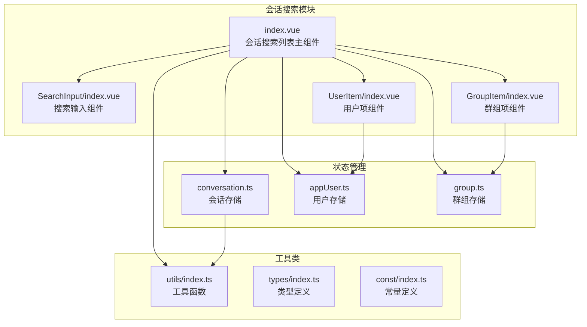
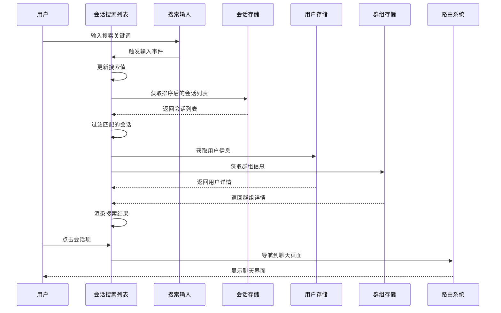
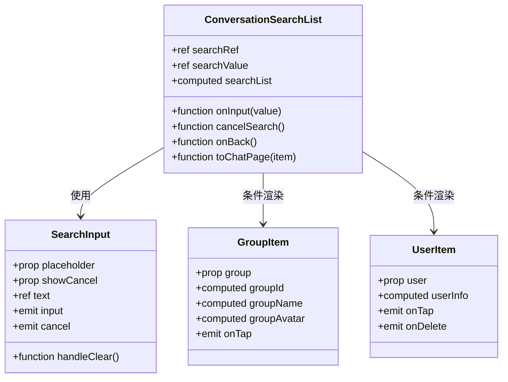
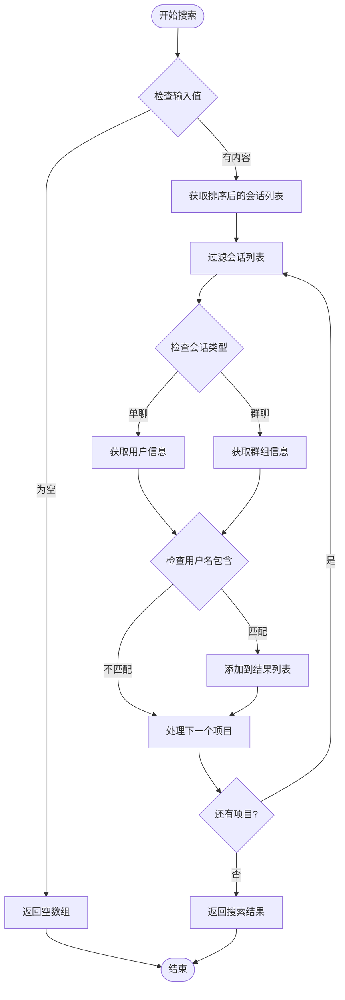
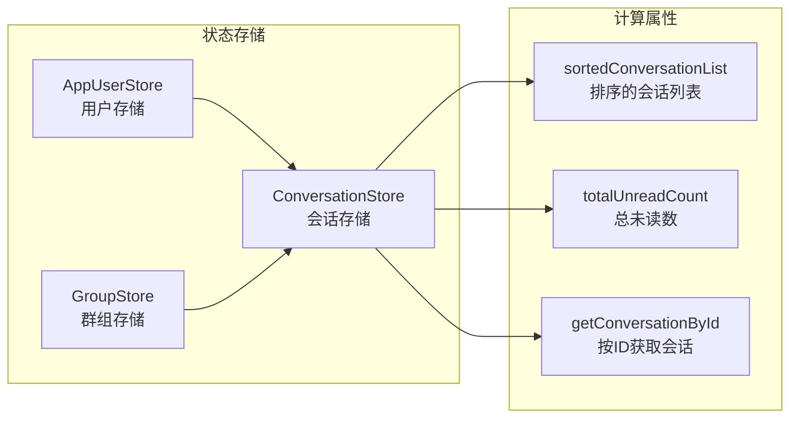
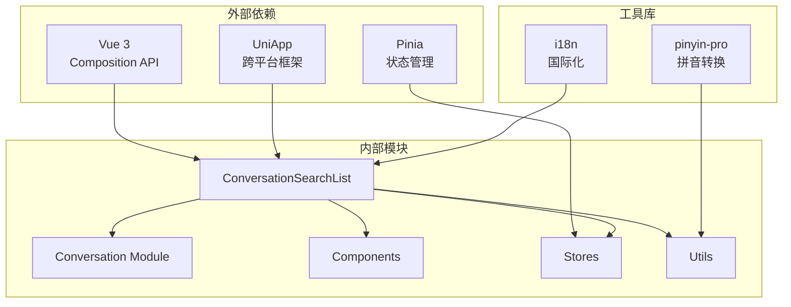

# 会话搜索列表

<cite>
**本文档引用的文件**
- [ChatUIKit/modules/ConversationSearchList/index.vue](file://ChatUIKit/modules/ConversationSearchList/index.vue)
- [ChatUIKit/modules/Conversation/components/ConversationList/index.vue](file://ChatUIKit/modules/Conversation/components/ConversationList/index.vue)
- [ChatUIKit/stores/conversation.ts](file://ChatUIKit/stores/conversation.ts)
- [ChatUIKit/components/SearchInput/index.vue](file://ChatUIKit/components/SearchInput/index.vue)
- [ChatUIKit/modules/GroupList/components/GroupItem/index.vue](file://ChatUIKit/modules/GroupList/components/GroupItem/index.vue)
- [ChatUIKit/modules/ContactList/components/UserItem/index.vue](file://ChatUIKit/modules/ContactList/components/UserItem/index.vue)
- [ChatUIKit/utils/index.ts](file://ChatUIKit/utils/index.ts)
- [ChatUIKit/types/index.ts](file://ChatUIKit/types/index.ts)
- [ChatUIKit/const/index.ts](file://ChatUIKit/const/index.ts)
- [ChatUIKit/stores/index.ts](file://ChatUIKit/stores/index.ts)
- [ChatUIKit/locales/index.ts](file://ChatUIKit/locales/index.ts)
</cite>

## 目录
1. [简介](#简介)
2. [项目结构](#项目结构)
3. [核心组件](#核心组件)
4. [架构概览](#架构概览)
5. [详细组件分析](#详细组件分析)
6. [依赖关系分析](#依赖关系分析)
7. [性能考虑](#性能考虑)
8. [故障排除指南](#故障排除指南)
9. [结论](#结论)

## 简介

会话搜索列表是聊天UI组件库中的一个重要功能模块，允许用户通过关键词搜索来快速定位特定的聊天会话。该功能支持单聊和群聊两种类型的会话搜索，并提供了直观的用户界面和流畅的交互体验。

该模块基于Vue 3 Composition API和Pinia状态管理构建，采用了现代化的前端开发技术栈，确保了良好的性能和可维护性。

## 项目结构

会话搜索列表功能位于ChatUIKit模块系统中，与会话管理和用户界面紧密集成：

**图表来源**
- [ChatUIKit/modules/ConversationSearchList/index.vue](file://ChatUIKit/modules/ConversationSearchList/index.vue#L1-L121)
- [ChatUIKit/stores/conversation.ts](file://ChatUIKit/stores/conversation.ts#L1-L421)

**章节来源**
- [ChatUIKit/modules/ConversationSearchList/index.vue](file://ChatUIKit/modules/ConversationSearchList/index.vue#L1-L121)
- [ChatUIKit/stores/conversation.ts](file://ChatUIKit/stores/conversation.ts#L1-L421)

## 核心组件

会话搜索列表功能由多个核心组件协同工作：

### 主要组件职责

1. **会话搜索列表组件** (`ConversationSearchList/index.vue`)
   - 提供搜索界面和结果展示
   - 处理用户输入和搜索逻辑
   - 管理导航和路由跳转

2. **搜索输入组件** (`SearchInput/index.vue`)
   - 实现搜索框的输入功能
   - 支持清空和取消操作
   - 提供实时输入反馈

3. **群组项组件** (`GroupItem/index.vue`)
   - 展示群组搜索结果
   - 显示群组头像和名称

4. **用户项组件** (`UserItem/index.vue`)
   - 展示用户搜索结果
   - 显示用户头像和昵称

**章节来源**
- [ChatUIKit/modules/ConversationSearchList/index.vue](file://ChatUIKit/modules/ConversationSearchList/index.vue#L35-L89)
- [ChatUIKit/components/SearchInput/index.vue](file://ChatUIKit/components/SearchInput/index.vue#L1-L126)
- [ChatUIKit/modules/GroupList/components/GroupItem/index.vue](file://ChatUIKit/modules/GroupList/components/GroupItem/index.vue#L1-L67)
- [ChatUIKit/modules/ContactList/components/UserItem/index.vue](file://ChatUIKit/modules/ContactList/components/UserItem/index.vue#L1-L165)

## 架构概览

会话搜索列表采用MVVM架构模式，结合响应式数据绑定和状态管理：

**图表来源**
- [ChatUIKit/modules/ConversationSearchList/index.vue](file://ChatUIKit/modules/ConversationSearchList/index.vue#L53-L88)
- [ChatUIKit/stores/conversation.ts](file://ChatUIKit/stores/conversation.ts#L49-L98)

## 详细组件分析

### 会话搜索列表组件

该组件是整个搜索功能的核心，负责协调各个子组件的工作：

**图表来源**
- [ChatUIKit/modules/ConversationSearchList/index.vue](file://ChatUIKit/modules/ConversationSearchList/index.vue#L35-L89)
- [ChatUIKit/components/SearchInput/index.vue](file://ChatUIKit/components/SearchInput/index.vue#L24-L71)

#### 搜索算法实现

搜索功能的核心逻辑基于会话列表的过滤机制：

**图表来源**
- [ChatUIKit/modules/ConversationSearchList/index.vue](file://ChatUIKit/modules/ConversationSearchList/index.vue#L57-L72)

**章节来源**
- [ChatUIKit/modules/ConversationSearchList/index.vue](file://ChatUIKit/modules/ConversationSearchList/index.vue#L53-L88)

### 搜索输入组件

搜索输入组件提供了完整的输入控制功能：

#### 组件特性
- 实时输入监听和处理
- 清空功能支持
- 取消按钮集成
- 国际化占位符支持

**章节来源**
- [ChatUIKit/components/SearchInput/index.vue](file://ChatUIKit/components/SearchInput/index.vue#L1-L126)

### 状态管理集成

会话搜索功能深度集成了Pinia状态管理系统：

**图表来源**
- [ChatUIKit/stores/conversation.ts](file://ChatUIKit/stores/conversation.ts#L49-L98)
- [ChatUIKit/stores/index.ts](file://ChatUIKit/stores/index.ts#L9-L16)

**章节来源**
- [ChatUIKit/stores/conversation.ts](file://ChatUIKit/stores/conversation.ts#L49-L98)
- [ChatUIKit/stores/index.ts](file://ChatUIKit/stores/index.ts#L1-L31)

## 依赖关系分析

会话搜索列表功能涉及多个层面的依赖关系：

**图表来源**
- [ChatUIKit/modules/ConversationSearchList/index.vue](file://ChatUIKit/modules/ConversationSearchList/index.vue#L42-L43)
- [ChatUIKit/utils/index.ts](file://ChatUIKit/utils/index.ts#L4-L4)

**章节来源**
- [ChatUIKit/modules/ConversationSearchList/index.vue](file://ChatUIKit/modules/ConversationSearchList/index.vue#L42-L43)
- [ChatUIKit/utils/index.ts](file://ChatUIKit/utils/index.ts#L1-L344)

## 性能考虑

会话搜索列表在设计时充分考虑了性能优化：

### 响应式优化
- 使用`computed`属性缓存搜索结果
- 避免不必要的DOM更新
- 优化列表渲染性能

### 内存管理
- 合理的组件生命周期管理
- 及时清理事件监听器
- 避免内存泄漏

### 网络优化
- 按需加载用户和群组信息
- 缓存常用数据
- 减少API调用频率

## 故障排除指南

### 常见问题及解决方案

1. **搜索结果不准确**
   - 检查会话列表数据完整性
   - 验证用户和群组信息获取
   - 确认搜索算法逻辑

2. **性能问题**
   - 优化大列表渲染
   - 实施防抖机制
   - 减少重绘操作

3. **导航问题**
   - 检查路由配置
   - 验证参数传递
   - 确认页面跳转逻辑

**章节来源**
- [ChatUIKit/modules/ConversationSearchList/index.vue](file://ChatUIKit/modules/ConversationSearchList/index.vue#L74-L88)

## 结论

会话搜索列表功能展现了现代前端开发的最佳实践，通过合理的架构设计、清晰的组件分离和高效的性能优化，为用户提供了优秀的搜索体验。该功能不仅满足了基本的搜索需求，还为未来的扩展和定制奠定了坚实的基础。

主要优势包括：
- 基于Vue 3和Pinia的现代化技术栈
- 完善的状态管理和响应式数据绑定
- 良好的性能表现和用户体验
- 清晰的代码结构和可维护性