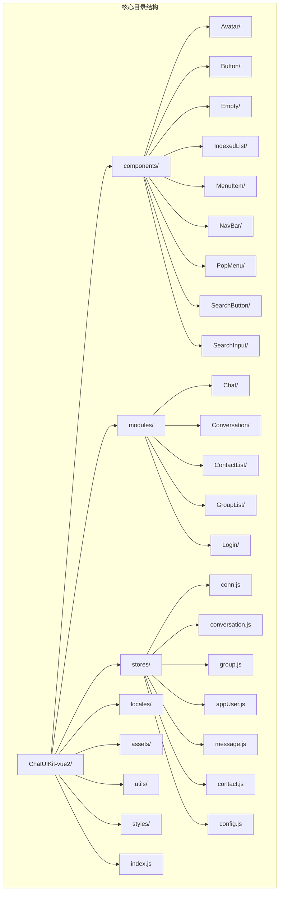
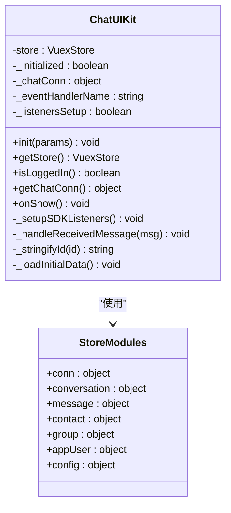
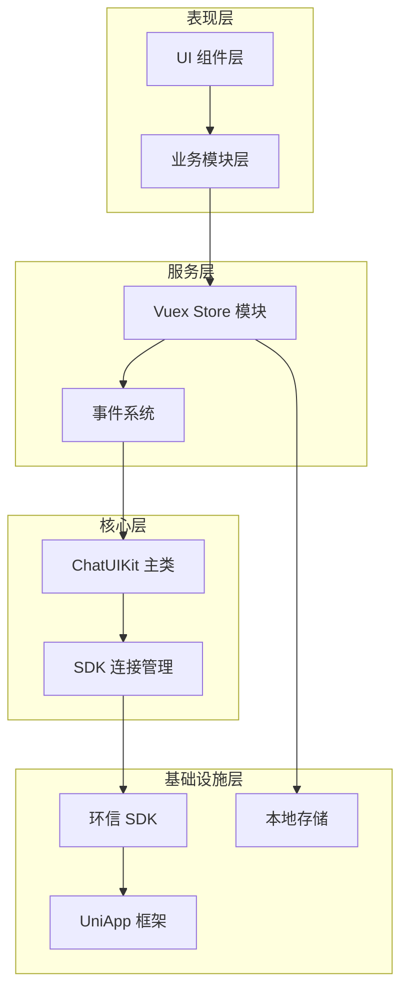
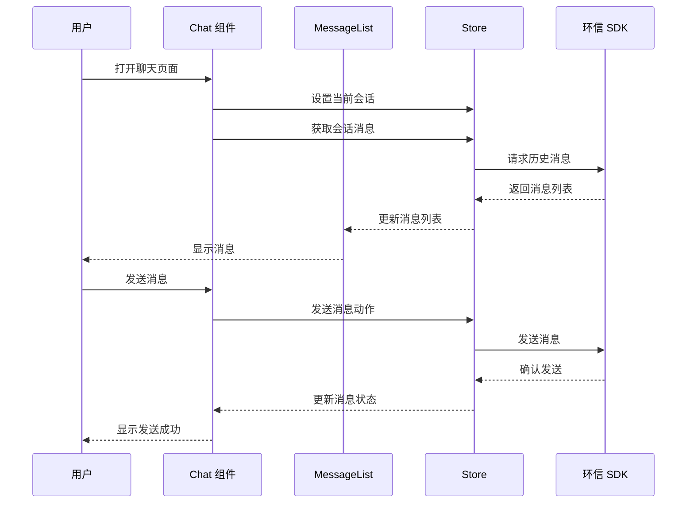
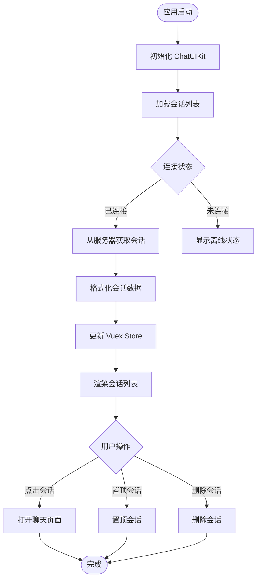
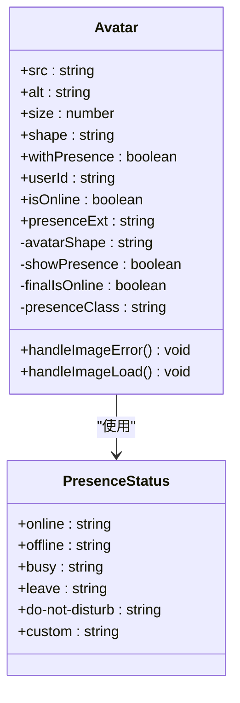
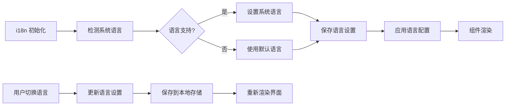
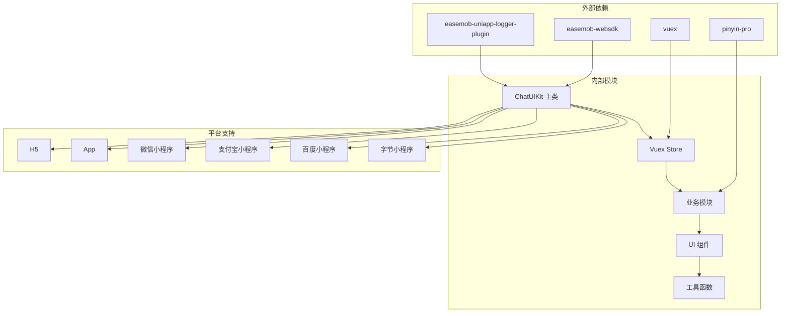

# 集成指南

<cite>
**本文档引用的文件**
- [README.md](file://README.md)
- [VUE2_INTEGRATION_GUIDE.md](file://VUE2_INTEGRATION_GUIDE.md)
- [ChatUIKit-vue2/index.js](file://ChatUIKit-vue2/index.js)
- [ChatUIKit-vue2/stores/index.js](file://ChatUIKit-vue2/stores/index.js)
- [ChatUIKit-vue2/stores/message.js](file://ChatUIKit-vue2/stores/message.js)
- [ChatUIKit-vue2/stores/conversation.js](file://ChatUIKit-vue2/stores/conversation.js)
- [ChatUIKit-vue2/stores/config.js](file://ChatUIKit-vue2/stores/config.js)
- [ChatUIKit-vue2/modules/Chat/index.vue](file://ChatUIKit-vue2/modules/Chat/index.vue)
- [ChatUIKit-vue2/modules/Conversation/index.vue](file://ChatUIKit-vue2/modules/Conversation/index.vue)
- [ChatUIKit-vue2/components/Avatar/index.vue](file://ChatUIKit-vue2/components/Avatar/index.vue)
- [ChatUIKit-vue2/components/Button/index.vue](file://ChatUIKit-vue2/components/Button/index.vue)
- [ChatUIKit-vue2/locales/index.js](file://ChatUIKit-vue2/locales/index.js)
- [vue2-demo/main.js](file://vue2-demo/main.js)
- [vue2-demo/App.vue](file://vue2-demo/App.vue)
- [vue2-demo/utils/IM.js](file://vue2-demo/utils/IM.js)
- [vue2-demo/pages.json](file://vue2-demo/pages.json)
</cite>

## 目录
1. [简介](#简介)
2. [项目结构](#项目结构)
3. [核心组件](#核心组件)
4. [架构概览](#架构概览)
5. [详细组件分析](#详细组件分析)
6. [依赖关系分析](#依赖关系分析)
7. [性能考虑](#性能考虑)
8. [故障排除指南](#故障排除指南)
9. [结论](#结论)

## 简介

环信 ChatUIKit for UniApp - Vue2 版本是一个基于 Vue2 + Vuex 的即时通讯 UIKit，支持 H5、App、微信小程序等多平台。该套件提供了完整的聊天界面组件，一行代码即可集成到现有项目中。

### 主要特性

- ✅ **开箱即用**：提供完整的聊天界面组件，一行代码集成
- ✅ **多平台支持**：一套代码，同时支持 H5、App、微信小程序
- ✅ **功能丰富**：单聊、群聊、消息类型（文本/图片/语音/视频/文件）
- ✅ **状态管理**：基于 Vuex 的模块化状态管理
- ✅ **国际化**：内置中英文语言包

## 项目结构

项目采用模块化组织结构，主要分为以下几个部分：



**图表来源**
- [ChatUIKit-vue2/index.js:1-405](file://ChatUIKit-vue2/index.js#L1-L405)
- [ChatUIKit-vue2/stores/index.js:1-27](file://ChatUIKit-vue2/stores/index.js#L1-L27)

**章节来源**
- [README.md:76-96](file://README.md#L76-L96)
- [VUE2_INTEGRATION_GUIDE.md:33-46](file://VUE2_INTEGRATION_GUIDE.md#L33-L46)

## 核心组件

### ChatUIKit 主类

ChatUIKit 是整个系统的入口类，负责初始化和协调各个模块的工作。



**图表来源**
- [ChatUIKit-vue2/index.js:6-405](file://ChatUIKit-vue2/index.js#L6-L405)
- [ChatUIKit-vue2/stores/index.js:13-23](file://ChatUIKit-vue2/stores/index.js#L13-L23)

### 状态管理系统

系统采用 Vuex 进行状态管理，包含以下核心模块：

| 模块 | 职责 | 关键功能 |
|------|------|----------|
| conn | SDK 连接状态 | 连接管理、登录状态、SDK 实例 |
| conversation | 会话管理 | 会话列表、置顶、免打扰、未读数 |
| message | 消息管理 | 消息存储、历史消息、消息状态 |
| contact | 联系人管理 | 好友列表、黑名单、申请处理 |
| group | 群组管理 | 群组列表、创建群组、群成员 |
| appUser | 用户信息管理 | 用户资料、在线状态、头像 |
| config | 配置中心 | 主题配置、功能开关、语言设置 |

**章节来源**
- [ChatUIKit-vue2/stores/index.js:13-23](file://ChatUIKit-vue2/stores/index.js#L13-L23)
- [ChatUIKit-vue2/stores/message.js:50-200](file://ChatUIKit-vue2/stores/message.js#L50-L200)
- [ChatUIKit-vue2/stores/conversation.js:46-200](file://ChatUIKit-vue2/stores/conversation.js#L46-L200)

## 架构概览

系统采用分层架构设计，从底层到上层依次为：SDK 层、核心服务层、业务模块层、UI 组件层。



**图表来源**
- [ChatUIKit-vue2/index.js:22-66](file://ChatUIKit-vue2/index.js#L22-L66)
- [ChatUIKit-vue2/stores/index.js:13-23](file://ChatUIKit-vue2/stores/index.js#L13-L23)

## 详细组件分析

### 聊天模块 (Chat Module)

聊天模块是最复杂的业务模块，包含了完整的聊天界面和交互功能。



**图表来源**
- [ChatUIKit-vue2/modules/Chat/index.vue:1-310](file://ChatUIKit-vue2/modules/Chat/index.vue#L1-L310)
- [ChatUIKit-vue2/stores/message.js:111-200](file://ChatUIKit-vue2/stores/message.js#L111-L200)

#### 核心功能特性

1. **消息输入区域**：支持文本、表情、语音、图片、视频、文件等多种消息类型
2. **消息列表渲染**：智能滚动、消息状态显示、引用回复功能
3. **工具栏功能**：表情选择器、文件上传、用户卡片、@提醒
4. **键盘适配**：动态调整布局，适配不同设备的键盘高度

**章节来源**
- [ChatUIKit-vue2/modules/Chat/index.vue:62-263](file://ChatUIKit-vue2/modules/Chat/index.vue#L62-L263)

### 会话列表模块 (Conversation Module)

会话列表模块负责管理用户的聊天会话，提供会话的增删改查功能。



**图表来源**
- [ChatUIKit-vue2/modules/Conversation/index.vue:1-19](file://ChatUIKit-vue2/modules/Conversation/index.vue#L1-L19)
- [ChatUIKit-vue2/stores/conversation.js:157-200](file://ChatUIKit-vue2/stores/conversation.js#L157-L200)

#### 会话管理功能

- **会话排序**：按最后消息时间倒序排列
- **置顶功能**：支持会话置顶和取消置顶
- **免打扰**：支持设置会话免打扰状态
- **未读数统计**：实时计算和显示未读消息数量

**章节来源**
- [ChatUIKit-vue2/stores/conversation.js:65-155](file://ChatUIKit-vue2/stores/conversation.js#L65-L155)

### 通用组件库

系统提供了一套完整的通用组件，用于构建统一的用户界面。

#### 头像组件 (Avatar)

头像组件支持多种形状、尺寸和在线状态显示。



**图表来源**
- [ChatUIKit-vue2/components/Avatar/index.vue:27-168](file://ChatUIKit-vue2/components/Avatar/index.vue#L27-L168)

#### 按钮组件 (Button)

按钮组件提供统一的交互样式和状态管理。

**章节来源**
- [ChatUIKit-vue2/components/Avatar/index.vue:27-168](file://ChatUIKit-vue2/components/Avatar/index.vue#L27-L168)
- [ChatUIKit-vue2/components/Button/index.vue:11-29](file://ChatUIKit-vue2/components/Button/index.vue#L11-L29)

### 国际化系统

系统内置了完整的国际化支持，支持中英文切换。



**图表来源**
- [ChatUIKit-vue2/locales/index.js:28-219](file://ChatUIKit-vue2/locales/index.js#L28-L219)

**章节来源**
- [ChatUIKit-vue2/locales/index.js:28-219](file://ChatUIKit-vue2/locales/index.js#L28-L219)

## 依赖关系分析

系统采用模块化设计，各组件之间通过清晰的接口进行通信。



**图表来源**
- [README.md:48-49](file://README.md#L48-L49)
- [VUE2_INTEGRATION_GUIDE.md:52-59](file://VUE2_INTEGRATION_GUIDE.md#L52-L59)

### 核心依赖说明

| 依赖 | 版本要求 | 用途 |
|------|----------|------|
| Vue | 2.x | 核心框架 |
| uni-app | 3.x | 跨平台框架 |
| easemob-websdk | ^4.11.0 | 环信即时通讯 SDK |
| vuex | ^3.6.2 | 状态管理 |
| pinyin-pro | ^3.28.0 | 拼音排序（可选） |

**章节来源**
- [README.md:39-59](file://README.md#L39-L59)
- [VUE2_INTEGRATION_GUIDE.md:50-62](file://VUE2_INTEGRATION_GUIDE.md#L50-L62)

## 性能考虑

### 内存管理

系统采用了多项内存优化策略：

1. **消息克隆机制**：深拷贝 SDK 返回的对象，避免原型链污染
2. **懒加载策略**：按需加载会话和消息数据
3. **缓存机制**：合理使用本地存储减少重复请求

### 渲染优化

1. **虚拟列表**：对于大量数据的列表采用虚拟滚动
2. **组件复用**：通用组件支持 props 配置，提高复用率
3. **条件渲染**：根据功能开关动态渲染组件

### 网络优化

1. **请求去重**：防抖机制避免频繁请求
2. **增量更新**：支持增量数据更新，减少全量刷新
3. **连接池管理**：智能管理 SDK 连接状态

## 故障排除指南

### 常见问题及解决方案

#### 微信小程序兼容性问题

**问题**：微信小程序提示 "util is not defined"

**解决方案**：
```javascript
// 在 main.js 中添加 Polyfill
// #ifdef MP-WEIXIN
if (typeof global === 'undefined') {
  var global = Function('return this')() || (typeof window !== 'undefined' ? window : {})
}
// #endif
```

**章节来源**
- [VUE2_INTEGRATION_GUIDE.md:103-141](file://VUE2_INTEGRATION_GUIDE.md#L103-L141)

#### 数据为空值问题

**问题**：提示 "Cannot read property 'xxx' of null"

**解决方案**：
```javascript
computed: {
  safeUser() {
    return this.user || {}
  }
}
```

**章节来源**
- [VUE2_INTEGRATION_GUIDE.md:684-690](file://VUE2_INTEGRATION_GUIDE.md#L684-L690)

#### 调试 SDK

**解决方案**：
```javascript
this.$ChatUIKit.init({
  chat: EMClient,
  sdk: EMSDK,
  config: {
    isDebug: true
  }
})
```

**章节来源**
- [VUE2_INTEGRATION_GUIDE.md:727-735](file://VUE2_INTEGRATION_GUIDE.md#L727-L735)

### 环境配置检查清单

1. **SDK 初始化**：确保 EMClient 正确初始化
2. **ChatUIKit 初始化**：确认 ChatUIKit.init() 被调用
3. **Store 注入**：验证 Vuex Store 正确注入到 Vue 实例
4. **页面路由**：检查 pages.json 中的页面配置
5. **平台兼容**：确认目标平台的兼容性

**章节来源**
- [vue2-demo/App.vue:39-64](file://vue2-demo/App.vue#L39-L64)
- [vue2-demo/main.js:52-70](file://vue2-demo/main.js#L52-L70)

## 结论

环信 ChatUIKit for UniApp - Vue2 版本提供了一个完整、稳定、易用的即时通讯解决方案。通过模块化的架构设计和完善的组件体系，开发者可以快速集成聊天功能到自己的应用中。

### 主要优势

1. **跨平台支持**：一套代码支持多个平台
2. **功能完整**：涵盖即时通讯的核心功能
3. **易于集成**：简单的初始化流程
4. **可扩展性强**：模块化设计便于定制开发
5. **性能优化**：针对不同平台进行了专门优化

### 最佳实践建议

1. **合理使用配置**：通过 config 模块灵活配置功能开关
2. **关注性能**：利用懒加载和缓存机制提升性能
3. **测试兼容性**：在目标平台上进行全面测试
4. **监控日志**：开启调试模式便于问题排查
5. **持续更新**：及时更新 SDK 和组件版本

通过遵循本文档的指导，开发者可以顺利完成 ChatUIKit 的集成工作，为用户提供优质的即时通讯体验。