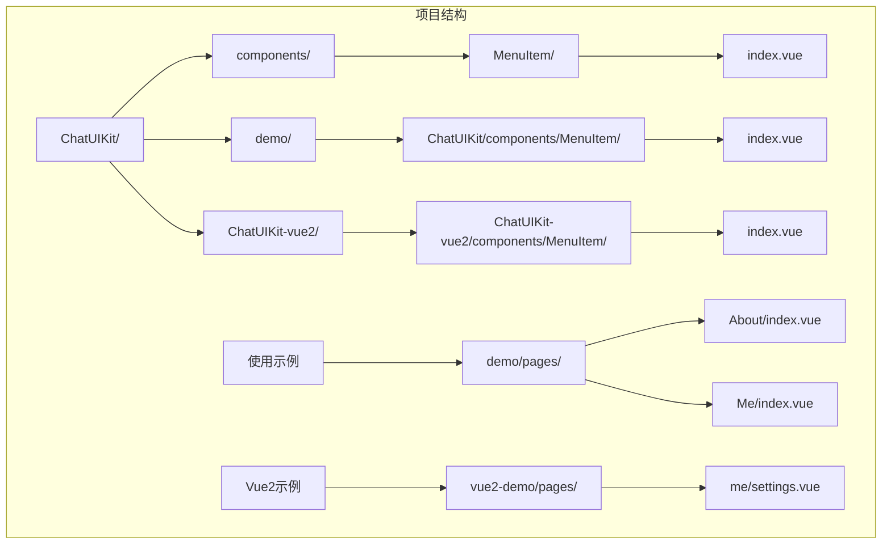
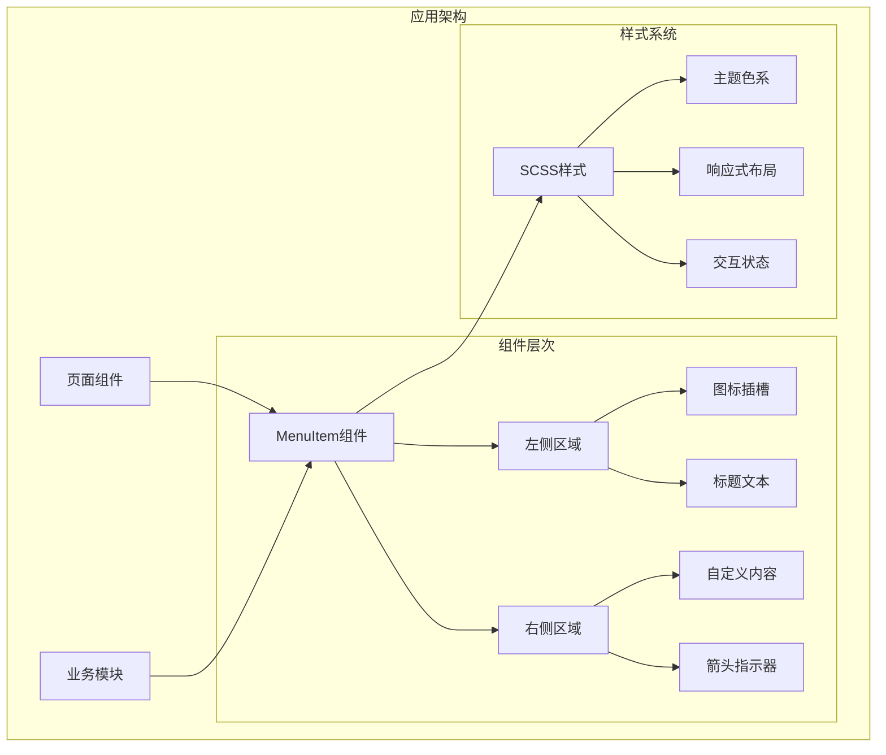
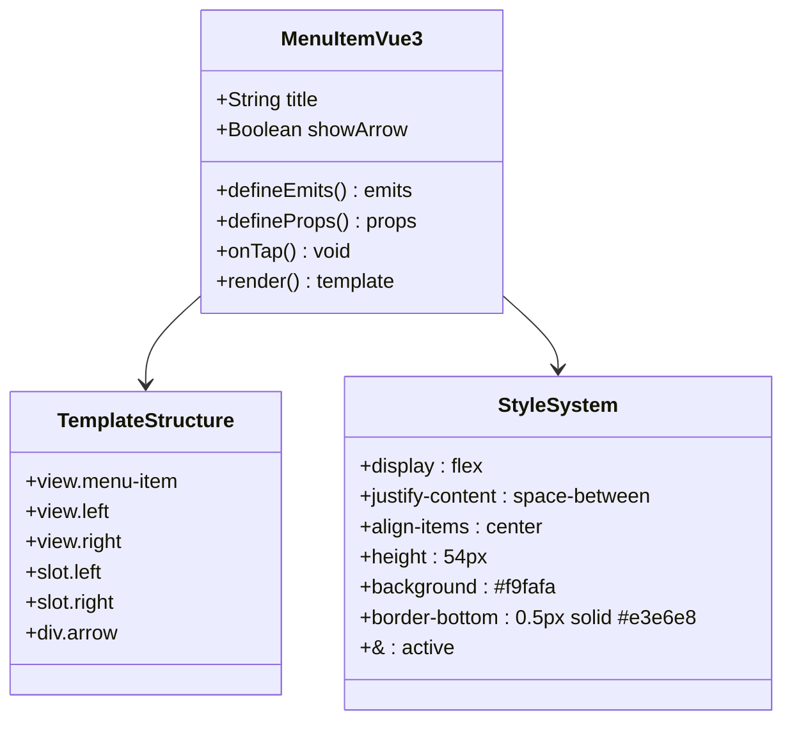
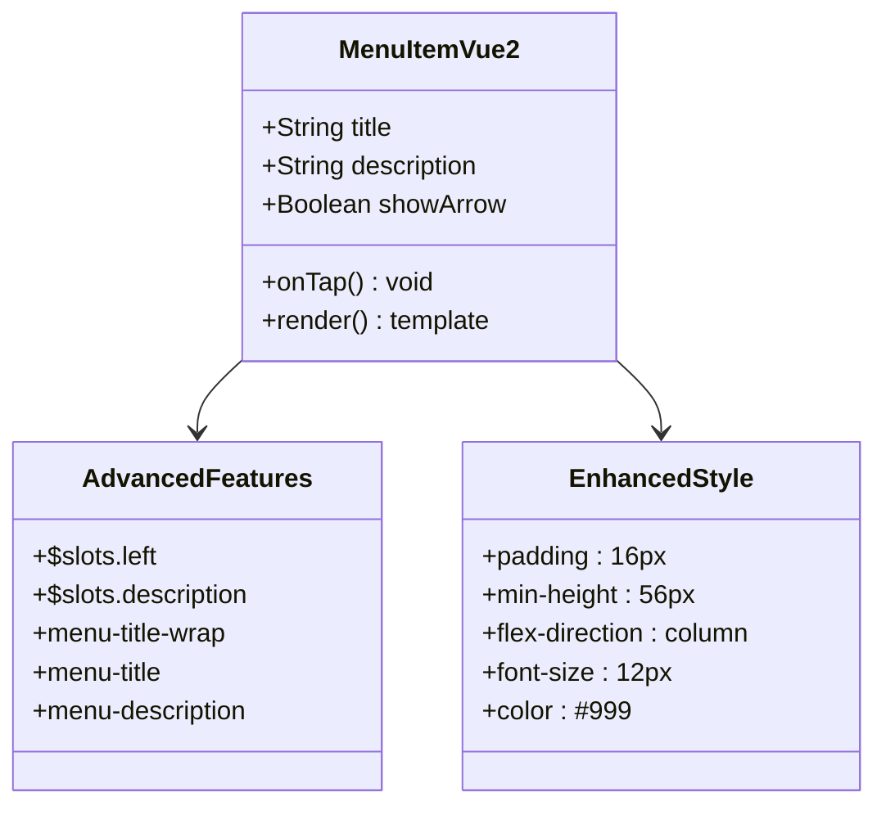
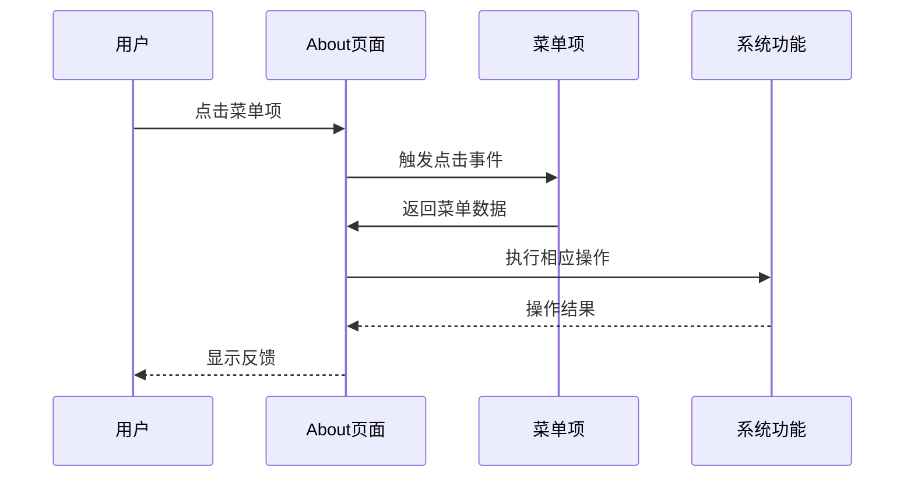
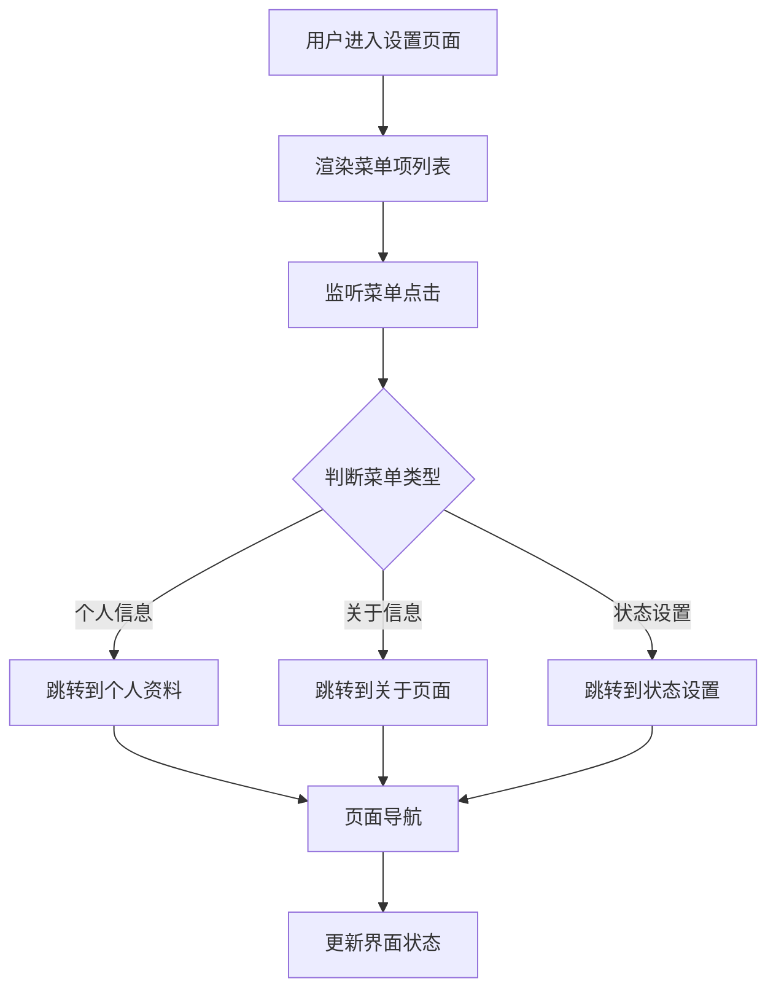
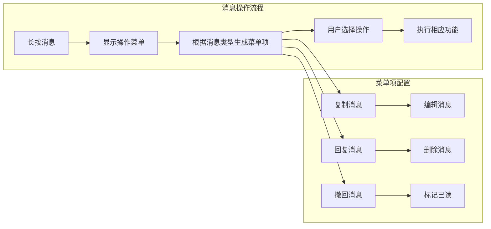
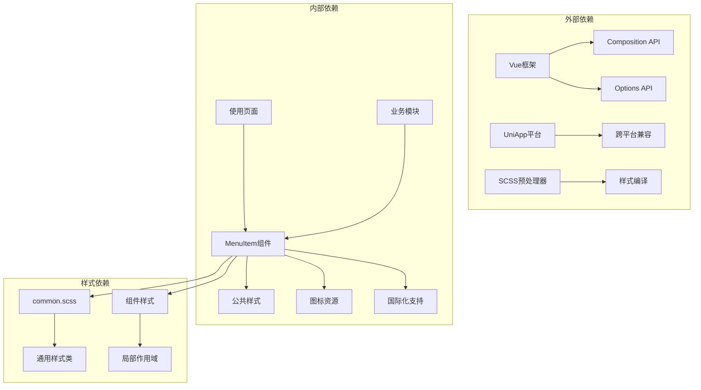

# 菜单项组件

<cite>
**本文档引用的文件**
- [ChatUIKit/components/MenuItem/index.vue](file://ChatUIKit/components/MenuItem/index.vue)
- [ChatUIKit-vue2/components/MenuItem/index.vue](file://ChatUIKit-vue2/components/MenuItem/index.vue)
- [demo/ChatUIKit/components/MenuItem/index.vue](file://demo/ChatUIKit/components/MenuItem/index.vue)
- [vue2-demo/ChatUIKit/components/MenuItem/index.vue](file://vue2-demo/ChatUIKit/components/MenuItem/index.vue)
- [demo/pages/About/index.vue](file://demo/pages/About/index.vue)
- [demo/pages/Me/index.vue](file://demo/pages/Me/index.vue)
- [vue2-demo/pages/me/settings.vue](file://vue2-demo/pages/me/settings.vue)
- [ChatUIKit/modules/Chat/components/Message/messageActions.vue](file://ChatUIKit/modules/Chat/components/Message/messageActions.vue)
- [ChatUIKit/const/index.ts](file://ChatUIKit/const/index.ts)
- [ChatUIKit/styles/common.scss](file://ChatUIKit/styles/common.scss)
</cite>

## 目录
1. [简介](#简介)
2. [项目结构](#项目结构)
3. [核心组件](#核心组件)
4. [架构概览](#架构概览)
5. [详细组件分析](#详细组件分析)
6. [依赖关系分析](#依赖关系分析)
7. [性能考虑](#性能考虑)
8. [故障排除指南](#故障排除指南)
9. [结论](#结论)

## 简介

菜单项组件（MenuItem）是 EaseMob Chat UIKit 中的一个基础 UI 组件，用于创建可点击的菜单项，支持左右布局、图标显示、箭头指示等功能。该组件在 Vue 3 和 Vue 2 版本中都有实现，提供了统一的交互体验和灵活的定制能力。

MenuItem 组件广泛应用于聊天应用的各种场景中，包括个人设置、关于页面、联系人管理等界面，为用户提供直观的导航和操作入口。

## 项目结构

MenuItem 组件在项目中的组织结构如下：

**图表来源**
- [ChatUIKit/components/MenuItem/index.vue](file://ChatUIKit/components/MenuItem/index.vue#L1-L73)
- [demo/ChatUIKit/components/MenuItem/index.vue](file://demo/ChatUIKit/components/MenuItem/index.vue#L1-L73)
- [ChatUIKit-vue2/components/MenuItem/index.vue](file://ChatUIKit-vue2/components/MenuItem/index.vue#L1-L99)

**章节来源**
- [ChatUIKit/components/MenuItem/index.vue](file://ChatUIKit/components/MenuItem/index.vue#L1-L73)
- [ChatUIKit-vue2/components/MenuItem/index.vue](file://ChatUIKit-vue2/components/MenuItem/index.vue#L1-L99)

## 核心组件

MenuItem 组件的核心功能特性包括：

### 基础属性配置
- `title`: 菜单项标题文本
- `showArrow`: 是否显示右侧箭头指示器
- `description`: 描述文本（Vue2版本特有）

### 事件处理机制
- `onMenuClick`: Vue 3 版本的点击事件
- `tap`: Vue 2 版本的点击事件

### 插槽系统
- `left`: 左侧内容插槽，通常用于显示图标或头像
- `right`: 右侧内容插槽，通常用于显示值或开关
- `description`: 描述内容插槽（Vue2版本特有）

**章节来源**
- [ChatUIKit/components/MenuItem/index.vue](file://ChatUIKit/components/MenuItem/index.vue#L24-L33)
- [ChatUIKit-vue2/components/MenuItem/index.vue](file://ChatUIKit-vue2/components/MenuItem/index.vue#L21-L34)

## 架构概览

MenuItem 组件在整个应用架构中的位置和作用：

**图表来源**
- [ChatUIKit/components/MenuItem/index.vue](file://ChatUIKit/components/MenuItem/index.vue#L35-L72)
- [ChatUIKit-vue2/components/MenuItem/index.vue](file://ChatUIKit-vue2/components/MenuItem/index.vue#L43-L98)

## 详细组件分析

### Vue 3 版本实现

Vue 3 版本的 MenuItem 组件采用了 Composition API 的实现方式：

**图表来源**
- [ChatUIKit/components/MenuItem/index.vue](file://ChatUIKit/components/MenuItem/index.vue#L17-L34)

#### 核心实现特点

1. **响应式属性**: 使用 `defineProps` 定义响应式属性
2. **事件发射**: 通过 `defineEmits` 发射点击事件
3. **模板结构**: 简洁的左右布局设计
4. **样式系统**: 基于 SCSS 的模块化样式

**章节来源**
- [ChatUIKit/components/MenuItem/index.vue](file://ChatUIKit/components/MenuItem/index.vue#L17-L34)

### Vue 2 版本实现

Vue 2 版本提供了更丰富的功能特性：

**图表来源**
- [ChatUIKit-vue2/components/MenuItem/index.vue](file://ChatUIKit-vue2/components/MenuItem/index.vue#L18-L41)

#### 功能扩展

1. **描述文本支持**: 新增 `description` 属性
2. **插槽增强**: 支持 `description` 插槽
3. **样式优化**: 更加灵活的布局设计
4. **兼容性**: 完整的 Vue 2 生态系统支持

**章节来源**
- [ChatUIKit-vue2/components/MenuItem/index.vue](file://ChatUIKit-vue2/components/MenuItem/index.vue#L18-L41)

### 实际应用场景

MenuItem 组件在多个页面中得到广泛应用：

#### 关于页面应用

**图表来源**
- [demo/pages/About/index.vue](file://demo/pages/About/index.vue#L71-L85)

#### 个人设置应用

**图表来源**
- [demo/pages/Me/index.vue](file://demo/pages/Me/index.vue#L90-L106)

**章节来源**
- [demo/pages/About/index.vue](file://demo/pages/About/index.vue#L19-L85)
- [demo/pages/Me/index.vue](file://demo/pages/Me/index.vue#L23-L106)

### 消息操作集成

MenuItem 组件还与消息操作功能深度集成：

**图表来源**
- [ChatUIKit/modules/Chat/components/Message/messageActions.vue](file://ChatUIKit/modules/Chat/components/Message/messageActions.vue#L78-L144)

**章节来源**
- [ChatUIKit/modules/Chat/components/Message/messageActions.vue](file://ChatUIKit/modules/Chat/components/Message/messageActions.vue#L49-L144)

## 依赖关系分析

MenuItem 组件的依赖关系和耦合度分析：

**图表来源**
- [ChatUIKit/styles/common.scss](file://ChatUIKit/styles/common.scss#L1-L18)
- [ChatUIKit/const/index.ts](file://ChatUIKit/const/index.ts#L7-L8)

### 依赖特征

1. **低耦合设计**: 组件与业务逻辑分离
2. **高内聚特性**: 样式和功能集中管理
3. **平台无关**: 支持多平台运行
4. **易于扩展**: 插槽系统支持功能扩展

**章节来源**
- [ChatUIKit/styles/common.scss](file://ChatUIKit/styles/common.scss#L1-L18)
- [ChatUIKit/const/index.ts](file://ChatUIKit/const/index.ts#L7-L36)

## 性能考虑

MenuItem 组件在性能方面的优化策略：

### 渲染优化
- **虚拟DOM最小化**: 采用简洁的模板结构
- **事件委托**: 减少事件监听器数量
- **懒加载支持**: 插槽内容按需渲染

### 内存管理
- **组件销毁**: 正确的生命周期管理
- **资源释放**: 图片资源的及时释放
- **状态清理**: 事件处理器的清理

### 交互优化
- **触摸反馈**: 即时的视觉反馈
- **动画性能**: CSS3硬件加速
- **响应速度**: 无阻塞的事件处理

## 故障排除指南

### 常见问题及解决方案

#### 1. 点击事件不触发
**问题症状**: 点击菜单项无反应
**可能原因**:
- 事件名称不匹配（Vue 2 vs Vue 3）
- 父组件未正确绑定事件处理器
- 样式层遮挡导致触摸事件失效

**解决方法**:
- Vue 3: 使用 `@onMenuClick`
- Vue 2: 使用 `@tap`
- 检查父组件事件绑定
- 调整样式层级关系

#### 2. 箭头图标不显示
**问题症状**: 右侧箭头图标缺失
**可能原因**:
- 图片路径配置错误
- 样式文件未正确引入
- 图片资源加载失败

**解决方法**:
- 验证图片路径配置
- 检查样式文件导入
- 确认图片资源可用性

#### 3. 插槽内容显示异常
**问题症状**: 自定义内容未按预期显示
**可能原因**:
- 插槽名称使用错误
- 条件渲染逻辑问题
- 样式冲突影响布局

**解决方法**:
- 确认插槽名称正确（`left`/`right`）
- 检查条件渲染逻辑
- 调整相关样式规则

**章节来源**
- [ChatUIKit/components/MenuItem/index.vue](file://ChatUIKit/components/MenuItem/index.vue#L17-L34)
- [ChatUIKit-vue2/components/MenuItem/index.vue](file://ChatUIKit-vue2/components/MenuItem/index.vue#L18-L41)

## 结论

MenuItem 组件作为 EaseMob Chat UIKit 的核心 UI 组件之一，展现了优秀的架构设计和实用性。其主要优势包括：

### 设计优势
- **跨版本兼容**: 同时支持 Vue 3 和 Vue 2
- **灵活的插槽系统**: 满足多样化的布局需求
- **简洁的 API 设计**: 易于使用和理解
- **良好的扩展性**: 支持功能定制和样式修改

### 应用价值
- **统一的用户体验**: 在不同页面中提供一致的交互模式
- **高效的开发流程**: 减少重复代码编写
- **强大的功能集成**: 与聊天应用的各种业务场景无缝结合

### 发展建议
- **性能监控**: 建立组件使用情况的监控机制
- **文档完善**: 补充更详细的使用示例和最佳实践
- **测试覆盖**: 增加单元测试和集成测试
- **国际化支持**: 扩展多语言环境下的适配能力

MenuItem 组件为整个 Chat UIKit 提供了坚实的基础，是构建高质量聊天应用的重要基石。