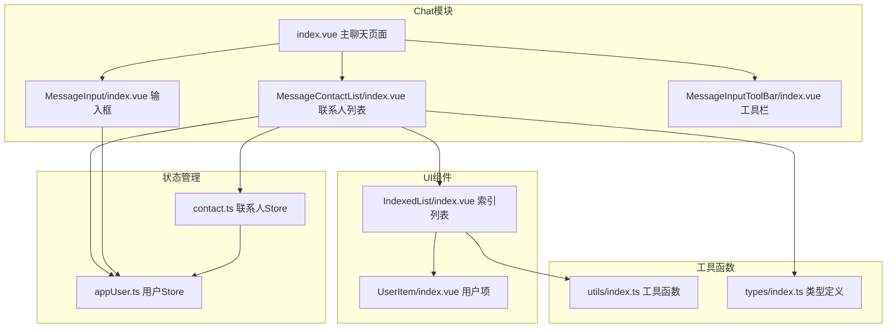
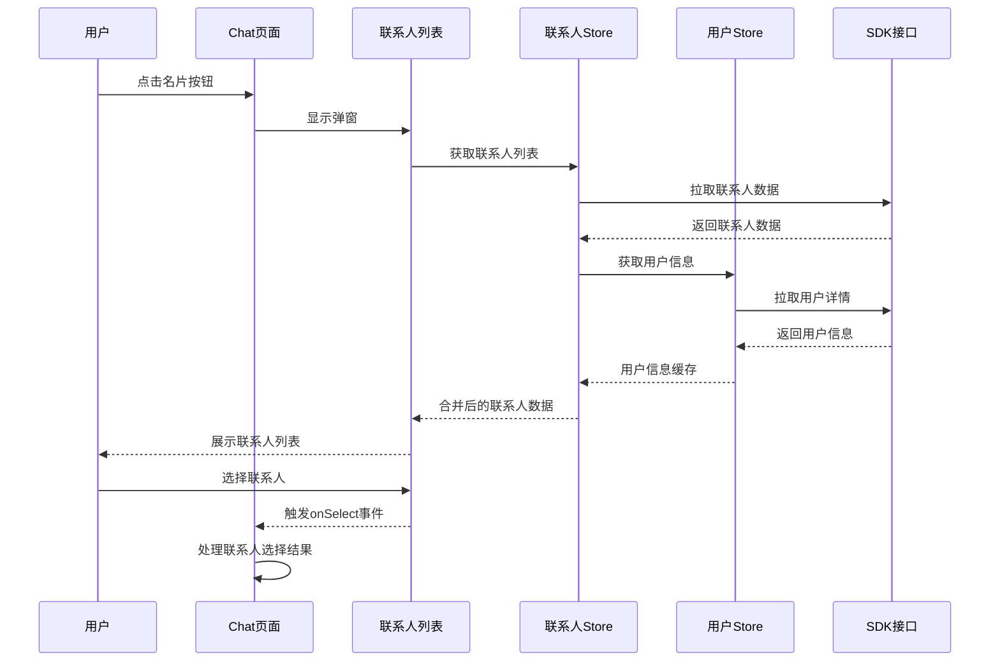
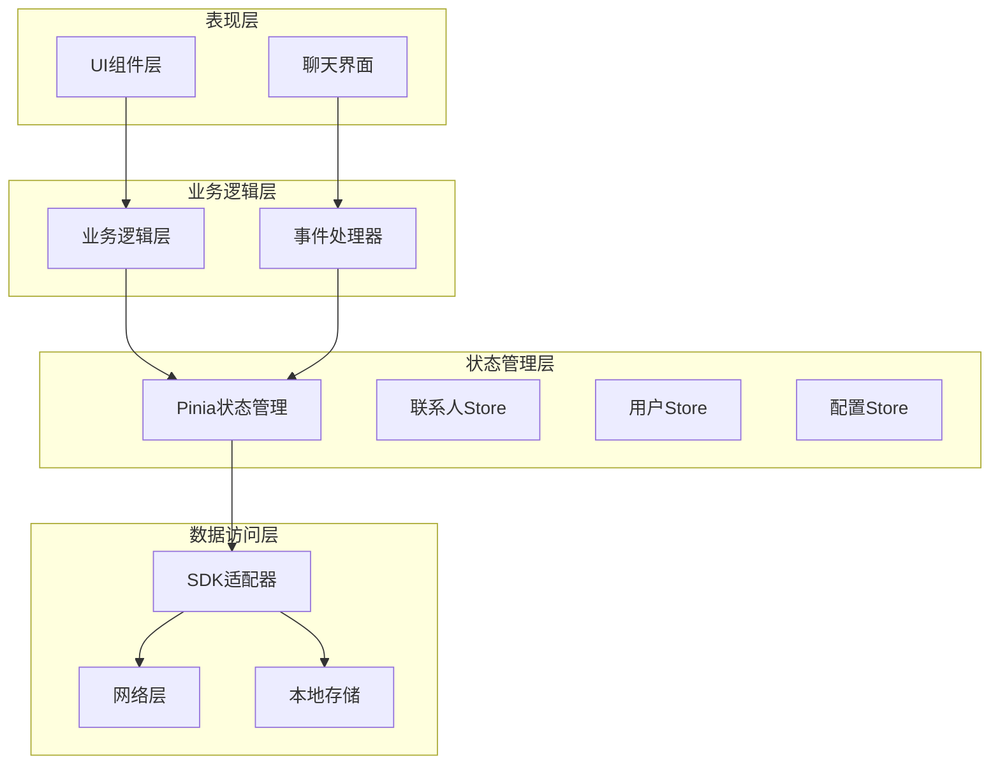
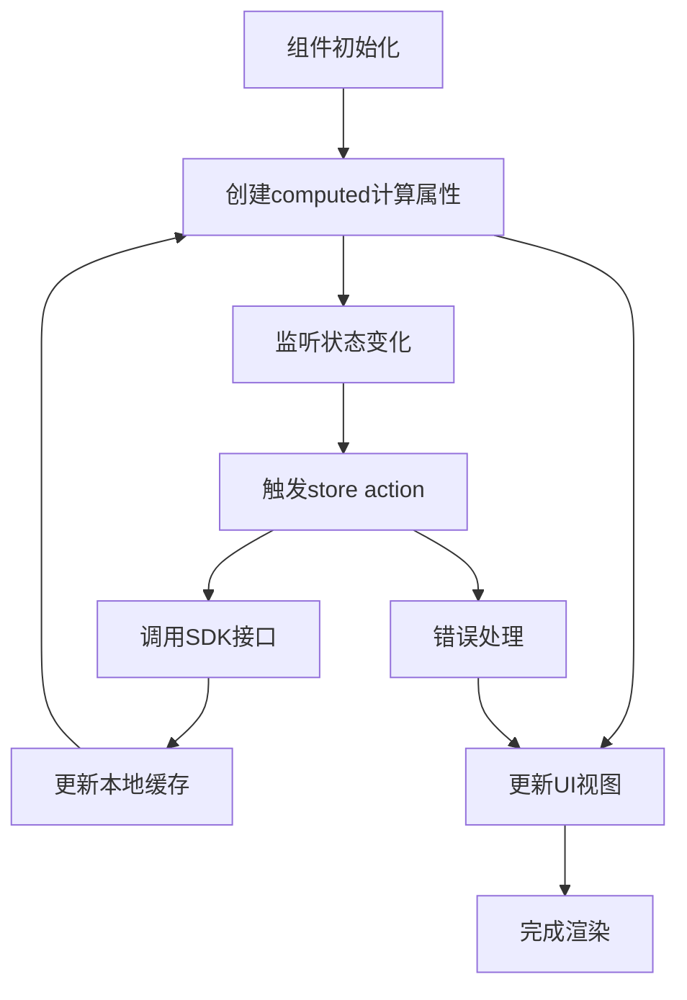
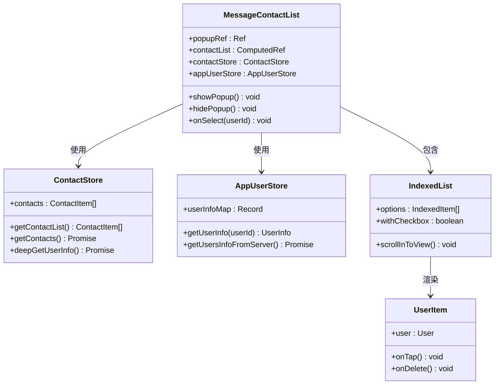
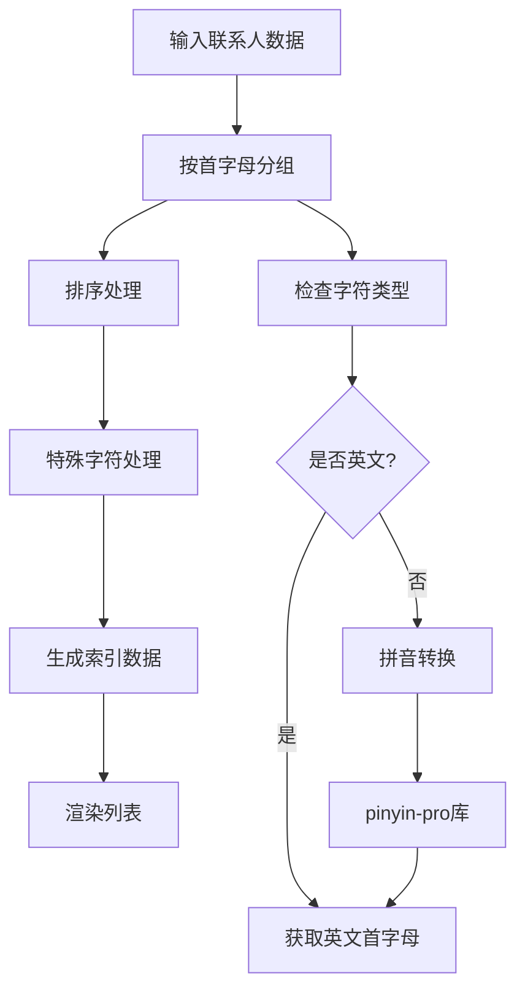
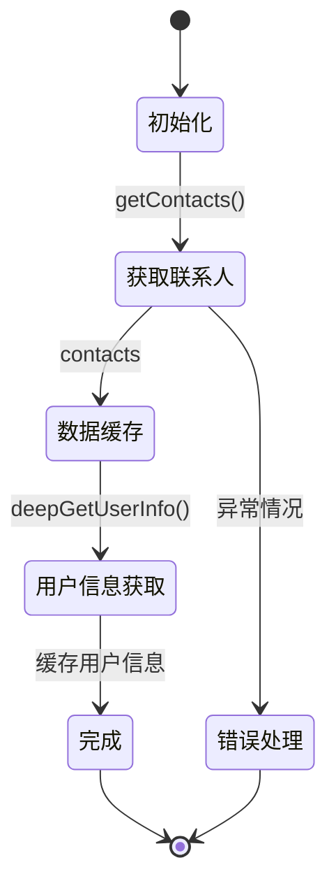
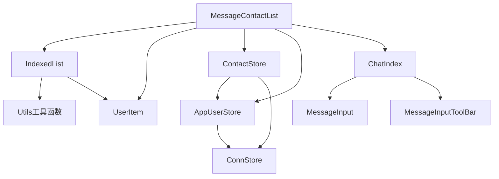
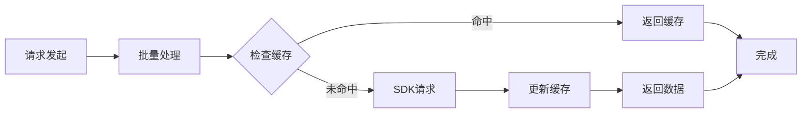

# 消息联系人列表

<cite>
**本文档引用的文件**
- [ChatUIKit/modules/Chat/components/MessageContactList/index.vue](file://ChatUIKit/modules/Chat/components/MessageContactList/index.vue)
- [ChatUIKit/modules/Chat/index.vue](file://ChatUIKit/modules/Chat/index.vue)
- [ChatUIKit/modules/Chat/components/MessageInputToolBar/index.vue](file://ChatUIKit/modules/Chat/components/MessageInputToolBar/index.vue)
- [ChatUIKit/modules/Chat/components/MessageInput/index.vue](file://ChatUIKit/modules/Chat/components/MessageInput/index.vue)
- [ChatUIKit/components/IndexedList/index.vue](file://ChatUIKit/components/IndexedList/index.vue)
- [ChatUIKit/modules/ContactList/components/UserItem/index.vue](file://ChatUIKit/modules/ContactList/components/UserItem/index.vue)
- [ChatUIKit/stores/contact.ts](file://ChatUIKit/stores/contact.ts)
- [ChatUIKit/stores/appUser.ts](file://ChatUIKit/stores/appUser.ts)
- [ChatUIKit/utils/index.ts](file://ChatUIKit/utils/index.ts)
- [ChatUIKit/types/index.ts](file://ChatUIKit/types/index.ts)
</cite>

## 目录
1. [简介](#简介)
2. [项目结构](#项目结构)
3. [核心组件](#核心组件)
4. [架构概览](#架构概览)
5. [详细组件分析](#详细组件分析)
6. [依赖关系分析](#依赖关系分析)
7. [性能考虑](#性能考虑)
8. [故障排除指南](#故障排除指南)
9. [结论](#结论)

## 简介

消息联系人列表是即时通讯应用中的重要功能模块，允许用户在聊天界面中快速选择联系人分享名片或进行@提及操作。该功能通过弹窗形式展示联系人列表，支持索引字母导航、联系人筛选和多选功能。

本系统采用Vue 3 + TypeScript + Pinia架构，实现了响应式的联系人管理和实时的数据同步。通过精心设计的组件层次结构和状态管理模式，提供了流畅的用户体验和高效的性能表现。

## 项目结构

消息联系人列表功能位于ChatUIKit模块的Chat组件体系中，采用模块化设计，各组件职责清晰，耦合度低。

**图表来源**
- [ChatUIKit/modules/Chat/index.vue](file://ChatUIKit/modules/Chat/index.vue#L1-L255)
- [ChatUIKit/modules/Chat/components/MessageContactList/index.vue](file://ChatUIKit/modules/Chat/components/MessageContactList/index.vue#L1-L123)

**章节来源**
- [ChatUIKit/modules/Chat/index.vue](file://ChatUIKit/modules/Chat/index.vue#L1-L255)
- [ChatUIKit/modules/Chat/components/MessageContactList/index.vue](file://ChatUIKit/modules/Chat/components/MessageContactList/index.vue#L1-L123)

## 核心组件

消息联系人列表功能由多个核心组件协同工作，每个组件都有明确的职责分工：

### 主要组件架构

| 组件名称 | 职责 | 关键特性 |
|---------|------|----------|
| MessageContactList | 联系人列表弹窗 | 弹窗展示、索引导航、联系人选择 |
| IndexedList | 索引列表容器 | 字母索引、分组显示、滚动定位 |
| UserItem | 用户项组件 | 头像显示、昵称展示、滑动菜单 |
| ContactStore | 联系人状态管理 | 联系人获取、缓存管理、通知处理 |
| AppUserStore | 用户信息管理 | 用户信息获取、在线状态、缓存策略 |

### 数据流设计

**图表来源**
- [ChatUIKit/modules/Chat/index.vue](file://ChatUIKit/modules/Chat/index.vue#L164-L166)
- [ChatUIKit/modules/Chat/components/MessageContactList/index.vue](file://ChatUIKit/modules/Chat/components/MessageContactList/index.vue#L56-L59)

**章节来源**
- [ChatUIKit/modules/Chat/components/MessageContactList/index.vue](file://ChatUIKit/modules/Chat/components/MessageContactList/index.vue#L32-L71)
- [ChatUIKit/stores/contact.ts](file://ChatUIKit/stores/contact.ts#L25-L76)

## 架构概览

消息联系人列表采用了现代化的前端架构模式，结合了响应式编程、状态管理和组件化开发的优势。

### 整体架构设计

**图表来源**
- [ChatUIKit/stores/contact.ts](file://ChatUIKit/stores/contact.ts#L10-L282)
- [ChatUIKit/stores/appUser.ts](file://ChatUIKit/stores/appUser.ts#L11-L242)

### 状态管理模式

系统采用Pinia作为状态管理解决方案，实现了集中式的状态管理和响应式数据绑定：

**图表来源**
- [ChatUIKit/modules/Chat/components/MessageContactList/index.vue](file://ChatUIKit/modules/Chat/components/MessageContactList/index.vue#L47-L54)
- [ChatUIKit/stores/contact.ts](file://ChatUIKit/stores/contact.ts#L112-L130)

**章节来源**
- [ChatUIKit/stores/contact.ts](file://ChatUIKit/stores/contact.ts#L1-L282)
- [ChatUIKit/stores/appUser.ts](file://ChatUIKit/stores/appUser.ts#L1-L242)

## 详细组件分析

### MessageContactList组件

MessageContactList是消息联系人列表的核心组件，负责展示联系人弹窗界面和处理用户交互。

#### 组件结构分析

**图表来源**
- [ChatUIKit/modules/Chat/components/MessageContactList/index.vue](file://ChatUIKit/modules/Chat/components/MessageContactList/index.vue#L32-L68)
- [ChatUIKit/stores/contact.ts](file://ChatUIKit/stores/contact.ts#L25-L76)
- [ChatUIKit/stores/appUser.ts](file://ChatUIKit/stores/appUser.ts#L24-L79)

#### 核心功能实现

组件的核心功能通过以下机制实现：

1. **响应式数据绑定**: 使用computed替代autorun，提供自动追踪和更新
2. **异步数据加载**: 通过deepGetUserInfo实现分页获取用户信息
3. **事件处理机制**: emit onSelect事件向父组件传递选择结果
4. **弹窗控制**: 提供showPopup和hidePopup方法控制显示状态

**章节来源**
- [ChatUIKit/modules/Chat/components/MessageContactList/index.vue](file://ChatUIKit/modules/Chat/components/MessageContactList/index.vue#L32-L71)

### IndexedList组件

IndexedList组件提供了完整的索引列表功能，支持字母索引导航和分组显示。

#### 索引算法实现

**图表来源**
- [ChatUIKit/components/IndexedList/index.vue](file://ChatUIKit/components/IndexedList/index.vue#L129-L159)
- [ChatUIKit/utils/index.ts](file://ChatUIKit/utils/index.ts#L328-L343)

#### 性能优化策略

组件实现了多项性能优化措施：

1. **数据预处理**: 将initialData和indexedData存储为组合数据结构
2. **懒加载机制**: 使用虚拟滚动减少DOM节点数量
3. **防抖处理**: 索引点击事件添加防抖防止重复触发
4. **响应式优化**: 避免重复计算，提高渲染效率

**章节来源**
- [ChatUIKit/components/IndexedList/index.vue](file://ChatUIKit/components/IndexedList/index.vue#L129-L186)

### UserItem组件

UserItem组件负责单个联系人的显示和交互，提供了丰富的用户界面元素。

#### 交互功能设计

| 功能 | 实现方式 | 用户体验 |
|------|----------|----------|
| 点击选择 | tap事件监听 | 即时反馈选择状态 |
| 滑动删除 | touch事件处理 | 直观的删除操作 |
| 头像显示 | Avatar组件集成 | 一致的视觉风格 |
| 在线状态 | Presence状态 | 实时状态指示 |

**章节来源**
- [ChatUIKit/modules/ContactList/components/UserItem/index.vue](file://ChatUIKit/modules/ContactList/components/UserItem/index.vue#L1-L165)

### Store状态管理

系统采用Pinia实现状态管理，提供了高效的数据流控制和响应式更新机制。

#### 联系人状态管理

**图表来源**
- [ChatUIKit/stores/contact.ts](file://ChatUIKit/stores/contact.ts#L112-L130)
- [ChatUIKit/stores/contact.ts](file://ChatUIKit/stores/contact.ts#L83-L107)

#### 用户信息缓存策略

系统实现了智能的用户信息缓存机制：

1. **条件获取**: 根据配置决定是否启用用户信息功能
2. **增量更新**: 只获取未缓存的用户信息
3. **响应式更新**: 使用Vue响应式系统自动更新UI
4. **错误恢复**: 异常情况下提供默认用户信息

**章节来源**
- [ChatUIKit/stores/appUser.ts](file://ChatUIKit/stores/appUser.ts#L86-L125)

## 依赖关系分析

消息联系人列表功能涉及多个层面的依赖关系，形成了清晰的层次结构。

### 组件依赖关系

**图表来源**
- [ChatUIKit/modules/Chat/components/MessageContactList/index.vue](file://ChatUIKit/modules/Chat/components/MessageContactList/index.vue#L34-L38)
- [ChatUIKit/components/IndexedList/index.vue](file://ChatUIKit/components/IndexedList/index.vue#L102-L103)

### 外部依赖分析

系统对外部依赖进行了最小化设计，主要依赖包括：

| 依赖库 | 版本 | 用途 | 重要性 |
|--------|------|------|--------|
| Vue 3 | 最新 | 响应式框架 | 核心依赖 |
| Pinia | 最新 | 状态管理 | 核心依赖 |
| pinyin-pro | 3.x | 中文拼音转换 | 功能依赖 |
| UniApp | 平台SDK | 跨平台支持 | 平台依赖 |

### 循环依赖检测

经过分析，系统不存在循环依赖问题：

1. **组件层**: UI组件之间无循环引用
2. **状态层**: Store之间通过接口通信，无直接依赖
3. **工具层**: 工具函数无相互调用
4. **类型层**: 类型定义相互独立

**章节来源**
- [ChatUIKit/modules/Chat/components/MessageContactList/index.vue](file://ChatUIKit/modules/Chat/components/MessageContactList/index.vue#L32-L38)
- [ChatUIKit/stores/contact.ts](file://ChatUIKit/stores/contact.ts#L10-L15)

## 性能考虑

系统在设计时充分考虑了性能优化，采用了多种策略确保良好的用户体验。

### 渲染性能优化

1. **虚拟滚动**: 对于大量联系人的场景，可考虑实现虚拟滚动
2. **懒加载**: 联系人头像和用户信息采用懒加载策略
3. **防抖处理**: 输入和滚动事件添加防抖防止频繁重绘
4. **内存管理**: 及时清理不再使用的组件实例和事件监听器

### 网络性能优化

**图表来源**
- [ChatUIKit/stores/appUser.ts](file://ChatUIKit/stores/appUser.ts#L102-L125)

### 内存使用优化

1. **对象池**: 对频繁创建的对象使用对象池复用
2. **垃圾回收**: 及时释放大对象引用，触发垃圾回收
3. **监听器管理**: 组件销毁时清理所有事件监听器
4. **数据压缩**: 对传输的大数据进行压缩处理

## 故障排除指南

### 常见问题及解决方案

#### 联系人列表为空

**问题描述**: 联系人列表显示为空白

**可能原因**:
1. 联系人数据未正确加载
2. 用户权限不足
3. 网络连接异常

**解决步骤**:
1. 检查ContactStore.getContacts()是否正常执行
2. 验证用户登录状态和权限
3. 确认网络连接状态
4. 查看控制台错误日志

#### 用户信息显示异常

**问题描述**: 联系人头像或昵称显示不正确

**可能原因**:
1. 用户信息缓存失效
2. SDK接口调用失败
3. 数据格式不匹配

**解决步骤**:
1. 调用AppUserStore.getUsersInfoFromServer()重新获取
2. 检查用户信息映射表结构
3. 验证SDK返回数据格式
4. 清理缓存后重试

#### 弹窗无法关闭

**问题描述**: 联系人列表弹窗无法正常关闭

**可能原因**:
1. 弹窗状态管理异常
2. 事件监听器未正确移除
3. 组件生命周期问题

**解决步骤**:
1. 检查popupRef的openPopup/closePopup方法
2. 验证组件卸载时的状态清理
3. 确认事件监听器的正确绑定和移除
4. 查看控制台是否有异常错误

### 调试技巧

1. **状态监控**: 使用Vue DevTools监控Pinia状态变化
2. **网络调试**: 检查SDK接口调用的响应时间和错误码
3. **性能分析**: 使用性能分析工具识别性能瓶颈
4. **日志记录**: 添加详细的日志输出便于问题定位

**章节来源**
- [ChatUIKit/stores/contact.ts](file://ChatUIKit/stores/contact.ts#L112-L130)
- [ChatUIKit/stores/appUser.ts](file://ChatUIKit/stores/appUser.ts#L86-L125)

## 结论

消息联系人列表功能展现了现代前端开发的最佳实践，通过合理的架构设计和优化策略，实现了高性能、易维护的用户界面。

### 主要优势

1. **模块化设计**: 清晰的组件层次和职责分离
2. **响应式架构**: 基于Vue 3的响应式编程模型
3. **状态管理**: Pinia提供的集中式状态管理
4. **性能优化**: 多层次的性能优化策略
5. **扩展性强**: 良好的架构设计便于功能扩展

### 技术亮点

1. **智能缓存**: 智能的用户信息缓存和更新机制
2. **索引算法**: 高效的中文拼音索引和字母导航
3. **事件处理**: 完善的事件处理和状态管理
4. **错误处理**: 全面的错误处理和恢复机制

### 改进建议

1. **虚拟滚动**: 对于超大联系人列表考虑实现虚拟滚动
2. **搜索功能**: 添加实时搜索功能提升用户体验
3. **离线支持**: 增强离线状态下的功能支持
4. **国际化**: 扩展多语言支持能力

该功能模块为即时通讯应用提供了坚实的基础，通过持续的优化和改进，能够满足各种复杂的业务需求。