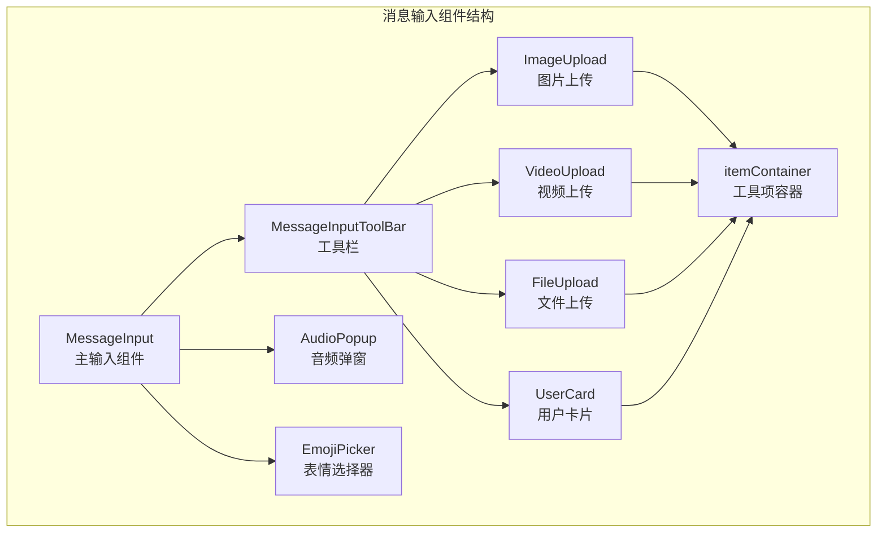
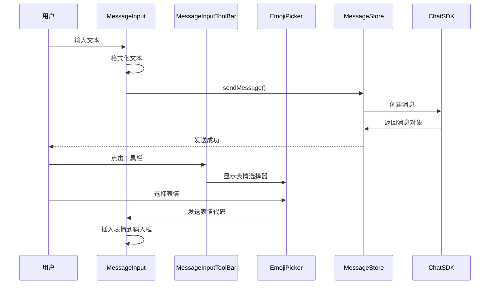
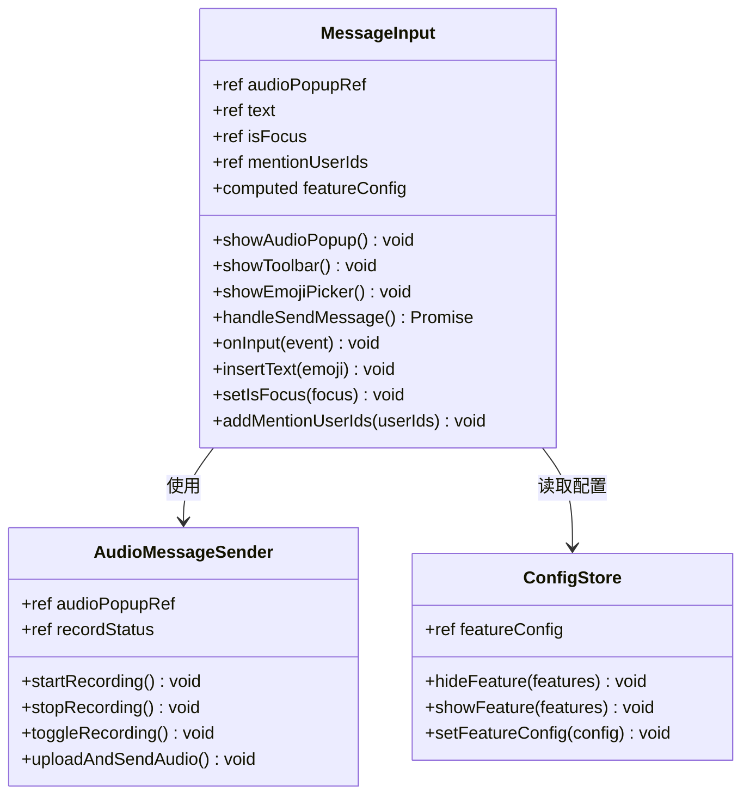
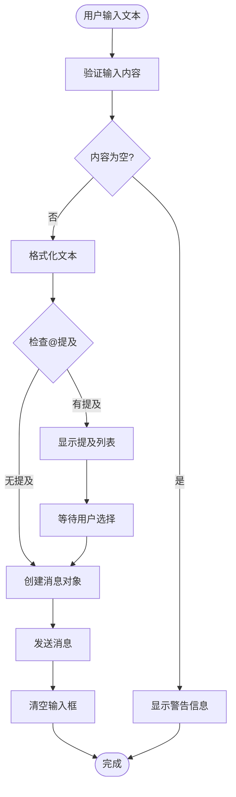
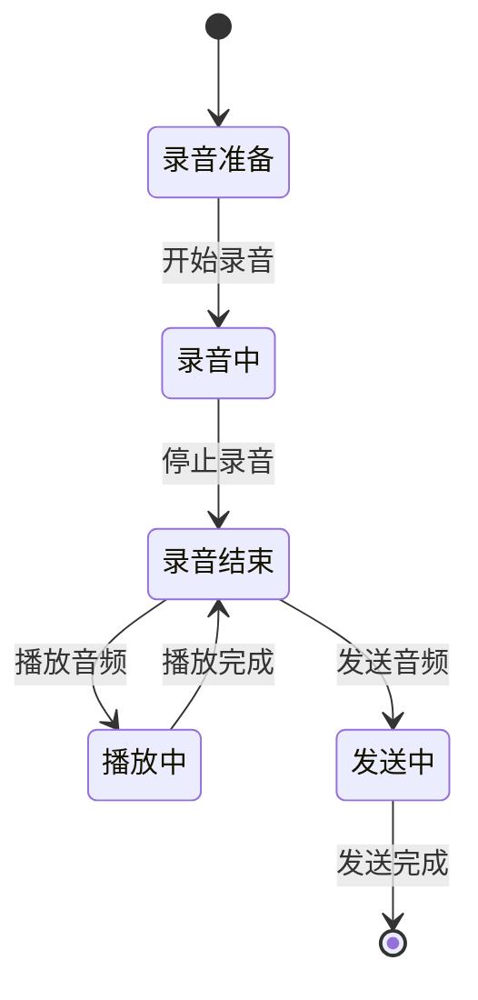
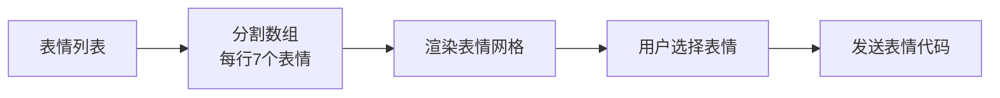
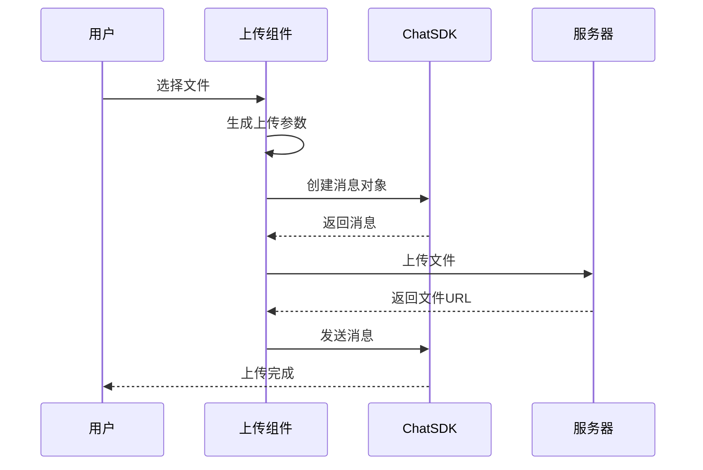
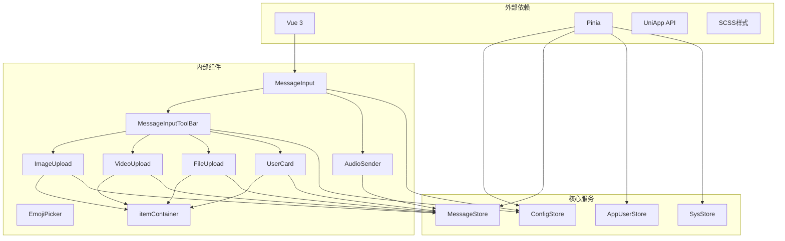

# 消息输入组件

<cite>
**本文档引用的文件**
- [ChatUIKit/modules/Chat/components/MessageInput/index.vue](file://ChatUIKit/modules/Chat/components/MessageInput/index.vue)
- [ChatUIKit/modules/Chat/components/MessageInput/style.scss](file://ChatUIKit/modules/Chat/components/MessageInput/style.scss)
- [ChatUIKit/modules/Chat/components/MessageInputToolBar/index.vue](file://ChatUIKit/modules/Chat/components/MessageInputToolBar/index.vue)
- [ChatUIKit/modules/Chat/components/MessageInputToolBar/itemContainer.vue](file://ChatUIKit/modules/Chat/components/MessageInputToolBar/itemContainer.vue)
- [ChatUIKit/modules/Chat/components/MessageInputToolBar/audioSender.vue](file://ChatUIKit/modules/Chat/components/MessageInputToolBar/audioSender.vue)
- [ChatUIKit/modules/Chat/components/MessageInputToolBar/emojiPicker.vue](file://ChatUIKit/modules/Chat/components/MessageInputToolBar/emojiPicker.vue)
- [ChatUIKit/modules/Chat/components/MessageInputToolBar/imageUpload.vue](file://ChatUIKit/modules/Chat/components/MessageInputToolBar/imageUpload.vue)
- [ChatUIKit/modules/Chat/components/MessageInputToolBar/videoUpload.vue](file://ChatUIKit/modules/Chat/components/MessageInputToolBar/videoUpload.vue)
- [ChatUIKit/modules/Chat/components/MessageInputToolBar/fileUpload.vue](file://ChatUIKit/modules/Chat/components/MessageInputToolBar/fileUpload.vue)
- [ChatUIKit/modules/Chat/components/MessageInputToolBar/userCard.vue](file://ChatUIKit/modules/Chat/components/MessageInputToolBar/userCard.vue)
- [ChatUIKit/modules/Chat/index.vue](file://ChatUIKit/modules/Chat/index.vue)
- [ChatUIKit/stores/config.ts](file://ChatUIKit/stores/config.ts)
- [ChatUIKit/const/index.ts](file://ChatUIKit/const/index.ts)
- [ChatUIKit/types/index.ts](file://ChatUIKit/types/index.ts)
- [ChatUIKit/utils/index.ts](file://ChatUIKit/utils/index.ts)
</cite>

## 目录
1. [简介](#简介)
2. [项目结构](#项目结构)
3. [核心组件](#核心组件)
4. [架构概览](#架构概览)
5. [详细组件分析](#详细组件分析)
6. [依赖关系分析](#依赖关系分析)
7. [性能考虑](#性能考虑)
8. [故障排除指南](#故障排除指南)
9. [结论](#结论)

## 简介

消息输入组件是 Easemob UIKIT 中聊天界面的重要组成部分，负责处理用户的各种消息输入需求。该组件提供了完整的消息输入解决方案，包括文本输入、表情选择、多媒体文件上传、语音录制等功能。

本组件采用模块化设计，通过 Pinia 状态管理实现组件间的数据共享，使用 Vue 3 的 Composition API 提供响应式功能，并支持多种平台（H5、小程序、APP）的差异化功能。

## 项目结构

消息输入组件位于 ChatUIKit/modules/Chat/components/MessageInput 目录下，包含以下主要文件：

**图表来源**
- [ChatUIKit/modules/Chat/components/MessageInput/index.vue](file://ChatUIKit/modules/Chat/components/MessageInput/index.vue#L1-L217)
- [ChatUIKit/modules/Chat/components/MessageInputToolBar/index.vue](file://ChatUIKit/modules/Chat/components/MessageInputToolBar/index.vue#L1-L69)

**章节来源**
- [ChatUIKit/modules/Chat/components/MessageInput/index.vue](file://ChatUIKit/modules/Chat/components/MessageInput/index.vue#L1-L217)
- [ChatUIKit/modules/Chat/components/MessageInputToolBar/index.vue](file://ChatUIKit/modules/Chat/components/MessageInputToolBar/index.vue#L1-L69)

## 核心组件

消息输入组件系统由多个相互协作的组件构成，每个组件都有特定的功能职责：

### 主要组件功能

| 组件名称 | 功能描述 | 支持平台 |
|---------|----------|----------|
| MessageInput | 主输入组件，处理文本输入和基本交互 | H5/小程序/APP |
| MessageInputToolBar | 工具栏，提供多媒体功能入口 | H5/小程序/APP |
| AudioSender | 音频录制和发送功能 | H5/小程序/APP |
| EmojiPicker | 表情选择器 | H5/小程序/APP |
| ImageUpload | 图片上传功能 | H5/小程序/APP |
| VideoUpload | 视频上传功能 | H5/小程序/APP |
| FileUpload | 文件上传功能 | H5/小程序/Web |
| UserCard | 用户名片功能 | H5/小程序/APP |

**章节来源**
- [ChatUIKit/modules/Chat/components/MessageInput/index.vue](file://ChatUIKit/modules/Chat/components/MessageInput/index.vue#L43-L85)
- [ChatUIKit/modules/Chat/components/MessageInputToolBar/index.vue](file://ChatUIKit/modules/Chat/components/MessageInputToolBar/index.vue#L26-L43)

## 架构概览

消息输入组件采用分层架构设计，通过事件驱动的方式实现组件间的通信：

**图表来源**
- [ChatUIKit/modules/Chat/components/MessageInput/index.vue](file://ChatUIKit/modules/Chat/components/MessageInput/index.vue#L137-L189)
- [ChatUIKit/modules/Chat/index.vue](file://ChatUIKit/modules/Chat/index.vue#L155-L158)

**章节来源**
- [ChatUIKit/modules/Chat/index.vue](file://ChatUIKit/modules/Chat/index.vue#L34-L58)
- [ChatUIKit/modules/Chat/components/MessageInput/index.vue](file://ChatUIKit/modules/Chat/components/MessageInput/index.vue#L137-L189)

## 详细组件分析

### MessageInput 主组件

MessageInput 是消息输入的核心组件，负责处理用户的基本输入操作：

**图表来源**
- [ChatUIKit/modules/Chat/components/MessageInput/index.vue](file://ChatUIKit/modules/Chat/components/MessageInput/index.vue#L43-L211)
- [ChatUIKit/modules/Chat/components/MessageInputToolBar/audioSender.vue](file://ChatUIKit/modules/Chat/components/MessageInputToolBar/audioSender.vue#L40-L260)

#### 文本输入处理流程

**图表来源**
- [ChatUIKit/modules/Chat/components/MessageInput/index.vue](file://ChatUIKit/modules/Chat/components/MessageInput/index.vue#L123-L135)
- [ChatUIKit/modules/Chat/components/MessageInput/index.vue](file://ChatUIKit/modules/Chat/components/MessageInput/index.vue#L137-L189)

**章节来源**
- [ChatUIKit/modules/Chat/components/MessageInput/index.vue](file://ChatUIKit/modules/Chat/components/MessageInput/index.vue#L123-L189)

### MessageInputToolBar 工具栏

工具栏组件提供多媒体功能入口，根据功能配置动态显示相应按钮：

#### 功能配置机制

| 功能配置项 | 描述 | 默认值 |
|-----------|------|--------|
| inputImage | 图片上传功能 | true |
| inputVideo | 视频上传功能 | true |
| inputFile | 文件上传功能 | true |
| inputAudio | 音频录制功能 | true |
| userCard | 用户名片功能 | true |

**章节来源**
- [ChatUIKit/modules/Chat/components/MessageInputToolBar/index.vue](file://ChatUIKit/modules/Chat/components/MessageInputToolBar/index.vue#L6-L20)
- [ChatUIKit/stores/config.ts](file://ChatUIKit/stores/config.ts#L24-L57)

### 音频录制组件

AudioSender 组件实现了完整的音频录制功能，包括录音控制、播放控制和文件上传：

**图表来源**
- [ChatUIKit/modules/Chat/components/MessageInputToolBar/audioSender.vue](file://ChatUIKit/modules/Chat/components/MessageInputToolBar/audioSender.vue#L63-L141)

#### 音频权限处理

组件支持不同平台的权限检查机制：

| 平台 | 权限检查 | 处理方式 |
|------|----------|----------|
| Android | RECORD_AUDIO | 弹出权限请求对话框 |
| iOS | record | 检查系统权限状态 |
| H5 | 浏览器权限 | 使用浏览器原生权限API |

**章节来源**
- [ChatUIKit/modules/Chat/components/MessageInputToolBar/audioSender.vue](file://ChatUIKit/modules/Chat/components/MessageInputToolBar/audioSender.vue#L92-L109)
- [ChatUIKit/modules/Chat/components/MessageInputToolBar/audioSender.vue](file://ChatUIKit/modules/Chat/components/MessageInputToolBar/audioSender.vue#L223-L242)

### 表情选择器

EmojiPicker 组件提供表情选择功能，支持表情的网格布局和点击选择：

#### 表情数据处理

**图表来源**
- [ChatUIKit/modules/Chat/components/MessageInputToolBar/emojiPicker.vue](file://ChatUIKit/modules/Chat/components/MessageInputToolBar/emojiPicker.vue#L29-L41)

**章节来源**
- [ChatUIKit/modules/Chat/components/MessageInputToolBar/emojiPicker.vue](file://ChatUIKit/modules/Chat/components/MessageInputToolBar/emojiPicker.vue#L29-L41)

### 多媒体上传组件

各个上传组件都遵循统一的上传流程：

**图表来源**
- [ChatUIKit/modules/Chat/components/MessageInputToolBar/imageUpload.vue](file://ChatUIKit/modules/Chat/components/MessageInputToolBar/imageUpload.vue#L41-L76)
- [ChatUIKit/modules/Chat/components/MessageInputToolBar/videoUpload.vue](file://ChatUIKit/modules/Chat/components/MessageInputToolBar/videoUpload.vue#L40-L78)

**章节来源**
- [ChatUIKit/modules/Chat/components/MessageInputToolBar/imageUpload.vue](file://ChatUIKit/modules/Chat/components/MessageInputToolBar/imageUpload.vue#L41-L76)
- [ChatUIKit/modules/Chat/components/MessageInputToolBar/videoUpload.vue](file://ChatUIKit/modules/Chat/components/MessageInputToolBar/videoUpload.vue#L40-L78)
- [ChatUIKit/modules/Chat/components/MessageInputToolBar/fileUpload.vue](file://ChatUIKit/modules/Chat/components/MessageInputToolBar/fileUpload.vue#L56-L95)

## 依赖关系分析

消息输入组件之间的依赖关系如下：

**图表来源**
- [ChatUIKit/modules/Chat/components/MessageInput/index.vue](file://ChatUIKit/modules/Chat/components/MessageInput/index.vue#L44-L56)
- [ChatUIKit/modules/Chat/components/MessageInputToolBar/index.vue](file://ChatUIKit/modules/Chat/components/MessageInputToolBar/index.vue#L27-L32)

**章节来源**
- [ChatUIKit/stores/config.ts](file://ChatUIKit/stores/config.ts#L59-L123)
- [ChatUIKit/types/index.ts](file://ChatUIKit/types/index.ts#L3-L5)

## 性能考虑

### 内存管理

组件在卸载时需要正确清理资源：

- 音频上下文的销毁
- 定时器的清理
- 事件监听器的移除

### 网络优化

- 文件上传使用异步处理
- 支持断点续传机制
- 错误重试策略

### 用户体验优化

- 输入框焦点管理
- 键盘高度适配
- 平滑的动画过渡效果

## 故障排除指南

### 常见问题及解决方案

| 问题类型 | 症状 | 解决方案 |
|----------|------|----------|
| 权限拒绝 | 音频录制失败 | 检查系统权限设置 |
| 网络异常 | 文件上传失败 | 检查网络连接状态 |
| 平台兼容性 | 某些功能不可用 | 检查平台支持情况 |
| 内存泄漏 | 应用卡顿 | 确认资源清理机制 |

**章节来源**
- [ChatUIKit/modules/Chat/components/MessageInputToolBar/audioSender.vue](file://ChatUIKit/modules/Chat/components/MessageInputToolBar/audioSender.vue#L223-L242)
- [ChatUIKit/modules/Chat/components/MessageInputToolBar/audioSender.vue](file://ChatUIKit/modules/Chat/components/MessageInputToolBar/audioSender.vue#L249-L255)

## 结论

消息输入组件系统展现了现代前端开发的最佳实践，通过模块化设计、状态管理和跨平台兼容性实现了完整的聊天输入功能。组件架构清晰，职责分离明确，为开发者提供了灵活的扩展空间。

该系统的主要优势包括：
- 完整的功能覆盖（文本、表情、多媒体、语音）
- 良好的用户体验设计
- 强大的可配置性
- 良好的性能表现
- 完善的错误处理机制

通过合理使用这些组件，开发者可以快速构建功能丰富的聊天应用，满足不同场景下的消息输入需求。