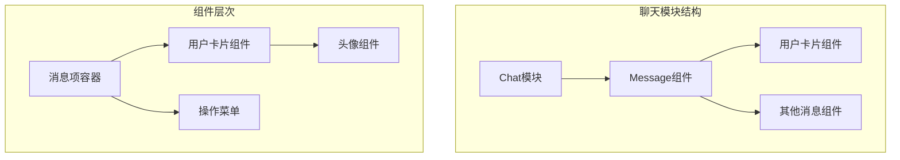
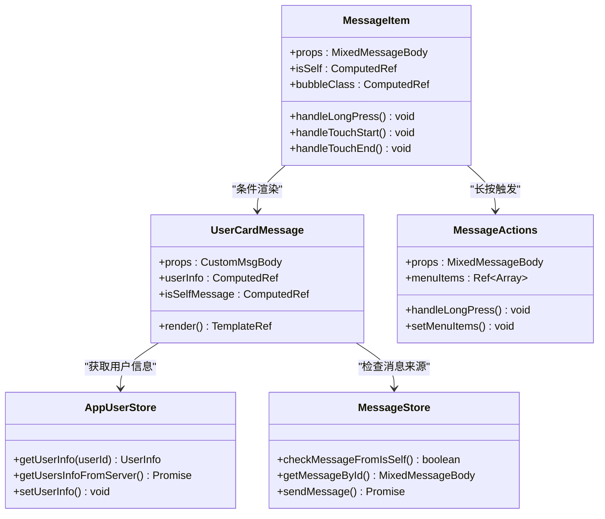
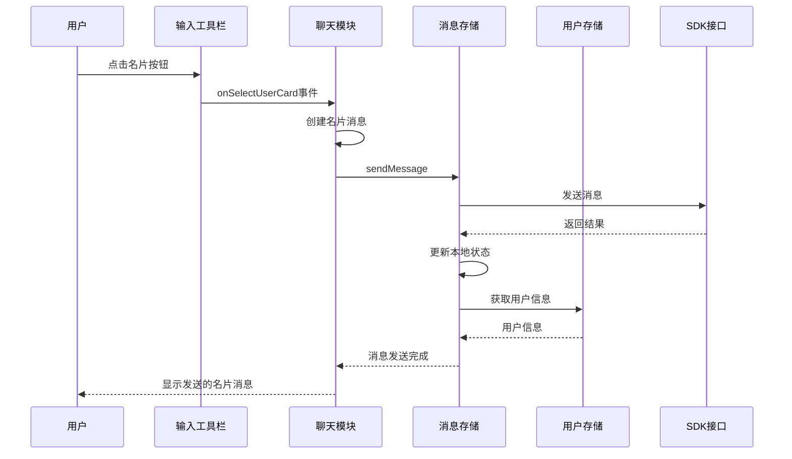
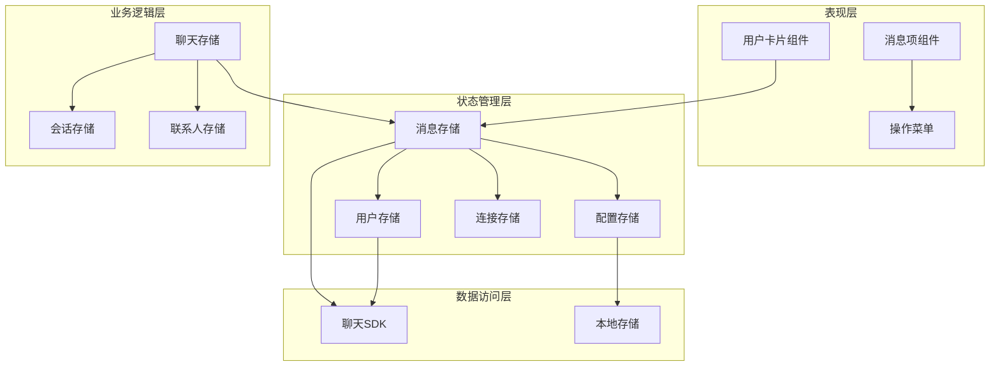
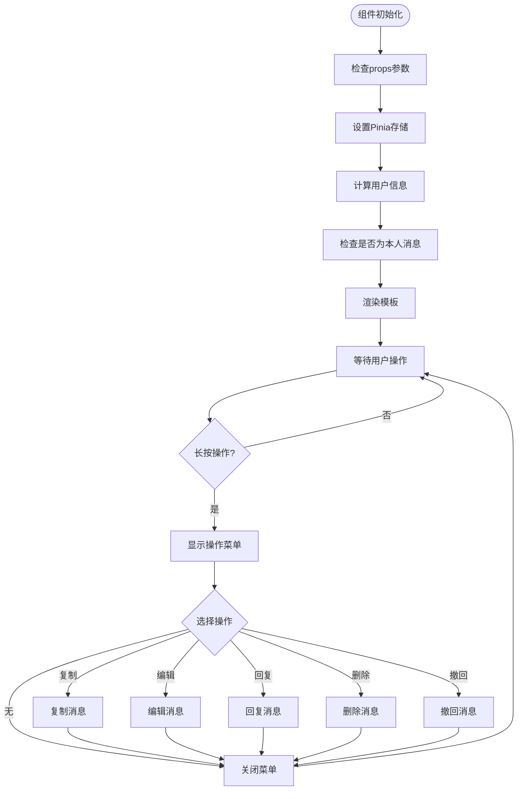
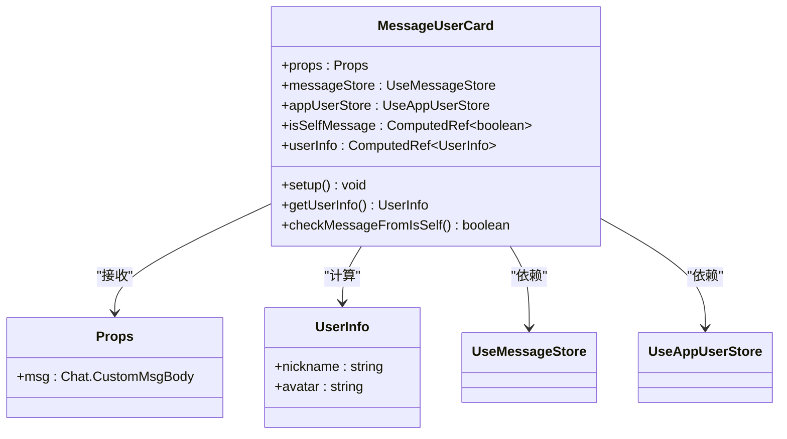
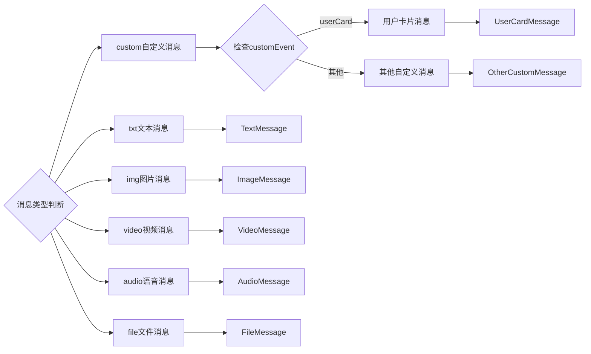
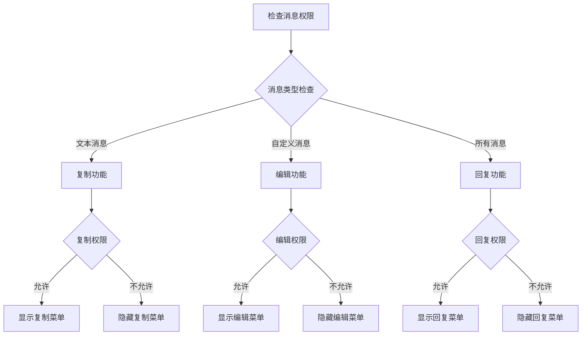
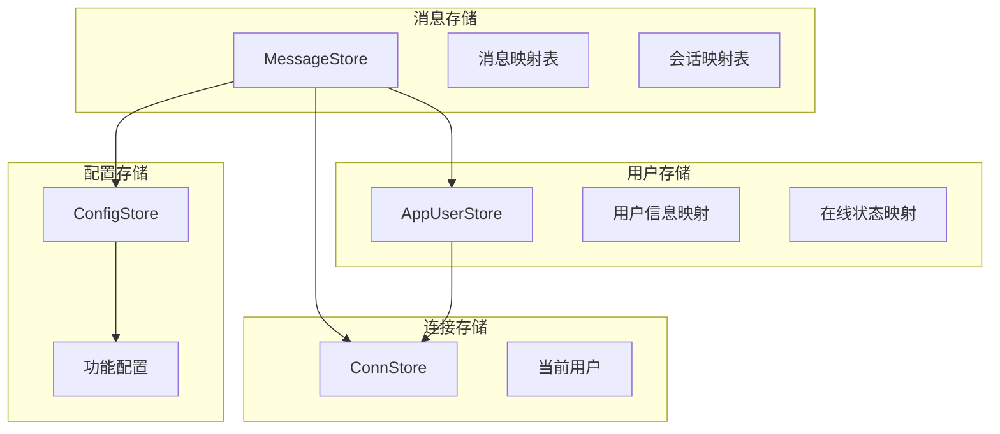
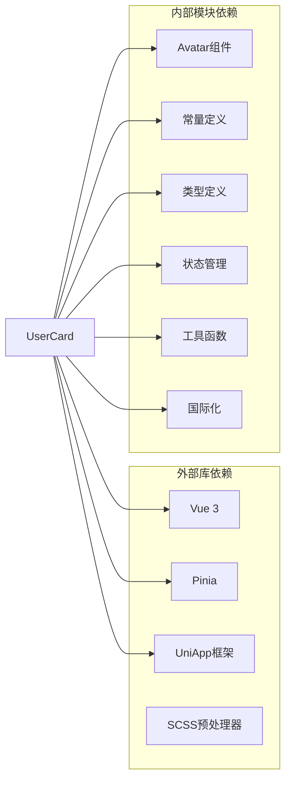

# 消息用户卡片组件

<cite>
**本文档引用的文件**
- [messageUserCard.vue](file://ChatUIKit/modules/Chat/components/Message/messageUserCard.vue)
- [messageItem.vue](file://ChatUIKit/modules/Chat/components/Message/messageItem.vue)
- [messageActions.vue](file://ChatUIKit/modules/Chat/components/Message/messageActions.vue)
- [messageQuote.vue](file://ChatUIKit/modules/Chat/components/Message/messageQuote.vue)
- [chat.ts](file://ChatUIKit/stores/chat.ts)
- [message.ts](file://ChatUIKit/stores/message.ts)
- [appUser.ts](file://ChatUIKit/stores/appUser.ts)
- [index.ts](file://ChatUIKit/types/index.ts)
- [index.ts](file://ChatUIKit/const/index.ts)
- [userCard.vue](file://ChatUIKit/modules/Chat/components/MessageInputToolBar/userCard.vue)
- [index.vue](file://ChatUIKit/modules/Chat/index.vue)
</cite>

## 目录
1. [简介](#简介)
2. [项目结构](#项目结构)
3. [核心组件](#核心组件)
4. [架构概览](#架构概览)
5. [详细组件分析](#详细组件分析)
6. [依赖关系分析](#依赖关系分析)
7. [性能考虑](#性能考虑)
8. [故障排除指南](#故障排除指南)
9. [结论](#结论)

## 简介

消息用户卡片组件是Easemob UIKit聊天组件库中的一个重要组成部分，用于在聊天界面中展示用户名片信息。该组件允许用户通过点击发送名片消息，向对话中的其他用户分享个人资料信息。组件采用Vue 3 Composition API编写，结合Pinia状态管理，实现了响应式的用户信息展示和交互功能。

## 项目结构

消息用户卡片组件位于聊天模块的Message子目录中，与其它消息类型组件共同构成了完整的聊天消息系统。

**图表来源**
- [messageUserCard.vue](file://ChatUIKit/modules/Chat/components/Message/messageUserCard.vue#L1-L80)
- [messageItem.vue](file://ChatUIKit/modules/Chat/components/Message/messageItem.vue#L1-L264)

**章节来源**
- [messageUserCard.vue](file://ChatUIKit/modules/Chat/components/Message/messageUserCard.vue#L1-L80)
- [messageItem.vue](file://ChatUIKit/modules/Chat/components/Message/messageItem.vue#L1-L264)

## 核心组件

消息用户卡片组件由多个核心部分组成，包括组件本身、消息容器、用户信息管理和状态控制等。

### 组件架构

**图表来源**
- [messageUserCard.vue](file://ChatUIKit/modules/Chat/components/Message/messageUserCard.vue#L16-L42)
- [messageItem.vue](file://ChatUIKit/modules/Chat/components/Message/messageItem.vue#L74-L181)
- [messageActions.vue](file://ChatUIKit/modules/Chat/components/Message/messageActions.vue#L30-L250)

### 数据流架构

**图表来源**
- [index.vue](file://ChatUIKit/modules/Chat/index.vue#L185-L209)
- [message.ts](file://ChatUIKit/stores/message.ts#L223-L336)
- [appUser.ts](file://ChatUIKit/stores/appUser.ts#L86-L125)

**章节来源**
- [messageUserCard.vue](file://ChatUIKit/modules/Chat/components/Message/messageUserCard.vue#L16-L42)
- [messageItem.vue](file://ChatUIKit/modules/Chat/components/Message/messageItem.vue#L74-L181)
- [messageActions.vue](file://ChatUIKit/modules/Chat/components/Message/messageActions.vue#L30-L250)

## 架构概览

消息用户卡片组件采用了现代化的前端架构设计，结合了Vue 3的新特性、Pinia状态管理以及TypeScript类型安全。

### 系统架构图

**图表来源**
- [chat.ts](file://ChatUIKit/stores/chat.ts#L29-L398)
- [message.ts](file://ChatUIKit/stores/message.ts#L48-L581)
- [appUser.ts](file://ChatUIKit/stores/appUser.ts#L24-L242)

### 组件交互流程

**图表来源**
- [messageActions.vue](file://ChatUIKit/modules/Chat/components/Message/messageActions.vue#L78-L246)
- [messageItem.vue](file://ChatUIKit/modules/Chat/components/Message/messageItem.vue#L140-L180)

**章节来源**
- [chat.ts](file://ChatUIKit/stores/chat.ts#L29-L398)
- [message.ts](file://ChatUIKit/stores/message.ts#L48-L581)
- [appUser.ts](file://ChatUIKit/stores/appUser.ts#L24-L242)

## 详细组件分析

### 用户卡片组件

用户卡片组件是消息用户卡片的核心实现，负责展示用户的基本信息和名片样式。

#### 组件结构分析

**图表来源**
- [messageUserCard.vue](file://ChatUIKit/modules/Chat/components/Message/messageUserCard.vue#L24-L42)

#### 样式设计分析

组件采用了简洁的卡片式设计，具有以下特点：

- **宽度固定**: 220px的固定宽度，确保在不同屏幕尺寸下的一致性
- **边框设计**: 底部边框区分不同消息类型
- **头像布局**: 44px头像配合12px间距的垂直居中布局
- **标签系统**: 底部显示"联系人"标签，提供语义化标识

**章节来源**
- [messageUserCard.vue](file://ChatUIKit/modules/Chat/components/Message/messageUserCard.vue#L1-L80)

### 消息项容器

消息项容器负责管理不同类型消息的渲染和交互，包括用户卡片消息的特殊处理。

#### 消息类型路由

**图表来源**
- [messageItem.vue](file://ChatUIKit/modules/Chat/components/Message/messageItem.vue#L41-L58)

#### 长按交互机制

消息项容器实现了复杂的长按交互机制，支持多种手势操作：

- **原生长按**: 使用`longpress`事件检测长按
- **触摸检测**: 通过`touchstart`、`touchend`、`touchmove`组合检测长按
- **定时器机制**: 600ms阈值确保长按的准确性
- **移动取消**: 手指移动时自动取消长按检测

**章节来源**
- [messageItem.vue](file://ChatUIKit/modules/Chat/components/Message/messageItem.vue#L140-L180)

### 操作菜单组件

操作菜单提供了丰富的消息操作选项，支持复制、编辑、回复、删除、撤回等功能。

#### 功能权限控制

**图表来源**
- [messageActions.vue](file://ChatUIKit/modules/Chat/components/Message/messageActions.vue#L78-L144)

#### 菜单位置智能计算

操作菜单支持多种显示位置，根据消息位置自动调整：

- **顶部区域**: nearTop - 菜单在消息上方显示
- **底部区域**: nearBottom - 菜单在消息下方显示  
- **溢出区域**: overstep - 菜单固定在可视区域内

**章节来源**
- [messageActions.vue](file://ChatUIKit/modules/Chat/components/Message/messageActions.vue#L159-L176)

### 状态管理集成

消息用户卡片组件深度集成了多个Pinia存储，实现了完整的状态管理。

#### 存储依赖关系

**图表来源**
- [message.ts](file://ChatUIKit/stores/message.ts#L48-L106)
- [appUser.ts](file://ChatUIKit/stores/appUser.ts#L24-L80)

**章节来源**
- [message.ts](file://ChatUIKit/stores/message.ts#L48-L106)
- [appUser.ts](file://ChatUIKit/stores/appUser.ts#L24-L80)

## 依赖关系分析

消息用户卡片组件的依赖关系体现了清晰的分层架构设计。

### 外部依赖

**图表来源**
- [messageUserCard.vue](file://ChatUIKit/modules/Chat/components/Message/messageUserCard.vue#L17-L22)

### 内部模块耦合

组件之间的耦合度控制良好，主要通过以下方式实现：

- **单向数据流**: 父组件向子组件传递数据，避免循环依赖
- **事件驱动**: 子组件通过事件向上层传递用户操作
- **接口抽象**: 通过TypeScript接口定义组件契约
- **状态集中**: 共享状态统一管理，减少重复计算

**章节来源**
- [messageUserCard.vue](file://ChatUIKit/modules/Chat/components/Message/messageUserCard.vue#L17-L22)
- [messageItem.vue](file://ChatUIKit/modules/Chat/components/Message/messageItem.vue#L76-L88)

## 性能考虑

消息用户卡片组件在设计时充分考虑了性能优化，采用了多种策略提升用户体验。

### 渲染优化

- **虚拟DOM优化**: 使用Vue 3的响应式系统，仅在必要时重新渲染
- **计算属性缓存**: 通过computed缓存用户信息计算结果
- **条件渲染**: 仅在消息类型匹配时渲染对应组件
- **懒加载**: 头像组件支持延迟加载，减少首屏渲染压力

### 内存管理

- **组件生命周期**: 正确管理组件的创建和销毁
- **事件清理**: 及时清理长按检测的定时器
- **存储清理**: 提供clear方法清理缓存数据
- **引用优化**: 避免不必要的深层引用

### 网络优化

- **用户信息缓存**: AppUserStore提供本地缓存机制
- **批量请求**: 支持批量获取用户信息，减少网络请求次数
- **去重处理**: 避免重复请求相同的用户信息
- **错误重试**: 实现网络异常时的重试机制

## 故障排除指南

### 常见问题及解决方案

#### 用户信息显示异常

**问题描述**: 用户头像或昵称显示为空或默认值

**可能原因**:
1. 用户信息尚未从服务器获取
2. 用户ID格式不正确
3. 网络请求失败

**解决步骤**:
1. 检查用户信息存储状态
2. 验证用户ID的有效性
3. 查看网络请求日志
4. 重新触发用户信息获取

#### 消息发送失败

**问题描述**: 名片消息发送后没有显示

**可能原因**:
1. 消息发送过程中出现异常
2. 服务器响应超时
3. 权限不足

**解决步骤**:
1. 检查消息状态更新
2. 验证服务器连接状态
3. 确认用户权限
4. 查看错误日志

#### 长按操作无响应

**问题描述**: 长按消息时操作菜单不显示

**可能原因**:
1. 长按检测逻辑异常
2. 触摸事件处理错误
3. 菜单定位计算错误

**解决步骤**:
1. 检查长按事件绑定
2. 验证触摸事件处理
3. 确认菜单定位算法
4. 测试不同设备兼容性

**章节来源**
- [messageActions.vue](file://ChatUIKit/modules/Chat/components/Message/messageActions.vue#L178-L207)
- [message.ts](file://ChatUIKit/stores/message.ts#L332-L336)

## 结论

消息用户卡片组件作为Easemob UIKit聊天组件库的重要组成部分，展现了现代前端开发的最佳实践。组件通过清晰的架构设计、完善的类型系统、高效的性能优化和健壮的错误处理，为用户提供了优秀的名片分享体验。

### 主要优势

1. **架构清晰**: 采用分层设计，职责分离明确
2. **性能优秀**: 通过多种优化策略提升渲染效率
3. **扩展性强**: 支持灵活的功能配置和定制
4. **维护友好**: 类型安全和模块化设计便于维护
5. **用户体验佳**: 响应式交互和智能布局优化

### 技术亮点

- Vue 3 Composition API的现代化开发模式
- Pinia状态管理的响应式数据流
- TypeScript类型系统的安全保障
- SCSS预处理器的样式管理能力
- UniApp框架的跨平台兼容性

该组件为开发者提供了一个高质量的名片消息实现范例，展示了如何在复杂的应用场景中平衡功能完整性、性能要求和用户体验。