# 平台兼容性

<cite>
**本文档引用的文件**
- [README.md](file://README.md)
- [VUE2_README.md](file://VUE2_README.md)
- [ChatUIKit-vue2/index.js](file://ChatUIKit-vue2/index.js)
- [ChatUIKit-vue2/utils/index.js](file://ChatUIKit-vue2/utils/index.js)
- [ChatUIKit-vue2/stores/config.js](file://ChatUIKit-vue2/stores/config.js)
- [ChatUIKit-vue2/components/Avatar/index.vue](file://ChatUIKit-vue2/components/Avatar/index.vue)
- [ChatUIKit-vue2/modules/Chat/components/Message/messageItem.vue](file://ChatUIKit-vue2/modules/Chat/components/Message/messageItem.vue)
- [ChatUIKit-vue2/modules/Chat/components/Message/messageList.vue](file://ChatUIKit-vue2/modules/Chat/components/Message/messageList.vue)
- [ChatUIKit-vue2/locales/index.js](file://ChatUIKit-vue2/locales/index.js)
- [ChatUIKit-vue2/styles/common.scss](file://ChatUIKit-vue2/styles/common.scss)
- [vue2-demo/main.js](file://vue2-demo/main.js)
- [vue2-demo/manifest.json](file://vue2-demo/manifest.json)
- [vue2-demo/package.json](file://vue2-demo/package.json)
- [vue2-demo/js_sdk/easemob-uniapp-logger.esm.js](file://vue2-demo/js_sdk/easemob-uniapp-logger.esm.js)
</cite>

## 目录
1. [简介](#简介)
2. [项目结构](#项目结构)
3. [核心组件](#核心组件)
4. [架构概览](#架构概览)
5. [详细组件分析](#详细组件分析)
6. [依赖分析](#依赖分析)
7. [性能考虑](#性能考虑)
8. [故障排除指南](#故障排除指南)
9. [结论](#结论)

## 简介

Easemob ChatUIKit Vue2 版本是一个基于 Vue2 + Vuex 的环信即时通讯 UIKit，专为 UniApp 生态系统设计，支持 H5、App、微信小程序等多种平台。该项目的核心目标是在不同平台上提供一致的用户体验，同时保持代码的可维护性和扩展性。

该平台兼容性文档详细分析了项目在多平台环境下的实现策略、技术架构和最佳实践，为开发者提供了全面的平台适配指导。

## 项目结构

项目采用模块化的组织结构，主要分为以下几个核心部分：

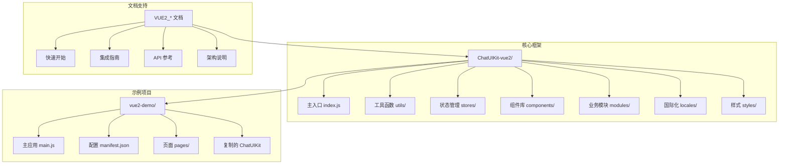

**图表来源**
- [README.md:76-96](file://README.md#L76-L96)
- [VUE2_README.md:70-86](file://VUE2_README.md#L70-L86)

**章节来源**
- [README.md:76-96](file://README.md#L76-L96)
- [VUE2_README.md:70-86](file://VUE2_README.md#L70-L86)

## 核心组件

### ChatUIKit 主类

ChatUIKit 是整个系统的入口和核心控制器，负责初始化、配置管理和事件处理。

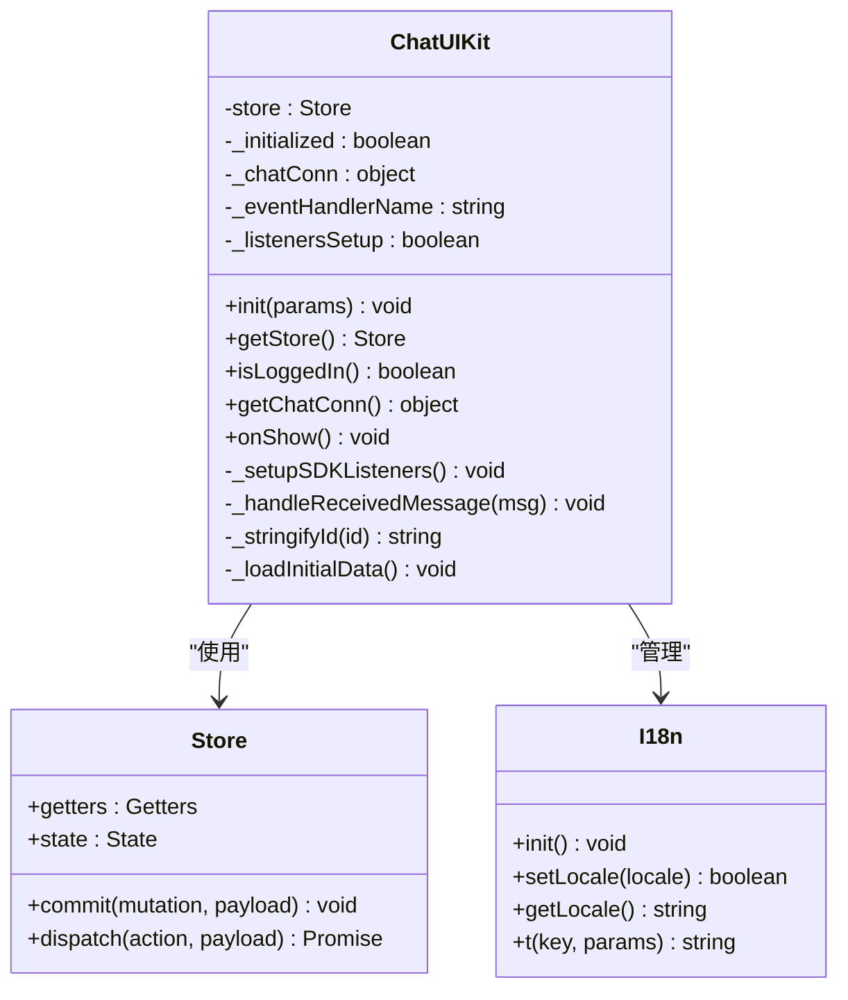

**图表来源**
- [ChatUIKit-vue2/index.js:6-405](file://ChatUIKit-vue2/index.js#L6-L405)

### 平台检测工具

项目实现了完善的平台检测机制，支持多种运行环境的识别和适配。

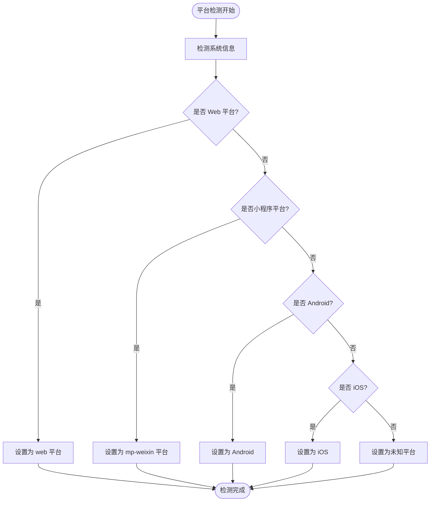

**图表来源**
- [ChatUIKit-vue2/utils/index.js:106-137](file://ChatUIKit-vue2/utils/index.js#L106-L137)

**章节来源**
- [ChatUIKit-vue2/index.js:6-405](file://ChatUIKit-vue2/index.js#L6-L405)
- [ChatUIKit-vue2/utils/index.js:106-137](file://ChatUIKit-vue2/utils/index.js#L106-L137)

## 架构概览

### 多平台适配架构

项目采用了条件编译和平台检测相结合的架构设计，确保在不同平台上的最佳性能和兼容性。

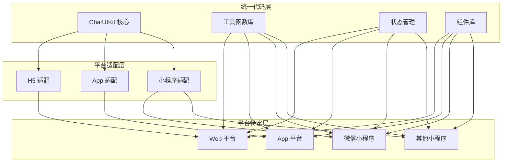

**图表来源**
- [README.md:197-213](file://README.md#L197-L213)
- [ChatUIKit-vue2/utils/index.js:106-137](file://ChatUIKit-vue2/utils/index.js#L106-L137)

### 事件处理架构

系统实现了统一的事件处理机制，支持跨平台的消息传递和状态同步。

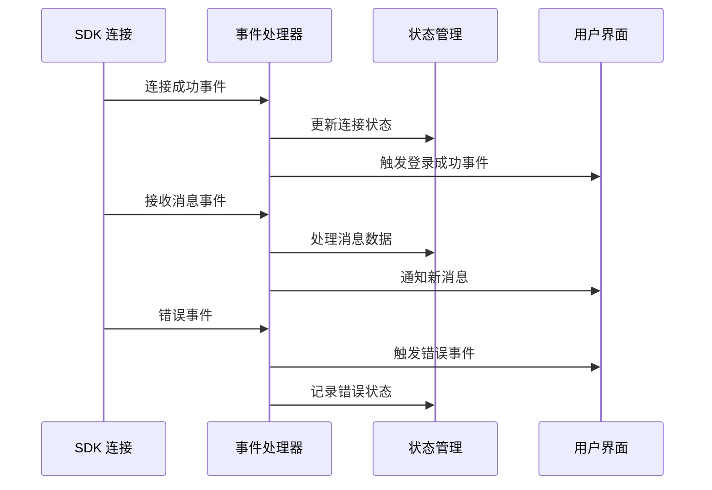

**图表来源**
- [ChatUIKit-vue2/index.js:72-309](file://ChatUIKit-vue2/index.js#L72-L309)

**章节来源**
- [README.md:197-213](file://README.md#L197-L213)
- [ChatUIKit-vue2/index.js:72-309](file://ChatUIKit-vue2/index.js#L72-L309)

## 详细组件分析

### 头像组件平台适配

头像组件展示了如何在不同平台上实现一致的视觉效果和交互体验。

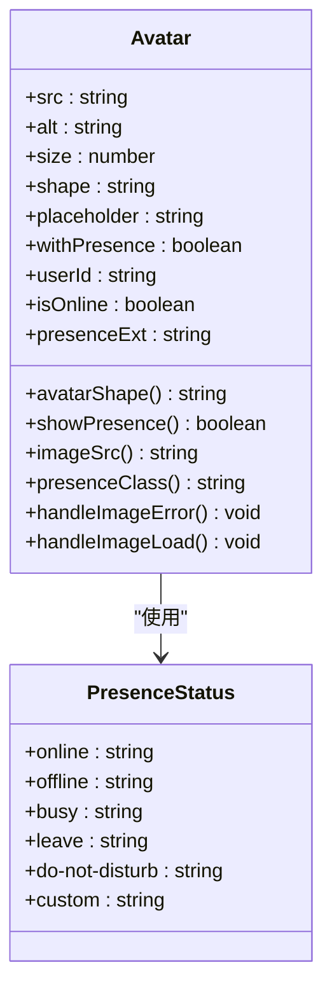

**图表来源**
- [ChatUIKit-vue2/components/Avatar/index.vue:27-168](file://ChatUIKit-vue2/components/Avatar/index.vue#L27-L168)

### 消息列表平台优化

消息列表组件针对不同平台进行了专门的性能优化和交互改进。

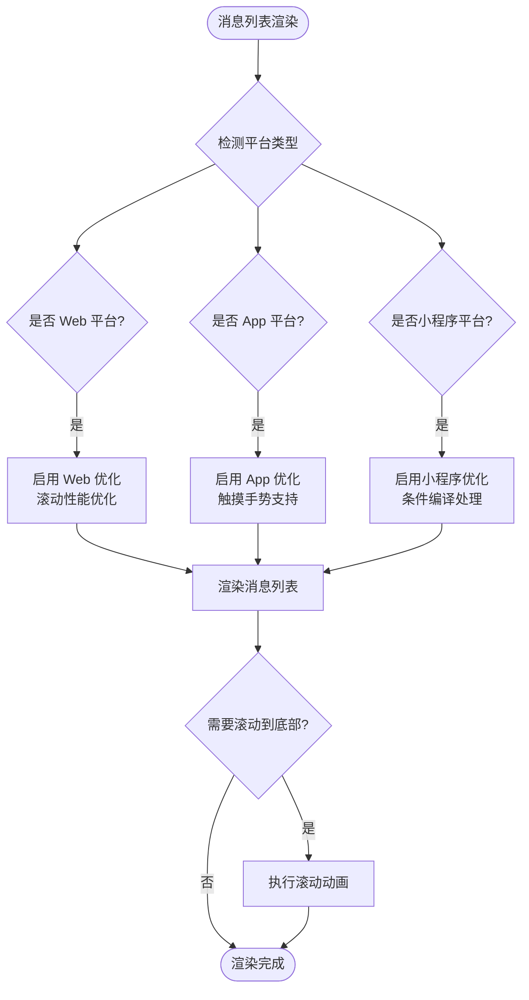

**图表来源**
- [ChatUIKit-vue2/modules/Chat/components/Message/messageList.vue:112-122](file://ChatUIKit-vue2/modules/Chat/components/Message/messageList.vue#L112-L122)
- [ChatUIKit-vue2/modules/Chat/components/Message/messageList.vue:177-197](file://ChatUIKit-vue2/modules/Chat/components/Message/messageList.vue#L177-L197)

**章节来源**
- [ChatUIKit-vue2/components/Avatar/index.vue:27-168](file://ChatUIKit-vue2/components/Avatar/index.vue#L27-L168)
- [ChatUIKit-vue2/modules/Chat/components/Message/messageList.vue:112-122](file://ChatUIKit-vue2/modules/Chat/components/Message/messageList.vue#L112-L122)
- [ChatUIKit-vue2/modules/Chat/components/Message/messageList.vue:177-197](file://ChatUIKit-vue2/modules/Chat/components/Message/messageList.vue#L177-L197)

### 国际化平台适配

国际化系统支持多语言切换和平台特定的语言设置。

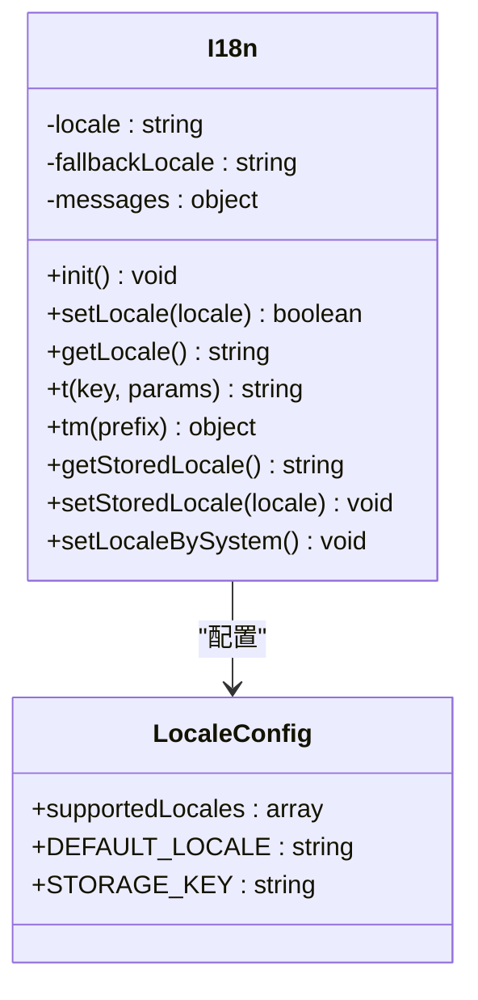

**图表来源**
- [ChatUIKit-vue2/locales/index.js:28-219](file://ChatUIKit-vue2/locales/index.js#L28-L219)

**章节来源**
- [ChatUIKit-vue2/locales/index.js:28-219](file://ChatUIKit-vue2/locales/index.js#L28-L219)

## 依赖分析

### 平台依赖关系

项目在不同平台上的依赖关系和配置存在显著差异：

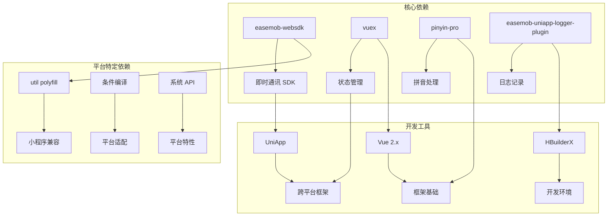

**图表来源**
- [vue2-demo/package.json:9-14](file://vue2-demo/package.json#L9-L14)
- [vue2-demo/main.js:3-45](file://vue2-demo/main.js#L3-L45)

### 配置管理架构

配置管理系统支持主题定制和功能开关控制。

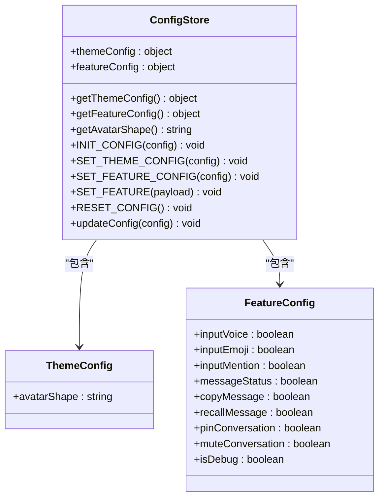

**图表来源**
- [ChatUIKit-vue2/stores/config.js:70-196](file://ChatUIKit-vue2/stores/config.js#L70-L196)

**章节来源**
- [vue2-demo/package.json:9-14](file://vue2-demo/package.json#L9-L14)
- [vue2-demo/main.js:3-45](file://vue2-demo/main.js#L3-L45)
- [ChatUIKit-vue2/stores/config.js:70-196](file://ChatUIKit-vue2/stores/config.js#L70-L196)

## 性能考虑

### 平台性能优化策略

项目针对不同平台实施了专门的性能优化策略：

1. **Web 平台优化**
   - 使用原生滚动 API 提升滚动性能
   - 实现虚拟滚动减少 DOM 节点数量
   - 优化图片加载和缓存策略

2. **App 平台优化**
   - 利用原生组件提升渲染效率
   - 实现手势识别优化触摸体验
   - 优化内存使用和垃圾回收

3. **小程序平台优化**
   - 使用条件编译避免不必要的代码
   - 实现按需加载减少包体积
   - 优化网络请求和数据传输

### 内存管理策略

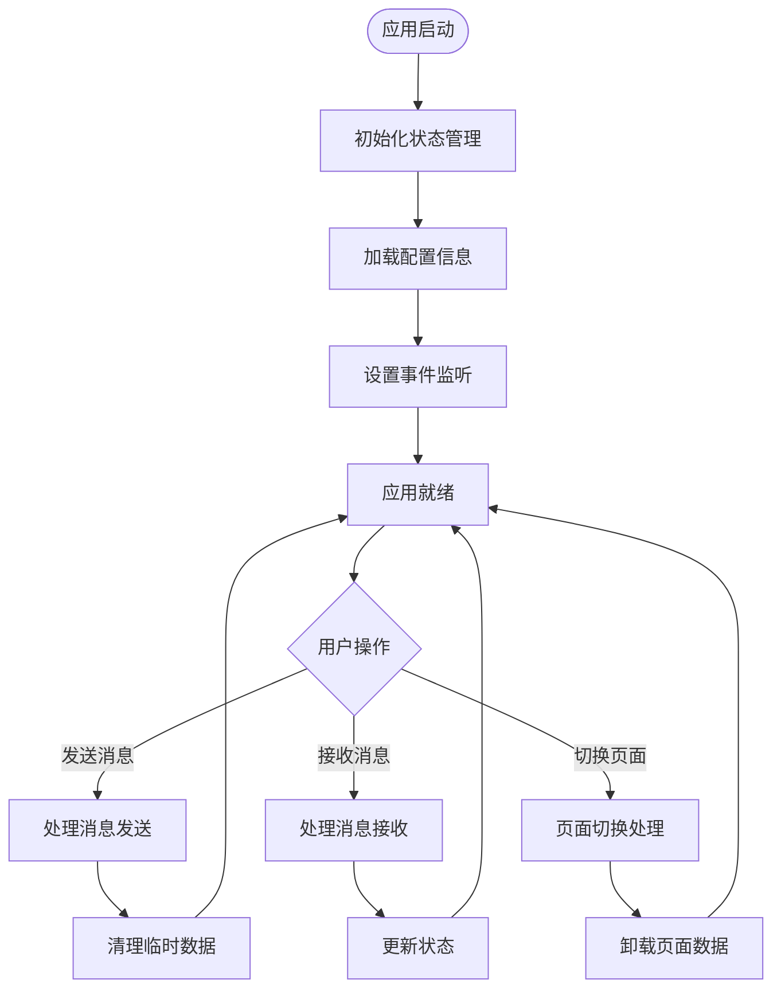

**图表来源**
- [ChatUIKit-vue2/index.js:355-363](file://ChatUIKit-vue2/index.js#L355-L363)

## 故障排除指南

### 常见平台兼容性问题

| 问题类型 | 平台影响 | 解决方案 | 相关文件 |
|---------|---------|---------|---------|
| Polyfill 缺失 | 微信小程序 | 添加 util polyfill | main.js |
| 条件编译错误 | 多平台 | 检查 #ifdef 指令 | 组件文件 |
| 消息 ID 类型问题 | 所有平台 | 使用 toPlainMessage 转换 | utils/index.js |
| 平台检测失败 | 所有平台 | 检查 uni.getSystemInfoSync | utils/index.js |
| 事件监听异常 | 所有平台 | 确认事件处理器注册 | index.js |

### 调试和诊断

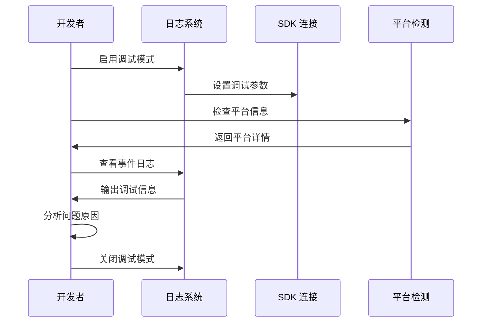

**图表来源**
- [ChatUIKit-vue2/index.js:47-59](file://ChatUIKit-vue2/index.js#L47-L59)
- [vue2-demo/js_sdk/easemob-uniapp-logger.esm.js:558-583](file://vue2-demo/js_sdk/easemob-uniapp-logger.esm.js#L558-L583)

**章节来源**
- [README.md:215-235](file://README.md#L215-L235)
- [ChatUIKit-vue2/index.js:47-59](file://ChatUIKit-vue2/index.js#L47-L59)
- [vue2-demo/js_sdk/easemob-uniapp-logger.esm.js:558-583](file://vue2-demo/js_sdk/easemob-uniapp-logger.esm.js#L558-L583)

## 结论

Easemob ChatUIKit Vue2 版本在平台兼容性方面展现了卓越的设计和实现水平。通过采用条件编译、平台检测、统一事件处理和状态管理等技术手段，项目成功实现了在 H5、App、微信小程序等多种平台上的无缝运行。

### 主要优势

1. **统一的开发体验**：开发者只需编写一套代码，即可在多个平台上运行
2. **完善的平台适配**：针对不同平台的特性进行专门优化
3. **强大的扩展能力**：模块化的架构设计便于功能扩展和定制
4. **优秀的性能表现**：针对各平台的性能特点进行专门优化

### 最佳实践建议

1. **充分利用条件编译**：在需要平台特定功能时使用适当的编译指令
2. **遵循平台规范**：严格按照各平台的开发规范和限制进行开发
3. **持续测试验证**：在所有目标平台上进行全面的功能和性能测试
4. **关注更新迭代**：及时跟进 UniApp 和各平台 SDK 的更新

通过遵循这些原则和实践，开发者可以充分利用 ChatUIKit 的平台兼容性优势，构建高质量的跨平台即时通讯应用。