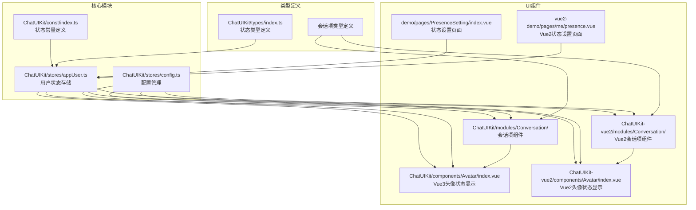
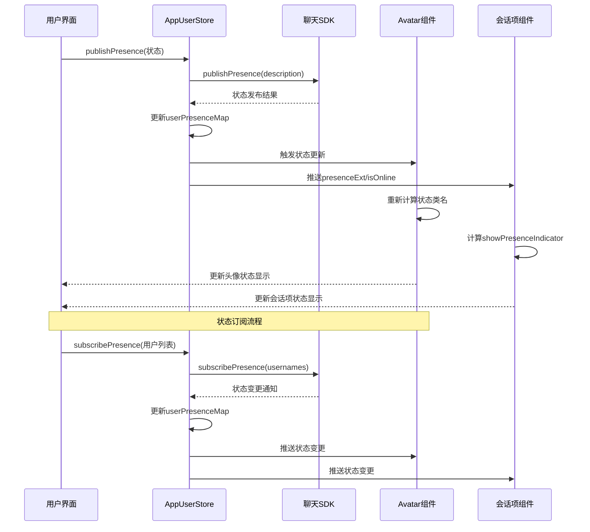
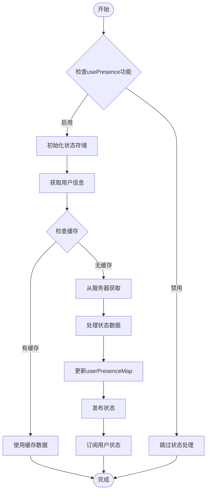
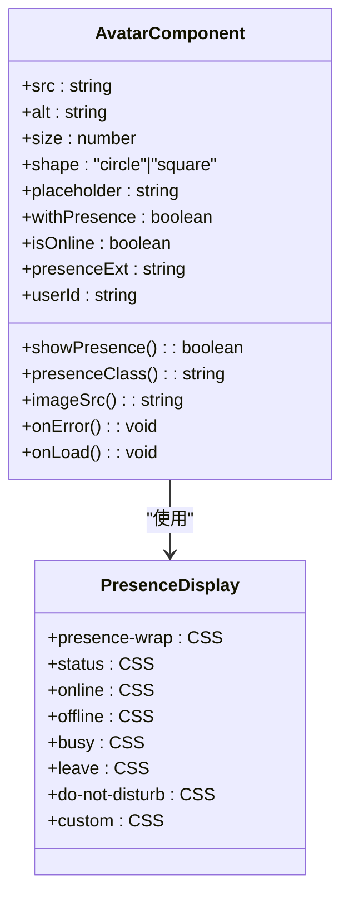
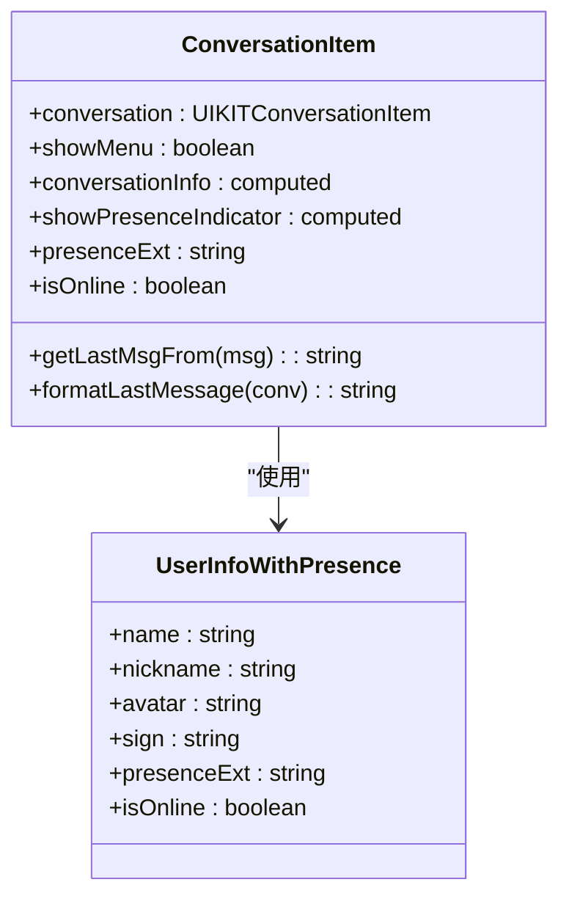
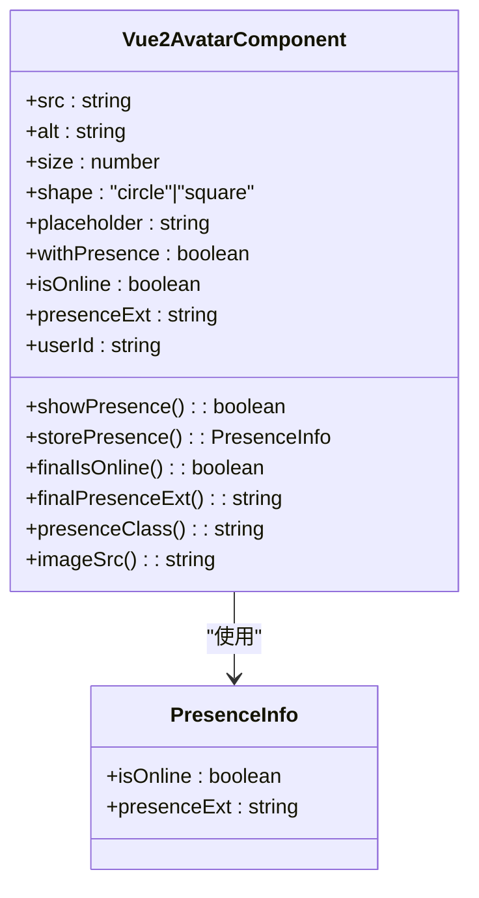
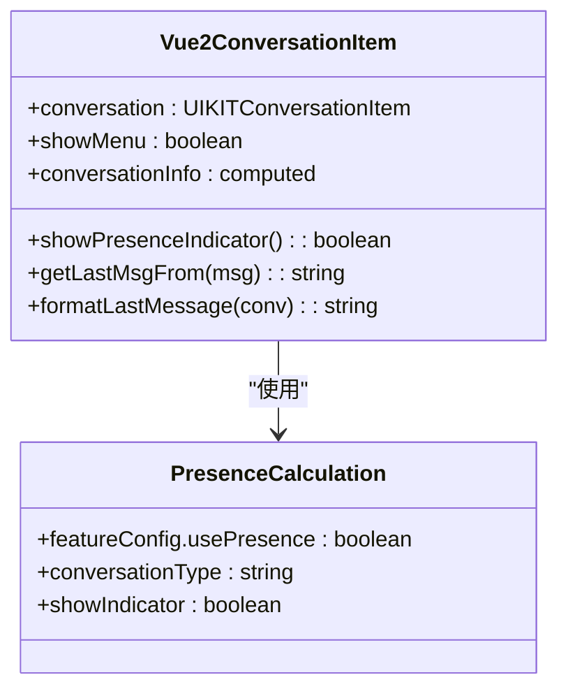
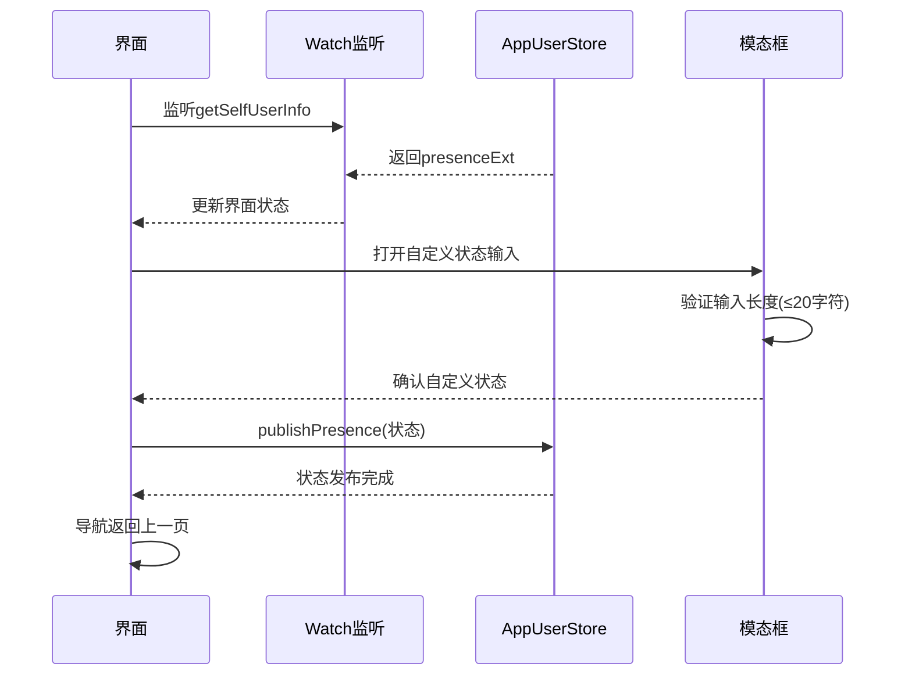
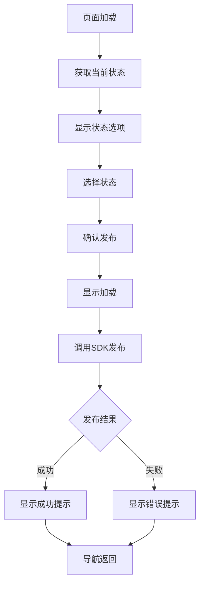
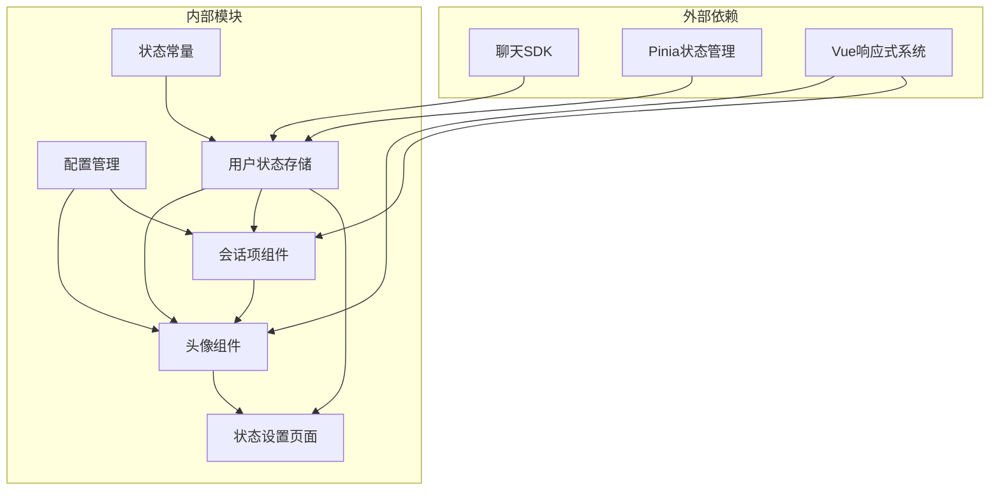

# 在线状态指示器控制

<cite>
**本文档引用的文件**
- [ChatUIKit/const/index.ts](file://ChatUIKit/const/index.ts)
- [ChatUIKit/stores/appUser.ts](file://ChatUIKit/stores/appUser.ts)
- [ChatUIKit/stores/config.ts](file://ChatUIKit/stores/config.ts)
- [ChatUIKit/components/Avatar/index.vue](file://ChatUIKit/components/Avatar/index.vue)
- [ChatUIKit/modules/Conversation/components/ConversationItem/index.vue](file://ChatUIKit/modules/Conversation/components/ConversationItem/index.vue)
- [demo/pages/PresenceSetting/index.vue](file://demo/pages/PresenceSetting/index.vue)
- [vue2-demo/pages/me/presence.vue](file://vue2-demo/pages/me/presence.vue)
- [ChatUIKit/types/index.ts](file://ChatUIKit/types/index.ts)
- [ChatUIKit-vue2/components/Avatar/index.vue](file://ChatUIKit-vue2/components/Avatar/index.vue)
- [ChatUIKit-vue2/modules/Conversation/components/ConversationItem/index.vue](file://ChatUIKit-vue2/modules/Conversation/components/ConversationItem/index.vue)
</cite>

## 更新摘要
**所做更改**
- 更新了头像组件Avatar的新属性支持说明，包括Vue2版本的userId属性
- 新增了会话项组件ConversationItem的showPresenceIndicator计算属性说明
- 更新了用户状态管理appUser/store.js的getter逻辑说明
- 新增了登录流程优化的相关说明
- 更新了架构图和组件关系图
- 新增了Vue2版本组件的详细分析

## 目录
1. [简介](#简介)
2. [项目结构](#项目结构)
3. [核心组件](#核心组件)
4. [架构概览](#架构概览)
5. [详细组件分析](#详细组件分析)
6. [依赖关系分析](#依赖关系分析)
7. [性能考虑](#性能考虑)
8. [故障排除指南](#故障排除指南)
9. [结论](#结论)

## 简介

在线状态指示器控制（Presence Indicator Controls）是Easemob UI Kit中的一个核心功能模块，用于显示用户在线状态和提供状态设置界面。该模块包含完整的在线状态管理、状态显示、状态设置和状态订阅功能。

**更新** 基于应用变更，系统现已支持更精细的状态控制，包括会话项组件的showPresenceIndicator计算属性、头像组件的withPresence、presenceExt、isOnline新属性，以及优化的用户状态管理逻辑。特别地，Vue2版本的Avatar组件新增了userId属性，用于自动获取用户状态，简化了组件使用方式。

该系统支持多种预定义的在线状态（在线、离线、离开、忙碌、勿扰）以及自定义状态，并通过头像组件直观地展示用户的实时在线状态。

## 项目结构

基于代码库分析，在线状态指示器功能分布在以下关键位置：



**图表来源**
- [ChatUIKit/const/index.ts:17-25](file://ChatUIKit/const/index.ts#L17-L25)
- [ChatUIKit/stores/appUser.ts:17-28](file://ChatUIKit/stores/appUser.ts#L17-L28)
- [ChatUIKit/stores/config.ts:14-57](file://ChatUIKit/stores/config.ts#L14-L57)
- [ChatUIKit/modules/Conversation/components/ConversationItem/index.vue:1-260](file://ChatUIKit/modules/Conversation/components/ConversationItem/index.vue#L1-L260)
- [ChatUIKit-vue2/components/Avatar/index.vue:56-78](file://ChatUIKit-vue2/components/Avatar/index.vue#L56-L78)
- [ChatUIKit-vue2/modules/Conversation/components/ConversationItem/index.vue:161-167](file://ChatUIKit-vue2/modules/Conversation/components/ConversationItem/index.vue#L161-L167)

**章节来源**
- [ChatUIKit/const/index.ts:1-37](file://ChatUIKit/const/index.ts#L1-L37)
- [ChatUIKit/stores/appUser.ts:1-242](file://ChatUIKit/stores/appUser.ts#L1-L242)
- [ChatUIKit/stores/config.ts:1-124](file://ChatUIKit/stores/config.ts#L1-L124)

## 核心组件

### 状态常量定义

系统定义了完整的在线状态枚举，包括预定义状态和自定义状态支持：

| 状态类型 | 描述 | 常量值 |
|---------|------|--------|
| Online | 在线 | "Online" |
| Offline | 离线 | "Offline" |
| Away | 离开 | "Away" |
| Busy | 忙碌 | "Busy" |
| Do Not Disturb | 勿扰 | "Do Not Disturb" |
| Custom | 自定义 | "Custom" |

### 用户状态存储

AppUserStore提供了完整的状态管理功能，包括状态获取、发布、订阅和缓存机制。**更新** 现已支持从userPresenceMap直接获取presence信息的getter逻辑。

### 头像状态显示

Avatar组件实现了状态指示器的可视化展示，支持多种状态图标和样式配置。**更新** 现在支持withPresence、presenceExt、isOnline三个新属性。**新增** Vue2版本的Avatar组件还支持userId属性，用于自动获取用户状态。

### 会话项组件

ConversationItem组件集成了在线状态显示功能，通过showPresenceIndicator计算属性控制状态指示器的显示。**新增** 支持直接从用户状态存储获取presenceExt和isOnline信息。

**章节来源**
- [ChatUIKit/const/index.ts:17-25](file://ChatUIKit/const/index.ts#L17-L25)
- [ChatUIKit/stores/appUser.ts:30-79](file://ChatUIKit/stores/appUser.ts#L30-L79)
- [ChatUIKit/components/Avatar/index.vue:29-78](file://ChatUIKit/components/Avatar/index.vue#L29-L78)
- [ChatUIKit/modules/Conversation/components/ConversationItem/index.vue:134-144](file://ChatUIKit/modules/Conversation/components/ConversationItem/index.vue#L134-L144)

## 架构概览



**图表来源**
- [ChatUIKit/stores/appUser.ts:164-193](file://ChatUIKit/stores/appUser.ts#L164-L193)
- [ChatUIKit/components/Avatar/index.vue:56-78](file://ChatUIKit/components/Avatar/index.vue#L56-L78)
- [ChatUIKit/modules/Conversation/components/ConversationItem/index.vue:134-144](file://ChatUIKit/modules/Conversation/components/ConversationItem/index.vue#L134-L144)

## 详细组件分析

### 状态常量管理

状态常量定义位于ChatUIKit/const/index.ts中，提供了完整的状态枚举和默认配置：

```mermaid
classDiagram
class PresenceConstants {
+PRESENCE_STATUS_LIST : string[]
+AT_ALL : string
+ASSETS_URL : string
+USER_AVATAR_URL : string
+GROUP_AVATAR_URL : string
+MAX_MESSAGES_PER_CONVERSATION : number
+GET_GROUP_MEMBERS_PAGESIZE : number
}
class StatusEnum {
<<enumeration>>
Online
Offline
Away
Busy
"Do Not Disturb"
Custom
}
PresenceConstants --> StatusEnum : "包含"
```

**图表来源**
- [ChatUIKit/const/index.ts:17-25](file://ChatUIKit/const/index.ts#L17-L25)

**章节来源**
- [ChatUIKit/const/index.ts:17-25](file://ChatUIKit/const/index.ts#L17-L25)

### 用户状态存储管理

AppUserStore实现了完整的状态管理生命周期，**更新** 现在支持从userPresenceMap获取presence信息的getter逻辑：



**图表来源**
- [ChatUIKit/stores/appUser.ts:30-79](file://ChatUIKit/stores/appUser.ts#L30-L79)

**章节来源**
- [ChatUIKit/stores/appUser.ts:30-79](file://ChatUIKit/stores/appUser.ts#L30-L79)

### 头像状态显示组件

Avatar组件实现了状态指示器的核心显示逻辑，**更新** 现在支持三个新属性。**新增** Vue2版本的Avatar组件还支持userId属性：



**图表来源**
- [ChatUIKit/components/Avatar/index.vue:29-78](file://ChatUIKit/components/Avatar/index.vue#L29-L78)

**章节来源**
- [ChatUIKit/components/Avatar/index.vue:29-78](file://ChatUIKit/components/Avatar/index.vue#L29-L78)

### 会话项组件集成

会话项组件集成了在线状态显示功能，**新增** 通过getUserInfo getter自动获取presenceExt和isOnline信息：



**图表来源**
- [ChatUIKit/modules/Conversation/components/ConversationItem/index.vue:134-144](file://ChatUIKit/modules/Conversation/components/ConversationItem/index.vue#L134-L144)
- [ChatUIKit/stores/appUser.ts:35-46](file://ChatUIKit/stores/appUser.ts#L35-L46)

**章节来源**
- [ChatUIKit/modules/Conversation/components/ConversationItem/index.vue:134-144](file://ChatUIKit/modules/Conversation/components/ConversationItem/index.vue#L134-L144)
- [ChatUIKit/stores/appUser.ts:35-46](file://ChatUIKit/stores/appUser.ts#L35-L46)

### Vue2版本组件详解

**更新** Vue2版本的组件在状态管理方面有更完善的实现：

#### Vue2头像组件增强

Vue2版本的Avatar组件支持userId属性，用于自动获取用户状态：



**图表来源**
- [ChatUIKit-vue2/components/Avatar/index.vue:56-78](file://ChatUIKit-vue2/components/Avatar/index.vue#L56-L78)

#### Vue2会话项组件优化

Vue2版本的ConversationItem组件优化了showPresenceIndicator计算属性：



**图表来源**
- [ChatUIKit-vue2/modules/Conversation/components/ConversationItem/index.vue:161-167](file://ChatUIKit-vue2/modules/Conversation/components/ConversationItem/index.vue#L161-L167)

**章节来源**
- [ChatUIKit-vue2/components/Avatar/index.vue:56-78](file://ChatUIKit-vue2/components/Avatar/index.vue#L56-L78)
- [ChatUIKit-vue2/modules/Conversation/components/ConversationItem/index.vue:161-167](file://ChatUIKit-vue2/modules/Conversation/components/ConversationItem/index.vue#L161-L167)

### 状态设置界面

系统提供了两种状态设置界面，分别针对不同版本的Vue框架：

#### Vue 3版本（demo）



**图表来源**
- [demo/pages/PresenceSetting/index.vue:94-147](file://demo/pages/PresenceSetting/index.vue#L94-L147)

#### Vue 2版本（vue2-demo）



**图表来源**
- [vue2-demo/pages/me/presence.vue:67-112](file://vue2-demo/pages/me/presence.vue#L67-L112)

**章节来源**
- [demo/pages/PresenceSetting/index.vue:1-231](file://demo/pages/PresenceSetting/index.vue#L1-L231)
- [vue2-demo/pages/me/presence.vue:1-184](file://vue2-demo/pages/me/presence.vue#L1-L184)

## 依赖关系分析



**图表来源**
- [ChatUIKit/stores/appUser.ts:11-15](file://ChatUIKit/stores/appUser.ts#L11-L15)
- [ChatUIKit/stores/config.ts:10-12](file://ChatUIKit/stores/config.ts#L10-L12)

**章节来源**
- [ChatUIKit/stores/appUser.ts:11-15](file://ChatUIKit/stores/appUser.ts#L11-L15)
- [ChatUIKit/stores/config.ts:10-12](file://ChatUIKit/stores/config.ts#L10-L12)

## 性能考虑

### 状态缓存策略

系统实现了多层缓存机制来优化性能：

1. **本地缓存**：使用对象映射存储用户状态，避免重复查询
2. **特征开关**：通过usePresence配置控制状态功能的启用/禁用
3. **按需加载**：仅在需要时才从服务器获取状态信息
4. **响应式优化**：使用computed属性自动追踪状态变化，避免不必要的组件重渲染
5. **Vue2优化**：userId属性的引入减少了手动状态传递的需求

### 响应式优化

- 使用computed属性自动追踪状态变化
- 避免不必要的组件重渲染
- 合理的watch监听器使用

### 网络优化

- 批量获取用户状态信息
- 状态订阅机制减少轮询频率
- 错误重试和超时处理

## 故障排除指南

### 常见问题及解决方案

| 问题类型 | 症状 | 可能原因 | 解决方案 |
|----------|------|----------|----------|
| 状态不更新 | 头像状态显示异常 | 状态订阅失败 | 检查subscribePresence调用 |
| 自定义状态无效 | 自定义文本未显示 | 输入验证失败 | 确认输入长度不超过20字符 |
| 界面无响应 | 点击事件不生效 | 事件绑定错误 | 检查模板语法和事件处理器 |
| 图标显示问题 | 状态图标不显示 | 资源路径错误 | 验证assets/presence目录存在 |
| 会话项状态不显示 | 会话列表中无在线状态 | showPresenceIndicator计算属性问题 | 检查withPresence和usePresence配置 |
| Vue2组件问题 | userId属性无效 | 状态存储未更新 | 确认userPresenceMap正确更新 |
| Vue3组件问题 | 属性不生效 | 类型定义不匹配 | 检查Props接口定义 |

### 调试建议

1. **启用调试模式**：通过配置store的isDebug选项
2. **检查网络连接**：确保SDK连接正常
3. **验证权限设置**：确认用户具有查看和发布状态的权限
4. **监控日志输出**：关注logger.info和logger.error输出
5. **检查用户状态存储**：确认userPresenceMap正确更新
6. **Vue2特有问题**：验证userId属性与userPresenceMap的对应关系

**章节来源**
- [ChatUIKit/stores/config.ts:98-121](file://ChatUIKit/stores/config.ts#L98-L121)
- [ChatUIKit/stores/appUser.ts:127-159](file://ChatUIKit/stores/appUser.ts#L127-L159)

## 结论

在线状态指示器控制模块为Easemob UI Kit提供了完整且灵活的在线状态管理解决方案。**更新** 基于最新的应用变更，该模块现已具备以下增强特性：

1. **完整的功能覆盖**：从状态设置到状态显示的全流程支持
2. **良好的扩展性**：支持自定义状态和多种状态类型
3. **高效的性能表现**：通过缓存和响应式优化提升用户体验
4. **精细化的控制**：支持会话项级别的状态显示控制
5. **优化的架构设计**：模块化的设计便于维护和扩展
6. **Vue2版本增强**：新增userId属性简化状态管理，提供更好的开发体验

**更新** 特别是在登录流程优化方面，移除了手动用户状态设置，现在由SDK事件回调自动更新状态，简化了开发流程并提高了系统的可靠性。

**新增** Vue2版本的组件在状态管理方面有显著改进，特别是userId属性的引入，使得开发者可以更轻松地管理用户状态，而不需要手动传递isOnline和presenceExt属性。

该模块的成功实现为即时通讯应用提供了重要的用户体验增强功能，使用户能够直观地了解联系人的在线状态，从而改善沟通效率。