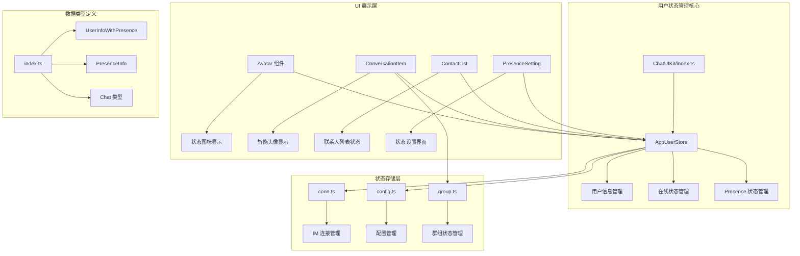
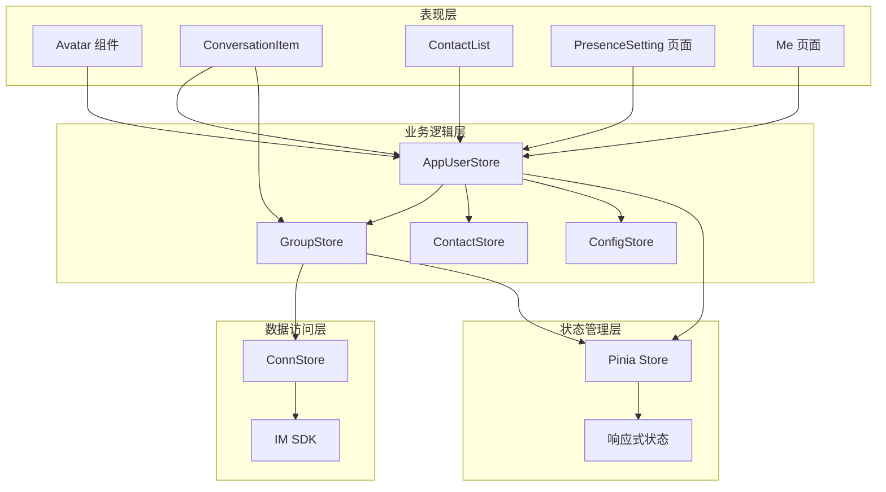
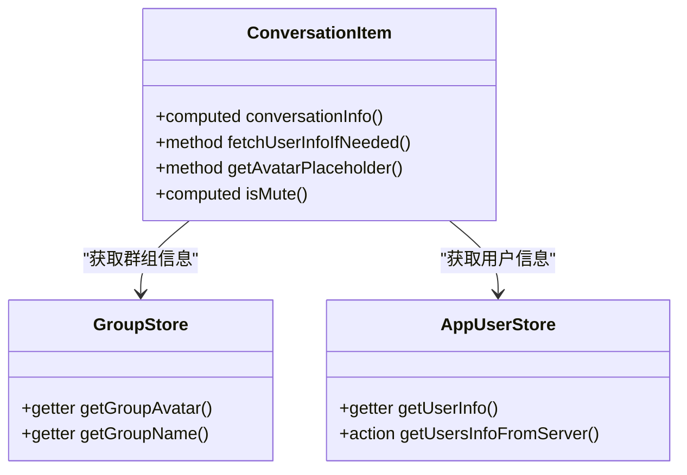
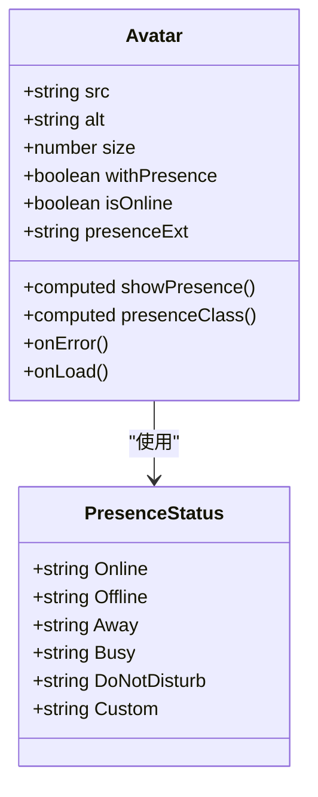
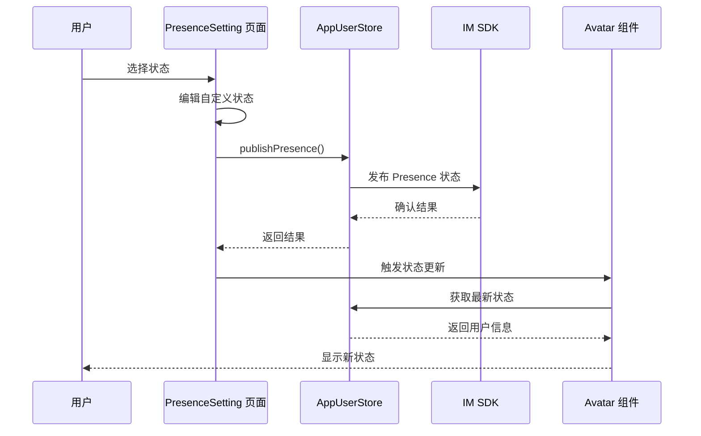
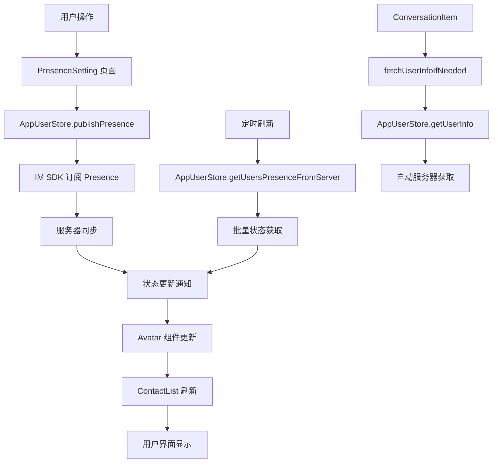
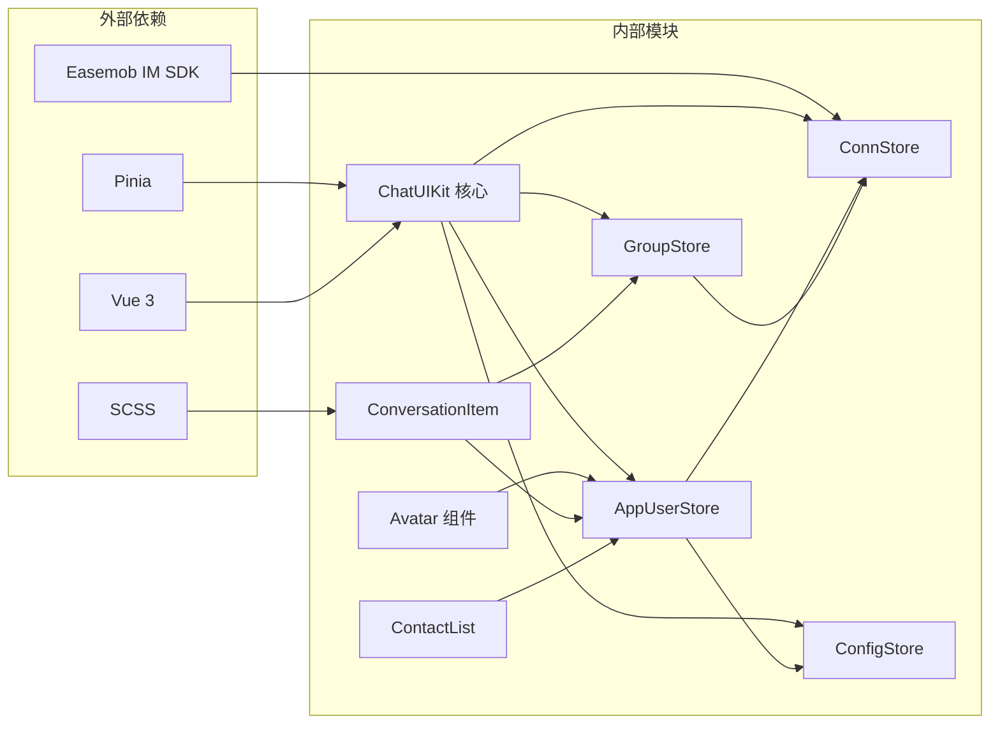

# 用户状态管理

<cite>
**本文档引用的文件**
- [ChatUIKit/index.ts](file://ChatUIKit/index.ts)
- [ChatUIKit/stores/appUser.ts](file://ChatUIKit/stores/appUser.ts)
- [ChatUIKit/stores/conn.ts](file://ChatUIKit/stores/conn.ts)
- [ChatUIKit/stores/config.ts](file://ChatUIKit/stores/config.ts)
- [ChatUIKit/stores/group.ts](file://ChatUIKit/stores/group.ts)
- [ChatUIKit/types/index.ts](file://ChatUIKit/types/index.ts)
- [ChatUIKit/const/index.ts](file://ChatUIKit/const/index.ts)
- [ChatUIKit/components/Avatar/index.vue](file://ChatUIKit/components/Avatar/index.vue)
- [ChatUIKit/modules/Conversation/components/ConversationItem/index.vue](file://ChatUIKit/modules/Conversation/components/ConversationItem/index.vue)
- [ChatUIKit/modules/Conversation/components/ConversationItem/style.scss](file://ChatUIKit/modules/Conversation/components/ConversationItem/style.scss)
- [ChatUIKit/modules/ContactList/index.vue](file://ChatUIKit/modules/ContactList/index.vue)
- [ChatUIKit/modules/ContactList/components/UserItem/index.vue](file://ChatUIKit/modules/ContactList/components/UserItem/index.vue)
- [demo/pages/PresenceSetting/index.vue](file://demo/pages/PresenceSetting/index.vue)
- [demo/pages/Me/index.vue](file://demo/pages/Me/index.vue)
- [demo/pages/Profile/index.vue](file://demo/pages/Profile/index.vue)
- [ChatUIKit/configType.ts](file://ChatUIKit/configType.ts)
</cite>

## 更新摘要
**所做更改**
- 新增会话项组件ConversationItem的增强头像显示逻辑分析
- 更新群组状态管理getter的字段兼容性和双重缓存机制说明
- 完善用户状态管理从userPresenceMap获取presence信息的getter逻辑
- 增强自动用户信息获取功能的实现细节

## 目录
1. [简介](#简介)
2. [项目结构](#项目结构)
3. [核心组件](#核心组件)
4. [架构概览](#架构概览)
5. [详细组件分析](#详细组件分析)
6. [依赖关系分析](#依赖关系分析)
7. [性能考虑](#性能考虑)
8. [故障排除指南](#故障排除指南)
9. [结论](#结论)

## 简介

用户状态管理是即时通讯应用中的重要功能模块，负责管理用户在线状态、个人资料和 Presence 信息。本项目基于 Easemob IM SDK 实现了完整的用户状态管理系统，包括状态订阅、发布、显示和管理等功能。

系统采用 Pinia 状态管理库，通过 Store 模式实现状态的集中管理和响应式更新。用户状态信息包括在线状态、自定义状态描述、头像等，支持实时更新和持久化存储。

**更新** 本次更新重点关注会话项组件的增强功能，包括智能头像回退机制、自动用户信息获取功能，以及群组状态管理的字段兼容性和双重缓存机制。

## 项目结构

用户状态管理功能主要分布在以下目录结构中：

**图表来源**
- [ChatUIKit/index.ts:18-132](file://ChatUIKit/index.ts#L18-L132)
- [ChatUIKit/stores/appUser.ts:24-241](file://ChatUIKit/stores/appUser.ts#L24-L241)
- [ChatUIKit/stores/group.ts:27-96](file://ChatUIKit/stores/group.ts#L27-L96)
- [ChatUIKit/components/Avatar/index.vue:1-188](file://ChatUIKit/components/Avatar/index.vue#L1-L188)

**章节来源**
- [ChatUIKit/index.ts:1-139](file://ChatUIKit/index.ts#L1-L139)
- [ChatUIKit/stores/appUser.ts:1-242](file://ChatUIKit/stores/appUser.ts#L1-L242)
- [ChatUIKit/stores/group.ts:1-317](file://ChatUIKit/stores/group.ts#L1-L317)

## 核心组件

### AppUserStore - 用户状态核心存储

AppUserStore 是用户状态管理的核心组件，负责管理用户信息和在线状态的存储、获取和更新。

**主要功能特性：**
- 用户信息缓存和管理
- 在线状态订阅和更新
- Presence 状态发布和订阅
- 用户信息服务器同步

**关键数据结构：**
- `userInfoMap`: 用户信息映射表
- `userPresenceMap`: 用户在线状态映射表

**更新** getter逻辑得到增强，现在提供更完善的用户信息合并功能，包括presence信息的自动获取和默认值处理。

**章节来源**
- [ChatUIKit/stores/appUser.ts:17-28](file://ChatUIKit/stores/appUser.ts#L17-L28)

### GroupStore - 群组状态管理

GroupStore 提供群组信息的管理功能，特别增强了头像和名称的获取逻辑。

**主要功能特性：**
- 群组列表和详细信息分离管理
- 头像获取的字段兼容性支持
- 名称获取的驼峰和下划线字段兼容
- 双重缓存机制

**增强功能：**
- `getGroupAvatar`: 支持 `avatarUrl` 和 `avatarurl` 字段
- `getGroupName`: 支持 `groupName` 和 `groupname` 字段
- 双重查找机制：先从 `groupInfoMap` 查找，再从 `groupList` 查找

**章节来源**
- [ChatUIKit/stores/group.ts:68-95](file://ChatUIKit/stores/group.ts#L68-L95)

### ChatUIKit - 应用入口管理器

ChatUIKit 作为应用的统一入口，提供全局状态管理和组件初始化功能。

**核心职责：**
- Pinia 状态管理器初始化
- 各个 Store 的延迟初始化
- IM SDK 连接管理
- 主题和功能配置管理

**章节来源**
- [ChatUIKit/index.ts:18-132](file://ChatUIKit/index.ts#L18-L132)

### 类型定义系统

系统提供了完整的 TypeScript 类型定义，确保类型安全和开发体验。

**核心类型：**
- `UserInfoWithPresence`: 包含用户信息和 Presence 状态的复合类型
- `PresenceInfo`: 在线状态信息接口
- `Chat.UpdateOwnUserInfoParams`: 用户信息更新参数

**章节来源**
- [ChatUIKit/types/index.ts:67-80](file://ChatUIKit/types/index.ts#L67-L80)

## 架构概览

用户状态管理采用分层架构设计，实现了清晰的关注点分离：

**图表来源**
- [ChatUIKit/stores/appUser.ts:24-241](file://ChatUIKit/stores/appUser.ts#L24-L241)
- [ChatUIKit/stores/group.ts:27-96](file://ChatUIKit/stores/group.ts#L27-L96)
- [ChatUIKit/stores/conn.ts:20-83](file://ChatUIKit/stores/conn.ts#L20-L83)
- [ChatUIKit/stores/config.ts:59-123](file://ChatUIKit/stores/config.ts#L59-L123)

## 详细组件分析

### 会话项组件 - 智能头像显示

#### ConversationItem 组件 - 增强的头像显示逻辑

ConversationItem 组件是会话列表的核心组件，最近增加了智能头像显示逻辑和自动用户信息获取功能。

**主要增强功能：**

**智能头像回退机制：**
- 群聊：优先使用群组头像，不存在时使用默认群组头像
- 单聊：优先使用用户头像，不存在时触发服务器获取

**自动用户信息获取：**
- 检测到用户信息缺失时自动触发服务器同步
- 支持条件性状态更新，避免不必要的网络请求

**增强的群组状态管理：**
- 使用 `getGroupAvatar` 和 `getGroupName` getter
- 支持字段兼容性（驼峰和下划线命名）
- 双重缓存机制确保数据一致性

**图表来源**
- [ChatUIKit/modules/Conversation/components/ConversationItem/index.vue:134-160](file://ChatUIKit/modules/Conversation/components/ConversationItem/index.vue#L134-L160)
- [ChatUIKit/stores/group.ts:68-95](file://ChatUIKit/stores/group.ts#L68-L95)
- [ChatUIKit/stores/appUser.ts:30-79](file://ChatUIKit/stores/appUser.ts#L30-L79)

**章节来源**
- [ChatUIKit/modules/Conversation/components/ConversationItem/index.vue:1-260](file://ChatUIKit/modules/Conversation/components/ConversationItem/index.vue#L1-L260)
- [ChatUIKit/modules/Conversation/components/ConversationItem/style.scss:1-152](file://ChatUIKit/modules/Conversation/components/ConversationItem/style.scss#L1-L152)

#### Avatar 组件 - 状态图标显示

Avatar 组件负责显示用户头像和在线状态图标，支持多种状态样式：

**状态样式支持：**
- Online - 在线状态
- Offline - 离线状态  
- Away - 离开状态
- Busy - 忙碌状态
- Do Not Disturb - 请勿打扰状态
- Custom - 自定义状态

**实现机制：**
- 通过 CSS 背景图片实现状态图标
- 支持响应式状态切换
- 集成头像加载错误处理

**图表来源**
- [ChatUIKit/components/Avatar/index.vue:29-78](file://ChatUIKit/components/Avatar/index.vue#L29-L78)

**章节来源**
- [ChatUIKit/components/Avatar/index.vue:1-188](file://ChatUIKit/components/Avatar/index.vue#L1-L188)

#### UserItem 组件 - 联系人状态显示

UserItem 组件在联系人列表中显示用户信息和状态：

**功能特性：**
- 用户头像和名称显示
- Presence 状态文本显示
- 滑动菜单支持
- 动态状态更新

**章节来源**
- [ChatUIKit/modules/ContactList/components/UserItem/index.vue:1-165](file://ChatUIKit/modules/ContactList/components/UserItem/index.vue#L1-L165)

### 状态管理流程

#### Presence 状态设置流程

**图表来源**
- [demo/pages/PresenceSetting/index.vue:136-147](file://demo/pages/PresenceSetting/index.vue#L136-L147)
- [ChatUIKit/stores/appUser.ts:187-193](file://ChatUIKit/stores/appUser.ts#L187-L193)

**章节来源**
- [demo/pages/PresenceSetting/index.vue:1-231](file://demo/pages/PresenceSetting/index.vue#L1-L231)

### 数据流分析

#### 用户状态数据流

**图表来源**
- [ChatUIKit/stores/appUser.ts:130-159](file://ChatUIKit/stores/appUser.ts#L130-L159)
- [ChatUIKit/stores/appUser.ts:164-182](file://ChatUIKit/stores/appUser.ts#L164-L182)
- [ChatUIKit/modules/Conversation/components/ConversationItem/index.vue:216-225](file://ChatUIKit/modules/Conversation/components/ConversationItem/index.vue#L216-L225)

**章节来源**
- [ChatUIKit/stores/appUser.ts:127-182](file://ChatUIKit/stores/appUser.ts#L127-L182)
- [ChatUIKit/modules/Conversation/components/ConversationItem/index.vue:1-260](file://ChatUIKit/modules/Conversation/components/ConversationItem/index.vue#L1-L260)

## 依赖关系分析

### 组件依赖图

**图表来源**
- [ChatUIKit/index.ts:1-139](file://ChatUIKit/index.ts#L1-L139)
- [ChatUIKit/stores/appUser.ts:1-242](file://ChatUIKit/stores/appUser.ts#L1-L242)
- [ChatUIKit/stores/group.ts:1-317](file://ChatUIKit/stores/group.ts#L1-L317)

### 状态管理依赖

系统采用 Pinia 作为状态管理库，实现了以下依赖关系：

**核心依赖：**
- Pinia - 状态管理核心
- Vue 3 - 响应式系统
- Easemob IM SDK - 即时通讯能力

**Store 间依赖：**
- AppUserStore 依赖 ConnStore 和 ConfigStore
- GroupStore 依赖 ConnStore 和 AppUserStore
- UI 组件依赖相关 Store 获取状态信息

**章节来源**
- [ChatUIKit/stores/appUser.ts:11-15](file://ChatUIKit/stores/appUser.ts#L11-L15)
- [ChatUIKit/stores/group.ts:10-14](file://ChatUIKit/stores/group.ts#L10-L14)
- [ChatUIKit/stores/conn.ts:10-13](file://ChatUIKit/stores/conn.ts#L10-L13)

## 性能考虑

### 缓存策略

系统实现了多层次的缓存机制以提升性能：

**本地缓存：**
- 用户信息缓存在 userInfoMap 中
- 在线状态缓存在 userPresenceMap 中
- 群组信息缓存在 groupInfoMap 和 groupList 中
- 避免重复的网络请求

**智能刷新：**
- 支持批量用户状态获取
- 定时刷新机制
- 条件性状态更新
- 双重查找机制减少重复查询

**响应式优化：**

**计算属性使用：**
- 使用 computed 优化状态计算
- 避免不必要的重新渲染
- 增量更新策略

**异步操作优化：**
- Promise 链式调用
- 错误处理和超时机制
- 并发请求控制

**更新** ConversationItem 组件使用 computed 替代 autorun，自动追踪依赖，无需手动管理订阅。

**章节来源**
- [ChatUIKit/modules/Conversation/components/ConversationItem/index.vue:126-132](file://ChatUIKit/modules/Conversation/components/ConversationItem/index.vue#L126-L132)

## 故障排除指南

### 常见问题及解决方案

**状态不更新问题：**
1. 检查 Presence 订阅是否正常
2. 验证用户 ID 格式正确性
3. 确认网络连接状态

**头像显示异常：**
1. 检查图片 URL 是否有效
2. 验证占位符图片是否存在
3. 确认图片加载错误处理

**状态图标不显示：**
1. 验证 Presence 功能是否启用
2. 检查 CSS 样式文件
3. 确认状态枚举值正确

**群组头像获取失败：**
1. 检查群组 ID 是否正确
2. 验证字段命名兼容性
3. 确认双重缓存机制正常工作

**自动用户信息获取问题：**
1. 检查用户 ID 格式
2. 验证服务器连接状态
3. 确认配置开关启用

**章节来源**
- [ChatUIKit/stores/appUser.ts:110-125](file://ChatUIKit/stores/appUser.ts#L110-L125)
- [ChatUIKit/stores/group.ts:71-80](file://ChatUIKit/stores/group.ts#L71-L80)
- [ChatUIKit/components/Avatar/index.vue:89-95](file://ChatUIKit/components/Avatar/index.vue#L89-L95)

### 调试建议

**开发环境调试：**
- 启用调试模式查看详细日志
- 使用浏览器开发者工具监控状态变化
- 验证 API 请求和响应

**生产环境监控：**
- 监控网络请求成功率
- 跟踪状态更新频率
- 分析内存使用情况

## 结论

用户状态管理模块通过合理的架构设计和组件划分，实现了功能完整、性能优良的状态管理解决方案。系统具备以下特点：

**技术优势：**
- 基于 Pinia 的现代化状态管理
- 完整的 TypeScript 类型支持
- 响应式 UI 组件集成
- 灵活的配置管理

**功能完整性：**
- 支持多种 Presence 状态
- 实时状态更新机制
- 用户友好的状态设置界面
- 完善的错误处理和恢复机制

**更新亮点：**
- ConversationItem 组件的智能头像显示逻辑
- 自动用户信息获取功能
- 群组状态管理的字段兼容性
- 双重缓存机制提升性能
- 增强的 getter 逻辑优化用户体验

该模块为即时通讯应用提供了可靠的基础功能，能够满足大多数应用场景的需求，并具有良好的扩展性和维护性。

**章节来源**
- [ChatUIKit/modules/Conversation/components/ConversationItem/index.vue:126-144](file://ChatUIKit/modules/Conversation/components/ConversationItem/index.vue#L126-L144)
- [ChatUIKit/stores/group.ts:68-95](file://ChatUIKit/stores/group.ts#L68-L95)
- [ChatUIKit/stores/appUser.ts:30-79](file://ChatUIKit/stores/appUser.ts#L30-L79)