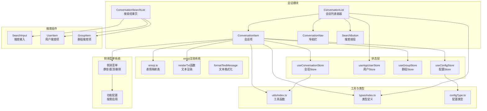
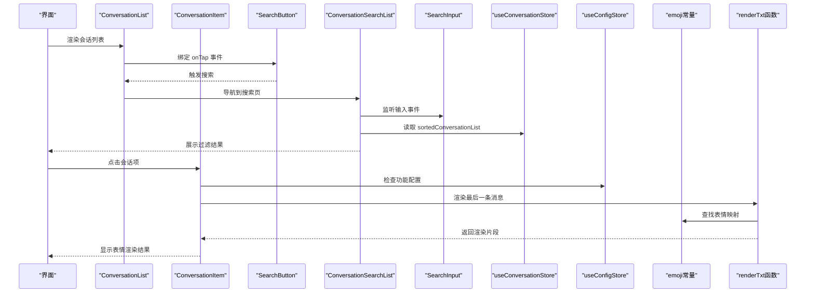
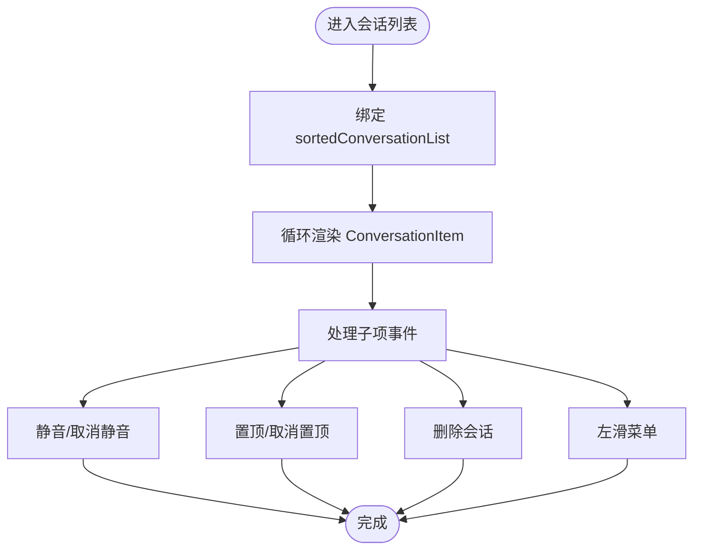
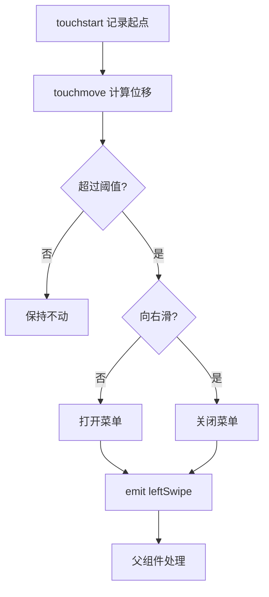
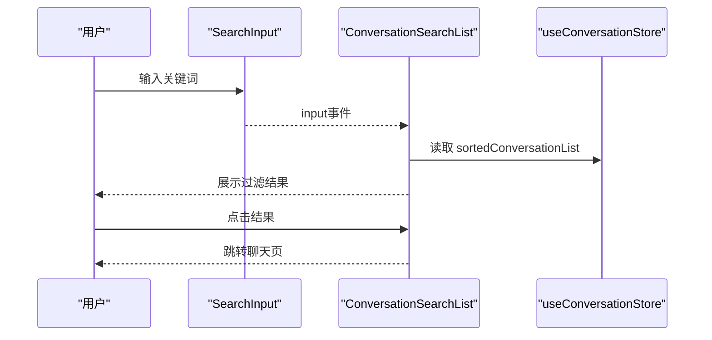
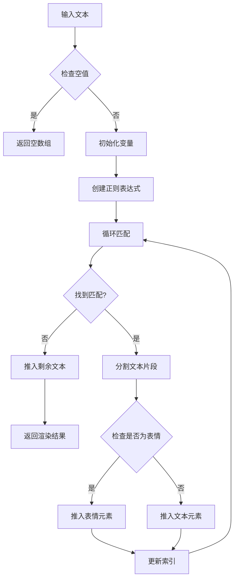
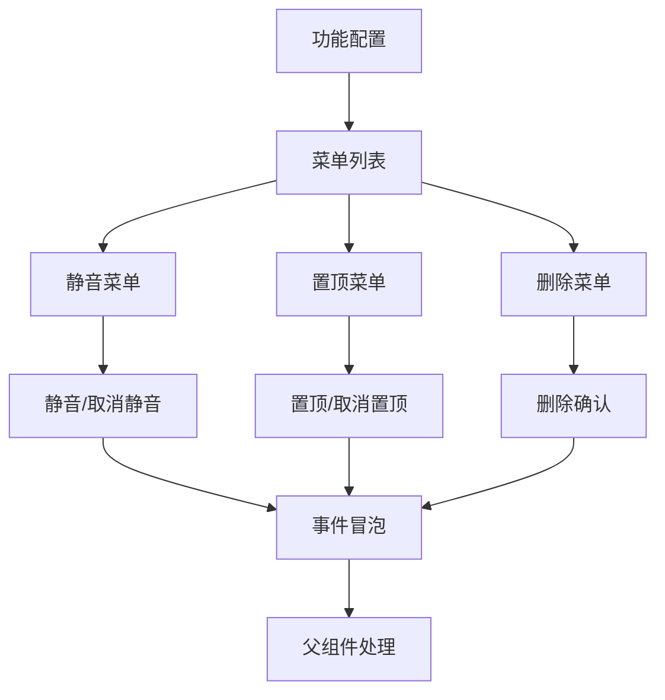
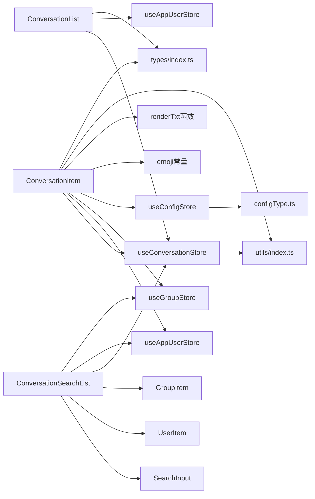
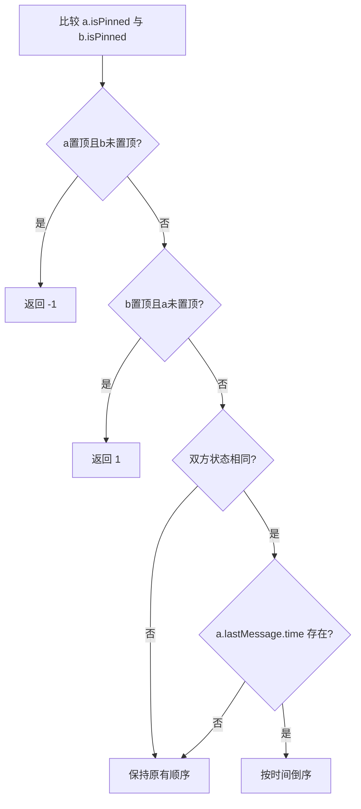

# 会话列表组件

<cite>
**本文档引用的文件**
- [ChatUIKit/modules/Conversation/components/ConversationList/index.vue](file://ChatUIKit/modules/Conversation/components/ConversationList/index.vue)
- [ChatUIKit/modules/Conversation/components/ConversationList/style.scss](file://ChatUIKit/modules/Conversation/components/ConversationList/style.scss)
- [ChatUIKit/modules/Conversation/components/ConversationItem/index.vue](file://ChatUIKit/modules/Conversation/components/ConversationItem/index.vue)
- [ChatUIKit/modules/Conversation/components/ConversationItem/style.scss](file://ChatUIKit/modules/Conversation/components/ConversationItem/style.scss)
- [ChatUIKit/modules/Conversation/components/ConversationNav/index.vue](file://ChatUIKit/modules/Conversation/components/ConversationNav/index.vue)
- [ChatUIKit/modules/ConversationSearchList/index.vue](file://ChatUIKit/modules/ConversationSearchList/index.vue)
- [ChatUIKit/components/SearchInput/index.vue](file://ChatUIKit/components/SearchInput/index.vue)
- [ChatUIKit/components/SearchButton/index.vue](file://ChatUIKit/components/SearchButton/index.vue)
- [ChatUIKit/modules/ContactList/components/UserItem/index.vue](file://ChatUIKit/modules/ContactList/components/UserItem/index.vue)
- [ChatUIKit/modules/GroupList/components/GroupItem/index.vue](file://ChatUIKit/modules/GroupList/components/GroupItem/index.vue)
- [ChatUIKit/stores/conversation.ts](file://ChatUIKit/stores/conversation.ts)
- [ChatUIKit/stores/config.ts](file://ChatUIKit/stores/config.ts)
- [ChatUIKit/utils/index.ts](file://ChatUIKit/utils/index.ts)
- [ChatUIKit/const/emoji.ts](file://ChatUIKit/const/emoji.ts)
- [ChatUIKit/types/index.ts](file://ChatUIKit/types/index.ts)
- [ChatUIKit/configType.ts](file://ChatUIKit/configType.ts)
</cite>

## 更新摘要
**所做更改**
- 新增完整的emoji渲染支持，包括Unicode字符和静态图片回退机制
- 增强侧滑菜单功能，支持静音、置顶、删除等操作
- 新增renderTxt函数处理emoji shortcode转换和文本渲染
- 改进会话项的消息显示，支持表情符号的动态渲染
- 完善功能配置系统，支持按需启用/禁用会话功能

## 目录
1. [简介](#简介)
2. [项目结构](#项目结构)
3. [核心组件](#核心组件)
4. [架构概览](#架构概览)
5. [详细组件分析](#详细组件分析)
6. [emoji渲染系统](#emoji渲染系统)
7. [侧滑菜单功能](#侧滑菜单功能)
8. [功能配置系统](#功能配置系统)
9. [依赖关系分析](#依赖关系分析)
10. [性能考虑](#性能考虑)
11. [故障排查指南](#故障排查指南)
12. [结论](#结论)
13. [附录](#附录)

## 简介
本文件面向会话列表组件的使用者与维护者，系统性阐述其架构设计、数据渲染机制、排序与过滤逻辑、与Store系统的交互、性能优化策略（含虚拟滚动建议）、内存管理、响应式布局与无障碍支持，并提供从入门到进阶的实践指南。

**更新** 新增完整的emoji渲染支持系统，包括Unicode字符识别、表情映射表管理和动态渲染机制。增强侧滑菜单功能，提供静音、置顶、删除等会话管理操作。完善功能配置系统，支持按需启用/禁用各项会话功能。

## 项目结构
会话列表由"页面容器 + 列表 + 会话项 + 导航 + 搜索 + emoji渲染"构成，采用组合式API与Pinia状态管理，配合工具函数与类型定义，形成清晰的职责分离与可维护性。



**图表来源**
- [ChatUIKit/modules/Conversation/components/ConversationList/index.vue](file://ChatUIKit/modules/Conversation/components/ConversationList/index.vue#L1-L158)
- [ChatUIKit/modules/Conversation/components/ConversationItem/index.vue](file://ChatUIKit/modules/Conversation/components/ConversationItem/index.vue#L1-L260)
- [ChatUIKit/modules/Conversation/components/ConversationNav/index.vue](file://ChatUIKit/modules/Conversation/components/ConversationNav/index.vue#L1-L159)
- [ChatUIKit/modules/ConversationSearchList/index.vue](file://ChatUIKit/modules/ConversationSearchList/index.vue#L1-L121)
- [ChatUIKit/components/SearchInput/index.vue](file://ChatUIKit/components/SearchInput/index.vue#L1-L126)
- [ChatUIKit/components/SearchButton/index.vue](file://ChatUIKit/components/SearchButton/index.vue#L1-L41)
- [ChatUIKit/modules/ContactList/components/UserItem/index.vue](file://ChatUIKit/modules/ContactList/components/UserItem/index.vue#L1-L165)
- [ChatUIKit/modules/GroupList/components/GroupItem/index.vue](file://ChatUIKit/modules/GroupList/components/GroupItem/index.vue#L1-L67)
- [ChatUIKit/stores/conversation.ts](file://ChatUIKit/stores/conversation.ts#L1-L421)
- [ChatUIKit/stores/config.ts](file://ChatUIKit/stores/config.ts#L1-L124)
- [ChatUIKit/utils/index.ts](file://ChatUIKit/utils/index.ts#L1-L344)
- [ChatUIKit/const/emoji.ts](file://ChatUIKit/const/emoji.ts#L1-L127)
- [ChatUIKit/types/index.ts](file://ChatUIKit/types/index.ts#L1-L100)
- [ChatUIKit/configType.ts](file://ChatUIKit/configType.ts#L1-L68)

**章节来源**
- [ChatUIKit/modules/Conversation/components/ConversationList/index.vue](file://ChatUIKit/modules/Conversation/components/ConversationList/index.vue#L1-L158)
- [ChatUIKit/modules/Conversation/components/ConversationItem/index.vue](file://ChatUIKit/modules/Conversation/components/ConversationItem/index.vue#L1-L260)
- [ChatUIKit/modules/Conversation/components/ConversationNav/index.vue](file://ChatUIKit/modules/Conversation/components/ConversationNav/index.vue#L1-L159)
- [ChatUIKit/modules/ConversationSearchList/index.vue](file://ChatUIKit/modules/ConversationSearchList/index.vue#L1-L121)
- [ChatUIKit/components/SearchInput/index.vue](file://ChatUIKit/components/SearchInput/index.vue#L1-L126)
- [ChatUIKit/components/SearchButton/index.vue](file://ChatUIKit/components/SearchButton/index.vue#L1-L41)
- [ChatUIKit/modules/ContactList/components/UserItem/index.vue](file://ChatUIKit/modules/ContactList/components/UserItem/index.vue#L1-L165)
- [ChatUIKit/modules/GroupList/components/GroupItem/index.vue](file://ChatUIKit/modules/GroupList/components/GroupItem/index.vue#L1-L67)
- [ChatUIKit/stores/conversation.ts](file://ChatUIKit/stores/conversation.ts#L1-L421)
- [ChatUIKit/stores/config.ts](file://ChatUIKit/stores/config.ts#L1-L124)
- [ChatUIKit/utils/index.ts](file://ChatUIKit/utils/index.ts#L1-L344)
- [ChatUIKit/const/emoji.ts](file://ChatUIKit/const/emoji.ts#L1-L127)
- [ChatUIKit/types/index.ts](file://ChatUIKit/types/index.ts#L1-L100)
- [ChatUIKit/configType.ts](file://ChatUIKit/configType.ts#L1-L68)

## 核心组件
- 会话列表容器：负责渲染会话项、处理滑动菜单、路由跳转、空态展示与头部占位。
- 会话项：负责单条会话的UI渲染、免打扰徽标、@提醒标签、最后一条消息格式化、滑动手势与菜单操作。
- 导航栏：集成用户头像、在线状态、菜单弹窗与跳转入口。
- 搜索功能：提供完整的搜索解决方案，包括搜索输入、过滤逻辑、结果展示和交互处理。
- **新增** emoji渲染系统：提供Unicode字符识别、表情映射表管理和动态渲染机制。
- **新增** 侧滑菜单系统：支持静音、置顶、删除等会话管理操作，基于功能配置动态启用。
- Store：集中管理会话列表、置顶、免打扰、分页、时间格式化等状态与动作。

**更新** 新增emoji渲染系统和侧滑菜单功能，提供完整的会话管理体验。

**章节来源**
- [ChatUIKit/modules/Conversation/components/ConversationList/index.vue](file://ChatUIKit/modules/Conversation/components/ConversationList/index.vue#L1-L158)
- [ChatUIKit/modules/Conversation/components/ConversationItem/index.vue](file://ChatUIKit/modules/Conversation/components/ConversationItem/index.vue#L1-L260)
- [ChatUIKit/modules/Conversation/components/ConversationNav/index.vue](file://ChatUIKit/modules/Conversation/components/ConversationNav/index.vue#L1-L159)
- [ChatUIKit/modules/ConversationSearchList/index.vue](file://ChatUIKit/modules/ConversationSearchList/index.vue#L1-L121)
- [ChatUIKit/components/SearchInput/index.vue](file://ChatUIKit/components/SearchInput/index.vue#L1-L126)
- [ChatUIKit/components/SearchButton/index.vue](file://ChatUIKit/components/SearchButton/index.vue#L1-L41)
- [ChatUIKit/modules/ContactList/components/UserItem/index.vue](file://ChatUIKit/modules/ContactList/components/UserItem/index.vue#L1-L165)
- [ChatUIKit/modules/GroupList/components/GroupItem/index.vue](file://ChatUIKit/modules/GroupList/components/GroupItem/index.vue#L1-L67)
- [ChatUIKit/stores/conversation.ts](file://ChatUIKit/stores/conversation.ts#L1-L421)
- [ChatUIKit/stores/config.ts](file://ChatUIKit/stores/config.ts#L1-L124)
- [ChatUIKit/utils/index.ts](file://ChatUIKit/utils/index.ts#L1-L344)
- [ChatUIKit/const/emoji.ts](file://ChatUIKit/const/emoji.ts#L1-L127)

## 架构概览
会话列表采用"容器组件 + 展示组件 + Store + 工具函数 + emoji渲染系统"的分层架构。容器组件通过computed引用Store状态，避免深拷贝与手动订阅；展示组件内部通过computed与事件向上冒泡，减少重复渲染；Store提供统一的数据源与动作，工具函数封装通用逻辑。



**图表来源**
- [ChatUIKit/modules/Conversation/components/ConversationList/index.vue](file://ChatUIKit/modules/Conversation/components/ConversationList/index.vue#L99-L103)
- [ChatUIKit/modules/ConversationSearchList/index.vue](file://ChatUIKit/modules/ConversationSearchList/index.vue#L53-L88)
- [ChatUIKit/components/SearchInput/index.vue](file://ChatUIKit/components/SearchInput/index.vue#L45-L56)
- [ChatUIKit/modules/Conversation/components/ConversationItem/index.vue](file://ChatUIKit/modules/Conversation/components/ConversationItem/index.vue#L40-L60)
- [ChatUIKit/utils/index.ts](file://ChatUIKit/utils/index.ts#L226-L265)
- [ChatUIKit/const/emoji.ts](file://ChatUIKit/const/emoji.ts#L55-L109)

**章节来源**
- [ChatUIKit/modules/Conversation/components/ConversationList/index.vue](file://ChatUIKit/modules/Conversation/components/ConversationList/index.vue#L99-L103)
- [ChatUIKit/modules/Conversation/components/ConversationItem/index.vue](file://ChatUIKit/modules/Conversation/components/ConversationItem/index.vue#L94-L255)
- [ChatUIKit/modules/ConversationSearchList/index.vue](file://ChatUIKit/modules/ConversationSearchList/index.vue#L53-L88)
- [ChatUIKit/components/SearchInput/index.vue](file://ChatUIKit/components/SearchInput/index.vue#L45-L56)
- [ChatUIKit/stores/conversation.ts](file://ChatUIKit/stores/conversation.ts#L49-L98)
- [ChatUIKit/stores/config.ts](file://ChatUIKit/stores/config.ts#L59-L74)
- [ChatUIKit/utils/index.ts](file://ChatUIKit/utils/index.ts#L226-L265)
- [ChatUIKit/const/emoji.ts](file://ChatUIKit/const/emoji.ts#L55-L109)

## 详细组件分析

### 会话列表容器（ConversationList）
- 数据绑定：通过computed直接引用Store的sortedConversationList，避免深拷贝与手动订阅。
- 事件处理：监听会话项的静音、置顶、删除与左滑事件，统一委托给Store执行。
- 布局与占位：根据平台动态设置头部占位高度，保证导航不被滚动遮挡。
- 空态：当会话列表为空时渲染Empty组件。
- 搜索集成：通过SearchButton组件提供搜索入口，绑定onTap事件触发搜索流程。



**图表来源**
- [ChatUIKit/modules/Conversation/components/ConversationList/index.vue](file://ChatUIKit/modules/Conversation/components/ConversationList/index.vue#L33-L106)

**章节来源**
- [ChatUIKit/modules/Conversation/components/ConversationList/index.vue](file://ChatUIKit/modules/Conversation/components/ConversationList/index.vue#L1-L158)
- [ChatUIKit/modules/Conversation/components/ConversationList/style.scss](file://ChatUIKit/modules/Conversation/components/ConversationList/style.scss#L1-L28)

### 会话项（ConversationItem）
- 渲染逻辑：根据会话类型选择用户或群组信息，格式化最后一条消息，显示免打扰徽标与未读数。
- **更新** emoji渲染：使用renderTxt函数将文本消息中的Unicode表情转换为图片，支持静态图片回退。
- 滑动手势：记录起点坐标，根据移动距离决定菜单展开或关闭；仅在允许的功能开关下显示菜单。
- 功能菜单：根据配置动态生成静音/取消静音、置顶/取消置顶、删除确认等菜单项。
- 事件冒泡：将菜单点击事件以自定义事件形式向上抛出，交由父组件处理。



**图表来源**
- [ChatUIKit/modules/Conversation/components/ConversationItem/index.vue](file://ChatUIKit/modules/Conversation/components/ConversationItem/index.vue#L232-L251)

**章节来源**
- [ChatUIKit/modules/Conversation/components/ConversationItem/index.vue](file://ChatUIKit/modules/Conversation/components/ConversationItem/index.vue#L1-L260)
- [ChatUIKit/modules/Conversation/components/ConversationItem/style.scss](file://ChatUIKit/modules/Conversation/components/ConversationItem/style.scss#L1-L152)

### 导航栏（ConversationNav）
- 用户信息：通过computed读取当前用户信息，包含头像、在线状态与扩展字段。
- 菜单弹窗：根据平台差异调整弹窗位置；支持新建会话、加好友、建群等入口。
- 无障碍：头像组件支持在线状态与存在性占位，提升可访问性。

**章节来源**
- [ChatUIKit/modules/Conversation/components/ConversationNav/index.vue](file://ChatUIKit/modules/Conversation/components/ConversationNav/index.vue#L1-L159)

### 搜索功能（ConversationSearchList）
- 输入与过滤：监听SearchInput组件的input事件，基于已排序的会话列表进行过滤；单聊匹配用户昵称，群聊匹配群名称。
- 结果展示：根据会话类型动态渲染UserItem或GroupItem组件，提供用户友好的搜索结果展示。
- 交互处理：支持取消搜索、返回上一页、点击结果跳转聊天页等功能。
- 空态处理：当没有搜索结果时显示Empty组件。



**图表来源**
- [ChatUIKit/modules/ConversationSearchList/index.vue](file://ChatUIKit/modules/ConversationSearchList/index.vue#L57-L72)

**章节来源**
- [ChatUIKit/modules/ConversationSearchList/index.vue](file://ChatUIKit/modules/ConversationSearchList/index.vue#L1-L121)
- [ChatUIKit/components/SearchInput/index.vue](file://ChatUIKit/components/SearchInput/index.vue#L1-L126)
- [ChatUIKit/modules/ContactList/components/UserItem/index.vue](file://ChatUIKit/modules/ContactList/components/UserItem/index.vue#L1-L165)
- [ChatUIKit/modules/GroupList/components/GroupItem/index.vue](file://ChatUIKit/modules/GroupList/components/GroupItem/index.vue#L1-L67)

### 搜索输入组件（SearchInput）
- 输入处理：支持v-model双向绑定，实时监听输入变化，触发input事件。
- 清除功能：当有输入内容时显示清除按钮，点击后清空输入并触发input事件。
- 取消功能：支持显示取消按钮，点击后触发cancel事件。
- 焦点管理：自动聚焦到输入框，支持焦点状态切换。
- 暴露API：提供setIsFocus方法供外部控制焦点状态。

**章节来源**
- [ChatUIKit/components/SearchInput/index.vue](file://ChatUIKit/components/SearchInput/index.vue#L1-L126)

### 搜索按钮组件（SearchButton）
- 基础功能：提供搜索图标和占位符文本，作为搜索入口按钮。
- 事件处理：支持onTap事件，用于触发搜索流程。
- 样式设计：采用圆角矩形样式，提供视觉反馈。

**章节来源**
- [ChatUIKit/components/SearchButton/index.vue](file://ChatUIKit/components/SearchButton/index.vue#L1-L41)

### 搜索结果显示组件
#### 用户搜索项（UserItem）
- 用户信息展示：显示用户头像、昵称和在线状态（可选）。
- 交互功能：支持点击事件，提供删除好友功能。
- 滑动手势：支持左滑显示删除菜单，右滑隐藏菜单。
- 状态管理：通过showPresence计算属性控制在线状态显示。

#### 群组搜索项（GroupItem）
- 群组信息展示：显示群组头像和群组名称。
- 兼容性处理：支持多种属性命名方式（groupId/groupid、groupName/groupname、avatar/avatarurl）。
- 交互功能：支持点击事件，触发群组选择。

**章节来源**
- [ChatUIKit/modules/ContactList/components/UserItem/index.vue](file://ChatUIKit/modules/ContactList/components/UserItem/index.vue#L1-L165)
- [ChatUIKit/modules/GroupList/components/GroupItem/index.vue](file://ChatUIKit/modules/GroupList/components/GroupItem/index.vue#L1-L67)

### Store系统交互（useConversationStore）
- 排序：通过computed对会话列表按"置顶优先、时间倒序"进行排序。
- 分页：提供分页参数与置顶会话分页参数，支持增量拉取。
- 动作：置顶/取消置顶、设置免打扰、删除会话、标记已读、更新最后一条消息等。
- 同步：与连接Store协作，调用SDK接口完成服务端同步。

```mermaid
classDiagram
class ConversationStore {
+conversationList : UIKITConversationItem[]
+currConversation : ConversationBaseInfo
+muteConvsMap : Record<string, boolean>
+pageParams : {pageSize, cursor}
+pinParams : {pageSize, cursor}
+totalUnreadCount() : number
+sortedConversationList() : UIKITConversationItem[]
+getConversationById(id) : UIKITConversationItem
+getConversationMuteStatus(id) : boolean
+getCurrentConversationId() : string
+getConversationTime(message) : string
+getCvsIdFromMessage(msg) : string
+setCurrentConversation(conv)
+getConversationList(cursor?)
+getServerPinnedConversations(cursor?)
+mergeConversations(list)
+pinConversation(conv, isPinned)
+setSilentModeForConversation(conv, isMute)
+deleteConversation(conv)
+markConversationRead(conv)
+updateConversationLastMessage(conv, msg, unread)
+moveConversationTop(conv)
+createConversation(conv, msg, unread) : UIKITConversationItem
+setAtTypeByMessage(msg)
+clear()
}
```

**图表来源**
- [ChatUIKit/stores/conversation.ts](file://ChatUIKit/stores/conversation.ts#L27-L421)

**章节来源**
- [ChatUIKit/stores/conversation.ts](file://ChatUIKit/stores/conversation.ts#L1-L421)

### 工具函数与类型
- 排序算法：sortByPinned实现"置顶优先、时间倒序"，兼容无时间场景。
- 时间格式化：getTimeStringAutoShort提供人性化时间显示。
- **新增** 文本渲染：renderTxt将富文本拆分为文本与表情片段，支持Unicode字符识别和静态图片回退。
- **新增** 文本格式化：formatTextMessage统一消息摘要，支持表情shortcode转换。
- 类型定义：UIKITConversationItem扩展原生会话类型，补充atType等字段。

**章节来源**
- [ChatUIKit/utils/index.ts](file://ChatUIKit/utils/index.ts#L184-L197)
- [ChatUIKit/utils/index.ts](file://ChatUIKit/utils/index.ts#L31-L78)
- [ChatUIKit/utils/index.ts](file://ChatUIKit/utils/index.ts#L226-L265)
- [ChatUIKit/utils/index.ts](file://ChatUIKit/utils/index.ts#L200-L224)
- [ChatUIKit/types/index.ts](file://ChatUIKit/types/index.ts#L63-L65)

## emoji渲染系统

### renderTxt函数详解
renderTxt是emoji渲染系统的核心函数，负责将文本消息中的表情符号转换为可显示的图片元素。



**图表来源**
- [ChatUIKit/utils/index.ts](file://ChatUIKit/utils/index.ts#L226-L265)

### 表情映射表（emoji.map）
系统内置了完整的表情映射表，支持52种常用表情符号，包括Unicode字符和对应的静态图片资源。

**章节来源**
- [ChatUIKit/utils/index.ts](file://ChatUIKit/utils/index.ts#L226-L265)
- [ChatUIKit/const/emoji.ts](file://ChatUIKit/const/emoji.ts#L55-L109)

### 文本格式化系统
系统提供两种文本处理方式：
- **renderTxt**：用于会话列表中的消息预览渲染
- **formatTextMessage**：用于消息发送前的表情转换

**章节来源**
- [ChatUIKit/utils/index.ts](file://ChatUIKit/utils/index.ts#L226-L265)
- [ChatUIKit/utils/index.ts](file://ChatUIKit/utils/index.ts#L200-L224)

## 侧滑菜单功能

### 菜单系统架构
会话项的侧滑菜单系统基于功能配置动态生成，支持静音、置顶、删除等操作。



**图表来源**
- [ChatUIKit/modules/Conversation/components/ConversationItem/index.vue](file://ChatUIKit/modules/Conversation/components/ConversationItem/index.vue#L154-L180)

### 滑动手势处理
侧滑菜单通过touch事件实现，具有以下特点：
- **阈值检测**：移动距离超过60px才触发菜单展开
- **方向判断**：向右滑动关闭菜单，向左滑动打开菜单
- **状态管理**：使用isTapDelete状态控制删除确认菜单

**章节来源**
- [ChatUIKit/modules/Conversation/components/ConversationItem/index.vue](file://ChatUIKit/modules/Conversation/components/ConversationItem/index.vue#L232-L251)

## 功能配置系统

### 配置类型定义
系统通过FeatureConfig接口定义所有可配置的功能选项，包括会话管理、消息操作、输入功能等。

**章节来源**
- [ChatUIKit/configType.ts](file://ChatUIKit/configType.ts#L3-L40)
- [ChatUIKit/stores/config.ts](file://ChatUIKit/stores/config.ts#L24-L57)

### 默认配置
系统提供完整的默认配置，所有功能默认开启，确保基本使用体验。

**章节来源**
- [ChatUIKit/stores/config.ts](file://ChatUIKit/stores/config.ts#L24-L57)

### 动态配置管理
通过ConfigStore提供动态配置管理能力：
- **hideFeature**：隐藏指定功能
- **showFeature**：显示指定功能
- **setFeatureConfig**：批量设置配置
- **reset**：重置为默认配置

**章节来源**
- [ChatUIKit/stores/config.ts](file://ChatUIKit/stores/config.ts#L82-L122)

## 依赖关系分析
- 组件耦合：列表容器与会话项通过props与事件解耦；导航与搜索独立于列表容器，通过路由与Store交互。
- Store依赖：会话项依赖会话Store与用户/群组Store；列表容器依赖会话Store与应用用户Store。
- 工具依赖：会话项与列表均依赖工具函数进行时间格式化与文本渲染。
- **新增** emoji依赖：会话项依赖emoji常量和renderTxt函数进行表情渲染。
- **新增** 配置依赖：会话项依赖ConfigStore进行功能配置检查。
- 外部依赖：SDK连接Store用于与服务端同步数据。



**图表来源**
- [ChatUIKit/modules/Conversation/components/ConversationList/index.vue](file://ChatUIKit/modules/Conversation/components/ConversationList/index.vue#L34-L45)
- [ChatUIKit/modules/Conversation/components/ConversationItem/index.vue](file://ChatUIKit/modules/Conversation/components/ConversationItem/index.vue#L98-L124)
- [ChatUIKit/modules/ConversationSearchList/index.vue](file://ChatUIKit/modules/ConversationSearchList/index.vue#L36-L42)
- [ChatUIKit/stores/conversation.ts](file://ChatUIKit/stores/conversation.ts#L19-L25)
- [ChatUIKit/stores/config.ts](file://ChatUIKit/stores/config.ts#L59-L74)
- [ChatUIKit/utils/index.ts](file://ChatUIKit/utils/index.ts#L1-L344)
- [ChatUIKit/types/index.ts](file://ChatUIKit/types/index.ts#L1-L100)
- [ChatUIKit/configType.ts](file://ChatUIKit/configType.ts#L1-L68)

**章节来源**
- [ChatUIKit/modules/Conversation/components/ConversationList/index.vue](file://ChatUIKit/modules/Conversation/components/ConversationList/index.vue#L34-L45)
- [ChatUIKit/modules/Conversation/components/ConversationItem/index.vue](file://ChatUIKit/modules/Conversation/components/ConversationItem/index.vue#L98-L124)
- [ChatUIKit/modules/ConversationSearchList/index.vue](file://ChatUIKit/modules/ConversationSearchList/index.vue#L36-L42)
- [ChatUIKit/stores/conversation.ts](file://ChatUIKit/stores/conversation.ts#L19-L25)
- [ChatUIKit/stores/config.ts](file://ChatUIKit/stores/config.ts#L59-L74)

## 性能考虑
- 响应式优化
  - 使用computed引用Store状态，避免深拷贝与手动订阅，降低重渲染成本。
  - 会话项内部使用computed追踪依赖，自动失效与更新，减少不必要的计算。
- 渲染优化
  - 列表容器通过v-for直接遍历sortedConversationList，确保最小化DOM变更。
  - 会话项内部仅在必要时重新计算，如免打扰状态、头像与名称等。
  - **新增** emoji渲染优化：renderTxt函数使用正则表达式一次性匹配，避免多次DOM操作。
- 事件节流
  - 工具函数提供throttle，可用于高频事件（如滚动）的节流处理，建议在长列表场景引入。
- 虚拟滚动建议
  - 当前实现为常规滚动。对于超大列表，建议引入虚拟滚动（例如基于可视区域的窗口化渲染），仅渲染可见区域内的会话项，显著降低DOM数量与重绘开销。
- 内存管理
  - Store清理：提供clear方法清空会话列表、当前会话与分页参数，便于退出场景释放内存。
  - 会话项销毁：组件内无复杂定时器或全局订阅，卸载时无需额外清理。
  - **新增** emoji资源管理：表情图片资源通过静态导入，避免运行时动态加载开销。
- 分页加载
  - Store提供分页参数与置顶会话分页参数，支持增量拉取；建议结合上拉触底事件实现无限滚动。
- 搜索过滤
  - 过滤在客户端进行，建议对超大列表增加防抖与索引优化，避免频繁全量匹配。
  - 搜索结果组件采用条件渲染，仅渲染匹配的结果，减少DOM节点数量。
- **新增** 功能配置优化
  - 通过ConfigStore的getFeatureConfig计算属性，避免重复读取配置，提升性能。

**更新** 新增emoji渲染系统和功能配置系统的性能优化建议。

**章节来源**
- [ChatUIKit/modules/Conversation/components/ConversationList/index.vue](file://ChatUIKit/modules/Conversation/components/ConversationList/index.vue#L47-L53)
- [ChatUIKit/modules/Conversation/components/ConversationItem/index.vue](file://ChatUIKit/modules/Conversation/components/ConversationItem/index.vue#L126-L132)
- [ChatUIKit/modules/ConversationSearchList/index.vue](file://ChatUIKit/modules/ConversationSearchList/index.vue#L57-L72)
- [ChatUIKit/stores/conversation.ts](file://ChatUIKit/stores/conversation.ts#L412-L418)
- [ChatUIKit/stores/config.ts](file://ChatUIKit/stores/config.ts#L65-L74)
- [ChatUIKit/utils/index.ts](file://ChatUIKit/utils/index.ts#L107-L134)

## 故障排查指南
- 会话列表不更新
  - 检查Store动作是否正确调用（置顶、静音、删除、更新最后一条消息）。
  - 确认computed依赖是否正确追踪（如免打扰状态、头像与名称）。
- 消息时间显示异常
  - 检查时间戳格式与getTimeStringAutoShort的入参。
- 搜索无结果
  - 确认sortedConversationList是否已填充；检查过滤条件（单聊昵称 vs 群名称）。
  - 验证SearchInput组件的input事件是否正确触发。
  - 检查UserItem和GroupItem组件的渲染逻辑。
- 滑动菜单不生效
  - 确认功能开关与设备平台差异；检查阈值与位移计算逻辑。
  - **新增** 检查ConfigStore中的功能配置是否正确。
- **新增** emoji渲染问题
  - 检查renderTxt函数是否正确调用。
  - 确认emoji.map中是否存在对应的表情映射。
  - 验证表情图片资源是否正确导入。
- **新增** 功能配置问题
  - 确认ConfigStore的getFeatureConfig计算属性是否正确返回配置。
  - 检查hideFeature和showFeature方法是否正确执行。
- 事件绑定问题
  - 确认SearchButton组件使用onTap事件而非tap事件。
  - 检查SearchInput组件的事件冒泡是否正常。
- 错误日志
  - Store动作包含logger输出，可在控制台查看失败原因与堆栈。

**更新** 新增emoji渲染和功能配置相关的故障排查指导。

**章节来源**
- [ChatUIKit/stores/conversation.ts](file://ChatUIKit/stores/conversation.ts#L126-L160)
- [ChatUIKit/stores/conversation.ts](file://ChatUIKit/stores/conversation.ts#L165-L189)
- [ChatUIKit/stores/conversation.ts](file://ChatUIKit/stores/conversation.ts#L218-L241)
- [ChatUIKit/stores/conversation.ts](file://ChatUIKit/stores/conversation.ts#L246-L276)
- [ChatUIKit/stores/conversation.ts](file://ChatUIKit/stores/conversation.ts#L281-L309)
- [ChatUIKit/utils/index.ts](file://ChatUIKit/utils/index.ts#L31-L78)
- [ChatUIKit/stores/config.ts](file://ChatUIKit/stores/config.ts#L65-L74)

## 结论
会话列表组件通过清晰的分层设计与Pinia状态管理，实现了高性能、低耦合的会话浏览体验。排序、过滤、分页与交互均在Store与工具函数中集中处理，便于维护与扩展。新增的完整emoji渲染系统提供了丰富的表情支持，包括Unicode字符识别和静态图片回退机制。增强的侧滑菜单功能提供了完整的会话管理能力，基于功能配置系统实现了灵活的按需启用。完善的搜索功能进一步提升了用户体验，包括搜索输入、过滤逻辑、结果展示和交互处理。针对大规模数据，建议引入虚拟滚动与搜索索引等优化手段，进一步提升性能与用户体验。

**更新** 新增的emoji渲染系统和侧滑菜单功能完善了会话列表的用户体验，提供了更加丰富和便捷的会话管理方式。

## 附录

### 排序算法详解（置顶优先、时间倒序）
- 置顶优先：若一方置顶而另一方未置顶，则置顶者排在前面。
- 时间倒序：若双方均置顶或均未置顶，则按最后一条消息时间倒序排列。
- 兼容性：当某条会话无最后一条消息时间时，保持原有顺序不变。



**图表来源**
- [ChatUIKit/utils/index.ts](file://ChatUIKit/utils/index.ts#L184-L197)

**章节来源**
- [ChatUIKit/utils/index.ts](file://ChatUIKit/utils/index.ts#L184-L197)

### emoji渲染系统API参考
- **renderTxt函数**
  - 参数：txt: string | undefined | null
  - 返回：Array<{type: string, value: string, alt?: string}>
  - 功能：将文本中的Unicode表情转换为表情元素
- **formatTextMessage函数**
  - 参数：txt: string
  - 返回：string
  - 功能：将输入框中的表情shortcode转换为Unicode字符
- **emoji常量**
  - map: Record<string, {alt: string, url: string}>
  - 功能：提供表情映射表和静态图片资源

**章节来源**
- [ChatUIKit/utils/index.ts](file://ChatUIKit/utils/index.ts#L226-L265)
- [ChatUIKit/utils/index.ts](file://ChatUIKit/utils/index.ts#L200-L224)
- [ChatUIKit/const/emoji.ts](file://ChatUIKit/const/emoji.ts#L55-L109)

### 侧滑菜单功能API参考
- **事件**
  - mute: 静音/取消静音
  - pin: 置顶/取消置顶
  - delete: 删除会话
  - leftSwipe: 左滑事件
- **属性**
  - conversation: UIKITConversationItem
  - showMenu: boolean
- **功能配置**
  - muteConversation: boolean
  - pinConversation: boolean
  - deleteConversation: boolean

**章节来源**
- [ChatUIKit/modules/Conversation/components/ConversationItem/index.vue](file://ChatUIKit/modules/Conversation/components/ConversationItem/index.vue#L113-L113)
- [ChatUIKit/stores/config.ts](file://ChatUIKit/stores/config.ts#L24-L57)
- [ChatUIKit/configType.ts](file://ChatUIKit/configType.ts#L3-L40)

### 组件使用指南（入门到进阶）
- 入门
  - 在页面中直接引入ConversationList组件即可展示会话列表。
  - 通过SearchButton进入ConversationSearchList进行搜索过滤。
  - SearchButton组件使用onTap事件而非tap事件。
- 进阶
  - **新增** emoji配置：通过ConfigStore.hideFeature和showFeature控制表情功能。
  - **新增** 侧滑菜单：根据功能配置动态启用静音、置顶、删除菜单。
  - 自定义菜单：通过配置Store的特性开关控制菜单项显示。
  - 扩展排序：在Store的sortedConversationList中加入新的排序维度。
  - 性能优化：在超大列表场景引入虚拟滚动与搜索索引。
  - 错误处理：利用Store动作的日志输出定位问题。
  - 搜索优化：在大量会话场景下，考虑添加搜索防抖和索引优化。

**更新** 新增emoji渲染系统和侧滑菜单功能的使用指导和性能优化建议。

**章节来源**
- [ChatUIKit/modules/Conversation/components/ConversationList/index.vue](file://ChatUIKit/modules/Conversation/components/ConversationList/index.vue#L6-L25)
- [ChatUIKit/modules/ConversationSearchList/index.vue](file://ChatUIKit/modules/ConversationSearchList/index.vue#L53-L72)
- [ChatUIKit/stores/conversation.ts](file://ChatUIKit/stores/conversation.ts#L49-L66)
- [ChatUIKit/components/SearchButton/index.vue](file://ChatUIKit/components/SearchButton/index.vue#L1-L41)
- [ChatUIKit/stores/config.ts](file://ChatUIKit/stores/config.ts#L82-L122)

### 搜索功能API参考
- SearchInput组件
  - 事件：input、cancel
  - 属性：placeholder（字符串，默认""）、showCancel（布尔，默认false）
  - 方法：setIsFocus(focus: boolean)
- SearchButton组件
  - 事件：onTap
  - 属性：placeholder（字符串，可选）
- UserItem组件
  - 事件：onTap、onDelete、onSwipe
  - 属性：user（对象）、showMenu（布尔，默认false）
- GroupItem组件
  - 事件：onTap
  - 属性：group（对象）

**章节来源**
- [ChatUIKit/components/SearchInput/index.vue](file://ChatUIKit/components/SearchInput/index.vue#L28-L41)
- [ChatUIKit/components/SearchButton/index.vue](file://ChatUIKit/components/SearchButton/index.vue#L10-L16)
- [ChatUIKit/modules/ContactList/components/UserItem/index.vue](file://ChatUIKit/modules/ContactList/components/UserItem/index.vue#L30-L53)
- [ChatUIKit/modules/GroupList/components/GroupItem/index.vue](file://ChatUIKit/modules/GroupList/components/GroupItem/index.vue#L14-L46)