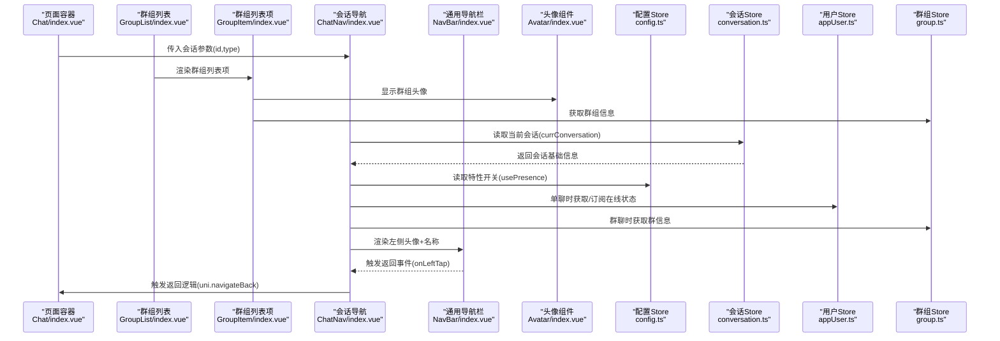
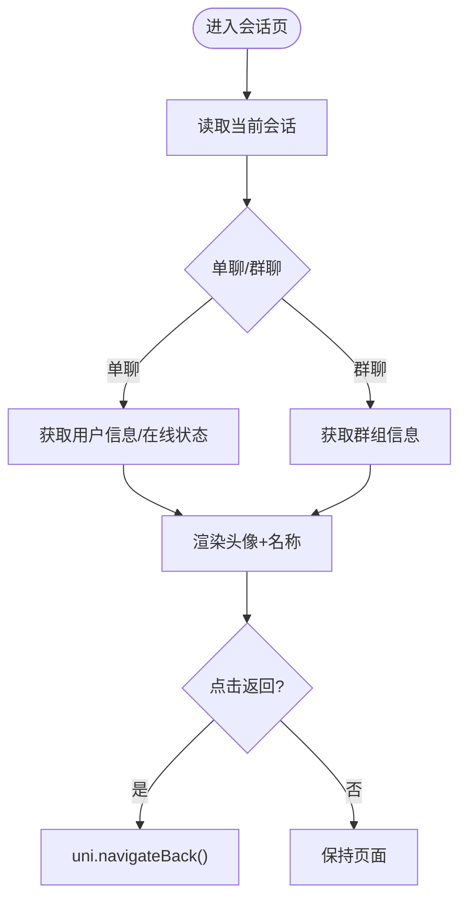
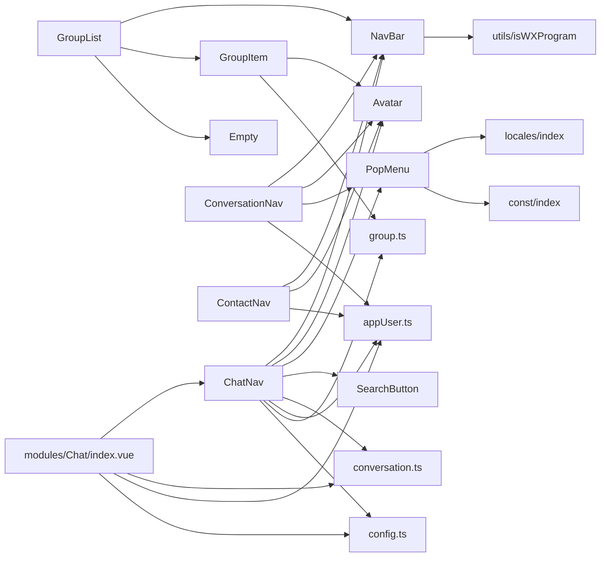

# 会话导航组件

<cite>
**本文档引用的文件**
- [ChatNav/index.vue](file://ChatUIKit/modules/Chat/components/ChatNav/index.vue)
- [NavBar/index.vue](file://ChatUIKit/components/NavBar/index.vue)
- [Avatar/index.vue](file://ChatUIKit/components/Avatar/index.vue)
- [PopMenu/index.vue](file://ChatUIKit/components/PopMenu/index.vue)
- [SearchButton/index.vue](file://ChatUIKit/components/SearchButton/index.vue)
- [GroupList/index.vue](file://ChatUIKit/modules/GroupList/index.vue)
- [GroupItem/index.vue](file://ChatUIKit/modules/GroupList/components/GroupItem/index.vue)
- [ConversationNav/index.vue](file://ChatUIKit/modules/Conversation/components/ConversationNav/index.vue)
- [ContactNav/index.vue](file://ChatUIKit/modules/ContactList/components/ContactNav/index.vue)
- [chat.ts](file://ChatUIKit/stores/chat.ts)
- [conversation.ts](file://ChatUIKit/stores/conversation.ts)
- [appUser.ts](file://ChatUIKit/stores/appUser.ts)
- [group.ts](file://ChatUIKit/stores/group.ts)
- [config.ts](file://ChatUIKit/stores/config.ts)
- [common.scss](file://ChatUIKit/styles/common.scss)
- [index.ts](file://ChatUIKit/types/index.ts)
- [modules/Chat/index.vue](file://ChatUIKit/modules/Chat/index.vue)
- [const/index.ts](file://ChatUIKit/const/index.ts)
- [modules/Chat/style.scss](file://ChatUIKit/modules/Chat/style.scss)
- [modules/ContactList/style.scss](file://ChatUIKit/modules/ContactList/style.scss)
</cite>

## 更新摘要
**变更内容**
- 新增群组列表导航组件的详细分析和实现说明
- 改进群组列表的导航集成和样式处理
- 扩展导航组件的样式定制和主题适配方案
- 增强响应式设计和微信小程序平台适配
- 完善导航组件的生命周期管理和事件处理机制

## 目录
1. [简介](#简介)
2. [项目结构](#项目结构)
3. [核心组件](#核心组件)
4. [架构总览](#架构总览)
5. [详细组件分析](#详细组件分析)
6. [依赖关系分析](#依赖关系分析)
7. [性能考虑](#性能考虑)
8. [故障排查指南](#故障排查指南)
9. [结论](#结论)
10. [附录](#附录)

## 简介
本文件面向"会话导航组件"的使用者与开发者，系统性阐述其布局设计、功能按钮与交互行为，覆盖返回按钮、搜索按钮、更多操作菜单的实现；同时详解导航标题的动态更新、页面状态管理与面包屑导航的可扩展思路；并提供样式定制、主题适配与响应式设计建议；解释与路由系统的集成、页面切换动画与状态保持机制；包含搜索功能集成、快捷操作与上下文菜单；最后总结组件生命周期、事件处理与父子组件数据传递，并给出初学者配置指南与专家级自定义扩展方案。

**更新** 新增群组列表导航组件的详细分析，涵盖群组列表的导航集成和样式处理改进。

## 项目结构
会话导航组件位于聊天模块的组件树中，采用"页面容器 + 导航 + 内容区"的三层结构：
- 页面容器负责键盘高度适配、输入工具栏与表情面板的遮罩控制、消息编辑态管理等；
- 导航组件负责头部左侧头像与名称、右侧更多菜单、以及返回按钮交互；
- 内容区承载消息列表与输入区域。

```mermaid
graph TB
subgraph "页面容器"
Page["Chat/index.vue"]
GroupList["GroupList/index.vue"]
GroupItem["GroupItem/index.vue"]
End
subgraph "导航组件"
ChatNav["ChatNav/index.vue"]
NavBar["NavBar/index.vue"]
Avatar["Avatar/index.vue"]
PopMenu["PopMenu/index.vue"]
SearchBtn["SearchButton/index.vue"]
ConversationNav["ConversationNav/index.vue"]
ContactNav["ContactNav/index.vue"]
End
subgraph "状态管理"
ChatStore["stores/chat.ts"]
ConvStore["stores/conversation.ts"]
AppUserStore["stores/appUser.ts"]
GroupStore["stores/group.ts"]
ConfigStore["stores/config.ts"]
End
Page --> ChatNav
GroupList --> GroupItem
ChatNav --> NavBar
ChatNav --> Avatar
ChatNav --> PopMenu
ChatNav --> SearchBtn
ChatNav --> ConvStore
ChatNav --> AppUserStore
ChatNav --> GroupStore
ChatNav --> ConfigStore
GroupList --> NavBar
GroupItem --> Avatar
GroupItem --> GroupStore
ConversationNav --> NavBar
ConversationNav --> Avatar
ConversationNav --> PopMenu
ContactNav --> NavBar
ContactNav --> Avatar
Page --> ChatStore
```

**图表来源**
- [ChatNav/index.vue](file://ChatUIKit/modules/Chat/components/ChatNav/index.vue#L1-L127)
- [GroupList/index.vue](file://ChatUIKit/modules/GroupList/index.vue#L1-L66)
- [GroupItem/index.vue](file://ChatUIKit/modules/GroupList/components/GroupItem/index.vue#L1-L67)
- [NavBar/index.vue](file://ChatUIKit/components/NavBar/index.vue#L1-L66)
- [Avatar/index.vue](file://ChatUIKit/components/Avatar/index.vue#L1-L188)
- [PopMenu/index.vue](file://ChatUIKit/components/PopMenu/index.vue#L1-L108)
- [SearchButton/index.vue](file://ChatUIKit/components/SearchButton/index.vue#L1-L41)
- [ConversationNav/index.vue](file://ChatUIKit/modules/Conversation/components/ConversationNav/index.vue#L1-L159)
- [ContactNav/index.vue](file://ChatUIKit/modules/ContactList/components/ContactNav/index.vue#L1-L99)
- [chat.ts](file://ChatUIKit/stores/chat.ts#L1-L407)
- [conversation.ts](file://ChatUIKit/stores/conversation.ts#L1-L421)
- [appUser.ts](file://ChatUIKit/stores/appUser.ts#L1-L242)
- [group.ts](file://ChatUIKit/stores/group.ts#L1-L317)
- [config.ts](file://ChatUIKit/stores/config.ts#L1-L124)
- [modules/Chat/index.vue](file://ChatUIKit/modules/Chat/index.vue#L1-L255)

**章节来源**
- [ChatNav/index.vue](file://ChatUIKit/modules/Chat/components/ChatNav/index.vue#L1-L127)
- [GroupList/index.vue](file://ChatUIKit/modules/GroupList/index.vue#L1-L66)
- [modules/Chat/index.vue](file://ChatUIKit/modules/Chat/index.vue#L1-L255)

## 核心组件
- ChatNav：会话页头部导航，左侧展示对端头像与名称，右侧提供更多菜单入口，支持返回按钮交互。
- NavBar：通用导航栏容器，提供左右槽位与返回箭头插槽，支持微信小程序平台差异化样式。
- Avatar：头像组件，支持在线状态徽标、占位图、错误回退与主题形状配置。
- PopMenu：上拉弹出菜单，承载"新建会话/加好友/建群"等快捷入口。
- SearchButton：搜索占位按钮，用于唤起搜索流程（具体实现由业务页面注入）。
- GroupList：群组列表导航组件，提供群组列表的导航集成和样式处理。
- GroupItem：群组列表项组件，支持群组头像和名称的动态显示。

**更新** 新增群组列表导航组件和群组列表项组件的说明。

这些组件通过 Pinia Store 实现状态驱动，避免手动订阅/取消订阅，提升性能与可维护性。

**章节来源**
- [ChatNav/index.vue](file://ChatUIKit/modules/Chat/components/ChatNav/index.vue#L22-L104)
- [NavBar/index.vue](file://ChatUIKit/components/NavBar/index.vue#L20-L35)
- [Avatar/index.vue](file://ChatUIKit/components/Avatar/index.vue#L25-L96)
- [PopMenu/index.vue](file://ChatUIKit/components/PopMenu/index.vue#L21-L40)
- [SearchButton/index.vue](file://ChatUIKit/components/SearchButton/index.vue#L8-L17)
- [GroupList/index.vue](file://ChatUIKit/modules/GroupList/index.vue#L1-L66)
- [GroupItem/index.vue](file://ChatUIKit/modules/GroupList/components/GroupItem/index.vue#L1-L67)

## 架构总览
会话导航组件与路由、状态管理、SDK 事件的协作关系如下：



**图表来源**
- [modules/Chat/index.vue](file://ChatUIKit/modules/Chat/index.vue#L229-L245)
- [GroupList/index.vue](file://ChatUIKit/modules/GroupList/index.vue#L39-L47)
- [GroupItem/index.vue](file://ChatUIKit/modules/GroupList/components/GroupItem/index.vue#L29-L44)
- [ChatNav/index.vue](file://ChatUIKit/modules/Chat/components/ChatNav/index.vue#L36-L103)
- [NavBar/index.vue](file://ChatUIKit/components/NavBar/index.vue#L30-L34)
- [conversation.ts](file://ChatUIKit/stores/conversation.ts#L119-L121)
- [appUser.ts](file://ChatUIKit/stores/appUser.ts#L130-L182)
- [group.ts](file://ChatUIKit/stores/group.ts#L64-L95)

## 详细组件分析

### ChatNav 组件
- 左侧布局：头像 + 名称，名称支持省略号，宽度受视口约束。
- 功能点：
  - 返回按钮：通过 NavBar 的返回事件触发 uni.navigateBack。
  - 在线状态：单聊场景下，进入页面时异步拉取并订阅对端在线状态；离开时取消订阅。
  - 动态标题：名称与头像根据当前会话类型（单聊/群聊）动态切换来源。
- 性能优化：使用 computed 自动追踪 currConversation 变化，避免 autorun 带来的副作用。



**图表来源**
- [ChatNav/index.vue](file://ChatUIKit/modules/Chat/components/ChatNav/index.vue#L47-L103)
- [conversation.ts](file://ChatUIKit/stores/conversation.ts#L119-L121)
- [appUser.ts](file://ChatUIKit/stores/appUser.ts#L86-L125)
- [group.ts](file://ChatUIKit/stores/group.ts#L136-L167)

**章节来源**
- [ChatNav/index.vue](file://ChatUIKit/modules/Chat/components/ChatNav/index.vue#L1-L127)

### GroupList 组件
- 群组列表导航组件，提供群组列表的完整导航功能。
- 左侧显示群组列表标题，右侧提供返回按钮。
- 支持群组列表的滚动浏览和点击跳转到聊天页面。
- 使用 Empty 组件处理空列表状态。

**更新** 新增群组列表导航组件的详细分析。

**章节来源**
- [GroupList/index.vue](file://ChatUIKit/modules/GroupList/index.vue#L1-L66)

### GroupItem 组件
- 群组列表项组件，支持群组头像和名称的动态显示。
- 自动处理群组 ID 的驼峰命名和小写命名格式。
- 支持群组名称和头像的优先级获取逻辑。
- 通过 Pinia Store 获取群组的派生信息。

**更新** 新增群组列表项组件的详细分析。

**章节来源**
- [GroupItem/index.vue](file://ChatUIKit/modules/GroupList/components/GroupItem/index.vue#L1-L67)

### NavBar 组件
- 提供左右槽位与中心槽位，支持微信小程序平台的差异化顶部间距。
- 返回箭头可通过 showBackArrow 控制显隐，默认显示。
- 通过 emit 事件向上抛出点击回调，供父组件处理返回逻辑。

**章节来源**
- [NavBar/index.vue](file://ChatUIKit/components/NavBar/index.vue#L1-L66)

### Avatar 组件
- 支持圆形/方形头像形状，形状来源于主题配置。
- 支持在线状态徽标，状态枚举包括 Online、Offline、Away、Busy、Do Not Disturb、Custom。
- 错误回退：图片加载失败时回退至占位图。
- 与 Presence 的联动：当启用 usePresence 且 withPresence 为真时显示状态徽标。

**章节来源**
- [Avatar/index.vue](file://ChatUIKit/components/Avatar/index.vue#L25-L96)
- [config.ts](file://ChatUIKit/stores/config.ts#L65-L80)

### PopMenu 组件
- 弹出菜单项：新建会话、加好友、建群。
- 微信小程序平台使用悬浮按钮样式，非小程序平台使用右上角菜单。
- 点击菜单项后触发 onMenuTap 并自动关闭菜单。

**章节来源**
- [PopMenu/index.vue](file://ChatUIKit/components/PopMenu/index.vue#L1-L108)
- [ConversationNav/index.vue](file://ChatUIKit/modules/Conversation/components/ConversationNav/index.vue#L73-L111)

### SearchButton 组件
- 展示搜索占位按钮，文案来自国际化资源。
- 可作为导航右侧按钮之一，配合业务页面实现搜索功能。

**章节来源**
- [SearchButton/index.vue](file://ChatUIKit/components/SearchButton/index.vue#L1-L41)

### ConversationNav 组件
- 会话导航组件，提供会话列表的导航功能。
- 左侧显示用户头像，右侧提供更多操作菜单。
- 支持微信小程序平台的悬浮按钮样式。

**更新** 新增会话导航组件的详细分析。

**章节来源**
- [ConversationNav/index.vue](file://ChatUIKit/modules/Conversation/components/ConversationNav/index.vue#L1-L159)

### ContactNav 组件
- 联系人导航组件，提供联系人列表的导航功能。
- 左侧显示用户头像，右侧提供添加联系人按钮。
- 支持微信小程序平台的悬浮按钮样式。

**更新** 新增联系人导航组件的详细分析。

**章节来源**
- [ContactNav/index.vue](file://ChatUIKit/modules/ContactList/components/ContactNav/index.vue#L1-L99)

## 依赖关系分析
- ChatNav 依赖：
  - conversation.ts：读取当前会话，决定头像与名称来源。
  - appUser.ts：单聊时获取用户信息与在线状态。
  - group.ts：群聊时获取群组信息。
  - config.ts：读取 usePresence 开关。
  - common.scss：提供 ellipsis 省略样式。
- GroupList 依赖：
  - group.ts：获取群组列表数据。
  - NavBar：提供导航栏基础功能。
  - GroupItem：渲染群组列表项。
  - Empty：处理空列表状态。
- GroupItem 依赖：
  - group.ts：获取群组名称和头像信息。
  - Avatar：显示群组头像。
- NavBar 依赖：
  - utils/isWXProgram：判断是否为微信小程序环境，以应用不同样式。
- PopMenu 依赖：
  - locales：菜单项文案国际化。
  - const/ASSETS_URL：菜单图标资源路径。
- ConversationNav 依赖：
  - appUser.ts：获取用户信息。
  - Avatar：显示用户头像。
  - PopMenu：提供菜单功能。
- ContactNav 依赖：
  - appUser.ts：获取用户信息。
  - Avatar：显示用户头像。
- Chat 页面容器：
  - 通过 onLoad 接收路由参数，设置当前会话并标记已读。
  - 提供 InputToolbarEvent 上下文，供输入工具栏组件使用。



**图表来源**
- [ChatNav/index.vue](file://ChatUIKit/modules/Chat/components/ChatNav/index.vue#L22-L33)
- [GroupList/index.vue](file://ChatUIKit/modules/GroupList/index.vue#L21-L27)
- [GroupItem/index.vue](file://ChatUIKit/modules/GroupList/components/GroupItem/index.vue#L8-L12)
- [NavBar/index.vue](file://ChatUIKit/components/NavBar/index.vue#L21-L28)
- [PopMenu/index.vue](file://ChatUIKit/components/PopMenu/index.vue#L21-L34)
- [ConversationNav/index.vue](file://ChatUIKit/modules/Conversation/components/ConversationNav/index.vue#L41-L49)
- [ContactNav/index.vue](file://ChatUIKit/modules/ContactList/components/ContactNav/index.vue#L33-L38)
- [modules/Chat/index.vue](file://ChatUIKit/modules/Chat/index.vue#L74-L115)

**章节来源**
- [ChatNav/index.vue](file://ChatUIKit/modules/Chat/components/ChatNav/index.vue#L22-L104)
- [GroupList/index.vue](file://ChatUIKit/modules/GroupList/index.vue#L21-L33)
- [modules/Chat/index.vue](file://ChatUIKit/modules/Chat/index.vue#L74-L115)

## 性能考虑
- 响应式与缓存：
  - 使用 computed 自动追踪依赖变化，避免手动 autorun 带来的内存泄漏与重复订阅。
  - AppUserStore、GroupStore、ConversationStore 的 getters 提供派生状态缓存。
- 状态订阅生命周期：
  - onMounted 订阅在线状态，onUnmounted 取消订阅，确保组件卸载时释放资源。
- 资源加载：
  - Avatar 组件在图片加载失败时回退至占位图，减少空白闪烁。
- 列表与消息：
  - ChatStore 在连接成功后批量加载会话、联系人与群组，降低首屏等待时间。
- 群组列表优化：
  - GroupList 使用 computed 优化群组列表渲染，避免不必要的重新计算。
  - GroupItem 通过 props 和 computed 优化属性访问，提高渲染性能。

**更新** 新增群组列表组件的性能优化考虑。

**章节来源**
- [ChatNav/index.vue](file://ChatUIKit/modules/Chat/components/ChatNav/index.vue#L82-L103)
- [GroupList/index.vue](file://ChatUIKit/modules/GroupList/index.vue#L32-L33)
- [GroupItem/index.vue](file://ChatUIKit/modules/GroupList/components/GroupItem/index.vue#L29-L44)
- [appUser.ts](file://ChatUIKit/stores/appUser.ts#L130-L182)
- [Avatar/index.vue](file://ChatUIKit/components/Avatar/index.vue#L89-L95)
- [chat.ts](file://ChatUIKit/stores/chat.ts#L377-L396)

## 故障排查指南
- 返回按钮无响应
  - 检查 NavBar 的 showBackArrow 与 onLeftTap 事件是否正确绑定。
  - 确认 ChatNav 的 onBack 是否调用 uni.navigateBack。
- 在线状态不更新
  - 确认 usePresence 开关已启用。
  - 检查 onMounted 是否执行了订阅，onUnmounted 是否执行了取消订阅。
- 头像显示异常
  - 检查 src 与 placeholder 是否正确传入。
  - 确认 Avatar 的 shape 与主题配置一致。
- 菜单不显示
  - 检查 isShowPopMenu 的状态切换逻辑。
  - 确认微信小程序平台条件编译与样式差异。
- 导航标题不更新
  - 确认 currConversation 是否正确设置。
  - 检查 computed 依赖是否包含 currConversation。
- 群组列表问题
  - 检查 groupStore.joinedGroupList 数据是否正确。
  - 确认 GroupItem 的 props 传入是否正确。
  - 检查 toChatPage 方法中的路由参数是否正确。
- 样式问题
  - 确认 SCSS 文件是否正确导入。
  - 检查微信小程序平台的条件编译样式。

**更新** 新增群组列表和样式问题的故障排查指南。

**章节来源**
- [NavBar/index.vue](file://ChatUIKit/components/NavBar/index.vue#L30-L34)
- [ChatNav/index.vue](file://ChatUIKit/modules/Chat/components/ChatNav/index.vue#L78-L103)
- [Avatar/index.vue](file://ChatUIKit/components/Avatar/index.vue#L89-L95)
- [PopMenu/index.vue](file://ChatUIKit/components/PopMenu/index.vue#L36-L39)
- [GroupList/index.vue](file://ChatUIKit/modules/GroupList/index.vue#L35-L47)
- [GroupItem/index.vue](file://ChatUIKit/modules/GroupList/components/GroupItem/index.vue#L29-L44)

## 结论
会话导航组件通过清晰的职责划分与 Pinia 状态驱动，实现了高内聚、低耦合的导航体验。其返回按钮、头像与名称动态更新、在线状态订阅、更多菜单等能力，均可按需扩展。结合页面容器的状态管理与 SDK 事件处理，整体具备良好的性能与可维护性。

**更新** 新增群组列表导航组件的分析，进一步完善了导航组件体系的完整性。

## 附录

### 导航标题与面包屑
- 动态标题：当前实现以"头像 + 名称"为主，标题文本来自对端用户或群组信息。
- 面包屑建议：可在页面容器中基于路由栈与会话类型构建轻量级面包屑，仅在复杂场景启用，避免过度设计。
- 群组列表标题：GroupList 组件提供专门的群组列表标题显示功能。

**更新** 新增群组列表标题的说明。

**章节来源**
- [ChatNav/index.vue](file://ChatUIKit/modules/Chat/components/ChatNav/index.vue#L47-L76)
- [GroupList/index.vue](file://ChatUIKit/modules/GroupList/index.vue#L4-L6)

### 样式定制与主题适配
- 头像形状：通过主题配置控制圆形/方形。
- 在线状态徽标：支持多种状态枚举，可扩展自定义状态。
- 微信小程序差异化：NavBar 与 ConversationNav 在微信平台使用不同样式策略。
- 群组列表样式：GroupItem 提供统一的群组列表项样式，支持边框和背景色定制。
- 响应式设计：所有导航组件均支持响应式布局和安全区域适配。

**更新** 新增群组列表样式和响应式设计的说明。

**章节来源**
- [Avatar/index.vue](file://ChatUIKit/components/Avatar/index.vue#L60-L78)
- [config.ts](file://ChatUIKit/stores/config.ts#L65-L80)
- [NavBar/index.vue](file://ChatUIKit/components/NavBar/index.vue#L49-L51)
- [ConversationNav/index.vue](file://ChatUIKit/modules/Conversation/components/ConversationNav/index.vue#L57-L65)
- [GroupItem/index.vue](file://ChatUIKit/modules/GroupList/components/GroupItem/index.vue#L52-L66)
- [modules/Chat/style.scss](file://ChatUIKit/modules/Chat/style.scss#L1-L33)
- [modules/ContactList/style.scss](file://ChatUIKit/modules/ContactList/style.scss#L1-L53)

### 响应式设计
- 头像名称区域使用弹性布局与省略号，适配不同屏幕宽度。
- 微信小程序平台增加顶部安全区与悬浮按钮，提升可用性。
- 群组列表支持滚动浏览，适配不同设备屏幕尺寸。
- 导航组件支持安全区域适配，确保在刘海屏设备上的正确显示。

**更新** 新增群组列表和安全区域适配的说明。

**章节来源**
- [ChatNav/index.vue](file://ChatUIKit/modules/Chat/components/ChatNav/index.vue#L106-L126)
- [ConversationNav/index.vue](file://ChatUIKit/modules/Conversation/components/ConversationNav/index.vue#L137-L157)
- [GroupList/index.vue](file://ChatUIKit/modules/GroupList/index.vue#L52-L65)
- [modules/Chat/style.scss](file://ChatUIKit/modules/Chat/style.scss#L8-L12)

### 与路由系统的集成
- 页面容器通过 onLoad 接收路由参数，设置当前会话并标记已读。
- 返回按钮通过 uni.navigateBack 返回上一页。
- 更多菜单通过 uni.navigateTo 跳转到新页面。
- 群组列表通过 uni.navigateTo 跳转到聊天页面，传递群组 ID 参数。

**更新** 新增群组列表路由集成的说明。

**章节来源**
- [modules/Chat/index.vue](file://ChatUIKit/modules/Chat/index.vue#L229-L245)
- [ChatNav/index.vue](file://ChatUIKit/modules/Chat/components/ChatNav/index.vue#L78-L80)
- [ConversationNav/index.vue](file://ChatUIKit/modules/Conversation/components/ConversationNav/index.vue#L94-L111)
- [GroupList/index.vue](file://ChatUIKit/modules/GroupList/index.vue#L39-L47)

### 页面切换动画与状态保持
- 页面切换动画：由 uni-app 路由系统控制，组件内部通过 onShow/onHide 生命周期与 Store 协同维持状态。
- 状态保持：Store 在组件卸载时不清理关键状态，避免频繁重建带来的抖动。
- 群组列表状态：GroupList 使用 computed 保持列表状态，避免重复计算。

**更新** 新增群组列表状态保持的说明。

**章节来源**
- [chat.ts](file://ChatUIKit/stores/chat.ts#L366-L371)
- [modules/Chat/index.vue](file://ChatUIKit/modules/Chat/index.vue#L221-L227)
- [GroupList/index.vue](file://ChatUIKit/modules/GroupList/index.vue#L32-L33)

### 搜索功能集成与快捷操作
- 搜索按钮：SearchButton 提供占位样式与文案，具体搜索逻辑由业务页面实现。
- 快捷操作：PopMenu 提供"新建会话/加好友/建群"，可按需扩展更多入口。
- 群组搜索：可以在 GroupList 中集成搜索功能，实现群组的快速查找。

**更新** 新增群组搜索功能的说明。

**章节来源**
- [SearchButton/index.vue](file://ChatUIKit/components/SearchButton/index.vue#L1-L41)
- [ConversationNav/index.vue](file://ChatUIKit/modules/Conversation/components/ConversationNav/index.vue#L73-L111)
- [GroupList/index.vue](file://ChatUIKit/modules/GroupList/index.vue#L1-L66)

### 组件生命周期与事件处理
- ChatNav：onMounted 订阅在线状态，onUnmounted 取消订阅；computed 自动追踪会话变化。
- Chat 页面：onLoad 设置当前会话，onUnload 注销键盘高度监听；provide 提供工具栏关闭事件。
- GroupList：使用 computed 优化列表渲染，自动响应群组数据变化。
- GroupItem：通过 props 和 computed 优化属性访问，提高渲染性能。

**更新** 新增群组列表组件生命周期的说明。

**章节来源**
- [ChatNav/index.vue](file://ChatUIKit/modules/Chat/components/ChatNav/index.vue#L82-L103)
- [GroupList/index.vue](file://ChatUIKit/modules/GroupList/index.vue#L32-L33)
- [GroupItem/index.vue](file://ChatUIKit/modules/GroupList/components/GroupItem/index.vue#L29-L44)
- [modules/Chat/index.vue](file://ChatUIKit/modules/Chat/index.vue#L211-L249)

### 与父组件的数据传递
- ChatNav 通过 Pinia Store 读取当前会话与用户/群组信息，无需显式 props 传递。
- 页面容器通过 provide/inject 传递 InputToolbarEvent，实现跨层级通信。
- GroupList 通过 Pinia Store 获取群组列表数据，无需显式 props 传递。
- GroupItem 通过 props 接收群组信息，通过 computed 计算派生状态。

**更新** 新增群组列表组件数据传递的说明。

**章节来源**
- [ChatNav/index.vue](file://ChatUIKit/modules/Chat/components/ChatNav/index.vue#L36-L39)
- [GroupList/index.vue](file://ChatUIKit/modules/GroupList/index.vue#L29-L33)
- [GroupItem/index.vue](file://ChatUIKit/modules/GroupList/components/GroupItem/index.vue#L14-L23)
- [modules/Chat/index.vue](file://ChatUIKit/modules/Chat/index.vue#L247-L249)

### 初学者配置指南
- 启用在线状态：在配置 Store 中开启 usePresence。
- 定制头像形状：通过 setThemeConfig 设置 avatarShape。
- 隐藏/显示功能：通过 setFeatureConfig 控制输入、消息、会话等功能开关。
- 微信小程序适配：确认 isWXProgram 条件编译生效。
- 群组列表配置：通过 groupStore.joinedGroupList 获取群组列表数据。

**更新** 新增群组列表配置的说明。

**章节来源**
- [config.ts](file://ChatUIKit/stores/config.ts#L82-L122)
- [Avatar/index.vue](file://ChatUIKit/components/Avatar/index.vue#L87-L88)
- [NavBar/index.vue](file://ChatUIKit/components/NavBar/index.vue#L21-L28)
- [GroupList/index.vue](file://ChatUIKit/modules/GroupList/index.vue#L29-L33)

### 专家级自定义与扩展方案
- 动态标题：在 ChatNav 中扩展 center 槽位，结合路由元信息与 Store 状态生成多级标题。
- 上下文菜单：在 PopMenu 基础上扩展更多操作（置顶、免打扰、清空会话等），并通过 SDK 事件同步状态。
- 搜索集成：在页面容器中引入 SearchInput 组件，结合 MessageList 的过滤逻辑实现实时搜索。
- 主题扩展：新增主题变量（如 navBgColor、textColor），在组件样式中按需覆盖。
- 性能优化：对长列表与频繁渲染的区域使用虚拟滚动与节流策略。
- 群组列表扩展：在 GroupList 中添加搜索、排序、分组等功能，提升用户体验。
- 导航样式定制：通过 SCSS 变量和条件编译实现不同平台的样式定制。

**更新** 新增群组列表和导航样式定制的扩展方案。

**章节来源**
- [ChatNav/index.vue](file://ChatUIKit/modules/Chat/components/ChatNav/index.vue#L1-L18)
- [PopMenu/index.vue](file://ChatUIKit/components/PopMenu/index.vue#L21-L39)
- [GroupList/index.vue](file://ChatUIKit/modules/GroupList/index.vue#L1-L66)
- [modules/Chat/index.vue](file://ChatUIKit/modules/Chat/index.vue#L1-L72)