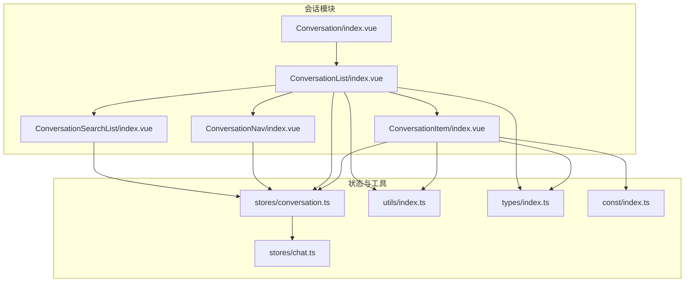
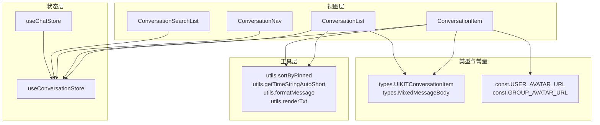
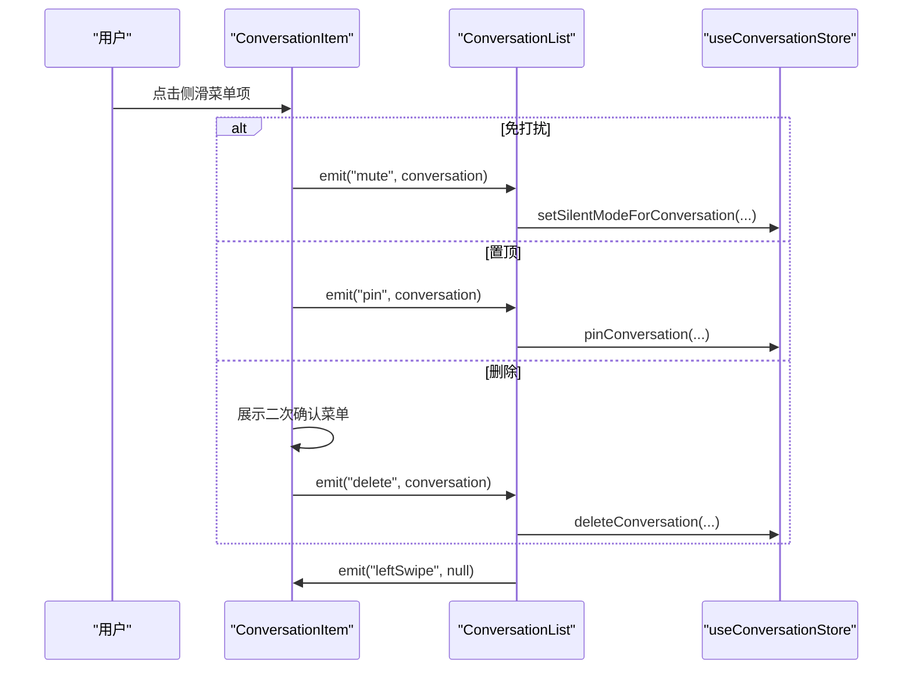
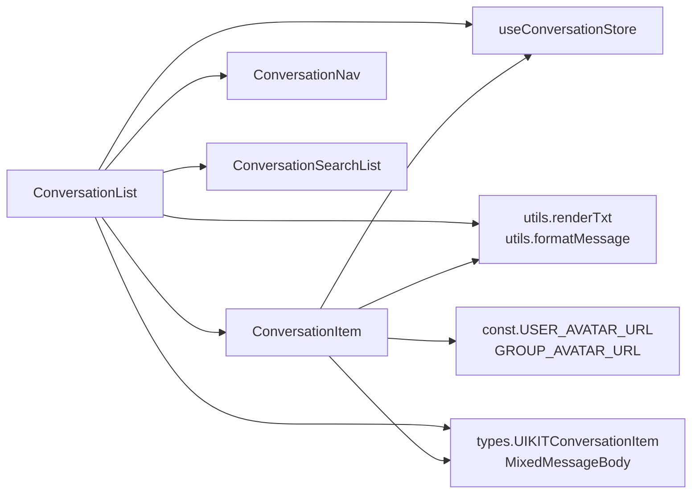

# 会话模块

<cite>
**本文引用的文件**
- [ChatUIKit/modules/Conversation/index.vue](file://ChatUIKit/modules/Conversation/index.vue)
- [ChatUIKit/modules/Conversation/components/ConversationList/index.vue](file://ChatUIKit/modules/Conversation/components/ConversationList/index.vue)
- [ChatUIKit/modules/Conversation/components/ConversationItem/index.vue](file://ChatUIKit/modules/Conversation/components/ConversationItem/index.vue)
- [ChatUIKit/modules/Conversation/components/ConversationNav/index.vue](file://ChatUIKit/modules/Conversation/components/ConversationNav/index.vue)
- [ChatUIKit/modules/ConversationSearchList/index.vue](file://ChatUIKit/modules/ConversationSearchList/index.vue)
- [ChatUIKit/stores/conversation.ts](file://ChatUIKit/stores/conversation.ts)
- [ChatUIKit/stores/chat.ts](file://ChatUIKit/stores/chat.ts)
- [ChatUIKit/stores/index.ts](file://ChatUIKit/stores/index.ts)
- [ChatUIKit/utils/index.ts](file://ChatUIKit/utils/index.ts)
- [ChatUIKit/types/index.ts](file://ChatUIKit/types/index.ts)
- [ChatUIKit/const/index.ts](file://ChatUIKit/const/index.ts)
</cite>

## 目录
1. [简介](#简介)
2. [项目结构](#项目结构)
3. [核心组件](#核心组件)
4. [架构总览](#架构总览)
5. [组件详细分析](#组件详细分析)
6. [依赖关系分析](#依赖关系分析)
7. [性能与大数据量处理](#性能与大数据量处理)
8. [故障排查指南](#故障排查指南)
9. [结论](#结论)
10. [附录](#附录)

## 简介
本文件系统性梳理会话模块的实现，覆盖会话列表组件、会话项组件、会话导航组件以及会话搜索组件。内容包括：
- 数据模型与状态管理
- 排序算法与搜索机制
- 会话置顶、免打扰、删除的实现
- 会话状态同步、未读计数与缩略图生成
- 组件间数据传递与事件处理
- 性能优化与大数据量场景下的处理策略

**重要更新**：会话加载机制已从传统的 getConversationlist API 迁移至 getServerConversations API，改进了服务器端加载机制，提供更标准的会话数据格式和更好的分页支持。

## 项目结构
会话模块位于 ChatUIKit/modules/Conversation 下，采用按功能分层的组织方式：
- Conversation/index.vue：会话模块入口，仅渲染会话列表容器
- Conversation/components/：包含会话列表、会话项、会话导航三个核心子组件
- ConversationSearchList/index.vue：会话搜索页面
- stores/conversation.ts：基于 Pinia 的会话状态管理
- stores/chat.ts：应用初始化时触发会话加载
- utils/index.ts：通用工具函数（含排序、时间格式化、文本渲染等）
- types/index.ts：类型定义
- const/index.ts：常量配置

**图表来源**
- [ChatUIKit/modules/Conversation/index.vue](file://ChatUIKit/modules/Conversation/index.vue#L1-L12)
- [ChatUIKit/modules/Conversation/components/ConversationList/index.vue](file://ChatUIKit/modules/Conversation/components/ConversationList/index.vue#L1-L158)
- [ChatUIKit/modules/Conversation/components/ConversationItem/index.vue](file://ChatUIKit/modules/Conversation/components/ConversationItem/index.vue#L1-L260)
- [ChatUIKit/modules/Conversation/components/ConversationNav/index.vue](file://ChatUIKit/modules/Conversation/components/ConversationNav/index.vue#L1-L159)
- [ChatUIKit/modules/ConversationSearchList/index.vue](file://ChatUIKit/modules/ConversationSearchList/index.vue#L1-L121)
- [ChatUIKit/stores/conversation.ts](file://ChatUIKit/stores/conversation.ts#L1-L421)
- [ChatUIKit/stores/chat.ts](file://ChatUIKit/stores/chat.ts#L383-L396)
- [ChatUIKit/utils/index.ts](file://ChatUIKit/utils/index.ts#L1-L200)
- [ChatUIKit/types/index.ts](file://ChatUIKit/types/index.ts#L1-L100)
- [ChatUIKit/const/index.ts](file://ChatUIKit/const/index.ts#L1-L37)

**章节来源**
- [ChatUIKit/modules/Conversation/index.vue](file://ChatUIKit/modules/Conversation/index.vue#L1-L12)
- [ChatUIKit/modules/Conversation/components/ConversationList/index.vue](file://ChatUIKit/modules/Conversation/components/ConversationList/index.vue#L1-L158)
- [ChatUIKit/modules/Conversation/components/ConversationItem/index.vue](file://ChatUIKit/modules/Conversation/components/ConversationItem/index.vue#L1-L260)
- [ChatUIKit/modules/Conversation/components/ConversationNav/index.vue](file://ChatUIKit/modules/Conversation/components/ConversationNav/index.vue#L1-L159)
- [ChatUIKit/modules/ConversationSearchList/index.vue](file://ChatUIKit/modules/ConversationSearchList/index.vue#L1-L121)
- [ChatUIKit/stores/conversation.ts](file://ChatUIKit/stores/conversation.ts#L1-L421)
- [ChatUIKit/stores/chat.ts](file://ChatUIKit/stores/chat.ts#L383-L396)
- [ChatUIKit/utils/index.ts](file://ChatUIKit/utils/index.ts#L1-L200)
- [ChatUIKit/types/index.ts](file://ChatUIKit/types/index.ts#L1-L100)
- [ChatUIKit/const/index.ts](file://ChatUIKit/const/index.ts#L1-L37)

## 核心组件
- 会话列表容器：负责渲染导航、搜索按钮、空态、会话项列表，并处理置顶、免打扰、删除、左滑菜单等交互
- 会话项：负责单条会话的渲染（头像、名称、最后一条消息、时间、未读数、免打扰徽标、侧滑菜单）
- 会话导航：负责顶部导航栏、用户头像与在线状态、右上角菜单（新建会话、加好友、建群）
- 会话搜索：负责输入搜索词后对会话列表进行过滤展示

**章节来源**
- [ChatUIKit/modules/Conversation/components/ConversationList/index.vue](file://ChatUIKit/modules/Conversation/components/ConversationList/index.vue#L1-L158)
- [ChatUIKit/modules/Conversation/components/ConversationItem/index.vue](file://ChatUIKit/modules/Conversation/components/ConversationItem/index.vue#L1-L260)
- [ChatUIKit/modules/Conversation/components/ConversationNav/index.vue](file://ChatUIKit/modules/Conversation/components/ConversationNav/index.vue#L1-L159)
- [ChatUIKit/modules/ConversationSearchList/index.vue](file://ChatUIKit/modules/ConversationSearchList/index.vue#L1-L121)

## 架构总览
会话模块采用"组件 + Pinia Store + 工具函数 + 类型约束"的分层架构：
- 视图层：Vue 组件树，负责渲染与交互
- 状态层：Pinia Store 提供会话列表、置顶状态、免打扰映射、分页游标等
- 工具层：排序、时间格式化、文本渲染、平台判断等
- 类型层：统一的消息体、会话项、AT 类型等类型定义
- 常量层：头像默认地址、最大消息数、@ALL 标识等

**重要更新**：会话加载机制已迁移到 getServerConversations API，提供标准化的会话数据格式和更好的分页支持。

**图表来源**
- [ChatUIKit/modules/Conversation/components/ConversationList/index.vue](file://ChatUIKit/modules/Conversation/components/ConversationList/index.vue#L33-L106)
- [ChatUIKit/modules/Conversation/components/ConversationItem/index.vue](file://ChatUIKit/modules/Conversation/components/ConversationItem/index.vue#L94-L255)
- [ChatUIKit/modules/Conversation/components/ConversationNav/index.vue](file://ChatUIKit/modules/Conversation/components/ConversationNav/index.vue#L41-L114)
- [ChatUIKit/modules/ConversationSearchList/index.vue](file://ChatUIKit/modules/ConversationSearchList/index.vue#L35-L88)
- [ChatUIKit/stores/conversation.ts](file://ChatUIKit/stores/conversation.ts#L49-L98)
- [ChatUIKit/stores/chat.ts](file://ChatUIKit/stores/chat.ts#L383-L396)
- [ChatUIKit/utils/index.ts](file://ChatUIKit/utils/index.ts#L184-L197)
- [ChatUIKit/types/index.ts](file://ChatUIKit/types/index.ts#L56-L65)
- [ChatUIKit/const/index.ts](file://ChatUIKit/const/index.ts#L10-L12)

## 组件详细分析

### 会话列表组件（ConversationList）
职责与行为
- 渲染头部导航与搜索按钮
- 基于 Pinia 计算属性获取排序后的会话列表
- 逐条渲染会话项，传递置顶状态与菜单事件
- 支持左滑选择、置顶、免打扰切换、删除会话
- 提供跳转到会话搜索页面的能力

关键点
- 使用 computed 引用 store 的 sortedConversationList，避免深拷贝与手动订阅
- 通过事件冒泡向上处理 mute/pin/delete/leftSwipe
- 通过 isWXProgram 判断平台以适配不同布局占位

**章节来源**
- [ChatUIKit/modules/Conversation/components/ConversationList/index.vue](file://ChatUIKit/modules/Conversation/components/ConversationList/index.vue#L1-L158)

### 会话项组件（ConversationItem）
职责与行为
- 渲染头像、名称、最后一条消息、时间、未读数、免打扰徽标
- 支持左滑菜单：免打扰、置顶、删除；删除操作二次确认
- 点击进入聊天页；若处于菜单展开状态点击会收起菜单
- 动态头像与名称：群聊取群名与群头像，单聊取用户信息
- 文本消息渲染：支持表情符号解析与截断显示

交互流程（置顶/免打扰/删除）

**图表来源**
- [ChatUIKit/modules/Conversation/components/ConversationItem/index.vue](file://ChatUIKit/modules/Conversation/components/ConversationItem/index.vue#L217-L230)
- [ChatUIKit/modules/Conversation/components/ConversationList/index.vue](file://ChatUIKit/modules/Conversation/components/ConversationList/index.vue#L58-L93)
- [ChatUIKit/stores/conversation.ts](file://ChatUIKit/stores/conversation.ts#L246-L276)

**章节来源**
- [ChatUIKit/modules/Conversation/components/ConversationItem/index.vue](file://ChatUIKit/modules/Conversation/components/ConversationItem/index.vue#L1-L260)

### 会话导航组件（ConversationNav）
职责与行为
- 渲染顶部导航栏，左侧显示用户头像与在线状态，右侧显示菜单按钮
- 右上角弹出菜单：新建会话、加好友、建群
- 不同平台（微信小程序）采用不同定位样式

**章节来源**
- [ChatUIKit/modules/Conversation/components/ConversationNav/index.vue](file://ChatUIKit/modules/Conversation/components/ConversationNav/index.vue#L1-L159)

### 会话搜索组件（ConversationSearchList）
职责与行为
- 输入框监听输入值，基于 computed 过滤会话列表
- 支持单聊按昵称过滤、群聊按群名过滤
- 点击搜索结果跳转到对应聊天页

**章节来源**
- [ChatUIKit/modules/ConversationSearchList/index.vue](file://ChatUIKit/modules/ConversationSearchList/index.vue#L1-L121)

## 依赖关系分析

### 组件依赖图

**图表来源**
- [ChatUIKit/modules/Conversation/components/ConversationItem/index.vue](file://ChatUIKit/modules/Conversation/components/ConversationItem/index.vue#L94-L105)
- [ChatUIKit/modules/Conversation/components/ConversationList/index.vue](file://ChatUIKit/modules/Conversation/components/ConversationList/index.vue#L33-L41)
- [ChatUIKit/modules/ConversationSearchList/index.vue](file://ChatUIKit/modules/ConversationSearchList/index.vue#L35-L51)
- [ChatUIKit/utils/index.ts](file://ChatUIKit/utils/index.ts#L275-L312)
- [ChatUIKit/types/index.ts](file://ChatUIKit/types/index.ts#L56-L65)
- [ChatUIKit/const/index.ts](file://ChatUIKit/const/index.ts#L10-L12)

### 状态与工具依赖
- 排序：sortByPinned 在 store 的 getter 中使用，保证列表始终按置顶优先、时间倒序排列
- 时间显示：getConversationTime 基于 getTimeStringAutoShort，自动短格式化
- 文本渲染：formatMessage 将不同类型消息格式化为可读字符串；renderTxt 将文本拆分为文本/表情片段
- 平台判断：isWXProgram 用于适配不同平台的样式与布局

**章节来源**
- [ChatUIKit/stores/conversation.ts](file://ChatUIKit/stores/conversation.ts#L49-L98)
- [ChatUIKit/utils/index.ts](file://ChatUIKit/utils/index.ts#L184-L197)
- [ChatUIKit/utils/index.ts](file://ChatUIKit/utils/index.ts#L31-L78)
- [ChatUIKit/utils/index.ts](file://ChatUIKit/utils/index.ts#L275-L312)

### 会话加载机制更新
**重要更新**：会话加载机制已从 getConversationlist 迁移至 getServerConversations API

#### 服务器端加载机制
- **getServerConversations**：新的标准 API，返回标准化的 conversations 数组格式
- **getServerPinnedConversations**：专门获取置顶会话列表的 API
- **分页支持**：支持 pageSize 和 cursor 参数进行分页加载
- **includeEmptyConversations**：可选择是否包含空会话

#### 初始化流程
应用启动时，ChatStore 会自动触发会话加载：
1. 调用 `convStore.getConversationList()` 获取完整会话列表
2. 如果启用置顶功能，额外调用 `convStore.getServerPinnedConversations()` 获取置顶会话
3. 异步获取单聊用户的详细信息

**章节来源**
- [ChatUIKit/stores/conversation.ts](file://ChatUIKit/stores/conversation.ts#L126-L160)
- [ChatUIKit/stores/conversation.ts](file://ChatUIKit/stores/conversation.ts#L165-L189)
- [ChatUIKit/stores/chat.ts](file://ChatUIKit/stores/chat.ts#L383-L396)

## 性能与大数据量处理
- 响应式与缓存
  - 使用 computed 引用 store 的 sortedConversationList，避免深拷贝与重复计算
  - totalUnreadCount 作为 getter 缓存，减少遍历成本
- 列表渲染优化
  - 通过 v-for 渲染会话项，key 使用 conversationId，确保稳定重用
  - 未读数上限显示"99+"，避免长数字影响渲染
- 异步加载与分页
  - **更新**：getServerConversations 支持分页游标，避免一次性加载过多
  - mergeConversations 保留本地状态，合并服务器返回的新数据
- 文本与图片渲染
  - renderTxt 将文本拆分为片段，减少 DOM 节点数量
  - 表情图片懒加载，避免阻塞主线程
- 平台差异
  - isWXProgram 控制样式与布局，避免在小程序中出现布局抖动

**章节来源**
- [ChatUIKit/modules/Conversation/components/ConversationList/index.vue](file://ChatUIKit/modules/Conversation/components/ConversationList/index.vue#L53-L56)
- [ChatUIKit/stores/conversation.ts](file://ChatUIKit/stores/conversation.ts#L49-L98)
- [ChatUIKit/stores/conversation.ts](file://ChatUIKit/stores/conversation.ts#L126-L160)
- [ChatUIKit/stores/conversation.ts](file://ChatUIKit/stores/conversation.ts#L165-L189)
- [ChatUIKit/stores/conversation.ts](file://ChatUIKit/stores/conversation.ts#L194-L213)
- [ChatUIKit/modules/Conversation/components/ConversationItem/index.vue](file://ChatUIKit/modules/Conversation/components/ConversationItem/index.vue#L70-L77)
- [ChatUIKit/utils/index.ts](file://ChatUIKit/utils/index.ts#L260-L265)

## 故障排查指南
常见问题与定位建议
- 会话列表不更新
  - 检查 store 的 mergeConversations 是否正确合并服务器返回的会话
  - 确认 sortedConversationList 的依赖是否被正确触发
  - **新增**：确认 getServerConversations API 调用是否成功返回数据
- 置顶无效
  - 检查 pinConversation 的网络请求是否成功，本地 isPinned 与 pinnedTime 是否更新
  - **新增**：验证 getServerPinnedConversations API 是否正确标记置顶状态
- 免打扰状态异常
  - 检查 setSilentModeForConversation 的 muteConvsMap 是否正确更新
- 未读数不归零
  - 检查 markConversationRead 是否正确发送已读回执并清零 unReadCount
- 搜索无结果
  - 检查 searchList 的过滤逻辑是否匹配单聊/群聊的名称字段
- 性能问题
  - 大列表滚动卡顿：确认未读数上限、renderTxt 分片、v-for key 正确使用
  - **新增**：检查分页游标是否正确传递，避免重复加载相同数据

**章节来源**
- [ChatUIKit/stores/conversation.ts](file://ChatUIKit/stores/conversation.ts#L194-L213)
- [ChatUIKit/stores/conversation.ts](file://ChatUIKit/stores/conversation.ts#L218-L241)
- [ChatUIKit/stores/conversation.ts](file://ChatUIKit/stores/conversation.ts#L246-L276)
- [ChatUIKit/stores/conversation.ts](file://ChatUIKit/stores/conversation.ts#L314-L339)
- [ChatUIKit/modules/ConversationSearchList/index.vue](file://ChatUIKit/modules/ConversationSearchList/index.vue#L57-L72)

## 结论
会话模块通过清晰的组件分层与 Pinia 状态管理，实现了稳定的会话列表渲染、置顶、免打扰、删除、搜索等功能。**重要更新**：会话加载机制已成功迁移到 getServerConversations API，提供更标准化的数据格式和更好的分页支持。排序算法与工具函数提供了良好的扩展性与性能保障。在大数据量场景下，通过分页、缓存与渲染优化，能够满足实际业务需求。后续可在消息缩略图生成、@提醒状态持久化等方面进一步完善。

## 附录

### 数据模型与接口规范

会话数据模型
- UIKITConversationItem：在 SDK ConversationItem 基础上扩展 atType 字段
- MixedMessageBody：排除 ack 消息体，增加 noticeInfo、status、serverMsgId 等字段

排序算法
- sortByPinned：置顶优先，未置顶按 lastMessage.time 倒序

时间格式化
- getTimeStringAutoShort：根据当前时间自动输出"刚刚"、"时:分"、"月/日"或"年/月/日 时:分"

文本渲染
- formatMessage：将不同类型消息格式化为可读字符串
- renderTxt：将文本拆分为文本/表情片段，便于渲染

**章节来源**
- [ChatUIKit/types/index.ts](file://ChatUIKit/types/index.ts#L56-L65)
- [ChatUIKit/types/index.ts](file://ChatUIKit/types/index.ts#L63-L65)
- [ChatUIKit/utils/index.ts](file://ChatUIKit/utils/index.ts#L184-L197)
- [ChatUIKit/utils/index.ts](file://ChatUIKit/utils/index.ts#L31-L78)
- [ChatUIKit/utils/index.ts](file://ChatUIKit/utils/index.ts#L275-L312)
- [ChatUIKit/utils/index.ts](file://ChatUIKit/utils/index.ts#L260-L265)

### 会话状态同步与未读统计
- totalUnreadCount：排除免打扰会话的未读总数
- getConversationTime：格式化最后消息时间
- updateConversationLastMessage：更新最后一条消息与未读数
- markConversationRead：发送已读回执并清零未读数

**章节来源**
- [ChatUIKit/stores/conversation.ts](file://ChatUIKit/stores/conversation.ts#L49-L98)
- [ChatUIKit/stores/conversation.ts](file://ChatUIKit/stores/conversation.ts#L344-L354)
- [ChatUIKit/stores/conversation.ts](file://ChatUIKit/stores/conversation.ts#L314-L339)

### 会话缩略图生成
- 头像来源：群聊使用群头像，单聊使用用户头像；默认使用常量地址
- 名称来源：群聊使用群名，单聊使用用户昵称

**章节来源**
- [ChatUIKit/modules/Conversation/components/ConversationItem/index.vue](file://ChatUIKit/modules/Conversation/components/ConversationItem/index.vue#L134-L144)
- [ChatUIKit/const/index.ts](file://ChatUIKit/const/index.ts#L10-L12)

### 组件间数据传递与事件处理
- ConversationList 向 ConversationItem 传递 conversation 与 showMenu
- ConversationItem 向 ConversationList 发出 mute/pin/delete/leftSwipe 事件
- ConversationList 向 store 发起置顶、免打扰、删除等动作
- ConversationSearchList 通过 computed 过滤会话列表并跳转聊天页

**章节来源**
- [ChatUIKit/modules/Conversation/components/ConversationList/index.vue](file://ChatUIKit/modules/Conversation/components/ConversationList/index.vue#L16-L25)
- [ChatUIKit/modules/Conversation/components/ConversationItem/index.vue](file://ChatUIKit/modules/Conversation/components/ConversationItem/index.vue#L113-L113)
- [ChatUIKit/modules/ConversationSearchList/index.vue](file://ChatUIKit/modules/ConversationSearchList/index.vue#L57-L72)

### 会话加载机制更新详情
**重要更新内容**：

#### 从 getConversationlist 到 getServerConversations 的迁移
- **API 变更**：从传统的 getConversationlist 迁移到标准化的 getServerConversations
- **数据格式**：SDK 返回标准化的 conversations 数组格式，包含 conversationId、conversationType、unReadCount 等字段
- **分页支持**：新增 pageSize 和 cursor 参数，支持分页加载
- **置顶功能**：新增 getServerPinnedConversations API 专门处理置顶会话

#### 初始化流程优化
- **自动加载**：应用启动时自动触发会话列表加载
- **异步用户信息**：单聊会话自动异步获取用户详细信息
- **条件加载**：仅在启用置顶功能时加载置顶会话

**章节来源**
- [ChatUIKit/stores/conversation.ts](file://ChatUIKit/stores/conversation.ts#L126-L160)
- [ChatUIKit/stores/conversation.ts](file://ChatUIKit/stores/conversation.ts#L165-L189)
- [ChatUIKit/stores/chat.ts](file://ChatUIKit/stores/chat.ts#L383-L396)