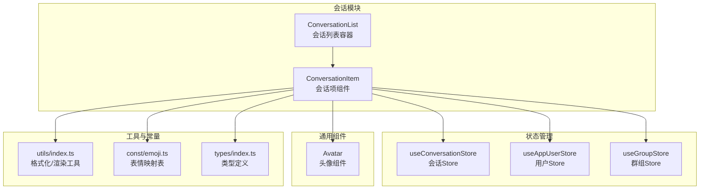
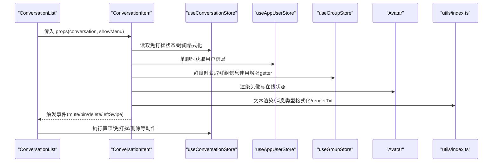
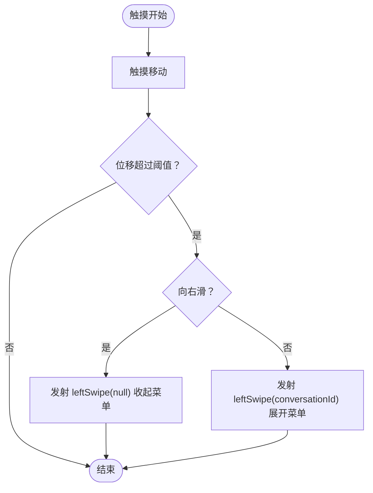
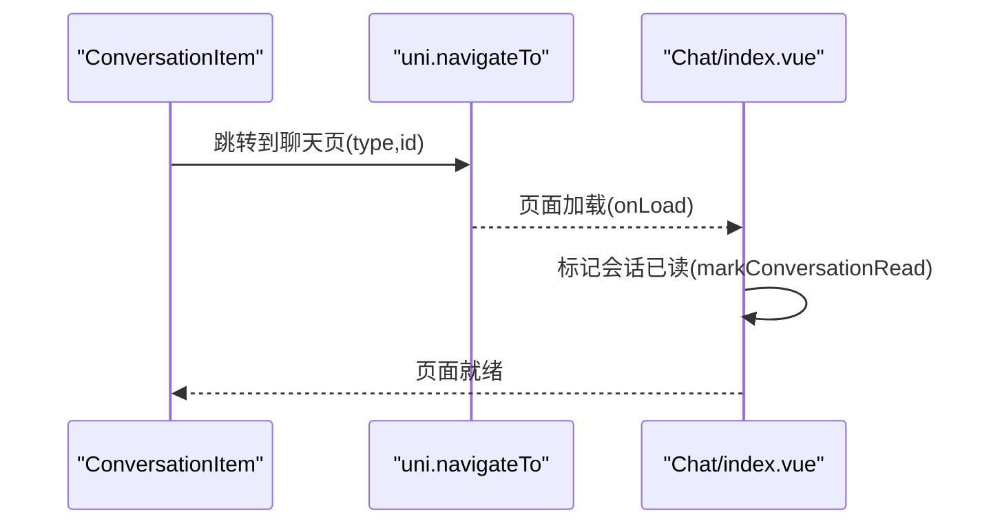
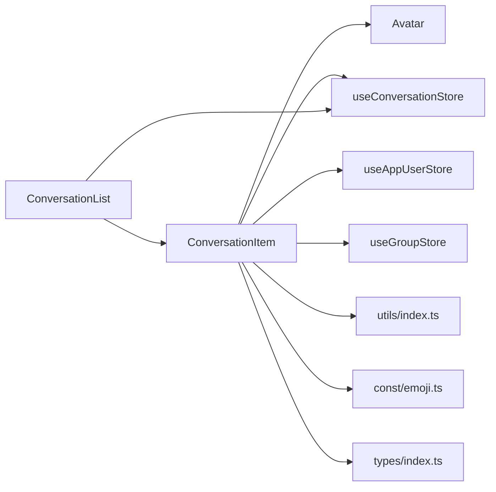

# 会话项组件

<cite>
**本文引用的文件**
- [ConversationItem/index.vue](file://ChatUIKit/modules/Conversation/components/ConversationItem/index.vue)
- [ConversationItem/style.scss](file://ChatUIKit/modules/Conversation/components/ConversationItem/style.scss)
- [ConversationList/index.vue](file://ChatUIKit/modules/Conversation/components/ConversationList/index.vue)
- [conversation.ts](file://ChatUIKit/stores/conversation.ts)
- [appUser.ts](file://ChatUIKit/stores/appUser.ts)
- [group.ts](file://ChatUIKit/stores/group.ts)
- [Avatar/index.vue](file://ChatUIKit/components/Avatar/index.vue)
- [index.ts](file://ChatUIKit/types/index.ts)
- [index.ts](file://ChatUIKit/const/index.ts)
- [index.ts](file://ChatUIKit/utils/index.ts)
- [emoji.ts](file://ChatUIKit/const/emoji.ts)
- [index.vue](file://ChatUIKit/modules/Chat/index.vue)
- [messageTxt.vue](file://ChatUIKit/modules/Chat/components/Message/messageTxt.vue)
</cite>

## 更新摘要
**变更内容**
- 重大增强会话项组件的头像显示逻辑，包括远程用户和群组信息获取、智能回退机制、自动用户信息获取功能
- 新增增强的群组状态管理getter，支持字段兼容性和双重缓存机制
- 优化头像加载的错误回退和占位符机制
- 增强的用户信息获取功能，支持批量获取和智能缓存

## 目录
1. [简介](#简介)
2. [项目结构](#项目结构)
3. [核心组件](#核心组件)
4. [架构总览](#架构总览)
5. [详细组件分析](#详细组件分析)
6. [依赖关系分析](#依赖关系分析)
7. [性能考量](#性能考量)
8. [故障排查指南](#故障排查指南)
9. [结论](#结论)
10. [附录](#附录)

## 简介
本文件系统性阐述会话项组件（ConversationItem）的UI结构、数据绑定与交互逻辑，覆盖会话缩略图生成、头像显示与在线状态指示器、标题/最后消息预览/时间戳/未读数渲染、状态图标（置顶/免打扰/删除）的视觉与交互、点击跳转/长按菜单/滑动操作、消息类型图标/文件类型标识/多媒体预览，以及组件的props、事件发射与样式定制方案。文档同时提供面向初学者的使用示例与面向专家的性能优化与扩展建议。

**更新** 本次更新重点增强了头像显示逻辑的重大增强，包括远程用户和群组信息获取、智能回退机制、自动用户信息获取功能等。会话项组件现在使用增强的群组状态管理getter来正确显示群组名称和头像，支持字段兼容性和双重缓存机制，提供更好的数据获取性能和可靠性。

## 项目结构
会话项组件位于 Conversation 模块内，配合 Conversation 列表容器、Pinia 状态管理、工具函数与通用 Avatar 组件共同构成完整的会话列表体验。



**图表来源**
- [ConversationList/index.vue](file://ChatUIKit/modules/Conversation/components/ConversationList/index.vue#L1-L158)
- [ConversationItem/index.vue](file://ChatUIKit/modules/Conversation/components/ConversationItem/index.vue#L1-L260)
- [conversation.ts](file://ChatUIKit/stores/conversation.ts#L1-L421)
- [appUser.ts](file://ChatUIKit/stores/appUser.ts#L1-L242)
- [group.ts](file://ChatUIKit/stores/group.ts#L1-L317)
- [Avatar/index.vue](file://ChatUIKit/components/Avatar/index.vue#L1-L188)
- [index.ts](file://ChatUIKit/utils/index.ts#L1-L344)
- [emoji.ts](file://ChatUIKit/const/emoji.ts#L1-L127)
- [index.ts](file://ChatUIKit/types/index.ts#L1-L100)

**章节来源**
- [ConversationList/index.vue](file://ChatUIKit/modules/Conversation/components/ConversationList/index.vue#L1-L158)
- [ConversationItem/index.vue](file://ChatUIKit/modules/Conversation/components/ConversationItem/index.vue#L1-L260)

## 核心组件
- 会话项组件（ConversationItem）：负责单条会话的UI渲染与交互，包括头像、标题、最后消息预览、时间戳、未读数、状态图标（置顶/免打扰/删除）、滑动菜单与点击跳转。
- 会话列表容器（ConversationList）：负责渲染会话列表、处理滑动手势、触发置顶/免打扰/删除等动作，并向子项传递状态。
- 状态管理（Pinia）：useConversationStore 提供会话列表、免打扰状态、置顶状态、时间格式化、删除/置顶/免打扰等动作；useAppUserStore/useGroupStore 提供用户/群组信息以生成头像与名称。
- 通用组件（Avatar）：负责头像加载、错误回退、在线状态指示。
- 工具与常量：formatMessage/formatTextMessage/renderTxt/formatTime 等工具函数，以及头像占位符常量和emoji映射表。

**更新** 新增了增强的头像显示逻辑，包括智能回退机制、自动用户信息获取功能，以及增强的群组状态管理getter，支持字段兼容性和双重缓存机制。

**章节来源**
- [ConversationItem/index.vue](file://ChatUIKit/modules/Conversation/components/ConversationItem/index.vue#L1-L260)
- [ConversationList/index.vue](file://ChatUIKit/modules/Conversation/components/ConversationList/index.vue#L1-L158)
- [conversation.ts](file://ChatUIKit/stores/conversation.ts#L1-L421)
- [Avatar/index.vue](file://ChatUIKit/components/Avatar/index.vue#L1-L188)
- [index.ts](file://ChatUIKit/utils/index.ts#L1-L344)
- [emoji.ts](file://ChatUIKit/const/emoji.ts#L1-L127)
- [index.ts](file://ChatUIKit/const/index.ts#L1-L37)

## 架构总览
会话项组件采用"响应式数据 + 计算属性 + 事件发射"的模式，通过 Pinia Store 管理会话状态，结合工具函数完成消息类型识别与文本渲染，最终在模板中完成UI绑定与交互。



**图表来源**
- [ConversationList/index.vue](file://ChatUIKit/modules/Conversation/components/ConversationList/index.vue#L1-L158)
- [ConversationItem/index.vue](file://ChatUIKit/modules/Conversation/components/ConversationItem/index.vue#L1-L260)
- [conversation.ts](file://ChatUIKit/stores/conversation.ts#L1-L421)
- [appUser.ts](file://ChatUIKit/stores/appUser.ts#L1-L242)
- [group.ts](file://ChatUIKit/stores/group.ts#L1-L317)
- [Avatar/index.vue](file://ChatUIKit/components/Avatar/index.vue#L1-L188)
- [index.ts](file://ChatUIKit/utils/index.ts#L1-L344)

## 详细组件分析

### 组件结构与数据绑定
- 模板结构
  - 外层包裹 swipe-menu-wrap，支持左滑显示菜单与平移动画。
  - conversation-item-wrap 容器，包含头像区域与内容区域。
  - 内容区域包含：昵称、@ 提醒标签、最后消息预览、右侧时间与未读数。
  - 菜单区域 menu-wrap，包含"免打扰/置顶/删除"等操作按钮。
- 数据绑定
  - 头像：根据会话类型选择用户或群组头像，支持占位符与错误回退。
  - 标题：单聊显示用户昵称，群聊显示群组名称。
  - 最后消息：文本消息支持表情渲染；非文本消息通过 formatMessage 显示类型标识。
  - 时间戳：通过 getConversationTime 格式化，支持"刚刚/时:分/年月日"等。
  - 未读数：当免打扰时显示小红点，否则显示数字，超过99显示"99+"。

**更新** 头像显示逻辑现在使用增强的 `conversationInfo` 计算属性，提供智能回退机制和更好的错误处理。

**章节来源**
- [ConversationItem/index.vue](file://ChatUIKit/modules/Conversation/components/ConversationItem/index.vue#L1-L260)
- [ConversationItem/style.scss](file://ChatUIKit/modules/Conversation/components/ConversationItem/style.scss#L1-L152)

### 头像显示与在线状态指示器

**重大更新** 会话项组件现在具有增强的头像显示逻辑，包括远程用户和群组信息获取、智能回退机制、自动用户信息获取功能。

#### 增强的头像显示逻辑

```typescript
const conversationInfo = computed(() => {
  const convId = props.conversation.conversationId;
  if (props.conversation.conversationType === "groupChat") {
    return {
      name: groupStore.getGroupName(convId),
      avatar: groupStore.getGroupAvatar(convId)
    };
  } else {
    return appUserStore.getUserInfo(convId);
  }
});
```

这个增强的 `conversationInfo` 计算属性提供了以下特性：

- **智能头像选择**：根据会话类型自动选择用户或群组头像
- **统一信息获取**：提供统一的头像和名称获取接口
- **响应式更新**：自动追踪依赖变化，无需手动订阅

#### 智能回退机制

头像组件现在具备完善的错误回退机制：

```typescript
const imageSrc = computed(() => {
  if (isError.value) {
    return props.placeholder;
  }
  return props.src || props.placeholder;
});
```

- **错误检测**：自动检测头像加载失败
- **占位符回退**：加载失败时自动使用占位符
- **占位符配置**：根据会话类型自动选择合适的占位符

#### 自动用户信息获取功能

AppUserStore 提供了智能的用户信息获取功能：

```typescript
async getUsersInfoFromServer(props: { userIdList: string[] }) {
  const { userIdList = [] } = props
  
  // 过滤已缓存的用户ID
  const fetchUserIds = userIdList.filter(userId => !this.userInfoMap[userId])
  
  if (fetchUserIds.length === 0) {
    return {}
  }
  
  // 从服务器获取未缓存的用户信息
  const connStore = useConnStore()
  const res = await connStore.getChatConn.fetchUserInfoById(fetchUserIds)
  
  if (res.data) {
    Object.entries(res.data).forEach(([key, value]) => {
      this.setUserInfo(key, value as Chat.UpdateOwnUserInfoParams)
    })
  }
  return res
}
```

**更新特性**：
- **智能缓存过滤**：自动过滤已缓存的用户ID，避免重复请求
- **批量获取优化**：支持批量获取用户信息，提高性能
- **错误处理**：完善的错误捕获和日志记录

#### 增强的群组状态管理getter

useGroupStore 提供了增强的getter方法，支持字段兼容性和双重缓存机制：

```typescript
// 获取群组头像（增强getter）
getGroupAvatar: (state) => (groupId: string): string => {
  // 优先从 groupInfoMap 获取，支持驼峰和下划线字段
  const groupInfo = state.groupInfoMap[groupId]
  if (groupInfo) {
    return groupInfo.avatarUrl || (groupInfo as any).avatarurl || ''
  }
  // 从 groupList 中查找（兼容小写字段名）
  const groupFromList = state.groupList.find(g => g.groupId === groupId || (g as any).groupid === groupId)
  return (groupFromList as any)?.avatar || (groupFromList as any)?.avatarurl || ''
}

// 获取群组名称（增强getter）
getGroupName: (state) => (groupId: string): string => {
  // 优先从 groupInfoMap 获取
  const groupInfo = state.groupInfoMap[groupId]
  if (groupInfo?.groupName) {
    return groupInfo.groupName
  }
  // 从 groupList 中查找（兼容小写字段名 groupname）
  const groupFromList = state.groupList.find(g => g.groupId === groupId || (g as any).groupid === groupId)
  const name = (groupFromList as any)?.groupName || (groupFromList as any)?.groupname
  return name || groupId
}
```

**增强特性**：
- **字段兼容性**：支持驼峰命名（groupName、avatarUrl）和下划线命名（groupname、avatarurl）的双向兼容
- **双重缓存机制**：优先从详细信息映射表获取，然后降级到群组列表
- **默认值处理**：当找不到信息时返回空字符串或原始groupId
- **类型安全**：使用类型断言确保字段访问的安全性

**章节来源**
- [ConversationItem/index.vue](file://ChatUIKit/modules/Conversation/components/ConversationItem/index.vue#L134-L144)
- [Avatar/index.vue](file://ChatUIKit/components/Avatar/index.vue#L89-L95)
- [appUser.ts](file://ChatUIKit/stores/appUser.ts#L86-L125)
- [group.ts](file://ChatUIKit/stores/group.ts#L68-L95)
- [index.ts](file://ChatUIKit/const/index.ts#L10-L12)

### 会话标题、最后消息预览、时间戳与未读数
- 标题
  - 单聊：显示用户昵称；群聊：显示群组名称。
- 最后消息预览
  - 文本消息：支持表情渲染，逐段输出文本或图片。
  - 非文本消息：通过 formatMessage 输出类型标识（如图片/音频/文件/视频/联系人名片等）。
  - 群聊中，若非通知类消息，可显示"发送者: 内容"。
- 时间戳
  - 通过 getConversationTime 格式化，支持"今天/昨天/年月日"等人性化显示。
- 未读数
  - 免打扰会话显示小红点；非免打扰会话显示数字，超过99显示"99+"。

**更新** 文本消息预览现在使用 `renderTxt` 函数进行emoji渲染，支持U+1F600格式的Unicode表情和中文表情shortcode。

**章节来源**
- [ConversationItem/index.vue](file://ChatUIKit/modules/Conversation/components/ConversationItem/index.vue#L213-L215)
- [index.ts](file://ChatUIKit/utils/index.ts#L275-L312)
- [conversation.ts](file://ChatUIKit/stores/conversation.ts#L94-L97)

### 状态图标与视觉反馈
- 置顶
  - 当 conversation.isPinned 为真时，容器添加"pin-conversation-item-wrap"背景色，形成视觉区分。
- 免打扰
  - 通过 computed 计算免打扰状态；若免打扰则显示小红点，否则显示未读数。
- 删除
  - 删除按钮在二次确认时显示"确认删除"菜单，避免误删。

**章节来源**
- [ConversationItem/style.scss](file://ChatUIKit/modules/Conversation/components/ConversationItem/style.scss#L7-L9)
- [ConversationItem/index.vue](file://ChatUIKit/modules/Conversation/components/ConversationItem/index.vue#L130-L132)
- [ConversationItem/index.vue](file://ChatUIKit/modules/Conversation/components/ConversationItem/index.vue#L182-L188)

### 点击跳转、长按菜单与滑动操作
- 点击跳转
  - 若未处于菜单展开状态，点击进入聊天页面，携带 conversationType 与 conversationId。
- 左滑菜单
  - 通过 touchStart/touchMove 计算横向位移，超过阈值触发 leftSwipe 事件，用于控制菜单展开/收起。
- 菜单操作
  - 免打扰：发射 mute 事件，由父组件调用 store 设置静音状态。
  - 置顶：发射 pin 事件，由父组件调用 store 切换置顶状态。
  - 删除：首次点击切换为"确认删除"菜单；再次点击发射 delete 事件，执行删除并清理消息缓存。



**图表来源**
- [ConversationItem/index.vue](file://ChatUIKit/modules/Conversation/components/ConversationItem/index.vue#L232-L251)

**章节来源**
- [ConversationItem/index.vue](file://ChatUIKit/modules/Conversation/components/ConversationItem/index.vue#L202-L230)
- [ConversationList/index.vue](file://ChatUIKit/modules/Conversation/components/ConversationList/index.vue#L95-L97)

### 消息类型图标、文件类型标识与多媒体预览
- 消息类型标识
  - 文本：直接显示文本；若为"合并消息"显示"聊天记录"标识。
  - 图片/音频/文件/视频：显示对应类型标识。
  - 自定义消息：名片消息显示"联系人"标识。
  - 合并消息：显示"聊天记录"标识。
- 多媒体预览
  - 文本消息中的表情以图片形式渲染，提升可读性。
  - 图片/视频/音频消息通过 formatMessage 显示类型标识，实际预览在聊天界面的消息组件中实现。

**更新** 新增了 `renderTxt` 函数，支持以下两种emoji格式：
  - Unicode格式：如 U+1F600、U+1F604 等
  - 中文表情：如 [微笑]、[开心] 等

**章节来源**
- [index.ts](file://ChatUIKit/utils/index.ts#L275-L312)
- [ConversationItem/index.vue](file://ChatUIKit/modules/Conversation/components/ConversationItem/index.vue#L40-L63)

### Emoji渲染功能详解

**新增功能** 会话项组件现在集成了强大的emoji渲染功能，支持多种表情格式的实时处理。

#### renderTxt 函数
`renderTxt` 函数负责将文本消息中的emoji转换为可渲染的结构：

```typescript
export const renderTxt = (txt: string | undefined | null) => {
  if (txt === undefined || txt === null) {
    return [];
  }
  let rnTxt: any[] = [];
  let match;
  const regex = /(U\+1F600|U\+1F604|U\+1F609|...)/g;
  // ... 处理逻辑
};
```

该函数支持：
- Unicode格式的表情：如 U+1600、U+1F604 等
- 中文表情：如 [微笑]、[开心] 等
- 混合文本的智能分割

#### formatTextMessage 函数
`formatTextMessage` 函数用于格式化输入框中的表情符号：

```typescript
export function formatTextMessage(txt: string): string {
  if (txt === undefined) {
    return "";
  }
  let rnTxt = "";
  let match = null;
  const regex = /(\[.*?\])/g;
  // ... 处理逻辑
}
```

该函数将中文表情shortcode转换为Unicode表情，便于发送和存储。

#### Emoji映射表
emoji映射表提供了完整的表情资源支持：

- **emoji.map**：包含52种常用表情的URL和替代文本
- **emojiAltMap**：中文表情到Unicode表情的映射
- **emojiList**：表情列表的简化版本

**章节来源**
- [index.ts](file://ChatUIKit/utils/index.ts#L226-L265)
- [emoji.ts](file://ChatUIKit/const/emoji.ts#L55-L127)

### 增强的群组状态管理getter实现

**新增功能** 会话项组件现在使用增强的群组状态管理getter来正确显示群组名称和头像。

#### conversationInfo 计算属性
会话项组件通过 `conversationInfo` 计算属性统一管理头像和名称的获取：

```typescript
const conversationInfo = computed(() => {
  const convId = props.conversation.conversationId;
  if (props.conversation.conversationType === "groupChat") {
    return {
      name: groupStore.getGroupName(convId),
      avatar: groupStore.getGroupAvatar(convId)
    };
  } else {
    return appUserStore.getUserInfo(convId);
  }
});
```

#### 增强的群组getter实现
useGroupStore 提供了增强的getter方法，支持多种字段格式的兼容：

```typescript
// 获取群组名称（增强getter）
getGroupName: (state) => (groupId: string): string => {
  // 优先从 groupInfoMap 获取
  const groupInfo = state.groupInfoMap[groupId]
  if (groupInfo?.groupName) {
    return groupInfo.groupName
  }
  // 从 groupList 中查找（兼容小写字段名 groupname）
  const groupFromList = state.groupList.find(g => g.groupId === groupId || (g as any).groupid === groupId)
  const name = (groupFromList as any)?.groupName || (groupFromList as any)?.groupname
  return name || groupId
}

// 获取群组头像（增强getter）
getGroupAvatar: (state) => (groupId: string): string => {
  // 优先从 groupInfoMap 获取，支持驼峰和下划线字段
  const groupInfo = state.groupInfoMap[groupId]
  if (groupInfo) {
    return groupInfo.avatarUrl || (groupInfo as any).avatarurl || ''
  }
  // 从 groupList 中查找（兼容小写字段名）
  const groupFromList = state.groupList.find(g => g.groupId === groupId || (g as any).groupid === groupId)
  return (groupFromList as any)?.avatar || (groupFromList as any)?.avatarurl || ''
}
```

这些增强的getter方法提供了以下特性：
- **字段兼容性**：支持驼峰命名（groupName、avatarUrl）和下划线命名（groupname、avatarurl）的双向兼容
- **缓存优先**：优先从 `groupInfoMap` 获取详细信息，提高查询效率
- **降级机制**：当详细信息不可用时，自动降级到 `groupList` 查找
- **默认值处理**：当找不到信息时返回空字符串或原始groupId

**章节来源**
- [ConversationItem/index.vue](file://ChatUIKit/modules/Conversation/components/ConversationItem/index.vue#L134-L144)
- [group.ts](file://ChatUIKit/stores/group.ts#L68-L95)

### 组件 Props、事件与样式定制
- Props
  - conversation: UIKITConversationItem（包含 conversationId、conversationType、lastMessage、unReadCount、isPinned 等）
  - showMenu: boolean（是否显示菜单）
- Emits
  - mute(conversation)
  - pin(conversation)
  - delete(conversation)
  - leftSwipe(conversationId | null)
- 样式定制
  - SCSS 文件提供完整的样式结构，可按需覆盖变量与类名，例如未读数样式、置顶背景、菜单颜色等。

**章节来源**
- [ConversationItem/index.vue](file://ChatUIKit/modules/Conversation/components/ConversationItem/index.vue#L107-L113)
- [ConversationItem/style.scss](file://ChatUIKit/modules/Conversation/components/ConversationItem/style.scss#L1-L152)

### 点击跳转流程
- 点击会话项时，若未处于菜单展开状态，则通过 uni.navigateTo 跳转至聊天页面，携带 conversationType 与 conversationId。
- 聊天页面在挂载时标记会话已读，并监听键盘高度变化以调整布局。



**图表来源**
- [ConversationItem/index.vue](file://ChatUIKit/modules/Conversation/components/ConversationItem/index.vue#L208-L210)
- [index.vue](file://ChatUIKit/modules/Chat/index.vue#L229-L245)

**章节来源**
- [ConversationItem/index.vue](file://ChatUIKit/modules/Conversation/components/ConversationItem/index.vue#L202-L210)
- [index.vue](file://ChatUIKit/modules/Chat/index.vue#L211-L219)

## 依赖关系分析
- 组件耦合
  - ConversationItem 依赖 Avatar、Pinia Store、工具函数与常量。
  - 与 ConversationList 通过事件通信，实现菜单控制与动作执行。
- 外部依赖
  - uni-app 导航 API 用于页面跳转。
  - SDK 连接状态与消息/会话接口用于数据获取与更新。



**图表来源**
- [ConversationItem/index.vue](file://ChatUIKit/modules/Conversation/components/ConversationItem/index.vue#L1-L260)
- [ConversationList/index.vue](file://ChatUIKit/modules/Conversation/components/ConversationList/index.vue#L1-L158)
- [Avatar/index.vue](file://ChatUIKit/components/Avatar/index.vue#L1-L188)
- [conversation.ts](file://ChatUIKit/stores/conversation.ts#L1-L421)
- [appUser.ts](file://ChatUIKit/stores/appUser.ts#L1-L242)
- [group.ts](file://ChatUIKit/stores/group.ts#L1-L317)
- [index.ts](file://ChatUIKit/utils/index.ts#L1-L344)
- [emoji.ts](file://ChatUIKit/const/emoji.ts#L1-L127)
- [index.ts](file://ChatUIKit/types/index.ts#L1-L100)

**章节来源**
- [ConversationItem/index.vue](file://ChatUIKit/modules/Conversation/components/ConversationItem/index.vue#L94-L105)
- [ConversationList/index.vue](file://ChatUIKit/modules/Conversation/components/ConversationList/index.vue#L33-L41)

## 性能考量
- 响应式与计算属性
  - 使用 computed 自动追踪依赖，避免手动订阅与内存泄漏；store 中 getter 缓存派生状态（如 totalUnreadCount、sortedConversationList）。
- 渲染优化
  - 文本消息渲染采用分段策略，仅对表情部分渲染图片，减少 DOM 节点数量。
  - 未读数上限"99+"避免超大数值影响布局与渲染。
- 事件节流
  - 工具函数提供 throttle，可用于高频事件（如滚动/键盘高度变化）的节流处理。
- 状态管理
  - Pinia Store 使用对象存储而非 Map，提升 Vue 响应式性能与调试友好度。
- 头像加载
  - Avatar 组件内置错误回退与加载状态，避免空白头像导致的重绘抖动。
- **新增** 增强的头像显示性能优化
  - `conversationInfo` 计算属性提供智能缓存，避免重复计算
  - 智能回退机制减少网络请求失败的影响
  - 自动用户信息获取支持批量处理，提高网络效率
- **新增** Emoji渲染优化
  - `renderTxt` 函数使用正则表达式进行高效匹配，避免重复遍历。
  - 表情映射表使用对象查找，时间复杂度为O(1)。
- **新增** 群组状态管理优化
  - 增强的getter方法提供双重缓存机制，优先从详细信息映射表获取，提高查询效率。
  - 字段兼容性处理减少了数据转换开销。
  - 降级查找机制确保了数据获取的可靠性。
- **新增** 用户信息获取优化
  - 智能缓存过滤避免重复请求
  - 批量获取优化提高网络传输效率
  - 错误处理机制确保系统的稳定性

**章节来源**
- [conversation.ts](file://ChatUIKit/stores/conversation.ts#L49-L98)
- [index.ts](file://ChatUIKit/utils/index.ts#L107-L134)
- [Avatar/index.vue](file://ChatUIKit/components/Avatar/index.vue#L89-L95)
- [group.ts](file://ChatUIKit/stores/group.ts#L68-L95)
- [appUser.ts](file://ChatUIKit/stores/appUser.ts#L86-L125)

## 故障排查指南
- 头像不显示
  - 检查用户/群组信息是否已缓存；若未缓存，确认服务器接口是否成功拉取。
  - 确认占位符 URL 正确且网络可用。
  - **新增** 检查 `conversationInfo` 计算属性的返回值。
  - **新增** 验证智能回退机制是否正常工作。
- 在线状态异常
  - 确认 FeatureConfig.usePresence 开关；检查 presenceExt 与 isOnline 的映射。
- 未读数不更新
  - 确认 store 中 muteConvsMap 与 unReadCount 的同步；检查 markConversationRead 是否被调用。
- 消息类型显示异常
  - 检查 formatMessage 的分支覆盖；确保自定义消息类型正确识别。
- 滑动菜单不生效
  - 确认 featureConfig.mute/pin/delete 开关；检查 touch 事件阈值与 leftSwipe 事件传播。
- **新增** 头像加载问题
  - 检查 Avatar 组件的错误回退逻辑是否正确执行。
  - 确认占位符配置是否正确（USER_AVATAR_URL vs GROUP_AVATAR_URL）。
  - 验证网络连接和图片资源的可访问性。
- **新增** 用户信息获取问题
  - 检查 `getUsersInfoFromServer` 方法的参数传递是否正确。
  - 确认用户ID列表的格式和有效性。
  - 验证SDK连接状态和权限设置。
- **新增** 群组信息显示问题
  - 检查 `getGroupName` 和 `getGroupAvatar` getter 方法的参数是否正确传递。
  - 确认 `groupInfoMap` 和 `groupList` 中的数据格式是否符合预期。
  - 验证字段兼容性处理是否正常工作（驼峰命名 vs 下划线命名）。
  - 检查降级查找机制是否正确执行。
- **新增** Emoji渲染问题
  - 检查 `renderTxt` 函数的正则表达式是否正确匹配表情格式。
  - 确认 emoji 映射表中的表情URL是否可访问。
  - 验证表情图片资源是否正确加载。

**章节来源**
- [appUser.ts](file://ChatUIKit/stores/appUser.ts#L86-L125)
- [group.ts](file://ChatUIKit/stores/group.ts#L136-L167)
- [conversation.ts](file://ChatUIKit/stores/conversation.ts#L246-L276)
- [index.ts](file://ChatUIKit/utils/index.ts#L275-L312)
- [ConversationItem/index.vue](file://ChatUIKit/modules/Conversation/components/ConversationItem/index.vue#L232-L251)

## 结论
会话项组件通过清晰的数据流与事件机制，实现了会话列表的核心功能：头像与在线状态、标题与消息预览、时间戳与未读数、置顶/免打扰/删除状态图标，以及滑动菜单与点击跳转。借助 Pinia Store 的计算属性与工具函数的文本/消息格式化能力，组件在保证可维护性的同时具备良好的性能表现。

**更新** 新增的增强头像显示逻辑显著提升了组件的可靠性和用户体验。通过智能回退机制、自动用户信息获取功能和增强的群组状态管理getter，组件现在能够更好地处理各种数据获取场景，提供更稳定的服务。同时，新增的emoji渲染功能进一步提升了用户体验，支持多种表情格式的实时处理和显示。

对于高级用户，可通过 FeatureConfig 与样式覆盖实现灵活定制与扩展，同时可以利用新增的emoji功能、增强的头像显示逻辑和改进的群组状态管理进行更精细的文本处理、显示优化和数据获取优化。

## 附录

### 使用示例（初学者）
- 基本用法
  - 在 ConversationList 中渲染多个 ConversationItem，传入 conversation 与 showMenu。
  - 监听 mute/pin/delete/leftSwipe 事件，调用相应 store 动作。
- 跳转到聊天页
  - 点击会话项后，携带 conversationType 与 conversationId 跳转至聊天页面。
- **新增** 增强头像显示使用
  - 支持智能回退机制，即使头像加载失败也能正常显示占位符
  - 自动获取远程用户和群组信息，无需手动管理缓存
  - 支持多种字段格式的兼容显示（groupName/avatarUrl vs groupname/avatarurl）
- **新增** Emoji表情使用
  - 支持Unicode格式：如 😄、😀、😉 等
  - 支持中文表情：如 [微笑]、[开心]、[惊讶] 等
- **新增** 群组信息显示
  - 群组会话自动使用群组名称和头像
  - 支持多种字段格式的兼容显示（groupName/avatarUrl vs groupname/avatarurl）

**章节来源**
- [ConversationList/index.vue](file://ChatUIKit/modules/Conversation/components/ConversationList/index.vue#L16-L26)
- [ConversationItem/index.vue](file://ChatUIKit/modules/Conversation/components/ConversationItem/index.vue#L202-L210)

### 性能优化与扩展方案（专家）
- 性能优化
  - 使用 computed 缓存复杂派生状态；避免在模板中进行重型计算。
  - 文本渲染采用分段策略，减少不必要的节点创建。
  - 对高频事件（如键盘高度变化）使用 throttle。
  - **新增** 增强头像显示优化：使用智能回退机制和计算属性缓存。
  - **新增** Emoji渲染优化：使用高效的正则表达式和对象查找。
  - **新增** 群组状态管理优化：利用增强getter的双重缓存机制，提高查询效率。
  - **新增** 用户信息获取优化：使用智能缓存过滤和批量获取机制。
- 扩展方案
  - 新增消息类型：在 formatMessage 中增加分支，并在 UI 中补充对应图标。
  - 自定义头像：通过 Avatar 的 props 传入自定义尺寸、形状与占位符。
  - 功能开关：通过 FeatureConfig 控制免打扰/置顶/删除菜单的显示与行为。
  - **新增** Emoji扩展：可以通过修改 emoji 映射表来添加更多表情支持。
  - **新增** 群组信息扩展：可以在 `groupInfoMap` 中添加更多群组详细信息字段。
  - **新增** 用户信息扩展：可以在 `userInfoMap` 中添加更多用户详细信息字段。
  - **新增** 自定义头像源：支持从第三方服务获取头像，提高头像质量。

**章节来源**
- [index.ts](file://ChatUIKit/utils/index.ts#L107-L134)
- [index.ts](file://ChatUIKit/utils/index.ts#L275-L312)
- [Avatar/index.vue](file://ChatUIKit/components/Avatar/index.vue#L29-L44)
- [group.ts](file://ChatUIKit/stores/group.ts#L68-L95)
- [appUser.ts](file://ChatUIKit/stores/appUser.ts#L86-L125)