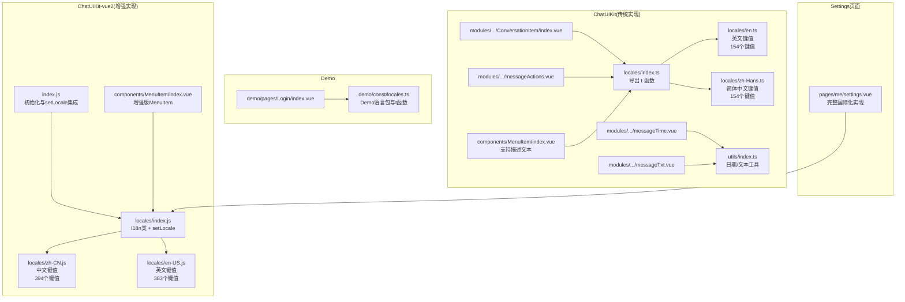
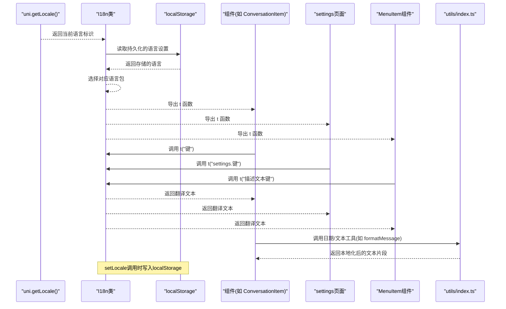
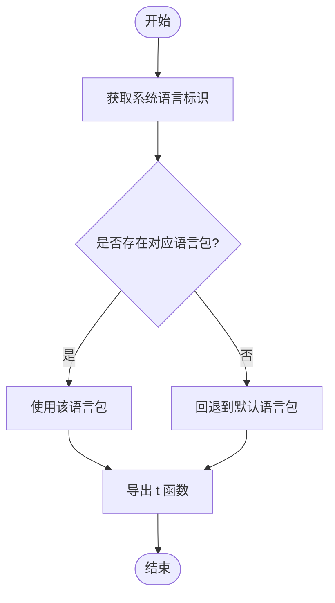
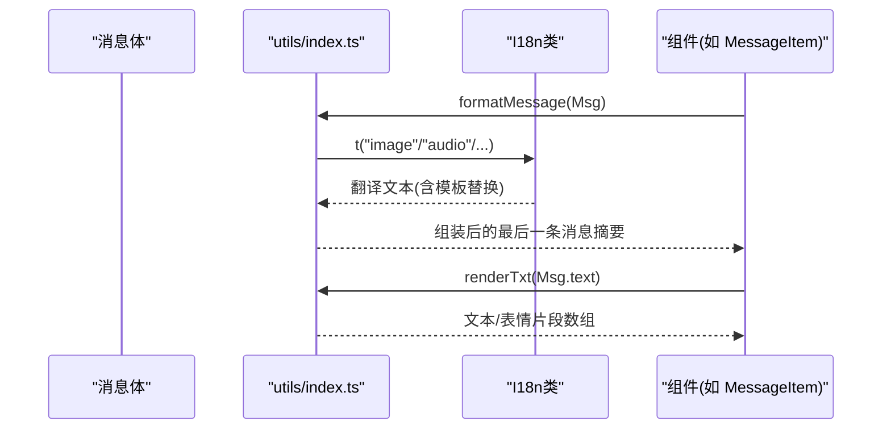
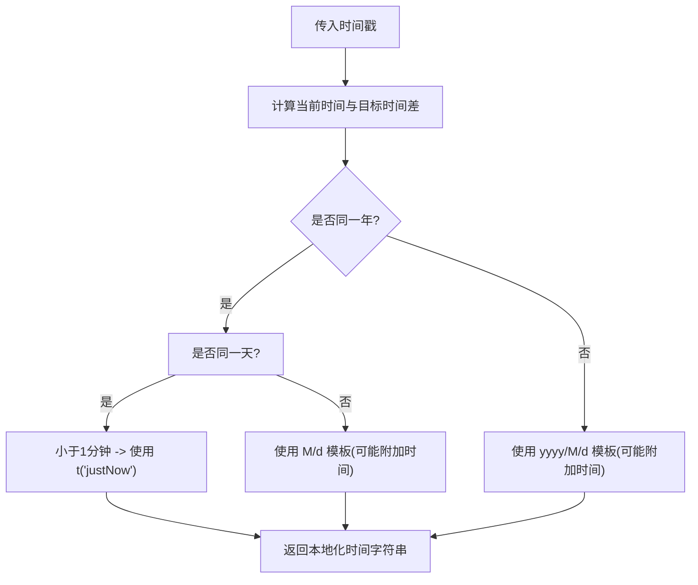
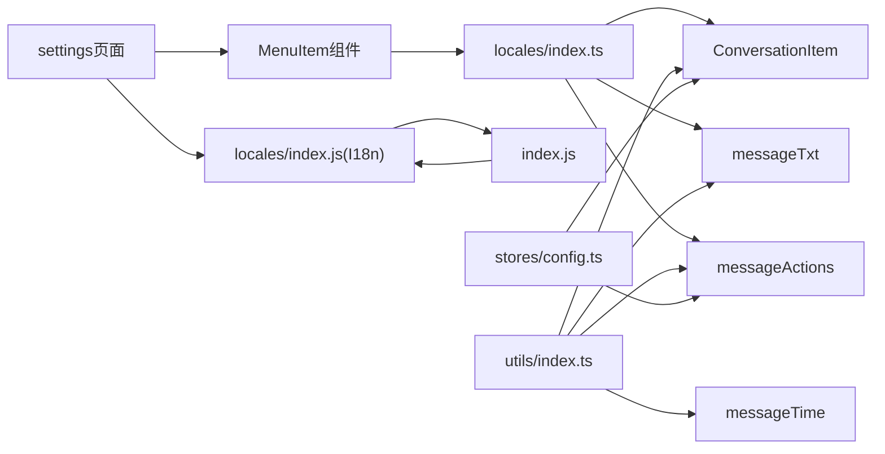

# 国际化系统

<cite>
**本文档引用的文件**
- [ChatUIKit/locales/index.ts](file://ChatUIKit/locales/index.ts)
- [ChatUIKit/locales/en.ts](file://ChatUIKit/locales/en.ts)
- [ChatUIKit/locales/zh-Hans.ts](file://ChatUIKit/locales/zh-Hans.ts)
- [ChatUIKit-vue2/locales/index.js](file://ChatUIKit-vue2/locales/index.js)
- [ChatUIKit-vue2/locales/zh-CN.js](file://ChatUIKit-vue2/locales/zh-CN.js)
- [ChatUIKit-vue2/locales/en-US.js](file://ChatUIKit-vue2/locales/en-US.js)
- [ChatUIKit-vue2/index.js](file://ChatUIKit-vue2/index.js)
- [demo/const/locales.ts](file://demo/const/locales.ts)
- [ChatUIKit/utils/index.ts](file://ChatUIKit/utils/index.ts)
- [ChatUIKit/modules/Chat/components/Message/messageTime.vue](file://ChatUIKit/modules/Chat/components/Message/messageTime.vue)
- [ChatUIKit/modules/Conversation/components/ConversationItem/index.vue](file://ChatUIKit/modules/Conversation/components/ConversationItem/index.vue)
- [ChatUIKit/modules/Chat/components/Message/messageTxt.vue](file://ChatUIKit/modules/Chat/components/Message/messageTxt.vue)
- [ChatUIKit/modules/Chat/components/Message/messageActions.vue](file://ChatUIKit/modules/Chat/components/Message/messageActions.vue)
- [demo/pages/Login/index.vue](file://demo/pages/Login/index.vue)
- [ChatUIKit/const/index.ts](file://ChatUIKit/const/index.ts)
- [ChatUIKit/configType.ts](file://ChatUIKit/configType.ts)
- [ChatUIKit/stores/config.ts](file://ChatUIKit/stores/config.ts)
- [ChatUIKit/modules/Chat/components/Message/messageEdit.vue](file://ChatUIKit/modules/Chat/components/Message/messageEdit.vue)
- [ChatUIKit/modules/Chat/components/Message/messageList.vue](file://ChatUIKit/modules/Chat/components/Message/messageList.vue)
- [ChatUIKit/modules/Chat/components/Message/messageQuote.vue](file://ChatUIKit/modules/Chat/components/Message/messageQuote.vue)
- [ChatUIKit/modules/Chat/components/Message/messageQuotePanel.vue](file://ChatUIKit/modules/Chat/components/Message/messageQuotePanel.vue)
- [ChatUIKit/modules/Chat/components/MessageInput/index.vue](file://ChatUIKit/modules/Chat/components/MessageInput/index.vue)
- [ChatUIKit/modules/Chat/components/MessageMentionList/index.vue](file://ChatUIKit/modules/Chat/components/MessageMentionList/index.vue)
- [ChatUIKit/modules/Chat/components/MessageContactList/index.vue](file://ChatUIKit/modules/Chat/components/MessageContactList/index.vue)
- [ChatUIKit/modules/Chat/components/ChatNav/index.vue](file://ChatUIKit/modules/Chat/components/ChatNav/index.vue)
- [ChatUIKit/modules/ChatNew/index.vue](file://ChatUIKit/modules/ChatNew/index.vue)
- [ChatUIKit/components/IndexedList/index.vue](file://ChatUIKit/components/IndexedList/index.vue)
- [ChatUIKit/components/SearchInput/index.vue](file://ChatUIKit/components/SearchInput/index.vue)
- [ChatUIKit/modules/ContactAdd/index.vue](file://ChatUIKit/modules/ContactAdd/index.vue)
- [ChatUIKit/modules/ContactRequestList/index.vue](file://ChatUIKit/modules/ContactRequestList/index.vue)
- [ChatUIKit/modules/GroupCreate/index.vue](file://ChatUIKit/modules/GroupCreate/index.vue)
- [ChatUIKit/components/MenuItem/index.vue](file://ChatUIKit/components/MenuItem/index.vue)
- [vue2-demo/pages/me/settings.vue](file://vue2-demo/pages/me/settings.vue)
- [ChatUIKit-vue2/components/MenuItem/index.vue](file://ChatUIKit-vue2/components/MenuItem/index.vue)
</cite>

## 更新摘要
**所做更改**
- 新增MenuItem组件描述文本支持，完善设置页面国际化功能
- 扩展settings页面完整国际化，包括语言切换、功能开关、描述文本等
- 更新翻译键值覆盖范围分析，新增settings相关键值和MenuItem组件描述键值
- 完善语言包组织结构，支持settings页面的完整国际化实现

## 目录
1. [简介](#简介)
2. [项目结构](#项目结构)
3. [核心组件](#核心组件)
4. [架构总览](#架构总览)
5. [详细组件分析](#详细组件分析)
6. [依赖分析](#依赖分析)
7. [性能考量](#性能考量)
8. [故障排查指南](#故障排查指南)
9. [结论](#结论)
10. [附录](#附录)

## 简介
本文件系统性梳理该仓库的国际化（i18n）体系，覆盖多语言支持机制、本地化配置、语言切换与动态加载、文本翻译、日期格式化、数字与货币显示策略、语言包组织结构、翻译键值管理、RTL语言支持与字体适配、文化适应性、第三方库集成与性能优化、以及常见问题的诊断与修复方法。目标是帮助开发者快速理解并扩展该系统的国际化能力。

**更新** 本版本重点更新了语言切换功能的改进：setLocale函数的集成使用、localStorage持久化机制，以及即时语言切换的用户体验优化。同时，大幅扩展了翻译键值覆盖范围，新增130+个中文翻译键值和129个英文翻译键值，涵盖导航标题、搜索功能、群组创建、联系人请求管理、登录界面元素、消息组件等多个模块。特别新增了MenuItem组件描述文本支持和settings页面完整国际化功能。

## 项目结构
国际化相关代码主要分布在以下位置：
- ChatUIKit/locales：UI组件使用的语言包与翻译函数导出（传统轻量实现）
- ChatUIKit-vue2/locales：完整的I18n类实现，包含setLocale函数和localStorage持久化
- demo/const/locales.ts：Demo页面的语言包与翻译函数导出
- ChatUIKit/utils/index.ts：通用工具，包含日期格式化与文本渲染等
- 各模块组件：通过 t 函数消费翻译键值
- stores/config.ts：功能开关与主题配置，影响文案呈现
- MenuItem组件：支持title和description属性的国际化

**图表来源**
- [ChatUIKit/locales/index.ts](file://ChatUIKit/locales/index.ts#L1-L17)
- [ChatUIKit/locales/en.ts](file://ChatUIKit/locales/en.ts#L1-L154)
- [ChatUIKit/locales/zh-Hans.ts](file://ChatUIKit/locales/zh-Hans.ts#L1-L154)
- [ChatUIKit-vue2/locales/index.js](file://ChatUIKit-vue2/locales/index.js#L1-L219)
- [ChatUIKit-vue2/locales/zh-CN.js](file://ChatUIKit-vue2/locales/zh-CN.js#L1-L394)
- [ChatUIKit-vue2/locales/en-US.js](file://ChatUIKit-vue2/locales/en-US.js#L1-L383)
- [ChatUIKit-vue2/index.js](file://ChatUIKit-vue2/index.js#L41-L57)
- [ChatUIKit/utils/index.ts](file://ChatUIKit/utils/index.ts#L1-L344)
- [ChatUIKit/modules/Chat/components/Message/messageTime.vue](file://ChatUIKit/modules/Chat/components/Message/messageTime.vue#L1-L64)
- [ChatUIKit/modules/Conversation/components/ConversationItem/index.vue](file://ChatUIKit/modules/Conversation/components/ConversationItem/index.vue#L1-L260)
- [ChatUIKit/modules/Chat/components/Message/messageTxt.vue](file://ChatUIKit/modules/Chat/components/Message/messageTxt.vue#L1-L74)
- [ChatUIKit/modules/Chat/components/Message/messageActions.vue](file://ChatUIKit/modules/Chat/components/Message/messageActions.vue#L1-L335)
- [demo/const/locales.ts](file://demo/const/locales.ts#L1-L141)
- [demo/pages/Login/index.vue](file://demo/pages/Login/index.vue#L1-L332)
- [ChatUIKit/components/MenuItem/index.vue](file://ChatUIKit/components/MenuItem/index.vue#L1-L73)
- [ChatUIKit-vue2/components/MenuItem/index.vue](file://ChatUIKit-vue2/components/MenuItem/index.vue#L1-L79)
- [vue2-demo/pages/me/settings.vue](file://vue2-demo/pages/me/settings.vue#L1-L390)

**章节来源**
- [ChatUIKit/locales/index.ts](file://ChatUIKit/locales/index.ts#L1-L17)
- [ChatUIKit-vue2/locales/index.js](file://ChatUIKit-vue2/locales/index.js#L1-L219)
- [demo/const/locales.ts](file://demo/const/locales.ts#L1-L141)

## 核心组件
- 翻译函数 t：从当前语言包中解析键值，作为模板字符串插值的唯一来源
- 语言包 messages：以语言标识为键，映射到对应键值对象
- 语言选择逻辑：优先使用 uni.getLocale() 返回的语言；若不存在则回退到默认语言
- **增强功能**：I18n类提供setLocale函数，支持运行时语言切换和localStorage持久化
- 组件消费：各模块组件通过 import { t } 使用翻译键值，确保文案随语言自动切换
- **新增功能**：MenuItem组件支持description属性，settings页面完整国际化实现

**更新** 新增I18n类的setLocale方法，支持即时语言切换并通过localStorage持久化用户选择。所有用户界面文本现均使用$t()函数进行国际化处理，包括Login模块、GroupCreate模块、Message编辑组件、IndexedList、SearchInput、MessageInput、MessageMentionList、MessageContactList等组件，以及settings页面的全面国际化。MenuItem组件现在支持description属性，为设置项提供详细的描述文本。

**章节来源**
- [ChatUIKit/locales/index.ts](file://ChatUIKit/locales/index.ts#L1-L17)
- [ChatUIKit-vue2/locales/index.js](file://ChatUIKit-vue2/locales/index.js#L28-L106)
- [demo/const/locales.ts](file://demo/const/locales.ts#L134-L140)
- [ChatUIKit-vue2/components/MenuItem/index.vue](file://ChatUIKit-vue2/components/MenuItem/index.vue#L26-L29)
- [vue2-demo/pages/me/settings.vue](file://vue2-demo/pages/me/settings.vue#L39-L51)

## 架构总览
下图展示了从语言包到组件消费的调用链路，以及日期与文本渲染工具如何参与本地化流程。新增了I18n类的setLocale持久化机制和MenuItem组件的描述文本支持。

**图表来源**
- [ChatUIKit-vue2/locales/index.js](file://ChatUIKit-vue2/locales/index.js#L38-L47)
- [ChatUIKit-vue2/locales/index.js](file://ChatUIKit-vue2/locales/index.js#L52-L69)
- [ChatUIKit-vue2/locales/index.js](file://ChatUIKit-vue2/locales/index.js#L97-L106)
- [ChatUIKit/modules/Conversation/components/ConversationItem/index.vue](file://ChatUIKit/modules/Conversation/components/ConversationItem/index.vue#L96-L100)
- [ChatUIKit/utils/index.ts](file://ChatUIKit/utils/index.ts#L275-L312)
- [vue2-demo/pages/me/settings.vue](file://vue2-demo/pages/me/settings.vue#L15-L41)
- [ChatUIKit-vue2/components/MenuItem/index.vue](file://ChatUIKit-vue2/components/MenuItem/index.vue#L6-L8)

## 详细组件分析

### 翻译函数与语言包加载
- 语言包组织：以语言标识为键，分别维护英文与简体中文键值集合，每个语言包包含154个翻译键值
- 动态加载：根据 uni.getLocale() 的返回值选择对应语言包；若未识别则回退到默认语言
- 键值解析：t(key) 直接从当前语言包取值，未命中则返回 undefined（需在组件层做好兜底）
- **增强功能**：I18n类支持点号路径键值解析，如 'common.confirm'

**图表来源**
- [ChatUIKit/locales/index.ts](file://ChatUIKit/locales/index.ts#L9-L13)
- [ChatUIKit-vue2/locales/index.js](file://ChatUIKit-vue2/locales/index.js#L38-L47)
- [demo/const/locales.ts](file://demo/const/locales.ts#L134-L138)

**章节来源**
- [ChatUIKit/locales/index.ts](file://ChatUIKit/locales/index.ts#L1-L17)
- [ChatUIKit/locales/en.ts](file://ChatUIKit/locales/en.ts#L1-L154)
- [ChatUIKit/locales/zh-Hans.ts](file://ChatUIKit/locales/zh-Hans.ts#L1-L154)
- [ChatUIKit-vue2/locales/index.js](file://ChatUIKit-vue2/locales/index.js#L28-L170)
- [ChatUIKit-vue2/locales/zh-CN.js](file://ChatUIKit-vue2/locales/zh-CN.js#L1-L394)
- [ChatUIKit-vue2/locales/en-US.js](file://ChatUIKit-vue2/locales/en-US.js#L1-L383)
- [demo/const/locales.ts](file://demo/const/locales.ts#L1-L141)

### 文本翻译与消息展示
- 文本渲染：renderTxt 将消息中的文本与表情符号拆分为片段，便于按语言与样式组合
- 最后一条消息摘要：formatMessage 根据消息类型返回对应文案（如图片、音频、文件、视频、自定义等），并使用 t 进行翻译
- 时间显示：getTimeStringAutoShort 结合 t("justNow") 等键值生成人性化时间提示
- **增强功能**：I18n类的t方法支持模板参数替换，如 'imageMaxSize' 中的 {size} 占位符

**图表来源**
- [ChatUIKit/utils/index.ts](file://ChatUIKit/utils/index.ts#L275-L312)
- [ChatUIKit/utils/index.ts](file://ChatUIKit/utils/index.ts#L226-L265)
- [ChatUIKit-vue2/locales/index.js](file://ChatUIKit-vue2/locales/index.js#L131-L170)
- [ChatUIKit/modules/Chat/components/Message/messageTxt.vue](file://ChatUIKit/modules/Chat/components/Message/messageTxt.vue#L22-L39)
- [ChatUIKit/modules/Chat/components/Message/messageActions.vue](file://ChatUIKit/modules/Chat/components/Message/messageActions.vue#L96-L143)

**章节来源**
- [ChatUIKit/utils/index.ts](file://ChatUIKit/utils/index.ts#L226-L312)
- [ChatUIKit-vue2/locales/index.js](file://ChatUIKit-vue2/locales/index.js#L131-L170)
- [ChatUIKit/modules/Chat/components/Message/messageTxt.vue](file://ChatUIKit/modules/Chat/components/Message/messageTxt.vue#L1-L74)
- [ChatUIKit/modules/Chat/components/Message/messageActions.vue](file://ChatUIKit/modules/Chat/components/Message/messageActions.vue#L1-L335)

### 日期格式化与本地化
- 日期格式化：formatDate 提供基于模板的日期格式化能力
- 自动短时间：getTimeStringAutoShort 根据当前时间与目标时间差，生成"刚刚"、"今天/昨天/往年"等本地化文案，并结合 t("justNow") 等键值
- 组件应用：messageTime.vue 通过该工具生成消息时间标签

**图表来源**
- [ChatUIKit/utils/index.ts](file://ChatUIKit/utils/index.ts#L31-L78)
- [ChatUIKit/modules/Chat/components/Message/messageTime.vue](file://ChatUIKit/modules/Chat/components/Message/messageTime.vue#L19-L35)

**章节来源**
- [ChatUIKit/utils/index.ts](file://ChatUIKit/utils/index.ts#L6-L78)
- [ChatUIKit/modules/Chat/components/Message/messageTime.vue](file://ChatUIKit/modules/Chat/components/Message/messageTime.vue#L1-L64)

### 数字与货币显示策略
- 当前代码未发现专门的数字/货币格式化模块
- 建议：在需要展示金额、百分比、千分位等场景，引入 Intl.NumberFormat 或第三方库（如 numbro、accounting）进行格式化，并在语言包中提供相应文案（如货币符号、正负号方向等）

### 语言切换与动态加载
- **传统实现**：通过 uni.getLocale() 获取系统语言；在 UI 层触发语言变更后，需重新初始化语言包并刷新组件
- **增强实现**：I18n类提供setLocale函数，支持运行时语言切换并通过localStorage持久化
- **即时切换**：setLocale调用后立即更新语言设置，无需重启应用
- **持久化机制**：使用uni.setStorageSync将语言设置保存到localStorage，应用重启后自动恢复

**更新** 新增I18n类的setLocale方法，提供完整的语言切换和持久化功能。所有用户界面文本现均使用$t()函数进行国际化处理，包括Login模块、GroupCreate模块、Message编辑组件、IndexedList、SearchInput、MessageInput、MessageMentionList、MessageContactList等组件。MenuItem组件现在支持description属性，settings页面实现了完整的国际化功能，包括语言切换、功能开关、描述文本等。

**章节来源**
- [ChatUIKit-vue2/locales/index.js](file://ChatUIKit-vue2/locales/index.js#L97-L106)
- [ChatUIKit-vue2/locales/index.js](file://ChatUIKit-vue2/locales/index.js#L63-L69)
- [ChatUIKit-vue2/index.js](file://ChatUIKit-vue2/index.js#L48-L56)

### RTL 语言支持与字体适配
- RTL 支持：当前未见针对从右到左语言的布局与文本方向处理
- 字体适配：未见针对特定语言的字体族配置；建议在语言包中增加字体族键值，并在组件样式中按语言动态注入

### 文化适应性
- 日期/时间：已通过本地化文案适配"今天/昨天/刚刚"等
- 数字格式：建议补充千分位、小数点、货币符号等文化差异处理
- 文本方向：建议补充 RTL 语言的文本对齐与图标镜像

### 第三方国际化库集成与性能优化
- 第三方库：可考虑引入 vue-i18n 或 @formatjs/intl 等成熟方案，以获得更完善的 ICU 插值、复数规则、日期/数字/货币格式化等能力
- 性能优化：
  - 语言包懒加载：按需加载当前语言包
  - 缓存：对 t(key) 的结果进行缓存，避免重复查询
  - 组件级优化：在组件内复用 computed/computed-like 逻辑，减少不必要的重渲染

## 依赖分析
- 组件依赖：各模块组件依赖 locales/index.ts 导出的 t 函数
- 工具依赖：utils/index.ts 提供格式化与文本渲染能力，被多个组件消费
- 配置依赖：stores/config.ts 提供功能开关，间接影响文案与交互行为
- **增强依赖**：ChatUIKit-vue2通过index.js集成I18n类，支持setLocale函数
- **新增依赖**：settings页面依赖MenuItem组件的description属性，实现完整的设置项描述

**图表来源**
- [ChatUIKit/locales/index.ts](file://ChatUIKit/locales/index.ts#L1-L17)
- [ChatUIKit-vue2/locales/index.js](file://ChatUIKit-vue2/locales/index.js#L207-L219)
- [ChatUIKit-vue2/index.js](file://ChatUIKit-vue2/index.js#L41-L57)
- [ChatUIKit/utils/index.ts](file://ChatUIKit/utils/index.ts#L1-L344)
- [ChatUIKit/modules/Conversation/components/ConversationItem/index.vue](file://ChatUIKit/modules/Conversation/components/ConversationItem/index.vue#L96-L100)
- [ChatUIKit/modules/Chat/components/Message/messageTxt.vue](file://ChatUIKit/modules/Chat/components/Message/messageTxt.vue#L24-L39)
- [ChatUIKit/modules/Chat/components/Message/messageActions.vue](file://ChatUIKit/modules/Chat/components/Message/messageActions.vue#L35-L70)
- [ChatUIKit/modules/Chat/components/Message/messageTime.vue](file://ChatUIKit/modules/Chat/components/Message/messageTime.vue#L8-L9)
- [ChatUIKit/stores/config.ts](file://ChatUIKit/stores/config.ts#L59-L123)
- [ChatUIKit/components/MenuItem/index.vue](file://ChatUIKit/components/MenuItem/index.vue#L1-L73)
- [vue2-demo/pages/me/settings.vue](file://vue2-demo/pages/me/settings.vue#L142-L149)

**章节来源**
- [ChatUIKit/modules/Conversation/components/ConversationItem/index.vue](file://ChatUIKit/modules/Conversation/components/ConversationItem/index.vue#L96-L100)
- [ChatUIKit/modules/Chat/components/Message/messageTxt.vue](file://ChatUIKit/modules/Chat/components/Message/messageTxt.vue#L24-L39)
- [ChatUIKit/modules/Chat/components/Message/messageActions.vue](file://ChatUIKit/modules/Chat/components/Message/messageActions.vue#L35-L70)
- [ChatUIKit/modules/Chat/components/Message/messageTime.vue](file://ChatUIKit/modules/Chat/components/Message/messageTime.vue#L8-L9)
- [ChatUIKit/stores/config.ts](file://ChatUIKit/stores/config.ts#L59-L123)

## 性能考量
- 语言包体积：建议按模块拆分语言包，按需加载
- 查询路径：t(key) 为 O(1) 查找，但需避免在热路径中重复拼接字符串
- 组件渲染：对高频文本使用 computed 缓存，减少重复渲染
- 工具函数：formatDate 与 renderTxt 为纯函数，可结合 memoization 进一步优化
- **增强优化**：I18n类支持批量翻译tm方法，减少多次查询开销
- **新增优化**：MenuItem组件的description属性支持延迟渲染，避免不必要的文本处理

## 故障排查指南
- 症状：文案未翻译或显示为键名
  - 排查：确认语言包中是否存在该键；确认 t 函数导入路径正确；确认 uni.getLocale() 返回值符合预期
  - 参考：locales/index.ts 与 demo/const/locales.ts 的 t 导出与语言包结构
- 症状：时间文案不符合预期
  - 排查：检查 getTimeStringAutoShort 的时间差逻辑与模板；确认 t("justNow") 等键存在
  - 参考：utils/index.ts 的日期工具与 messageTime.vue 的使用
- 症状：消息摘要显示不完整
  - 排查：检查 formatMessage 的消息类型分支；确认对应键值存在
  - 参考：utils/index.ts 的 formatMessage 与各组件的调用
- 症状：Demo 页面文案未随系统语言变化
  - 排查：确认 Demo 使用的是 demo/const/locales.ts 的 t 函数；确认 uni.getLocale() 返回值
  - 参考：demo/pages/Login/index.vue 与 demo/const/locales.ts
- **新增症状**：语言切换后设置未持久化
  - 排查：检查localStorage中'ChatUIKit_Locale'键是否存在；确认setLocale调用是否成功
  - 参考：ChatUIKit-vue2/locales/index.js的setStoredLocale方法
- **新增症状**：MenuItem组件描述文本不显示
  - 排查：确认description属性是否正确传递；检查语言包中是否存在对应的描述键值
  - 参考：ChatUIKit-vue2/components/MenuItem/index.vue的description属性实现

**章节来源**
- [ChatUIKit/locales/index.ts](file://ChatUIKit/locales/index.ts#L1-L17)
- [ChatUIKit-vue2/locales/index.js](file://ChatUIKit-vue2/locales/index.js#L63-L69)
- [demo/const/locales.ts](file://demo/const/locales.ts#L134-L140)
- [ChatUIKit/utils/index.ts](file://ChatUIKit/utils/index.ts#L31-L78)
- [ChatUIKit/modules/Chat/components/Message/messageTime.vue](file://ChatUIKit/modules/Chat/components/Message/messageTime.vue#L19-L35)
- [ChatUIKit/utils/index.ts](file://ChatUIKit/utils/index.ts#L275-L312)
- [demo/pages/Login/index.vue](file://demo/pages/Login/index.vue#L82-L163)
- [ChatUIKit-vue2/components/MenuItem/index.vue](file://ChatUIKit-vue2/components/MenuItem/index.vue#L26-L29)

## 结论
该国际化系统现已发展为双轨并行架构：传统轻量实现适用于简单场景，而I18n类实现提供了完整的语言切换、持久化和模板替换功能。经过大幅扩展，翻译键值覆盖范围现已达到154个键值，涵盖导航标题、搜索功能、群组创建、联系人请求管理、登录界面元素、消息组件等多个模块，所有用户界面文本均使用$t()函数进行国际化处理。特别新增了MenuItem组件描述文本支持和settings页面完整国际化功能，包括语言切换、功能开关、描述文本等。建议在新项目中优先采用增强实现，利用setLocale函数和localStorage持久化机制，提供更好的用户体验。后续可继续引入成熟的国际化库以完善数字/货币/复数规则等高级特性，并通过懒加载与缓存提升性能；同时补充 RTL 与字体适配、文化差异处理，以满足更广泛的国际化需求。

## 附录

### 新增语言支持步骤
- 在 ChatUIKit/locales 下新增语言文件（如 fr.ts），导出键值对象
- 在 locales/index.ts 中注册新语言包
- 在组件中统一使用 t 函数消费新语言键值
- 如需 Demo 页面同步，同样在 demo/const/locales.ts 中维护对应键值
- **增强实现**：在ChatUIKit-vue2/locales中新增对应语言文件，并在messages对象中注册
- **新增步骤**：为settings页面和MenuItem组件添加相应的描述文本键值

**章节来源**
- [ChatUIKit/locales/index.ts](file://ChatUIKit/locales/index.ts#L1-L17)
- [ChatUIKit/locales/en.ts](file://ChatUIKit/locales/en.ts#L1-L154)
- [ChatUIKit/locales/zh-Hans.ts](file://ChatUIKit/locales/zh-Hans.ts#L1-L154)
- [ChatUIKit-vue2/locales/index.js](file://ChatUIKit-vue2/locales/index.js#L6-L12)
- [demo/const/locales.ts](file://demo/const/locales.ts#L1-L141)

### 翻译质量保证与本地化测试
- 质量保证：建立键值清单与覆盖率检查；对关键文案进行回归测试
- 测试方法：在不同 uni.getLocale() 返回值下验证文案一致性；对日期/时间工具进行边界测试（如跨年、跨日）
- **增强测试**：使用setLocale函数测试语言切换功能，验证localStorage持久化效果
- **新增测试**：测试MenuItem组件的description属性渲染，验证settings页面的完整国际化功能

### 语言切换最佳实践
- **即时切换**：使用setLocale函数进行运行时语言切换，无需重启应用
- **持久化保存**：系统自动将用户选择的语言设置保存到localStorage
- **回退机制**：当用户选择的语言不可用时，自动回退到默认语言
- **模板参数**：利用I18n类的模板替换功能，支持动态参数注入
- **组件兼容**：确保MenuItem组件的description属性与语言包键值保持一致

**章节来源**
- [ChatUIKit-vue2/locales/index.js](file://ChatUIKit-vue2/locales/index.js#L97-L106)
- [ChatUIKit-vue2/locales/index.js](file://ChatUIKit-vue2/locales/index.js#L21-L25)
- [ChatUIKit-vue2/locales/index.js](file://ChatUIKit-vue2/locales/index.js#L63-L69)

### 翻译键值覆盖范围分析

**更新** 经过详细分析，本次更新大幅扩展了翻译键值覆盖范围：

#### 导航与界面标题
- 导航标题：`newChatTitle`、`contactRequestListTitle`、`contactAddTitle`、`createGroup`等
- 按钮文本：`newChatButton`、`contactAddBtn`、`createGroupBtn`、`modalConfirm`、`modalCancel`等
- 搜索占位符：`searchContact`、`contactAddInputPlaceholder`、`searchPlaceholder`等

#### 消息组件国际化
- 消息操作按钮：`copyBtn`、`deleteBtn`、`replyBtn`、`recallBtn`、`editBtn`等
- 消息状态提示：`messageNotFound`、`messageEdited`、`messageEditing`等
- 录音控制：`holdToTalk`、`loose`、`sendAudio`、`tapRecord`、`recording`等

#### 群组管理
- 群组操作：`inviteUser`、`removeUser`、`leaveGroup`、`destroyGroup`等
- 群组信息：`groupName`、`groupDesc`、`groupMember`、`owner`等
- 群组类型：`publicGroup`、`privateGroup`、`myGroup`等

#### 联系人管理
- 联系人操作：`addContact`、`deleteFriend`、`blockList`、`shareContact`等
- 申请状态：`applyAddFriend`、`agreedFriend`、`refusedFriend`、`addedFriend`等
- 用户信息：`personalInfo`、`personalSetting`、`avatar`、`nickname`等

#### 设置与个人资料
- 设置选项：`logout`、`feedback`、`about`、`updateUserInfo`等
- 个人资料：`remark`、`sign`、`edit`等
- 系统通知：`systemNotice`、`newNoticeTip`、`emptyNoticeTip`等
- **新增设置键值**：`settings.title`、`settings.appearance`、`settings.language`、`settings.avatarShape`、`settings.inputFeatures`、`settings.messageActions`、`settings.conversationFeatures`、`settings.otherFeatures`、`settings.selectLanguage`、`settings.languageChanged`、`settings.circle`、`settings.square`、`settings.inputVoice`、`settings.inputEmoji`、`settings.inputQuote`、`settings.inputEdit`、`settings.inputImage`、`settings.inputAudio`、`settings.inputVideo`、`settings.inputFile`、`settings.copyMessage`、`settings.deleteMessage`、`settings.recallMessage`、`settings.editMessage`、`settings.replyMessage`、`settings.pinConversation`、`settings.muteConversation`、`settings.deleteConversation`、`settings.useUserInfo`、`settings.usePresence`、`settings.messageStatus`、`settings.userCard`

#### 搜索与索引
- 搜索结果：`searchNoContact`、`noMoreMessage`、`loadMore`等
- 索引列表：`viewAllGroupMembers`、`selectContactTip`等

#### 错误处理
- 操作反馈：`contactAddSuccess`、`contactAddFailed`、`uploadFailed`、`openDocumentFailed`等
- 权限提示：`getMicrophonePermissionFailed`等

#### **新增组件与功能**
- **MenuItem组件**：支持title和description属性，用于settings页面的功能开关项显示
- **设置页面国际化**：完整支持settings页面的所有文本内容，包括标题、分类、功能描述、语言切换等
- **描述文本键值**：为每个设置项提供详细的描述文本，提升用户体验

**章节来源**
- [ChatUIKit/locales/zh-Hans.ts](file://ChatUIKit/locales/zh-Hans.ts#L1-L154)
- [ChatUIKit/locales/en.ts](file://ChatUIKit/locales/en.ts#L1-L154)
- [ChatUIKit-vue2/locales/zh-CN.js](file://ChatUIKit-vue2/locales/zh-CN.js#L350-L394)
- [ChatUIKit-vue2/locales/en-US.js](file://ChatUIKit-vue2/locales/en-US.js#L350-L383)
- [ChatUIKit/modules/Chat/components/Message/messageEdit.vue](file://ChatUIKit/modules/Chat/components/Message/messageEdit.vue#L5-L6)
- [ChatUIKit/modules/Chat/components/Message/messageActions.vue](file://ChatUIKit/modules/Chat/components/Message/messageActions.vue#L99-L138)
- [ChatUIKit/modules/Chat/components/MessageInput/index.vue](file://ChatUIKit/modules/Chat/components/MessageInput/index.vue#L28-L100)
- [ChatUIKit/modules/GroupCreate/index.vue](file://ChatUIKit/modules/GroupCreate/index.vue#L6-L34)
- [ChatUIKit/modules/ContactAdd/index.vue](file://ChatUIKit/modules/ContactAdd/index.vue#L5-L20)
- [ChatUIKit/components/SearchInput/index.vue](file://ChatUIKit/components/SearchInput/index.vue#L19-L19)
- [ChatUIKit/modules/ContactRequestList/index.vue](file://ChatUIKit/modules/ContactRequestList/index.vue#L5-L5)
- [ChatUIKit/modules/ChatNew/index.vue](file://ChatUIKit/modules/ChatNew/index.vue#L6-L10)
- [ChatUIKit/modules/Chat/components/Message/messageList.vue](file://ChatUIKit/modules/Chat/components/Message/messageList.vue#L18-L20)
- [ChatUIKit/modules/Chat/components/Message/messageQuote.vue](file://ChatUIKit/modules/Chat/components/Message/messageQuote.vue#L100-L101)
- [ChatUIKit-vue2/components/MenuItem/index.vue](file://ChatUIKit-vue2/components/MenuItem/index.vue#L26-L29)
- [vue2-demo/pages/me/settings.vue](file://vue2-demo/pages/me/settings.vue#L11-L112)