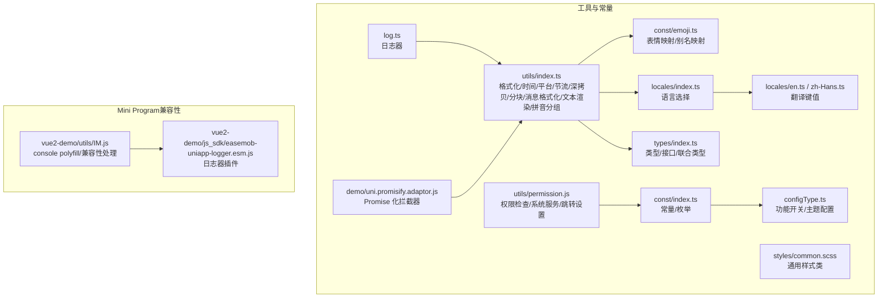
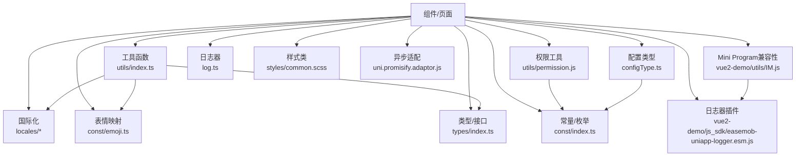
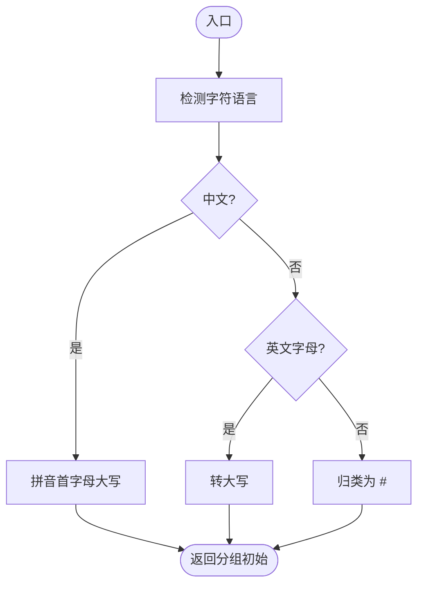
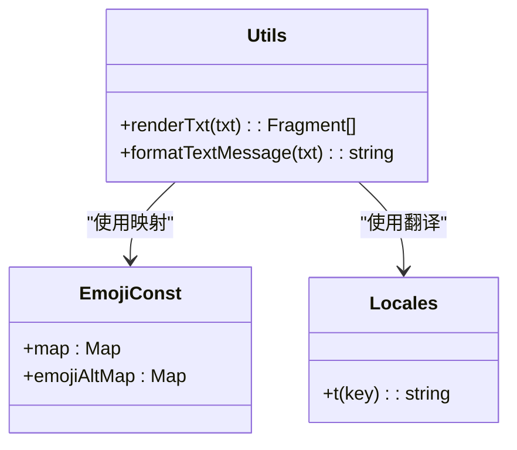
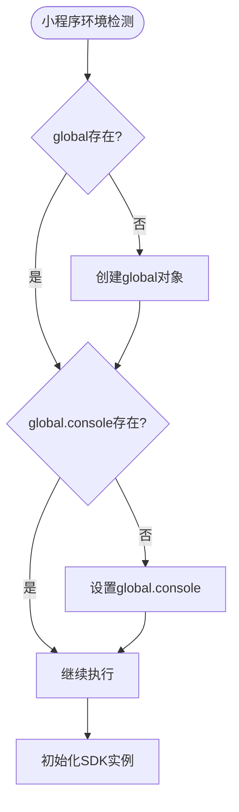
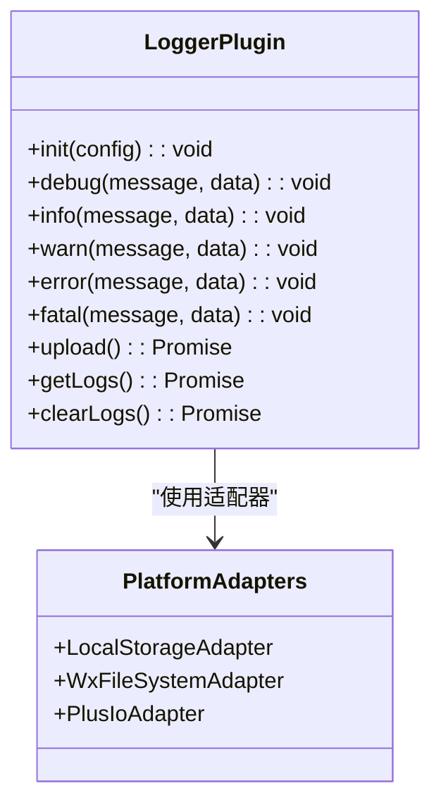
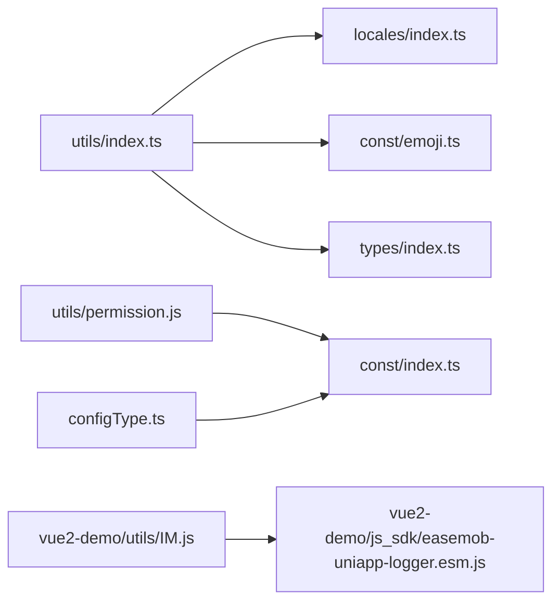

# 工具函数和常量

<cite>
**本文引用的文件**
- [ChatUIKit/utils/index.ts](file://ChatUIKit/utils/index.ts)
- [ChatUIKit/utils/permission.js](file://ChatUIKit/utils/permission.js)
- [ChatUIKit/const/index.ts](file://ChatUIKit/const/index.ts)
- [ChatUIKit/const/emoji.ts](file://ChatUIKit/const/emoji.ts)
- [ChatUIKit/types/index.ts](file://ChatUIKit/types/index.ts)
- [ChatUIKit/styles/common.scss](file://ChatUIKit/styles/common.scss)
- [ChatUIKit/locales/index.ts](file://ChatUIKit/locales/index.ts)
- [ChatUIKit/locales/en.ts](file://ChatUIKit/locales/en.ts)
- [ChatUIKit/locales/zh-Hans.ts](file://ChatUIKit/locales/zh-Hans.ts)
- [ChatUIKit/configType.ts](file://ChatUIKit/configType.ts)
- [ChatUIKit/log.ts](file://ChatUIKit/log.ts)
- [demo/uni.promisify.adaptor.js](file://demo/uni.promisify.adaptor.js)
- [vue2-demo/utils/IM.js](file://vue2-demo/utils/IM.js)
- [vue2-demo/js_sdk/easemob-uniapp-logger.esm.js](file://vue2-demo/js_sdk/easemob-uniapp-logger.esm.js)
</cite>

## 目录
1. [简介](#简介)
2. [项目结构](#项目结构)
3. [核心组件](#核心组件)
4. [架构总览](#架构总览)
5. [详细组件分析](#详细组件分析)
6. [依赖分析](#依赖分析)
7. [性能考虑](#性能考虑)
8. [故障排查指南](#故障排查指南)
9. [结论](#结论)
10. [附录](#附录)

## 简介
本章节面向开发者与集成者，系统梳理 UI 组件库中的工具函数与常量定义，覆盖权限检查、格式化工具、时间处理、网络与异步适配、国际化、日志、样式与主题配置等。文档以循序渐进的方式呈现，既包含代码级细节，也提供可视化图示与最佳实践建议，帮助读者快速理解并安全地在多端（H5、小程序、App）环境中使用这些能力。

**更新** 新增了Mini Program兼容性支持和日志器插件的临时禁用机制，确保在不同平台环境下的稳定运行。

## 项目结构
围绕工具与常量的相关目录与文件如下：
- 工具函数：位于 ChatUIKit/utils 下，包含通用格式化、节流、深拷贝、消息格式化、文本渲染、分块、平台检测、拼音分组等。
- 权限工具：位于 ChatUIKit/utils/permission.js，封装 iOS/Android 平台权限查询与跳转设置页逻辑。
- 常量与枚举：位于 ChatUIKit/const 下，包含群成员分页大小、提及标识、资源地址、最大消息数、用户状态列表等。
- 类型与配置：位于 ChatUIKit/types 与 ChatUIKit/configType.ts，定义消息体、状态、连接状态、功能开关与主题配置等。
- 国际化：位于 ChatUIKit/locales，提供语言切换与翻译键值。
- 日志：位于 ChatUIKit/log.ts，提供单例日志器与调试开关。
- 样式：位于 ChatUIKit/styles/common.scss，提供通用样式类。
- 异步适配：位于 demo/uni.promisify.adaptor.js，统一处理 uni API 的 Promise 化返回。
- **Mini Program兼容性**：位于 vue2-demo/utils/IM.js，增强小程序环境下的console polyfill支持。
- **日志器插件**：位于 vue2-demo/js_sdk/easemob-uniapp-logger.esm.js，提供SDK日志记录功能。



**图表来源**
- [ChatUIKit/utils/index.ts:1-344](file://ChatUIKit/utils/index.ts#L1-L344)
- [ChatUIKit/utils/permission.js:1-272](file://ChatUIKit/utils/permission.js#L1-L272)
- [ChatUIKit/const/index.ts:1-37](file://ChatUIKit/const/index.ts#L1-L37)
- [ChatUIKit/const/emoji.ts:1-127](file://ChatUIKit/const/emoji.ts#L1-L127)
- [ChatUIKit/types/index.ts:1-100](file://ChatUIKit/types/index.ts#L1-L100)
- [ChatUIKit/configType.ts:1-68](file://ChatUIKit/configType.ts#L1-L68)
- [ChatUIKit/locales/index.ts:1-17](file://ChatUIKit/locales/index.ts#L1-L17)
- [ChatUIKit/locales/en.ts:1-154](file://ChatUIKit/locales/en.ts#L1-L154)
- [ChatUIKit/locales/zh-Hans.ts:1-154](file://ChatUIKit/locales/zh-Hans.ts#L1-L154)
- [ChatUIKit/styles/common.scss:1-18](file://ChatUIKit/styles/common.scss#L1-L18)
- [ChatUIKit/log.ts:1-78](file://ChatUIKit/log.ts#L1-L78)
- [demo/uni.promisify.adaptor.js:1-13](file://demo/uni.promisify.adaptor.js#L1-L13)
- [vue2-demo/utils/IM.js:1-59](file://vue2-demo/utils/IM.js#L1-L59)
- [vue2-demo/js_sdk/easemob-uniapp-logger.esm.js:1-824](file://vue2-demo/js_sdk/easemob-uniapp-logger.esm.js#L1-L824)

**章节来源**
- [ChatUIKit/utils/index.ts:1-344](file://ChatUIKit/utils/index.ts#L1-L344)
- [ChatUIKit/utils/permission.js:1-272](file://ChatUIKit/utils/permission.js#L1-L272)
- [ChatUIKit/const/index.ts:1-37](file://ChatUIKit/const/index.ts#L1-L37)
- [ChatUIKit/const/emoji.ts:1-127](file://ChatUIKit/const/emoji.ts#L1-L127)
- [ChatUIKit/types/index.ts:1-100](file://ChatUIKit/types/index.ts#L1-L100)
- [ChatUIKit/configType.ts:1-68](file://ChatUIKit/configType.ts#L1-L68)
- [ChatUIKit/locales/index.ts:1-17](file://ChatUIKit/locales/index.ts#L1-L17)
- [ChatUIKit/locales/en.ts:1-154](file://ChatUIKit/locales/en.ts#L1-L154)
- [ChatUIKit/locales/zh-Hans.ts:1-154](file://ChatUIKit/locales/zh-Hans.ts#L1-L154)
- [ChatUIKit/styles/common.scss:1-18](file://ChatUIKit/styles/common.scss#L1-L18)
- [ChatUIKit/log.ts:1-78](file://ChatUIKit/log.ts#L1-L78)
- [demo/uni.promisify.adaptor.js:1-13](file://demo/uni.promisify.adaptor.js#L1-L13)
- [vue2-demo/utils/IM.js:1-59](file://vue2-demo/utils/IM.js#L1-L59)
- [vue2-demo/js_sdk/easemob-uniapp-logger.esm.js:1-824](file://vue2-demo/js_sdk/easemob-uniapp-logger.esm.js#L1-L824)

## 核心组件
- 通用工具函数
  - 时间与日期：格式化、相对时间字符串生成。
  - 平台检测：Safari、iOS、微信、Web、iOS/Android 运行环境判断。
  - 性能控制：节流函数。
  - 数据结构：深拷贝（支持 Date、Array、Map、Set、普通对象）。
  - 文本处理：表情别名转 Unicode、渲染富文本片段、按长度分块、消息摘要格式化、字符语言识别与拼音首字母分组。
- 权限工具
  - iOS：推送、定位、麦克风、相机、相册、通讯录、日历、备忘录权限查询。
  - Android：单权限请求 Promise 化封装。
  - 系统服务：定位服务开关检查。
  - 设置页：跳转应用权限设置页。
- 常量与枚举
  - 群成员分页大小、提及标识、资源地址、默认头像 URL、会话消息上限、用户状态列表。
- 类型与配置
  - 消息体、状态、连接状态、提及类型、会话项增强、用户信息扩展、功能开关与主题配置。
- 国际化与日志
  - 动态语言选择与翻译键值；单例日志器，支持调试开关。
- 样式与主题
  - 通用样式类（省略、隐藏、消息表情尺寸）；主题配置项（头像形状）。
- 网络与异步适配
  - 统一 Promise 化拦截器，兼容不同平台的回调风格。
- **Mini Program兼容性**
  - **console polyfill**：在小程序环境中确保global和console对象存在，避免运行时错误。
  - **条件编译**：使用#ifdef MP指令仅在小程序环境下执行兼容性处理。
- **日志器插件**
  - **SDK日志记录**：提供完整的日志记录、上传和管理功能，支持多平台（H5、小程序、App）。
  - **自动上传**：根据SDK连接状态自动上传日志文件。
  - **平台适配**：针对不同平台（plus.io、wx、内存存储）提供相应的日志存储方案。

**章节来源**
- [ChatUIKit/utils/index.ts:6-343](file://ChatUIKit/utils/index.ts#L6-L343)
- [ChatUIKit/utils/permission.js:1-272](file://ChatUIKit/utils/permission.js#L1-L272)
- [ChatUIKit/const/index.ts:1-37](file://ChatUIKit/const/index.ts#L1-L37)
- [ChatUIKit/types/index.ts:1-100](file://ChatUIKit/types/index.ts#L1-L100)
- [ChatUIKit/configType.ts:1-68](file://ChatUIKit/configType.ts#L1-L68)
- [ChatUIKit/locales/index.ts:1-17](file://ChatUIKit/locales/index.ts#L1-L17)
- [ChatUIKit/log.ts:1-78](file://ChatUIKit/log.ts#L1-L78)
- [ChatUIKit/styles/common.scss:1-18](file://ChatUIKit/styles/common.scss#L1-L18)
- [demo/uni.promisify.adaptor.js:1-13](file://demo/uni.promisify.adaptor.js#L1-L13)
- [vue2-demo/utils/IM.js:8-16](file://vue2-demo/utils/IM.js#L8-L16)
- [vue2-demo/js_sdk/easemob-uniapp-logger.esm.js:1-824](file://vue2-demo/js_sdk/easemob-uniapp-logger.esm.js#L1-L824)

## 架构总览
下图展示了工具层与业务层的交互关系，强调工具函数如何被各模块复用，并通过国际化、类型系统与配置体系形成稳定边界。新增的Mini Program兼容性和日志器插件为多端环境提供了更好的支持。



**图表来源**
- [ChatUIKit/utils/index.ts:1-344](file://ChatUIKit/utils/index.ts#L1-L344)
- [ChatUIKit/utils/permission.js:1-272](file://ChatUIKit/utils/permission.js#L1-L272)
- [ChatUIKit/const/index.ts:1-37](file://ChatUIKit/const/index.ts#L1-L37)
- [ChatUIKit/const/emoji.ts:1-127](file://ChatUIKit/const/emoji.ts#L1-L127)
- [ChatUIKit/types/index.ts:1-100](file://ChatUIKit/types/index.ts#L1-L100)
- [ChatUIKit/configType.ts:1-68](file://ChatUIKit/configType.ts#L1-L68)
- [ChatUIKit/locales/index.ts:1-17](file://ChatUIKit/locales/index.ts#L1-L17)
- [ChatUIKit/log.ts:1-78](file://ChatUIKit/log.ts#L1-L78)
- [ChatUIKit/styles/common.scss:1-18](file://ChatUIKit/styles/common.scss#L1-L18)
- [demo/uni.promisify.adaptor.js:1-13](file://demo/uni.promisify.adaptor.js#L1-L13)
- [vue2-demo/utils/IM.js:1-59](file://vue2-demo/utils/IM.js#L1-L59)
- [vue2-demo/js_sdk/easemob-uniapp-logger.esm.js:1-824](file://vue2-demo/js_sdk/easemob-uniapp-logger.esm.js#L1-L824)

## 详细组件分析

### 通用工具函数
- 时间与日期
  - 日期格式化：支持 y、M、d、h、m、s、q、S 等占位符，按模板输出。
  - 相对时间：根据当前时间与目标时间差，自动输出"刚刚""时:分""年/月/日"等本地化文案。
- 平台检测
  - 浏览器与系统：Safari、iOS、微信、Web、iOS/Android。
  - 通过全局对象与 uni 平台信息判断，避免在不支持的环境调用。
- 性能控制
  - 节流：在限定周期内仅执行一次，其余请求延后到周期结束触发。
- 数据结构
  - 深拷贝：递归处理基础类型、Date、Array、Map、Set、普通对象，确保嵌套结构安全复制。
- 文本处理
  - 表情别名转 Unicode：将输入中的"[表情]"别名替换为对应 Unicode。
  - 富文本渲染：将文本拆分为"文本/表情"片段，便于组件渲染。
  - 分块：按固定大小切分数组，便于分批处理或分页加载。
  - 消息摘要：根据消息类型输出本地化摘要（如图片、音频、文件、视频、名片、合并消息等）。
  - 字符与拼音：识别中文与英文字母，中文首字母使用拼音首字大写，其他字符归类为"#".



**图表来源**
- [ChatUIKit/utils/index.ts:314-343](file://ChatUIKit/utils/index.ts#L314-L343)

**章节来源**
- [ChatUIKit/utils/index.ts:6-343](file://ChatUIKit/utils/index.ts#L6-L343)

### 权限检查与系统服务
- iOS 权限
  - 推送、定位、麦克风、相机、相册、通讯录、日历、备忘录分别封装查询方法，返回布尔值。
- Android 权限
  - 单权限请求 Promise 化，区分"已授权""本次拒绝""永久拒绝"，并可返回错误对象。
- 系统服务
  - 定位服务开关检查：iOS 使用系统管理器，Android 通过 LocationManager 查询 Provider。
- 设置页跳转
  - iOS 使用 URL Scheme 打开设置；Android 通过 Intent 跳转应用详情页。

```mermaid
sequenceDiagram
participant Caller as "调用方"
participant Perm as "权限工具(permission.js)"
participant IOS as "iOS原生"
participant AND as "Android原生"
Caller->>Perm : 请求某权限
alt iOS
Perm->>IOS : 查询授权状态
IOS-->>Perm : 返回状态码
Perm-->>Caller : true/false
else Android
Perm->>AND : requestPermissions
AND-->>Perm : granted/deniedPresent/deniedAlways
Perm-->>Caller : 1/0/-1 或错误对象
end
```

**图表来源**
- [ChatUIKit/utils/permission.js:159-195](file://ChatUIKit/utils/permission.js#L159-L195)

**章节来源**
- [ChatUIKit/utils/permission.js:1-272](file://ChatUIKit/utils/permission.js#L1-L272)

### 常量与枚举
- 常量
  - 群成员分页大小、提及标识、资源根地址、用户/群头像 URL、会话消息上限。
- 枚举
  - 用户状态列表：在线、离线、离开、忙碌、勿扰、自定义。
- 使用场景
  - 控制分页加载规模、消息摘要展示、头像占位、状态展示与交互。

**章节来源**
- [ChatUIKit/const/index.ts:1-37](file://ChatUIKit/const/index.ts#L1-L37)

### 表情映射与国际化
- 表情映射
  - emoji 对象包含 Unicode 到 URL 与别名的映射；emojiAltMap 反向映射别名为 Unicode。
- 国际化
  - locales/index.ts 根据当前语言选择翻译对象；en.ts 与 zh-Hans.ts 提供键值。
- 文本渲染
  - renderTxt 将文本拆分为"文本/表情"片段；formatTextMessage 将别名转换为 Unicode。



**图表来源**
- [ChatUIKit/const/emoji.ts:55-127](file://ChatUIKit/const/emoji.ts#L55-L127)
- [ChatUIKit/locales/index.ts:9-13](file://ChatUIKit/locales/index.ts#L9-L13)
- [ChatUIKit/utils/index.ts:226-224](file://ChatUIKit/utils/index.ts#L226-L224)

**章节来源**
- [ChatUIKit/const/emoji.ts:1-127](file://ChatUIKit/const/emoji.ts#L1-L127)
- [ChatUIKit/locales/index.ts:1-17](file://ChatUIKit/locales/index.ts#L1-L17)
- [ChatUIKit/locales/en.ts:1-154](file://ChatUIKit/locales/en.ts#L1-L154)
- [ChatUIKit/locales/zh-Hans.ts:1-154](file://ChatUIKit/locales/zh-Hans.ts#L1-L154)
- [ChatUIKit/utils/index.ts:226-224](file://ChatUIKit/utils/index.ts#L226-L224)

### 类型定义与配置
- 类型
  - 消息体、状态、连接状态、提及类型、会话项增强、用户信息扩展等。
- 配置
  - 功能开关：是否启用用户属性、会话免打扰、置顶、删除会话、消息状态、复制/删除/撤回/编辑/回复、表情/图片/语音/视频/文件、Mention 与名片、Presence。
  - 主题配置：头像形状（圆形/方形）。
- 初始化参数
  - ChatUIKitInitParams：传入 SDK 实例与配置（主题、调试模式）。

```mermaid
classDiagram
class FeatureConfig {
+useUserInfo : boolean
+muteConversation : boolean
+pinConversation : boolean
+deleteConversation : boolean
+messageStatus : boolean
+copyMessage : boolean
+deleteMessage : boolean
+recallMessage : boolean
+editMessage : boolean
+replyMessage : boolean
+inputEmoji : boolean
+inputImage : boolean
+inputAudio : boolean
+inputVideo : boolean
+inputFile : boolean
+inputMention : boolean
+userCard : boolean
+usePresence : boolean
}
class ThemeConfig {
+avatarShape : "circle"|"square"
}
class ChatUIKitConfig {
+features : FeatureConfig
+theme : ThemeConfig
}
class ChatUIKitInitParams {
+chat : Connection
+config : {theme, isDebug}
}
```

**图表来源**
- [ChatUIKit/configType.ts:3-67](file://ChatUIKit/configType.ts#L3-L67)
- [ChatUIKit/types/index.ts:63-80](file://ChatUIKit/types/index.ts#L63-L80)

**章节来源**
- [ChatUIKit/types/index.ts:1-100](file://ChatUIKit/types/index.ts#L1-L100)
- [ChatUIKit/configType.ts:1-68](file://ChatUIKit/configType.ts#L1-L68)

### 日志与样式
- 日志器
  - 单例 Logger，支持启用/禁用调试模式；提供 log/warn/error/info 方法。
- 样式
  - 通用样式类：省略文本、隐藏元素、消息表情尺寸。

**章节来源**
- [ChatUIKit/log.ts:1-78](file://ChatUIKit/log.ts#L1-L78)
- [ChatUIKit/styles/common.scss:1-18](file://ChatUIKit/styles/common.scss#L1-L18)

### 网络与异步适配
- Promise 化拦截器
  - 统一处理 uni API 返回值，将回调风格转换为 Promise，便于在工具函数中链式调用。

**章节来源**
- [demo/uni.promisify.adaptor.js:1-13](file://demo/uni.promisify.adaptor.js#L1-L13)

### Mini Program兼容性
- **console polyfill**
  - **条件编译**：使用#ifdef MP指令仅在小程序环境下执行兼容性处理。
  - **global对象检测**：检查global对象是否存在，不存在时创建空对象。
  - **console对象确保**：确保global.console存在，如果不存在则使用当前console对象。
  - **运行时保护**：避免在小程序环境中因缺少console对象导致的运行时错误。
- **SDK初始化**
  - **本地SDK文件**：使用本地js_sdk目录下的SDK文件，避免外部依赖问题。
  - **配置管理**：统一的SDK配置管理，包括appKey、调试模式、HTTPS等。
  - **版本输出**：输出SDK版本信息用于调试和问题排查。



**图表来源**
- [vue2-demo/utils/IM.js:8-16](file://vue2-demo/utils/IM.js#L8-L16)

**章节来源**
- [vue2-demo/utils/IM.js:1-59](file://vue2-demo/utils/IM.js#L1-L59)

### 日志器插件
- **SDK日志记录**
  - **多平台支持**：支持H5、小程序、App三种平台的日志记录。
  - **日志级别**：DEBUG、INFO、WARN、ERROR、FATAL五种日志级别。
  - **自动上传**：根据SDK连接状态自动上传日志文件到服务器。
  - **文件轮转**：支持日志文件的自动轮转和过期清理。
- **平台适配**
  - **H5平台**：使用localStorage进行日志存储。
  - **小程序平台**：使用wx.getFileSystemManager进行文件操作。
  - **App平台**：使用plus.io进行文件操作。
- **配置选项**
  - **过期天数**：日志文件过期天数配置。
  - **最大文件大小**：单个日志文件的最大大小。
  - **批量大小**：日志批量上传的数量。
  - **上传超时**：日志上传的超时时间。
  - **最大文件数量**：日志文件的最大数量。



**图表来源**
- [vue2-demo/js_sdk/easemob-uniapp-logger.esm.js:92-362](file://vue2-demo/js_sdk/easemob-uniapp-logger.esm.js#L92-L362)
- [vue2-demo/js_sdk/easemob-uniapp-logger.esm.js:365-490](file://vue2-demo/js_sdk/easemob-uniapp-logger.esm.js#L365-L490)

**章节来源**
- [vue2-demo/js_sdk/easemob-uniapp-logger.esm.js:1-824](file://vue2-demo/js_sdk/easemob-uniapp-logger.esm.js#L1-L824)

## 依赖分析
- 内聚性
  - 工具函数集中于 utils/index.ts，职责清晰，与国际化、表情映射、类型定义解耦。
- 耦合度
  - 权限工具依赖平台原生能力（plus/uni），需注意条件编译与运行时环境。
  - 表情渲染依赖 emoji 映射与国际化键值，确保文本与资源一致性。
  - **Mini Program兼容性**：IM.js与日志器插件之间存在松耦合关系，通过条件编译实现平台适配。
- 外部依赖
  - pinyin-pro 用于中文拼音首字母处理。
  - uni 平台 API 用于系统信息与权限跳转。
  - **日志器插件**：独立的日志记录解决方案，提供完整的SDK日志管理功能。
- 循环依赖
  - 未发现直接循环依赖；工具函数通过导出独立模块被业务层引用。



**图表来源**
- [ChatUIKit/utils/index.ts:1-5](file://ChatUIKit/utils/index.ts#L1-L5)
- [ChatUIKit/utils/permission.js:1-10](file://ChatUIKit/utils/permission.js#L1-L10)
- [ChatUIKit/const/index.ts:1-37](file://ChatUIKit/const/index.ts#L1-L37)
- [ChatUIKit/const/emoji.ts:1-10](file://ChatUIKit/const/emoji.ts#L1-L10)
- [ChatUIKit/types/index.ts:1-3](file://ChatUIKit/types/index.ts#L1-L3)
- [ChatUIKit/configType.ts:1-10](file://ChatUIKit/configType.ts#L1-L10)
- [vue2-demo/utils/IM.js:1-59](file://vue2-demo/utils/IM.js#L1-L59)
- [vue2-demo/js_sdk/easemob-uniapp-logger.esm.js:1-824](file://vue2-demo/js_sdk/easemob-uniapp-logger.esm.js#L1-L824)

**章节来源**
- [ChatUIKit/utils/index.ts:1-5](file://ChatUIKit/utils/index.ts#L1-L5)
- [ChatUIKit/utils/permission.js:1-10](file://ChatUIKit/utils/permission.js#L1-L10)
- [ChatUIKit/const/index.ts:1-37](file://ChatUIKit/const/index.ts#L1-L37)
- [ChatUIKit/const/emoji.ts:1-10](file://ChatUIKit/const/emoji.ts#L1-L10)
- [ChatUIKit/types/index.ts:1-3](file://ChatUIKit/types/index.ts#L1-L3)
- [ChatUIKit/configType.ts:1-10](file://ChatUIKit/configType.ts#L1-L10)
- [vue2-demo/utils/IM.js:1-59](file://vue2-demo/utils/IM.js#L1-L59)
- [vue2-demo/js_sdk/easemob-uniapp-logger.esm.js:1-824](file://vue2-demo/js_sdk/easemob-uniapp-logger.esm.js#L1-L824)

## 性能考虑
- 时间处理
  - 相对时间计算基于毫秒差，避免重复计算可缓存当日边界；格式化函数为 O(n) 遍历，适合短文本。
- 平台检测
  - 仅在初始化或首次调用时读取 userAgent/系统信息，避免频繁 IO。
- 节流
  - throttle 在高频事件中显著降低回调次数，注意清理超时句柄防止内存泄漏。
- 深拷贝
  - 对 Map/Set 的遍历与递归复制可能带来额外开销，建议对大型数据结构谨慎使用。
- 文本渲染
  - 正则匹配与多次 substring 操作在长文本中可能成为瓶颈，建议分段处理或限制最大长度。
- 权限查询
  - Android requestPermissions 为异步回调，Promise 化封装避免阻塞主线程；iOS 通过系统框架查询，注意释放对象指针。
- 国际化
  - 语言选择在应用启动时确定，后续通过键值访问，避免重复解析。
- **Mini Program兼容性**
  - **console polyfill**：仅在小程序环境下执行，性能影响极小；使用条件编译避免在其他平台产生额外开销。
- **日志器插件**
  - **异步处理**：日志记录采用异步方式，避免阻塞主线程。
  - **批量上传**：支持批量日志上传，减少网络请求次数。
  - **文件轮转**：定期清理过期日志文件，避免磁盘空间占用过大。

## 故障排查指南
- 权限相关
  - iOS 授权状态码含义需查阅系统文档；Android 永久拒绝时应引导用户前往设置页。
  - 定位服务未开启时，提示用户在系统设置中开启。
- 文本渲染异常
  - 表情别名缺失或 Unicode 不匹配时，renderTxt 会回退为纯文本；检查 emojiAltMap 与 emoji.map 是否同步。
- 国际化显示问题
  - 语言键值缺失时，locales/index.ts 会回退到默认语言；检查 zh-Hans 或 en 的键是否存在。
- 日志调试
  - 通过 logger.enableDebug() 开启调试输出，定位问题时优先查看 warn/error。
- 异步适配
  - 若某些 uni API 未按预期返回 Promise，检查 uni.promisify.adaptor.js 是否正确注入拦截器。
- **Mini Program兼容性**
  - **console错误**：如果在小程序环境中遇到console相关错误，检查IM.js中的console polyfill是否正确执行。
  - **SDK初始化失败**：检查本地SDK文件路径是否正确，确认SDK配置参数。
  - **兼容性问题**：如果遇到兼容性问题，可以临时注释掉日志器插件集成，使用临时注释掉的代码进行测试。
- **日志器插件**
  - **上传失败**：检查SDK连接状态和网络连接，确认API地址和认证信息正确。
  - **存储问题**：不同平台的日志存储方式不同，检查对应平台的文件系统权限。
  - **性能问题**：调整批量大小和上传间隔，避免频繁的网络请求。

**章节来源**
- [ChatUIKit/utils/permission.js:159-195](file://ChatUIKit/utils/permission.js#L159-L195)
- [ChatUIKit/locales/index.ts:9-13](file://ChatUIKit/locales/index.ts#L9-L13)
- [ChatUIKit/log.ts:21-30](file://ChatUIKit/log.ts#L21-L30)
- [demo/uni.promisify.adaptor.js:1-13](file://demo/uni.promisify.adaptor.js#L1-L13)
- [vue2-demo/utils/IM.js:8-16](file://vue2-demo/utils/IM.js#L8-L16)
- [vue2-demo/js_sdk/easemob-uniapp-logger.esm.js:546-583](file://vue2-demo/js_sdk/easemob-uniapp-logger.esm.js#L546-L583)

## 结论
该工具函数与常量体系在多端环境下提供了统一的时间处理、文本渲染、权限检查与国际化支持。通过明确的类型定义与配置体系，开发者可以安全地扩展功能并保持一致的用户体验。**新增的Mini Program兼容性支持确保了在小程序环境下的稳定运行，而日志器插件提供了完整的SDK日志管理功能。** 建议在实际集成中遵循性能与兼容性最佳实践，结合日志与国际化策略，确保在不同平台与设备上的稳定性与可维护性。

## 附录
- 常用导出清单
  - 工具函数：格式化、相对时间、平台检测、节流、深拷贝、分块、消息摘要、文本渲染、拼音分组。
  - 权限工具：iOS/Android 权限查询、系统服务检查、设置页跳转。
  - 常量：分页大小、提及标识、资源地址、头像 URL、消息上限、用户状态列表。
  - 类型：消息体、状态、连接状态、提及类型、会话增强、用户信息扩展。
  - 配置：功能开关、主题配置、初始化参数。
  - 国际化：语言选择、翻译键值。
  - 日志：单例日志器、调试开关。
  - 样式：通用样式类。
  - 异步适配：Promise 化拦截器。
  - **Mini Program兼容性**：console polyfill、条件编译、SDK初始化。
  - **日志器插件**：SDK日志记录、自动上传、平台适配、配置选项。