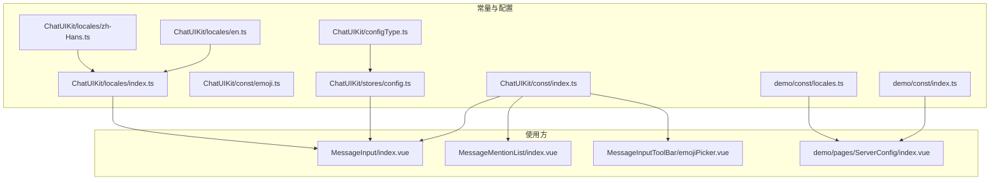
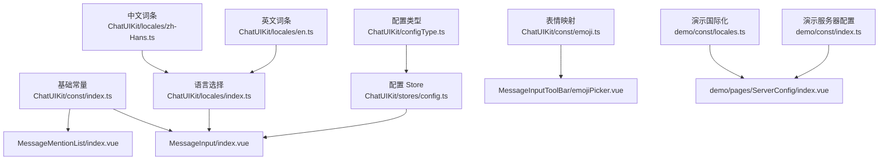
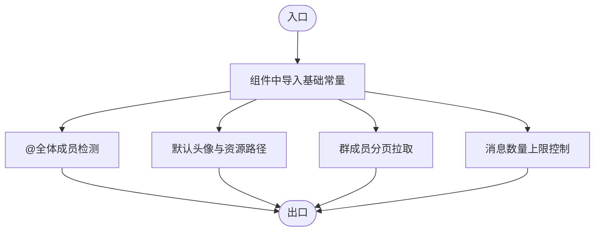
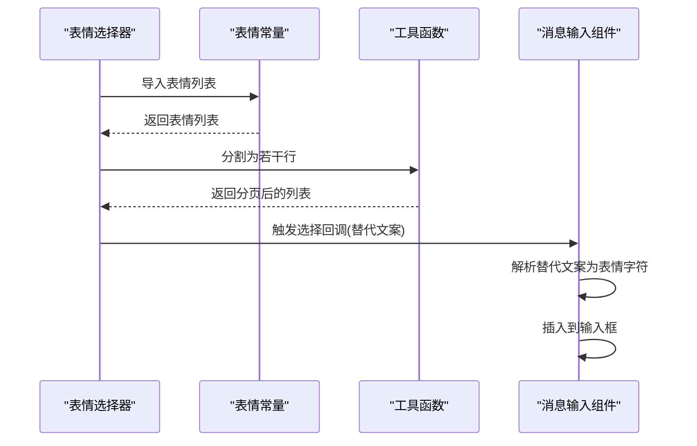
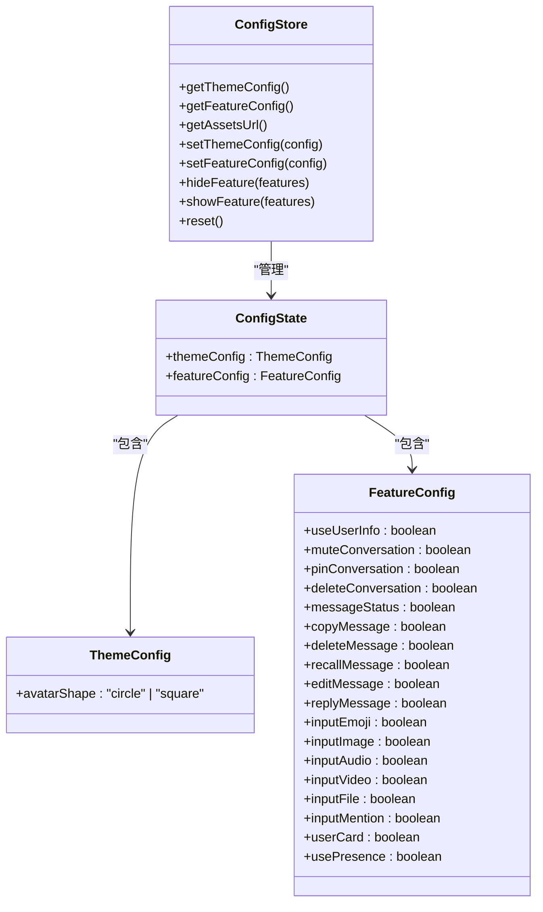
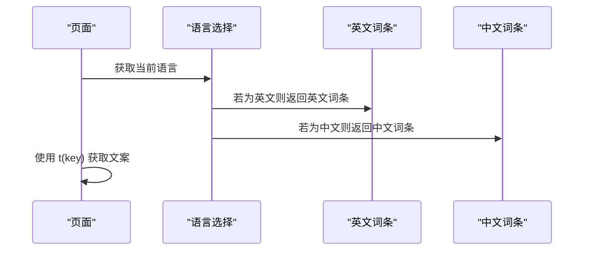
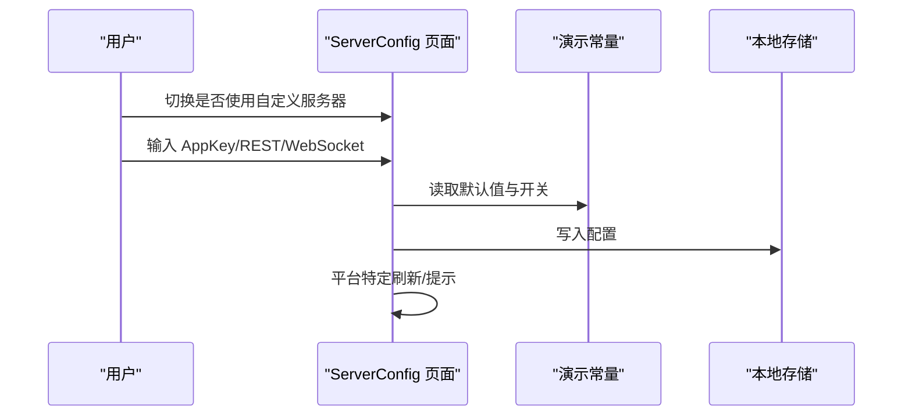
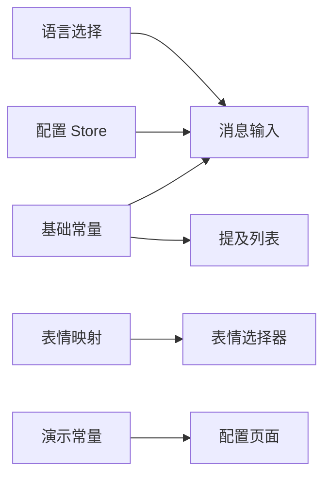

# 常量和配置

<cite>
**本文档引用的文件**
- [ChatUIKit/const/index.ts](file://ChatUIKit/const/index.ts)
- [ChatUIKit/const/emoji.ts](file://ChatUIKit/const/emoji.ts)
- [demo/const/index.ts](file://demo/const/index.ts)
- [demo/const/locales.ts](file://demo/const/locales.ts)
- [ChatUIKit/stores/config.ts](file://ChatUIKit/stores/config.ts)
- [ChatUIKit/configType.ts](file://ChatUIKit/configType.ts)
- [ChatUIKit/locales/index.ts](file://ChatUIKit/locales/index.ts)
- [ChatUIKit/locales/en.ts](file://ChatUIKit/locales/en.ts)
- [ChatUIKit/locales/zh-Hans.ts](file://ChatUIKit/locales/zh-Hans.ts)
- [ChatUIKit/modules/Chat/components/MessageInput/index.vue](file://ChatUIKit/modules/Chat/components/MessageInput/index.vue)
- [ChatUIKit/modules/Chat/components/MessageMentionList/index.vue](file://ChatUIKit/modules/Chat/components/MessageMentionList/index.vue)
- [ChatUIKit/modules/Chat/components/MessageInputToolBar/emojiPicker.vue](file://ChatUIKit/modules/Chat/components/MessageInputToolBar/emojiPicker.vue)
- [demo/pages/ServerConfig/index.vue](file://demo/pages/ServerConfig/index.vue)
- [ChatUIKit/CHANGELOG.md](file://ChatUIKit/CHANGELOG.md)
</cite>

## 目录
1. [简介](#简介)
2. [项目结构](#项目结构)
3. [核心组件](#核心组件)
4. [架构总览](#架构总览)
5. [详细组件分析](#详细组件分析)
6. [依赖分析](#依赖分析)
7. [性能考量](#性能考量)
8. [故障排查指南](#故障排查指南)
9. [结论](#结论)
10. [附录](#附录)

## 简介
本文件系统化梳理项目中的常量与配置体系，覆盖以下方面：
- 常量定义与用途：包括分页大小、提及关键字、资源地址、默认最大消息数、用户在线状态列表等
- 表情符号映射表：表情字符到替代文案与资源路径的映射，以及列表与反向映射
- 配置项与类型：主题与功能开关的默认值、可扩展点与运行时修改方式
- 国际化词条：多语言文案键值与当前语言选择逻辑
- 使用场景与修改方法：在组件与页面中的实际引用与动态配置
- 扩展与自定义：如何新增常量、配置项与国际化词条
- 版本管理与向后兼容：基于变更日志的演进与兼容性建议

## 项目结构
围绕常量与配置的关键目录与文件如下：
- ChatUIKit/const：基础常量与表情映射
- ChatUIKit/stores/config.ts：配置管理 Store（主题与功能配置）
- ChatUIKit/configType.ts：配置类型定义
- ChatUIKit/locales：国际化词条与语言选择
- demo/const：演示应用的服务器配置常量
- 组件与页面：在各模块中引用上述常量与配置

图表来源
- [ChatUIKit/const/index.ts](file://ChatUIKit/const/index.ts#L1-L37)
- [ChatUIKit/const/emoji.ts](file://ChatUIKit/const/emoji.ts#L1-L127)
- [demo/const/index.ts](file://demo/const/index.ts#L1-L32)
- [demo/const/locales.ts](file://demo/const/locales.ts#L1-L141)
- [ChatUIKit/stores/config.ts](file://ChatUIKit/stores/config.ts#L1-L124)
- [ChatUIKit/configType.ts](file://ChatUIKit/configType.ts#L1-L68)
- [ChatUIKit/locales/index.ts](file://ChatUIKit/locales/index.ts#L1-L17)
- [ChatUIKit/locales/en.ts](file://ChatUIKit/locales/en.ts#L1-L154)
- [ChatUIKit/locales/zh-Hans.ts](file://ChatUIKit/locales/zh-Hans.ts#L1-L154)
- [ChatUIKit/modules/Chat/components/MessageInput/index.vue](file://ChatUIKit/modules/Chat/components/MessageInput/index.vue#L50-L217)
- [ChatUIKit/modules/Chat/components/MessageMentionList/index.vue](file://ChatUIKit/modules/Chat/components/MessageMentionList/index.vue#L45-L158)
- [ChatUIKit/modules/Chat/components/MessageInputToolBar/emojiPicker.vue](file://ChatUIKit/modules/Chat/components/MessageInputToolBar/emojiPicker.vue#L28-L83)
- [demo/pages/ServerConfig/index.vue](file://demo/pages/ServerConfig/index.vue#L1-L78)

章节来源
- [ChatUIKit/const/index.ts](file://ChatUIKit/const/index.ts#L1-L37)
- [ChatUIKit/const/emoji.ts](file://ChatUIKit/const/emoji.ts#L1-L127)
- [demo/const/index.ts](file://demo/const/index.ts#L1-L32)
- [demo/const/locales.ts](file://demo/const/locales.ts#L1-L141)
- [ChatUIKit/stores/config.ts](file://ChatUIKit/stores/config.ts#L1-L124)
- [ChatUIKit/configType.ts](file://ChatUIKit/configType.ts#L1-L68)
- [ChatUIKit/locales/index.ts](file://ChatUIKit/locales/index.ts#L1-L17)
- [ChatUIKit/locales/en.ts](file://ChatUIKit/locales/en.ts#L1-L154)
- [ChatUIKit/locales/zh-Hans.ts](file://ChatUIKit/locales/zh-Hans.ts#L1-L154)

## 核心组件
本节从“常量”“配置”“国际化”三个维度，逐项说明项目中的关键值与用法。

- 基础常量（ChatUIKit/const/index.ts）
  - 分页大小：用于群成员分页拉取
  - 提及关键字：用于@全体成员的标识
  - 资源根地址与默认头像地址：用户与群组默认头像资源路径
  - 会话消息上限：单会话最大消息条数
  - 用户在线状态列表：支持的状态集合
  - 事件来源集合：用于事件去重或追踪

- 表情符号映射（ChatUIKit/const/emoji.ts）
  - 表情映射表：表情字符到替代文案与资源路径的映射
  - 表情列表：将映射表转换为扁平数组，便于渲染
  - 反向映射：从替代文案到表情字符的映射，便于解析输入

- 配置管理（ChatUIKit/stores/config.ts 与 ChatUIKit/configType.ts）
  - 主题配置：如头像形状（圆形/方形）
  - 功能配置：输入区功能、消息功能、消息操作、会话功能、其他功能等开关
  - 默认值：集中定义，便于统一初始化与重置
  - 运行时修改：通过 Store 的方法动态调整或批量隐藏/显示功能

- 国际化词条（ChatUIKit/locales 与 demo/const/locales.ts）
  - 语言选择：根据系统语言自动选择对应词条
  - 键值覆盖：Demo 中提供额外键值，用于页面文案
  - 组件内使用：通过 t 函数获取当前语言的文案

- 演示应用服务器配置（demo/const/index.ts）
  - 存储键名：用于持久化存储服务器配置
  - 开关与参数：是否使用自定义服务器、AppKey、REST 地址、WebSocket 地址
  - 工具函数：生成内部上传头像与群头像的 URL

章节来源
- [ChatUIKit/const/index.ts](file://ChatUIKit/const/index.ts#L1-L37)
- [ChatUIKit/const/emoji.ts](file://ChatUIKit/const/emoji.ts#L1-L127)
- [ChatUIKit/stores/config.ts](file://ChatUIKit/stores/config.ts#L1-L124)
- [ChatUIKit/configType.ts](file://ChatUIKit/configType.ts#L1-L68)
- [ChatUIKit/locales/index.ts](file://ChatUIKit/locales/index.ts#L1-L17)
- [ChatUIKit/locales/en.ts](file://ChatUIKit/locales/en.ts#L1-L154)
- [ChatUIKit/locales/zh-Hans.ts](file://ChatUIKit/locales/zh-Hans.ts#L1-L154)
- [demo/const/index.ts](file://demo/const/index.ts#L1-L32)
- [demo/const/locales.ts](file://demo/const/locales.ts#L1-L141)

## 架构总览
下图展示了常量与配置在系统中的交互关系与流向：

图表来源
- [ChatUIKit/const/index.ts](file://ChatUIKit/const/index.ts#L1-L37)
- [ChatUIKit/const/emoji.ts](file://ChatUIKit/const/emoji.ts#L1-L127)
- [demo/const/index.ts](file://demo/const/index.ts#L1-L32)
- [demo/const/locales.ts](file://demo/const/locales.ts#L1-L141)
- [ChatUIKit/stores/config.ts](file://ChatUIKit/stores/config.ts#L1-L124)
- [ChatUIKit/configType.ts](file://ChatUIKit/configType.ts#L1-L68)
- [ChatUIKit/locales/index.ts](file://ChatUIKit/locales/index.ts#L1-L17)
- [ChatUIKit/locales/en.ts](file://ChatUIKit/locales/en.ts#L1-L154)
- [ChatUIKit/locales/zh-Hans.ts](file://ChatUIKit/locales/zh-Hans.ts#L1-L154)
- [ChatUIKit/modules/Chat/components/MessageInput/index.vue](file://ChatUIKit/modules/Chat/components/MessageInput/index.vue#L50-L217)
- [ChatUIKit/modules/Chat/components/MessageMentionList/index.vue](file://ChatUIKit/modules/Chat/components/MessageMentionList/index.vue#L45-L158)
- [ChatUIKit/modules/Chat/components/MessageInputToolBar/emojiPicker.vue](file://ChatUIKit/modules/Chat/components/MessageInputToolBar/emojiPicker.vue#L28-L83)
- [demo/pages/ServerConfig/index.vue](file://demo/pages/ServerConfig/index.vue#L1-L78)

## 详细组件分析

### 基础常量与使用场景
- 分页大小：用于群成员分页拉取，避免一次性加载过多数据
- 提及关键字：用于识别“@全体成员”的输入，便于消息扩展字段处理
- 资源根地址与默认头像：统一管理静态资源路径，便于替换 CDN 或本地资源
- 会话消息上限：限制单会话消息数量，控制内存占用与渲染性能
- 在线状态列表：统一状态枚举，保证 UI 与业务一致
- 事件来源集合：用于事件去重或来源追踪

图表来源
- [ChatUIKit/const/index.ts](file://ChatUIKit/const/index.ts#L1-L37)
- [ChatUIKit/modules/Chat/components/MessageInput/index.vue](file://ChatUIKit/modules/Chat/components/MessageInput/index.vue#L137-L189)
- [ChatUIKit/modules/Chat/components/MessageMentionList/index.vue](file://ChatUIKit/modules/Chat/components/MessageMentionList/index.vue#L67-L92)

章节来源
- [ChatUIKit/const/index.ts](file://ChatUIKit/const/index.ts#L1-L37)
- [ChatUIKit/modules/Chat/components/MessageInput/index.vue](file://ChatUIKit/modules/Chat/components/MessageInput/index.vue#L137-L189)
- [ChatUIKit/modules/Chat/components/MessageMentionList/index.vue](file://ChatUIKit/modules/Chat/components/MessageMentionList/index.vue#L67-L92)

### 表情符号映射与渲染流程
- 映射表：表情字符到替代文案与资源路径
- 列表：将映射表扁平化为数组，便于分页渲染
- 反向映射：从替代文案到表情字符，便于解析输入
- 渲染：工具组件按列切片渲染，点击回调触发父组件插入表情

图表来源
- [ChatUIKit/const/emoji.ts](file://ChatUIKit/const/emoji.ts#L1-L127)
- [ChatUIKit/modules/Chat/components/MessageInputToolBar/emojiPicker.vue](file://ChatUIKit/modules/Chat/components/MessageInputToolBar/emojiPicker.vue#L28-L83)
- [ChatUIKit/modules/Chat/components/MessageInput/index.vue](file://ChatUIKit/modules/Chat/components/MessageInput/index.vue#L200-L211)

章节来源
- [ChatUIKit/const/emoji.ts](file://ChatUIKit/const/emoji.ts#L1-L127)
- [ChatUIKit/modules/Chat/components/MessageInputToolBar/emojiPicker.vue](file://ChatUIKit/modules/Chat/components/MessageInputToolBar/emojiPicker.vue#L28-L83)
- [ChatUIKit/modules/Chat/components/MessageInput/index.vue](file://ChatUIKit/modules/Chat/components/MessageInput/index.vue#L200-L211)

### 配置管理与主题/功能开关
- 默认主题配置：头像形状（圆形/方形）
- 默认功能配置：输入区、消息、消息操作、会话、其他功能的开关
- 运行时修改：设置主题/功能配置、隐藏/显示指定功能、重置为默认
- 类型约束：通过类型定义确保配置项的完整性与一致性

图表来源
- [ChatUIKit/configType.ts](file://ChatUIKit/configType.ts#L3-L67)
- [ChatUIKit/stores/config.ts](file://ChatUIKit/stores/config.ts#L14-L123)

章节来源
- [ChatUIKit/configType.ts](file://ChatUIKit/configType.ts#L3-L67)
- [ChatUIKit/stores/config.ts](file://ChatUIKit/stores/config.ts#L14-L123)

### 国际化词条与语言选择
- 语言选择：根据系统语言自动选择对应词条集
- 键值覆盖：Demo 中提供额外键值，用于页面文案
- 组件内使用：通过 t 函数获取当前语言的文案

图表来源
- [ChatUIKit/locales/index.ts](file://ChatUIKit/locales/index.ts#L1-L17)
- [ChatUIKit/locales/en.ts](file://ChatUIKit/locales/en.ts#L1-L154)
- [ChatUIKit/locales/zh-Hans.ts](file://ChatUIKit/locales/zh-Hans.ts#L1-L154)
- [demo/const/locales.ts](file://demo/const/locales.ts#L1-L141)

章节来源
- [ChatUIKit/locales/index.ts](file://ChatUIKit/locales/index.ts#L1-L17)
- [ChatUIKit/locales/en.ts](file://ChatUIKit/locales/en.ts#L1-L154)
- [ChatUIKit/locales/zh-Hans.ts](file://ChatUIKit/locales/zh-Hans.ts#L1-L154)
- [demo/const/locales.ts](file://demo/const/locales.ts#L1-L141)

### 演示应用服务器配置
- 存储键名：用于持久化存储服务器配置
- 开关与参数：是否使用自定义服务器、AppKey、REST 地址、WebSocket 地址
- 页面交互：切换开关、输入参数、保存到本地存储，并在不同平台进行刷新或提示

图表来源
- [demo/pages/ServerConfig/index.vue](file://demo/pages/ServerConfig/index.vue#L1-L78)
- [demo/const/index.ts](file://demo/const/index.ts#L1-L32)

章节来源
- [demo/pages/ServerConfig/index.vue](file://demo/pages/ServerConfig/index.vue#L1-L78)
- [demo/const/index.ts](file://demo/const/index.ts#L1-L32)

## 依赖分析
- 常量到组件的依赖
  - 基础常量被多个模块广泛使用，如消息输入、提及列表、默认头像等
  - 表情映射被表情选择器与消息输入组件依赖
  - 配置 Store 被消息输入组件读取，以决定功能可见性
  - 国际化词条被页面与组件共同使用
  - 演示常量被配置页面使用，用于读取与写入服务器参数

图表来源
- [ChatUIKit/const/index.ts](file://ChatUIKit/const/index.ts#L1-L37)
- [ChatUIKit/const/emoji.ts](file://ChatUIKit/const/emoji.ts#L1-L127)
- [ChatUIKit/stores/config.ts](file://ChatUIKit/stores/config.ts#L1-L124)
- [ChatUIKit/locales/index.ts](file://ChatUIKit/locales/index.ts#L1-L17)
- [demo/const/index.ts](file://demo/const/index.ts#L1-L32)
- [ChatUIKit/modules/Chat/components/MessageInput/index.vue](file://ChatUIKit/modules/Chat/components/MessageInput/index.vue#L50-L217)
- [ChatUIKit/modules/Chat/components/MessageMentionList/index.vue](file://ChatUIKit/modules/Chat/components/MessageMentionList/index.vue#L45-L158)
- [ChatUIKit/modules/Chat/components/MessageInputToolBar/emojiPicker.vue](file://ChatUIKit/modules/Chat/components/MessageInputToolBar/emojiPicker.vue#L28-L83)
- [demo/pages/ServerConfig/index.vue](file://demo/pages/ServerConfig/index.vue#L1-L78)

章节来源
- [ChatUIKit/const/index.ts](file://ChatUIKit/const/index.ts#L1-L37)
- [ChatUIKit/const/emoji.ts](file://ChatUIKit/const/emoji.ts#L1-L127)
- [ChatUIKit/stores/config.ts](file://ChatUIKit/stores/config.ts#L1-L124)
- [ChatUIKit/locales/index.ts](file://ChatUIKit/locales/index.ts#L1-L17)
- [demo/const/index.ts](file://demo/const/index.ts#L1-L32)
- [ChatUIKit/modules/Chat/components/MessageInput/index.vue](file://ChatUIKit/modules/Chat/components/MessageInput/index.vue#L50-L217)
- [ChatUIKit/modules/Chat/components/MessageMentionList/index.vue](file://ChatUIKit/modules/Chat/components/MessageMentionList/index.vue#L45-L158)
- [ChatUIKit/modules/Chat/components/MessageInputToolBar/emojiPicker.vue](file://ChatUIKit/modules/Chat/components/MessageInputToolBar/emojiPicker.vue#L28-L83)
- [demo/pages/ServerConfig/index.vue](file://demo/pages/ServerConfig/index.vue#L1-L78)

## 性能考量
- 常量与配置的集中管理有助于减少重复计算与全局状态膨胀
- 表情映射采用扁平列表与分页渲染，降低一次性渲染成本
- 配置 Store 使用 Pinia 管理状态，避免不必要的响应式开销
- 通过功能开关控制组件渲染与事件绑定，减少无效计算

## 故障排查指南
- 表情无法显示
  - 检查表情映射表是否正确导出与导入
  - 确认资源路径可用且与构建环境匹配
- 服务器配置未生效
  - 确认本地存储键名与读取逻辑一致
  - 不同平台需执行相应的刷新或重启逻辑
- 功能按钮不可见
  - 检查配置 Store 中对应功能开关是否开启
  - 确认组件中读取的配置对象是否正确

章节来源
- [ChatUIKit/const/emoji.ts](file://ChatUIKit/const/emoji.ts#L1-L127)
- [demo/const/index.ts](file://demo/const/index.ts#L1-L32)
- [ChatUIKit/stores/config.ts](file://ChatUIKit/stores/config.ts#L1-L124)

## 结论
本项目通过“常量—配置—国际化”的清晰分层，实现了跨模块的一致性与可维护性。基础常量保障了资源与行为的统一；配置 Store 提供了灵活的功能开关与主题定制能力；国际化机制支持多语言扩展。结合本文档的使用指南与扩展建议，可在不破坏现有结构的前提下安全地进行二次开发与定制。

## 附录

### 常量与配置清单与说明
- 基础常量
  - 分页大小：用于群成员分页拉取
  - 提及关键字：用于@全体成员
  - 资源根地址与默认头像：统一资源路径
  - 会话消息上限：控制单会话消息数量
  - 在线状态列表：统一状态枚举
- 表情映射
  - 映射表：表情字符到替代文案与资源路径
  - 列表：扁平化表情列表
  - 反向映射：替代文案到表情字符
- 配置类型
  - 主题配置：头像形状
  - 功能配置：输入区、消息、消息操作、会话、其他功能开关
- 国际化
  - 语言选择：根据系统语言自动选择
  - 键值覆盖：Demo 中的额外键值
- 演示应用配置
  - 存储键名：用于持久化
  - 参数：是否使用自定义服务器、AppKey、REST 地址、WebSocket 地址

章节来源
- [ChatUIKit/const/index.ts](file://ChatUIKit/const/index.ts#L1-L37)
- [ChatUIKit/const/emoji.ts](file://ChatUIKit/const/emoji.ts#L1-L127)
- [ChatUIKit/configType.ts](file://ChatUIKit/configType.ts#L3-L67)
- [ChatUIKit/locales/index.ts](file://ChatUIKit/locales/index.ts#L1-L17)
- [demo/const/index.ts](file://demo/const/index.ts#L1-L32)
- [demo/const/locales.ts](file://demo/const/locales.ts#L1-L141)

### 命名规范与修改方法
- 命名规范
  - 常量：全大写下划线风格
  - 类型：首字母大写驼峰风格
  - 导出：统一导出，便于按需引入
- 修改方法
  - 常量：在对应文件中直接修改默认值
  - 配置：通过 Store 的 setter 或批量隐藏/显示方法调整
  - 国际化：在对应语言文件中新增键值或补充词条
  - 服务器配置：在演示常量中新增键值并在页面中使用

章节来源
- [ChatUIKit/const/index.ts](file://ChatUIKit/const/index.ts#L1-L37)
- [ChatUIKit/stores/config.ts](file://ChatUIKit/stores/config.ts#L82-L122)
- [ChatUIKit/locales/en.ts](file://ChatUIKit/locales/en.ts#L1-L154)
- [ChatUIKit/locales/zh-Hans.ts](file://ChatUIKit/locales/zh-Hans.ts#L1-L154)
- [demo/const/index.ts](file://demo/const/index.ts#L1-L32)

### 扩展与自定义实现指南
- 新增常量
  - 在 ChatUIKit/const 下新增文件或在既有文件中添加
  - 导出并按需在组件中导入
- 新增配置项
  - 在类型定义中声明新字段
  - 在默认配置中提供默认值
  - 在 Store 中提供 setter 或批量操作方法
- 新增国际化词条
  - 在对应语言文件中添加键值
  - 在页面或组件中通过 t 函数使用
- 新增服务器配置
  - 在演示常量中新增键值与默认值
  - 在配置页面中新增输入项并写入本地存储

章节来源
- [ChatUIKit/configType.ts](file://ChatUIKit/configType.ts#L3-L67)
- [ChatUIKit/stores/config.ts](file://ChatUIKit/stores/config.ts#L19-L122)
- [ChatUIKit/locales/en.ts](file://ChatUIKit/locales/en.ts#L1-L154)
- [ChatUIKit/locales/zh-Hans.ts](file://ChatUIKit/locales/zh-Hans.ts#L1-L154)
- [demo/const/index.ts](file://demo/const/index.ts#L1-L32)

### 版本管理与向后兼容性
- 版本发布记录
  - 当前版本：1.0.0（首次发布）
  - 功能范围：会话、联系人、群组、聊天、消息操作等
- 向后兼容性建议
  - 常量与配置的新增应保持默认值不变，避免破坏现有行为
  - 类型定义变更需谨慎，优先提供可选字段与默认值
  - 国际化新增键值应提供默认值，避免运行时报错
  - 配置 Store 的新增字段应在默认配置中提供默认值，并提供 reset 方法

章节来源
- [ChatUIKit/CHANGELOG.md](file://ChatUIKit/CHANGELOG.md#L1-L9)