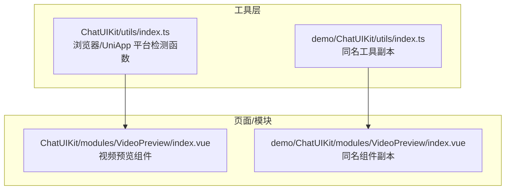
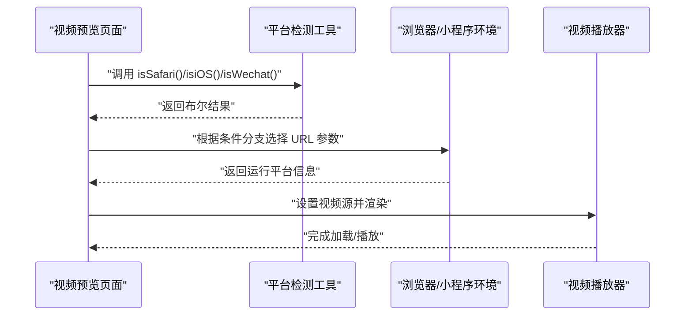
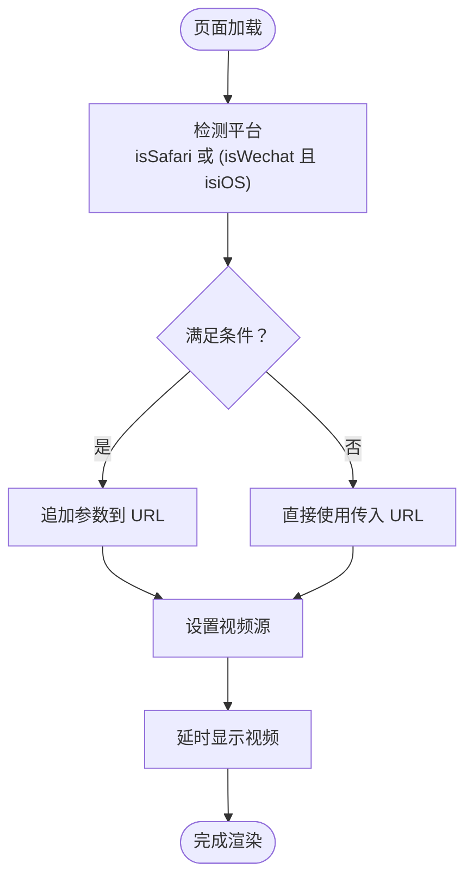
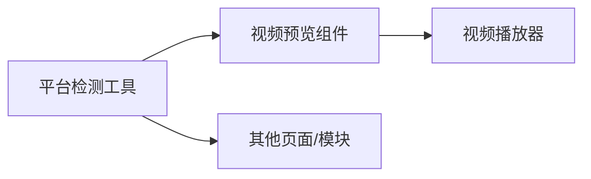

# 平台检测工具

<cite>
**本文引用的文件**
- [ChatUIKit/utils/index.ts](file://ChatUIKit/utils/index.ts)
- [demo/ChatUIKit/utils/index.ts](file://demo/ChatUIKit/utils/index.ts)
- [ChatUIKit/modules/VideoPreview/index.vue](file://ChatUIKit/modules/VideoPreview/index.vue)
- [demo/ChatUIKit/modules/VideoPreview/index.vue](file://demo/ChatUIKit/modules/VideoPreview/index.vue)
- [README.md](file://README.md)
</cite>

## 目录
1. [简介](#简介)
2. [项目结构](#项目结构)
3. [核心组件](#核心组件)
4. [架构总览](#架构总览)
5. [详细组件分析](#详细组件分析)
6. [依赖关系分析](#依赖关系分析)
7. [性能考量](#性能考量)
8. [故障排查指南](#故障排查指南)
9. [结论](#结论)
10. [附录](#附录)

## 简介
本文件聚焦于平台检测工具，系统性说明两类检测函数族：
- 浏览器检测函数：isSafari、isiOS、isWechat
- UniApp 平台检测函数：isWXProgram、isWeb、isIOS、isAndroid

文档将从实现原理、判断逻辑、适用范围与限制条件出发，结合实际使用场景（如视频播放兼容性），给出行为差异说明、兼容性处理方案、使用示例与最佳实践建议。

## 项目结构
平台检测工具位于通用工具模块中，供各页面与模块按需导入使用；视频预览模块演示了在不同平台下的差异化处理策略。

图表来源
- [ChatUIKit/utils/index.ts](file://ChatUIKit/utils/index.ts#L80-L103)
- [demo/ChatUIKit/utils/index.ts](file://demo/ChatUIKit/utils/index.ts#L80-L103)
- [ChatUIKit/modules/VideoPreview/index.vue](file://ChatUIKit/modules/VideoPreview/index.vue#L16)
- [demo/ChatUIKit/modules/VideoPreview/index.vue](file://demo/ChatUIKit/modules/VideoPreview/index.vue#L16)

章节来源
- [README.md](file://README.md#L1-L63)

## 核心组件
本节对两类平台检测函数逐一解析，涵盖实现原理、判断逻辑、适用范围与限制，并给出使用建议与注意事项。

- 浏览器检测函数
  - isSafari：通过检测浏览器 UA 字符串中是否包含特定标识，判定当前是否为 Safari 浏览器。
  - isiOS：通过正则匹配 UA 字符串，识别 iPad/iPhone/iPod 设备标识。
  - isWechat：通过检测 UA 字符串中是否包含“微信”标识，判定当前是否在微信内置浏览器中。

- UniApp 平台检测函数
  - isWXProgram：通过读取系统信息同步接口返回的平台标识，判断当前是否运行在微信小程序环境。
  - isWeb：通过读取系统信息同步接口返回的平台标识，判断当前是否运行在 Web 环境。
  - isIOS：通过读取系统信息同步接口返回的平台字符串，判断当前是否运行在 iOS 平台。
  - isAndroid：通过读取系统信息同步接口返回的平台字符串，判断当前是否运行在 Android 平台。

章节来源
- [ChatUIKit/utils/index.ts](file://ChatUIKit/utils/index.ts#L80-L103)
- [demo/ChatUIKit/utils/index.ts](file://demo/ChatUIKit/utils/index.ts#L80-L103)

## 架构总览
下图展示了平台检测函数在组件中的调用关系与控制流，重点体现“浏览器检测”与“UniApp 平台检测”的组合使用，以适配不同平台的播放策略。

图表来源
- [ChatUIKit/modules/VideoPreview/index.vue](file://ChatUIKit/modules/VideoPreview/index.vue#L21-L37)
- [ChatUIKit/utils/index.ts](file://ChatUIKit/utils/index.ts#L80-L103)

## 详细组件分析

### 浏览器检测函数族
- isSafari
  - 判断逻辑：检查 UA 字符串中是否包含“safari”关键词。
  - 适用范围：H5 环境下区分 Safari 浏览器。
  - 限制条件：UA 可被篡改；部分伪装 UA 的场景可能误判。
  - 使用建议：仅作为 UI/交互策略的辅助判断，不作为安全或核心业务的唯一依据。

- isiOS
  - 判断逻辑：使用正则表达式匹配 UA 中的 iPad/iPhone/iPod。
  - 适用范围：H5 环境下识别 iOS 设备。
  - 限制条件：UA 可被修改；某些嵌入式浏览器可能携带相似标识。
  - 使用建议：与 isWechat 组合使用，覆盖 iOS 下微信内置浏览器场景。

- isWechat
  - 判断逻辑：检查 UA 字符串中是否包含“micromessenger”关键词。
  - 适用范围：H5 环境下识别微信内置浏览器。
  - 限制条件：UA 可被篡改；第三方内核可能携带相同标识。
  - 使用建议：与 isiOS 结合，形成“iOS 微信浏览器”的复合判断。

章节来源
- [ChatUIKit/utils/index.ts](file://ChatUIKit/utils/index.ts#L80-L91)
- [demo/ChatUIKit/utils/index.ts](file://demo/ChatUIKit/utils/index.ts#L80-L91)

### UniApp 平台检测函数族
- isWXProgram
  - 判断逻辑：读取系统信息同步接口返回的 uniPlatform 字段，判断其值是否为“mp-weixin”。
  - 适用范围：小程序环境（微信小程序）。
  - 限制条件：仅适用于 HBuilderX/UniApp 编译后的小程序产物。
  - 使用建议：用于小程序特有能力的开关与 UI 差异化。

- isWeb
  - 判断逻辑：读取 uniPlatform 字段，判断其值是否为“web”。
  - 适用范围：H5/Web 环境。
  - 限制条件：与 isWXProgram 互斥；在 H5 环境下稳定可靠。
  - 使用建议：用于 H5 端的差异化逻辑与资源加载策略。

- isIOS / isAndroid
  - 判断逻辑：读取系统信息同步接口返回的 platform 字段，分别与“ios”、“android”比较。
  - 适用范围：原生 App（App-Plus）与小程序环境。
  - 限制条件：仅在 App-Plus 或小程序编译产物中可用；H5 环境下 platform 通常为空或不可用。
  - 使用建议：与 isWeb/isWXProgram 组合使用，覆盖多端差异。

章节来源
- [ChatUIKit/utils/index.ts](file://ChatUIKit/utils/index.ts#L93-L103)
- [demo/ChatUIKit/utils/index.ts](file://demo/ChatUIKit/utils/index.ts#L93-L103)

### 实际使用示例与最佳实践
- 示例：视频预览组件中的平台差异化处理
  - 场景：在 Safari 浏览器或 iOS 微信内置浏览器中，为视频 URL 追加特定参数以提升播放兼容性。
  - 控制流：
    - 若为 Safari 或（iOS + 微信浏览器），则在传入 URL 上追加参数后赋值给视频源。
    - 否则直接使用传入 URL。
    - 延迟显示视频，避免多次进入导致的布局偏移与播放器卡顿。

图表来源
- [ChatUIKit/modules/VideoPreview/index.vue](file://ChatUIKit/modules/VideoPreview/index.vue#L21-L37)
- [ChatUIKit/utils/index.ts](file://ChatUIKit/utils/index.ts#L80-L103)

最佳实践建议
- 将平台检测函数集中管理，避免重复实现与维护成本。
- 对浏览器 UA 的判断仅用于 UI/体验层面的差异化，不作为核心业务逻辑的唯一依据。
- 在小程序与 H5 环境下，优先使用 UniApp 提供的系统信息接口（如 uniPlatform、platform）进行判断。
- 对于跨端兼容问题，建议采用“特性检测 + 平台检测”的双重策略，确保在不同内核与环境下均能正确识别。

章节来源
- [ChatUIKit/modules/VideoPreview/index.vue](file://ChatUIKit/modules/VideoPreview/index.vue#L16-L37)
- [demo/ChatUIKit/modules/VideoPreview/index.vue](file://demo/ChatUIKit/modules/VideoPreview/index.vue#L16-L37)

## 依赖关系分析
- 模块耦合
  - 平台检测函数位于工具模块，被页面/模块按需导入，耦合度低、复用性强。
  - 视频预览组件仅依赖工具模块提供的布尔判断结果，逻辑清晰、职责单一。

- 外部依赖
  - 浏览器检测依赖 navigator.userAgent；在小程序/H5 环境下，navigator 可能受限或不可用，应结合 isWeb/isWXProgram 进行保护。
  - UniApp 平台检测依赖 uni.getSystemInfoSync；需在页面生命周期内调用，避免在非页面上下文中使用。

图表来源
- [ChatUIKit/utils/index.ts](file://ChatUIKit/utils/index.ts#L80-L103)
- [ChatUIKit/modules/VideoPreview/index.vue](file://ChatUIKit/modules/VideoPreview/index.vue#L16)

章节来源
- [ChatUIKit/utils/index.ts](file://ChatUIKit/utils/index.ts#L80-L103)
- [ChatUIKit/modules/VideoPreview/index.vue](file://ChatUIKit/modules/VideoPreview/index.vue#L16)

## 性能考量
- 函数复杂度
  - 浏览器检测函数均为 O(1) 操作，开销极小。
  - UniApp 平台检测函数通过读取系统信息，属于轻量级同步调用，不会阻塞主线程。
- 建议
  - 将平台检测结果缓存至响应式变量或常量，避免在每次渲染中重复计算。
  - 在高频触发的事件中，优先使用缓存结果，减少不必要的重复判断。

## 故障排查指南
- 症状：在 H5 环境下，isWechat 返回值异常
  - 可能原因：UA 被代理/篡改、第三方内核携带相似标识。
  - 排查步骤：确认 UA 字符串中是否存在目标关键词；结合 isiOS 进行复合判断。
  - 处理建议：仅将该判断用于 UI/交互差异化，不作为核心业务判定。

- 症状：在小程序/H5 环境下，isIOS/isAndroid 返回值不符合预期
  - 可能原因：在 H5 环境下调用 platform 字段无效。
  - 排查步骤：优先使用 isWeb/isWXProgram 判断运行环境；在 App-Plus 或小程序产物中再使用 platform。
  - 处理建议：在调用前先判断 isWeb/isWXProgram，再决定是否读取 platform。

- 症状：视频在 Safari 或 iOS 微信浏览器中无法正常播放
  - 可能原因：URL 参数缺失或播放策略不当。
  - 排查步骤：确认 isSafari 或 (isWechat 且 isiOS) 条件分支是否命中；检查 URL 参数拼接逻辑。
  - 处理建议：遵循视频预览组件中的策略，在满足条件时追加参数并延时显示。

章节来源
- [ChatUIKit/utils/index.ts](file://ChatUIKit/utils/index.ts#L80-L103)
- [ChatUIKit/modules/VideoPreview/index.vue](file://ChatUIKit/modules/VideoPreview/index.vue#L21-L37)

## 结论
平台检测工具通过两类函数族覆盖了浏览器与 UniApp 多端环境的差异化需求。在实际开发中，应结合具体场景合理选择与组合使用这些函数，并注意 UA 与系统信息的局限性，采用特性检测与平台检测相结合的方式，确保在不同内核与环境下具备稳定的兼容表现。

## 附录
- 关键路径参考
  - 浏览器检测函数实现：[ChatUIKit/utils/index.ts](file://ChatUIKit/utils/index.ts#L80-L91)
  - UniApp 平台检测函数实现：[ChatUIKit/utils/index.ts](file://ChatUIKit/utils/index.ts#L93-L103)
  - 视频预览组件使用示例：[ChatUIKit/modules/VideoPreview/index.vue](file://ChatUIKit/modules/VideoPreview/index.vue#L21-L37)