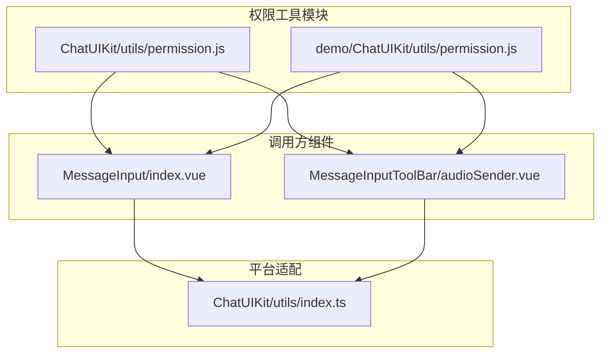
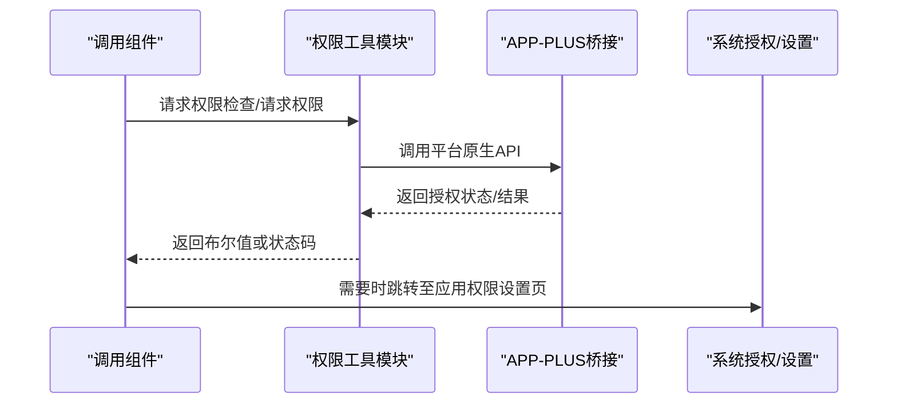
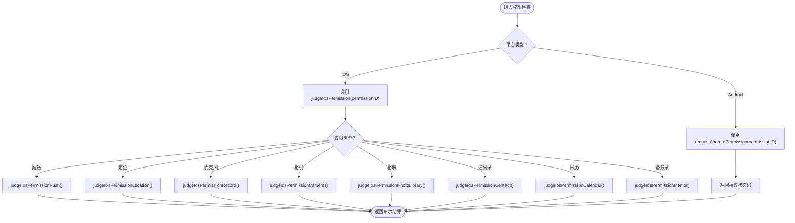
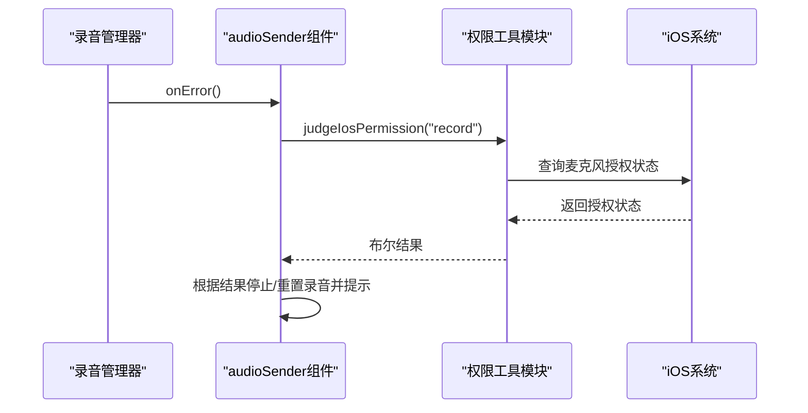
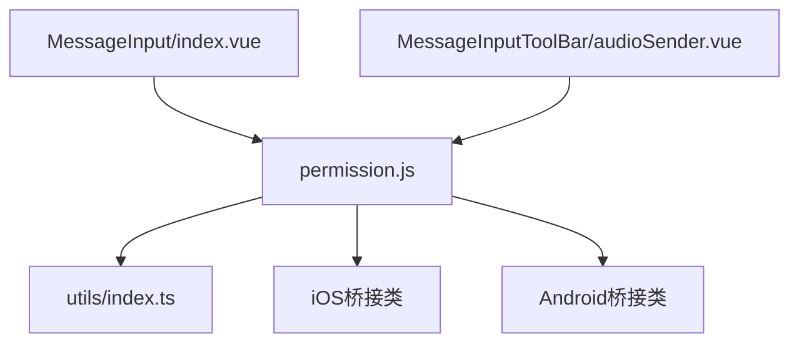

# 权限检查工具

<cite>
**本文档引用的文件**
- [ChatUIKit/utils/permission.js](file://ChatUIKit/utils/permission.js)
- [demo/ChatUIKit/utils/permission.js](file://demo/ChatUIKit/utils/permission.js)
- [ChatUIKit/modules/Chat/components/MessageInput/index.vue](file://ChatUIKit/modules/Chat/components/MessageInput/index.vue)
- [ChatUIKit/modules/Chat/components/MessageInputToolBar/audioSender.vue](file://ChatUIKit/modules/Chat/components/MessageInputToolBar/audioSender.vue)
- [ChatUIKit/utils/index.ts](file://ChatUIKit/utils/index.ts)
- [README.md](file://README.md)
</cite>

## 目录
1. [简介](#简介)
2. [项目结构](#项目结构)
3. [核心组件](#核心组件)
4. [架构概览](#架构概览)
5. [详细组件分析](#详细组件分析)
6. [依赖分析](#依赖分析)
7. [性能考虑](#性能考虑)
8. [故障排除指南](#故障排除指南)
9. [结论](#结论)

## 简介
本文件详细说明了权限检查工具的实现机制、权限类型定义与检查流程，解释权限配置规则、权限继承关系与权限缓存策略，并提供权限检查的使用示例与错误处理方案。同时包含权限扩展方法与自定义权限类型的实现指南，以及权限相关的安全考虑与最佳实践。

## 项目结构
该权限检查工具位于 ChatUIKit/utils/permission.js，同时在 demo/ChatUIKit/utils/permission.js 提供了相同的实现。工具通过条件编译指令适配 APP-PLUS 平台（iOS/Android），并在多个聊天模块组件中被调用，用于在录音等敏感操作前进行权限校验。



**图表来源**
- [ChatUIKit/utils/permission.js](file://ChatUIKit/utils/permission.js#L1-L272)
- [demo/ChatUIKit/utils/permission.js](file://demo/ChatUIKit/utils/permission.js#L1-L272)
- [ChatUIKit/modules/Chat/components/MessageInput/index.vue](file://ChatUIKit/modules/Chat/components/MessageInput/index.vue#L92-L109)
- [ChatUIKit/modules/Chat/components/MessageInputToolBar/audioSender.vue](file://ChatUIKit/modules/Chat/components/MessageInputToolBar/audioSender.vue#L223-L242)
- [ChatUIKit/utils/index.ts](file://ChatUIKit/utils/index.ts#L99-L103)

**章节来源**
- [README.md](file://README.md#L1-L63)
- [ChatUIKit/utils/permission.js](file://ChatUIKit/utils/permission.js#L1-L272)
- [demo/ChatUIKit/utils/permission.js](file://demo/ChatUIKit/utils/permission.js#L1-L272)

## 核心组件
- 权限工具模块：提供跨平台的权限判断与跳转设置能力，包含 iOS 授权状态检查、Android 权限请求、系统服务开关检查与应用权限设置页跳转。
- 调用方组件：在录音前对麦克风权限进行检查；在发送录音前对 Android 录音权限进行请求。
- 平台适配工具：提供 isIOS、isAndroid 等运行时判断，辅助条件编译与平台分支逻辑。

关键职责与接口：
- iOS 权限检查：针对推送、定位、麦克风、相机、相册、通讯录、日历、备忘录等授权状态进行判断。
- Android 权限请求：封装 plus.android.requestPermissions，返回授权结果状态码。
- 系统服务检查：检查系统定位服务是否开启（iOS 使用 CLLocationManager，Android 使用 LocationManager）。
- 应用权限设置页跳转：统一跳转至系统应用权限设置页，便于用户手动授权。

**章节来源**
- [ChatUIKit/utils/permission.js](file://ChatUIKit/utils/permission.js#L10-L265)
- [ChatUIKit/utils/index.ts](file://ChatUIKit/utils/index.ts#L99-L103)

## 架构概览
权限检查工具采用模块化设计，通过导出统一接口供各组件按需调用。调用链路遵循“组件触发 → 工具模块判断/请求 → 平台原生桥接 → 结果反馈”的模式。



**图表来源**
- [ChatUIKit/utils/permission.js](file://ChatUIKit/utils/permission.js#L158-L195)
- [ChatUIKit/utils/permission.js](file://ChatUIKit/utils/permission.js#L197-L217)
- [ChatUIKit/utils/permission.js](file://ChatUIKit/utils/permission.js#L219-L244)

## 详细组件分析

### 权限工具模块（permission.js）
- iOS 权限检查函数族：judgeIosPermissionPush、judgeIosPermissionLocation、judgeIosPermissionRecord、judgeIosPermissionCamera、judgeIosPermissionPhotoLibrary、judgeIosPermissionContact、judgeIosPermissionCalendar、judgeIosPermissionMemo。
- Android 权限请求：requestAndroidPermission(permissionID) 返回 Promise，解析 granted/deniedPresent/deniedAlways 的结果状态。
- 统一入口：judgeIosPermission(permissionID) 根据字符串标识选择对应 iOS 权限检查函数。
- 系统服务检查：checkSystemEnableLocation() 检查系统定位服务是否开启。
- 应用权限设置页：gotoAppPermissionSetting() 跳转至系统应用权限设置页。



**图表来源**
- [ChatUIKit/utils/permission.js](file://ChatUIKit/utils/permission.js#L197-L217)
- [ChatUIKit/utils/permission.js](file://ChatUIKit/utils/permission.js#L158-L195)

**章节来源**
- [ChatUIKit/utils/permission.js](file://ChatUIKit/utils/permission.js#L10-L265)

### 调用方组件分析

#### MessageInput 组件
- 触发录音弹窗前，对 Android 平台请求录音权限（android.permission.RECORD_AUDIO）。
- 若授权失败，展示本地国际化文案提示。

```mermaid
sequenceDiagram
participant UI as "用户点击录音按钮"
participant MI as "MessageInput组件"
participant P as "权限工具模块"
participant AND as "Android系统"
UI->>MI : 点击录音图标
MI->>P : requestAndroidPermission("android.permission.RECORD_AUDIO")
P->>AND : 请求录音权限
AND-->>P : 返回授权结果
P-->>MI : 状态码
MI->>MI : 判断状态码并提示
MI-->>UI : 打开录音弹窗或提示失败
```

**图表来源**
- [ChatUIKit/modules/Chat/components/MessageInput/index.vue](file://ChatUIKit/modules/Chat/components/MessageInput/index.vue#L92-L109)
- [ChatUIKit/utils/permission.js](file://ChatUIKit/utils/permission.js#L158-L195)

**章节来源**
- [ChatUIKit/modules/Chat/components/MessageInput/index.vue](file://ChatUIKit/modules/Chat/components/MessageInput/index.vue#L92-L109)

#### MessageInputToolBar/audioSender 组件
- 录音错误回调中，对 iOS 平台检查麦克风授权状态。
- 若未授权，停止录音、重置状态并提示用户。



**图表来源**
- [ChatUIKit/modules/Chat/components/MessageInputToolBar/audioSender.vue](file://ChatUIKit/modules/Chat/components/MessageInputToolBar/audioSender.vue#L223-L242)
- [ChatUIKit/utils/permission.js](file://ChatUIKit/utils/permission.js#L64-L79)

**章节来源**
- [ChatUIKit/modules/Chat/components/MessageInputToolBar/audioSender.vue](file://ChatUIKit/modules/Chat/components/MessageInputToolBar/audioSender.vue#L223-L242)

### 权限类型定义与检查流程
- 权限类型（iOS）：location、camera、photoLibrary、record、push、contact、calendar、memo。
- 权限类型（Android）：通过字符串标识传入 requestAndroidPermission(permissionID)，例如 android.permission.RECORD_AUDIO。
- 检查流程：
  - iOS：judgeIosPermission(permissionID) → 对应具体权限检查函数 → 返回布尔值。
  - Android：requestAndroidPermission(permissionID) → Promise → 解析 granted/deniedPresent/deniedAlways → 返回数值状态码。

**章节来源**
- [ChatUIKit/utils/permission.js](file://ChatUIKit/utils/permission.js#L197-L217)
- [ChatUIKit/utils/permission.js](file://ChatUIKit/utils/permission.js#L158-L195)

### 权限配置规则与继承关系
- 条件编译：通过 APP-PLUS 宏判断平台，仅在原生应用环境中启用权限检查与设置跳转。
- 运行时平台判断：isIOS/isAndroid 由工具模块提供，用于区分平台分支逻辑。
- 权限继承关系：组件层不维护权限状态，仅在需要时向工具模块请求检查或请求授权，避免跨组件共享复杂状态。

**章节来源**
- [ChatUIKit/utils/permission.js](file://ChatUIKit/utils/permission.js#L5-L8)
- [ChatUIKit/utils/index.ts](file://ChatUIKit/utils/index.ts#L99-L103)

### 权限缓存策略
- 工具模块未实现权限状态缓存。每次调用均通过平台原生 API 实时查询或请求授权，确保状态一致性。
- 若需优化，可在组件层引入轻量缓存（如最近一次检查时间戳与结果），但需注意系统授权变化导致的状态失效问题。

**章节来源**
- [ChatUIKit/utils/permission.js](file://ChatUIKit/utils/permission.js#L10-L265)

## 依赖分析
- 内部依赖：调用方组件依赖权限工具模块与平台适配工具。
- 外部依赖：APP-PLUS 桥接（plus.ios、plus.android）用于访问原生授权与系统设置。
- 平台差异：iOS 使用 Objective-C/Swift 桥接类（UIApplication、CLLocationManager、AVAudioSession、AVCaptureDevice、PHPhotoLibrary、CNContactStore、EKEventStore），Android 使用 Java 桥接类（Intent、Settings、Uri、LocationManager）。



**图表来源**
- [ChatUIKit/modules/Chat/components/MessageInput/index.vue](file://ChatUIKit/modules/Chat/components/MessageInput/index.vue#L56)
- [ChatUIKit/modules/Chat/components/MessageInputToolBar/audioSender.vue](file://ChatUIKit/modules/Chat/components/MessageInputToolBar/audioSender.vue#L47)
- [ChatUIKit/utils/permission.js](file://ChatUIKit/utils/permission.js#L1-L272)
- [ChatUIKit/utils/index.ts](file://ChatUIKit/utils/index.ts#L1-L344)

**章节来源**
- [ChatUIKit/utils/permission.js](file://ChatUIKit/utils/permission.js#L1-L272)
- [ChatUIKit/utils/index.ts](file://ChatUIKit/utils/index.ts#L1-L344)

## 性能考虑
- 异步请求：Android 权限请求返回 Promise，避免阻塞 UI 线程。
- 原生桥接：权限检查与请求通过 APP-PLUS 桥接，延迟主要取决于系统弹窗与用户交互。
- 重复检查：当前未实现缓存，频繁检查可能带来重复交互成本；可在业务层引入短期缓存以减少弹窗次数。

[本节为通用指导，无需特定文件分析]

## 故障排除指南
- Android 权限请求错误：requestAndroidPermission 在错误回调中返回包含 code 与 message 的对象，组件可根据错误信息进行提示或重试。
- iOS 录音授权失败：在录音 onError 回调中调用 judgeIosPermission("record")，若返回 false，停止录音并提示用户前往设置页授权。
- 系统定位服务未开启：checkSystemEnableLocation 可用于检测系统定位服务状态，结合 gotoAppPermissionSetting 引导用户开启。

**章节来源**
- [ChatUIKit/utils/permission.js](file://ChatUIKit/utils/permission.js#L186-L192)
- [ChatUIKit/utils/permission.js](file://ChatUIKit/utils/permission.js#L247-L265)
- [ChatUIKit/modules/Chat/components/MessageInputToolBar/audioSender.vue](file://ChatUIKit/modules/Chat/components/MessageInputToolBar/audioSender.vue#L223-L242)

## 结论
权限检查工具通过统一接口屏蔽平台差异，为录音等敏感功能提供可靠的授权保障。建议在组件层结合国际化文案与轻量缓存策略提升用户体验，并在出现授权失败时引导用户至系统设置页完成授权。对于新增权限类型，可参考现有 iOS/Android 函数扩展方式，保持接口一致与平台适配清晰。