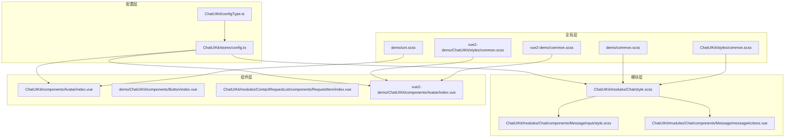
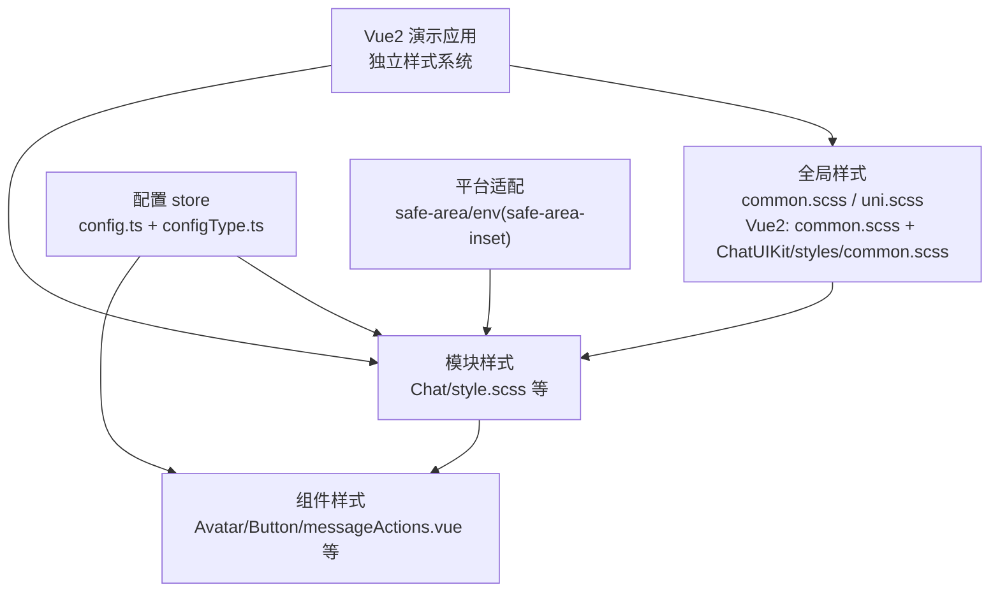
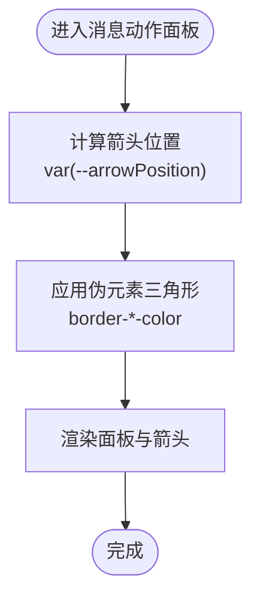
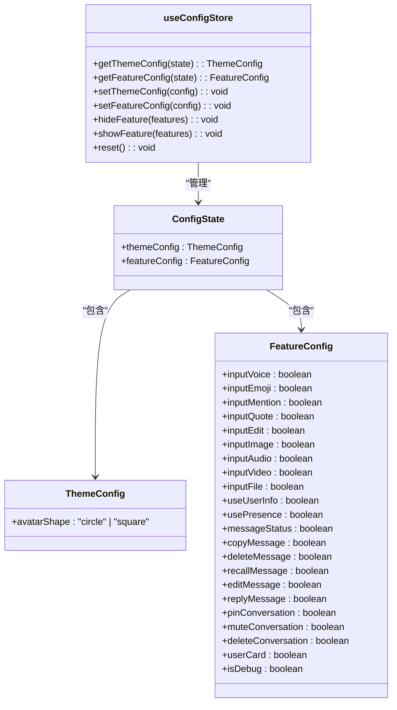
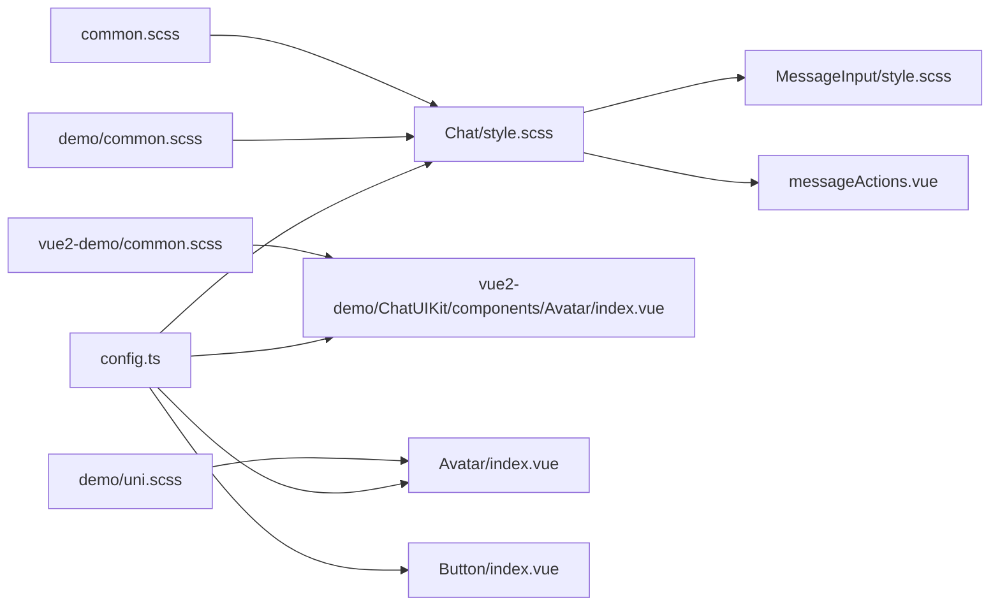

# 样式定义

<cite>
**本文档引用的文件**
- [ChatUIKit/styles/common.scss](file://ChatUIKit/styles/common.scss)
- [demo/common.scss](file://demo/common.scss)
- [vue2-demo/common.scss](file://vue2-demo/common.scss)
- [vue2-demo/ChatUIKit/styles/common.scss](file://vue2-demo/ChatUIKit/styles/common.scss)
- [ChatUIKit/modules/Chat/style.scss](file://ChatUIKit/modules/Chat/style.scss)
- [demo/ChatUIKit/modules/Chat/style.scss](file://demo/ChatUIKit/modules/Chat/style.scss)
- [ChatUIKit/modules/Chat/components/MessageInput/style.scss](file://ChatUIKit/modules/Chat/components/MessageInput/style.scss)
- [demo/ChatUIKit/modules/Chat/components/MessageInput/style.scss](file://demo/ChatUIKit/modules/Chat/components/MessageInput/style.scss)
- [ChatUIKit/modules/Chat/components/Message/messageActions.vue](file://ChatUIKit/modules/Chat/components/Message/messageActions.vue)
- [demo/ChatUIKit/modules/Chat/components/Message/messageActions.vue](file://demo/ChatUIKit/modules/Chat/components/Message/messageActions.vue)
- [ChatUIKit/components/Avatar/index.vue](file://ChatUIKit/components/Avatar/index.vue)
- [demo/ChatUIKit/components/Avatar/index.vue](file://demo/ChatUIKit/components/Avatar/index.vue)
- [vue2-demo/ChatUIKit/components/Avatar/index.vue](file://vue2-demo/ChatUIKit/components/Avatar/index.vue)
- [ChatUIKit/stores/config.ts](file://ChatUIKit/stores/config.ts)
- [demo/ChatUIKit/stores/config.ts](file://demo/ChatUIKit/stores/config.ts)
- [ChatUIKit/configType.ts](file://ChatUIKit/configType.ts)
- [demo/ChatUIKit/const/emoji.ts](file://demo/ChatUIKit/const/emoji.ts)
- [ChatUIKit/const/emoji.ts](file://ChatUIKit/const/emoji.ts)
- [demo/pages/Me/style.scss](file://demo/pages/Me/style.scss)
- [demo/pages/About/style.scss](file://demo/pages/About/style.scss)
- [demo/pages/Profile/style.scss](file://demo/pages/Profile/style.scss)
- [demo/pages/PresenceSetting/style.scss](file://demo/pages/PresenceSetting/style.scss)
- [demo/ChatUIKit/components/Button/index.vue](file://demo/ChatUIKit/components/Button/index.vue)
- [demo/ChatUIKit/modules/ContactRequestList/components/RequestItem/index.vue](file://demo/ChatUIKit/modules/ContactRequestList/components/RequestItem/index.vue)
- [ChatUIKit/modules/ContactRequestList/components/RequestItem/index.vue](file://ChatUIKit/modules/ContactRequestList/components/RequestItem/index.vue)
- [demo/uni.scss](file://demo/uni.scss)
- [demo/index.html](file://demo/index.html)
- [vue2-demo/App.vue](file://vue2-demo/App.vue)
- [vue2-demo/pages/chat/index.vue](file://vue2-demo/pages/chat/index.vue)
- [vue2-demo/pages/conversation/index.vue](file://vue2-demo/pages/conversation/index.vue)
</cite>

## 更新摘要
**所做更改**
- 新增 Vue2 演示应用样式系统章节，涵盖新的 common.scss 文件和样式组织结构
- 更新全局样式层架构，增加 Vue2 演示应用的样式文件引用
- 扩展样式覆盖指南，包含 Vue2 应用的样式导入机制
- 新增 Vue2 演示应用的页面样式示例和组件样式分析

## 目录
1. [简介](#简介)
2. [项目结构](#项目结构)
3. [核心组件](#核心组件)
4. [架构总览](#架构总览)
5. [详细组件分析](#详细组件分析)
6. [依赖关系分析](#依赖关系分析)
7. [性能考虑](#性能考虑)
8. [故障排查指南](#故障排查指南)
9. [结论](#结论)
10. [附录](#附录)

## 简介
本文件系统性梳理 EaseMob UIKit 在 UniApp 生态下的样式体系，涵盖全局样式变量、CSS 自定义属性、主题与颜色系统、字体与间距规范、样式覆盖策略、响应式与跨平台适配、调试技巧与性能优化，以及命名约定与维护最佳实践。内容基于仓库中实际存在的样式文件与组件进行归纳总结，现已扩展至包含 Vue2 演示应用的完整样式架构。

## 项目结构
样式体系主要由以下层次构成：
- 全局基础样式：页面容器、通用工具类、基础排版与交互基线
- 组件级样式：各业务模块与通用组件的局部样式，采用 scoped 作用域避免污染
- 主题与功能配置：通过 Pinia store 管理主题与功能开关，驱动样式行为
- 平台适配：通过 CSS 变量与环境函数适配安全区、状态栏等平台差异
- Vue2 演示应用：独立的样式系统，包含完整的页面基础样式和组件样式

**图示来源**
- [ChatUIKit/styles/common.scss](file://ChatUIKit/styles/common.scss#L1-L18)
- [demo/common.scss](file://demo/common.scss#L1-L26)
- [vue2-demo/common.scss](file://vue2-demo/common.scss#L1-L26)
- [vue2-demo/ChatUIKit/styles/common.scss](file://vue2-demo/ChatUIKit/styles/common.scss#L1-L18)
- [demo/uni.scss](file://demo/uni.scss#L17-L54)
- [ChatUIKit/modules/Chat/style.scss](file://ChatUIKit/modules/Chat/style.scss#L1-L33)
- [ChatUIKit/modules/Chat/components/MessageInput/style.scss](file://ChatUIKit/modules/Chat/components/MessageInput/style.scss#L1-L20)
- [ChatUIKit/modules/Chat/components/Message/messageActions.vue](file://ChatUIKit/modules/Chat/components/Message/messageActions.vue#L289-L334)
- [ChatUIKit/components/Avatar/index.vue](file://ChatUIKit/components/Avatar/index.vue#L122-L187)
- [vue2-demo/ChatUIKit/components/Avatar/index.vue](file://vue2-demo/ChatUIKit/components/Avatar/index.vue#L116-L187)
- [ChatUIKit/stores/config.ts](file://ChatUIKit/stores/config.ts#L1-L124)
- [ChatUIKit/configType.ts](file://ChatUIKit/configType.ts#L1-L68)

**章节来源**
- [ChatUIKit/styles/common.scss](file://ChatUIKit/styles/common.scss#L1-L18)
- [demo/common.scss](file://demo/common.scss#L1-L26)
- [vue2-demo/common.scss](file://vue2-demo/common.scss#L1-L26)
- [vue2-demo/ChatUIKit/styles/common.scss](file://vue2-demo/ChatUIKit/styles/common.scss#L1-L18)
- [demo/uni.scss](file://demo/uni.scss#L17-L54)
- [ChatUIKit/modules/Chat/style.scss](file://ChatUIKit/modules/Chat/style.scss#L1-L33)
- [ChatUIKit/modules/Chat/components/MessageInput/style.scss](file://ChatUIKit/modules/Chat/components/MessageInput/style.scss#L1-L20)
- [ChatUIKit/modules/Chat/components/Message/messageActions.vue](file://ChatUIKit/modules/Chat/components/Message/messageActions.vue#L289-L334)
- [ChatUIKit/components/Avatar/index.vue](file://ChatUIKit/components/Avatar/index.vue#L122-L187)
- [vue2-demo/ChatUIKit/components/Avatar/index.vue](file://vue2-demo/ChatUIKit/components/Avatar/index.vue#L116-L187)
- [ChatUIKit/stores/config.ts](file://ChatUIKit/stores/config.ts#L1-L124)
- [ChatUIKit/configType.ts](file://ChatUIKit/configType.ts#L1-L68)

## 核心组件
- 全局工具类与基础排版
  - 提供省略号文本、隐藏元素、消息表情尺寸等通用类，便于复用与快速布局
  - Vue2 演示应用新增 radio 输入样式定制，确保跨平台一致的单选框外观
- 页面与模块样式
  - 页面容器高度与背景、聊天容器布局、输入区高度与边框、遮罩层级等
  - Vue2 应用包含完整的页面基础样式，包括 HTML 和 body 元素的尺寸设置
- 组件样式
  - 头像支持圆形/方形切换、状态徽标定位与尺寸、按钮渐变与禁用态
  - Vue2 演示应用的头像组件样式与主应用保持一致，确保视觉统一
- 配置驱动的主题与功能
  - 通过 store 管理头像形状、功能开关，影响组件渲染与样式行为

**章节来源**
- [ChatUIKit/styles/common.scss](file://ChatUIKit/styles/common.scss#L1-L18)
- [demo/common.scss](file://demo/common.scss#L1-L26)
- [vue2-demo/common.scss](file://vue2-demo/common.scss#L1-L26)
- [ChatUIKit/modules/Chat/style.scss](file://ChatUIKit/modules/Chat/style.scss#L1-L33)
- [demo/ChatUIKit/components/Button/index.vue](file://demo/ChatUIKit/components/Button/index.vue#L15-L36)
- [ChatUIKit/components/Avatar/index.vue](file://ChatUIKit/components/Avatar/index.vue#L122-L187)
- [vue2-demo/ChatUIKit/components/Avatar/index.vue](file://vue2-demo/ChatUIKit/components/Avatar/index.vue#L116-L187)
- [ChatUIKit/stores/config.ts](file://ChatUIKit/stores/config.ts#L19-L62)

## 架构总览
样式体系围绕"全局—模块—组件—配置"四层展开，形成可扩展、可覆盖、可跨平台适配的结构化样式框架。新增的 Vue2 演示应用建立了独立但与主应用一致的样式基础。

**图示来源**
- [ChatUIKit/styles/common.scss](file://ChatUIKit/styles/common.scss#L1-L18)
- [demo/uni.scss](file://demo/uni.scss#L17-L54)
- [vue2-demo/common.scss](file://vue2-demo/common.scss#L1-L26)
- [vue2-demo/ChatUIKit/styles/common.scss](file://vue2-demo/ChatUIKit/styles/common.scss#L1-L18)
- [ChatUIKit/modules/Chat/style.scss](file://ChatUIKit/modules/Chat/style.scss#L8-L12)
- [ChatUIKit/stores/config.ts](file://ChatUIKit/stores/config.ts#L59-L123)
- [ChatUIKit/configType.ts](file://ChatUIKit/configType.ts#L42-L45)

## 详细组件分析

### 全局样式与工具类
- 工具类
  - 文本省略、透明度控制、消息表情尺寸等，统一在全局样式中定义，减少重复代码
  - Vue2 演示应用新增 radio 输入样式定制，确保单选框在不同平台的一致性
- 页面基线
  - 页面容器高度与背景色、HTML 和 body 元素的尺寸设置，确保全屏覆盖
  - Vue2 应用包含完整的页面基础样式，为聊天页面提供统一的视觉基础

**章节来源**
- [ChatUIKit/styles/common.scss](file://ChatUIKit/styles/common.scss#L1-L18)
- [demo/common.scss](file://demo/common.scss#L1-L26)
- [vue2-demo/common.scss](file://vue2-demo/common.scss#L1-L26)
- [vue2-demo/ChatUIKit/styles/common.scss](file://vue2-demo/ChatUIKit/styles/common.scss#L1-L18)

### Vue2 演示应用样式系统
- 样式导入机制
  - 通过 App.vue 中的 @import 语句统一导入公共样式，确保所有页面共享基础样式
  - 独立的 common.scss 文件包含页面基础样式和工具类，避免与主应用样式冲突
- 页面样式
  - 聊天页面采用 100vw x 100vh 的全屏布局，确保在移动设备上的完美适配
  - 会话列表页面简洁明了，直接渲染 ConversationList 组件

**章节来源**
- [vue2-demo/App.vue](file://vue2-demo/App.vue#L56-L63)
- [vue2-demo/common.scss](file://vue2-demo/common.scss#L1-L26)
- [vue2-demo/pages/chat/index.vue](file://vue2-demo/pages/chat/index.vue#L55-L61)
- [vue2-demo/pages/conversation/index.vue](file://vue2-demo/pages/conversation/index.vue#L1-L15)

### 聊天模块样式
- 容器布局
  - 聊天容器采用 flex 布局，消息列表区域自适应填充，输入区固定高度与边框
- 安全区适配
  - 使用常量与环境函数适配安全区底部内边距，保证键盘弹起时的视觉正确性
- 遮罩层
  - 绝对定位全屏遮罩，用于交互覆盖层场景

**章节来源**
- [ChatUIKit/modules/Chat/style.scss](file://ChatUIKit/modules/Chat/style.scss#L1-L33)
- [demo/ChatUIKit/modules/Chat/style.scss](file://demo/ChatUIKit/modules/Chat/style.scss#L1-L33)

### 消息输入区样式
- 字体与字号
  - 输入区默认字号与行高设置，保证在不同设备上的可读性
- 与聊天模块联动
  - 输入区样式与聊天容器布局共同构成消息输入体验

**章节来源**
- [ChatUIKit/modules/Chat/components/MessageInput/style.scss](file://ChatUIKit/modules/Chat/components/MessageInput/style.scss#L1-L20)
- [demo/ChatUIKit/modules/Chat/components/MessageInput/style.scss](file://demo/ChatUIKit/modules/Chat/components/MessageInput/style.scss#L1-L20)

### 消息气泡动作面板（含 CSS 自定义属性）
- 动态箭头定位
  - 通过 CSS 变量控制箭头位置，配合伪元素实现上下左右方向的三角形指向
- 背景色与层级
  - 面板背景与遮罩层 z-index 协同，确保交互层叠顺序

**图示来源**
- [ChatUIKit/modules/Chat/components/Message/messageActions.vue](file://ChatUIKit/modules/Chat/components/Message/messageActions.vue#L289-L334)
- [demo/ChatUIKit/modules/Chat/components/Message/messageActions.vue](file://demo/ChatUIKit/modules/Chat/components/Message/messageActions.vue#L289-L334)

**章节来源**
- [ChatUIKit/modules/Chat/components/Message/messageActions.vue](file://ChatUIKit/modules/Chat/components/Message/messageActions.vue#L289-L334)
- [demo/ChatUIKit/modules/Chat/components/Message/messageActions.vue](file://demo/ChatUIKit/modules/Chat/components/Message/messageActions.vue#L289-L334)

### 头像组件样式
- 形状切换
  - 支持圆形与方形两种头像形态，通过类名切换实现
- 状态徽标
  - 在右下角绘制小尺寸状态徽标，背景白色并带圆角，最小尺寸约束
- 资源加载
  - 加载中的占位层 z-index 提升，避免遮挡内容
- Vue2 应用一致性
  - Vue2 演示应用的头像样式与主应用完全一致，确保视觉统一性

**章节来源**
- [ChatUIKit/components/Avatar/index.vue](file://ChatUIKit/components/Avatar/index.vue#L122-L187)
- [demo/ChatUIKit/components/Avatar/index.vue](file://demo/ChatUIKit/components/Avatar/index.vue#L122-L187)
- [vue2-demo/ChatUIKit/components/Avatar/index.vue](file://vue2-demo/ChatUIKit/components/Avatar/index.vue#L116-L187)

### 按钮组件样式
- 渐变背景与禁用态
  - 正常态使用线性渐变，禁用态调整背景与文字颜色，保持可读性
- 尺寸与排版
  - 内边距、字号、字重与行高统一，保证在不同平台一致呈现

**章节来源**
- [demo/ChatUIKit/components/Button/index.vue](file://demo/ChatUIKit/components/Button/index.vue#L15-L36)

### 请求项组件样式
- 文案与按钮
  - 提示文案字号与行高、按钮最小宽度与圆角、接受/拒绝按钮色彩对比
- 间距与布局
  - 按钮组间距与排列方式，保证移动端紧凑交互体验

**章节来源**
- [demo/ChatUIKit/modules/ContactRequestList/components/RequestItem/index.vue](file://demo/ChatUIKit/modules/ContactRequestList/components/RequestItem/index.vue#L116-L147)
- [ChatUIKit/modules/ContactRequestList/components/RequestItem/index.vue](file://ChatUIKit/modules/ContactRequestList/components/RequestItem/index.vue#L116-L147)

### 页面样式示例
- 个人页
  - 容器高度与状态栏适配，使用 CSS 变量动态计算顶部内边距
- 关于页
  - 版本信息与链接颜色、标题与正文字号与字重
- 其他页面
  - 统一容器布局与基础排版，便于后续扩展
- Vue2 演示应用页面
  - 聊天页面采用全屏布局，确保在移动设备上的完美适配
  - 会话列表页面简洁明了，直接渲染组件

**章节来源**
- [demo/pages/Me/style.scss](file://demo/pages/Me/style.scss#L13-L13)
- [demo/pages/About/style.scss](file://demo/pages/About/style.scss#L1-L58)
- [demo/pages/Profile/style.scss](file://demo/pages/Profile/style.scss#L1-L5)
- [demo/pages/PresenceSetting/style.scss](file://demo/pages/PresenceSetting/style.scss#L1-L13)
- [vue2-demo/pages/chat/index.vue](file://vue2-demo/pages/chat/index.vue#L55-L61)
- [vue2-demo/pages/conversation/index.vue](file://vue2-demo/pages/conversation/index.vue#L1-L15)

### 主题与功能配置
- 主题配置
  - 当前包含头像形状（圆形/方形）开关，可通过 store 动态更新
- 功能配置
  - 输入区、消息、消息操作、会话等多维度功能开关，支持显示/隐藏与重置
- 类型定义
  - 明确 ThemeConfig 与 FeatureConfig 的字段与取值范围，便于约束与扩展

**图示来源**
- [ChatUIKit/configType.ts](file://ChatUIKit/configType.ts#L3-L45)
- [ChatUIKit/stores/config.ts](file://ChatUIKit/stores/config.ts#L14-L123)

**章节来源**
- [ChatUIKit/configType.ts](file://ChatUIKit/configType.ts#L1-L68)
- [ChatUIKit/stores/config.ts](file://ChatUIKit/stores/config.ts#L1-L124)

## 依赖关系分析
- 全局样式依赖
  - 页面容器与工具类被多个模块与组件共享，形成稳定的基础层
  - Vue2 演示应用建立独立的样式依赖链，通过 App.vue 统一导入
- 模块样式依赖
  - 聊天模块样式为消息输入、消息列表等子组件提供布局基线
- 组件样式依赖
  - 头像、按钮等组件样式受主题配置影响，通过 store 更新后生效
- 配置驱动
  - 主题与功能配置通过 store 统一管理，避免分散硬编码

**图示来源**
- [ChatUIKit/styles/common.scss](file://ChatUIKit/styles/common.scss#L1-L18)
- [demo/common.scss](file://demo/common.scss#L1-L26)
- [vue2-demo/common.scss](file://vue2-demo/common.scss#L1-L26)
- [demo/uni.scss](file://demo/uni.scss#L17-L54)
- [ChatUIKit/modules/Chat/style.scss](file://ChatUIKit/modules/Chat/style.scss#L1-L33)
- [ChatUIKit/modules/Chat/components/MessageInput/style.scss](file://ChatUIKit/modules/Chat/components/MessageInput/style.scss#L1-L20)
- [ChatUIKit/modules/Chat/components/Message/messageActions.vue](file://ChatUIKit/modules/Chat/components/Message/messageActions.vue#L289-L334)
- [ChatUIKit/stores/config.ts](file://ChatUIKit/stores/config.ts#L59-L123)
- [demo/ChatUIKit/components/Button/index.vue](file://demo/ChatUIKit/components/Button/index.vue#L15-L36)
- [ChatUIKit/components/Avatar/index.vue](file://ChatUIKit/components/Avatar/index.vue#L122-L187)
- [vue2-demo/ChatUIKit/components/Avatar/index.vue](file://vue2-demo/ChatUIKit/components/Avatar/index.vue#L116-L187)

**章节来源**
- [ChatUIKit/modules/Chat/style.scss](file://ChatUIKit/modules/Chat/style.scss#L1-L33)
- [ChatUIKit/stores/config.ts](file://ChatUIKit/stores/config.ts#L59-L123)

## 性能考虑
- 样式体积控制
  - 合理拆分全局与组件级样式，避免重复定义；优先使用通用工具类
  - Vue2 演示应用建立独立样式文件，避免与主应用样式冲突
- 渲染性能
  - 避免在动画或高频交互中频繁修改复杂布局属性；使用 CSS 变量与类名切换替代内联样式
- 资源加载
  - 图标与表情资源按需引入，减少首屏体积；头像状态徽标尺寸尽量小以降低绘制成本
- 平台适配
  - 使用安全区与环境变量适配，避免额外的 JS 计算与 DOM 查询

## 故障排查指南
- 安全区与状态栏遮挡
  - 若输入区被遮挡，检查容器底部内边距是否正确应用常量与环境变量
- 动态箭头位置异常
  - 确认变量传递与计算逻辑，确保伪元素三角形边框颜色与背景一致
- 头像形状不生效
  - 检查类名切换逻辑与 store 中主题配置是否同步更新
- 按钮禁用态颜色不明显
  - 对比背景与文字颜色的对比度，必要时调整禁用态配色
- Vue2 应用样式不生效
  - 检查 App.vue 中的 @import 语句是否正确导入 common.scss
  - 确认 Vue2 演示应用的样式文件路径和内容是否正确

**章节来源**
- [ChatUIKit/modules/Chat/style.scss](file://ChatUIKit/modules/Chat/style.scss#L8-L12)
- [ChatUIKit/modules/Chat/components/Message/messageActions.vue](file://ChatUIKit/modules/Chat/components/Message/messageActions.vue#L289-L334)
- [ChatUIKit/stores/config.ts](file://ChatUIKit/stores/config.ts#L82-L95)
- [demo/ChatUIKit/components/Button/index.vue](file://demo/ChatUIKit/components/Button/index.vue#L31-L34)
- [vue2-demo/App.vue](file://vue2-demo/App.vue#L56-L63)

## 结论
该样式体系以全局工具类与模块布局为基础，通过组件级 scoped 样式实现细粒度控制，并以 store 驱动主题与功能配置，形成清晰、可扩展且易于维护的样式架构。新增的 Vue2 演示应用建立了独立但与主应用一致的样式系统，通过统一的样式导入机制确保跨应用的一致性。结合 CSS 自定义属性与平台适配机制，可在多端环境下保持一致的视觉与交互体验。

## 附录

### 样式变量与规范
- 颜色系统
  - 基础主色、成功、警告、错误；文本色（基本/反色/辅助灰/占位/禁用）、背景色（基础/浅灰/悬停/遮罩）、边框色
  - 字体大小（小/基础/大）、图标尺寸（小/基础/大）、圆角半径（小/基础/大/圆形）
- 字体规范
  - 基础字号与行高在输入区与列表项中统一设置，保证可读性
- 间距系统
  - 间距在按钮组与卡片中体现，建议遵循 4px/8px 倍数递增

**章节来源**
- [demo/uni.scss](file://demo/uni.scss#L17-L54)
- [ChatUIKit/modules/Chat/components/MessageInput/style.scss](file://ChatUIKit/modules/Chat/components/MessageInput/style.scss#L1-L20)
- [ChatUIKit/modules/Conversation/components/ConversationItem/style.scss](file://ChatUIKit/modules/Conversation/components/ConversationItem/style.scss#L20-L22)

### 主题变量与颜色系统
- 主题变量
  - 头像形状：circle | square
- 颜色系统
  - 基于 uni.scss 的变量体系，建议在组件中通过变量引用而非直接写死颜色值

**章节来源**
- [ChatUIKit/configType.ts](file://ChatUIKit/configType.ts#L42-L45)
- [demo/uni.scss](file://demo/uni.scss#L17-L54)

### 字体规范与间距系统
- 字体
  - 列表项与标题分别使用不同字号与行高，确保信息层级清晰
- 间距
  - 按钮组使用 gap 控制间距，卡片与页面容器统一外边距

**章节来源**
- [demo/ChatUIKit/modules/ContactRequestList/components/RequestItem/index.vue](file://demo/ChatUIKit/modules/ContactRequestList/components/RequestItem/index.vue#L123-L127)
- [demo/pages/About/style.scss](file://demo/pages/About/style.scss#L14-L14)

### 响应式设计与跨平台适配
- 安全区与状态栏
  - 使用常量与环境变量适配安全区底部内边距
- 视口与覆盖
  - HTML 中根据平台能力动态注入 viewport-fit 参数，提升沉浸式体验
- Vue2 应用适配
  - 通过全屏布局确保在移动设备上的完美适配

**章节来源**
- [ChatUIKit/modules/Chat/style.scss](file://ChatUIKit/modules/Chat/style.scss#L8-L12)
- [demo/index.html](file://demo/index.html#L5-L11)
- [vue2-demo/pages/chat/index.vue](file://vue2-demo/pages/chat/index.vue#L57-L58)

### 样式覆盖指南
- 局部覆盖
  - 在组件 scoped 样式中通过更具体的选择器覆盖模块样式
- 全局覆盖
  - 在 demo/common.scss 或项目入口处引入覆盖样式，注意避免破坏通用类
  - Vue2 演示应用通过 App.vue 中的 @import 语句统一导入公共样式
- 主题覆盖
  - 通过 store 更新主题配置，驱动组件类名切换与样式变化
- 应用间样式隔离
  - Vue2 演示应用建立独立的样式文件，避免与主应用样式冲突

**章节来源**
- [demo/common.scss](file://demo/common.scss#L1-L26)
- [vue2-demo/common.scss](file://vue2-demo/common.scss#L1-L26)
- [ChatUIKit/stores/config.ts](file://ChatUIKit/stores/config.ts#L82-L95)
- [vue2-demo/App.vue](file://vue2-demo/App.vue#L56-L63)

### 表情资源与图标
- 表情资源
  - 通过常量文件集中导入表情资源，便于统一管理与替换
- 图标与状态
  - 头像状态通过背景图与尺寸控制，确保在不同密度屏幕下清晰显示

**章节来源**
- [demo/ChatUIKit/const/emoji.ts](file://demo/ChatUIKit/const/emoji.ts#L1-L53)
- [ChatUIKit/const/emoji.ts](file://ChatUIKit/const/emoji.ts#L1-L53)
- [ChatUIKit/components/Avatar/index.vue](file://ChatUIKit/components/Avatar/index.vue#L151-L179)

### 调试技巧与性能优化建议
- 调试技巧
  - 使用浏览器开发者工具查看伪元素与变量值；检查类名切换与 z-index 层级
  - Vue2 应用调试时检查 @import 语句是否正确加载样式文件
- 性能优化
  - 减少复杂选择器嵌套；避免在动画中频繁触发重排；合理使用 CSS 变量与缓存
  - Vue2 应用中合理组织样式文件，避免重复加载相同的样式规则

### 命名约定与维护最佳实践
- 命名约定
  - 组件类名采用语义化前缀（如 .chat-*、.msg-*），模块类名与页面类名清晰区分
  - Vue2 演示应用使用独立的样式文件夹结构，便于维护和扩展
- 最佳实践
  - 优先使用通用工具类；在 store 中集中管理可配置项；按需引入资源；定期清理未使用样式
  - Vue2 演示应用与主应用保持一致的样式命名约定，确保视觉统一性
  - 建立样式变更的版本控制流程，确保跨应用样式的同步更新