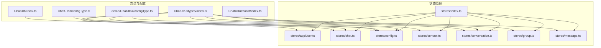
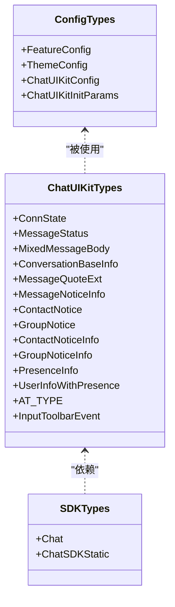
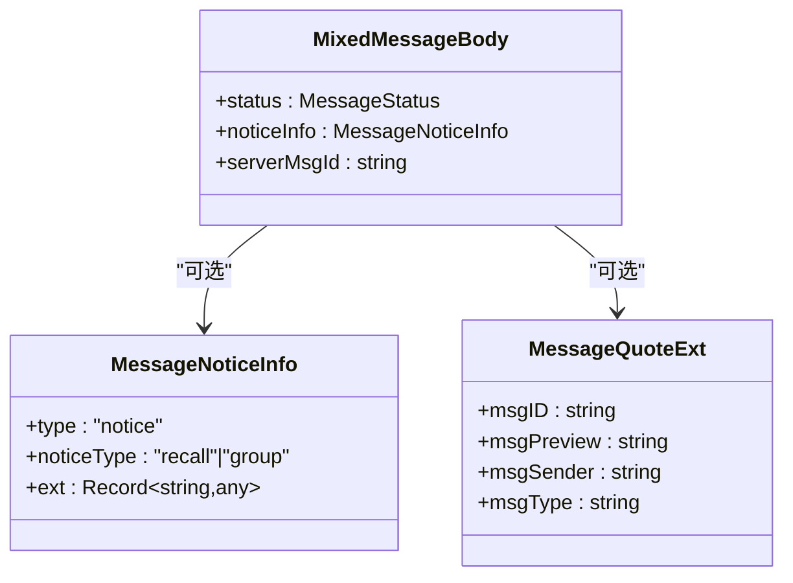
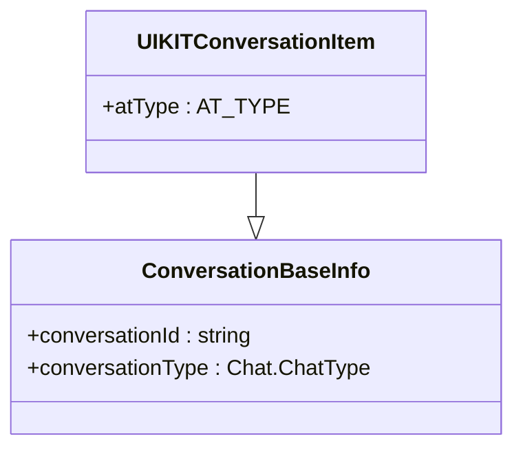
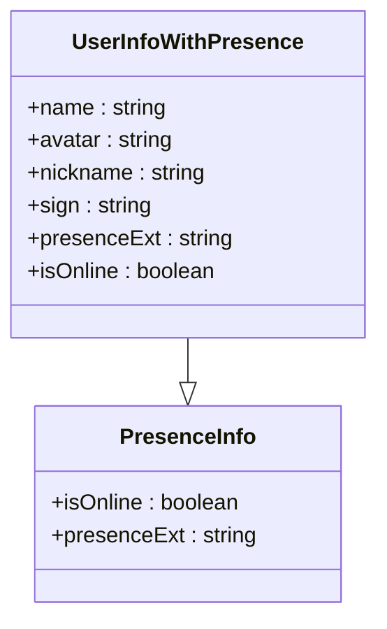
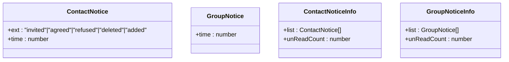
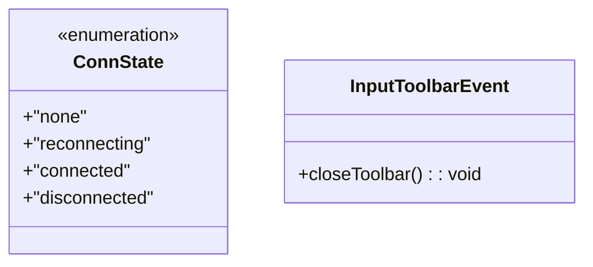
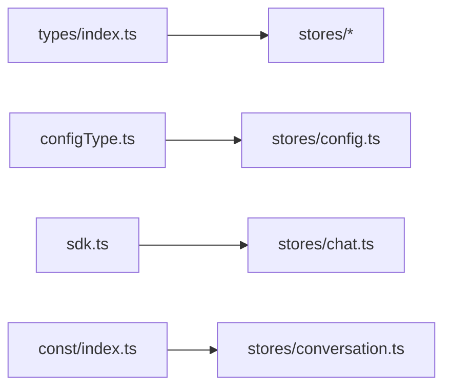

# 类型定义

<cite>
**本文档引用的文件**
- [ChatUIKit/types/index.ts](file://ChatUIKit/types/index.ts)
- [ChatUIKit/configType.ts](file://ChatUIKit/configType.ts)
- [demo/ChatUIKit/configType.ts](file://demo/ChatUIKit/configType.ts)
- [ChatUIKit/stores/index.ts](file://ChatUIKit/stores/index.ts)
- [ChatUIKit/stores/appUser.ts](file://ChatUIKit/stores/appUser.ts)
- [ChatUIKit/stores/chat.ts](file://ChatUIKit/stores/chat.ts)
- [ChatUIKit/stores/config.ts](file://ChatUIKit/stores/config.ts)
- [ChatUIKit/stores/contact.ts](file://ChatUIKit/stores/contact.ts)
- [ChatUIKit/stores/conversation.ts](file://ChatUIKit/stores/conversation.ts)
- [ChatUIKit/stores/group.ts](file://ChatUIKit/stores/group.ts)
- [ChatUIKit/stores/message.ts](file://ChatUIKit/stores/message.ts)
- [ChatUIKit/sdk.ts](file://ChatUIKit/sdk.ts)
- [ChatUIKit/const/index.ts](file://ChatUIKit/const/index.ts)
- [demo/types/uni-app.d.ts](file://demo/types/uni-app.d.ts)
</cite>

## 目录
1. [简介](#简介)
2. [项目结构](#项目结构)
3. [核心类型与接口](#核心类型与接口)
4. [架构总览](#架构总览)
5. [关键组件类型详解](#关键组件类型详解)
6. [依赖关系分析](#依赖关系分析)
7. [性能与可维护性考量](#性能与可维护性考量)
8. [故障排查与类型安全建议](#故障排查与类型安全建议)
9. [结论](#结论)
10. [附录：类型扩展与自定义指南](#附录类型扩展与自定义指南)

## 简介
本文件系统梳理并解释项目中定义的 TypeScript 类型、接口与泛型，覆盖消息类型、配置类型、用户信息类型、会话类型、Presence 类型、工具类型与事件回调类型等。文档同时说明类型之间的继承关系、约束与推导机制，并提供类型扩展与自定义的最佳实践与安全建议。

## 项目结构
项目采用“类型集中定义 + Store 状态与行为”的组织方式：
- 类型与工具：集中在 ChatUIKit/types 与 ChatUIKit/configType.ts、ChatUIKit/sdk.ts、ChatUIKit/const/index.ts
- 状态管理：各模块 Store 定义在 ChatUIKit/stores 下，统一通过 Pinia 管理
- Demo 类型：demo/types/uni-app.d.ts 提供全局类型增强



图表来源
- [ChatUIKit/types/index.ts](file://ChatUIKit/types/index.ts#L1-L100)
- [ChatUIKit/configType.ts](file://ChatUIKit/configType.ts#L1-L68)
- [demo/ChatUIKit/configType.ts](file://demo/ChatUIKit/configType.ts#L1-L68)
- [ChatUIKit/stores/index.ts](file://ChatUIKit/stores/index.ts#L1-L31)
- [ChatUIKit/stores/appUser.ts](file://ChatUIKit/stores/appUser.ts#L1-L242)
- [ChatUIKit/stores/chat.ts](file://ChatUIKit/stores/chat.ts#L1-L407)
- [ChatUIKit/stores/config.ts](file://ChatUIKit/stores/config.ts#L1-L124)
- [ChatUIKit/stores/contact.ts](file://ChatUIKit/stores/contact.ts#L1-L282)
- [ChatUIKit/stores/conversation.ts](file://ChatUIKit/stores/conversation.ts#L1-L421)
- [ChatUIKit/stores/group.ts](file://ChatUIKit/stores/group.ts#L1-L317)
- [ChatUIKit/stores/message.ts](file://ChatUIKit/stores/message.ts#L1-L581)
- [ChatUIKit/sdk.ts](file://ChatUIKit/sdk.ts#L1-L13)
- [ChatUIKit/const/index.ts](file://ChatUIKit/const/index.ts#L1-L37)

章节来源
- [ChatUIKit/stores/index.ts](file://ChatUIKit/stores/index.ts#L1-L31)

## 核心类型与接口
以下为核心类型与接口的分类与用途概览（按文件划分）：

- 消息与会话类型
  - 消息状态枚举：用于表示消息发送/接收/已读等状态
  - 混合消息体：对 SDK 消息体进行扩展，增加 UIKIT 扩展字段
  - 会话基础信息：会话标识与类型
  - 引用消息扩展：用于消息引用预览
  - 通知消息体：用于系统类提示消息
- 用户与 Presence 类型
  - PresenceInfo：用户在线状态与扩展字段
  - 用户信息扩展：包含展示用昵称、头像与 Presence 信息
- 通知类型
  - 联系人通知：好友申请/同意/拒绝/删除等
  - 群组通知：群事件与时间戳
- 连接状态与输入工具栏事件
  - 连接状态枚举：none/reconnecting/connected/disconnected
  - 输入工具栏事件：关闭工具栏等
- 配置类型
  - 功能开关 FeatureConfig：输入、消息、会话、Presence 等开关
  - 主题配置 ThemeConfig：头像形状等
  - 初始化参数 ChatUIKitInitParams：传入 SDK 实例与调试开关
- SDK 类型别名
  - Chat、ChatSDKStatic：从 SDK 包导出的类型别名

章节来源
- [ChatUIKit/types/index.ts](file://ChatUIKit/types/index.ts#L1-L100)
- [ChatUIKit/configType.ts](file://ChatUIKit/configType.ts#L1-L68)
- [demo/ChatUIKit/configType.ts](file://demo/ChatUIKit/configType.ts#L1-L68)
- [ChatUIKit/sdk.ts](file://ChatUIKit/sdk.ts#L1-L13)

## 架构总览
类型在系统中的角色与交互如下：
- ChatUIKit/types/index.ts 定义 UIKIT 层的业务类型，作为各 Store 的类型契约
- ChatUIKit/configType.ts 与 demo/ChatUIKit/configType.ts 定义配置与初始化参数，被 config Store 使用
- stores/* 使用这些类型来声明 state、getters、actions 的参数与返回值
- sdk.ts 提供 SDK 类型别名，使类型与 SDK 版本解耦
- const/index.ts 提供常量与工具常量，影响类型使用场景（如最大消息数）



图表来源
- [ChatUIKit/types/index.ts](file://ChatUIKit/types/index.ts#L1-L100)
- [ChatUIKit/configType.ts](file://ChatUIKit/configType.ts#L1-L68)
- [demo/ChatUIKit/configType.ts](file://demo/ChatUIKit/configType.ts#L1-L68)
- [ChatUIKit/sdk.ts](file://ChatUIKit/sdk.ts#L1-L13)

## 关键组件类型详解

### 消息类型体系
- MessageStatus：消息状态枚举，覆盖发送中、已发送、已接收、已读、未读、失败
- MixedMessageBody：在 SDK 消息体基础上扩展了通知信息、状态、服务端消息 ID 等字段
- MessageQuoteExt：消息引用扩展，包含被引用消息的 ID、预览、发送者、类型
- MessageNoticeInfo：系统类通知消息体，用于“撤回”“群组”等通知
- 引用与状态在 stores/message.ts 中广泛使用，用于渲染与交互



图表来源
- [ChatUIKit/types/index.ts](file://ChatUIKit/types/index.ts#L33-L61)
- [ChatUIKit/stores/message.ts](file://ChatUIKit/stores/message.ts#L1-L581)

章节来源
- [ChatUIKit/types/index.ts](file://ChatUIKit/types/index.ts#L46-L61)
- [ChatUIKit/stores/message.ts](file://ChatUIKit/stores/message.ts#L1-L581)

### 会话类型与 @ 类型
- ConversationBaseInfo：会话标识与类型
- UIKITConversationItem：在 SDK 会话项上扩展 @ 类型字段
- AT_TYPE：@ 类型枚举，用于群聊 @ 提醒
- stores/conversation.ts 中根据消息内容动态设置 @ 类型



图表来源
- [ChatUIKit/types/index.ts](file://ChatUIKit/types/index.ts#L7-L10)
- [ChatUIKit/types/index.ts](file://ChatUIKit/types/index.ts#L63-L65)
- [ChatUIKit/stores/conversation.ts](file://ChatUIKit/stores/conversation.ts#L1-L421)

章节来源
- [ChatUIKit/types/index.ts](file://ChatUIKit/types/index.ts#L63-L65)
- [ChatUIKit/stores/conversation.ts](file://ChatUIKit/stores/conversation.ts#L390-L407)

### 用户与 Presence 类型
- PresenceInfo：用户在线状态与扩展字段
- UserInfoWithPresence：在 SDK 用户信息基础上扩展展示用字段与 Presence 信息
- stores/appUser.ts 通过 getters 组合用户信息与 Presence，形成统一视图



图表来源
- [ChatUIKit/types/index.ts](file://ChatUIKit/types/index.ts#L67-L80)
- [ChatUIKit/stores/appUser.ts](file://ChatUIKit/stores/appUser.ts#L17-L78)

章节来源
- [ChatUIKit/types/index.ts](file://ChatUIKit/types/index.ts#L67-L80)
- [ChatUIKit/stores/appUser.ts](file://ChatUIKit/stores/appUser.ts#L30-L78)

### 通知类型
- ContactNotice：联系人相关通知，扩展了事件类型与时间戳
- GroupNotice：群组事件通知，扩展了时间戳
- ContactNoticeInfo、GroupNoticeInfo：分别承载通知列表与未读计数



图表来源
- [ChatUIKit/types/index.ts](file://ChatUIKit/types/index.ts#L14-L31)
- [ChatUIKit/stores/contact.ts](file://ChatUIKit/stores/contact.ts#L16-L33)
- [ChatUIKit/stores/group.ts](file://ChatUIKit/stores/group.ts#L16-L36)

章节来源
- [ChatUIKit/types/index.ts](file://ChatUIKit/types/index.ts#L14-L31)
- [ChatUIKit/stores/contact.ts](file://ChatUIKit/stores/contact.ts#L219-L256)
- [ChatUIKit/stores/group.ts](file://ChatUIKit/stores/group.ts#L291-L294)

### 连接状态与输入工具栏事件
- ConnState：连接状态枚举
- InputToolbarEvent：输入工具栏事件回调接口



图表来源
- [ChatUIKit/types/index.ts](file://ChatUIKit/types/index.ts#L12-L5)
- [ChatUIKit/stores/chat.ts](file://ChatUIKit/stores/chat.ts#L22-L27)

章节来源
- [ChatUIKit/types/index.ts](file://ChatUIKit/types/index.ts#L12-L5)
- [ChatUIKit/stores/chat.ts](file://ChatUIKit/stores/chat.ts#L54-L61)

### 配置类型与初始化参数
- FeatureConfig：功能开关集合，涵盖输入、消息、会话、Presence 等
- ThemeConfig：主题配置，如头像形状
- ChatUIKitConfig：整体配置对象
- ChatUIKitInitParams：初始化参数，包含 SDK 实例与调试开关

```mermaid
classDiagram
class FeatureConfig {
+useUserInfo : boolean
+muteConversation : boolean
+pinConversation : boolean
+deleteConversation : boolean
+messageStatus : boolean
+copyMessage : boolean
+deleteMessage : boolean
+recallMessage : boolean
+editMessage : boolean
+replyMessage : boolean
+inputEmoji : boolean
+inputImage : boolean
+inputAudio : boolean
+inputVideo : boolean
+inputFile : boolean
+inputMention : boolean
+userCard : boolean
+usePresence : boolean
}
class ThemeConfig {
+avatarShape : "circle"|"square"
}
class ChatUIKitConfig {
+features : FeatureConfig
+theme : ThemeConfig
}
class ChatUIKitInitParams {
+chat : Chat.Connection
+config : { theme : ThemeConfig; isDebug : boolean }
}
```

图表来源
- [ChatUIKit/configType.ts](file://ChatUIKit/configType.ts#L3-L65)
- [demo/ChatUIKit/configType.ts](file://demo/ChatUIKit/configType.ts#L3-L65)

章节来源
- [ChatUIKit/configType.ts](file://ChatUIKit/configType.ts#L3-L65)
- [demo/ChatUIKit/configType.ts](file://demo/ChatUIKit/configType.ts#L3-L65)

### SDK 类型别名
- Chat、ChatSDKStatic：从 SDK 包导入的类型别名，统一对外暴露

章节来源
- [ChatUIKit/sdk.ts](file://ChatUIKit/sdk.ts#L1-L13)

### 常量与工具类型
- 常量：包括群组成员分页大小、@ALL 标识、资源地址、最大会话消息数、Presence 状态列表等
- 这些常量影响类型使用边界与默认行为（如消息清理阈值）

章节来源
- [ChatUIKit/const/index.ts](file://ChatUIKit/const/index.ts#L1-L37)

## 依赖关系分析
- 类型依赖链
  - stores/* 依赖 ChatUIKit/types/index.ts 中的 UIKIT 类型
  - stores/config.ts 依赖 ChatUIKit/configType.ts 或 demo/ChatUIKit/configType.ts
  - stores/chat.ts 依赖 SDK 类型别名（Chat、ChatSDKStatic）
  - stores/conversation.ts 依赖常量（如 @ALL、排序函数）影响 @ 类型推断
- 耦合与内聚
  - 类型集中定义，Store 仅消费类型，降低耦合
  - 配置类型与 Store 解耦，通过 getters/actions 注入配置
- 循环依赖
  - 通过类型别名与导出避免运行时循环依赖



图表来源
- [ChatUIKit/types/index.ts](file://ChatUIKit/types/index.ts#L1-L100)
- [ChatUIKit/configType.ts](file://ChatUIKit/configType.ts#L1-L68)
- [demo/ChatUIKit/configType.ts](file://demo/ChatUIKit/configType.ts#L1-L68)
- [ChatUIKit/stores/config.ts](file://ChatUIKit/stores/config.ts#L1-L124)
- [ChatUIKit/stores/chat.ts](file://ChatUIKit/stores/chat.ts#L1-L407)
- [ChatUIKit/const/index.ts](file://ChatUIKit/const/index.ts#L1-L37)

## 性能与可维护性考量
- 类型驱动的 Store 设计
  - 通过明确的 state/getters/actions 参数类型，减少运行时错误，提升可维护性
- 响应式与缓存
  - 使用 getters 缓存派生状态（如未读总数、排序后的会话列表），避免重复计算
- 分页与清理
  - 常量控制最大消息数，配合清理策略避免内存膨胀
- SDK 类型别名
  - 通过 Chat、ChatSDKStatic 类型别名隔离 SDK 版本差异，便于升级与替换

[本节为通用指导，无需列出章节来源]

## 故障排查与类型安全建议
- 常见问题定位
  - 消息状态异常：检查 MixedMessageBody 的 status 字段更新路径（stores/message.ts）
  - 会话未读数不正确：检查 stores/conversation.ts 的 totalUnreadCount 计算与 muteConvsMap
  - 用户信息缺失：检查 stores/appUser.ts 的 getUsersInfoFromServer 与缓存命中
- 类型安全最佳实践
  - 严格区分 SDK 原始消息体与 UIKIT 扩展消息体（MixedMessageBody）
  - 使用 Pick/Partial 等工具类型精确建模传参，避免宽泛的 any
  - 通过枚举类型（如 ConnState、MessageStatus、AT_TYPE）约束取值范围
  - 在事件回调中使用明确的参数类型（如 onTextMessage: (msg: MixedMessageBody) => void）

章节来源
- [ChatUIKit/stores/message.ts](file://ChatUIKit/stores/message.ts#L498-L504)
- [ChatUIKit/stores/conversation.ts](file://ChatUIKit/stores/conversation.ts#L54-L59)
- [ChatUIKit/stores/appUser.ts](file://ChatUIKit/stores/appUser.ts#L86-L125)

## 结论
本项目通过集中定义的类型体系，将业务语义（消息、会话、用户、通知、配置）清晰地表达出来，并由各 Store 严格遵循类型契约进行状态管理。借助枚举、交叉类型与工具类型，系统在保证类型安全的同时，具备良好的可扩展性与可维护性。

[本节为总结，无需列出章节来源]

## 附录：类型扩展与自定义指南
- 扩展消息体
  - 若需新增消息类型，建议在 ChatUIKit/types/index.ts 中定义新的扩展字段类型，并在 stores/message.ts 中补充对应处理逻辑
- 自定义配置项
  - 在 ChatUIKit/configType.ts 或 demo/ChatUIKit/configType.ts 中新增 FeatureConfig/ThemeConfig 字段，并在 stores/config.ts 中提供默认值与 getter/setter
- 自定义 Presence
  - 在 PresenceInfo 与 UserInfoWithPresence 基础上扩展字段，确保 stores/appUser.ts 的 getters/actions 能兼容新字段
- 全局类型增强
  - 在 demo/types/uni-app.d.ts 中扩展全局类型（如 Uni.$UIKIT），确保 IDE 与编译器识别

章节来源
- [ChatUIKit/types/index.ts](file://ChatUIKit/types/index.ts#L1-L100)
- [ChatUIKit/configType.ts](file://ChatUIKit/configType.ts#L1-L68)
- [demo/ChatUIKit/configType.ts](file://demo/ChatUIKit/configType.ts#L1-L68)
- [ChatUIKit/stores/config.ts](file://ChatUIKit/stores/config.ts#L19-L57)
- [ChatUIKit/stores/appUser.ts](file://ChatUIKit/stores/appUser.ts#L30-L78)
- [demo/types/uni-app.d.ts](file://demo/types/uni-app.d.ts#L1-L7)