# 通用工具函数

<cite>
**本文引用的文件**
- [ChatUIKit/utils/index.ts](file://ChatUIKit/utils/index.ts)
- [ChatUIKit-vue2/utils/index.js](file://ChatUIKit-vue2/utils/index.js)
- [ChatUIKit/const/emoji.ts](file://ChatUIKit/const/emoji.ts)
- [ChatUIKit/types/index.ts](file://ChatUIKit/types/index.ts)
- [ChatUIKit/locales/index.ts](file://ChatUIKit/locales/index.ts)
- [ChatUIKit/modules/Chat/components/Message/messageItem.vue](file://ChatUIKit/modules/Chat/components/Message/messageItem.vue)
- [ChatUIKit/modules/Chat/components/Message/messageTxt.vue](file://ChatUIKit/modules/Chat/components/Message/messageTxt.vue)
- [ChatUIKit/modules/Chat/components/MessageInputToolBar/emojiPicker.vue](file://ChatUIKit/modules/Chat/components/MessageInputToolBar/emojiPicker.vue)
- [ChatUIKit/modules/Chat/components/Message/messageEdit.vue](file://ChatUIKit/modules/Chat/components/Message/messageEdit.vue)
- [ChatUIKit/components/IndexedList/index.vue](file://ChatUIKit/components/IndexedList/index.vue)
- [ChatUIKit/utils/permission.js](file://ChatUIKit/utils/permission.js)
- [vue2-demo/ChatUIKit/utils/index.js](file://vue2-demo/ChatUIKit/utils/index.js)
- [demo/ChatUIKit/utils/index.ts](file://demo/ChatUIKit/utils/index.ts)
</cite>

## 更新摘要
**变更内容**
- 新增 toPlainMessage 工具函数文档：专门处理 SDK Long 类型对象的转换，检测 SDK Long 对象并转换为安全整数或字符串，避免 JSON 序列化错误，特别适用于微信小程序环境
- 扩展性能优化相关函数（防抖、节流、深拷贝）
- 新增 UUID 生成、文件处理、字符串处理等专用函数
- 增加验证和安全、权限管理、平台检测等实用工具
- 完善跨平台兼容性和最佳实践指导

## 目录
1. [简介](#简介)
2. [项目结构](#项目结构)
3. [核心组件](#核心组件)
4. [架构总览](#架构总览)
5. [详细组件分析](#详细组件分析)
6. [新增实用函数详解](#新增实用函数详解)
7. [依赖关系分析](#依赖关系分析)
8. [性能考量](#性能考量)
9. [故障排查指南](#故障排查指南)
10. [结论](#结论)
11. [附录](#附录)

## 简介
本文件系统性梳理并深入解析通用工具函数库，覆盖以下关键能力：
- **时间格式化与人性化时间显示**：formatDate、getTimeStringAutoShort
- **函数节流与防抖**：throttle、debounce
- **深拷贝**：deepClone
- **数组分块**：splitArrayIntoChunks
- **表情符号处理**：formatTextMessage、renderTxt
- **消息摘要格式化**：formatMessage
- **字符检测与按名分组**：checkCharacter、groupByName
- **性能优化相关**：sleep、sortByPinned
- **UUID 生成**：generateUUID、generateMessageId
- **文件处理**：getFileExtension、getFileIconType、formatFileSize
- **字符串处理**：truncateText、parseUrlParams
- **数据处理**：isEmptyObject、uniqueArray、getImageSize、get
- **验证和安全**：isValidPhone、isValidEmail、maskPhone、copyToClipboard、saveImageToAlbum
- **权限管理**：checkPermission、权限检查和设置跳转
- **平台检测**：isWeb、isWXProgram、isAndroid、isIOS、isSafari、isWechat
- **SDK 对象转换**：toPlainMessage（新增）
- **跨平台兼容性与最佳实践**

通过代码级图示、调用流程与时序图，帮助开发者快速掌握这些工具的实现原理、适用场景与性能特征，并提供可复用的最佳实践建议。

## 项目结构
工具函数集中于 ChatUIKit/utils/index.ts 和 ChatUIKit-vue2/utils/index.js，配套常量与类型定义分别位于 ChatUIKit/const/emoji.ts、ChatUIKit/types/index.ts、ChatUIKit/locales/index.ts。多个模块组件通过 import 方式使用这些工具函数，如消息项渲染、表情选择器、编辑器、索引列表等。Vue2版本提供了更丰富的工具函数集合，包括约40+实用函数。

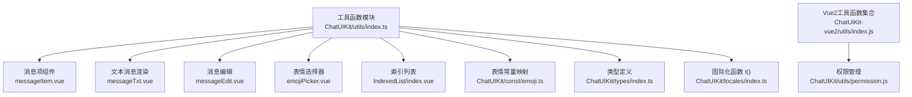

**图表来源**
- [ChatUIKit/utils/index.ts:1-344](file://ChatUIKit/utils/index.ts#L1-L344)
- [ChatUIKit-vue2/utils/index.js:1-820](file://ChatUIKit-vue2/utils/index.js#L1-L820)
- [ChatUIKit/const/emoji.ts:1-127](file://ChatUIKit/const/emoji.ts#L1-L127)
- [ChatUIKit/types/index.ts:1-100](file://ChatUIKit/types/index.ts#L1-L100)
- [ChatUIKit/locales/index.ts:1-17](file://ChatUIKit/locales/index.ts#L1-L17)
- [ChatUIKit/utils/permission.js:1-272](file://ChatUIKit/utils/permission.js#L1-L272)

## 核心组件
本节对每个工具函数进行功能、参数、返回值、复杂度与使用场景的说明，并给出调用方示例路径。

### 基础工具函数
- **formatDate(date, fmt)**
  - 功能：将 Date 对象按自定义格式串输出，支持 y、M、d、h、m、s、q、S 等占位符。
  - 参数：date: Date 实例, fmt: 格式串，默认为空字符串
  - 返回：格式化后的字符串
  - 复杂度：O(n)，n 为 fmt 中匹配项数量
  - 使用场景：统一时间显示格式；被 getTimeStringAutoShort 复用

- **getTimeStringAutoShort(timestamp, mustIncludeTime?)**
  - 功能：根据当前时间与目标时间戳，输出"刚刚"、"今天 HH:mm"、"M/D"或"yyyy/M/d"的人性化时间字符串；可强制包含时间部分。
  - 参数：timestamp: 数字型时间戳, mustIncludeTime?: 布尔，是否强制显示时分
  - 返回：字符串
  - 复杂度：O(1)
  - 使用场景：消息时间显示、会话列表时间提示

- **throttle(func, limit)**
  - 功能：函数节流，限制高频事件触发频率，保证首次与末次调用均被执行。
  - 参数：func: 回调函数, limit: 节流间隔（毫秒）
  - 返回：节流后的函数
  - 复杂度：O(1)
  - 使用场景：滚动、窗口 resize、输入防抖等高频事件

- **deepClone(value)**
  - 功能：深拷贝任意值，支持基础类型、Date、Array、Map、Set、普通对象；对未知类型按原样返回。
  - 参数：任意值
  - 返回：深拷贝副本
  - 复杂度：O(n)，n 为序列化元素总数
  - 使用场景：消息编辑、状态复制、对象保护

- **splitArrayIntoChunks(arr, chunkSize)**
  - 功能：将数组按固定大小切分为若干子数组。
  - 参数：arr: 数组, chunkSize: 每块大小
  - 返回：二维数组
  - 复杂度：O(n)
  - 使用场景：表情面板分页、批量处理

- **formatTextMessage(txt)**
  - 功能：将输入中的"[表情别名]"替换为对应 Unicode 表情，便于发送与显示。
  - 参数：原始文本
  - 返回：替换后的文本
  - 复杂度：O(n)
  - 使用场景：消息编辑器预处理

- **renderTxt(txt)**
  - 功能：将文本拆分为"文本片段/表情片段"的混合数组，用于渲染。
  - 参数：文本
  - 返回：包含 {type, value, alt?} 的数组
  - 复杂度：O(n)
  - 使用场景：消息文本渲染

- **formatMessage(message)**
  - 功能：根据消息体类型生成简洁的摘要文本，支持 txt、img、audio、file、video、custom、combine 等。
  - 参数：MixedMessageBody
  - 返回：字符串
  - 复杂度：O(1)
  - 使用场景：会话列表最后一条消息预览

- **checkCharacter(character)**
  - 功能：识别字符语言类别（中文 zh、英文 en、未知 unknown）。
  - 参数：单个字符
  - 返回：字符串
  - 复杂度：O(1)
  - 使用场景：按名分组、拼音首字母提取

- **groupByName(name)**
  - 功能：根据名称首字符进行分组，中文使用拼音首字母，英文转大写，其他归入"#".
  - 参数：名称字符串
  - 返回：分组键
  - 复杂度：O(1)（拼音处理由 pinyin-pro 提供）
  - 使用场景：通讯录、联系人索引列表

### 性能优化相关函数
- **sortByPinned(a, b)**
  - 功能：按置顶状态和最后消息时间对会话进行排序。
  - 参数：a, b: 会话对象
  - 返回：排序比较结果
  - 复杂度：O(1)
  - 使用场景：会话列表排序

- **sleep(ms)**
  - 功能：休眠/延迟函数，返回 Promise。
  - 参数：ms: 毫秒数
  - 返回：Promise
  - 复杂度：O(1)
  - 使用场景：异步操作延迟、测试等待

### SDK 对象转换函数（新增）
- **toPlainMessage(msg)**
  - 功能：将 SDK 消息对象转换为纯数据对象，专门处理 SDK Long 类型对象的转换，检测 SDK Long 对象并转换为安全整数或字符串，避免 JSON 序列化错误，特别适用于微信小程序环境。
  - 参数：msg: SDK 消息对象或任意值
  - 返回：纯数据对象或原始值
  - 复杂度：O(n)，n 为对象层级数
  - 使用场景：微信小程序中 JSON.stringify 序列化前的数据清理、SDK 对象转换
  - **更新**：新增此函数，专门解决 SDK Long 类型对象的序列化问题

### Vue2版本新增实用函数
- **debounce(fn, delay)**
  - 功能：防抖函数，延迟执行高频操作。
  - 参数：fn: 要执行的函数, delay: 延迟时间（毫秒）
  - 返回：防抖后的函数
  - 复杂度：O(1)
  - 使用场景：输入框实时搜索、窗口大小调整

- **generateUUID()**
  - 功能：生成标准 UUID v4 格式字符串。
  - 参数：无
  - 返回：UUID 字符串
  - 复杂度：O(1)
  - 使用场景：唯一标识符生成

- **generateMessageId()**
  - 功能：生成短格式消息 ID。
  - 参数：无
  - 返回：消息 ID 字符串
  - 复杂度：O(1)
  - 使用场景：消息标识符生成

- **getFileExtension(filename)**
  - 功能：获取文件扩展名。
  - 参数：filename: 文件名
  - 返回：扩展名字符串
  - 复杂度：O(1)
  - 使用场景：文件类型判断

- **getFileIconType(filename)**
  - 功能：根据文件扩展名获取图标类型。
  - 参数：filename: 文件名
  - 返回：图标类型字符串
  - 复杂度：O(1)
  - 使用场景：文件图标显示

- **formatFileSize(bytes, decimals)**
  - 功能：格式化文件大小显示。
  - 参数：bytes: 字节数, decimals: 小数位数
  - 返回：格式化后的文件大小字符串
  - 复杂度：O(1)
  - 使用场景：文件大小显示

- **truncateText(str, maxLength)**
  - 功能：截断文本并在末尾添加省略号。
  - 参数：str: 原文本, maxLength: 最大长度
  - 返回：截断后的文本
  - 复杂度：O(1)
  - 使用场景：文本截断显示

- **parseUrlParams(url)**
  - 功能：解析 URL 查询参数。
  - 参数：url: URL 字符串
  - 返回：参数对象
  - 复杂度：O(n)，n 为参数数量
  - 使用场景：URL 参数解析

- **isEmptyObject(obj)**
  - 功能：判断对象是否为空。
  - 参数：obj: 对象
  - 返回：布尔值
  - 复杂度：O(1)
  - 使用场景：对象检查

- **uniqueArray(arr, key)**
  - 功能：数组去重，支持对象数组按字段去重。
  - 参数：arr: 数组, key: 对象字段（可选）
  - 返回：去重后的数组
  - 复杂度：O(n)
  - 使用场景：数据去重

- **getImageSize(url)**
  - 功能：获取图片的宽高和宽高比。
  - 参数：url: 图片 URL
  - 返回：Promise<{width, height, ratio}>
  - 复杂度：O(1)
  - 使用场景：图片尺寸获取

- **get(obj, path, defaultValue)**
  - 功能：安全获取嵌套对象属性。
  - 参数：obj: 对象, path: 路径字符串, defaultValue: 默认值
  - 返回：属性值
  - 复杂度：O(n)，n 为路径层级数
  - 使用场景：安全属性访问

- **isValidPhone(phone)**
  - 功能：校验中国大陆手机号码。
  - 参数：phone: 手机号码
  - 返回：布尔值
  - 复杂度：O(1)
  - 使用场景：手机号验证

- **isValidEmail(email)**
  - 功能：校验邮箱地址。
  - 参数：email: 邮箱地址
  - 返回：布尔值
  - 复杂度：O(1)
  - 使用场景：邮箱验证

- **maskPhone(phone)**
  - 功能：隐藏手机号中间四位。
  - 参数：phone: 手机号码
  - 返回：掩码后的手机号
  - 复杂度：O(1)
  - 使用场景：隐私保护

- **copyToClipboard(text)**
  - 功能：复制文本到剪贴板。
  - 参数：text: 要复制的文本
  - 返回：Promise<boolean>
  - 复杂度：O(1)
  - 使用场景：一键复制

- **saveImageToAlbum(url)**
  - 功能：保存图片到相册。
  - 参数：url: 图片 URL
  - 返回：Promise<boolean>
  - 复杂度：O(1)
  - 使用场景：图片保存

- **checkPermission(permission)**
  - 功能：检查应用权限状态。
  - 参数：permission: 权限名
  - 返回：Promise<boolean>
  - 复杂度：O(1)
  - 使用场景：权限检查

### 平台检测函数
- **isSafari()**
  - 功能：检测是否为 Safari 浏览器
  - 参数：无
  - 返回：布尔值
  - 复杂度：O(1)
  - 使用场景：浏览器特性检测

- **isiOS()**
  - 功能：检测是否为 iOS 设备
  - 参数：无
  - 返回：布尔值
  - 复杂度：O(1)
  - 使用场景：平台特性检测

- **isWechat()**
  - 功能：检测是否为微信浏览器
  - 参数：无
  - 返回：布尔值
  - 复杂度：O(1)
  - 使用场景：微信环境检测

- **isWXProgram**
  - 功能：检测是否在微信小程序环境中
  - 参数：无
  - 返回：布尔值
  - 复杂度：O(1)
  - 使用场景：小程序环境检测

- **isWeb**
  - 功能：检测是否在 Web 环境中
  - 参数：无
  - 返回：布尔值
  - 复杂度：O(1)
  - 使用场景：Web 环境检测

- **isIOS**
  - 功能：检测是否在 iOS 平台上
  - 参数：无
  - 返回：布尔值
  - 复杂度：O(1)
  - 使用场景：iOS 平台检测

- **isAndroid**
  - 功能：检测是否在 Android 平台上
  - 参数：无
  - 返回：布尔值
  - 复杂度：O(1)
  - 使用场景：Android 平台检测

**章节来源**
- [ChatUIKit/utils/index.ts:6-343](file://ChatUIKit/utils/index.ts#L6-L343)
- [ChatUIKit-vue2/utils/index.js:9-45](file://ChatUIKit-vue2/utils/index.js#L9-L45)
- [vue2-demo/ChatUIKit/utils/index.js:408-776](file://vue2-demo/ChatUIKit/utils/index.js#L408-L776)
- [ChatUIKit/utils/permission.js:1-272](file://ChatUIKit/utils/permission.js#L1-L272)

## 架构总览
工具函数与业务组件的交互关系如下：

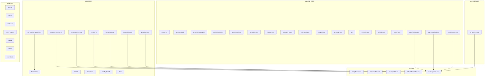

**图表来源**
- [ChatUIKit/utils/index.ts:6-343](file://ChatUIKit/utils/index.ts#L6-L343)
- [ChatUIKit-vue2/utils/index.js:9-45](file://ChatUIKit-vue2/utils/index.js#L9-L45)
- [vue2-demo/ChatUIKit/utils/index.js:408-776](file://vue2-demo/ChatUIKit/utils/index.js#L408-L776)
- [ChatUIKit/utils/permission.js:1-272](file://ChatUIKit/utils/permission.js#L1-L272)

## 详细组件分析

### 时间格式化与人性化时间显示
- **实现要点**
  - formatDate 使用正则替换实现多占位符格式化，支持年份截取、补零等。
  - getTimeStringAutoShort 基于当前时间与目标时间差，结合 mustIncludeTime 决定是否追加"时:分"。
- **性能与边界**
  - O(1) 逻辑分支，O(n) 正则扫描，n 为文本长度。
  - 注意毫秒时间戳传入需先转换为整数。
- **使用建议**
  - 在消息列表与聊天界面统一使用 getTimeStringAutoShort，减少重复逻辑。
  - 对于历史消息较多的场景，建议配合虚拟列表优化渲染。

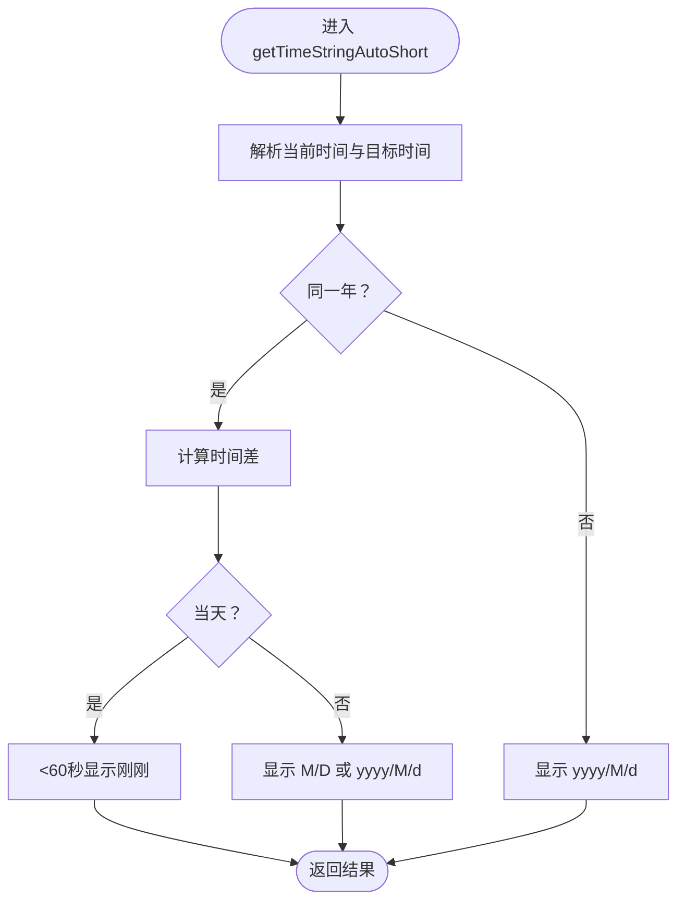

**图表来源**
- [ChatUIKit/utils/index.ts:31-78](file://ChatUIKit/utils/index.ts#L31-L78)

### 函数节流 throttle 与防抖 debounce
- **throttle 实现要点**
  - 使用标志位 inThrottle 与时间戳 lastTime 控制执行节奏；timeoutId 用于延迟触发末次调用。
- **debounce 实现要点**
  - 使用定时器 timer 控制延迟执行，每次调用都重新计时。
- **性能与边界**
  - O(1) 调用开销；throttle 适合高频事件限流，debounce 适合延迟执行。
- **使用建议**
  - 滚动监听、窗口 resize 使用 throttle；输入框实时搜索建议使用 debounce。

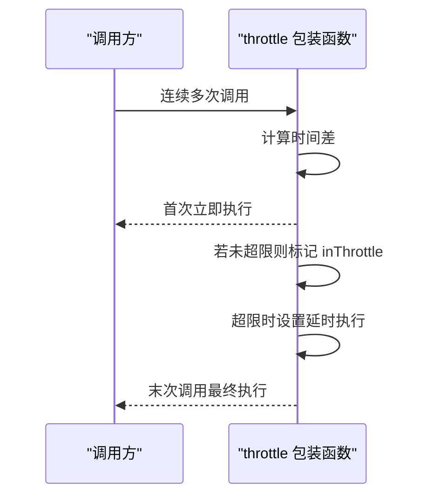

**图表来源**
- [ChatUIKit/utils/index.ts:107-134](file://ChatUIKit/utils/index.ts#L107-L134)

### 深拷贝 deepClone
- **实现要点**
  - 分支处理基础类型、Date、Array、Map、Set、普通对象；递归深拷贝。
- **性能与边界**
  - O(n)；对循环引用、Symbol 键、函数等未知类型按原样返回。
- **使用建议**
  - 编辑消息前先 deepClone，避免修改原始状态；注意大数据量时的内存占用。

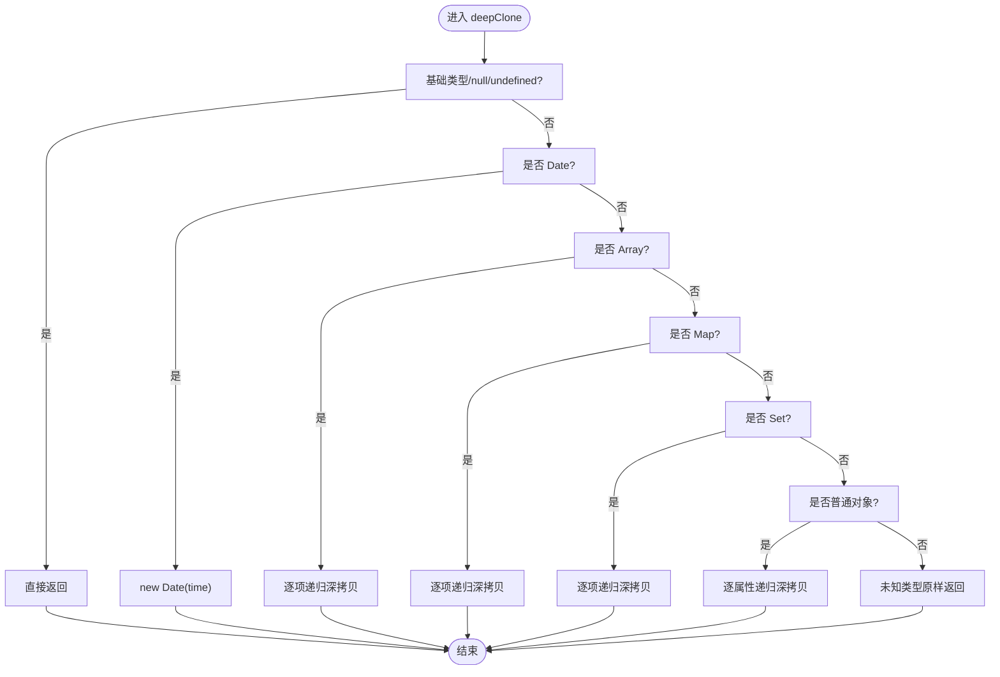

**图表来源**
- [ChatUIKit/utils/index.ts:136-183](file://ChatUIKit/utils/index.ts#L136-L183)

### 数组分块 splitArrayIntoChunks
- **实现要点**
  - 以 chunkSize 为步长遍历数组，使用 slice 截取子数组。
- **性能与边界**
  - O(n)；内存开销与结果数组规模相关。
- **使用建议**
  - 表情面板分页、批量上传分片等场景。

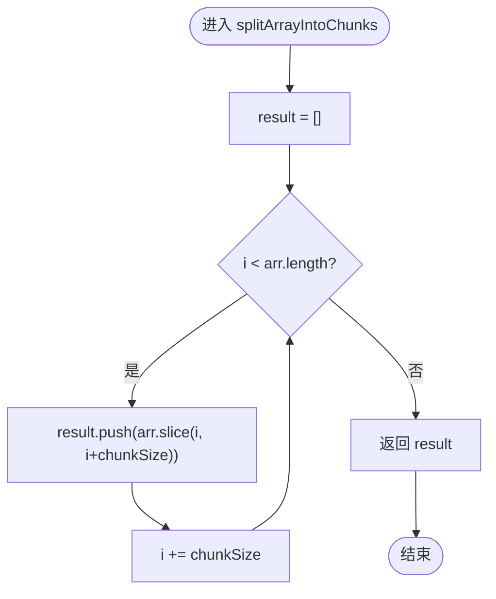

**图表来源**
- [ChatUIKit/utils/index.ts:267-273](file://ChatUIKit/utils/index.ts#L267-L273)

### 表情符号处理
- **formatTextMessage**
  - 将"[表情别名]"替换为 Unicode 表情，依赖 emojiAltMap 映射。
- **renderTxt**
  - 将文本拆分为"文本/表情"片段，用于渲染层消费。

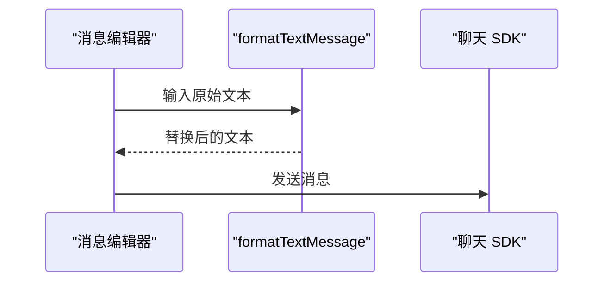

**图表来源**
- [ChatUIKit/utils/index.ts:199-265](file://ChatUIKit/utils/index.ts#L199-L265)

### 消息格式化 formatMessage
- **实现要点**
  - 根据消息类型映射到本地化文案，特殊处理 combine 与 custom 事件。
- **使用建议**
  - 会话列表最后一条消息摘要统一走此函数，避免分散逻辑。

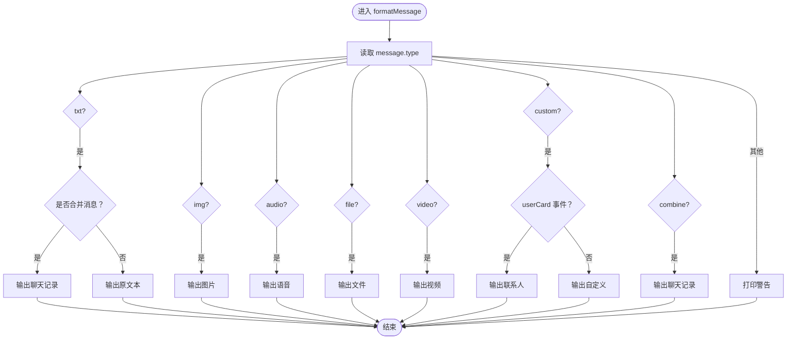

**图表来源**
- [ChatUIKit/utils/index.ts:275-312](file://ChatUIKit/utils/index.ts#L275-L312)

### 字符检测与按名分组
- **checkCharacter**
  - 判断字符是否中文或英文字母，返回标识。
- **groupByName**
  - 中文取拼音首字母，英文转大写，其他归"#".

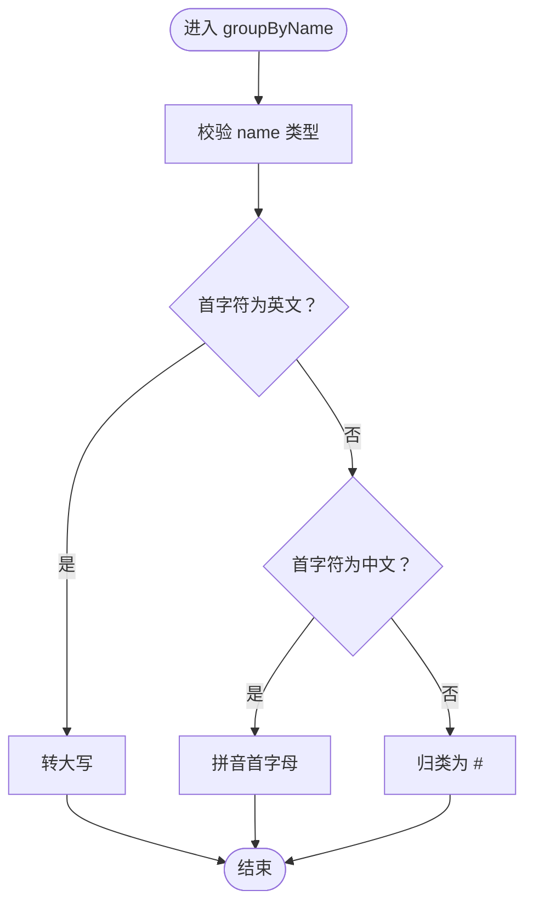

**图表来源**
- [ChatUIKit/utils/index.ts:314-343](file://ChatUIKit/utils/index.ts#L314-L343)

### SDK 对象转换 toPlainMessage（新增）
- **实现要点**
  - 首先检查输入是否为对象，非对象直接返回
  - 检测 SDK Long 类型对象：通过特征检测 low、high 属性是否存在
  - 优先尝试转换为数字，使用 Number.isSafeInteger 检查是否为安全整数
  - 如果超出安全整数范围，转换为字符串
  - 递归处理数组和普通对象，跳过函数类型
- **性能与边界**
  - O(n) 复杂度，n 为对象层级数；对 SDK Long 对象进行 O(1) 特征检测
  - 对于大型对象树，注意内存使用和递归深度限制
- **使用建议**
  - 在微信小程序中使用 JSON.stringify 前调用此函数
  - 处理 SDK 返回的消息对象时，特别是包含时间戳、ID 等数值字段
  - 避免直接序列化 SDK 自定义对象导致的错误

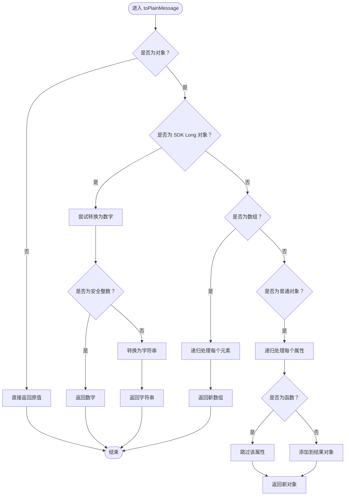

**图表来源**
- [ChatUIKit-vue2/utils/index.js:9-45](file://ChatUIKit-vue2/utils/index.js#L9-L45)

## 新增实用函数详解

### SDK 对象转换 toPlainMessage（新增）
- **功能描述**
  - 专门处理 SDK Long 类型对象的转换，检测 SDK Long 对象并转换为安全整数或字符串，避免 JSON 序列化错误，特别适用于微信小程序环境
- **实现原理**
  - 通过特征检测 SDK Long 对象：检查对象是否具有 low、high 属性
  - 优先尝试转换为数字，使用 Number.isSafeInteger 检查是否为安全整数范围
  - 超出安全整数范围时转换为字符串，确保精度不丢失
  - 递归处理嵌套的对象和数组结构
  - 跳过函数类型的属性，避免序列化错误
- **使用场景**
  - 微信小程序中使用 JSON.stringify 序列化 SDK 返回的消息对象
  - 处理包含时间戳、消息 ID 等数值字段的 SDK 对象
  - 存储 SDK 对象到本地缓存或数据库前的数据清理
- **性能考量**
  - 时间复杂度 O(n)，n 为对象层级数
  - 对 SDK Long 对象进行 O(1) 特征检测
  - 递归处理大型对象树时注意内存使用

### UUID生成相关函数
- **generateUUID()**
  - 生成标准 UUID v4 格式字符串，使用随机数和位运算生成唯一标识符。
  - 适用于需要全局唯一标识符的场景，如消息ID、用户ID等。
- **generateMessageId()**
  - 生成短格式消息ID，结合时间戳和随机数，确保消息的唯一性。
  - 适用于消息系统中快速生成消息标识符。

### 文件处理相关函数
- **getFileExtension(filename)**
  - 从文件名中提取扩展名，支持大小写转换。
  - 适用于文件类型判断和处理。
- **getFileIconType(filename)**
  - 根据文件扩展名自动匹配图标类型，支持多种文件类型的分类。
  - 适用于文件列表展示和图标显示。
- **formatFileSize(bytes, decimals)**
  - 将字节数格式化为人类可读的文件大小，支持多种单位。
  - 适用于文件大小显示和存储空间计算。

### 字符串处理相关函数
- **truncateText(str, maxLength)**
  - 截断超过指定长度的文本并在末尾添加省略号。
  - 适用于文本显示限制和UI适配。
- **parseUrlParams(url)**
  - 解析URL查询参数为对象，支持URL编码解码。
  - 适用于参数传递和路由处理。

### 数据处理相关函数
- **isEmptyObject(obj)**
  - 判断对象是否为空，提高代码健壮性。
  - 适用于数据验证和条件判断。
- **uniqueArray(arr, key)**
  - 数组去重，支持对象数组按指定字段去重。
  - 适用于数据清洗和唯一性保证。
- **getImageSize(url)**
  - 异步获取图片的宽高和宽高比，支持Promise。
  - 适用于图片尺寸计算和布局适配。
- **get(obj, path, defaultValue)**
  - 安全获取嵌套对象属性，防止访问空对象报错。
  - 适用于复杂数据结构的安全访问。

### 验证和安全相关函数
- **isValidPhone(phone)**
  - 校验中国大陆手机号码格式。
  - 适用于用户注册和信息验证。
- **isValidEmail(email)**
  - 校验邮箱地址格式。
  - 适用于用户注册和联系信息验证。
- **maskPhone(phone)**
  - 隐藏手机号中间四位，保护用户隐私。
  - 适用于显示用户手机号但保护隐私。
- **copyToClipboard(text)**
  - 复制文本到剪贴板，支持Promise和用户反馈。
  - 适用于一键复制功能。
- **saveImageToAlbum(url)**
  - 保存图片到相册，支持下载和保存流程。
  - 适用于图片分享和保存功能。

### 权限管理相关函数
- **checkPermission(permission)**
  - 检查应用权限状态，支持微信小程序权限检查。
  - 适用于权限管理和用户引导。
- **权限检查和设置跳转**
  - 支持iOS和Android平台的权限检查和设置页面跳转。
  - 适用于权限管理和用户体验优化。

### 平台检测相关函数
- **isSafari()**
  - 检测是否为Safari浏览器，支持浏览器特性检测。
- **isiOS()**
  - 检测是否为iOS设备，支持平台特性检测。
- **isWechat()**
  - 检测是否为微信浏览器，支持微信环境检测。
- **isWXProgram**
  - 检测是否在微信小程序环境中，支持小程序开发。
- **isWeb**
  - 检测是否在Web环境中，支持Web开发。
- **isIOS**
  - 检测是否在iOS平台上，支持iOS开发。
- **isAndroid**
  - 检测是否在Android平台上，支持Android开发。

**章节来源**
- [ChatUIKit-vue2/utils/index.js:9-45](file://ChatUIKit-vue2/utils/index.js#L9-L45)
- [vue2-demo/ChatUIKit/utils/index.js:425-776](file://vue2-demo/ChatUIKit/utils/index.js#L425-L776)
- [ChatUIKit/utils/permission.js:1-272](file://ChatUIKit/utils/permission.js#L1-L272)

## 依赖关系分析
- **工具函数依赖**
  - formatDate 依赖本地化函数 t() 输出"刚刚"等文案。
  - renderTxt 依赖 emoji.map 与 emojiAltMap。
  - groupByName 依赖 pinyin-pro 进行中文拼音首字母提取。
  - Vue2版本工具函数依赖 uni API 进行跨平台操作。
  - 权限管理函数依赖 plus 和 uni API 进行平台特定操作。
  - **toPlainMessage 依赖 SDK 对象特征检测**：检查对象的 low、high 属性来识别 SDK Long 类型。
- **组件耦合**
  - 多个组件直接 import 工具函数，形成清晰的"纯函数"依赖，降低耦合度。
  - Vue2版本工具函数被更多业务场景使用，包括文件处理、权限管理等。
  - **toPlainMessage 主要被消息处理和存储组件使用**。
- **外部依赖**
  - pinyin-pro：中文拼音处理。
  - uni 环境 API：平台判断（isWXProgram、isWeb、isIOS、isAndroid）。
  - plus API：原生功能调用（仅限App平台）。
  - 微信小程序 API：权限检查和设置跳转。
  - **SDK 对象**：toPlainMessage 处理的特定对象类型。

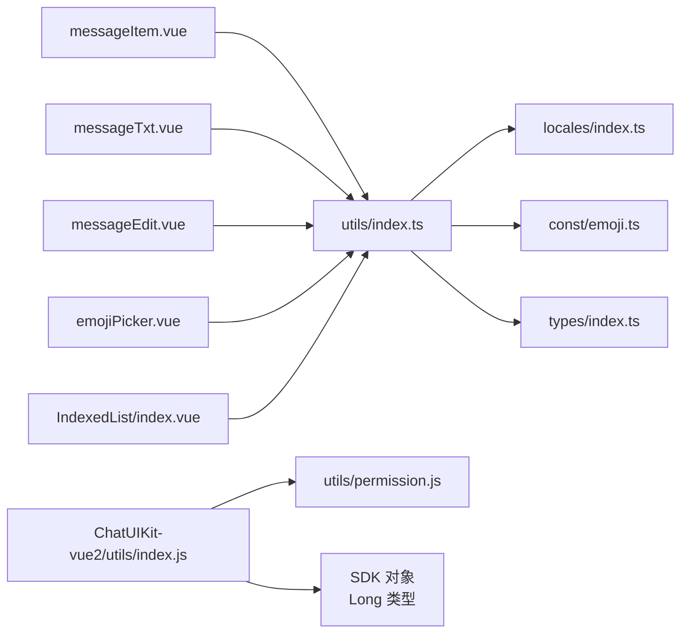

**图表来源**
- [ChatUIKit/utils/index.ts:1-344](file://ChatUIKit/utils/index.ts#L1-L344)
- [ChatUIKit-vue2/utils/index.js:1-820](file://ChatUIKit-vue2/utils/index.js#L1-L820)
- [ChatUIKit/utils/permission.js:1-272](file://ChatUIKit/utils/permission.js#L1-L272)
- [ChatUIKit/locales/index.ts:1-17](file://ChatUIKit/locales/index.ts#L1-L17)
- [ChatUIKit/const/emoji.ts:1-127](file://ChatUIKit/const/emoji.ts#L1-L127)
- [ChatUIKit/types/index.ts:1-100](file://ChatUIKit/types/index.ts#L1-L100)

**章节来源**
- [ChatUIKit/utils/index.ts:1-344](file://ChatUIKit/utils/index.ts#L1-L344)
- [ChatUIKit-vue2/utils/index.js:1-820](file://ChatUIKit-vue2/utils/index.js#L1-L820)
- [vue2-demo/ChatUIKit/utils/index.js:1-776](file://vue2-demo/ChatUIKit/utils/index.js#L1-L776)
- [ChatUIKit/utils/permission.js:1-272](file://ChatUIKit/utils/permission.js#L1-L272)
- [ChatUIKit/locales/index.ts:1-17](file://ChatUIKit/locales/index.ts#L1-L17)
- [ChatUIKit/const/emoji.ts:1-127](file://ChatUIKit/const/emoji.ts#L1-L127)
- [ChatUIKit/types/index.ts:1-100](file://ChatUIKit/types/index.ts#L1-L100)

## 性能考量
- **正则与字符串处理**
  - formatDate 与 renderTxt 均涉及正则扫描与字符串拼接，建议在大量消息渲染时避免重复计算，缓存中间结果。
- **深拷贝成本**
  - deepClone 对大对象/数组深拷贝存在 O(n) 时间与内存开销，建议仅在必要时使用。
- **分块策略**
  - splitArrayIntoChunks 为线性遍历，注意 chunkSize 与 UI 渲染性能的平衡。
- **SDK 对象转换性能（新增）**
  - toPlainMessage 对 SDK Long 对象进行 O(1) 特征检测，递归处理复杂度为 O(n)
  - 对于大型对象树，建议在使用前评估内存使用情况
  - 避免在高频调用场景中重复转换相同对象
- **Vue2版本新增函数性能**
  - UUID生成和文件处理函数均为O(1)复杂度，性能优异。
  - 字符串处理函数如parseUrlParams、truncateText为O(n)复杂度，适合批量处理。
  - 数据处理函数如uniqueArray为O(n)复杂度，适合大数据集去重。
- **权限管理性能**
  - 权限检查函数为异步操作，注意避免频繁调用导致性能问题。
- **平台检测性能**
  - 平台检测函数为O(1)复杂度，可在应用启动时缓存结果。
- **跨端平台差异**
  - isWXProgram、isWeb、isIOS、isAndroid 依赖 uni 平台信息，确保在各端行为一致。
  - Vue2版本工具函数依赖 uni API，注意在不同平台上的兼容性。

## 故障排查指南
- **表情无法正确显示**
  - 检查 emojiAltMap 与 emoji.map 是否完整加载；确认 formatTextMessage 与 renderTxt 的调用顺序。
- **时间显示异常**
  - 确认传入时间戳单位为毫秒；mustIncludeTime 与本地化文案配置。
- **编辑消息无效**
  - 检查 editAble 条件与 deepClone 结果；确认 SDK 创建消息体字段。
- **分组错乱**
  - 检查 groupByName 的字符类型判定与拼音处理；确保排序与"#"
  - 归类逻辑。
- **UUID生成异常**
  - 检查生成的UUID格式是否符合预期；确认随机数生成器正常工作。
- **文件处理错误**
  - 检查文件扩展名解析是否正确；确认文件类型映射表完整。
- **权限检查失败**
  - 检查平台兼容性；确认权限名称正确；处理权限拒绝场景。
- **平台检测异常**
  - 检查uni环境API是否可用；确认平台信息获取逻辑。
- **SDK 对象转换失败（新增）**
  - 检查输入对象是否为 SDK 对象；确认对象具有 low、high 属性
  - 验证 toNumber 方法是否存在；检查 Number.isSafeInteger 的兼容性
  - 对于复杂嵌套对象，确认递归处理是否正确
- **toPlainMessage 性能问题**
  - 检查对象层级深度；避免在高频场景中重复转换
  - 考虑缓存转换结果或批量处理
- **性能问题**
  - 分析函数调用频率；考虑缓存机制；优化大数据集处理。

**章节来源**
- [ChatUIKit/utils/index.ts:136-183](file://ChatUIKit/utils/index.ts#L136-L183)
- [ChatUIKit/utils/index.ts:199-265](file://ChatUIKit/utils/index.ts#L199-L265)
- [ChatUIKit/utils/index.ts:314-343](file://ChatUIKit/utils/index.ts#L314-L343)
- [ChatUIKit-vue2/utils/index.js:9-45](file://ChatUIKit-vue2/utils/index.js#L9-L45)
- [vue2-demo/ChatUIKit/utils/index.js:425-776](file://vue2-demo/ChatUIKit/utils/index.js#L425-L776)
- [ChatUIKit/utils/permission.js:1-272](file://ChatUIKit/utils/permission.js#L1-L272)

## 结论
本工具函数库以"纯函数 + 明确职责"为核心设计思想，现已扩展为包含约40+实用函数的完整工具集。覆盖时间、表情、消息摘要、字符与分组等高频场景，同时新增了性能优化、UUID生成、文件处理、字符串处理、数据处理、验证安全、权限管理、平台检测等多个重要领域。

**新增的 toPlainMessage 函数**专门解决了微信小程序中 SDK Long 类型对象的序列化问题，通过特征检测和智能转换确保数据的准确性和完整性。

通过统一的接口与清晰的调用链路，显著降低了业务组件的复杂度与耦合度。建议在实际开发中遵循：
- 统一使用工具函数进行格式化与渲染
- 对高频事件使用 throttle/debounce
- 深拷贝仅在必要时使用，并关注性能
- 利用Vue2版本的丰富工具函数提升开发效率
- 重视权限管理和跨平台兼容性
- **在微信小程序中使用 toPlainMessage 处理 SDK 对象**，避免序列化错误
- 结合性能考量选择合适的工具函数

## 附录
- **相关类型定义参考**：MixedMessageBody、MessageStatus 等
  - [ChatUIKit/types/index.ts:56-61](file://ChatUIKit/types/index.ts#L56-L61)
- **表情常量映射参考**：emoji.map、emojiAltMap
  - [ChatUIKit/const/emoji.ts:55-127](file://ChatUIKit/const/emoji.ts#L55-L127)
- **Vue2版本工具函数概览**：约40+实用函数，涵盖性能优化、UUID生成、文件处理、字符串处理、数据处理、验证安全、权限管理、平台检测等领域
  - [vue2-demo/ChatUIKit/utils/index.js:1-776](file://vue2-demo/ChatUIKit/utils/index.js#L1-L776)
- **权限管理参考**：平台特定权限检查和设置跳转
  - [ChatUIKit/utils/permission.js:1-272](file://ChatUIKit/utils/permission.js#L1-L272)
- **SDK 对象转换参考**：toPlainMessage 函数实现
  - [ChatUIKit-vue2/utils/index.js:9-45](file://ChatUIKit-vue2/utils/index.js#L9-L45)

**章节来源**
- [ChatUIKit/types/index.ts:56-61](file://ChatUIKit/types/index.ts#L56-L61)
- [ChatUIKit/const/emoji.ts:55-127](file://ChatUIKit/const/emoji.ts#L55-L127)
- [vue2-demo/ChatUIKit/utils/index.js:1-776](file://vue2-demo/ChatUIKit/utils/index.js#L1-L776)
- [ChatUIKit/utils/permission.js:1-272](file://ChatUIKit/utils/permission.js#L1-L272)
- [ChatUIKit-vue2/utils/index.js:9-45](file://ChatUIKit-vue2/utils/index.js#L9-L45)