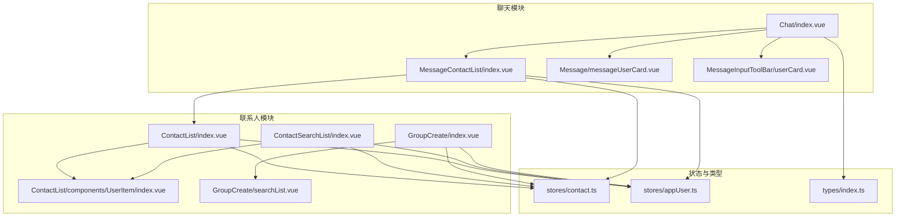
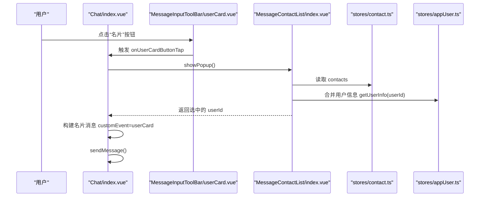
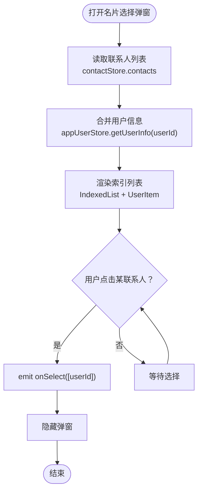
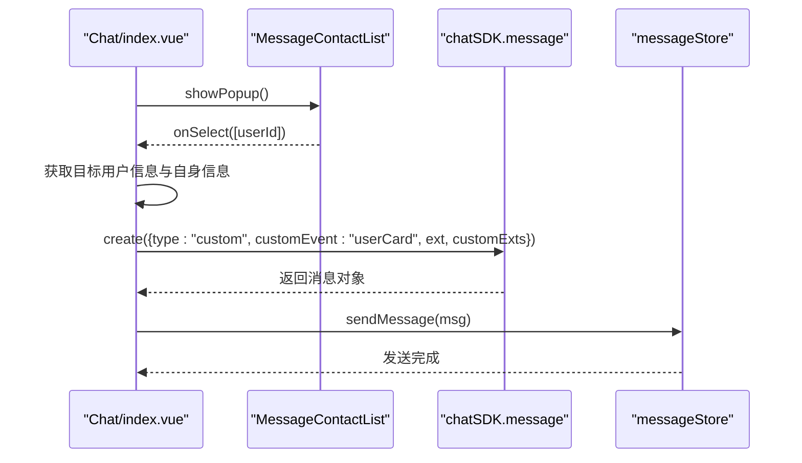
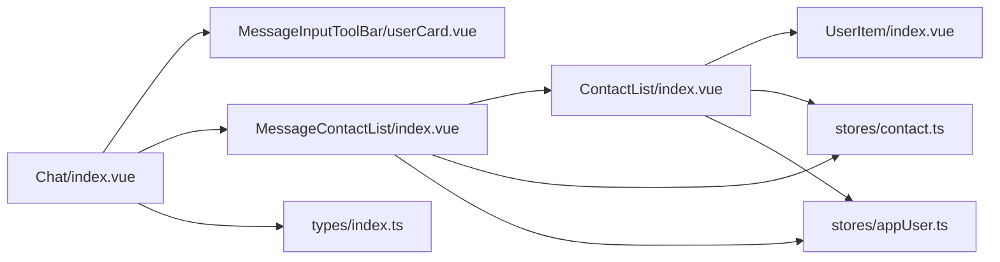

# 名片选择

<cite>
**本文引用的文件**
- [ChatUIKit/modules/Chat/components/MessageContactList/index.vue](file://ChatUIKit/modules/Chat/components/MessageContactList/index.vue)
- [ChatUIKit/modules/Chat/components/MessageInputToolBar/userCard.vue](file://ChatUIKit/modules/Chat/components/MessageInputToolBar/userCard.vue)
- [ChatUIKit/modules/Chat/index.vue](file://ChatUIKit/modules/Chat/index.vue)
- [ChatUIKit/modules/Chat/components/Message/messageUserCard.vue](file://ChatUIKit/modules/Chat/components/Message/messageUserCard.vue)
- [ChatUIKit/modules/ContactList/index.vue](file://ChatUIKit/modules/ContactList/index.vue)
- [ChatUIKit/modules/ContactList/components/UserItem/index.vue](file://ChatUIKit/modules/ContactList/components/UserItem/index.vue)
- [ChatUIKit/modules/ContactSearchList/index.vue](file://ChatUIKit/modules/ContactSearchList/index.vue)
- [ChatUIKit/modules/GroupCreate/index.vue](file://ChatUIKit/modules/GroupCreate/index.vue)
- [ChatUIKit/modules/GroupCreate/searchList.vue](file://ChatUIKit/modules/GroupCreate/searchList.vue)
- [ChatUIKit/stores/contact.ts](file://ChatUIKit/stores/contact.ts)
- [ChatUIKit/stores/appUser.ts](file://ChatUIKit/stores/appUser.ts)
- [ChatUIKit/types/index.ts](file://ChatUIKit/types/index.ts)
- [ChatUIKit/utils/permission.js](file://ChatUIKit/utils/permission.js)
</cite>

## 目录
1. [简介](#简介)
2. [项目结构](#项目结构)
3. [核心组件](#核心组件)
4. [架构总览](#架构总览)
5. [详细组件分析](#详细组件分析)
6. [依赖关系分析](#依赖关系分析)
7. [性能考量](#性能考量)
8. [故障排查指南](#故障排查指南)
9. [结论](#结论)
10. [附录](#附录)

## 简介
本文件围绕“名片选择”功能进行系统化说明，涵盖以下方面：
- 用户名片的选择机制：联系人列表展示、搜索过滤、选择确认
- 名片预览：头像、昵称与备注信息的呈现
- 名片发送流程：用户信息收集、验证与消息构建
- 权限检查、隐私设置与可见性控制
- 名片分享、收藏与常用联系人管理
- 联系人数据同步、权限变更与显示异常问题的解决方案

## 项目结构
名片选择功能涉及聊天输入工具栏、联系人列表、消息展示、搜索与分组等多个模块，配合 Pinia Store 实现数据与状态管理。

**图表来源**
- [ChatUIKit/modules/Chat/index.vue](file://ChatUIKit/modules/Chat/index.vue#L1-L200)
- [ChatUIKit/modules/Chat/components/MessageContactList/index.vue](file://ChatUIKit/modules/Chat/components/MessageContactList/index.vue#L1-L123)
- [ChatUIKit/modules/Chat/components/Message/messageUserCard.vue](file://ChatUIKit/modules/Chat/components/Message/messageUserCard.vue#L1-L79)
- [ChatUIKit/modules/Chat/components/MessageInputToolBar/userCard.vue](file://ChatUIKit/modules/Chat/components/MessageInputToolBar/userCard.vue#L1-L32)
- [ChatUIKit/modules/ContactList/index.vue](file://ChatUIKit/modules/ContactList/index.vue#L1-L115)
- [ChatUIKit/modules/ContactList/components/UserItem/index.vue](file://ChatUIKit/modules/ContactList/components/UserItem/index.vue#L1-L165)
- [ChatUIKit/modules/ContactSearchList/index.vue](file://ChatUIKit/modules/ContactSearchList/index.vue#L1-L117)
- [ChatUIKit/modules/GroupCreate/index.vue](file://ChatUIKit/modules/GroupCreate/index.vue#L47-L77)
- [ChatUIKit/modules/GroupCreate/searchList.vue](file://ChatUIKit/modules/GroupCreate/searchList.vue#L42-L107)
- [ChatUIKit/stores/contact.ts](file://ChatUIKit/stores/contact.ts#L1-L282)
- [ChatUIKit/stores/appUser.ts](file://ChatUIKit/stores/appUser.ts#L1-L242)
- [ChatUIKit/types/index.ts](file://ChatUIKit/types/index.ts#L1-L100)

**章节来源**
- [ChatUIKit/modules/Chat/index.vue](file://ChatUIKit/modules/Chat/index.vue#L1-L200)
- [ChatUIKit/modules/Chat/components/MessageContactList/index.vue](file://ChatUIKit/modules/Chat/components/MessageContactList/index.vue#L1-L123)
- [ChatUIKit/modules/Chat/components/Message/messageUserCard.vue](file://ChatUIKit/modules/Chat/components/Message/messageUserCard.vue#L1-L79)
- [ChatUIKit/modules/Chat/components/MessageInputToolBar/userCard.vue](file://ChatUIKit/modules/Chat/components/MessageInputToolBar/userCard.vue#L1-L32)
- [ChatUIKit/modules/ContactList/index.vue](file://ChatUIKit/modules/ContactList/index.vue#L1-L115)
- [ChatUIKit/modules/ContactList/components/UserItem/index.vue](file://ChatUIKit/modules/ContactList/components/UserItem/index.vue#L1-L165)
- [ChatUIKit/modules/ContactSearchList/index.vue](file://ChatUIKit/modules/ContactSearchList/index.vue#L1-L117)
- [ChatUIKit/modules/GroupCreate/index.vue](file://ChatUIKit/modules/GroupCreate/index.vue#L47-L77)
- [ChatUIKit/modules/GroupCreate/searchList.vue](file://ChatUIKit/modules/GroupCreate/searchList.vue#L42-L107)
- [ChatUIKit/stores/contact.ts](file://ChatUIKit/stores/contact.ts#L1-L282)
- [ChatUIKit/stores/appUser.ts](file://ChatUIKit/stores/appUser.ts#L1-L242)
- [ChatUIKit/types/index.ts](file://ChatUIKit/types/index.ts#L1-L100)

## 核心组件
- 名片选择弹窗：MessageContactList 提供联系人索引列表与选择回调
- 输入工具栏按钮：MessageInputToolBar/userCard 触发名片选择弹窗
- 名片消息渲染：Message/messageUserCard 展示名片内容与头像
- 联系人列表与用户项：ContactList/UserItem 展示联系人并支持滑动操作
- 搜索与分组：ContactSearchList 与 GroupCreate/searchList 支持搜索过滤
- 状态与数据：Pinia Store contact 与 appUser 管理联系人与用户信息

**章节来源**
- [ChatUIKit/modules/Chat/components/MessageContactList/index.vue](file://ChatUIKit/modules/Chat/components/MessageContactList/index.vue#L1-L123)
- [ChatUIKit/modules/Chat/components/MessageInputToolBar/userCard.vue](file://ChatUIKit/modules/Chat/components/MessageInputToolBar/userCard.vue#L1-L32)
- [ChatUIKit/modules/Chat/components/Message/messageUserCard.vue](file://ChatUIKit/modules/Chat/components/Message/messageUserCard.vue#L1-L79)
- [ChatUIKit/modules/ContactList/index.vue](file://ChatUIKit/modules/ContactList/index.vue#L1-L115)
- [ChatUIKit/modules/ContactList/components/UserItem/index.vue](file://ChatUIKit/modules/ContactList/components/UserItem/index.vue#L1-L165)
- [ChatUIKit/modules/ContactSearchList/index.vue](file://ChatUIKit/modules/ContactSearchList/index.vue#L1-L117)
- [ChatUIKit/modules/GroupCreate/searchList.vue](file://ChatUIKit/modules/GroupCreate/searchList.vue#L42-L107)
- [ChatUIKit/stores/contact.ts](file://ChatUIKit/stores/contact.ts#L1-L282)
- [ChatUIKit/stores/appUser.ts](file://ChatUIKit/stores/appUser.ts#L1-L242)

## 架构总览
名片选择的端到端流程如下：

**图表来源**
- [ChatUIKit/modules/Chat/index.vue](file://ChatUIKit/modules/Chat/index.vue#L164-L209)
- [ChatUIKit/modules/Chat/components/MessageInputToolBar/userCard.vue](file://ChatUIKit/modules/Chat/components/MessageInputToolBar/userCard.vue#L1-L32)
- [ChatUIKit/modules/Chat/components/MessageContactList/index.vue](file://ChatUIKit/modules/Chat/components/MessageContactList/index.vue#L47-L68)
- [ChatUIKit/stores/contact.ts](file://ChatUIKit/stores/contact.ts#L35-L76)
- [ChatUIKit/stores/appUser.ts](file://ChatUIKit/stores/appUser.ts#L30-L79)

## 详细组件分析

### 名片选择弹窗：MessageContactList
- 功能要点
  - 展示联系人索引列表，逐项渲染 UserItem
  - 通过 emits 回传选中的用户 ID 数组
  - 提供 showPopup/hidePopup 暴露方法供父组件控制
- 数据来源
  - 联系人列表 contacts 来自 contactStore
  - 用户信息 name、avatar 由 appUserStore.getUserInfo 合并
- 交互行为
  - 点击某联系人触发 onSelect(userId)，并通过 emits 回传 [userId]，随后隐藏弹窗

**图表来源**
- [ChatUIKit/modules/Chat/components/MessageContactList/index.vue](file://ChatUIKit/modules/Chat/components/MessageContactList/index.vue#L47-L68)
- [ChatUIKit/stores/contact.ts](file://ChatUIKit/stores/contact.ts#L35-L76)
- [ChatUIKit/stores/appUser.ts](file://ChatUIKit/stores/appUser.ts#L30-L79)

**章节来源**
- [ChatUIKit/modules/Chat/components/MessageContactList/index.vue](file://ChatUIKit/modules/Chat/components/MessageContactList/index.vue#L1-L123)
- [ChatUIKit/stores/contact.ts](file://ChatUIKit/stores/contact.ts#L35-L76)
- [ChatUIKit/stores/appUser.ts](file://ChatUIKit/stores/appUser.ts#L30-L79)

### 输入工具栏名片按钮：MessageInputToolBar/userCard
- 功能要点
  - 渲染名片图标按钮，点击时注入 InputToolbarEvent 并触发 onUserCardButtonTap
  - 用于唤起名片选择弹窗
- 交互行为
  - 关闭输入工具栏后，触发 Chat/index.vue 中的 selectUserCard，进而调用 MessageContactList.showPopup

**章节来源**
- [ChatUIKit/modules/Chat/components/MessageInputToolBar/userCard.vue](file://ChatUIKit/modules/Chat/components/MessageInputToolBar/userCard.vue#L1-L32)
- [ChatUIKit/modules/Chat/index.vue](file://ChatUIKit/modules/Chat/index.vue#L164-L166)

### 名片消息渲染：Message/messageUserCard
- 功能要点
  - 展示名片消息卡片，包含头像与昵称
  - 支持区分“自己发出”与“他人发出”的样式
- 数据来源
  - 从消息体 customExts 中读取 uid、avatar、nickname
  - 通过 appUserStore.getUserInfo(uid) 获取用户信息作为兜底

**章节来源**
- [ChatUIKit/modules/Chat/components/Message/messageUserCard.vue](file://ChatUIKit/modules/Chat/components/Message/messageUserCard.vue#L1-L79)
- [ChatUIKit/stores/appUser.ts](file://ChatUIKit/stores/appUser.ts#L30-L79)

### 联系人列表与用户项：ContactList/UserItem
- 功能要点
  - 展示联系人列表，支持分组与请求计数
  - UserItem 支持滑动手势，长按触发菜单
- 交互行为
  - 点击联系人跳转到单聊页面
  - 支持侧滑删除联系人（异步调用 contactStore.deleteContact）

**章节来源**
- [ChatUIKit/modules/ContactList/index.vue](file://ChatUIKit/modules/ContactList/index.vue#L1-L115)
- [ChatUIKit/modules/ContactList/components/UserItem/index.vue](file://ChatUIKit/modules/ContactList/components/UserItem/index.vue#L1-L165)

### 搜索与分组：ContactSearchList 与 GroupCreate/searchList
- 功能要点
  - ContactSearchList：在输入时过滤联系人列表，匹配用户名称
  - GroupCreate/searchList：在输入时过滤联系人列表，支持多选
- 数据来源
  - 通过 appUserStore.getUserInfo(userId).name 进行包含匹配

**章节来源**
- [ChatUIKit/modules/ContactSearchList/index.vue](file://ChatUIKit/modules/ContactSearchList/index.vue#L1-L117)
- [ChatUIKit/modules/GroupCreate/searchList.vue](file://ChatUIKit/modules/GroupCreate/searchList.vue#L42-L107)
- [ChatUIKit/stores/appUser.ts](file://ChatUIKit/stores/appUser.ts#L30-L79)

### 发送名片流程：Chat/index.vue
- 功能要点
  - 点击名片按钮 -> 打开名片选择弹窗 -> 选择联系人 -> 构建名片消息 -> 发送
- 消息构建
  - customEvent 设为 userCard
  - ext 字段包含当前用户头像与昵称（ease_chat_uikit_user_info）
  - customExts 包含目标用户头像、昵称与 uid
- 发送与回显
  - 通过 messageStore.sendMessage 完成发送
  - 消息在消息列表中以 messageUserCard 形式渲染

**图表来源**
- [ChatUIKit/modules/Chat/index.vue](file://ChatUIKit/modules/Chat/index.vue#L185-L209)
- [ChatUIKit/modules/Chat/components/MessageContactList/index.vue](file://ChatUIKit/modules/Chat/components/MessageContactList/index.vue#L56-L59)

**章节来源**
- [ChatUIKit/modules/Chat/index.vue](file://ChatUIKit/modules/Chat/index.vue#L185-L209)

### 权限检查、隐私设置与可见性控制
- 权限检查
  - 工具模块 permission.js 提供 iOS/Android 权限判断与系统服务检查能力
  - 可用于在名片选择前对设备权限进行前置校验（如定位、相机等）
- 隐私与可见性
  - 用户信息来源优先级：本地缓存 -> 服务器拉取
  - 用户信息缓存由 appUserStore 管理；当 featureConfig 禁用用户信息时，getUserInfo 将返回默认值
  - presence 在 UserItem 中按配置开关显示

**章节来源**
- [ChatUIKit/utils/permission.js](file://ChatUIKit/utils/permission.js#L1-L272)
- [ChatUIKit/stores/appUser.ts](file://ChatUIKit/stores/appUser.ts#L86-L125)
- [ChatUIKit/modules/ContactList/components/UserItem/index.vue](file://ChatUIKit/modules/ContactList/components/UserItem/index.vue#L46-L51)

### 名片分享、收藏与常用联系人管理
- 分享
  - 通过名片选择弹窗选择联系人，发送名片消息实现分享
- 收藏与常用联系人
  - 代码库未提供专门的“收藏/常用联系人”实现；可通过业务扩展在 contactStore 中新增标识字段，并在 UI 中展示
- 建议实现思路
  - 在 contactStore 中维护一个“常用联系人集合”
  - 在 ContactList/UserItem 中增加收藏按钮与状态切换
  - 在名片选择弹窗中优先展示常用联系人

[本节为概念性建议，不直接分析具体文件]

### 联系人数据同步、权限变更与显示异常
- 数据同步
  - contactStore.getContacts 会拉取全部联系人并异步分页拉取用户信息
  - appUserStore.getUsersInfoFromServer 仅对未缓存用户发起请求，避免重复拉取
- 权限变更
  - 当用户信息功能被禁用时，getUserInfo 返回默认值（如 userId），避免崩溃
- 显示异常排查
  - 头像为空时使用占位图
  - 名称缺失时回退为 userId
  - presenceExt 为空时不显示状态文本

**章节来源**
- [ChatUIKit/stores/contact.ts](file://ChatUIKit/stores/contact.ts#L112-L130)
- [ChatUIKit/stores/appUser.ts](file://ChatUIKit/stores/appUser.ts#L86-L125)
- [ChatUIKit/modules/ContactList/components/UserItem/index.vue](file://ChatUIKit/modules/ContactList/components/UserItem/index.vue#L46-L51)

## 依赖关系分析
- 组件耦合
  - Chat/index.vue 依赖 MessageContactList、MessageInputToolBar、messageUserCard
  - MessageContactList 依赖 ContactList/UserItem、IndexedList
  - 联系人与用户信息依赖 Pinia Store
- 外部依赖
  - chatSDK 用于创建与发送名片消息
  - types/index.ts 提供类型约束

**图表来源**
- [ChatUIKit/modules/Chat/index.vue](file://ChatUIKit/modules/Chat/index.vue#L74-L95)
- [ChatUIKit/modules/Chat/components/MessageContactList/index.vue](file://ChatUIKit/modules/Chat/components/MessageContactList/index.vue#L32-L45)
- [ChatUIKit/modules/ContactList/index.vue](file://ChatUIKit/modules/ContactList/index.vue#L30-L42)
- [ChatUIKit/stores/contact.ts](file://ChatUIKit/stores/contact.ts#L25-L33)
- [ChatUIKit/stores/appUser.ts](file://ChatUIKit/stores/appUser.ts#L24-L28)
- [ChatUIKit/types/index.ts](file://ChatUIKit/types/index.ts#L1-L100)

**章节来源**
- [ChatUIKit/modules/Chat/index.vue](file://ChatUIKit/modules/Chat/index.vue#L74-L95)
- [ChatUIKit/modules/Chat/components/MessageContactList/index.vue](file://ChatUIKit/modules/Chat/components/MessageContactList/index.vue#L32-L45)
- [ChatUIKit/modules/ContactList/index.vue](file://ChatUIKit/modules/ContactList/index.vue#L30-L42)
- [ChatUIKit/stores/contact.ts](file://ChatUIKit/stores/contact.ts#L25-L33)
- [ChatUIKit/stores/appUser.ts](file://ChatUIKit/stores/appUser.ts#L24-L28)
- [ChatUIKit/types/index.ts](file://ChatUIKit/types/index.ts#L1-L100)

## 性能考量
- 分页拉取用户信息：contactStore.deepGetUserInfo 按页拉取，避免一次性请求过多用户
- 响应式缓存：appUserStore 使用对象映射缓存用户信息，减少重复请求
- 列表渲染：IndexedList 与 computed 合并数据，避免不必要的重渲染
- 消息发送：名片消息为轻量自定义消息，发送成本低

[本节为通用性能建议，不直接分析具体文件]

## 故障排查指南
- 名片无法发送
  - 检查 featureConfig.userCard 是否启用
  - 确认 chatSDK.message.create 与 sendMessage 正常执行
- 头像/昵称为空
  - 检查 appUserStore 缓存与服务器拉取逻辑
  - 确认 getUserInfo 默认回退逻辑生效
- 联系人列表空白
  - 检查 contactStore.getContacts 是否成功拉取联系人
  - 确认 deepGetUserInfo 是否触发分页拉取
- 权限相关异常
  - 使用 permission.js 对设备权限进行前置校验
  - 在用户信息功能被禁用时，确认 UI 能正确回退

**章节来源**
- [ChatUIKit/modules/Chat/index.vue](file://ChatUIKit/modules/Chat/index.vue#L115-L116)
- [ChatUIKit/stores/contact.ts](file://ChatUIKit/stores/contact.ts#L112-L130)
- [ChatUIKit/stores/appUser.ts](file://ChatUIKit/stores/appUser.ts#L86-L125)
- [ChatUIKit/utils/permission.js](file://ChatUIKit/utils/permission.js#L1-L272)

## 结论
名片选择功能通过“输入工具栏按钮 -> 名片选择弹窗 -> 发送名片消息”的链路实现，结合 Pinia Store 的联系人与用户信息管理，具备良好的扩展性与可维护性。建议在后续版本中补充“收藏/常用联系人”与“隐私可见性控制”能力，并持续优化数据同步与权限校验流程。

## 附录
- 类型定义参考：UserInfoWithPresence、PresenceInfo、MixedMessageBody 等
- 常用工具：permission.js 提供跨平台权限检查

**章节来源**
- [ChatUIKit/types/index.ts](file://ChatUIKit/types/index.ts#L67-L99)
- [ChatUIKit/utils/permission.js](file://ChatUIKit/utils/permission.js#L1-L272)