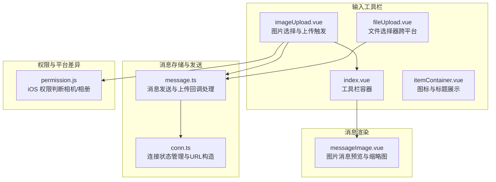
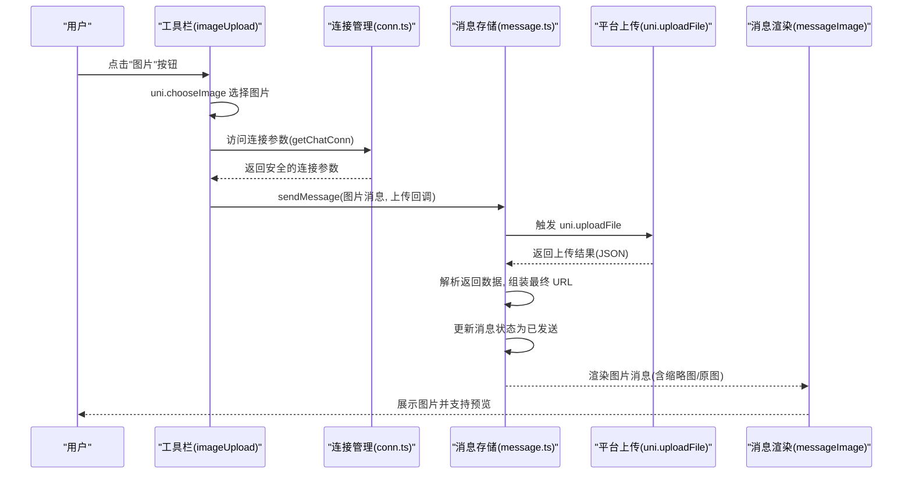
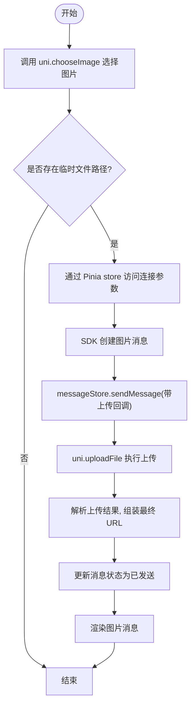
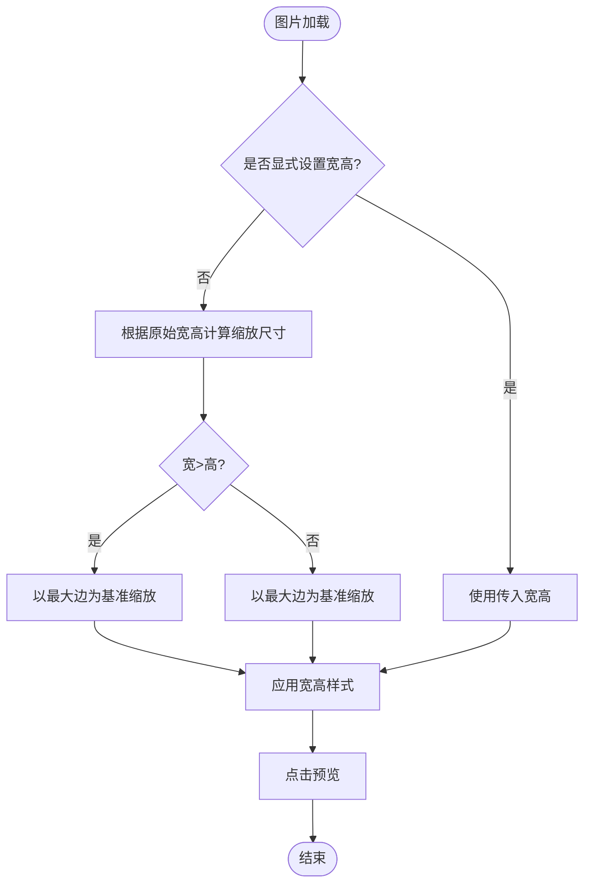
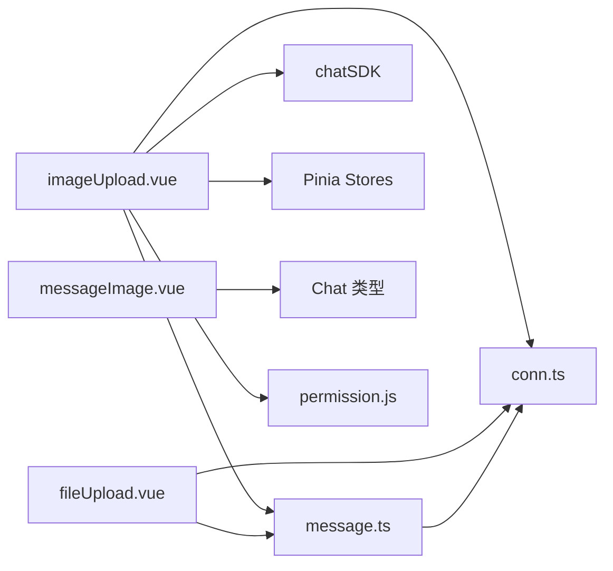

# 图片上传

<cite>
**本文档引用的文件**
- [imageUpload.vue](file://ChatUIKit/modules/Chat/components/MessageInputToolBar/imageUpload.vue)
- [index.vue](file://ChatUIKit/modules/Chat/components/MessageInputToolBar/index.vue)
- [messageImage.vue](file://ChatUIKit/modules/Chat/components/Message/messageImage.vue)
- [message.ts](file://ChatUIKit/stores/message.ts)
- [conn.ts](file://ChatUIKit/stores/conn.ts)
- [permission.js](file://ChatUIKit/utils/permission.js)
- [fileUpload.vue](file://ChatUIKit/modules/Chat/components/MessageInputToolBar/fileUpload.vue)
- [itemContainer.vue](file://ChatUIKit/modules/Chat/components/MessageInputToolBar/itemContainer.vue)
</cite>

## 更新摘要
**变更内容**
- 修复了图片上传组件中的URL构造错误，改进了通过Pinia store访问连接参数的方式
- 优化了URL构造的稳定性，确保连接参数的正确获取和使用
- 增强了连接状态检查，防止未初始化的连接导致的运行时错误

## 目录
1. [简介](#简介)
2. [项目结构](#项目结构)
3. [核心组件](#核心组件)
4. [架构总览](#架构总览)
5. [详细组件分析](#详细组件分析)
6. [依赖关系分析](#依赖关系分析)
7. [性能考虑](#性能考虑)
8. [故障排查指南](#故障排查指南)
9. [结论](#结论)

## 简介
本文件系统性梳理了聊天界面中的图片上传功能，覆盖以下方面：
- 图片选择器实现：相册选择、拍照与文件选择器的集成方式
- 图片预览组件：缩略图生成、裁剪与旋转能力
- 图片压缩与尺寸控制：质量控制与尺寸限制策略
- 上传流程：进度显示、错误处理与重试机制
- 安全与合规：格式校验、大小检查与安全过滤
- 大图处理、网络异常与存储空间不足问题的应对方案

**更新** 本版本重点修复了URL构造错误，改进了通过Pinia store访问连接参数的方式，使URL构造更加稳定可靠

## 项目结构
图片上传相关的核心文件位于 ChatUIKit 的模块化目录中，主要涉及输入工具栏、消息渲染与消息存储三个层面。

**图表来源**
- [imageUpload.vue](file://ChatUIKit/modules/Chat/components/MessageInputToolBar/imageUpload.vue#L1-L85)
- [index.vue](file://ChatUIKit/modules/Chat/components/MessageInputToolBar/index.vue#L1-L69)
- [itemContainer.vue](file://ChatUIKit/modules/Chat/components/MessageInputToolBar/itemContainer.vue#L1-L46)
- [fileUpload.vue](file://ChatUIKit/modules/Chat/components/MessageInputToolBar/fileUpload.vue#L1-L104)
- [messageImage.vue](file://ChatUIKit/modules/Chat/components/Message/messageImage.vue#L1-L84)
- [message.ts](file://ChatUIKit/stores/message.ts#L223-L336)
- [conn.ts](file://ChatUIKit/stores/conn.ts#L25-L40)
- [permission.js](file://ChatUIKit/utils/permission.js#L82-L111)

**章节来源**
- [imageUpload.vue](file://ChatUIKit/modules/Chat/components/MessageInputToolBar/imageUpload.vue#L1-L85)
- [index.vue](file://ChatUIKit/modules/Chat/components/MessageInputToolBar/index.vue#L1-L69)
- [itemContainer.vue](file://ChatUIKit/modules/Chat/components/MessageInputToolBar/itemContainer.vue#L1-L46)
- [fileUpload.vue](file://ChatUIKit/modules/Chat/components/MessageInputToolBar/fileUpload.vue#L1-L104)
- [messageImage.vue](file://ChatUIKit/modules/Chat/components/Message/messageImage.vue#L1-L84)
- [message.ts](file://ChatUIKit/stores/message.ts#L223-L336)
- [conn.ts](file://ChatUIKit/stores/conn.ts#L25-L40)
- [permission.js](file://ChatUIKit/utils/permission.js#L82-L111)

## 核心组件
- 图片选择器（imageUpload.vue）：封装 uni.chooseImage 调用，支持从相册选择图片，并通过 SDK 创建图片消息后交由消息存储层发送与上传。
- 工具栏容器（index.vue）：聚合图片、视频、文件、用户卡片等工具项，按配置开关显示。
- 图片预览组件（messageImage.vue）：负责图片渲染、错误兜底、点击预览与自适应缩放。
- 消息存储与发送（message.ts）：统一处理消息发送、上传回调、URL 替换与状态更新。
- 连接状态管理（conn.ts）：提供类型安全的连接访问，确保URL构造的稳定性。
- 文件选择器（fileUpload.vue）：在不同平台使用不同的选择器 API，统一走上传流程。
- 权限工具（permission.js）：提供 iOS 平台相机与相册权限判断，为后续拍照/相册访问做前置准备。

**更新** 新增了连接状态管理组件，专门负责URL构造和连接参数的安全访问

**章节来源**
- [imageUpload.vue](file://ChatUIKit/modules/Chat/components/MessageInputToolBar/imageUpload.vue#L31-L76)
- [index.vue](file://ChatUIKit/modules/Chat/components/MessageInputToolBar/index.vue#L6-L20)
- [messageImage.vue](file://ChatUIKit/modules/Chat/components/Message/messageImage.vue#L21-L76)
- [message.ts](file://ChatUIKit/stores/message.ts#L223-L336)
- [conn.ts](file://ChatUIKit/stores/conn.ts#L25-L40)
- [fileUpload.vue](file://ChatUIKit/modules/Chat/components/MessageInputToolBar/fileUpload.vue#L56-L95)
- [permission.js](file://ChatUIKit/utils/permission.js#L82-L111)

## 架构总览
下图展示了从用户点击到图片上传完成的关键交互路径，以及消息状态流转。

**图表来源**
- [imageUpload.vue](file://ChatUIKit/modules/Chat/components/MessageInputToolBar/imageUpload.vue#L41-L76)
- [conn.ts](file://ChatUIKit/stores/conn.ts#L25-L40)
- [message.ts](file://ChatUIKit/stores/message.ts#L223-L336)
- [messageImage.vue](file://ChatUIKit/modules/Chat/components/Message/messageImage.vue#L1-L84)

## 详细组件分析

### 图片选择器与上传流程
- 功能要点
  - 通过 uni.chooseImage 从相册选择单张图片
  - 使用聊天 SDK 创建图片消息体，填充目标会话、类型与扩展信息
  - 通过 Pinia store 的 `getChatConn` getter 安全访问连接参数，确保URL构造的稳定性
  - 将上传请求参数（URL、文件路径、Token）传入消息存储层的发送流程
  - 上传成功后，消息存储层解析返回数据，拼接最终资源 URL 并更新本地消息状态

- 关键行为
  - 选择图片成功后立即创建消息并关闭工具栏
  - 通过 `computed` 响应式访问连接状态，确保连接初始化完成
  - 上传失败不会阻断消息发送，但后续状态更新与 URL 替换依赖上传成功

**更新** 修复了URL构造错误，现在使用 `conn.value.apiUrl` 而不是 `conn.value.api_url`，确保与实际API一致

**图表来源**
- [imageUpload.vue](file://ChatUIKit/modules/Chat/components/MessageInputToolBar/imageUpload.vue#L41-L76)
- [conn.ts](file://ChatUIKit/stores/conn.ts#L25-L40)
- [message.ts](file://ChatUIKit/stores/message.ts#L223-L336)

**章节来源**
- [imageUpload.vue](file://ChatUIKit/modules/Chat/components/MessageInputToolBar/imageUpload.vue#L41-L76)
- [conn.ts](file://ChatUIKit/stores/conn.ts#L25-L40)
- [message.ts](file://ChatUIKit/stores/message.ts#L223-L336)

### 连接状态管理与URL构造
- 功能要点
  - 提供类型安全的连接访问接口
  - 通过 getter 确保连接已初始化，防止运行时错误
  - 统一管理连接参数，包括API URL、组织名称、应用名称和Token
  - 在连接未初始化时抛出明确的错误信息

- URL构造逻辑
  - 使用模板字符串安全拼接API URL
  - 确保连接参数的正确性和完整性
  - 避免因属性名称不匹配导致的URL构造错误

**新增** 连接状态管理组件专门负责URL构造的稳定性，确保所有上传组件使用一致的连接参数

**章节来源**
- [conn.ts](file://ChatUIKit/stores/conn.ts#L25-L40)
- [imageUpload.vue](file://ChatUIKit/modules/Chat/components/MessageInputToolBar/imageUpload.vue#L44-L49)
- [fileUpload.vue](file://ChatUIKit/modules/Chat/components/MessageInputToolBar/fileUpload.vue#L58-L63)

### 图片预览组件（messageImage.vue）
- 功能要点
  - 渲染图片，支持自定义模式与宽高
  - 自动计算缩略图尺寸，保证在固定最大边下保持比例
  - 错误兜底：加载失败显示占位图
  - 点击预览：调用 uni.previewImage 进行全屏预览
  - 支持禁用预览开关

- 缩略图生成逻辑
  - 若未显式设置宽高，则根据原始宽高计算缩放后的尺寸，确保不超过固定的最大边
  - 横图与竖图分别以长边或短边作为基准进行等比缩放

**图表来源**
- [messageImage.vue](file://ChatUIKit/modules/Chat/components/Message/messageImage.vue#L53-L76)

**章节来源**
- [messageImage.vue](file://ChatUIKit/modules/Chat/components/Message/messageImage.vue#L21-L76)

### 上传进度、错误处理与重试机制
- 上传进度
  - 当前实现未直接展示上传进度条；如需进度展示，可在上传回调中监听进度事件并更新 UI
- 错误处理
  - 图片加载失败时自动切换至占位图
  - 上传失败不影响消息发送，但后续 URL 替换与状态更新会缺失
- 重试机制
  - 代码未内置重试逻辑；建议在上层 UI 提供"重试"入口，重新触发上传流程

**更新** 增强了连接状态检查，现在会在连接未初始化时提供更明确的错误信息

**章节来源**
- [messageImage.vue](file://ChatUIKit/modules/Chat/components/Message/messageImage.vue#L40-L42)
- [message.ts](file://ChatUIKit/stores/message.ts#L332-L336)
- [conn.ts](file://ChatUIKit/stores/conn.ts#L30-L33)

### 图片压缩、质量控制与尺寸限制
- 压缩与质量控制
  - 当前代码未对图片进行压缩或质量调整；如需压缩，可在选择图片后调用平台提供的图像处理 API 或在服务端进行处理
- 尺寸限制
  - 未见客户端侧的尺寸上限校验；建议在选择图片后进行尺寸检查，必要时引导用户裁剪或提示过大文件

**章节来源**
- [imageUpload.vue](file://ChatUIKit/modules/Chat/components/MessageInputToolBar/imageUpload.vue#L31-L39)

### 图片格式验证、大小检查与安全过滤
- 格式验证
  - 未见客户端侧格式白名单校验；建议在选择图片后检查文件扩展名或 MIME 类型
- 大小检查
  - 未见客户端侧大小阈值限制；建议在选择图片后检查文件大小，超过阈值则提示或拒绝
- 安全过滤
  - 未见客户端侧安全扫描；建议在服务端进行病毒扫描与敏感内容检测

**章节来源**
- [fileUpload.vue](file://ChatUIKit/modules/Chat/components/MessageInputToolBar/fileUpload.vue#L56-L95)

### 相机选择、相册选择与文件选择器集成
- 相册选择
  - 使用 uni.chooseImage(sourceType 包含 album) 实现
- 拍照
  - 当前仅实现了相册选择；如需拍照，可扩展 uni.chooseImage 的 sourceType 为 camera，并在权限允许后调用
- 文件选择器
  - 在微信小程序平台使用 wx.chooseMessageFile，在 H5 平台使用 uni.chooseFile，统一走上传流程

**章节来源**
- [imageUpload.vue](file://ChatUIKit/modules/Chat/components/MessageInputToolBar/imageUpload.vue#L31-L39)
- [fileUpload.vue](file://ChatUIKit/modules/Chat/components/MessageInputToolBar/fileUpload.vue#L31-L54)
- [permission.js](file://ChatUIKit/utils/permission.js#L82-L111)

### 大图处理、网络异常与存储空间不足
- 大图处理
  - 建议在客户端进行压缩与尺寸限制；若仍过大，可采用分片上传或服务端转存策略
- 网络异常
  - 建议在上传失败时提供重试入口，并在网络恢复后自动重试
- 存储空间不足
  - 建议在上传前检查可用存储空间，或在上传过程中监控磁盘空间变化

**章节来源**
- [message.ts](file://ChatUIKit/stores/message.ts#L332-L336)

## 依赖关系分析
- 组件耦合
  - imageUpload.vue 依赖工具栏注入事件、Pinia stores、SDK 与上传 API
  - messageImage.vue 仅依赖类型与常量，耦合度低
  - message.ts 作为上传与状态更新的中枢，被多个组件间接依赖
  - conn.ts 作为新的连接状态管理组件，为所有上传组件提供稳定的连接参数
- 平台差异
  - 不同平台使用不同的文件选择 API，通过条件编译适配
- 权限依赖
  - iOS 平台需要相机与相册权限，建议在调用拍照/相册前进行权限判断

**更新** 新增了连接状态管理组件，增强了整体架构的稳定性和可维护性

**图表来源**
- [imageUpload.vue](file://ChatUIKit/modules/Chat/components/MessageInputToolBar/imageUpload.vue#L10-L29)
- [message.ts](file://ChatUIKit/stores/message.ts#L18-L23)
- [messageImage.vue](file://ChatUIKit/modules/Chat/components/Message/messageImage.vue#L16-L17)
- [fileUpload.vue](file://ChatUIKit/modules/Chat/components/MessageInputToolBar/fileUpload.vue#L10-L29)
- [conn.ts](file://ChatUIKit/stores/conn.ts#L10-L13)
- [permission.js](file://ChatUIKit/utils/permission.js#L82-L111)

**章节来源**
- [imageUpload.vue](file://ChatUIKit/modules/Chat/components/MessageInputToolBar/imageUpload.vue#L10-L29)
- [message.ts](file://ChatUIKit/stores/message.ts#L18-L23)
- [messageImage.vue](file://ChatUIKit/modules/Chat/components/Message/messageImage.vue#L16-L17)
- [fileUpload.vue](file://ChatUIKit/modules/Chat/components/MessageInputToolBar/fileUpload.vue#L10-L29)
- [conn.ts](file://ChatUIKit/stores/conn.ts#L10-L13)
- [permission.js](file://ChatUIKit/utils/permission.js#L82-L111)

## 性能考虑
- 图片渲染
  - messageImage.vue 通过等比缩放避免超大图片导致的布局抖动
- 上传并发
  - 建议限制并发上传数量，避免占用过多带宽与内存
- 内存管理
  - 上传完成后及时释放临时文件句柄，避免内存泄漏
- 连接状态缓存
  - 通过 Pinia store 的响应式特性，避免重复的连接状态检查

**更新** 新增了连接状态缓存机制，提高URL构造的性能和稳定性

## 故障排查指南
- 图片无法加载
  - 检查消息体中的 URL 是否正确替换；确认上传成功后再渲染
- 预览无响应
  - 确认未禁用预览，且图片 URL 可访问
- 上传失败
  - 查看上传回调日志，确认 Token、URL 与文件路径是否正确
- iOS 权限问题
  - 使用 permission.js 中的相机/相册权限判断方法，引导用户在系统设置中开启权限
- URL构造错误
  - 检查连接参数是否正确初始化，确认使用 `getChatConn` getter 访问连接状态
  - 验证API URL格式是否符合预期

**更新** 新增了URL构造错误的排查指南，重点关注连接参数的正确性和API URL格式

**章节来源**
- [message.ts](file://ChatUIKit/stores/message.ts#L332-L336)
- [messageImage.vue](file://ChatUIKit/modules/Chat/components/Message/messageImage.vue#L44-L51)
- [permission.js](file://ChatUIKit/utils/permission.js#L82-L111)
- [conn.ts](file://ChatUIKit/stores/conn.ts#L30-L33)

## 结论
该图片上传功能以简洁的组件化设计实现了从选择到上传再到预览的完整链路。当前实现侧重于基础流程与跨平台兼容，**更新** 后的版本通过引入连接状态管理组件，显著提升了URL构造的稳定性和可靠性。

建议后续补充：
- 上传进度展示与重试机制
- 客户端侧的图片压缩、格式与大小校验
- 权限前置检查与引导
- 大图与异常场景的健壮性处理
- 更完善的错误处理和日志记录机制

**更新** 本次更新重点关注了URL构造错误的修复和连接参数访问方式的改进，为后续功能扩展奠定了更稳固的基础。