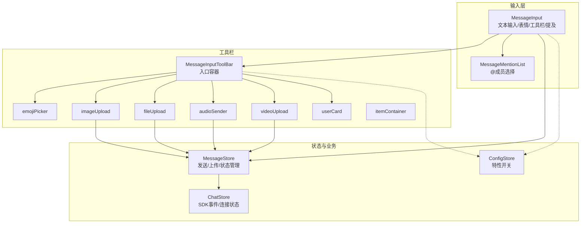
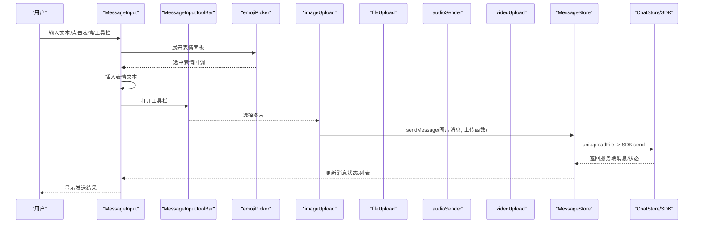
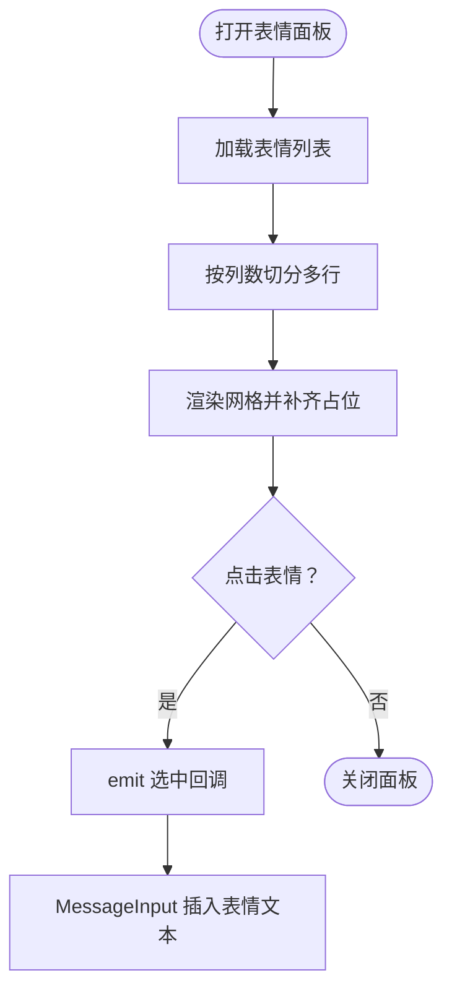
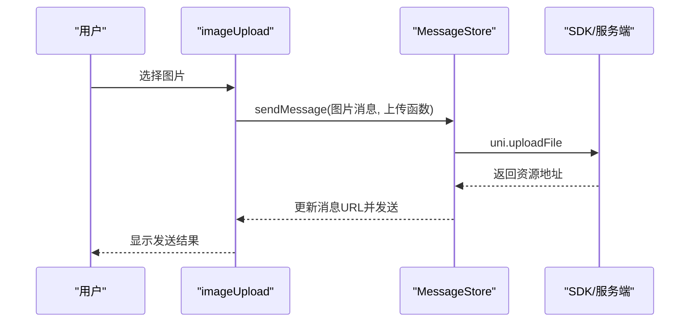
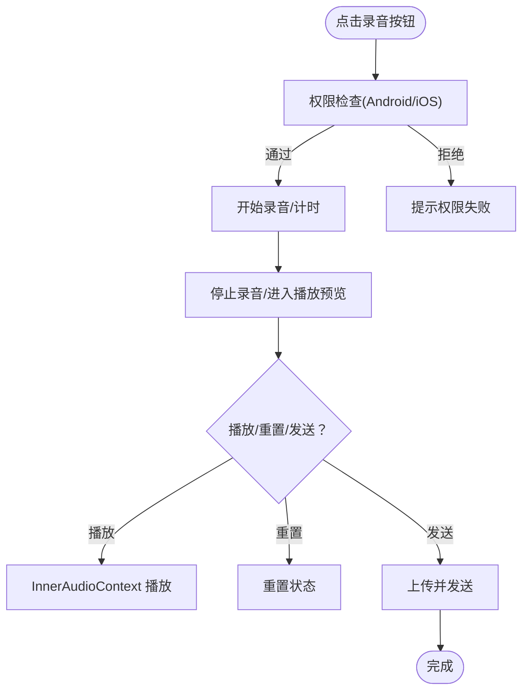
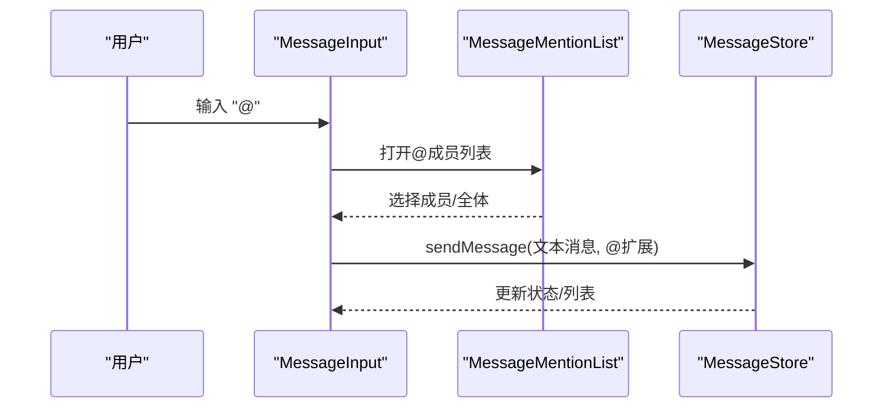
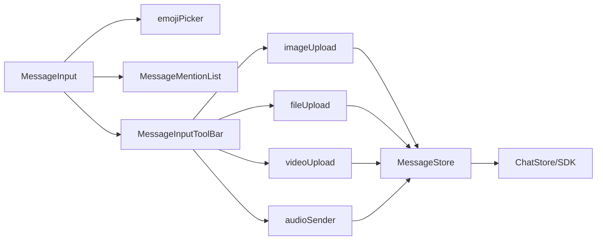

# 工具栏和输入功能

<cite>
**本文档引用的文件**
- [ChatUIKit/modules/Chat/components/MessageInputToolBar/index.vue](file://ChatUIKit/modules/Chat/components/MessageInputToolBar/index.vue)
- [ChatUIKit/modules/Chat/components/MessageInputToolBar/emojiPicker.vue](file://ChatUIKit/modules/Chat/components/MessageInputToolBar/emojiPicker.vue)
- [ChatUIKit/modules/Chat/components/MessageInputToolBar/imageUpload.vue](file://ChatUIKit/modules/Chat/components/MessageInputToolBar/imageUpload.vue)
- [ChatUIKit/modules/Chat/components/MessageInputToolBar/fileUpload.vue](file://ChatUIKit/modules/Chat/components/MessageInputToolBar/fileUpload.vue)
- [ChatUIKit/modules/Chat/components/MessageInputToolBar/audioSender.vue](file://ChatUIKit/modules/Chat/components/MessageInputToolBar/audioSender.vue)
- [ChatUIKit/modules/Chat/components/MessageInputToolBar/videoUpload.vue](file://ChatUIKit/modules/Chat/components/MessageInputToolBar/videoUpload.vue)
- [ChatUIKit/modules/Chat/components/MessageInputToolBar/userCard.vue](file://ChatUIKit/modules/Chat/components/MessageInputToolBar/userCard.vue)
- [ChatUIKit/modules/Chat/components/MessageInputToolBar/itemContainer.vue](file://ChatUIKit/modules/Chat/components/MessageInputToolBar/itemContainer.vue)
- [ChatUIKit/modules/Chat/components/MessageInput/index.vue](file://ChatUIKit/modules/Chat/components/MessageInput/index.vue)
- [ChatUIKit/modules/Chat/components/MessageMentionList/index.vue](file://ChatUIKit/modules/Chat/components/MessageMentionList/index.vue)
- [ChatUIKit/stores/message.ts](file://ChatUIKit/stores/message.ts)
- [ChatUIKit/stores/chat.ts](file://ChatUIKit/stores/chat.ts)
- [ChatUIKit/utils/permission.js](file://ChatUIKit/utils/permission.js)
- [ChatUIKit/utils/index.ts](file://ChatUIKit/utils/index.ts)
- [ChatUIKit/const/emoji.ts](file://ChatUIKit/const/emoji.ts)
- [ChatUIKit/const/index.ts](file://ChatUIKit/const/index.ts)
- [ChatUIKit/types/index.ts](file://ChatUIKit/types/index.ts)
</cite>

## 目录
1. [简介](#简介)
2. [项目结构](#项目结构)
3. [核心组件](#核心组件)
4. [架构总览](#架构总览)
5. [详细组件分析](#详细组件分析)
6. [依赖关系分析](#依赖关系分析)
7. [性能考量](#性能考量)
8. [故障排查指南](#故障排查指南)
9. [结论](#结论)
10. [附录](#附录)

## 简介
本文件聚焦于聊天 UI 组件库中的工具栏与输入功能，系统性梳理表情选择器、图片/文件/音频/视频上传、名片选择、提及（@）功能的实现细节，并覆盖文件选择器、预览组件与上传进度管理、多媒体内容的压缩与格式转换、权限检查、大小限制与格式校验、上传失败重试与并发控制等关键主题。文档以代码级可视化图示呈现组件交互与数据流，帮助开发者快速理解与扩展。

## 项目结构
工具栏与输入功能主要分布在以下模块：
- 输入工具栏：MessageInputToolBar（表情、图片、文件、音频、视频、名片入口）
- 主输入区：MessageInput（文本输入、表情插入、工具栏开关、提及触发）
- 提及列表：MessageMentionList（@ 功能的成员选择）
- 存储与业务：Pinia Store（消息、聊天、会话、连接、配置）
- 权限与工具：permission.js、utils/index.ts、常量与类型定义

图表来源
- [ChatUIKit/modules/Chat/components/MessageInput/index.vue](file://ChatUIKit/modules/Chat/components/MessageInput/index.vue#L1-L217)
- [ChatUIKit/modules/Chat/components/MessageInputToolBar/index.vue](file://ChatUIKit/modules/Chat/components/MessageInputToolBar/index.vue#L1-L69)
- [ChatUIKit/modules/Chat/components/MessageMentionList/index.vue](file://ChatUIKit/modules/Chat/components/MessageMentionList/index.vue#L1-L158)
- [ChatUIKit/stores/message.ts](file://ChatUIKit/stores/message.ts#L311-L432)
- [ChatUIKit/stores/chat.ts](file://ChatUIKit/stores/chat.ts#L67-L221)

章节来源
- [ChatUIKit/modules/Chat/components/MessageInput/index.vue](file://ChatUIKit/modules/Chat/components/MessageInput/index.vue#L1-L217)
- [ChatUIKit/modules/Chat/components/MessageInputToolBar/index.vue](file://ChatUIKit/modules/Chat/components/MessageInputToolBar/index.vue#L1-L69)

## 核心组件
- MessageInputToolBar：工具栏入口容器，按特性开关渲染图片、视频、文件、名片等入口；通过注入 InputToolbarEvent 关闭自身。
- emojiPicker：表情面板，基于常量表情列表分页展示，点击回调通知父组件。
- imageUpload：相册选择图片，构造图片消息体并通过 MessageStore 发送，内部使用 uni.uploadFile 完成上传。
- fileUpload：文件选择（H5/微信小程序），构造文件消息体并通过 MessageStore 发送。
- audioSender：录音弹窗，支持开始/停止录音、播放/暂停、重置、发送；权限检查与错误处理。
- videoUpload：相册/相机选择视频，构造视频消息体并通过 MessageStore 发送。
- userCard：名片入口，触发父组件事件。
- itemContainer：工具栏图标与标题容器。
- MessageInput：主输入区，支持文本输入、表情插入、工具栏开关、@ 触发、发送消息。
- MessageMentionList：@ 成员选择弹窗，支持“@全体”和成员列表滚动加载。
- MessageStore：统一消息发送与上传流程，负责状态更新、错误处理、历史消息拉取。
- ChatStore：SDK 事件监听与连接状态管理。
- permission.js：跨平台权限请求与判断（Android/IOS）。
- utils/index.ts：文本格式化、表情映射、平台检测、节流等工具。
- const/emoji.ts：表情映射与列表。
- const/index.ts：常量（@ 全体、分页大小、最大消息数等）。
- types/index.ts：输入工具栏事件接口、消息扩展类型等。

章节来源
- [ChatUIKit/modules/Chat/components/MessageInputToolBar/index.vue](file://ChatUIKit/modules/Chat/components/MessageInputToolBar/index.vue#L1-L69)
- [ChatUIKit/modules/Chat/components/MessageInputToolBar/emojiPicker.vue](file://ChatUIKit/modules/Chat/components/MessageInputToolBar/emojiPicker.vue#L1-L83)
- [ChatUIKit/modules/Chat/components/MessageInputToolBar/imageUpload.vue](file://ChatUIKit/modules/Chat/components/MessageInputToolBar/imageUpload.vue#L1-L85)
- [ChatUIKit/modules/Chat/components/MessageInputToolBar/fileUpload.vue](file://ChatUIKit/modules/Chat/components/MessageInputToolBar/fileUpload.vue#L1-L104)
- [ChatUIKit/modules/Chat/components/MessageInputToolBar/audioSender.vue](file://ChatUIKit/modules/Chat/components/MessageInputToolBar/audioSender.vue#L1-L350)
- [ChatUIKit/modules/Chat/components/MessageInputToolBar/videoUpload.vue](file://ChatUIKit/modules/Chat/components/MessageInputToolBar/videoUpload.vue#L1-L87)
- [ChatUIKit/modules/Chat/components/MessageInputToolBar/userCard.vue](file://ChatUIKit/modules/Chat/components/MessageInputToolBar/userCard.vue#L1-L32)
- [ChatUIKit/modules/Chat/components/MessageInputToolBar/itemContainer.vue](file://ChatUIKit/modules/Chat/components/MessageInputToolBar/itemContainer.vue#L1-L46)
- [ChatUIKit/modules/Chat/components/MessageInput/index.vue](file://ChatUIKit/modules/Chat/components/MessageInput/index.vue#L1-L217)
- [ChatUIKit/modules/Chat/components/MessageMentionList/index.vue](file://ChatUIKit/modules/Chat/components/MessageMentionList/index.vue#L1-L158)
- [ChatUIKit/stores/message.ts](file://ChatUIKit/stores/message.ts#L311-L432)
- [ChatUIKit/stores/chat.ts](file://ChatUIKit/stores/chat.ts#L67-L221)
- [ChatUIKit/utils/permission.js](file://ChatUIKit/utils/permission.js#L1-L272)
- [ChatUIKit/utils/index.ts](file://ChatUIKit/utils/index.ts#L1-L344)
- [ChatUIKit/const/emoji.ts](file://ChatUIKit/const/emoji.ts#L1-L127)
- [ChatUIKit/const/index.ts](file://ChatUIKit/const/index.ts#L1-L37)
- [ChatUIKit/types/index.ts](file://ChatUIKit/types/index.ts#L1-L100)

## 架构总览
工具栏与输入功能围绕“输入 -> 消息构建 -> 上传 -> 发送 -> 状态更新”的主链路展开，各组件通过 Pinia Store 协调状态，通过 SDK 与服务端交互。

图表来源
- [ChatUIKit/modules/Chat/components/MessageInput/index.vue](file://ChatUIKit/modules/Chat/components/MessageInput/index.vue#L115-L135)
- [ChatUIKit/modules/Chat/components/MessageInputToolBar/emojiPicker.vue](file://ChatUIKit/modules/Chat/components/MessageInputToolBar/emojiPicker.vue#L37-L41)
- [ChatUIKit/modules/Chat/components/MessageInputToolBar/imageUpload.vue](file://ChatUIKit/modules/Chat/components/MessageInputToolBar/imageUpload.vue#L41-L76)
- [ChatUIKit/stores/message.ts](file://ChatUIKit/stores/message.ts#L311-L432)
- [ChatUIKit/stores/chat.ts](file://ChatUIKit/stores/chat.ts#L67-L221)

## 详细组件分析

### 表情选择器
- 实现要点
  - 表情列表来源于常量映射，按固定列数切分为多行，底部补充占位以对齐。
  - 点击回调通过 emit 通知父组件，由 MessageInput 插入表情文本。
  - 文本消息发送前会将输入中的表情别名转换为 Unicode 表情，保证显示一致性。
- 关键路径
  - 表情列表与分页：[表情常量](file://ChatUIKit/const/emoji.ts#L112-L127)，[分页工具](file://ChatUIKit/utils/index.ts#L267-L273)
  - 表情面板渲染与回调：[表情面板](file://ChatUIKit/modules/Chat/components/MessageInputToolBar/emojiPicker.vue#L1-L83)
  - 文本表情转换：[文本格式化](file://ChatUIKit/utils/index.ts#L199-L224)

图表来源
- [ChatUIKit/modules/Chat/components/MessageInputToolBar/emojiPicker.vue](file://ChatUIKit/modules/Chat/components/MessageInputToolBar/emojiPicker.vue#L1-L83)
- [ChatUIKit/const/emoji.ts](file://ChatUIKit/const/emoji.ts#L112-L127)
- [ChatUIKit/utils/index.ts](file://ChatUIKit/utils/index.ts#L267-L273)

章节来源
- [ChatUIKit/modules/Chat/components/MessageInputToolBar/emojiPicker.vue](file://ChatUIKit/modules/Chat/components/MessageInputToolBar/emojiPicker.vue#L1-L83)
- [ChatUIKit/const/emoji.ts](file://ChatUIKit/const/emoji.ts#L112-L127)
- [ChatUIKit/utils/index.ts](file://ChatUIKit/utils/index.ts#L199-L224)

### 图片上传
- 实现要点
  - 通过 uni.chooseImage 从相册选择单张图片。
  - 构造图片消息体（含用户信息扩展），调用 MessageStore.sendMessage，传入上传函数执行 uni.uploadFile。
  - 上传完成后，MessageStore 解析服务端返回的资源地址并更新消息 URL。
- 关键路径
  - 选择与上传：[图片上传](file://ChatUIKit/modules/Chat/components/MessageInputToolBar/imageUpload.vue#L31-L76)
  - 发送与上传流程：[消息发送](file://ChatUIKit/stores/message.ts#L311-L432)

图表来源
- [ChatUIKit/modules/Chat/components/MessageInputToolBar/imageUpload.vue](file://ChatUIKit/modules/Chat/components/MessageInputToolBar/imageUpload.vue#L31-L76)
- [ChatUIKit/stores/message.ts](file://ChatUIKit/stores/message.ts#L365-L377)

章节来源
- [ChatUIKit/modules/Chat/components/MessageInputToolBar/imageUpload.vue](file://ChatUIKit/modules/Chat/components/MessageInputToolBar/imageUpload.vue#L1-L85)
- [ChatUIKit/stores/message.ts](file://ChatUIKit/stores/message.ts#L311-L432)

### 文件上传
- 实现要点
  - H5 使用 uni.chooseFile，微信小程序使用 wx.chooseMessageFile。
  - 构造文件消息体（包含文件名、大小），通过 MessageStore.sendMessage 上传并发送。
- 关键路径
  - 选择与上传：[文件上传](file://ChatUIKit/modules/Chat/components/MessageInputToolBar/fileUpload.vue#L31-L95)
  - 发送与上传流程：[消息发送](file://ChatUIKit/stores/message.ts#L311-L432)

章节来源
- [ChatUIKit/modules/Chat/components/MessageInputToolBar/fileUpload.vue](file://ChatUIKit/modules/Chat/components/MessageInputToolBar/fileUpload.vue#L1-L104)
- [ChatUIKit/stores/message.ts](file://ChatUIKit/stores/message.ts#L311-L432)

### 音频发送
- 实现要点
  - 录音弹窗支持开始/停止录音、播放/暂停、重置、发送。
  - 录音时长上限与计时器控制；播放使用 InnerAudioContext。
  - 跨平台权限检查：Android 请求 RECORD_AUDIO，iOS 使用 permission.judgeIosPermission。
  - 上传与发送流程同图片/文件/视频。
- 关键路径
  - 录音与播放：[录音弹窗](file://ChatUIKit/modules/Chat/components/MessageInputToolBar/audioSender.vue#L92-L255)
  - 权限检查：[权限模块](file://ChatUIKit/utils/permission.js#L158-L217)
  - 发送与上传：[消息发送](file://ChatUIKit/stores/message.ts#L311-L432)

图表来源
- [ChatUIKit/modules/Chat/components/MessageInputToolBar/audioSender.vue](file://ChatUIKit/modules/Chat/components/MessageInputToolBar/audioSender.vue#L92-L255)
- [ChatUIKit/utils/permission.js](file://ChatUIKit/utils/permission.js#L158-L217)

章节来源
- [ChatUIKit/modules/Chat/components/MessageInputToolBar/audioSender.vue](file://ChatUIKit/modules/Chat/components/MessageInputToolBar/audioSender.vue#L1-L350)
- [ChatUIKit/utils/permission.js](file://ChatUIKit/utils/permission.js#L1-L272)
- [ChatUIKit/stores/message.ts](file://ChatUIKit/stores/message.ts#L311-L432)

### 视频上传
- 实现要点
  - 通过 uni.chooseVideo 支持相册与相机，构造视频消息体并上传发送。
- 关键路径
  - 选择与上传：[视频上传](file://ChatUIKit/modules/Chat/components/MessageInputToolBar/videoUpload.vue#L31-L78)
  - 发送与上传流程：[消息发送](file://ChatUIKit/stores/message.ts#L311-L432)

章节来源
- [ChatUIKit/modules/Chat/components/MessageInputToolBar/videoUpload.vue](file://ChatUIKit/modules/Chat/components/MessageInputToolBar/videoUpload.vue#L1-L87)
- [ChatUIKit/stores/message.ts](file://ChatUIKit/stores/message.ts#L311-L432)

### 名片选择
- 实现要点
  - 点击名片入口后关闭工具栏并触发父组件事件，交由上层处理名片发送。
- 关键路径
  - 名片入口：[名片组件](file://ChatUIKit/modules/Chat/components/MessageInputToolBar/userCard.vue#L1-L32)
  - 工具栏注入事件：[工具栏容器](file://ChatUIKit/modules/Chat/components/MessageInputToolBar/index.vue#L39-L43)

章节来源
- [ChatUIKit/modules/Chat/components/MessageInputToolBar/userCard.vue](file://ChatUIKit/modules/Chat/components/MessageInputToolBar/userCard.vue#L1-L32)
- [ChatUIKit/modules/Chat/components/MessageInputToolBar/index.vue](file://ChatUIKit/modules/Chat/components/MessageInputToolBar/index.vue#L1-L69)

### 提及（@）功能
- 实现要点
  - MessageInput 在输入框中识别“@”结尾触发 @ 成员选择弹窗。
  - MessageMentionList 提供“@全体”和成员列表，支持分页加载。
  - 发送文本消息时将 @ 用户 ID 写入扩展字段，支持 @全体标识。
- 关键路径
  - @ 触发与插入：[主输入](file://ChatUIKit/modules/Chat/components/MessageInput/index.vue#L123-L135)
  - @ 成员选择：[提及列表](file://ChatUIKit/modules/Chat/components/MessageMentionList/index.vue#L67-L111)
  - @ 扩展字段：[发送消息](file://ChatUIKit/modules/Chat/components/MessageInput/index.vue#L160-L173)
  - 常量定义：[@ 全体](file://ChatUIKit/const/index.ts#L5)

图表来源
- [ChatUIKit/modules/Chat/components/MessageInput/index.vue](file://ChatUIKit/modules/Chat/components/MessageInput/index.vue#L123-L135)
- [ChatUIKit/modules/Chat/components/MessageMentionList/index.vue](file://ChatUIKit/modules/Chat/components/MessageMentionList/index.vue#L67-L111)

章节来源
- [ChatUIKit/modules/Chat/components/MessageInput/index.vue](file://ChatUIKit/modules/Chat/components/MessageInput/index.vue#L123-L135)
- [ChatUIKit/modules/Chat/components/MessageMentionList/index.vue](file://ChatUIKit/modules/Chat/components/MessageMentionList/index.vue#L1-L158)
- [ChatUIKit/const/index.ts](file://ChatUIKit/const/index.ts#L5)

### 输入法兼容性、粘贴上传与拖拽上传
- 输入法兼容性
  - MessageInput 使用 uni-app 输入框，设置 adjust-position、auto-blur、confirm-type 等属性提升输入体验。
- 粘贴上传
  - 仓库未提供粘贴上传的实现；如需支持，可在输入框的 paste 事件中捕获剪贴板文件并走统一上传流程。
- 拖拽上传
  - 仓库未提供拖拽上传的实现；如需支持，可在容器上监听 drop 事件并提取文件后走统一上传流程。

章节来源
- [ChatUIKit/modules/Chat/components/MessageInput/index.vue](file://ChatUIKit/modules/Chat/components/MessageInput/index.vue#L13-L30)

### 键盘快捷键、语音输入与手写输入
- 键盘快捷键
  - 使用 confirm-type="send" 与 confirm-hold 支持回车发送；未见自定义快捷键绑定。
- 语音输入
  - 通过录音弹窗实现语音输入；未见系统语音识别集成。
- 手写输入
  - 仓库未提供手写输入实现。

章节来源
- [ChatUIKit/modules/Chat/components/MessageInput/index.vue](file://ChatUIKit/modules/Chat/components/MessageInput/index.vue#L22-L28)
- [ChatUIKit/modules/Chat/components/MessageInputToolBar/audioSender.vue](file://ChatUIKit/modules/Chat/components/MessageInputToolBar/audioSender.vue#L92-L141)

### 权限检查、大小限制与格式验证
- 权限检查
  - Android：请求 RECORD_AUDIO；iOS：judgeIosPermission(record)。
  - 未见对相机/相册/文件选择的权限检查。
- 大小限制与格式验证
  - 仓库未见统一的大小限制与格式校验逻辑；建议在 chooseImage/chooseFile 之后增加校验并在 MessageStore 中统一处理错误。

章节来源
- [ChatUIKit/utils/permission.js](file://ChatUIKit/utils/permission.js#L158-L217)
- [ChatUIKit/modules/Chat/components/MessageInputToolBar/audioSender.vue](file://ChatUIKit/modules/Chat/components/MessageInputToolBar/audioSender.vue#L223-L242)

### 上传失败重试、断点续传与并发上传
- 上传失败重试
  - 未见内置重试机制；可在 uni.uploadFile 的失败回调中触发重试。
- 断点续传
  - 未见断点续传实现。
- 并发上传
  - 未见并发控制；可在 MessageStore 中引入队列或并发阈值控制。

章节来源
- [ChatUIKit/stores/message.ts](file://ChatUIKit/stores/message.ts#L311-L432)

## 依赖关系分析
- 组件耦合
  - MessageInput 与 MessageInputToolBar 通过事件与注入解耦；工具栏项通过统一容器渲染。
  - 提及功能通过 MessageInput 与 MessageMentionList 双向协作。
- 外部依赖
  - uni-app API（chooseImage/chooseFile/chooseVideo/uploadFile/recorder/audioContext）。
  - SDK 事件与连接状态由 ChatStore 统一管理。
- 类型与常量
  - types/index.ts 定义 InputToolbarEvent 接口；const/index.ts 提供 @ 全体与分页常量。

图表来源
- [ChatUIKit/modules/Chat/components/MessageInput/index.vue](file://ChatUIKit/modules/Chat/components/MessageInput/index.vue#L1-L217)
- [ChatUIKit/modules/Chat/components/MessageInputToolBar/index.vue](file://ChatUIKit/modules/Chat/components/MessageInputToolBar/index.vue#L1-L69)
- [ChatUIKit/stores/message.ts](file://ChatUIKit/stores/message.ts#L311-L432)
- [ChatUIKit/stores/chat.ts](file://ChatUIKit/stores/chat.ts#L67-L221)

章节来源
- [ChatUIKit/modules/Chat/components/MessageInput/index.vue](file://ChatUIKit/modules/Chat/components/MessageInput/index.vue#L1-L217)
- [ChatUIKit/modules/Chat/components/MessageInputToolBar/index.vue](file://ChatUIKit/modules/Chat/components/MessageInputToolBar/index.vue#L1-L69)
- [ChatUIKit/stores/message.ts](file://ChatUIKit/stores/message.ts#L311-L432)
- [ChatUIKit/stores/chat.ts](file://ChatUIKit/stores/chat.ts#L67-L221)

## 性能考量
- 表情面板渲染
  - 使用分页切片减少 DOM 数量，提升滚动性能。
- 文本消息处理
  - 表情别名到 Unicode 的转换在发送前完成，避免重复计算。
- 上传流程
  - 上传与发送分离，先本地插入“发送中”状态，再异步更新为“已发送”，提升交互流畅度。
- 并发与节流
  - 未见针对上传/输入的并发与节流策略，建议在消息发送与文件选择处增加节流与并发控制。

## 故障排查指南
- 录音权限失败
  - Android：检查 RECORD_AUDIO 权限请求结果；iOS：检查 judgeIosPermission("record")。
  - 弹窗提示麦克风权限失败，引导用户前往系统设置。
- 上传失败
  - 检查 uni.uploadFile 回调与 MessageStore 的错误分支；确认 Token 与 API 地址正确。
- 提及列表不显示
  - 确认当前会话为群聊；检查分页加载逻辑与成员列表接口。
- 表情显示异常
  - 确认表情别名映射与 Unicode 映射一致；检查文本格式化流程。

章节来源
- [ChatUIKit/utils/permission.js](file://ChatUIKit/utils/permission.js#L158-L217)
- [ChatUIKit/modules/Chat/components/MessageInputToolBar/audioSender.vue](file://ChatUIKit/modules/Chat/components/MessageInputToolBar/audioSender.vue#L223-L242)
- [ChatUIKit/stores/message.ts](file://ChatUIKit/stores/message.ts#L428-L431)
- [ChatUIKit/modules/Chat/components/MessageMentionList/index.vue](file://ChatUIKit/modules/Chat/components/MessageMentionList/index.vue#L67-L92)
- [ChatUIKit/utils/index.ts](file://ChatUIKit/utils/index.ts#L199-L224)

## 结论
该工具栏与输入功能以清晰的组件边界与 Pinia 状态管理实现了完整的消息输入与发送链路。表情、图片、文件、音频、视频与名片入口均通过统一的工具栏容器组织，具备良好的可扩展性。建议后续增强粘贴/拖拽上传、权限与格式校验、上传失败重试与并发控制，以进一步提升用户体验与稳定性。

## 附录
- 术语
  - 工具栏：消息输入区域上方的入口容器，提供媒体与功能入口。
  - 提及：@ 功能，支持 @全体与成员选择。
  - 上传函数：在 MessageStore.sendMessage 中作为可选参数传入，用于执行 uni.uploadFile。
- 常用路径
  - 表情面板：[表情面板](file://ChatUIKit/modules/Chat/components/MessageInputToolBar/emojiPicker.vue#L1-L83)
  - 图片上传：[图片上传](file://ChatUIKit/modules/Chat/components/MessageInputToolBar/imageUpload.vue#L31-L76)
  - 文件上传：[文件上传](file://ChatUIKit/modules/Chat/components/MessageInputToolBar/fileUpload.vue#L31-L95)
  - 音频发送：[录音弹窗](file://ChatUIKit/modules/Chat/components/MessageInputToolBar/audioSender.vue#L92-L255)
  - 视频上传：[视频上传](file://ChatUIKit/modules/Chat/components/MessageInputToolBar/videoUpload.vue#L31-L78)
  - 提及列表：[提及列表](file://ChatUIKit/modules/Chat/components/MessageMentionList/index.vue#L67-L111)
  - 发送流程：[消息发送](file://ChatUIKit/stores/message.ts#L311-L432)