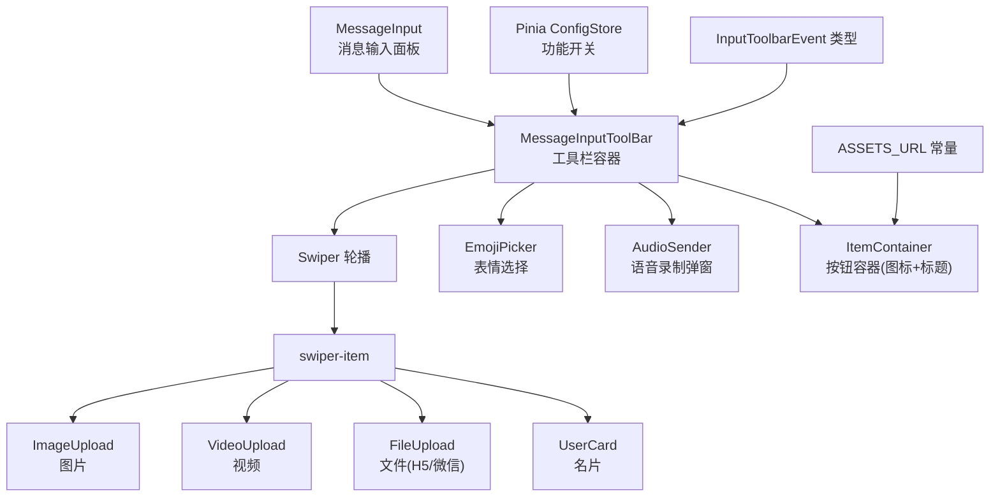
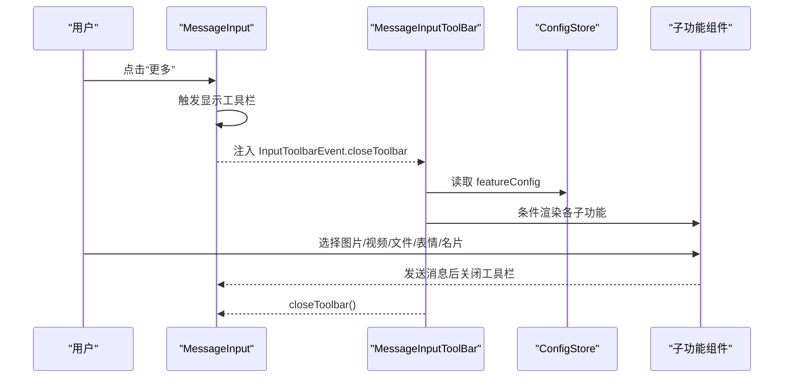
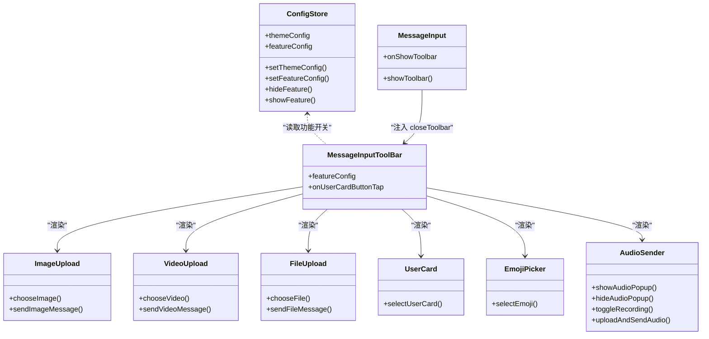
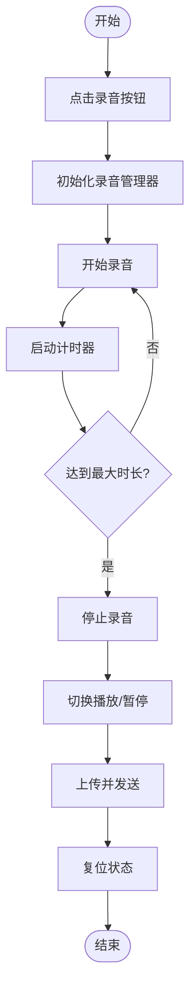
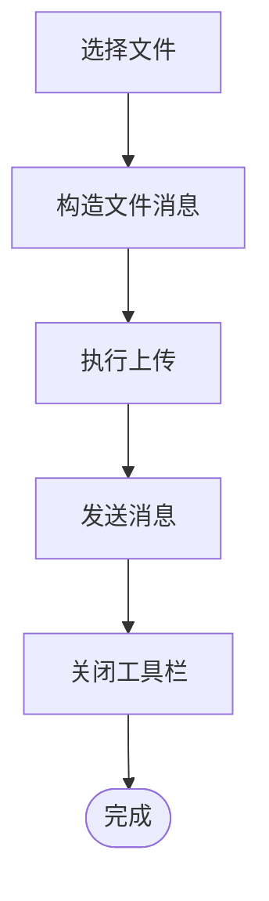

# 工具栏容器

<cite>
**本文引用的文件**
- [ChatUIKit/modules/Chat/components/MessageInputToolBar/index.vue](file://ChatUIKit/modules/Chat/components/MessageInputToolBar/index.vue)
- [ChatUIKit/modules/Chat/components/MessageInputToolBar/itemContainer.vue](file://ChatUIKit/modules/Chat/components/MessageInputToolBar/itemContainer.vue)
- [ChatUIKit/modules/Chat/components/MessageInputToolBar/audioSender.vue](file://ChatUIKit/modules/Chat/components/MessageInputToolBar/audioSender.vue)
- [ChatUIKit/modules/Chat/components/MessageInputToolBar/emojiPicker.vue](file://ChatUIKit/modules/Chat/components/MessageInputToolBar/emojiPicker.vue)
- [ChatUIKit/modules/Chat/components/MessageInputToolBar/fileUpload.vue](file://ChatUIKit/modules/Chat/components/MessageInputToolBar/fileUpload.vue)
- [ChatUIKit/modules/Chat/components/MessageInputToolBar/imageUpload.vue](file://ChatUIKit/modules/Chat/components/MessageInputToolBar/imageUpload.vue)
- [ChatUIKit/modules/Chat/components/MessageInputToolBar/videoUpload.vue](file://ChatUIKit/modules/Chat/components/MessageInputToolBar/videoUpload.vue)
- [ChatUIKit/modules/Chat/components/MessageInputToolBar/userCard.vue](file://ChatUIKit/modules/Chat/components/MessageInputToolBar/userCard.vue)
- [ChatUIKit/modules/Chat/components/MessageInput/index.vue](file://ChatUIKit/modules/Chat/components/MessageInput/index.vue)
- [ChatUIKit/stores/config.ts](file://ChatUIKit/stores/config.ts)
- [ChatUIKit/stores/index.ts](file://ChatUIKit/stores/index.ts)
- [ChatUIKit/types/index.ts](file://ChatUIKit/types/index.ts)
- [ChatUIKit/const/index.ts](file://ChatUIKit/const/index.ts)
- [ChatUIKit/modules/Chat/components/MessageInput/style.scss](file://ChatUIKit/modules/Chat/components/MessageInput/style.scss)
</cite>

## 目录
1. [简介](#简介)
2. [项目结构](#项目结构)
3. [核心组件](#核心组件)
4. [架构总览](#架构总览)
5. [组件详解](#组件详解)
6. [依赖关系分析](#依赖关系分析)
7. [性能与兼容性](#性能与兼容性)
8. [故障排查指南](#故障排查指南)
9. [结论](#结论)
10. [附录](#附录)

## 简介
本文件系统化梳理“工具栏容器”组件的设计与实现，聚焦以下目标：
- 整体布局与组件管理机制
- 动态功能开关、按钮排列与响应式适配
- 工具栏状态管理（展开/收起、悬浮固定、位置调整）
- 主题定制、样式覆盖与动画效果
- 扩展接口、自定义按钮与事件处理
- 溢出处理、性能优化与兼容性策略

工具栏位于消息输入区域之上，通过“更多”按钮触发，内部以轮播页承载多种媒体与交互能力，并通过注入的事件接口与外部输入面板协同。

## 项目结构
工具栏相关代码主要分布在消息模块的工具栏目录，配合输入面板、配置存储与类型定义共同完成功能闭环。

图表来源
- [ChatUIKit/modules/Chat/components/MessageInput/index.vue](file://ChatUIKit/modules/Chat/components/MessageInput/index.vue#L1-L217)
- [ChatUIKit/modules/Chat/components/MessageInputToolBar/index.vue](file://ChatUIKit/modules/Chat/components/MessageInputToolBar/index.vue#L1-L69)
- [ChatUIKit/modules/Chat/components/MessageInputToolBar/imageUpload.vue](file://ChatUIKit/modules/Chat/components/MessageInputToolBar/imageUpload.vue#L1-L85)
- [ChatUIKit/modules/Chat/components/MessageInputToolBar/videoUpload.vue](file://ChatUIKit/modules/Chat/components/MessageInputToolBar/videoUpload.vue#L1-L87)
- [ChatUIKit/modules/Chat/components/MessageInputToolBar/fileUpload.vue](file://ChatUIKit/modules/Chat/components/MessageInputToolBar/fileUpload.vue#L1-L104)
- [ChatUIKit/modules/Chat/components/MessageInputToolBar/userCard.vue](file://ChatUIKit/modules/Chat/components/MessageInputToolBar/userCard.vue#L1-L32)
- [ChatUIKit/modules/Chat/components/MessageInputToolBar/emojiPicker.vue](file://ChatUIKit/modules/Chat/components/MessageInputToolBar/emojiPicker.vue#L1-L83)
- [ChatUIKit/modules/Chat/components/MessageInputToolBar/audioSender.vue](file://ChatUIKit/modules/Chat/components/MessageInputToolBar/audioSender.vue#L1-L350)
- [ChatUIKit/modules/Chat/components/MessageInputToolBar/itemContainer.vue](file://ChatUIKit/modules/Chat/components/MessageInputToolBar/itemContainer.vue#L1-L46)
- [ChatUIKit/stores/config.ts](file://ChatUIKit/stores/config.ts#L1-L124)
- [ChatUIKit/types/index.ts](file://ChatUIKit/types/index.ts#L1-L100)
- [ChatUIKit/const/index.ts](file://ChatUIKit/const/index.ts#L1-L37)

章节来源
- [ChatUIKit/modules/Chat/components/MessageInput/index.vue](file://ChatUIKit/modules/Chat/components/MessageInput/index.vue#L1-L217)
- [ChatUIKit/modules/Chat/components/MessageInputToolBar/index.vue](file://ChatUIKit/modules/Chat/components/MessageInputToolBar/index.vue#L1-L69)

## 核心组件
- 工具栏容器：负责布局与功能开关控制，按平台条件渲染文件上传入口，承载轮播页与子功能按钮。
- 子功能组件：图片、视频、文件、名片、表情、语音录制弹窗等。
- 输入面板：与工具栏联动，控制“更多”按钮显隐与工具栏展开。
- 配置存储：集中管理功能开关与主题配置，驱动工具栏动态渲染。
- 类型与常量：定义工具栏事件契约与资源路径。

章节来源
- [ChatUIKit/modules/Chat/components/MessageInputToolBar/index.vue](file://ChatUIKit/modules/Chat/components/MessageInputToolBar/index.vue#L1-L69)
- [ChatUIKit/modules/Chat/components/MessageInputToolBar/imageUpload.vue](file://ChatUIKit/modules/Chat/components/MessageInputToolBar/imageUpload.vue#L1-L85)
- [ChatUIKit/modules/Chat/components/MessageInputToolBar/videoUpload.vue](file://ChatUIKit/modules/Chat/components/MessageInputToolBar/videoUpload.vue#L1-L87)
- [ChatUIKit/modules/Chat/components/MessageInputToolBar/fileUpload.vue](file://ChatUIKit/modules/Chat/components/MessageInputToolBar/fileUpload.vue#L1-L104)
- [ChatUIKit/modules/Chat/components/MessageInputToolBar/userCard.vue](file://ChatUIKit/modules/Chat/components/MessageInputToolBar/userCard.vue#L1-L32)
- [ChatUIKit/modules/Chat/components/MessageInputToolBar/emojiPicker.vue](file://ChatUIKit/modules/Chat/components/MessageInputToolBar/emojiPicker.vue#L1-L83)
- [ChatUIKit/modules/Chat/components/MessageInputToolBar/audioSender.vue](file://ChatUIKit/modules/Chat/components/MessageInputToolBar/audioSender.vue#L1-L350)
- [ChatUIKit/modules/Chat/components/MessageInputToolBar/itemContainer.vue](file://ChatUIKit/modules/Chat/components/MessageInputToolBar/itemContainer.vue#L1-L46)
- [ChatUIKit/modules/Chat/components/MessageInput/index.vue](file://ChatUIKit/modules/Chat/components/MessageInput/index.vue#L1-L217)
- [ChatUIKit/stores/config.ts](file://ChatUIKit/stores/config.ts#L1-L124)
- [ChatUIKit/types/index.ts](file://ChatUIKit/types/index.ts#L1-L100)
- [ChatUIKit/const/index.ts](file://ChatUIKit/const/index.ts#L1-L37)

## 架构总览
工具栏采用“容器 + 子功能模块”的分层设计，通过 Pinia 的功能开关控制渲染；通过注入的事件接口与输入面板协作，实现展开/收起与关闭行为的一致性。

图表来源
- [ChatUIKit/modules/Chat/components/MessageInput/index.vue](file://ChatUIKit/modules/Chat/components/MessageInput/index.vue#L111-L113)
- [ChatUIKit/modules/Chat/components/MessageInputToolBar/index.vue](file://ChatUIKit/modules/Chat/components/MessageInputToolBar/index.vue#L32-L37)
- [ChatUIKit/stores/config.ts](file://ChatUIKit/stores/config.ts#L59-L80)
- [ChatUIKit/types/index.ts](file://ChatUIKit/types/index.ts#L3-L5)

## 组件详解

### 工具栏容器（MessageInputToolBar）
- 布局结构
  - 外层容器包裹轮播组件，轮播内含一个 swiper-item。
  - item-wrap 使用弹性布局进行换行排列，每个 item 宽度为 25%，形成四列布局。
- 功能开关
  - 通过 Pinia 的 featureConfig 控制各子功能的显示/隐藏。
  - 文件上传仅在 H5 或微信小程序平台启用。
- 事件与交互
  - 名片按钮发出 onUserCardButtonTap 事件，供上层处理。
- 样式与主题
  - 容器背景与轮播内边距由 scoped 样式定义，可按需覆盖。
  - 图标与标题由 ItemContainer 统一渲染。

章节来源
- [ChatUIKit/modules/Chat/components/MessageInputToolBar/index.vue](file://ChatUIKit/modules/Chat/components/MessageInputToolBar/index.vue#L1-L69)
- [ChatUIKit/modules/Chat/components/MessageInputToolBar/itemContainer.vue](file://ChatUIKit/modules/Chat/components/MessageInputToolBar/itemContainer.vue#L1-L46)

### 子功能组件

#### 图片上传（ImageUpload）
- 交互流程
  - 点击后调用平台选择图片 API，构造图片消息并上传。
  - 通过注入的 InputToolbarEvent 关闭工具栏。
- 数据流
  - 读取连接信息与当前会话，构造消息体与上传参数。
  - 调用消息存储发送逻辑，返回 uni.uploadFile 请求。

章节来源
- [ChatUIKit/modules/Chat/components/MessageInputToolBar/imageUpload.vue](file://ChatUIKit/modules/Chat/components/MessageInputToolBar/imageUpload.vue#L1-L85)

#### 视频上传（VideoUpload）
- 交互流程
  - 支持从相机或相册选择视频，构造视频消息并上传。
  - 同样通过注入事件关闭工具栏。

章节来源
- [ChatUIKit/modules/Chat/components/MessageInputToolBar/videoUpload.vue](file://ChatUIKit/modules/Chat/components/MessageInputToolBar/videoUpload.vue#L1-L87)

#### 文件上传（FileUpload）
- 平台差异
  - 微信小程序使用 chooseMessageFile，H5 使用 uni.chooseFile。
- 数据流
  - 构造文件消息，上传后关闭工具栏。

章节来源
- [ChatUIKit/modules/Chat/components/MessageInputToolBar/fileUpload.vue](file://ChatUIKit/modules/Chat/components/MessageInputToolBar/fileUpload.vue#L1-L104)

#### 名片（UserCard）
- 交互
  - 点击后关闭工具栏并向上抛出 onUserCardButtonTap 事件。
- 用途
  - 作为扩展点，允许上层实现用户卡片选择逻辑。

章节来源
- [ChatUIKit/modules/Chat/components/MessageInputToolBar/userCard.vue](file://ChatUIKit/modules/Chat/components/MessageInputToolBar/userCard.vue#L1-L32)

#### 表情选择（EmojiPicker）
- 交互
  - 将表情列表按行切分为固定列数，点击后发出 onEmojiPick 事件。
- 溢出处理
  - 通过滚动容器限制高度，避免溢出。

章节来源
- [ChatUIKit/modules/Chat/components/MessageInputToolBar/emojiPicker.vue](file://ChatUIKit/modules/Chat/components/MessageInputToolBar/emojiPicker.vue#L1-L83)

#### 语音录制（AudioSender）
- 弹窗与状态
  - 通过 Popup 弹窗承载录制控件，状态机包含 record/recording/recordEnd 三态。
  - 录制时长计时，最大时长限制，震动反馈。
- 权限与兼容
  - Android 与 iOS 分别处理麦克风权限请求与错误提示。
  - 内部音频上下文支持播放与停止，错误回调统一处理。
- 发送流程
  - 成功录制后构造音频消息并上传，完成后复位状态。

章节来源
- [ChatUIKit/modules/Chat/components/MessageInputToolBar/audioSender.vue](file://ChatUIKit/modules/Chat/components/MessageInputToolBar/audioSender.vue#L1-L350)

### 输入面板与工具栏联动
- 展开/收起
  - 输入面板根据功能开关决定“更多”按钮是否显示；点击后触发工具栏显示。
  - 工具栏通过注入的 closeToolbar 事件关闭自身。
- 事件桥接
  - 工具栏向输入面板发出 onUserCardButtonTap 等事件，便于上层统一处理。

章节来源
- [ChatUIKit/modules/Chat/components/MessageInput/index.vue](file://ChatUIKit/modules/Chat/components/MessageInput/index.vue#L1-L217)
- [ChatUIKit/modules/Chat/components/MessageInputToolBar/index.vue](file://ChatUIKit/modules/Chat/components/MessageInputToolBar/index.vue#L32-L43)
- [ChatUIKit/types/index.ts](file://ChatUIKit/types/index.ts#L3-L5)

### 动态功能开关与按钮排列
- 功能开关
  - 通过 Pinia 的 featureConfig 控制各功能项的显示/隐藏。
  - 支持运行时修改与批量显示/隐藏。
- 按钮排列
  - 四列等宽布局，每项占 25%；通过 flex-wrap 实现自动换行。
  - 文件上传在特定平台启用，避免不支持环境下的无效入口。

章节来源
- [ChatUIKit/stores/config.ts](file://ChatUIKit/stores/config.ts#L24-L57)
- [ChatUIKit/modules/Chat/components/MessageInputToolBar/index.vue](file://ChatUIKit/modules/Chat/components/MessageInputToolBar/index.vue#L6-L22)

### 响应式适配
- 容器尺寸
  - 轮播最小高度与内边距保证内容在小屏设备上的可读性。
- 滚动与溢出
  - 表情选择器使用纵向滚动与固定高度，避免布局塌陷。
- 平台差异
  - 文件上传针对 H5 与微信小程序分别实现选择器，确保可用性。

章节来源
- [ChatUIKit/modules/Chat/components/MessageInputToolBar/index.vue](file://ChatUIKit/modules/Chat/components/MessageInputToolBar/index.vue#L46-L68)
- [ChatUIKit/modules/Chat/components/MessageInputToolBar/emojiPicker.vue](file://ChatUIKit/modules/Chat/components/MessageInputToolBar/emojiPicker.vue#L43-L50)
- [ChatUIKit/modules/Chat/components/MessageInputToolBar/fileUpload.vue](file://ChatUIKit/modules/Chat/components/MessageInputToolBar/fileUpload.vue#L32-L53)

### 主题定制、样式覆盖与动画效果
- 主题与资源
  - ASSETS_URL 提供统一静态资源前缀，便于替换主题资源。
- 样式覆盖
  - 工具栏容器与子项均使用 scoped 样式，可通过父级样式穿透或引入全局样式进行覆盖。
- 动画效果
  - 语音录制按钮在录制/播放时添加涟漪动画类，增强交互反馈。

章节来源
- [ChatUIKit/const/index.ts](file://ChatUIKit/const/index.ts#L7-L8)
- [ChatUIKit/modules/Chat/components/MessageInputToolBar/index.vue](file://ChatUIKit/modules/Chat/components/MessageInputToolBar/index.vue#L46-L68)
- [ChatUIKit/modules/Chat/components/MessageInputToolBar/audioSender.vue](file://ChatUIKit/modules/Chat/components/MessageInputToolBar/audioSender.vue#L263-L291)

### 扩展接口、自定义按钮与事件处理
- 扩展接口
  - 通过注入 InputToolbarEvent.closeToolbar 与 onUserCardButtonTap 等事件，实现上层统一处理。
- 自定义按钮
  - 可在工具栏容器中新增子功能模块，并遵循相同的注入与事件约定。
- 事件处理
  - 子功能组件在发送成功后主动调用 closeToolbar，保持一致的交互体验。

章节来源
- [ChatUIKit/types/index.ts](file://ChatUIKit/types/index.ts#L3-L5)
- [ChatUIKit/modules/Chat/components/MessageInputToolBar/userCard.vue](file://ChatUIKit/modules/Chat/components/MessageInputToolBar/userCard.vue#L16-L23)
- [ChatUIKit/modules/Chat/components/MessageInputToolBar/imageUpload.vue](file://ChatUIKit/modules/Chat/components/MessageInputToolBar/imageUpload.vue#L20-L21)
- [ChatUIKit/modules/Chat/components/MessageInputToolBar/videoUpload.vue](file://ChatUIKit/modules/Chat/components/MessageInputToolBar/videoUpload.vue#L20-L21)
- [ChatUIKit/modules/Chat/components/MessageInputToolBar/fileUpload.vue](file://ChatUIKit/modules/Chat/components/MessageInputToolBar/fileUpload.vue#L20-L21)

## 依赖关系分析

图表来源
- [ChatUIKit/stores/config.ts](file://ChatUIKit/stores/config.ts#L59-L124)
- [ChatUIKit/modules/Chat/components/MessageInputToolBar/index.vue](file://ChatUIKit/modules/Chat/components/MessageInputToolBar/index.vue#L32-L43)
- [ChatUIKit/modules/Chat/components/MessageInputToolBar/imageUpload.vue](file://ChatUIKit/modules/Chat/components/MessageInputToolBar/imageUpload.vue#L31-L76)
- [ChatUIKit/modules/Chat/components/MessageInputToolBar/videoUpload.vue](file://ChatUIKit/modules/Chat/components/MessageInputToolBar/videoUpload.vue#L31-L78)
- [ChatUIKit/modules/Chat/components/MessageInputToolBar/fileUpload.vue](file://ChatUIKit/modules/Chat/components/MessageInputToolBar/fileUpload.vue#L31-L95)
- [ChatUIKit/modules/Chat/components/MessageInputToolBar/userCard.vue](file://ChatUIKit/modules/Chat/components/MessageInputToolBar/userCard.vue#L16-L23)
- [ChatUIKit/modules/Chat/components/MessageInputToolBar/emojiPicker.vue](file://ChatUIKit/modules/Chat/components/MessageInputToolBar/emojiPicker.vue#L37-L41)
- [ChatUIKit/modules/Chat/components/MessageInputToolBar/audioSender.vue](file://ChatUIKit/modules/Chat/components/MessageInputToolBar/audioSender.vue#L257-L260)
- [ChatUIKit/modules/Chat/components/MessageInput/index.vue](file://ChatUIKit/modules/Chat/components/MessageInput/index.vue#L111-L113)

章节来源
- [ChatUIKit/stores/config.ts](file://ChatUIKit/stores/config.ts#L1-L124)
- [ChatUIKit/modules/Chat/components/MessageInputToolBar/index.vue](file://ChatUIKit/modules/Chat/components/MessageInputToolBar/index.vue#L1-L69)
- [ChatUIKit/modules/Chat/components/MessageInput/index.vue](file://ChatUIKit/modules/Chat/components/MessageInput/index.vue#L1-L217)

## 性能与兼容性

### 性能考虑
- 渲染控制
  - 通过功能开关减少不必要的子组件实例化，降低首屏渲染压力。
- 事件与状态
  - 语音录制使用定时器与状态机，注意在组件卸载时清理资源，避免内存泄漏。
- 上传与网络
  - 上传采用异步请求，建议在外层做失败重试与进度提示。

### 兼容性策略
- 平台差异
  - 文件上传针对 H5 与微信小程序分别实现，避免在不支持的平台上出现不可用入口。
- 权限处理
  - 录音与麦克风权限在 Android 与 iOS 上分别处理，失败时给出明确提示。
- 资源加载
  - 使用统一的 ASSETS_URL，便于在不同部署环境下替换静态资源。

章节来源
- [ChatUIKit/modules/Chat/components/MessageInputToolBar/fileUpload.vue](file://ChatUIKit/modules/Chat/components/MessageInputToolBar/fileUpload.vue#L32-L53)
- [ChatUIKit/modules/Chat/components/MessageInputToolBar/audioSender.vue](file://ChatUIKit/modules/Chat/components/MessageInputToolBar/audioSender.vue#L223-L242)
- [ChatUIKit/const/index.ts](file://ChatUIKit/const/index.ts#L7-L8)

## 故障排查指南
- 工具栏不显示
  - 检查功能开关：确认 inputImage/inputVideo/inputFile/userCard 等是否开启。
  - 检查平台条件：文件上传仅在 H5/微信生效。
- 点击无反应
  - 确认子组件已正确注入 InputToolbarEvent.closeToolbar。
  - 检查事件绑定与 emit 是否正确触发。
- 录音异常
  - Android 需要 RECORD_AUDIO 权限，iOS 需要麦克风权限；失败时查看日志与提示。
  - 注意在组件卸载时销毁音频上下文，避免残留。
- 上传失败
  - 检查连接信息与 Token，确认上传 URL 与请求头设置正确。
  - 处理返回错误并提示用户。

章节来源
- [ChatUIKit/stores/config.ts](file://ChatUIKit/stores/config.ts#L92-L113)
- [ChatUIKit/modules/Chat/components/MessageInputToolBar/audioSender.vue](file://ChatUIKit/modules/Chat/components/MessageInputToolBar/audioSender.vue#L218-L255)
- [ChatUIKit/modules/Chat/components/MessageInputToolBar/fileUpload.vue](file://ChatUIKit/modules/Chat/components/MessageInputToolBar/fileUpload.vue#L56-L95)

## 结论
工具栏容器以简洁的轮播布局承载多类媒体与交互能力，结合 Pinia 的功能开关与注入事件，实现了高可配置与强扩展性。通过平台差异化适配与完善的事件机制，既能满足多端一致性需求，又为二次开发提供了清晰的扩展点。建议在实际项目中：
- 明确各平台能力边界，合理启用/禁用功能。
- 统一资源与主题，确保视觉一致性。
- 在复杂场景下增加节流与缓存策略，提升性能与稳定性。

## 附录

### 关键流程图：语音录制与发送

图表来源
- [ChatUIKit/modules/Chat/components/MessageInputToolBar/audioSender.vue](file://ChatUIKit/modules/Chat/components/MessageInputToolBar/audioSender.vue#L92-L215)

### 关键流程图：文件上传发送

图表来源
- [ChatUIKit/modules/Chat/components/MessageInputToolBar/fileUpload.vue](file://ChatUIKit/modules/Chat/components/MessageInputToolBar/fileUpload.vue#L56-L95)