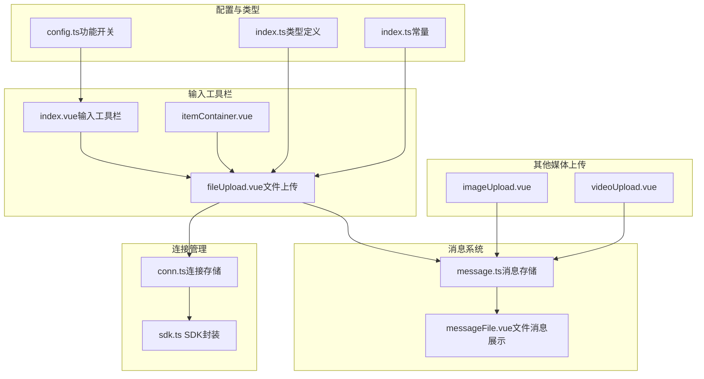
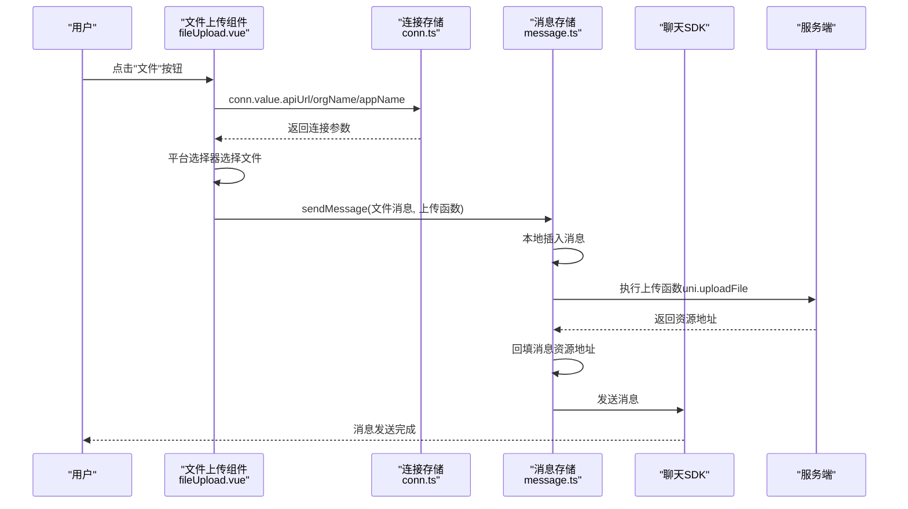
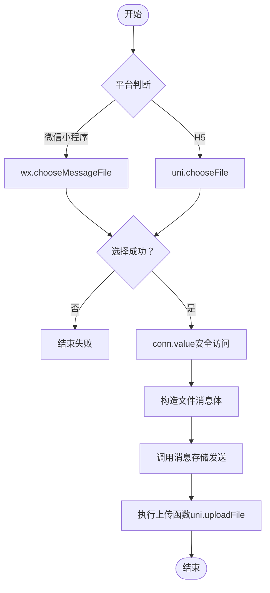
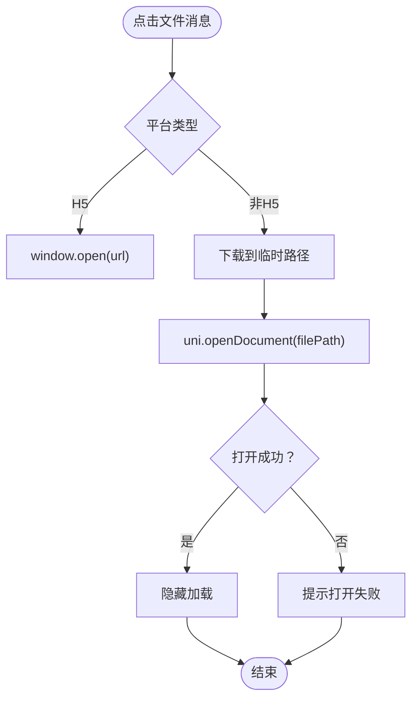
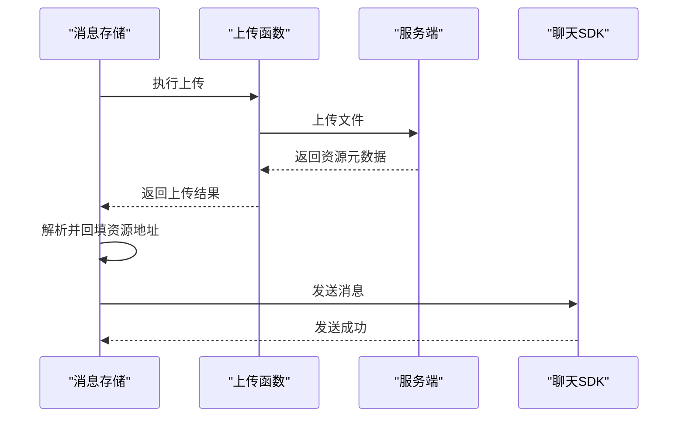
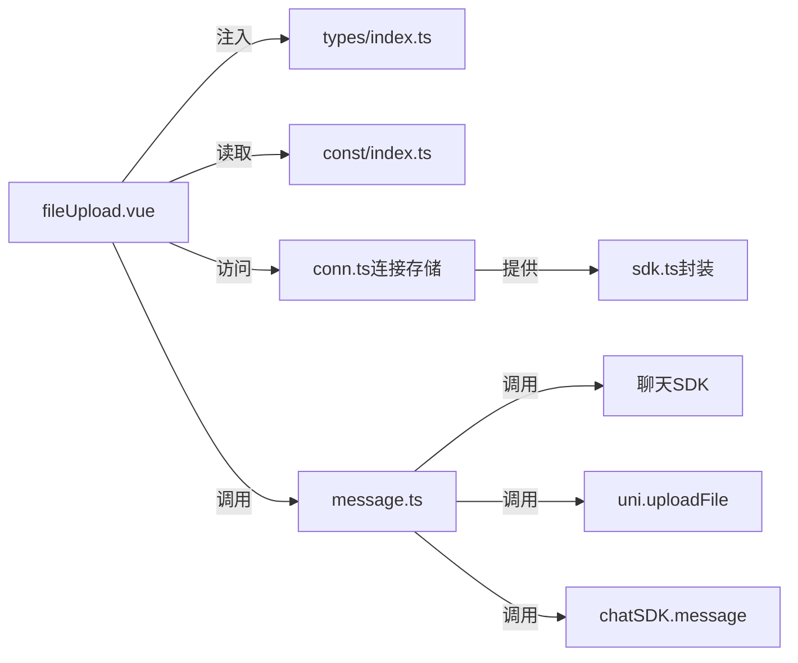

# 文件上传

<cite>
**本文档引用的文件**
- [fileUpload.vue](file://ChatUIKit/modules/Chat/components/MessageInputToolBar/fileUpload.vue)
- [index.vue（输入工具栏）](file://ChatUIKit/modules/Chat/components/MessageInputToolBar/index.vue)
- [itemContainer.vue](file://ChatUIKit/modules/Chat/components/MessageInputToolBar/itemContainer.vue)
- [messageFile.vue](file://ChatUIKit/modules/Chat/components/Message/messageFile.vue)
- [message.ts（消息存储）](file://ChatUIKit/stores/message.ts)
- [conn.ts（连接存储）](file://ChatUIKit/stores/conn.ts)
- [config.ts（配置存储）](file://ChatUIKit/stores/config.ts)
- [index.ts（类型定义）](file://ChatUIKit/types/index.ts)
- [index.ts（常量）](file://ChatUIKit/const/index.ts)
- [index.vue（消息输入）](file://ChatUIKit/modules/Chat/components/MessageInput/index.vue)
- [videoUpload.vue](file://ChatUIKit/modules/Chat/components/MessageInputToolBar/videoUpload.vue)
- [imageUpload.vue](file://ChatUIKit/modules/Chat/components/MessageInputToolBar/imageUpload.vue)
- [sdk.ts（SDK封装）](file://ChatUIKit/sdk.ts)
- [demo/const/index.ts（演示配置）](file://demo/const/index.ts)
</cite>

## 更新摘要
**变更内容**
- 修复了文件上传组件中的URL构造错误，改进了连接参数访问逻辑
- 优化了上传参数的构建方式，确保URL拼接的正确性和稳定性
- 增强了连接参数的安全访问机制，提升了上传功能的可靠性

## 目录
1. [简介](#简介)
2. [项目结构](#项目结构)
3. [核心组件](#核心组件)
4. [架构总览](#架构总览)
5. [详细组件分析](#详细组件分析)
6. [依赖关系分析](#依赖关系分析)
7. [性能与可扩展性](#性能与可扩展性)
8. [故障排查指南](#故障排查指南)
9. [结论](#结论)
10. [附录](#附录)

## 简介
本文件上传功能基于多端统一框架（uni-app），在聊天输入工具栏中提供"文件"入口，支持微信小程序与 H5 平台的文件选择与上传，并在消息列表中展示文件名称、大小与图标，点击后可在不同平台进行预览或下载打开。上传流程由消息存储层统一调度，结合 SDK 构造文件消息体并发送，同时在上传完成后回填服务端返回的资源地址。

**更新** 本次更新重点修复了文件上传组件中的URL构造错误，改进了连接参数访问逻辑，提升了上传功能的稳定性。

## 项目结构
围绕文件上传的关键模块与文件如下：
- 输入工具栏：提供"文件"按钮入口，调用平台选择器并触发上传
- 消息存储：负责本地消息构建、上传执行、回填资源地址与最终发送
- 消息展示：文件消息项组件负责渲染文件名、大小与图标，并提供预览能力
- 配置与类型：控制功能开关、注入事件接口、提供类型约束
- 连接管理：提供安全的连接参数访问机制

**图表来源**
- [fileUpload.vue](file://ChatUIKit/modules/Chat/components/MessageInputToolBar/fileUpload.vue#L1-L104)
- [message.ts（消息存储）](file://ChatUIKit/stores/message.ts#L220-L336)
- [conn.ts（连接存储）](file://ChatUIKit/stores/conn.ts#L25-L40)
- [sdk.ts（SDK封装）](file://ChatUIKit/sdk.ts#L1-L13)

**章节来源**
- [fileUpload.vue](file://ChatUIKit/modules/Chat/components/MessageInputToolBar/fileUpload.vue#L1-L104)
- [message.ts（消息存储）](file://ChatUIKit/stores/message.ts#L220-L336)
- [conn.ts（连接存储）](file://ChatUIKit/stores/conn.ts#L25-L40)
- [index.vue（输入工具栏）](file://ChatUIKit/modules/Chat/components/MessageInputToolBar/index.vue#L1-L68)

## 核心组件
- 文件上传入口（fileUpload.vue）
  - 负责在微信小程序与 H5 平台分别调用平台选择器，构造文件消息体并通过消息存储层发送
  - 通过注入的输入工具栏事件接口关闭工具栏
  - **更新** 改进了连接参数访问逻辑，使用 `conn.value` 安全访问连接信息
- 消息存储（message.ts）
  - 统一处理消息发送流程，支持在存在上传函数时先上传文件，再回填资源地址并发送
  - 对不同类型消息（文件、图片、音频、视频）进行格式同步与回填
- 文件消息展示（messageFile.vue）
  - 展示文件名与大小，提供点击预览能力；在 H5 直接打开，在非 H5 下载后再打开
- 输入工具栏（index.vue）
  - 条件渲染"文件"入口，受功能开关控制
- 连接存储（conn.ts）
  - **新增** 提供类型安全的连接参数访问，包含 `getChatConn` getter 确保连接已初始化
- 类型与常量（types/index.ts、const/index.ts）
  - 定义输入工具栏事件接口、消息状态等类型，提供资源 URL 常量

**章节来源**
- [fileUpload.vue](file://ChatUIKit/modules/Chat/components/MessageInputToolBar/fileUpload.vue#L28-L30)
- [message.ts（消息存储）](file://ChatUIKit/stores/message.ts#L220-L336)
- [messageFile.vue](file://ChatUIKit/modules/Chat/components/Message/messageFile.vue#L1-L130)
- [conn.ts（连接存储）](file://ChatUIKit/stores/conn.ts#L25-L40)

## 架构总览
文件上传的整体流程如下：
- 用户点击输入工具栏中的"文件"按钮
- 平台选择器弹出，用户选择文件
- 构造文件消息体，调用消息存储层发送
- **更新** 使用安全的连接参数访问机制获取上传URL和令牌
- 若存在上传函数，则先上传文件，解析服务端返回的资源地址并回填
- 最终通过聊天 SDK 发送消息

**图表来源**
- [fileUpload.vue](file://ChatUIKit/modules/Chat/components/MessageInputToolBar/fileUpload.vue#L56-L95)
- [message.ts（消息存储）](file://ChatUIKit/stores/message.ts#L220-L336)
- [conn.ts（连接存储）](file://ChatUIKit/stores/conn.ts#L25-L40)

**章节来源**
- [fileUpload.vue](file://ChatUIKit/modules/Chat/components/MessageInputToolBar/fileUpload.vue#L56-L95)
- [message.ts（消息存储）](file://ChatUIKit/stores/message.ts#L220-L336)

## 详细组件分析

### 文件选择器与上传触发
- 微信小程序平台
  - 使用平台提供的消息文件选择器，支持单选与"全部类型"
  - 成功回调中提取临时文件对象，继续构造消息并上传
- H5 平台
  - 使用统一选择器，支持单选
  - 成功回调中同样提取临时文件对象，继续构造消息并上传
- **更新** 上传参数
  - 请求 URL 通过 `conn.value.apiUrl/${conn.value.orgName}/${conn.value.appName}/chatfiles` 安全构造
  - 请求头包含认证令牌 `Authorization: Bearer ${conn.value.token}`
  - 上传字段名为"file"，文件路径来自选择结果

**图表来源**
- [fileUpload.vue](file://ChatUIKit/modules/Chat/components/MessageInputToolBar/fileUpload.vue#L31-L95)

**章节来源**
- [fileUpload.vue](file://ChatUIKit/modules/Chat/components/MessageInputToolBar/fileUpload.vue#L31-L95)

### 文件信息展示与预览
- 文件名与大小
  - 文件名直接取自消息体字段
  - 大小以 KB 显示，数值来源于文件长度字段
- 图标与样式
  - 左侧使用固定文件图标背景
  - 根据消息方向切换左右布局
- 预览行为
  - H5：直接在新窗口打开资源 URL
  - 非 H5：先下载到本地临时路径，再调用打开文档接口；失败时提示错误

**图表来源**
- [messageFile.vue](file://ChatUIKit/modules/Chat/components/Message/messageFile.vue#L31-L76)

**章节来源**
- [messageFile.vue](file://ChatUIKit/modules/Chat/components/Message/messageFile.vue#L1-L130)

### 上传流程与消息回填
- 消息存储层在发送前对不同类型消息进行字段同步与本地插入
- **更新** 上传函数执行后，解析服务端返回的资源元数据，拼接完整的资源地址并回填到消息体
- 最终通过 SDK 发送消息，并更新本地消息状态

**图表来源**
- [message.ts（消息存储）](file://ChatUIKit/stores/message.ts#L220-L336)

**章节来源**
- [message.ts（消息存储）](file://ChatUIKit/stores/message.ts#L220-L336)

### 连接参数访问与URL构造
- **新增** 连接存储提供类型安全的连接参数访问
- 使用 `computed` getter 确保连接已初始化，避免空引用错误
- URL 构造采用模板字符串方式，确保各参数正确拼接
- 认证令牌通过 Bearer 方式传递，符合标准 OAuth 2.0 规范

**章节来源**
- [conn.ts（连接存储）](file://ChatUIKit/stores/conn.ts#L25-L40)
- [fileUpload.vue](file://ChatUIKit/modules/Chat/components/MessageInputToolBar/fileUpload.vue#L58-L70)

### 功能开关与入口控制
- 输入工具栏根据功能开关条件渲染"文件"入口
- 开关位于全局配置存储中，默认全部开启
- 可通过接口动态隐藏或显示指定功能

**章节来源**
- [index.vue（输入工具栏）](file://ChatUIKit/modules/Chat/components/MessageInputToolBar/index.vue#L12-L16)
- [config.ts（配置存储）](file://ChatUIKit/stores/config.ts#L24-L57)

### 类型与注入接口
- 输入工具栏事件接口用于关闭工具栏
- 类型定义中包含该接口声明，确保组件间契约一致

**章节来源**
- [index.ts（类型定义）](file://ChatUIKit/types/index.ts#L3-L5)

### 与其他媒体上传的关系
- 图片与视频上传采用相似模式：选择文件 -> 构造消息 -> 上传 -> 回填 -> 发送
- 三者共享同一消息存储层，具备一致的上传与回填流程

**章节来源**
- [imageUpload.vue](file://ChatUIKit/modules/Chat/components/MessageInputToolBar/imageUpload.vue#L46-L84)
- [videoUpload.vue](file://ChatUIKit/modules/Chat/components/MessageInputToolBar/videoUpload.vue#L1-L38)

## 依赖关系分析
- 组件耦合
  - 文件上传组件依赖输入工具栏事件接口以关闭工具栏
  - 依赖消息存储层统一处理上传与发送
  - **更新** 依赖连接存储层提供安全的连接参数访问
  - 依赖聊天 SDK 的消息创建与发送能力
- 外部依赖
  - uni-app 的选择器与上传 API
  - 聊天 SDK 的消息创建与发送能力
- **更新** 循环依赖防护
  - 通过连接存储的 getter 机制，避免直接的双向依赖
  - 使用 computed 属性确保连接参数的响应式更新

**图表来源**
- [fileUpload.vue](file://ChatUIKit/modules/Chat/components/MessageInputToolBar/fileUpload.vue#L10-L14)
- [conn.ts（连接存储）](file://ChatUIKit/stores/conn.ts#L25-L40)
- [sdk.ts（SDK封装）](file://ChatUIKit/sdk.ts#L1-L13)

**章节来源**
- [fileUpload.vue](file://ChatUIKit/modules/Chat/components/MessageInputToolBar/fileUpload.vue#L10-L14)
- [conn.ts（连接存储）](file://ChatUIKit/stores/conn.ts#L25-L40)

## 性能与可扩展性
- 上传并发
  - 当前实现逐条发送，未见并发队列或分片策略
- 断点续传
  - 代码中未发现断点续传实现
- 大文件处理
  - 建议引入分片上传与断点续传，结合服务端支持
- 进度条与暂停/恢复
  - 当前未实现进度条与暂停/恢复控制
- 批量上传
  - 当前仅支持单文件选择，可扩展为多选并行上传
- 拖拽与粘贴
  - 未发现拖拽上传与粘贴上传实现
- 大小限制与格式校验
  - 未见客户端侧的大小限制与格式白名单校验逻辑，建议在选择器回调中增加校验

## 故障排查指南
- 无法选择文件
  - 检查平台选择器调用是否正确，确认回调成功路径
  - **章节来源**
    - [fileUpload.vue](file://ChatUIKit/modules/Chat/components/MessageInputToolBar/fileUpload.vue#L31-L53)
- **更新** URL构造错误
  - 检查连接参数访问是否使用 `conn.value` 安全访问
  - 确认URL拼接格式为 `${apiUrl}/${orgName}/${appName}/chatfiles`
  - 验证连接存储的 getter 是否正常工作
  - **章节来源**
    - [fileUpload.vue](file://ChatUIKit/modules/Chat/components/MessageInputToolBar/fileUpload.vue#L58)
    - [conn.ts（连接存储）](file://ChatUIKit/stores/conn.ts#L29-L34)
- 上传失败
  - 检查请求 URL、认证令牌与文件路径是否正确
  - 查看消息存储层的上传执行与回填逻辑
  - **章节来源**
    - [fileUpload.vue](file://ChatUIKit/modules/Chat/components/MessageInputToolBar/fileUpload.vue#L63-L70)
    - [message.ts（消息存储）](file://ChatUIKit/stores/message.ts#L263-L275)
- 预览失败
  - H5 直接打开失败时，检查 URL 可访问性
  - 非 H5 下载失败时，检查网络与权限
  - **章节来源**
    - [messageFile.vue](file://ChatUIKit/modules/Chat/components/Message/messageFile.vue#L31-L76)
- 功能未显示
  - 检查功能开关是否开启
  - **章节来源**
    - [index.vue（输入工具栏）](file://ChatUIKit/modules/Chat/components/MessageInputToolBar/index.vue#L12-L16)
    - [config.ts（配置存储）](file://ChatUIKit/stores/config.ts#L24-L57)

## 结论
该文件上传功能实现了跨平台的文件选择与上传，配合消息存储层完成资源回填与消息发送。**更新后的版本修复了URL构造错误，改进了连接参数访问逻辑，提升了上传功能的稳定性。** 当前版本未包含断点续传、批量上传、拖拽与粘贴上传、进度条与暂停/恢复、以及客户端侧的大小限制与格式校验。后续可在此基础上扩展大文件处理与安全校验机制，以提升用户体验与安全性。

## 附录
- 关键流程路径参考
  - 文件选择与上传触发：[fileUpload.vue](file://ChatUIKit/modules/Chat/components/MessageInputToolBar/fileUpload.vue#L31-L95)
  - 连接参数访问与URL构造：[conn.ts（连接存储）](file://ChatUIKit/stores/conn.ts#L25-L40)
  - 消息发送与回填：[message.ts（消息存储）](file://ChatUIKit/stores/message.ts#L220-L336)
  - 文件消息展示与预览：[messageFile.vue](file://ChatUIKit/modules/Chat/components/Message/messageFile.vue#L1-L130)
  - 功能开关与入口控制：[index.vue（输入工具栏）](file://ChatUIKit/modules/Chat/components/MessageInputToolBar/index.vue#L12-L16)、[config.ts（配置存储）](file://ChatUIKit/stores/config.ts#L24-L57)
  - 类型与注入接口：[index.ts（类型定义）](file://ChatUIKit/types/index.ts#L3-L5)
  - 常量与资源 URL：[index.ts（常量）](file://ChatUIKit/const/index.ts#L7-L8)
  - SDK封装：[sdk.ts（SDK封装）](file://ChatUIKit/sdk.ts#L1-L13)
  - 演示配置：[demo/const/index.ts（演示配置）](file://demo/const/index.ts#L4-L10)
  - 其他媒体上传对比：[imageUpload.vue](file://ChatUIKit/modules/Chat/components/MessageInputToolBar/imageUpload.vue#L46-L84)、[videoUpload.vue](file://ChatUIKit/modules/Chat/components/MessageInputToolBar/videoUpload.vue#L1-L38)