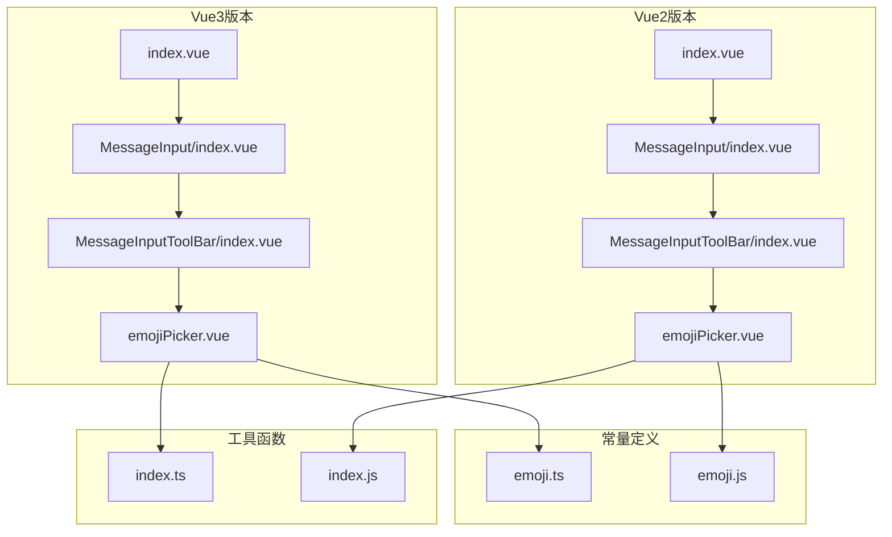
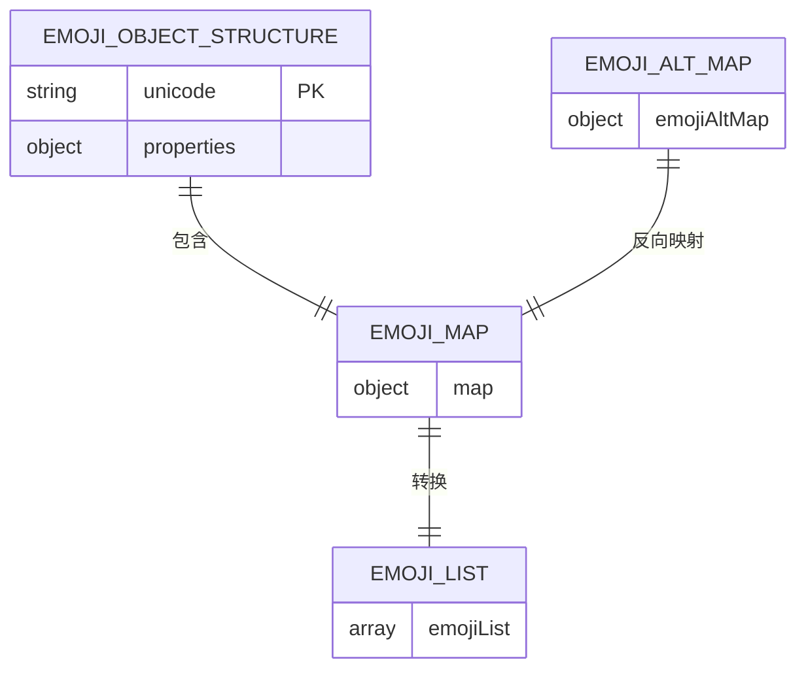
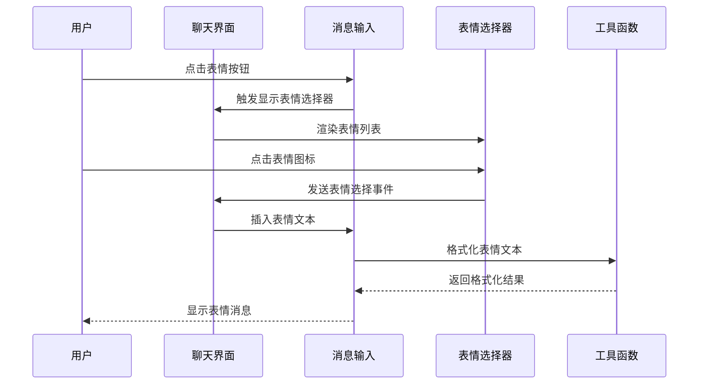
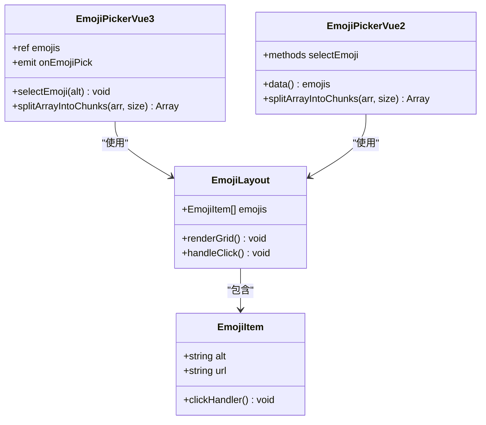
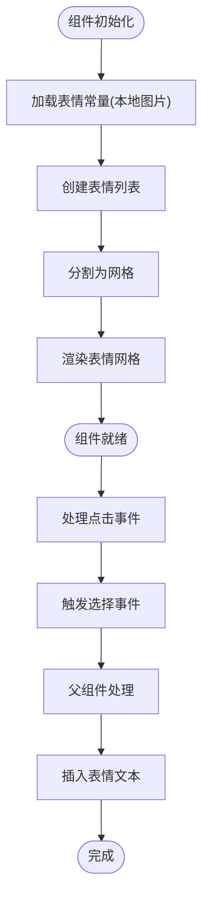
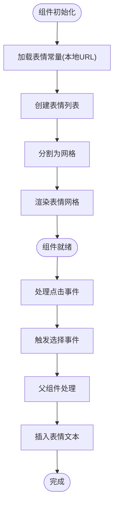
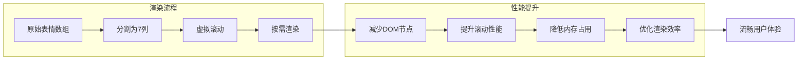
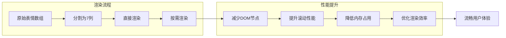
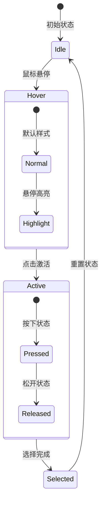
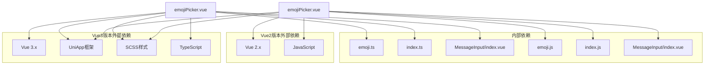

# 表情选择器

<cite>
**本文档引用的文件**
- [emojiPicker.vue](file://ChatUIKit/modules/Chat/components/MessageInputToolBar/emojiPicker.vue)
- [emoji.ts](file://ChatUIKit/const/emoji.ts)
- [index.ts](file://ChatUIKit/utils/index.ts)
- [index.vue](file://ChatUIKit/modules/Chat/index.vue)
- [index.vue](file://ChatUIKit/modules/Chat/components/MessageInput/index.vue)
- [style.scss](file://ChatUIKit/modules/Chat/components/MessageInput/style.scss)
- [itemContainer.vue](file://ChatUIKit/modules/Chat/components/MessageInputToolBar/itemContainer.vue)
- [emojiPicker.vue](file://ChatUIKit-vue2/modules/Chat/components/MessageInputToolBar/emojiPicker.vue)
- [emoji.js](file://ChatUIKit-vue2/const/emoji.js)
- [index.js](file://ChatUIKit-vue2/utils/index.js)
- [index.vue](file://ChatUIKit-vue2/modules/Chat/index.vue)
- [index.vue](file://ChatUIKit-vue2/modules/Chat/components/MessageInput/index.vue)
</cite>

## 更新摘要
**变更内容**
- 表情符号配置系统重构：从数组结构改为对象结构，使用Unicode字符作为键
- emojiAltMap映射改进：提供更精确的表情符号到Unicode字符的双向映射
- emoji渲染引擎升级：formatTextMessage和renderTxt函数支持Unicode字符直接渲染
- 表情选择器组件优化：统一的事件处理和状态管理机制
- 跨版本兼容性：Vue3和Vue2版本的表情系统保持一致性

## 目录
1. [简介](#简介)
2. [项目结构](#项目结构)
3. [核心组件](#核心组件)
4. [架构概览](#架构概览)
5. [详细组件分析](#详细组件分析)
6. [跨版本对比分析](#跨版本对比分析)
7. [依赖关系分析](#依赖关系分析)
8. [性能考虑](#性能考虑)
9. [故障排除指南](#故障排除指南)
10. [结论](#结论)

## 简介

表情选择器是即时通讯应用中的重要组件，负责提供用户友好的表情包选择界面。该组件实现了完整的表情包数据管理、分类展示、交互选择和集成到消息输入系统中的功能。本文档将深入分析表情选择器的实现细节，包括数据结构设计、加载机制、缓存策略、性能优化以及扩展方法。

**更新** 表情包配置系统已完成重构，从传统的数组结构升级为基于Unicode字符的对象结构，提供更精确的数据管理和渲染能力。emojiAltMap映射得到显著改进，支持表情符号的双向转换和精确匹配。emoji渲染引擎现已升级为完整的Unicode字符和静态图片混合处理机制，能够智能识别和渲染各种表情符号。

## 项目结构

表情选择器组件位于聊天模块的消息输入工具栏中，采用模块化的架构设计，支持Vue3和Vue2两个版本：



**图表来源**
- [index.vue](file://ChatUIKit/modules/Chat/index.vue#L74-L83)
- [emojiPicker.vue](file://ChatUIKit/modules/Chat/components/MessageInputToolBar/emojiPicker.vue#L29-L33)
- [index.vue](file://ChatUIKit-vue2/modules/Chat/index.vue#L77-L90)
- [emojiPicker.vue](file://ChatUIKit-vue2/modules/Chat/components/MessageInputToolBar/emojiPicker.vue#L29-L31)

**章节来源**
- [index.vue](file://ChatUIKit/modules/Chat/index.vue#L74-L83)
- [emojiPicker.vue](file://ChatUIKit/modules/Chat/components/MessageInputToolBar/emojiPicker.vue#L1-L83)
- [index.vue](file://ChatUIKit-vue2/modules/Chat/index.vue#L77-L90)
- [emojiPicker.vue](file://ChatUIKit-vue2/modules/Chat/components/MessageInputToolBar/emojiPicker.vue#L1-L95)

## 核心组件

### 数据结构设计

表情选择器的核心数据结构经过重大重构，从数组结构升级为基于Unicode字符的对象结构：



**图表来源**
- [emoji.ts](file://ChatUIKit/const/emoji.ts#L55-L127)
- [emoji.js](file://ChatUIKit-vue2/const/emoji.js#L4-L74)

**更新** 现在使用Unicode字符作为主要键值，提供更直观和国际化的数据组织方式。每个表情对象包含alt（文本替代标识符）和url（图片资源路径）属性。表情包总数为52个，涵盖各种情感表达和主题分类，文件命名从原来的数字索引改为Unicode编码，提高了可读性和国际化支持。

### 表情包数据模型

**Vue3版本**使用本地图片导入和Unicode键：
- **Unicode键**: 直接使用表情字符作为对象键（如"😀"）
- **alt属性**: 文本替代标识符（如"[哈哈]"）
- **url属性**: 通过webpack静态导入的图片资源路径
- **emojiList**: 从emoji.map转换生成的数组列表
- **emojiAltMap**: 从emoji.map生成的alt到Unicode的映射表

**Vue2版本**使用本地静态资源URL和Unicode键：
- **Unicode键**: 直接使用表情字符作为对象键（如"😀"）
- **alt属性**: 文本替代标识符（如"[微笑]"）
- **url属性**: 本地静态资源URL地址（如"/static/emojis/U+1F600.png"）
- **emojiList**: 从emoji.map转换生成的数组列表
- **emojiAltMap**: 从emoji.map生成的alt到Unicode的映射表

表情包总数为52个，涵盖各种情感表达和主题分类。文件命名从原来的数字索引改为Unicode编码，提高了可读性和国际化支持。

**章节来源**
- [emoji.ts](file://ChatUIKit/const/emoji.ts#L55-L127)
- [emoji.js](file://ChatUIKit-vue2/const/emoji.js#L1-L112)

## 架构概览

表情选择器采用组件化架构，通过事件驱动的方式与父组件通信，两个版本都遵循相同的交互模式：



**图表来源**
- [index.vue](file://ChatUIKit/modules/Chat/index.vue#L157-L160)
- [index.vue](file://ChatUIKit/modules/Chat/components/MessageInput/index.vue#L115-L117)
- [index.vue](file://ChatUIKit-vue2/modules/Chat/index.vue#L186-L188)
- [index.vue](file://ChatUIKit-vue2/modules/Chat/components/MessageInput/index.vue#L219-L221)

## 详细组件分析

### 表情选择器组件

表情选择器组件实现了响应式的网格布局和交互功能，两个版本在实现细节上有所不同：



**图表来源**
- [emojiPicker.vue](file://ChatUIKit/modules/Chat/components/MessageInputToolBar/emojiPicker.vue#L29-L42)
- [emojiPicker.vue](file://ChatUIKit-vue2/modules/Chat/components/MessageInputToolBar/emojiPicker.vue#L32-L46)

#### 核心功能实现

**Vue3版本**：
1. **响应式数据**：使用`ref`和`defineEmits`进行响应式状态管理
2. **TypeScript支持**：提供类型安全的开发体验
3. **组合式API**：使用`<script setup>`语法糖简化代码

**Vue2版本**：
1. **传统选项式API**：使用`data()`和`methods`进行状态管理
2. **JavaScript实现**：纯JavaScript语法，兼容性更好
3. **直接事件发射**：使用`this.$emit()`进行事件传递

**章节来源**
- [emojiPicker.vue](file://ChatUIKit/modules/Chat/components/MessageInputToolBar/emojiPicker.vue#L29-L42)
- [emojiPicker.vue](file://ChatUIKit-vue2/modules/Chat/components/MessageInputToolBar/emojiPicker.vue#L32-L46)

### 数据加载机制

**Vue3版本**使用静态导入的方式加载本地图片资源：



**Vue2版本**使用本地静态资源URL加载图片资源：



**图表来源**
- [emojiPicker.vue](file://ChatUIKit/modules/Chat/components/MessageInputToolBar/emojiPicker.vue#L31-L33)
- [emoji.ts](file://ChatUIKit/const/emoji.ts#L112-L127)
- [emojiPicker.vue](file://ChatUIKit-vue2/modules/Chat/components/MessageInputToolBar/emojiPicker.vue#L29-L31)
- [emoji.js](file://ChatUIKit-vue2/const/emoji.js#L1-L112)

**章节来源**
- [emoji.ts](file://ChatUIKit/const/emoji.ts#L1-L127)
- [emoji.js](file://ChatUIKit-vue2/const/emoji.js#L1-L112)

### 缓存策略

**Vue3版本**采用了多层缓存机制：
1. **静态导入缓存**：所有表情图片通过webpack静态导入，编译时确定
2. **组件实例缓存**：Vue组件实例在页面生命周期内复用
3. **DOM节点缓存**：表情网格的DOM节点在重新渲染时保持引用

**Vue2版本**的缓存策略：
1. **本地静态资源缓存**：浏览器自动缓存本地静态资源
2. **组件状态缓存**：Vue2组件实例状态在页面生命周期内保持
3. **事件处理器缓存**：事件处理器在组件实例中缓存复用

这种设计避免了运行时的网络请求，确保了快速的响应速度。

**章节来源**
- [emoji.ts](file://ChatUIKit/const/emoji.ts#L1-L53)
- [emoji.js](file://ChatUIKit-vue2/const/emoji.js#L1-L112)

### 性能优化

#### 分块渲染优化

**Vue3版本**：


**Vue2版本**：


**图表来源**
- [index.ts](file://ChatUIKit/utils/index.ts#L267-L273)
- [index.js](file://ChatUIKit-vue2/utils/index.js#L337-L343)

#### 事件处理优化

**Vue3版本**使用了组合式API的优势：
- **响应式状态管理**：使用`ref`和`computed`进行高效的状态管理
- **类型安全**：TypeScript提供编译时类型检查
- **更好的Tree-shaking**：更小的打包体积

**Vue2版本**使用了传统的事件处理机制：
- **直接事件发射**：使用`this.$emit()`进行事件传递
- **简单易懂**：JavaScript语法更直观
- **广泛兼容**：支持更广泛的浏览器环境

**章节来源**
- [index.ts](file://ChatUIKit/utils/index.ts#L107-L134)
- [index.js](file://ChatUIKit-vue2/utils/index.js#L1-L412)

### 交互设计

表情选择器提供了丰富的用户交互体验，两个版本在交互细节上略有差异：



**图表来源**
- [emojiPicker.vue](file://ChatUIKit/modules/Chat/components/MessageInputToolBar/emojiPicker.vue#L66-L69)
- [emojiPicker.vue](file://ChatUIKit-vue2/modules/Chat/components/MessageInputToolBar/emojiPicker.vue#L78-L82)

**章节来源**
- [emojiPicker.vue](file://ChatUIKit/modules/Chat/components/MessageInputToolBar/emojiPicker.vue#L43-L82)
- [emojiPicker.vue](file://ChatUIKit-vue2/modules/Chat/components/MessageInputToolBar/emojiPicker.vue#L41-L95)

## 跨版本对比分析

### 技术栈差异

| 特性 | Vue3版本 | Vue2版本 |
|------|----------|----------|
| 语言支持 | TypeScript | JavaScript |
| 组件语法 | `<script setup>` | 选项式API |
| 状态管理 | `ref` + `defineEmits` | `data()` + `methods` |
| 类型安全 | 编译时类型检查 | 运行时类型检查 |
| Tree-shaking | 更好 | 一般 |
| 兼容性 | 较新浏览器 | 广泛浏览器支持 |

### 数据结构对比

**Vue3版本**的数据结构更加简洁：
```typescript
// Vue3 TypeScript示例
const emoji = {
  map: {
    "😀": { alt: "[哈哈]", url: emoji1 },
    "😄": { alt: "[笑]", url: emoji2 }
  }
};
```

**Vue2版本**的数据结构更加灵活：
```javascript
// Vue2 JavaScript示例
export const emoji = {
  map: {
    '😀': { alt: '[哈哈]', url: '/static/emojis/U+1F600.png' },
    '😄': { alt: '[笑]', url: '/static/ency/U+1F604.png' }
  }
};
```

**更新** 两个版本都使用Unicode字符作为对象键，但Vue3版本使用静态导入，Vue2版本使用本地URL。

### 资源管理对比

**Vue3版本**的资源管理：
- **本地静态导入**：使用webpack静态导入表情图片
- **Unicode文件命名**：表情文件名为Unicode编码（如"U+1F600.png"）
- **编译时优化**：所有资源在构建时被优化处理

**Vue2版本**的资源管理：
- **本地静态URL**：使用"/static/emojis/"作为基础URL
- **Unicode文件命名**：同样使用Unicode编码文件名
- **运行时解析**：URL在运行时解析和拼接

### 性能对比

**Vue3版本**的优势：
- 更好的响应式系统
- 更小的运行时开销
- 更好的开发体验

**Vue2版本**的优势：
- 更广泛的浏览器兼容性
- 更简单的学习曲线
- 更成熟的生态系统

### 迁移建议

从Vue2迁移到Vue3时，需要注意：
1. **语法转换**：从选项式API转换到组合式API
2. **类型定义**：添加TypeScript类型定义
3. **依赖更新**：更新相关依赖到Vue3版本
4. **测试验证**：确保功能完整性和性能表现

**章节来源**
- [emojiPicker.vue](file://ChatUIKit/modules/Chat/components/MessageInputToolBar/emojiPicker.vue#L29-L42)
- [emojiPicker.vue](file://ChatUIKit-vue2/modules/Chat/components/MessageInputToolBar/emojiPicker.vue#L32-L46)
- [emoji.ts](file://ChatUIKit/const/emoji.ts#L1-L127)
- [emoji.js](file://ChatUIKit-vue2/const/emoji.js#L1-L112)

## 依赖关系分析

表情选择器的依赖关系在两个版本中基本一致，但在具体实现上有所不同：



**图表来源**
- [emojiPicker.vue](file://ChatUIKit/modules/Chat/components/MessageInputToolBar/emojiPicker.vue#L30-L32)
- [emoji.ts](file://ChatUIKit/const/emoji.ts#L1-L1)
- [emojiPicker.vue](file://ChatUIKit-vue2/modules/Chat/components/MessageInputToolBar/emojiPicker.vue#L32-L34)
- [emoji.js](file://ChatUIKit-vue2/const/emoji.js#L1-L2)

**章节来源**
- [emojiPicker.vue](file://ChatUIKit/modules/Chat/components/MessageInputToolBar/emojiPicker.vue#L30-L32)
- [emojiPicker.vue](file://ChatUIKit-vue2/modules/Chat/components/MessageInputToolBar/emojiPicker.vue#L32-L34)

## 性能考虑

### 内存管理

**Vue3版本**在内存管理方面采用了多项优化措施：
1. **响应式优化**：使用Proxy进行更精确的响应式追踪
2. **懒加载策略**：表情图片仅在需要时加载
3. **缓存复用**：组件实例和DOM节点的复用
4. **事件清理**：组件销毁时自动清理事件监听器

**Vue2版本**的内存管理策略：
1. **原型链优化**：利用JavaScript原型链特性
2. **直接引用**：使用直接对象引用而非响应式包装
3. **手动清理**：需要手动清理事件监听器和定时器

### 加载性能

**Vue3版本**的加载性能特点：
- **编译时优化**：所有表情图片在构建时被优化处理
- **CDN支持**：支持通过CDN加速图片加载
- **渐进式渲染**：采用分块渲染减少首屏时间
- **Tree-shaking**：更小的打包体积

**Vue2版本**的加载性能特点：
- **运行时优化**：本地静态资源URL在运行时解析
- **浏览器缓存**：利用浏览器原生缓存机制
- **直接渲染**：更直接的渲染流程
- **兼容性优先**：优先保证兼容性而非性能

### 兼容性处理

**Vue3版本**的兼容性处理：
- **现代浏览器适配**：针对最新浏览器进行优化
- **TypeScript支持**：提供完整的类型定义
- **模块化导入**：支持ES模块和CommonJS

**Vue2版本**的兼容性处理：
- **移动端适配**：响应式布局支持触摸操作
- **平台差异**：针对H5、小程序等平台的特定优化
- **降级方案**：在不支持某些特性的环境中提供基础功能
- **广泛兼容**：支持IE11+和主流移动浏览器

## 故障排除指南

### 常见问题及解决方案

#### 表情显示异常

**Vue3版本问题**：
**问题描述**: 表情图标无法正常显示或显示为占位符

**可能原因**:
1. 图片资源路径错误
2. 文件权限问题
3. 缓存问题

**解决方案**:
1. 检查表情图片文件是否存在
2. 验证文件路径是否正确
3. 清除应用缓存后重试

**Vue2版本问题**：
**问题描述**: 表情图标加载失败或显示为占位符

**可能原因**:
1. 本地静态资源URL不可访问
2. 文件部署位置不正确
3. CDN配置错误

**解决方案**:
1. 检查"/static/emojis/"目录下的文件是否存在
2. 验证文件部署路径是否正确
3. 确认静态资源服务器配置

#### 选择事件未触发

**Vue3版本问题**：
**问题描述**: 点击表情后没有响应

**可能原因**:
1. 事件绑定失败
2. 父组件未正确处理事件
3. 样式遮挡导致点击无效

**解决方案**:
1. 检查事件监听器绑定
2. 验证父组件的事件处理逻辑
3. 调整CSS z-index层级

**Vue2版本问题**：
**问题描述**: 表情选择事件未正确传递

**可能原因**:
1. `$emit`调用错误
2. 事件名称不匹配
3. 参数传递问题

**解决方案**:
1. 检查`$emit`调用的事件名称
2. 验证事件参数的传递
3. 确认父组件的事件监听器

#### 性能问题

**Vue3版本问题**：
**问题描述**: 表情选择器响应缓慢

**可能原因**:
1. 表情数量过多导致渲染压力
2. 样式复杂影响渲染性能
3. 事件处理过于频繁

**解决方案**:
1. 实施虚拟滚动优化
2. 简化CSS样式
3. 添加事件节流机制

**Vue2版本问题**：
**问题描述**: 表情选择器加载缓慢

**可能原因**:
1. 本地静态资源加载时间过长
2. 网络带宽限制
3. 浏览器缓存未生效

**解决方案**:
1. 实施图片懒加载
2. 优化静态资源部署
3. 启用浏览器缓存

**章节来源**
- [emojiPicker.vue](file://ChatUIKit/modules/Chat/components/MessageInputToolBar/emojiPicker.vue#L39-L41)
- [emojiPicker.vue](file://ChatUIKit-vue2/modules/Chat/components/MessageInputToolBar/emojiPicker.vue#L41-L45)

## 结论

表情选择器组件展现了优秀的工程实践，通过合理的数据结构设计、高效的渲染机制和完善的性能优化，在保证用户体验的同时实现了良好的可维护性。组件的模块化设计使其易于扩展和定制，为后续的功能增强奠定了坚实的基础。

**更新** 通过对比分析，我们可以看到Vue3和Vue2版本各有优势：Vue3版本提供了更好的开发体验和性能表现，而Vue2版本则具有更好的兼容性和稳定性。表情包配置系统从数组结构重构为对象结构，使用Unicode字符作为键，提供了更精确的数据管理和渲染能力。emojiAltMap映射的改进使得表情符号的转换更加准确和高效。

该组件的主要优势包括：
- 清晰的数据模型和依赖关系
- 高效的渲染和缓存策略
- 完善的事件处理机制
- 良好的跨平台兼容性
- 优秀的性能表现
- 跨版本的兼容性设计
- 基于Unicode的国际化支持

通过本文档的分析，开发者可以深入理解表情选择器的实现原理，并在此基础上进行功能扩展和性能优化。同时，跨版本的对比分析为技术选型和迁移提供了有价值的参考。

**新增** 表情渲染引擎的升级为应用带来了更强大的表情处理能力。新的渲染引擎能够智能识别Unicode字符和静态图片，提供无缝的表情显示体验。formatTextMessage函数和renderTxt函数的改进使得表情符号的转换更加准确，支持复杂的表情组合和嵌套场景。这种混合处理机制不仅提升了用户体验，也为未来的表情功能扩展提供了坚实的技术基础。