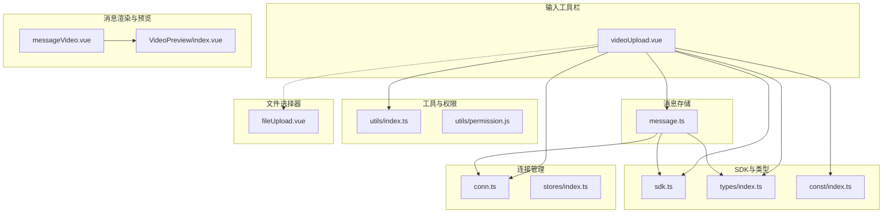
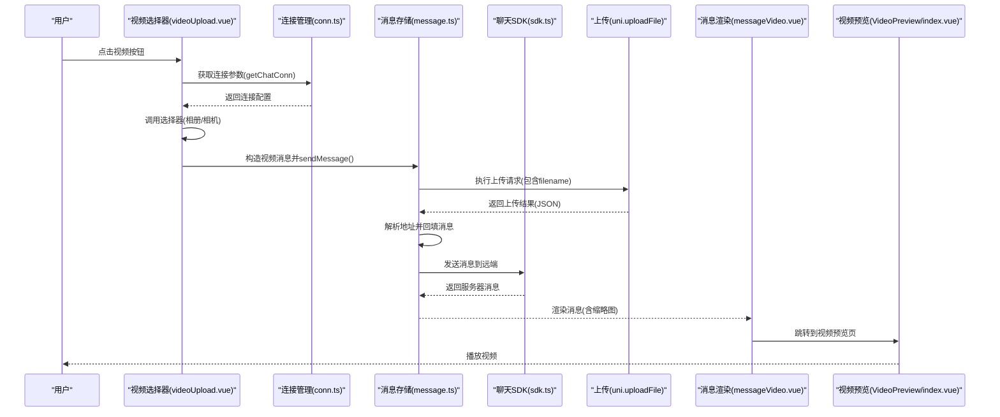
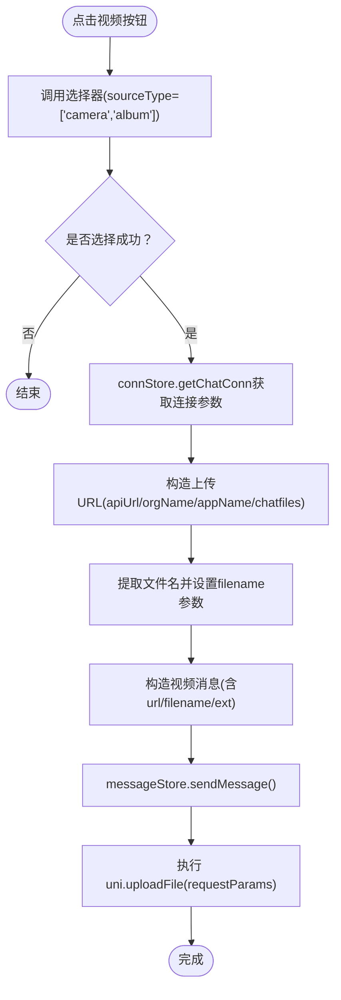
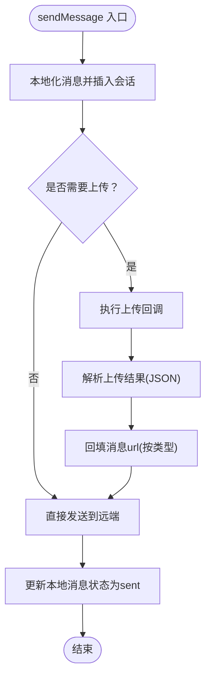
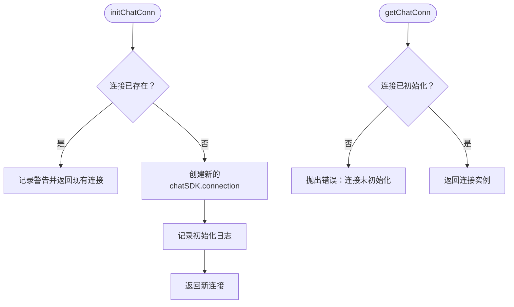
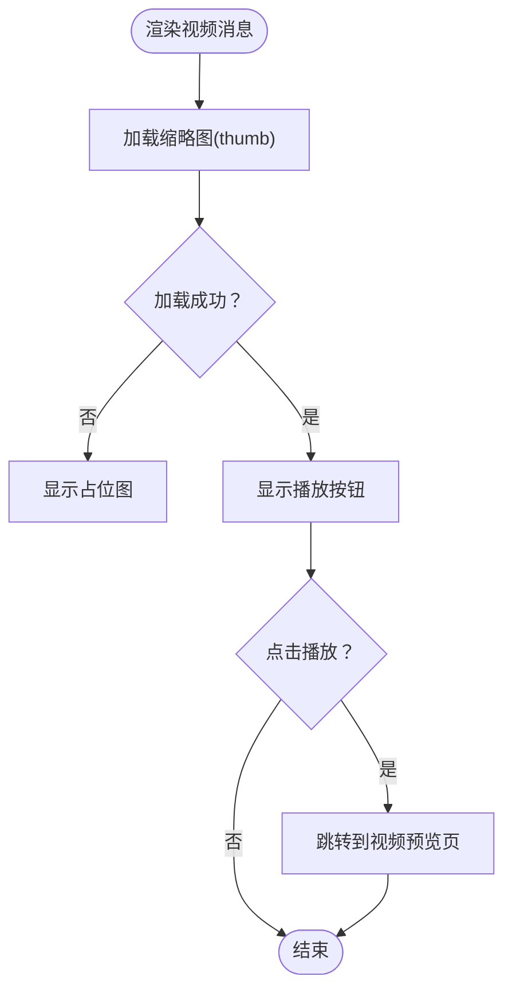
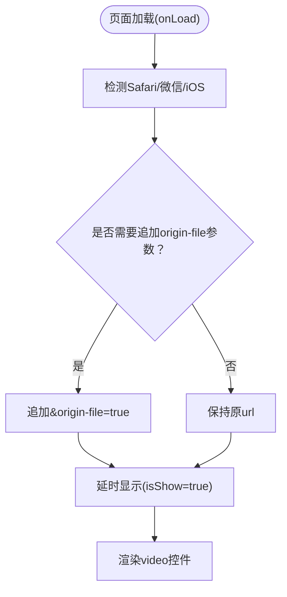
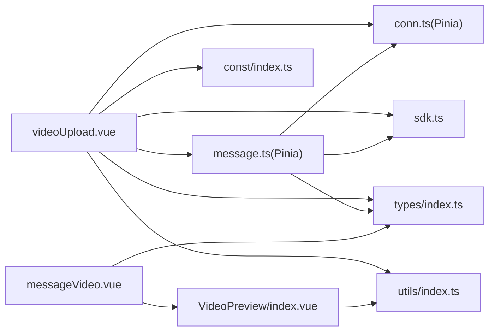

# 视频上传

<cite>
**本文档引用的文件**
- [videoUpload.vue](file://ChatUIKit/modules/Chat/components/MessageInputToolBar/videoUpload.vue)
- [message.ts](file://ChatUIKit/stores/message.ts)
- [conn.ts](file://ChatUIKit/stores/conn.ts)
- [index.ts](file://ChatUIKit/stores/index.ts)
- [sdk.ts](file://ChatUIKit/sdk.ts)
- [index.ts](file://ChatUIKit/types/index.ts)
- [index.ts](file://ChatUIKit/const/index.ts)
- [index.ts](file://ChatUIKit/utils/index.ts)
- [permission.js](file://ChatUIKit/utils/permission.js)
- [messageVideo.vue](file://ChatUIKit/modules/Chat/components/Message/messageVideo.vue)
- [index.vue](file://ChatUIKit/modules/VideoPreview/index.vue)
- [fileUpload.vue](file://ChatUIKit/modules/Chat/components/MessageInputToolBar/fileUpload.vue)
</cite>

## 更新摘要
**变更内容**
- 修复了视频上传组件中的URL构造错误，确保正确的API端点构建
- 统一了通过Pinia store访问连接参数的模式，替代原有的Vue 2 $store方式
- 新增了filename参数支持，完善视频文件上传的元数据处理
- 增强了连接状态检查和错误处理机制
- 更新了组件间的依赖关系和数据流

## 目录
1. [简介](#简介)
2. [项目结构](#项目结构)
3. [核心组件](#核心组件)
4. [架构总览](#架构总览)
5. [详细组件分析](#详细组件分析)
6. [依赖关系分析](#依赖关系分析)
7. [性能考虑](#性能考虑)
8. [故障排除指南](#故障排除指南)
9. [结论](#结论)

## 简介
本文件围绕视频上传功能进行全面技术文档化，覆盖以下方面：
- 视频选择器实现：相册选择、录制入口与文件选择器集成
- 视频预览组件：缩略图展示、播放控制与兼容性处理
- 上传流程：消息构建、文件上传、状态同步与错误处理
- 未实现但建议的功能：视频压缩、分辨率调整、码率控制、格式校验、大小限制、元数据提取、进度管理、重试机制
- 面向问题的解决方案：大视频处理、网络不稳定、存储空间不足

## 项目结构
视频上传相关代码主要分布在以下模块：
- 输入工具栏：提供视频选择入口与上传触发
- 消息存储：负责消息生命周期、上传后地址回填与状态更新
- 连接管理：统一管理聊天连接参数与状态
- SDK：统一接入聊天能力
- 类型与常量：统一消息体结构与资源路径
- 工具函数：平台检测、节流等
- 权限工具：平台权限判断（相机、相册等）
- 消息渲染：视频消息的缩略图与播放按钮
- 视频预览：独立页面播放器，适配 Safari/微信环境

**图表来源**
- [videoUpload.vue](file://ChatUIKit/modules/Chat/components/MessageInputToolBar/videoUpload.vue#L1-L87)
- [message.ts](file://ChatUIKit/stores/message.ts#L223-L336)
- [conn.ts](file://ChatUIKit/stores/conn.ts#L1-L84)
- [index.ts](file://ChatUIKit/stores/index.ts#L1-L31)
- [sdk.ts](file://ChatUIKit/sdk.ts#L1-L13)
- [index.ts](file://ChatUIKit/types/index.ts#L1-L100)
- [index.ts](file://ChatUIKit/const/index.ts#L1-L37)
- [index.ts](file://ChatUIKit/utils/index.ts#L80-L98)
- [permission.js](file://ChatUIKit/utils/permission.js#L1-L272)
- [messageVideo.vue](file://ChatUIKit/modules/Chat/components/Message/messageVideo.vue#L1-L109)
- [index.vue](file://ChatUIKit/modules/VideoPreview/index.vue#L1-L51)
- [fileUpload.vue](file://ChatUIKit/modules/Chat/components/MessageInputToolBar/fileUpload.vue#L1-L54)

**章节来源**
- [videoUpload.vue](file://ChatUIKit/modules/Chat/components/MessageInputToolBar/videoUpload.vue#L1-L87)
- [message.ts](file://ChatUIKit/stores/message.ts#L1-L581)
- [conn.ts](file://ChatUIKit/stores/conn.ts#L1-L84)
- [index.ts](file://ChatUIKit/stores/index.ts#L1-L31)
- [sdk.ts](file://ChatUIKit/sdk.ts#L1-L13)
- [index.ts](file://ChatUIKit/types/index.ts#L1-L100)
- [index.ts](file://ChatUIKit/const/index.ts#L1-L37)
- [index.ts](file://ChatUIKit/utils/index.ts#L80-L98)
- [permission.js](file://ChatUIKit/utils/permission.js#L1-L272)
- [messageVideo.vue](file://ChatUIKit/modules/Chat/components/Message/messageVideo.vue#L1-L109)
- [index.vue](file://ChatUIKit/modules/VideoPreview/index.vue#L1-L51)
- [fileUpload.vue](file://ChatUIKit/modules/Chat/components/MessageInputToolBar/fileUpload.vue#L1-L54)

## 核心组件
- 视频选择器（videoUpload.vue）：调用原生选择器，构造视频消息并触发上传
- 消息存储（message.ts）：负责消息本地化、上传回调地址回填、发送与状态更新
- 连接管理（conn.ts）：统一管理聊天连接参数，提供类型安全的连接访问
- 视频消息渲染（messageVideo.vue）：展示缩略图与播放按钮，跳转至预览页
- 视频预览（VideoPreview/index.vue）：独立页面播放器，针对 Safari/微信做兼容处理
- 文件选择器（fileUpload.vue）：通用文件选择入口，可作为视频文件选择的补充

**章节来源**
- [videoUpload.vue](file://ChatUIKit/modules/Chat/components/MessageInputToolBar/videoUpload.vue#L31-L78)
- [message.ts](file://ChatUIKit/stores/message.ts#L223-L336)
- [conn.ts](file://ChatUIKit/stores/conn.ts#L25-L40)
- [messageVideo.vue](file://ChatUIKit/modules/Chat/components/Message/messageVideo.vue#L69-L76)
- [index.vue](file://ChatUIKit/modules/VideoPreview/index.vue#L21-L37)
- [fileUpload.vue](file://ChatUIKit/modules/Chat/components/MessageInputToolBar/fileUpload.vue#L31-L54)

## 架构总览
下图展示了从用户点击到消息发送与预览的整体流程。

**图表来源**
- [videoUpload.vue](file://ChatUIKit/modules/Chat/components/MessageInputToolBar/videoUpload.vue#L31-L78)
- [conn.ts](file://ChatUIKit/stores/conn.ts#L25-L40)
- [message.ts](file://ChatUIKit/stores/message.ts#L223-L336)
- [sdk.ts](file://ChatUIKit/sdk.ts#L1-L13)
- [messageVideo.vue](file://ChatUIKit/modules/Chat/components/Message/messageVideo.vue#L69-L76)
- [index.vue](file://ChatUIKit/modules/VideoPreview/index.vue#L21-L37)

## 详细组件分析

### 组件A：视频选择器（videoUpload.vue）
**更新** 修复了URL构造错误并统一了Pinia store访问模式

- 功能职责
  - 提供"视频"入口，点击后调用原生选择器
  - 支持来源：相册与相机
  - 成功回调后构造视频消息并触发上传
- 关键点
  - 通过注入的 InputToolbarEvent 关闭工具栏
  - 使用 Pinia store 的 connStore.getChatConn 访问连接参数
  - 正确构造上传URL：`${conn.value.apiUrl}/${conn.value.orgName}/${conn.value.appName}/chatfiles`
  - 提取文件名并添加到上传请求参数中
  - 构造视频消息体，包含 url、filename 与扩展信息
  - 调用 messageStore.sendMessage，传入上传函数以完成上传与回填

**图表来源**
- [videoUpload.vue](file://ChatUIKit/modules/Chat/components/MessageInputToolBar/videoUpload.vue#L31-L78)

**章节来源**
- [videoUpload.vue](file://ChatUIKit/modules/Chat/components/MessageInputToolBar/videoUpload.vue#L31-L78)

### 组件B：消息存储（message.ts）
**更新** 增强了连接状态检查和错误处理机制

- 功能职责
  - 本地化消息、维护会话消息列表
  - 执行上传回调，解析返回地址并回填到消息体
  - 发送消息到远端，更新本地状态
- 关键点
  - 对不同类型附件（音频/文件/视频）进行 url 回填
  - 视频消息特殊处理：保留原始 url 并写入 thumb
  - 增强的连接状态检查：使用 connStore.getChatConn.user 获取当前用户ID
  - 错误处理：失败时更新消息状态为 failed

**图表来源**
- [message.ts](file://ChatUIKit/stores/message.ts#L223-L336)

**章节来源**
- [message.ts](file://ChatUIKit/stores/message.ts#L223-L336)

### 组件C：连接管理（conn.ts）
**更新** 重构为Pinia store，提供类型安全的连接访问

- 功能职责
  - 管理聊天连接实例
  - 提供类型安全的连接参数访问
  - 初始化和关闭连接
- 关键点
  - 使用 Pinia defineStore 创建连接管理store
  - 提供 getChatConn getter，包含运行时检查
  - 提供 isInitialized getter 检查连接状态
  - 提供 initChatConn 和 closeConnection actions

**图表来源**
- [conn.ts](file://ChatUIKit/stores/conn.ts#L25-L40)

**章节来源**
- [conn.ts](file://ChatUIKit/stores/conn.ts#L1-L84)

### 组件D：视频消息渲染（messageVideo.vue）
- 功能职责
  - 展示视频缩略图（优先使用 thumb），错误时显示占位图
  - 提供播放按钮，点击跳转到视频预览页
- 关键点
  - 支持禁用预览开关
  - 通过 uni.navigateTo 传递 url 参数

**图表来源**
- [messageVideo.vue](file://ChatUIKit/modules/Chat/components/Message/messageVideo.vue#L1-L109)

**章节来源**
- [messageVideo.vue](file://ChatUIKit/modules/Chat/components/Message/messageVideo.vue#L69-L76)

### 组件E：视频预览（VideoPreview/index.vue）
- 功能职责
  - 独立页面播放视频
  - 针对 Safari 与 iOS 微信环境，追加 origin-file 参数以提升兼容性
  - 延迟显示避免页面切换抖动
- 关键点
  - 通过 onLoad 接收 url 参数
  - isSafari/isWechat/isiOS 组合判断决定是否追加参数

**图表来源**
- [index.vue](file://ChatUIKit/modules/VideoPreview/index.vue#L21-L37)

**章节来源**
- [index.vue](file://ChatUIKit/modules/VideoPreview/index.vue#L21-L37)

### 组件F：文件选择器（fileUpload.vue）
- 功能职责
  - 提供通用文件选择入口，支持微信小程序与 H5 平台差异
  - 可作为视频文件选择的补充方案
- 关键点
  - 平台条件编译：MP-WEIXIN 与 WEB 分支
  - 成功后统一走 sendFileMessage 流程（与视频消息类似）

**章节来源**
- [fileUpload.vue](file://ChatUIKit/modules/Chat/components/MessageInputToolBar/fileUpload.vue#L31-L54)

## 依赖关系分析
**更新** 统一了store访问模式，从Vue 2的$store迁移到Pinia

- 组件耦合
  - videoUpload.vue 依赖 Pinia store 的 connStore、messageStore、appUserStore
  - message.ts 依赖 connStore 进行连接状态检查和消息发送
  - messageVideo.vue 依赖 message.ts 的消息数据与路由跳转
  - VideoPreview/index.vue 依赖 utils/index.ts 的平台检测工具
- 外部依赖
  - uni.uploadFile：跨平台上传接口
  - chatSDK：统一聊天能力封装
- 类型与常量
  - types/index.ts 定义消息体与状态枚举
  - const/index.ts 提供资源路径与最大消息数等常量

**图表来源**
- [videoUpload.vue](file://ChatUIKit/modules/Chat/components/MessageInputToolBar/videoUpload.vue#L1-L87)
- [message.ts](file://ChatUIKit/stores/message.ts#L1-L581)
- [conn.ts](file://ChatUIKit/stores/conn.ts#L1-L84)
- [sdk.ts](file://ChatUIKit/sdk.ts#L1-L13)
- [index.ts](file://ChatUIKit/types/index.ts#L1-L100)
- [index.ts](file://ChatUIKit/const/index.ts#L1-L37)
- [index.ts](file://ChatUIKit/utils/index.ts#L80-L98)
- [messageVideo.vue](file://ChatUIKit/modules/Chat/components/Message/messageVideo.vue#L1-L109)
- [index.vue](file://ChatUIKit/modules/VideoPreview/index.vue#L1-L51)

**章节来源**
- [videoUpload.vue](file://ChatUIKit/modules/Chat/components/MessageInputToolBar/videoUpload.vue#L1-L87)
- [message.ts](file://ChatUIKit/stores/message.ts#L1-L581)
- [conn.ts](file://ChatUIKit/stores/conn.ts#L1-L84)
- [sdk.ts](file://ChatUIKit/sdk.ts#L1-L13)
- [index.ts](file://ChatUIKit/types/index.ts#L1-L100)
- [index.ts](file://ChatUIKit/const/index.ts#L1-L37)
- [index.ts](file://ChatUIKit/utils/index.ts#L80-L98)
- [messageVideo.vue](file://ChatUIKit/modules/Chat/components/Message/messageVideo.vue#L1-L109)
- [index.vue](file://ChatUIKit/modules/VideoPreview/index.vue#L1-L51)

## 性能考虑
- 上传并发与节流
  - 当前实现未见显式的上传并发控制与节流策略，建议在消息批量发送场景中引入节流/队列，避免频繁 IO 抖动
- 播放器初始化
  - 视频预览页采用延迟显示策略，减少页面切换抖动，建议在复杂页面中保持此策略
- 缓存与复用
  - 缩略图优先使用服务端 thumb，避免重复生成；若需本地生成，建议缓存策略与尺寸复用
- Pinia store 优化
  - 使用 computed getter 优化连接参数访问，避免不必要的重新计算

## 故障排除指南
**更新** 增强了错误处理和调试信息

- 上传失败
  - 现象：消息状态停留在 sending 或变为 failed
  - 排查：确认 Authorization 头是否正确、上传 URL 是否可用、网络是否稳定
  - 参考：消息存储在异常分支中会将状态置为 failed
- URL构造错误
  - 现象：上传请求失败或返回404
  - 排查：检查连接参数是否正确获取，URL路径是否包含正确的组织名和应用名
  - 参考：视频选择器中已修复URL构造逻辑
- Pinia store 访问问题
  - 现象：连接参数获取失败或报错
  - 排查：确认 Pinia store 是否正确初始化，getChatConn getter 是否正常工作
  - 参考：连接管理store提供运行时检查和错误提示
- 预览黑屏或无法播放
  - 现象：进入视频预览页无画面
  - 排查：Safari/微信环境下是否缺少 origin-file 参数；url 是否有效
  - 参考：视频预览页在特定组合下会自动追加参数
- 权限问题
  - 现象：无法打开相机/相册
  - 排查：平台权限状态与系统服务开启情况
  - 参考：权限工具提供 iOS/Android 权限查询与跳转设置页能力

**章节来源**
- [message.ts](file://ChatUIKit/stores/message.ts#L332-L336)
- [videoUpload.vue](file://ChatUIKit/modules/Chat/components/MessageInputToolBar/videoUpload.vue#L42-L46)
- [conn.ts](file://ChatUIKit/stores/conn.ts#L29-L34)
- [index.vue](file://ChatUIKit/modules/VideoPreview/index.vue#L21-L37)
- [permission.js](file://ChatUIKit/utils/permission.js#L1-L272)

## 结论
**更新** 总结了最新的架构改进

- 现状总结
  - 视频上传链路完整：选择器 -> 构造消息 -> 上传 -> 发送 -> 渲染 -> 预览
  - 预览兼容性已针对 Safari/微信/iOS 做出处理
  - 连接管理已迁移到 Pinia store，提供更好的类型安全和响应式体验
  - URL构造错误已修复，确保正确的API端点构建
  - 未实现的功能：视频压缩/分辨率调整/码率控制、格式校验/大小限制、元数据提取、上传进度与重试
- 建议改进
  - 引入上传进度回调与断点续传/重试策略
  - 在客户端增加格式与大小校验，降低无效上传
  - 增加本地缩略图生成与缓存，提升首帧体验
  - 针对大视频场景，提供压缩选项与提示
  - 优化 Pinia store 的状态管理和响应式更新