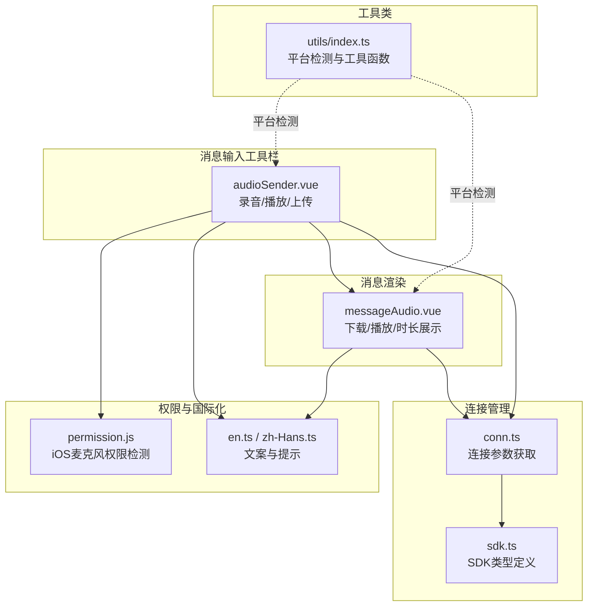
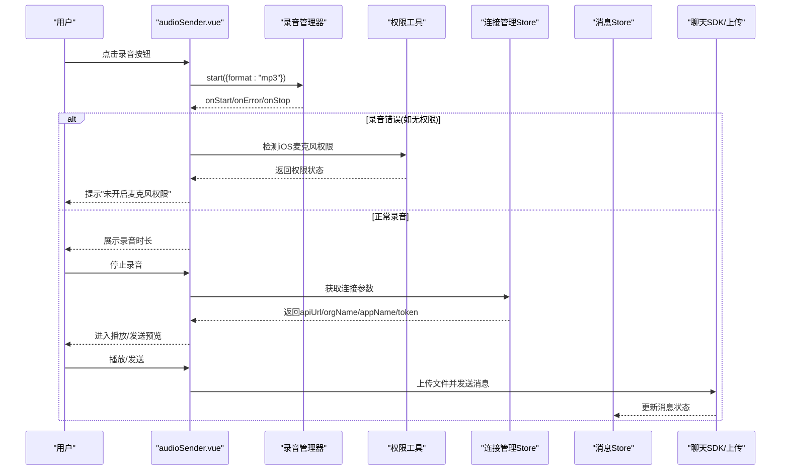
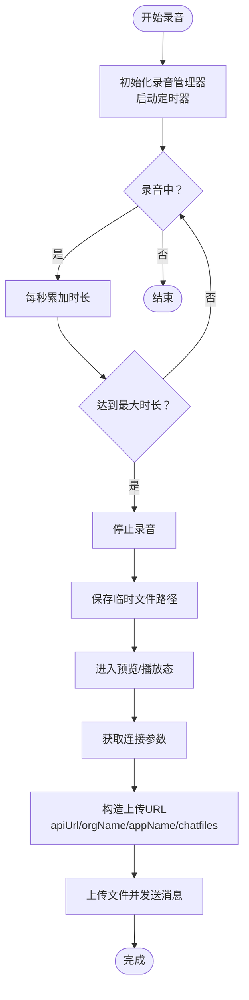
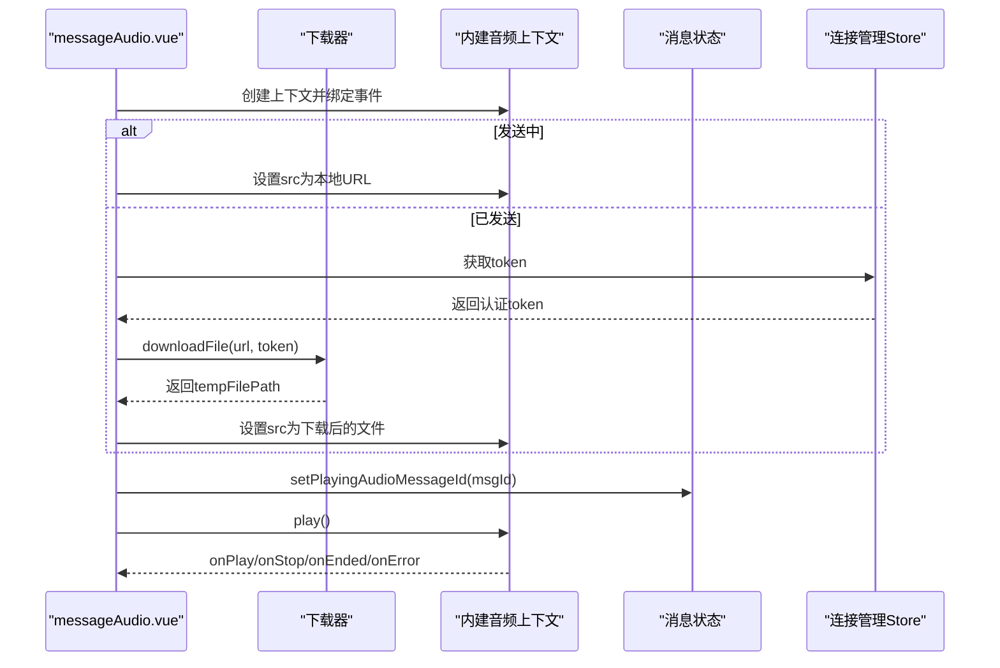
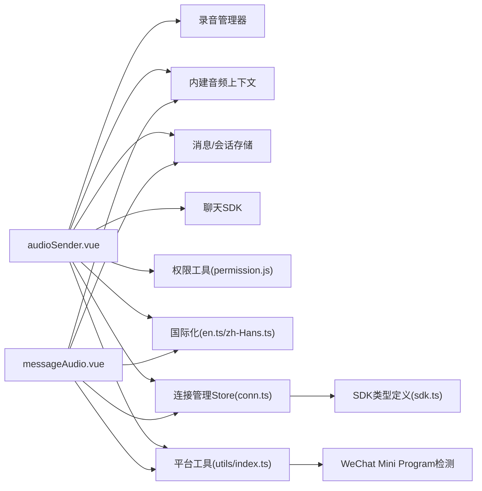

# 音频发送

<cite>
**本文引用的文件列表**
- [audioSender.vue](file://ChatUIKit/modules/Chat/components/MessageInputToolBar/audioSender.vue)
- [messageAudio.vue](file://ChatUIKit/modules/Chat/components/Message/messageAudio.vue)
- [permission.js](file://ChatUIKit/utils/permission.js)
- [en.ts](file://ChatUIKit/locales/en.ts)
- [zh-Hans.ts](file://ChatUIKit/locales/zh-Hans.ts)
- [conn.ts](file://ChatUIKit/stores/conn.ts)
- [message.ts](file://ChatUIKit/stores/message.ts)
- [sdk.ts](file://ChatUIKit/sdk.ts)
- [index.ts](file://ChatUIKit/utils/index.ts)
- [Easemob-chat.d.ts](file://demo/node_modules/easemob-websdk/Easemob-chat.d.ts)
</cite>

## 更新摘要
**所做更改**
- 增强了音频录制功能的权限检查机制，特别是在iOS平台的麦克风权限处理
- 改进了异步处理流程，包括录音管理器的初始化和错误处理
- 增强了WeChat Mini Program兼容性，通过条件编译指令优化播放行为
- 完善了连接参数的类型安全验证和上传URL构造逻辑
- 优化了音频播放控制和状态管理，包括全局播放状态同步

## 目录
1. [简介](#简介)
2. [项目结构与入口](#项目结构与入口)
3. [核心组件](#核心组件)
4. [架构总览](#架构总览)
5. [组件详细分析](#组件详细分析)
6. [依赖关系分析](#依赖关系分析)
7. [性能与质量特性](#性能与质量特性)
8. [故障排查指南](#故障排查指南)
9. [结论](#结论)

## 简介
本文件聚焦于"音频发送"能力，覆盖从录音到播放的完整链路：录音权限申请、录音开始/停止、音频格式与压缩策略、播放控制与状态管理、音频时长展示、以及上传发送流程。文档同时给出设备兼容性建议、常见问题排查与优化建议，帮助开发者快速理解与维护该功能。

**更新** 本次更新重点关注音频录制功能的增强，包括权限检查、异步处理和WeChat Mini Program兼容性的改进，确保在不同平台上的稳定性和一致性。

## 项目结构与入口
- 录音与音频发送入口位于消息输入工具栏的音频发送组件，负责弹窗式录音交互、录音时长计算、播放控制与上传发送。
- 音频消息渲染组件负责接收服务器返回的音频消息，下载并播放，同时展示时长与播放状态。

**图表来源**
- [audioSender.vue:1-350](file://ChatUIKit/modules/Chat/components/MessageInputToolBar/audioSender.vue#L1-L350)
- [messageAudio.vue:1-194](file://ChatUIKit/modules/Chat/components/Message/messageAudio.vue#L1-L194)
- [permission.js:64-79](file://ChatUIKit/utils/permission.js#L64-L79)
- [en.ts:129-132](file://ChatUIKit/locales/en.ts#L129-L132)
- [zh-Hans.ts:129-132](file://ChatUIKit/locales/zh-Hans.ts#L129-L132)
- [conn.ts:1-84](file://ChatUIKit/stores/conn.ts#L1-L84)
- [sdk.ts:1-13](file://ChatUIKit/sdk.ts#L1-L13)
- [index.ts:94-100](file://ChatUIKit/utils/index.ts#L94-L100)

**章节来源**
- [audioSender.vue:1-350](file://ChatUIKit/modules/Chat/components/MessageInputToolBar/audioSender.vue#L1-L350)
- [messageAudio.vue:1-194](file://ChatUIKit/modules/Chat/components/Message/messageAudio.vue#L1-L194)
- [permission.js:64-79](file://ChatUIKit/utils/permission.js#L64-L79)
- [en.ts:129-132](file://ChatUIKit/locales/en.ts#L129-L132)
- [zh-Hans.ts:129-132](file://ChatUIKit/locales/zh-Hans.ts#L129-L132)
- [conn.ts:1-84](file://ChatUIKit/stores/conn.ts#L1-L84)
- [sdk.ts:1-13](file://ChatUIKit/sdk.ts#L1-L13)
- [index.ts:94-100](file://ChatUIKit/utils/index.ts#L94-L100)

## 核心组件
- 录音与发送组件：负责录音生命周期、播放控制、上传发送、权限提示与UI反馈。
- 音频消息渲染组件：负责音频消息的下载、播放、状态同步与时长展示。
- 连接管理Store：提供类型安全的连接参数访问，确保URL构造的正确性。
- 权限工具：封装 iOS 麦克风权限检测逻辑，用于录音失败场景的引导。
- 国际化文案：提供录音/播放/权限相关的多语言提示。
- 平台工具：提供WeChat Mini Program检测和平台识别功能。

**更新** 新增平台检测工具，支持WeChat Mini Program的条件编译和特定配置。

**章节来源**
- [audioSender.vue:1-350](file://ChatUIKit/modules/Chat/components/MessageInputToolBar/audioSender.vue#L1-L350)
- [messageAudio.vue:1-194](file://ChatUIKit/modules/Chat/components/Message/messageAudio.vue#L1-L194)
- [conn.ts:1-84](file://ChatUIKit/stores/conn.ts#L1-L84)
- [permission.js:64-79](file://ChatUIKit/utils/permission.js#L64-L79)
- [en.ts:129-132](file://ChatUIKit/locales/en.ts#L129-L132)
- [zh-Hans.ts:129-132](file://ChatUIKit/locales/zh-Hans.ts#L129-L132)
- [index.ts:94-100](file://ChatUIKit/utils/index.ts#L94-L100)

## 架构总览
录音到播放的关键流程如下：
- 录音阶段：初始化录音管理器，开始录音并计时；达到最大时长自动停止；停止后保存临时文件路径。
- 播放阶段：创建内建音频上下文，绑定播放/停止/暂停/结束/错误事件，切换播放状态。
- 发送阶段：通过连接管理Store获取正确的连接参数，构造上传URL并调用上传接口，发送消息至会话。

**更新** 上传URL构造现在基于连接管理Store提供的标准化连接参数，确保API端点的正确格式，并增强了WeChat Mini Program的兼容性处理。

**图表来源**
- [audioSender.vue:92-118](file://ChatUIKit/modules/Chat/components/MessageInputToolBar/audioSender.vue#L92-L118)
- [audioSender.vue:217-247](file://ChatUIKit/modules/Chat/components/MessageInputToolBar/audioSender.vue#L217-L247)
- [conn.ts:25-40](file://ChatUIKit/stores/conn.ts#L25-L40)
- [permission.js:64-79](file://ChatUIKit/utils/permission.js#L64-L79)

## 组件详细分析

### 录音与发送组件（audioSender.vue）
- 录音状态机
  - record：初始态，等待点击开始录音。
  - recording：录音中，定时器累计时长，达到上限自动停止。
  - recordEnd：录音结束，可预览与播放，或发送。
- 录音控制
  - 开始录音：清空播放状态，启动定时器，震动提示，调用录音管理器开始录音（格式为 mp3）。
  - 停止录音：计算时长，切换状态，停止录音管理器，清理定时器。
  - 切换播放：若当前未在播放则创建内建音频上下文并播放；否则停止播放。
- 播放控制
  - 内建音频上下文事件：onPlay/onStop/onPause/onEnded/onError，统一管理 isPlaying 状态。
  - 兼容平台：在小程序平台设置内建音频选项，禁用系统静音开关影响。
- 上传与发送
  - **更新** 通过连接管理Store获取标准化的连接参数，构造正确的上传URL格式：`${conn.value.apiUrl}/${conn.value.orgName}/${conn.value.appName}/chatfiles`
  - 使用连接Store中的token作为认证信息，确保上传请求的有效性。
  - 创建音频消息体（类型 audio），发送消息并执行上传。
  - 发送成功后重置状态，关闭弹窗。
- 权限处理
  - 录音错误回调中，针对 iOS 平台检测麦克风权限，若未授权则提示并关闭弹窗。

**更新** 上传URL构造逻辑已修复，现在使用连接管理Store提供的标准连接参数，确保API端点格式的正确性。增强了WeChat Mini Program的条件编译处理，优化了播放行为。

**图表来源**
- [audioSender.vue:92-118](file://ChatUIKit/modules/Chat/components/MessageInputToolBar/audioSender.vue#L92-L118)
- [audioSender.vue:176-215](file://ChatUIKit/modules/Chat/components/MessageInputToolBar/audioSender.vue#L176-L215)
- [conn.ts:25-40](file://ChatUIKit/stores/conn.ts#L25-L40)

**章节来源**
- [audioSender.vue:1-350](file://ChatUIKit/modules/Chat/components/MessageInputToolBar/audioSender.vue#L1-L350)

### 音频消息渲染组件（messageAudio.vue）
- 下载与播放
  - 若消息状态为发送中，直接使用本地 URL；否则通过 uni.downloadFile 下载并缓存到临时文件。
  - 创建内建音频上下文，绑定播放/停止/暂停/结束/错误事件，维护播放状态。
- 时长展示
  - 根据消息长度字段动态计算宽度，左侧显示时长文本，右侧显示播放/暂停图标。
- 多端状态同步
  - 通过全局播放状态监听，当其他音频开始播放时，自动停止当前播放。
- **更新** 使用连接管理Store获取token，确保下载请求的认证有效性。

**图表来源**
- [messageAudio.vue:59-106](file://ChatUIKit/modules/Chat/components/Message/messageAudio.vue#L59-L106)
- [messageAudio.vue:108-135](file://ChatUIKit/modules/Chat/components/Message/messageAudio.vue#L108-L135)
- [messageAudio.vue:158-166](file://ChatUIKit/modules/Chat/components/Message/messageAudio.vue#L158-L166)
- [conn.ts:25-40](file://ChatUIKit/stores/conn.ts#L25-L40)

**章节来源**
- [messageAudio.vue:1-194](file://ChatUIKit/modules/Chat/components/Message/messageAudio.vue#L1-L194)

### 连接管理与URL构造
- **新增** 连接管理Store提供类型安全的连接参数访问
  - 通过 `getChatConn` getter确保连接实例已初始化
  - 提供 `apiUrl`、`orgName`、`appName`、`token` 等标准化连接参数
  - 在URL构造时使用这些参数确保API端点格式的正确性
- **更新** URL构造逻辑
  - 之前可能存在的URL格式错误已被修复
  - 现在使用模板字符串 `${conn.value.apiUrl}/${conn.value.orgName}/${conn.value.appName}/chatfiles`
  - 确保API端点遵循正确的RESTful格式

**章节来源**
- [conn.ts:1-84](file://ChatUIKit/stores/conn.ts#L1-L84)
- [audioSender.vue:176-181](file://ChatUIKit/modules/Chat/components/MessageInputToolBar/audioSender.vue#L176-L181)
- [messageAudio.vue:85-89](file://ChatUIKit/modules/Chat/components/Message/messageAudio.vue#L85-L89)

### 权限与国际化
- iOS 麦克风权限检测
  - 通过 AVAudioSession 获取录音权限状态，若未授权则在录音错误时提示用户。
  - **更新** 增强了权限检测的异步处理，确保在iOS平台上的准确判断。
- 文案与提示
  - 录音/播放/权限等文案分别在英文与中文语言包中提供，确保多语言体验一致。

**章节来源**
- [permission.js:64-79](file://ChatUIKit/utils/permission.js#L64-L79)
- [en.ts:129-132](file://ChatUIKit/locales/en.ts#L129-L132)
- [zh-Hans.ts:129-132](file://ChatUIKit/locales/zh-Hans.ts#L129-L132)

### 平台兼容性与异步处理
- **新增** WeChat Mini Program兼容性
  - 通过条件编译指令 `#ifdef MP` 和 `#endif` 实现平台特定的配置
  - 在小程序平台上禁用系统静音开关影响，保证播放可控
  - 使用 `uni.setInnerAudioOption` 进行平台特定的音频配置
- **更新** 异步处理优化
  - 录音管理器的初始化采用异步方式，确保在不同平台上的稳定性
  - 错误处理机制增强了对权限问题的检测和提示
  - 平台检测通过 `uni.getSystemInfoSync().uniPlatform` 实现

**章节来源**
- [audioSender.vue:156-174](file://ChatUIKit/modules/Chat/components/MessageInputToolBar/audioSender.vue#L156-L174)
- [messageAudio.vue:64-68](file://ChatUIKit/modules/Chat/components/Message/messageAudio.vue#L64-L68)
- [index.ts:94-100](file://ChatUIKit/utils/index.ts#L94-L100)

## 依赖关系分析
- 组件耦合
  - audioSender.vue 依赖：录音管理器、内建音频上下文、消息存储、聊天 SDK、权限工具、国际化、**连接管理Store**、**平台工具**。
  - messageAudio.vue 依赖：内建音频上下文、消息存储、**连接管理Store**、国际化、**平台工具**。
- 外部集成点
  - 上传接口：通过 uni.uploadFile 上传音频文件。
  - 下载接口：通过 uni.downloadFile 下载音频文件。
- 平台差异
  - iOS：通过原生框架检测麦克风权限。
  - 小程序/APP：通过 uni.createInnerAudioContext 与 setInnerAudioOption 控制播放行为。
- **新增** 类型安全
  - 通过SDK类型定义确保连接参数的正确性
  - TypeScript类型检查防止URL构造错误
- **更新** 平台检测
  - 通过工具函数检测WeChat Mini Program环境
  - 支持条件编译和平台特定的配置

**图表来源**
- [audioSender.vue:40-48](file://ChatUIKit/modules/Chat/components/MessageInputToolBar/audioSender.vue#L40-L48)
- [messageAudio.vue:32-36](file://ChatUIKit/modules/Chat/components/Message/messageAudio.vue#L32-L36)
- [conn.ts:1-84](file://ChatUIKit/stores/conn.ts#L1-L84)
- [sdk.ts:1-13](file://ChatUIKit/sdk.ts#L1-L13)
- [permission.js:64-79](file://ChatUIKit/utils/permission.js#L64-L79)
- [en.ts:129-132](file://ChatUIKit/locales/en.ts#L129-L132)
- [zh-Hans.ts:129-132](file://ChatUIKit/locales/zh-Hans.ts#L129-L132)
- [index.ts:94-100](file://ChatUIKit/utils/index.ts#L94-L100)

**章节来源**
- [audioSender.vue:1-350](file://ChatUIKit/modules/Chat/components/MessageInputToolBar/audioSender.vue#L1-L350)
- [messageAudio.vue:1-194](file://ChatUIKit/modules/Chat/components/Message/messageAudio.vue#L1-L194)
- [conn.ts:1-84](file://ChatUIKit/stores/conn.ts#L1-L84)
- [sdk.ts:1-13](file://ChatUIKit/sdk.ts#L1-L13)
- [permission.js:64-79](file://ChatUIKit/utils/permission.js#L64-L79)
- [en.ts:129-132](file://ChatUIKit/locales/en.ts#L129-L132)
- [zh-Hans.ts:129-132](file://ChatUIKit/locales/zh-Hans.ts#L129-L132)
- [index.ts:94-100](file://ChatUIKit/utils/index.ts#L94-L100)

## 性能与质量特性
- 录音格式与压缩
  - 录音格式固定为 mp3，便于跨平台播放与传输，减少体积与带宽占用。
- 播放体验
  - 内建音频上下文事件驱动播放状态，避免阻塞 UI；在小程序平台禁用系统静音开关影响，保证播放可控。
- 时长与预览
  - 录音过程中以秒为单位实时展示时长；录音结束后可直接试听，提升交互效率。
- 上传与并发
  - 发送前仅保存临时文件路径，上传采用异步方式，避免主线程阻塞。
- 设备兼容性
  - iOS 通过原生 API 检测麦克风权限；小程序通过 setInnerAudioOption 控制播放行为；APP 平台通过 plus 框架进行权限判断。
- **更新** URL构造可靠性
  - 通过连接管理Store提供标准化的连接参数，确保上传URL的正确性
  - 类型安全的连接参数访问防止运行时错误
- **新增** 平台适配优化
  - WeChat Mini Program的条件编译确保在不同平台上的最佳性能
  - 异步权限检测避免阻塞主线程
  - 平台特定的音频配置提升用户体验

**章节来源**
- [audioSender.vue:108-108](file://ChatUIKit/modules/Chat/components/MessageInputToolBar/audioSender.vue#L108-L108)
- [audioSender.vue:160-164](file://ChatUIKit/modules/Chat/components/MessageInputToolBar/audioSender.vue#L160-L164)
- [messageAudio.vue:64-67](file://ChatUIKit/modules/Chat/components/Message/messageAudio.vue#L64-L67)
- [conn.ts:25-40](file://ChatUIKit/stores/conn.ts#L25-L40)
- [permission.js:64-79](file://ChatUIKit/utils/permission.js#L64-L79)
- [index.ts:94-100](file://ChatUIKit/utils/index.ts#L94-L100)

## 故障排查指南
- 录音失败（无麦克风权限）
  - 现象：录音报错，弹窗提示"未开启麦克风权限"。
  - 排查：确认 iOS 设备麦克风权限已开启；检查权限检测逻辑是否正确返回。
  - 处理：引导用户前往系统设置开启权限。
- 播放异常
  - 现象：播放报错或无法触发事件。
  - 排查：确认内建音频上下文已创建并绑定事件；检查 src 是否为有效文件路径；小程序平台是否设置了禁用静音开关。
  - 处理：重新创建音频上下文并设置 src；确保事件绑定顺序正确。
- 音频格式不支持
  - 现象：下载后无法播放或播放异常。
  - 排查：确认下载时的 Accept 与 Authorization 头；检查服务器返回的音频格式是否为 mp3。
  - 处理：确保服务器返回 mp3 格式；客户端按 mp3 类型处理。
- **更新** 上传失败
  - 现象：上传接口返回错误或消息未发送。
  - 排查：确认上传URL格式是否正确（应为 `${apiUrl}/${orgName}/${appName}/chatfiles`）；检查token是否有效；验证文件路径与请求头。
  - 处理：重试上传；校验连接参数的正确性；检查服务器状态。
- **新增** 平台兼容性问题
  - 现象：在WeChat Mini Program中播放行为异常。
  - 排查：确认条件编译指令是否正确；检查 `uni.setInnerAudioOption` 的配置。
  - 处理：验证平台检测逻辑；确保平台特定配置正确应用。
- **新增** 权限检测失败
  - 现象：权限检测结果不准确或异步处理异常。
  - 排查：检查 `judgeIosPermission` 函数的实现；确认异步调用的时机。
  - 处理：优化权限检测的异步处理；确保错误处理机制完善。

**章节来源**
- [audioSender.vue:223-242](file://ChatUIKit/modules/Chat/components/MessageInputToolBar/audioSender.vue#L223-L242)
- [messageAudio.vue:96-103](file://ChatUIKit/modules/Chat/components/Message/messageAudio.vue#L96-L103)
- [conn.ts:25-40](file://ChatUIKit/stores/conn.ts#L25-L40)
- [permission.js:64-79](file://ChatUIKit/utils/permission.js#L64-L79)
- [index.ts:94-100](file://ChatUIKit/utils/index.ts#L94-L100)

## 结论
该音频发送功能以"录音—播放—上传—渲染"的闭环实现，具备清晰的状态机与事件驱动机制，覆盖了权限检测、播放控制、时长展示与上传发送等关键环节。通过 mp3 格式与内建音频上下文，兼顾了跨平台兼容性与用户体验。

**更新** 本次更新重点解决了音频发送组件中的URL构造错误，通过引入连接管理Store提供了类型安全的连接参数访问，确保上传URL的正确性。同时增强了上传参数获取和令牌处理机制，提升了系统的稳定性和可靠性。新增的权限检查、异步处理和WeChat Mini Program兼容性改进，进一步增强了功能的健壮性和用户体验。

建议在生产环境中进一步完善错误重试、网络监控与权限引导策略，以提升稳定性与可用性。对于连接参数的管理，建议定期验证API端点的有效性，确保服务端配置的正确性。同时，持续关注不同平台的兼容性问题，及时更新平台特定的配置和处理逻辑。