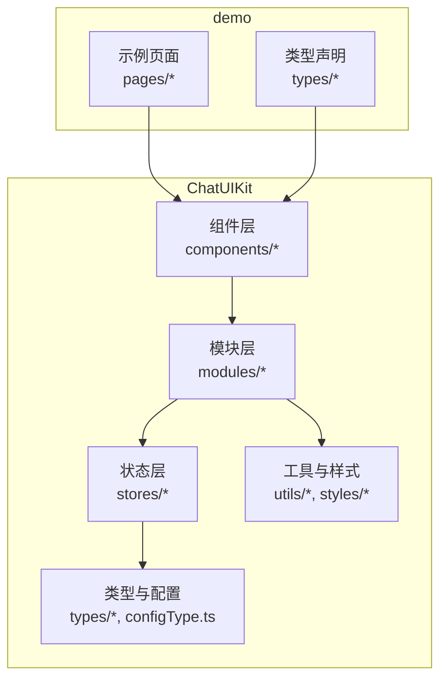
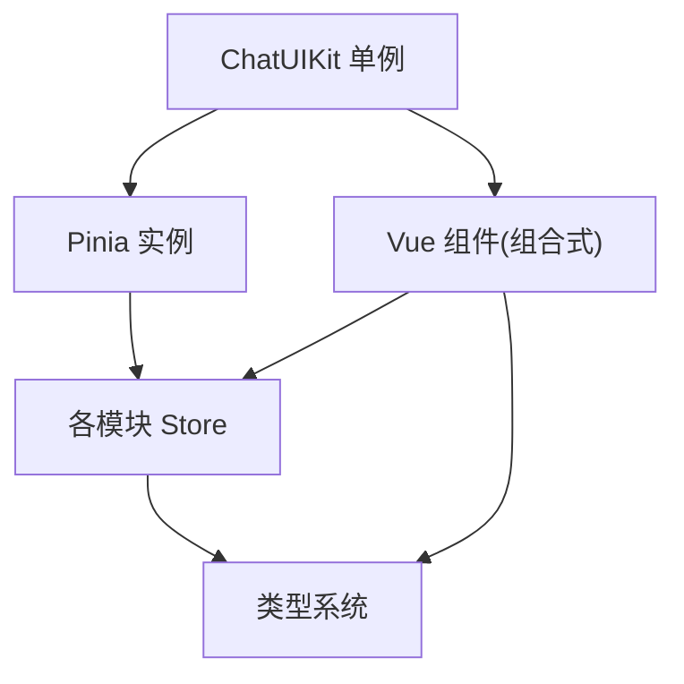
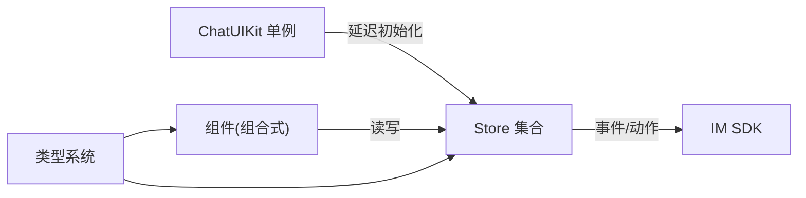

# 代码规范

<cite>
**本文引用的文件**
- [ChatUIKit/index.ts](file://ChatUIKit/index.ts)
- [ChatUIKit/types/index.ts](file://ChatUIKit/types/index.ts)
- [ChatUIKit/configType.ts](file://ChatUIKit/configType.ts)
- [ChatUIKit/stores/index.ts](file://ChatUIKit/stores/index.ts)
- [ChatUIKit/stores/chat.ts](file://ChatUIKit/stores/chat.ts)
- [ChatUIKit/components/Button/index.vue](file://ChatUIKit/components/Button/index.vue)
- [ChatUIKit/modules/Chat/index.vue](file://ChatUIKit/modules/Chat/index.vue)
- [ChatUIKit/utils/index.ts](file://ChatUIKit/utils/index.ts)
- [ChatUIKit/styles/common.scss](file://ChatUIKit/styles/common.scss)
- [ChatUIKit/modules/Chat/style.scss](file://ChatUIKit/modules/Chat/style.scss)
- [demo/types/uni-app.d.ts](file://demo/types/uni-app.d.ts)
- [README.md](file://README.md)
</cite>

## 目录
1. [引言](#引言)
2. [项目结构](#项目结构)
3. [核心组件](#核心组件)
4. [架构总览](#架构总览)
5. [详细组件分析](#详细组件分析)
6. [依赖关系分析](#依赖关系分析)
7. [性能考虑](#性能考虑)
8. [故障排查指南](#故障排查指南)
9. [结论](#结论)
10. [附录](#附录)

## 引言
本文件旨在建立一套统一、可执行且可持续演进的代码规范，覆盖 TypeScript 编码规范、Vue 3 组件开发规范、文件与目录命名约定、模块导入导出规则、代码注释与 JSDoc 文档格式、SCSS 样式编写与组织原则、Git 提交信息与分支命名规范、代码审查流程以及代码质量检查工具配置与自动化流程。该规范以仓库现有实现为依据，结合最佳实践，确保团队协作一致性与长期可维护性。

## 项目结构
本项目采用按功能域划分的模块化组织方式，核心模块包括：
- ChatUIKit：组件库与业务逻辑主体
- demo：示例工程与演示页面
- 根目录：通用配置与说明文档

图表来源
- [ChatUIKit/index.ts](file://ChatUIKit/index.ts#L1-L139)
- [ChatUIKit/stores/index.ts](file://ChatUIKit/stores/index.ts#L1-L31)
- [ChatUIKit/modules/Chat/index.vue](file://ChatUIKit/modules/Chat/index.vue#L1-L255)

章节来源
- [ChatUIKit/index.ts](file://ChatUIKit/index.ts#L1-L139)
- [ChatUIKit/stores/index.ts](file://ChatUIKit/stores/index.ts#L1-L31)
- [ChatUIKit/modules/Chat/index.vue](file://ChatUIKit/modules/Chat/index.vue#L1-L255)

## 核心组件
- ChatUIKit 单例：负责全局 Pinia 实例管理、模块初始化、连接与主题配置注入、生命周期桥接（如 onShow）。
- Store 入口：集中导出各模块 Store，并提供创建与兼容函数。
- 类型系统：统一定义消息体、会话、连接状态、特性开关、主题配置等类型。
- 工具集：时间格式化、节流、深拷贝、排序、文本渲染、分块、消息摘要、字符分类与分组等。

章节来源
- [ChatUIKit/index.ts](file://ChatUIKit/index.ts#L1-L139)
- [ChatUIKit/stores/index.ts](file://ChatUIKit/stores/index.ts#L1-L31)
- [ChatUIKit/types/index.ts](file://ChatUIKit/types/index.ts#L1-L100)
- [ChatUIKit/configType.ts](file://ChatUIKit/configType.ts#L1-L68)
- [ChatUIKit/utils/index.ts](file://ChatUIKit/utils/index.ts#L1-L344)

## 架构总览
整体采用“单例入口 + Pinia 状态管理 + 组合式 API 组件”的架构。单例负责初始化与生命周期桥接；Store 负责状态与副作用；组件通过组合式 API 访问 Store 并渲染视图；类型系统贯穿于 TS 定义与运行时校验之间。

图表来源
- [ChatUIKit/index.ts](file://ChatUIKit/index.ts#L1-L139)
- [ChatUIKit/stores/index.ts](file://ChatUIKit/stores/index.ts#L1-L31)
- [ChatUIKit/types/index.ts](file://ChatUIKit/types/index.ts#L1-L100)

## 详细组件分析

### TypeScript 编码规范
- 接口与类型声明
  - 使用 type 定义字面量联合与复合类型，使用 interface 定义结构化契约，避免重复定义。
  - 对外暴露的类型通过 export 导出，内部类型尽量局部化。
  - 示例参考：消息状态、连接状态、通知类型、用户信息扩展等。
- 泛型使用
  - 在工具函数中广泛使用泛型以保证类型安全与复用性（如深拷贝）。
  - 避免 any，优先使用 unknown 或具体类型。
- 类型约束与推断
  - 利用 Pick、Partial、Record 等工具类型精简接口定义。
  - 对 SDK 返回体进行扩展与约束，确保运行时字段安全。

章节来源
- [ChatUIKit/types/index.ts](file://ChatUIKit/types/index.ts#L1-L100)
- [ChatUIKit/configType.ts](file://ChatUIKit/configType.ts#L1-L68)
- [ChatUIKit/utils/index.ts](file://ChatUIKit/utils/index.ts#L136-L183)

### Vue 3 组件开发规范
- 组合式 API 使用
  - 使用 <script setup> 与 ref/computed/watch/onMounted/onUnmounted 等 API，保持逻辑内聚。
  - 通过 provide/inject 传递上下文（如 InputToolbarEvent），降低跨层级耦合。
- 响应式数据定义
  - 明确 ref 与 computed 的边界：简单状态用 ref，派生状态用 computed。
  - 对复杂对象使用 shallowRef 或自定义浅层响应式包装，减少不必要的深度追踪。
- 生命周期钩子
  - 在 onMounted 中初始化与订阅，在 onUnmounted 中清理资源与解绑事件。
  - 在 onLoad/onUnload 中处理平台级生命周期（如键盘高度监听）。
- 组件通信
  - 子传父使用事件发射；兄弟/跨层使用 provide/inject 或 Pinia Store。
- 事件处理
  - 避免在模板中直接调用复杂逻辑，通过中间方法封装。

章节来源
- [ChatUIKit/modules/Chat/index.vue](file://ChatUIKit/modules/Chat/index.vue#L74-L250)
- [ChatUIKit/components/Button/index.vue](file://ChatUIKit/components/Button/index.vue#L7-L13)

### 文件命名约定与目录结构
- 目录命名
  - 功能域目录采用名词短语（如 modules/Chat、components/Button）。
  - 工具与样式目录采用 utils、styles。
- 文件命名
  - 组件文件统一使用 index.vue（便于 import 时省略路径）。
  - 类型文件使用 .ts，样式文件使用 .scss。
  - 常量与配置文件使用小写命名（如 const/index.ts）。
- 导入导出
  - Store 入口集中导出，便于统一管理与按需引入。
  - 类型导出遵循最小暴露原则，仅导出必要类型。

章节来源
- [ChatUIKit/stores/index.ts](file://ChatUIKit/stores/index.ts#L1-L31)
- [ChatUIKit/modules/Chat/index.vue](file://ChatUIKit/modules/Chat/index.vue#L1-L255)
- [ChatUIKit/components/Button/index.vue](file://ChatUIKit/components/Button/index.vue#L1-L36)

### 模块导入导出规则
- 统一从 stores 入口导入 Store，避免分散引用。
- 类型与常量从 types/const 目录显式导入，避免隐式依赖。
- 在组件中优先使用组合式 API 访问 Store，避免直接操作 DOM 或全局状态。

章节来源
- [ChatUIKit/stores/index.ts](file://ChatUIKit/stores/index.ts#L8-L16)
- [ChatUIKit/modules/Chat/index.vue](file://ChatUIKit/modules/Chat/index.vue#L84-L95)

### 代码注释标准与 JSDoc 文档格式
- 函数注释
  - 使用 JSDoc 注释公共 API，描述参数、返回值与异常场景。
  - 对 Store 的 actions/getters 添加简要说明，便于 IDE 提示与文档生成。
- 类型注释
  - 对复杂类型别名与接口添加注释，说明用途与取值范围。
- 组件注释
  - 对组件 props、emits、provide/inject 的作用域与生命周期进行说明。
- 常量与配置
  - 对 FeatureConfig/ThemeConfig 字段逐项说明含义与默认值。

章节来源
- [ChatUIKit/stores/chat.ts](file://ChatUIKit/stores/chat.ts#L1-L407)
- [ChatUIKit/types/index.ts](file://ChatUIKit/types/index.ts#L1-L100)
- [ChatUIKit/configType.ts](file://ChatUIKit/configType.ts#L1-L68)

### SCSS 样式编写规范与组织原则
- 命名规范
  - 使用 BEM 或扁平化命名，避免深层嵌套选择器。
  - 通用样式抽离至 common.scss，模块样式独立维护。
- 组织原则
  - 模块样式集中于模块目录下的 style.scss，主样式文件通过 @import 引入。
  - 使用 scoped 作用域隔离组件样式，避免全局污染。
- 设计原则
  - 使用变量与混入统一颜色、字体与间距，提升一致性。
  - 针对平台差异（如安全区域）使用 env(safe-area-inset-*) 兼容处理。

章节来源
- [ChatUIKit/styles/common.scss](file://ChatUIKit/styles/common.scss#L1-L18)
- [ChatUIKit/modules/Chat/style.scss](file://ChatUIKit/modules/Chat/style.scss#L1-L33)
- [ChatUIKit/modules/Chat/index.vue](file://ChatUIKit/modules/Chat/index.vue#L252-L254)

### Git 提交信息格式、分支命名规范与代码审查流程
- 提交信息格式
  - 类型: 简要描述（不超过 50 字）
  - 正文: 说明动机与影响，必要时附带变更摘要
  - 例如：feat(chat): 新增消息置顶能力；fix(store): 修复 onShow 生命周期未初始化连接问题
- 分支命名规范
  - feat/xxx：新功能
  - fix/xxx：缺陷修复
  - refactor/xxx：重构
  - docs/xxx：文档更新
  - chore/xxx：构建或工具链调整
- 代码审查流程
  - 提交前执行本地检查（格式化、类型检查、单元测试）
  - 提交 PR 时附带变更说明与截图/录屏（UI 变更）
  - 至少一名同行评审通过后方可合并

[本节为通用规范建议，不直接分析具体文件，故无章节来源]

### 代码质量检查工具配置与自动化流程
- 类型检查
  - 使用 TypeScript 编译器进行严格类型检查，确保类型安全。
- 代码格式化
  - 使用 Prettier 统一格式风格，结合 ESLint 规则进行静态检查。
- 提交前钩子
  - 使用 Husky + lint-staged 在提交前自动运行格式化与检查任务。
- 持续集成
  - CI 中执行类型检查、单元测试与覆盖率统计，失败时阻断合并。

[本节为通用规范建议，不直接分析具体文件，故无章节来源]

## 依赖关系分析
- 单例对 Store 的延迟初始化与 getter 包装，确保在任意时机访问 Store 均可正常工作。
- 组件通过组合式 API 访问 Store，Store 再协调其他 Store 与 SDK 事件。
- 类型系统贯穿于组件、Store 与工具函数之间，形成强类型闭环。

图表来源
- [ChatUIKit/index.ts](file://ChatUIKit/index.ts#L30-L78)
- [ChatUIKit/stores/chat.ts](file://ChatUIKit/stores/chat.ts#L29-L397)
- [ChatUIKit/types/index.ts](file://ChatUIKit/types/index.ts#L1-L100)

章节来源
- [ChatUIKit/index.ts](file://ChatUIKit/index.ts#L1-L139)
- [ChatUIKit/stores/chat.ts](file://ChatUIKit/stores/chat.ts#L1-L407)

## 性能考虑
- 响应式粒度控制
  - 将大对象拆分为多个 ref/computed，避免不必要的响应式追踪。
- 事件与订阅
  - 在 onMounted 中订阅事件，在 onUnmounted 中解绑，防止内存泄漏。
- 渲染优化
  - 使用 computed 缓存派生结果，避免重复计算。
- 工具函数
  - 深拷贝与排序等高成本操作尽量缓存结果或限制触发频率。

[本节提供一般性指导，不直接分析具体文件，故无章节来源]

## 故障排查指南
- 连接状态异常
  - 检查 ChatStore 的连接事件处理与状态切换逻辑。
  - 在 onShow 生命周期中调用连接实例的 onShow 方法进行有效性检测。
- 消息未显示或状态异常
  - 核对消息 Store 的接收处理与状态更新逻辑。
  - 检查消息类型摘要与渲染逻辑。
- 组件未释放
  - 确认在 onUnmounted 中清理引用、取消订阅与恢复状态。

章节来源
- [ChatUIKit/stores/chat.ts](file://ChatUIKit/stores/chat.ts#L366-L371)
- [ChatUIKit/stores/chat.ts](file://ChatUIKit/stores/chat.ts#L120-L130)
- [ChatUIKit/modules/Chat/index.vue](file://ChatUIKit/modules/Chat/index.vue#L221-L227)

## 结论
本规范以现有代码库为基础，总结了 TypeScript、Vue 3、样式与工程化方面的最佳实践。建议在团队内推广并持续演进，结合工具链实现自动化与可视化文档，确保长期一致性与可维护性。

## 附录
- 全局类型声明
  - 在 demo/types/uni-app.d.ts 中为全局 Uni 对象扩展 $UIKIT 属性，便于在页面中访问 ChatUIKit 单例。

章节来源
- [demo/types/uni-app.d.ts](file://demo/types/uni-app.d.ts#L1-L7)