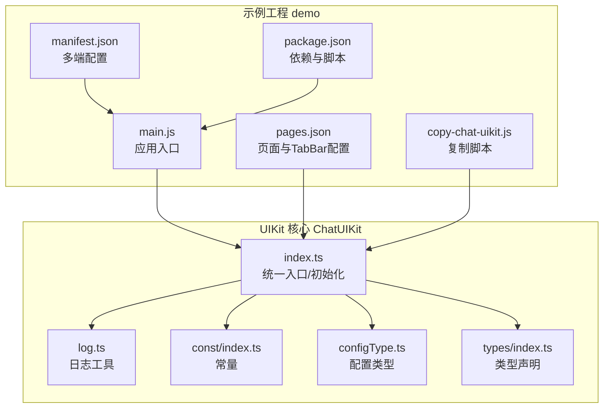
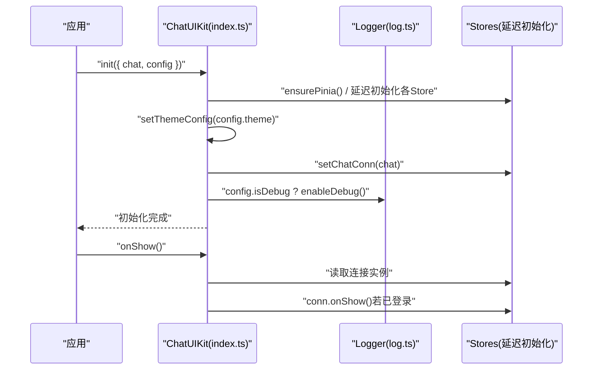
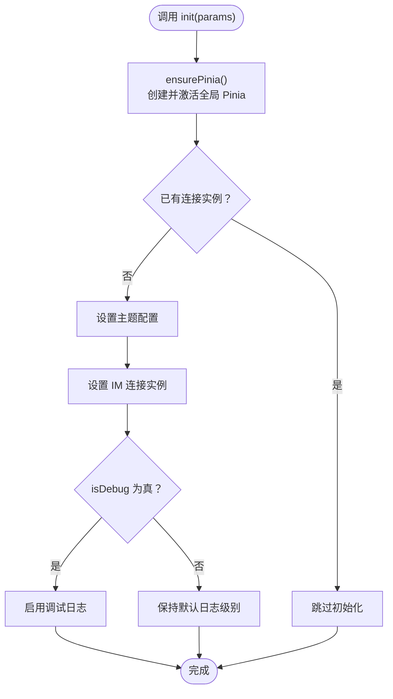
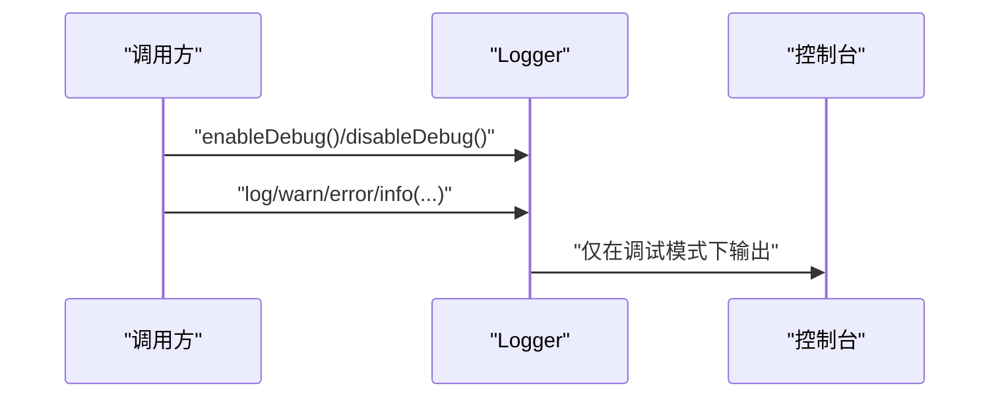
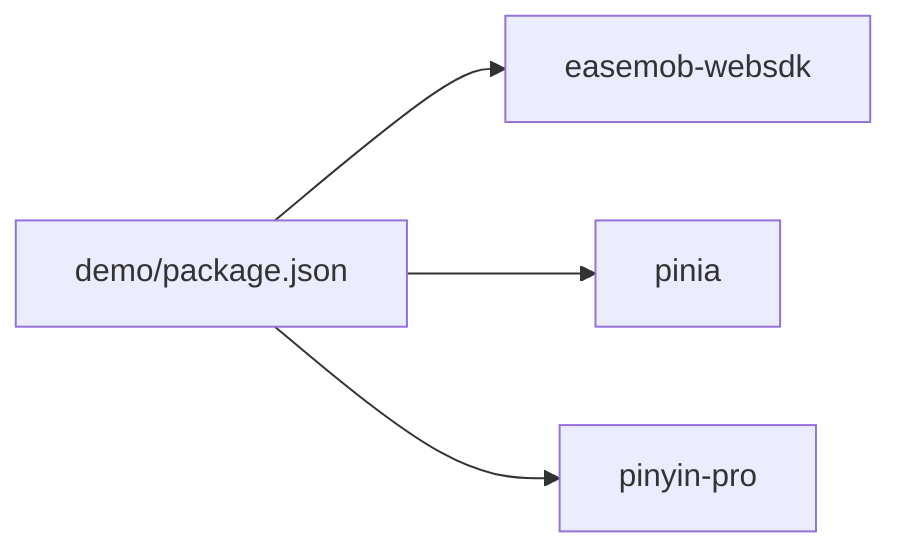

# 开发指南

<cite>
**本文引用的文件**
- [README.md](file://README.md)
- [ChatUIKit/README.md](file://ChatUIKit/README.md)
- [demo/README.md](file://demo/README.md)
- [ChatUIKit/index.ts](file://ChatUIKit/index.ts)
- [ChatUIKit/log.ts](file://ChatUIKit/log.ts)
- [ChatUIKit/const/index.ts](file://ChatUIKit/const/index.ts)
- [ChatUIKit/configType.ts](file://ChatUIKit/configType.ts)
- [ChatUIKit/types/index.ts](file://ChatUIKit/types/index.ts)
- [demo/copy-chat-uikit.js](file://demo/copy-chat-uikit.js)
- [demo/manifest.json](file://demo/manifest.json)
- [demo/pages.json](file://demo/pages.json)
- [demo/main.js](file://demo/main.js)
- [demo/package.json](file://demo/package.json)
</cite>

## 目录
1. [简介](#简介)
2. [项目结构](#项目结构)
3. [核心组件](#核心组件)
4. [架构总览](#架构总览)
5. [详细组件分析](#详细组件分析)
6. [依赖分析](#依赖分析)
7. [性能考虑](#性能考虑)
8. [故障排查指南](#故障排查指南)
9. [结论](#结论)
10. [附录](#附录)

## 简介
本指南面向使用 Easemob UIKit for Uniapp（Vue3）的开发者，提供从环境搭建、代码规范、调试技巧到测试与性能监控、版本管理与发布流程的完整开发实践。项目采用 uni-app + Vue3 + Pinia 架构，提供聊天、会话、联系人、群组等即时通讯 UI 能力，并通过统一入口初始化与配置对外暴露能力。

## 项目结构
- 根仓库包含 UIKit 源码与示例 demo 两大部分：
  - ChatUIKit：核心 UI 组件库，包含资源、通用组件、常量、国际化、模块化页面、状态管理、样式、类型与工具等。
  - demo：示例工程，演示如何集成 UIKit 并运行，包含页面路由、运行配置、HBuilderX 启动脚本等。
- 关键文件职责概览：
  - ChatUIKit/index.ts：统一入口与初始化，集中管理 Pinia、各 Store 访问器与生命周期钩子。
  - ChatUIKit/log.ts：统一日志工具，支持按需开启调试模式。
  - ChatUIKit/const/index.ts：常量定义（如资源地址、最大消息数、群成员分页大小等）。
  - ChatUIKit/configType.ts：配置类型定义（功能开关、主题配置、初始化参数）。
  - ChatUIKit/types/index.ts：类型声明（消息、会话、联系人、Presence 等）。
  - demo/main.js：Vue3 应用入口，注入 ChatUIKit 提供的 Pinia 实例。
  - demo/pages.json：页面与 TabBar 路由配置。
  - demo/manifest.json：多端打包与运行配置（H5、小程序、App Plus 等）。
  - demo/copy-chat-uikit.js：将根目录 ChatUIKit 复制到 demo 的自动化脚本。
  - demo/package.json：示例工程依赖与脚本。

图表来源
- [demo/main.js](file://demo/main.js#L1-L28)
- [demo/pages.json](file://demo/pages.json#L1-L200)
- [demo/manifest.json](file://demo/manifest.json#L1-L134)
- [demo/copy-chat-uikit.js](file://demo/copy-chat-uikit.js#L1-L71)
- [demo/package.json](file://demo/package.json#L1-L18)
- [ChatUIKit/index.ts](file://ChatUIKit/index.ts#L1-L139)
- [ChatUIKit/log.ts](file://ChatUIKit/log.ts#L1-L78)
- [ChatUIKit/const/index.ts](file://ChatUIKit/const/index.ts#L1-L37)
- [ChatUIKit/configType.ts](file://ChatUIKit/configType.ts#L1-L68)
- [ChatUIKit/types/index.ts](file://ChatUIKit/types/index.ts#L1-L100)

章节来源
- [README.md](file://README.md#L1-L63)
- [ChatUIKit/README.md](file://ChatUIKit/README.md#L1-L63)
- [demo/README.md](file://demo/README.md#L1-L125)

## 核心组件
- ChatUIKit 统一入口与初始化
  - 提供延迟初始化的 Store 访问器（conn、chat、appUser、conv、contact、group、message、config）。
  - 初始化时设置主题、连接实例、调试开关，并标记初始化状态。
  - 提供 onShow 生命周期钩子，检测 IM 连接有效性。
  - 暴露 getPinia 以确保应用内全局 Pinia 一致性。
- 日志系统
  - 单例 Logger，支持启用/禁用调试模式，提供 log/warn/error/info 等接口。
- 配置与类型
  - FeatureConfig/ThemeConfig 定义功能开关与主题选项。
  - ChatUIKitInitParams 定义初始化参数结构。
  - types/index.ts 定义消息、会话、联系人、Presence 等类型别名与扩展。

章节来源
- [ChatUIKit/index.ts](file://ChatUIKit/index.ts#L1-L139)
- [ChatUIKit/log.ts](file://ChatUIKit/log.ts#L1-L78)
- [ChatUIKit/configType.ts](file://ChatUIKit/configType.ts#L1-L68)
- [ChatUIKit/types/index.ts](file://ChatUIKit/types/index.ts#L1-L100)

## 架构总览
- 初始化流程
  - 应用启动时，通过 ChatUIKit.init 注入 IM 连接与配置，启用调试日志（可选）。
  - onShow 生命周期中对连接进行有效性检测。
- 数据流
  - 各模块通过 Pinia Store 管理状态，入口统一导出 getPinia，保证全局一致性。
- 多端适配
  - manifest.json 配置 H5、小程序、App Plus 等平台特性；pages.json 定义页面与 TabBar。

图表来源
- [ChatUIKit/index.ts](file://ChatUIKit/index.ts#L84-L125)
- [ChatUIKit/log.ts](file://ChatUIKit/log.ts#L18-L30)

章节来源
- [ChatUIKit/index.ts](file://ChatUIKit/index.ts#L1-L139)
- [ChatUIKit/log.ts](file://ChatUIKit/log.ts#L1-L78)

## 详细组件分析

### 组件 A：ChatUIKit 统一入口与初始化
- 设计要点
  - 使用延迟初始化避免构造阶段访问 Store。
  - 通过单例 Pinia 确保全局状态一致。
  - 提供 onShow 生命周期钩子，保障连接有效性。
- 关键流程图（初始化）

图表来源
- [ChatUIKit/index.ts](file://ChatUIKit/index.ts#L84-L96)
- [ChatUIKit/log.ts](file://ChatUIKit/log.ts#L18-L30)

章节来源
- [ChatUIKit/index.ts](file://ChatUIKit/index.ts#L1-L139)

### 组件 B：日志系统 Logger
- 设计要点
  - 单例模式，全局唯一实例。
  - 调试模式下输出统一前缀的日志，便于过滤与定位。
- 日志序列图

图表来源
- [ChatUIKit/log.ts](file://ChatUIKit/log.ts#L18-L74)

章节来源
- [ChatUIKit/log.ts](file://ChatUIKit/log.ts#L1-L78)

### 组件 C：配置与类型体系
- 配置类型
  - FeatureConfig：功能开关集合（如免打扰、置顶、复制/删除/撤回/编辑消息、表情/图片/语音/视频/文件、Mention、名片、Presence 等）。
  - ThemeConfig：主题配置（如头像形状）。
  - ChatUIKitInitParams：初始化参数（IM 连接实例、配置与调试开关）。
- 类型体系
  - 定义消息状态、会话基础信息、联系人/群组通知、混合消息体、AT 类型、Presence 信息、用户信息扩展等类型别名。

章节来源
- [ChatUIKit/configType.ts](file://ChatUIKit/configType.ts#L1-L68)
- [ChatUIKit/types/index.ts](file://ChatUIKit/types/index.ts#L1-L100)

### 组件 D：示例工程集成与运行
- 页面与路由
  - pages.json 定义页面列表与 TabBar，部分页面使用自定义导航样式与平台特定配置。
- 多端配置
  - manifest.json 配置 App Plus 权限、H5 开发服务器端口与路由模式、小程序平台特性等。
- 入口与状态
  - main.js 在 Vue3 下通过 ChatUIKit.getPinia 注入全局 Pinia 实例，确保与 UIKit 内部状态一致。
- 自动化脚本
  - copy-chat-uikit.js 将根目录 ChatUIKit 复制到 demo，覆盖式更新，注意备份 demo 中的自定义修改。

章节来源
- [demo/pages.json](file://demo/pages.json#L1-L200)
- [demo/manifest.json](file://demo/manifest.json#L1-L134)
- [demo/main.js](file://demo/main.js#L1-L28)
- [demo/copy-chat-uikit.js](file://demo/copy-chat-uikit.js#L1-L71)
- [demo/package.json](file://demo/package.json#L1-L18)

## 依赖分析
- 示例工程依赖
  - easemob-websdk：即时通讯 SDK。
  - pinia：状态管理。
  - pinyin-pro：拼音工具（用于索引与搜索）。
- 依赖关系示意

图表来源
- [demo/package.json](file://demo/package.json#L12-L16)

章节来源
- [demo/package.json](file://demo/package.json#L1-L18)

## 性能考虑
- 资源加载
  - 建议将 UIKit 静态资源迁移至自有服务器，减少第三方访问限制带来的性能波动。
- 分页与缓存
  - 群组成员分页大小与会话消息上限已在常量中定义，合理利用可降低内存占用与渲染压力。
- 调试日志
  - 仅在开发阶段启用调试日志，避免生产环境产生过多 IO 与性能损耗。
- 多端优化
  - H5 开发服务器端口与路由模式、App Plus 的权限与编译配置需结合实际业务进行裁剪与优化。

章节来源
- [ChatUIKit/const/index.ts](file://ChatUIKit/const/index.ts#L1-L37)
- [ChatUIKit/log.ts](file://ChatUIKit/log.ts#L18-L30)
- [demo/manifest.json](file://demo/manifest.json#L112-L131)

## 故障排查指南
- 初始化失败或连接异常
  - 确认 ChatUIKit.init 已传入有效的 IM 连接实例与配置。
  - 在初始化时开启调试日志，观察控制台输出。
- 页面跳转差异
  - UIKit 默认使用 uni.redirectTo；示例 demo 使用 uni.switchTab（因 TabBar 结构）。复制源码后需根据项目架构调整跳转方式。
- 资源加载失败
  - 若使用默认资源地址导致访问受限，建议迁移资源至自有服务器并更新常量中的资源地址。
- 自动化脚本覆盖风险
  - 使用 copy:uikit 脚本会覆盖 demo/ChatUIKit，若存在自定义修改请提前备份。

章节来源
- [ChatUIKit/index.ts](file://ChatUIKit/index.ts#L84-L125)
- [demo/README.md](file://demo/README.md#L46-L73)
- [ChatUIKit/const/index.ts](file://ChatUIKit/const/index.ts#L7-L8)
- [demo/copy-chat-uikit.js](file://demo/copy-chat-uikit.js#L68-L71)

## 结论
本指南围绕 Easemob UIKit for Uniapp 的开发流程、架构设计与最佳实践提供了系统性的说明。通过统一入口初始化、集中日志管理、清晰的配置与类型体系，以及示例工程的多端适配与自动化脚本，开发者可以高效地集成与扩展即时通讯 UI 能力。建议在开发过程中遵循本文的规范与流程，结合实际业务场景进行定制与优化。

## 附录

### A. 开发环境搭建与 IDE 设置
- 环境要求
  - Node.js 与 npm/yarn。
  - HBuilderX（推荐）或 VS Code（配合 uni-app 插件）。
- 步骤
  - 克隆仓库并在 demo 目录安装依赖。
  - 通过 HBuilderX 打开 demo 工程，按需选择运行平台（浏览器/H5、微信小程序、App Plus 等）。
  - 在示例工程中配置 AppKey、REST API 地址与 WebSocket 地址。

章节来源
- [demo/README.md](file://demo/README.md#L21-L105)
- [demo/package.json](file://demo/package.json#L1-L18)

### B. 代码规范与命名约定
- 目录与文件命名
  - 组件采用 PascalCase（如 Chat、ContactList），模块目录语义化（如 modules/Chat）。
  - 类型文件使用 index.ts，常量与配置文件使用对应名称（如 const/index.ts）。
- 命名约定
  - Store 访问器使用 useXxxStore 形式，入口类使用 ChatKIT。
  - 配置项与常量使用 UPPER_SNAKE_CASE，类型使用大写开头。
- 注释规范
  - 对外公开的类与方法提供简明注释，说明用途、参数与返回值。
  - 日志输出统一前缀，便于过滤与定位问题。

章节来源
- [ChatUIKit/index.ts](file://ChatUIKit/index.ts#L1-L139)
- [ChatUIKit/log.ts](file://ChatUIKit/log.ts#L1-L78)
- [ChatUIKit/configType.ts](file://ChatUIKit/configType.ts#L1-L68)

### C. 调试技巧
- 启用调试日志
  - 在初始化时将 isDebug 设为 true，即可输出统一格式的日志。
- 生命周期钩子
  - 在应用 onShow 时调用 ChatUIKit.onShow，检测连接有效性。
- 多端调试
  - H5 可通过本地开发服务器调试；小程序与 App Plus 使用对应平台的调试工具。

章节来源
- [ChatUIKit/index.ts](file://ChatUIKit/index.ts#L114-L125)
- [ChatUIKit/log.ts](file://ChatUIKit/log.ts#L18-L30)
- [demo/manifest.json](file://demo/manifest.json#L122-L127)

### D. 测试策略
- 单元测试
  - 针对工具函数与纯逻辑模块（如类型转换、工具方法）编写单元测试，使用合适的测试框架。
- 集成测试
  - 在示例工程中模拟 IM 连接与消息收发，验证模块间协作。
- 端到端测试
  - 使用 HBuilderX 或平台自带的真机调试能力，覆盖多端交互流程。

（本节为通用指导，不直接分析具体文件）

### E. 性能监控、错误追踪与日志记录
- 性能监控
  - 关注页面渲染与消息列表滚动性能，必要时引入虚拟列表与懒加载。
- 错误追踪
  - 使用统一日志工具输出错误信息，结合调试模式定位问题。
- 日志记录
  - 生产环境默认关闭调试日志，仅在开发与问题排查阶段开启。

章节来源
- [ChatUIKit/log.ts](file://ChatUIKit/log.ts#L18-L30)

### F. 版本管理、分支策略与发布流程
- 版本管理
  - 使用语义化版本号，变更记录于 CHANGELOG。
- 分支策略
  - 主分支用于稳定版本，功能开发在特性分支进行，合并前进行代码审查。
- 发布流程
  - 在 demo 工程中完成多端验证后，导出对应平台包并发布。

（本节为通用指导，不直接分析具体文件）

### G. 常见问题与解决方案
- 依赖冲突
  - 确保 easemob-websdk 与项目现有依赖兼容；如遇冲突，优先升级到官方推荐版本。
- 兼容性问题
  - 针对不同平台（H5、小程序、App Plus）的差异，使用条件编译与平台特定配置。
- 页面跳转不生效
  - 检查是否使用了正确的跳转方法（TabBar 使用 uni.switchTab，内部页面跳转使用 uni.redirectTo/navigateTo）。

章节来源
- [demo/README.md](file://demo/README.md#L46-L53)
- [demo/pages.json](file://demo/pages.json#L167-L192)

### H. 贡献指南与社区参与
- 贡献方式
  - 提交 Issue 描述问题与复现步骤；提交 Pull Request 前先阅读代码规范与测试要求。
- 社区资源
  - 参考官方文档与示例工程，获取集成与使用指南。

章节来源
- [README.md](file://README.md#L60-L63)
- [ChatUIKit/README.md](file://ChatUIKit/README.md#L52-L63)
- [demo/README.md](file://demo/README.md#L113-L125)