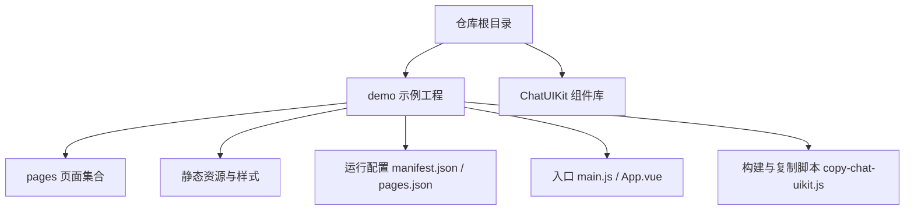
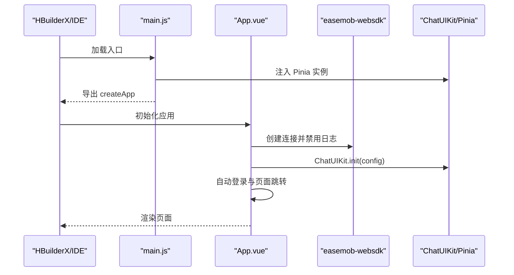
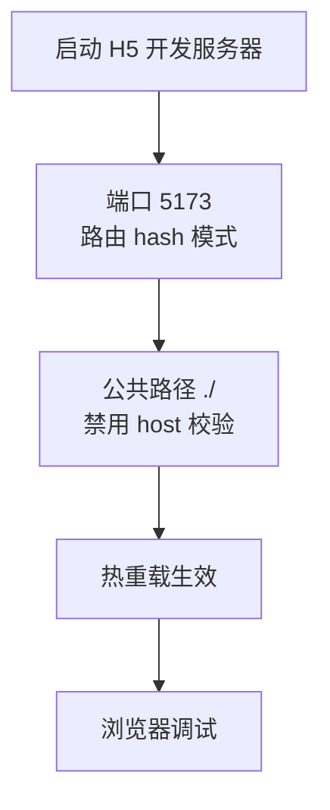
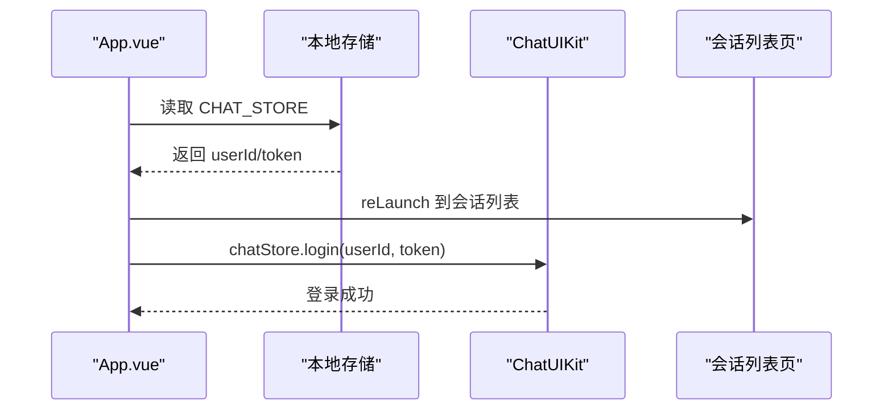
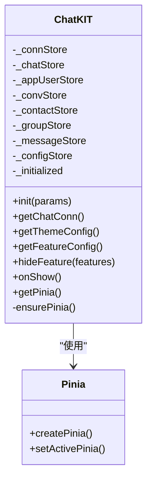
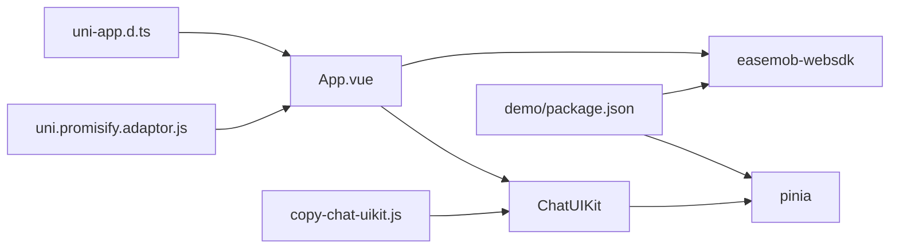

# 开发环境搭建

<cite>
**本文引用的文件**
- [demo/package.json](file://demo/package.json)
- [demo/manifest.json](file://demo/manifest.json)
- [demo/pages.json](file://demo/pages.json)
- [demo/main.js](file://demo/main.js)
- [demo/App.vue](file://demo/App.vue)
- [demo/.hbuilderx/launch.json](file://demo/.hbuilderx/launch.json)
- [demo/copy-chat-uikit.js](file://demo/copy-chat-uikit.js)
- [demo/uni.promisify.adaptor.js](file://demo/uni.promisify.adaptor.js)
- [demo/types/uni-app.d.ts](file://demo/types/uni-app.d.ts)
- [demo/common.scss](file://demo/common.scss)
- [demo/pages/Login/index.vue](file://demo/pages/Login/index.vue)
- [demo/pages/Me/index.vue](file://demo/pages/Me/index.vue)
- [demo/ChatUIKit/index.ts](file://demo/ChatUIKit/index.ts)
- [demo/ChatUIKit/configType.ts](file://demo/ChatUIKit/configType.ts)
- [demo/ChatUIKit/types/index.ts](file://demo/ChatUIKit/types/index.ts)
</cite>

## 目录
1. [简介](#简介)
2. [项目结构](#项目结构)
3. [核心组件](#核心组件)
4. [架构总览](#架构总览)
5. [详细组件分析](#详细组件分析)
6. [依赖关系分析](#依赖关系分析)
7. [性能与构建特性](#性能与构建特性)
8. [故障排查指南](#故障排查指南)
9. [结论](#结论)
10. [附录](#附录)

## 简介
本指南面向首次接触本 UniApp 项目的开发者，提供从零搭建开发环境的完整步骤，涵盖 Node.js 版本要求、包管理器选择与依赖安装、HBuilder X IDE 的安装与配置、UniApp 插件与项目导入、开发工具链（TypeScript、ESLint、Prettier）、跨平台差异与注意事项、开发服务器启动与热重载、调试准备以及常见问题排查。文档所有技术细节均基于仓库现有配置文件与源码进行提炼总结。

## 项目结构
该仓库采用“演示工程 + UIKit 组件库”的组织方式：
- demo：完整的 UniApp 示例工程，包含页面、样式、类型声明、运行配置等
- ChatUIKit：可复用的聊天 UI 组件库，通过脚本复制到 demo 中参与构建
- 根目录其他文件：通用资源与说明

图表来源
- [demo/manifest.json](file://demo/manifest.json#L1-L134)
- [demo/pages.json](file://demo/pages.json#L1-L200)
- [demo/main.js](file://demo/main.js#L1-L28)
- [demo/App.vue](file://demo/App.vue#L1-L134)
- [demo/copy-chat-uikit.js](file://demo/copy-chat-uikit.js#L1-L71)

章节来源
- [demo/manifest.json](file://demo/manifest.json#L1-L134)
- [demo/pages.json](file://demo/pages.json#L1-L200)
- [demo/main.js](file://demo/main.js#L1-L28)
- [demo/App.vue](file://demo/App.vue#L1-L134)
- [demo/copy-chat-uikit.js](file://demo/copy-chat-uikit.js#L1-L71)

## 核心组件
- 运行时与入口
  - main.js：区分 Vue2/Vue3 环境，注册 ChatUIKit 的 Pinia 实例，导出 createApp
  - App.vue：初始化 ChatUIKit、接入环信 WebSDK、自动登录、全局样式引入
- 配置文件
  - manifest.json：H5 开发服务器端口、路由模式、公共路径、模块权限等
  - pages.json：页面路由、tabBar、导航栏样式、条件编译块
- 类型与适配
  - uni-app.d.ts：扩展 uni.$UIKIT 类型
  - uni.promisify.adaptor.js：Promise 化适配器
- 构建与复制
  - copy-chat-uikit.js：将根目录 ChatUIKit 复制到 demo 下，实现全量覆盖

章节来源
- [demo/main.js](file://demo/main.js#L1-L28)
- [demo/App.vue](file://demo/App.vue#L1-L134)
- [demo/manifest.json](file://demo/manifest.json#L112-L131)
- [demo/pages.json](file://demo/pages.json#L1-L200)
- [demo/types/uni-app.d.ts](file://demo/types/uni-app.d.ts#L1-L7)
- [demo/uni.promisify.adaptor.js](file://demo/uni.promisify.adaptor.js#L1-L13)
- [demo/copy-chat-uikit.js](file://demo/copy-chat-uikit.js#L1-L71)

## 架构总览
下图展示了从 IDE 启动到页面渲染的关键流程，包括入口加载、SDK 初始化、状态管理注入与页面跳转。

图表来源
- [demo/main.js](file://demo/main.js#L14-L28)
- [demo/App.vue](file://demo/App.vue#L14-L32)
- [demo/ChatUIKit/index.ts](file://demo/ChatUIKit/index.ts#L84-L96)

章节来源
- [demo/main.js](file://demo/main.js#L14-L28)
- [demo/App.vue](file://demo/App.vue#L14-L32)
- [demo/ChatUIKit/index.ts](file://demo/ChatUIKit/index.ts#L84-L96)

## 详细组件分析

### 1) Node.js 与包管理器
- Node.js 版本
  - 仓库未显式声明最低版本；建议使用 LTS（长期支持）版本以获得稳定生态兼容性
- 包管理器
  - 推荐使用 npm（仓库内存在 package-lock.json），或 yarn（如需）
  - 安装命令示例（以 npm 为例）：
    - npm ci 或 npm install
- 依赖安装
  - demo/package.json 中声明了 easemob-websdk、pinia、pinyin-pro 等依赖
  - 若需重新生成 lock 文件，请先清理 node_modules 并执行安装

章节来源
- [demo/package.json](file://demo/package.json#L1-L18)

### 2) HBuilder X 安装与配置
- 安装
  - 访问官网下载并安装 HBuilderX
- UniApp 插件
  - 在 HBuilderX 中安装“UniApp”官方插件
- 项目导入
  - “文件”->“打开”选择 demo 目录
  - 若提示需要复制 UIKit，请执行 npm run copy:uikit（或对应包管理器命令）
- 基本设置
  - 语言：TypeScript（项目中多处使用 ts）
  - 编译：使用 Vite（由 H5 devServer 配置体现）

章节来源
- [demo/package.json](file://demo/package.json#L6-L8)
- [demo/copy-chat-uikit.js](file://demo/copy-chat-uikit.js#L62-L71)
- [demo/manifest.json](file://demo/manifest.json#L123-L127)

### 3) TypeScript、ESLint、Prettier 工具链
- TypeScript
  - 项目广泛使用 TS（如 App.vue、各页面与组件、ChatUIKit 类型定义）
  - 建议在 IDE 中启用 TS 支持，并保持与项目类型一致
- ESLint
  - 仓库未包含 .eslintrc 配置文件；可在项目根目录新增规则集（如 @typescript-eslint、eslint-plugin-uni）
  - 建议在保存时自动修复，CI 中增加 lint 步骤
- Prettier
  - 仓库未包含 .prettierrc；建议统一缩进、分号、引号策略
  - 可结合 ESLint 的 --fix 使用，或在 IDE 中配置保存时格式化

章节来源
- [demo/App.vue](file://demo/App.vue#L1-L134)
- [demo/pages/Login/index.vue](file://demo/pages/Login/index.vue#L80-L332)
- [demo/ChatUIKit/types/index.ts](file://demo/ChatUIKit/types/index.ts#L1-L100)

### 4) 开发服务器与热重载
- H5 开发服务器
  - 端口：5173
  - 路由模式：hash
  - 公共路径：./
  - Host 校验：关闭
- 启动方式
  - 在 HBuilderX 中选择“运行”->“浏览器/H5 运行”
  - 或在 demo 目录下使用 npm/yarn 脚本（若后续添加）

图表来源
- [demo/manifest.json](file://demo/manifest.json#L123-L127)

章节来源
- [demo/manifest.json](file://demo/manifest.json#L123-L127)

### 5) 调试环境准备
- HBuilderX 调试配置
  - launch.json 提供了 app-plus、h5、小程序等多端调试模板
  - 可根据目标平台调整 playground、type 等参数
- 运行时日志
  - App.vue 中已禁用 SDK 日志输出；如需调试可临时开启

章节来源
- [demo/.hbuilderx/launch.json](file://demo/.hbuilderx/launch.json#L1-L28)
- [demo/App.vue](file://demo/App.vue#L22-L22)

### 6) 跨平台差异与注意事项
- 条件编译
  - pages.json 中存在 #ifdef MP-WEIXIN 等条件编译块，注意在不同平台的行为差异
- 平台能力
  - manifest.json 声明了 Camera、VideoPlayer、Record 等模块权限与能力
- H5 与小程序差异
  - H5 devServer 配置与小程序 appid、setting 等差异较大，需按平台分别调试

章节来源
- [demo/pages.json](file://demo/pages.json#L76-L78)
- [demo/manifest.json](file://demo/manifest.json#L20-L24)
- [demo/manifest.json](file://demo/manifest.json#L93-L99)

### 7) 自动登录与页面跳转流程

图表来源
- [demo/App.vue](file://demo/App.vue#L86-L114)
- [demo/pages/Login/index.vue](file://demo/pages/Login/index.vue#L165-L198)

章节来源
- [demo/App.vue](file://demo/App.vue#L86-L114)
- [demo/pages/Login/index.vue](file://demo/pages/Login/index.vue#L165-L198)

### 8) UIKit 初始化与状态管理
- ChatUIKit 初始化
  - main.js 注入 Pinia，App.vue 调用 ChatUIKit.init 并传入 SDK 连接与配置
- Store 延迟初始化
  - ChatUIKit/index.ts 中对各 Store 采用延迟初始化，确保在 init 之前不会访问 store

图表来源
- [demo/ChatUIKit/index.ts](file://demo/ChatUIKit/index.ts#L18-L132)
- [demo/main.js](file://demo/main.js#L22-L23)

章节来源
- [demo/ChatUIKit/index.ts](file://demo/ChatUIKit/index.ts#L18-L132)
- [demo/main.js](file://demo/main.js#L22-L23)

### 9) 类型系统与全局扩展
- 类型声明
  - ChatUIKit/types/index.ts 定义了消息、会话、用户等类型
  - ChatUIKit/configType.ts 定义了功能与主题配置接口
- 全局扩展
  - uni-app.d.ts 扩展 uni.$UIKIT 类型，便于在全局使用

章节来源
- [demo/ChatUIKit/types/index.ts](file://demo/ChatUIKit/types/index.ts#L1-L100)
- [demo/ChatUIKit/configType.ts](file://demo/ChatUIKit/configType.ts#L1-L68)
- [demo/types/uni-app.d.ts](file://demo/types/uni-app.d.ts#L1-L7)

## 依赖关系分析
- 运行时依赖
  - easemob-websdk：即时通讯 SDK（uniApp 版本）
  - pinia：状态管理
  - pinyin-pro：拼音处理
- 构建与复制
  - copy-chat-uikit.js：将根目录 ChatUIKit 复制到 demo，作为开发时的依赖来源
- 类型与适配
  - uni-app.d.ts：全局类型扩展
  - uni.promisify.adaptor.js：Promise 化适配

图表来源
- [demo/App.vue](file://demo/App.vue#L11-L12)
- [demo/ChatUIKit/index.ts](file://demo/ChatUIKit/index.ts#L13)
- [demo/package.json](file://demo/package.json#L12-L16)
- [demo/copy-chat-uikit.js](file://demo/copy-chat-uikit.js#L4-L7)
- [demo/types/uni-app.d.ts](file://demo/types/uni-app.d.ts#L4-L6)
- [demo/uni.promisify.adaptor.js](file://demo/uni.promisify.adaptor.js#L1-L13)

章节来源
- [demo/App.vue](file://demo/App.vue#L11-L12)
- [demo/ChatUIKit/index.ts](file://demo/ChatUIKit/index.ts#L13)
- [demo/package.json](file://demo/package.json#L12-L16)
- [demo/copy-chat-uikit.js](file://demo/copy-chat-uikit.js#L4-L7)
- [demo/types/uni-app.d.ts](file://demo/types/uni-app.d.ts#L4-L6)
- [demo/uni.promisify.adaptor.js](file://demo/uni.promisify.adaptor.js#L1-L13)

## 性能与构建特性
- H5 构建优化
  - manifest.json 中关闭了 tree shaking，适合调试阶段；生产构建建议开启以减小包体
- 资源与样式
  - common.scss 统一基础样式，建议按需拆分与按需加载
- 页面与路由
  - pages.json 中集中声明页面与 tabBar，避免分散配置带来的维护成本

章节来源
- [demo/manifest.json](file://demo/manifest.json#L113-L117)
- [demo/common.scss](file://demo/common.scss#L1-L26)
- [demo/pages.json](file://demo/pages.json#L1-L200)

## 故障排查指南
- 无法找到 ChatUIKit
  - 症状：复制 UIKit 后仍报错
  - 处理：执行 npm run copy:uikit，确保 demo/ChatUIKit 存在
- 依赖安装失败
  - 症状：npm/yarn 报错或锁文件不一致
  - 处理：删除 node_modules 与 lock 文件后重装；必要时切换包管理器
- H5 启动端口占用
  - 症状：端口 5173 被占用
  - 处理：修改 manifest.json 中 devServer.port 或关闭占用进程
- 条件编译导致的小程序异常
  - 症状：微信小程序中某些样式/行为异常
  - 处理：检查 pages.json 中 #ifdef MP-WEIXIN 分支，确认平台兼容性
- 自动登录失败
  - 症状：本地存储存在但登录失败
  - 处理：检查 CHAT_STORE 结构与 token 有效性；确认 App.vue 中 reLaunch 路径正确

章节来源
- [demo/copy-chat-uikit.js](file://demo/copy-chat-uikit.js#L62-L71)
- [demo/manifest.json](file://demo/manifest.json#L123-L127)
- [demo/pages.json](file://demo/pages.json#L76-L78)
- [demo/App.vue](file://demo/App.vue#L86-L114)

## 结论
本指南基于仓库现有配置与源码，给出了从环境准备到调试上线的全流程实践建议。建议在团队内统一 TypeScript、ESLint、Prettier 规范，并在 CI 中加入 lint 与构建校验，以提升协作效率与质量稳定性。

## 附录
- 常用命令
  - 安装依赖：npm ci 或 npm install
  - 复制 UIKit：npm run copy:uikit
  - 启动 H5：在 HBuilderX 中选择“运行”->“浏览器/H5 运行”
- 关键文件清单
  - demo/package.json：依赖与脚本
  - demo/manifest.json：H5 开发服务器与平台配置
  - demo/pages.json：页面与 tabBar 配置
  - demo/main.js / App.vue：入口与 SDK 初始化
  - demo/.hbuilderx/launch.json：调试配置
  - demo/copy-chat-uikit.js：UIKit 复制脚本
  - demo/types/uni-app.d.ts：全局类型扩展
  - demo/uni.promisify.adaptor.js：Promise 化适配器
  - demo/ChatUIKit/index.ts：ChatUIKit 初始化与 Store 管理
  - demo/ChatUIKit/configType.ts：功能与主题配置接口
  - demo/ChatUIKit/types/index.ts：类型定义