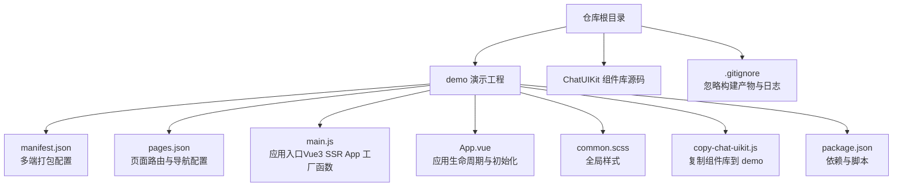
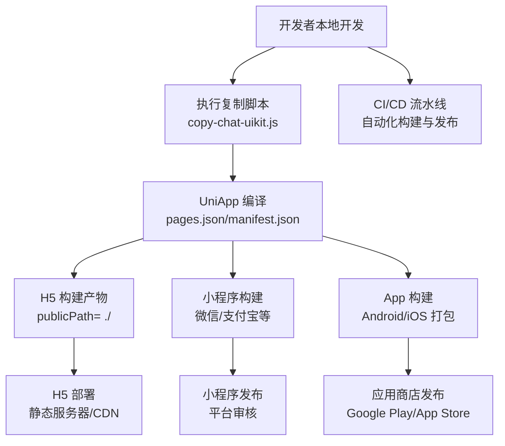
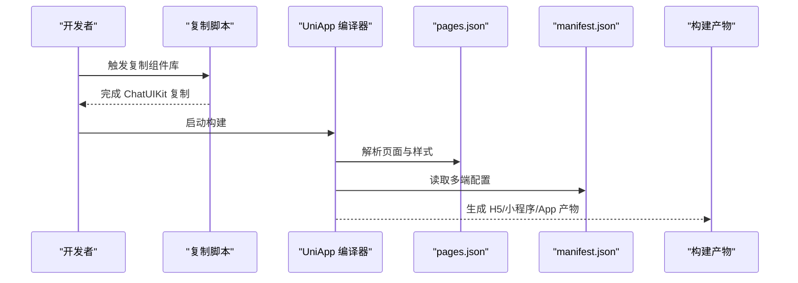
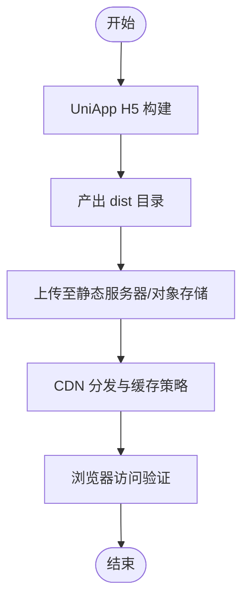
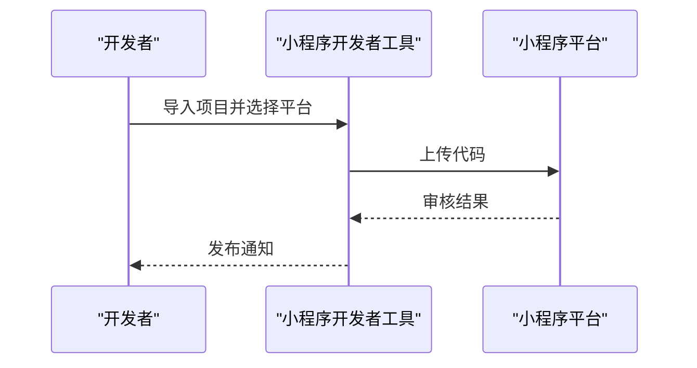
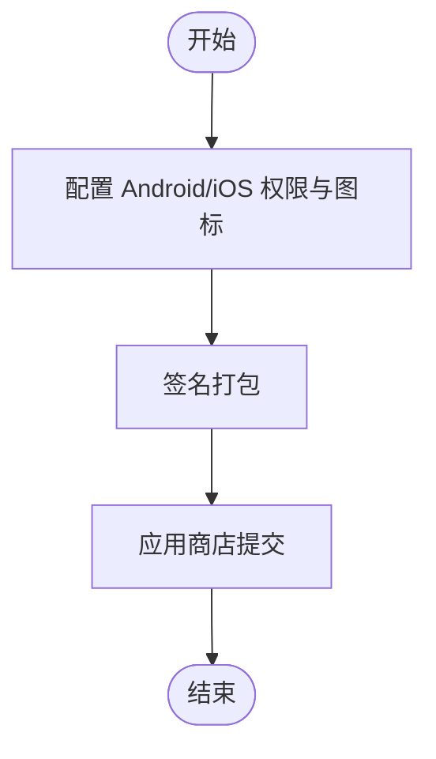
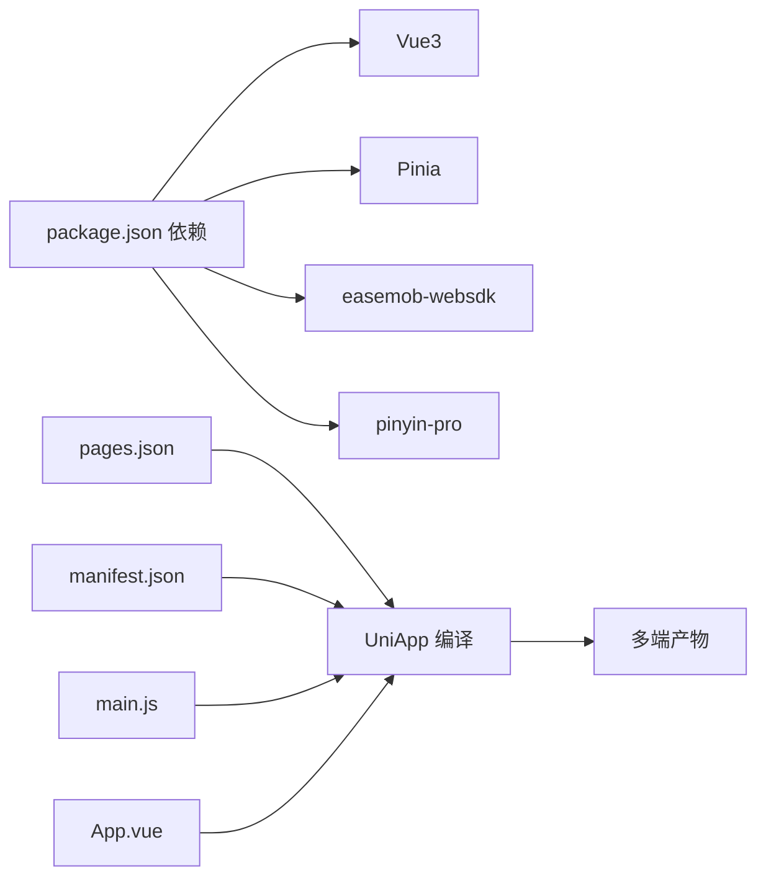

# 构建与部署

<cite>
**本文引用的文件**
- [demo/package.json](file://demo/package.json)
- [demo/manifest.json](file://demo/manifest.json)
- [demo/pages.json](file://demo/pages.json)
- [demo/main.js](file://demo/main.js)
- [demo/App.vue](file://demo/App.vue)
- [demo/common.scss](file://demo/common.scss)
- [demo/copy-chat-uikit.js](file://demo/copy-chat-uikit.js)
- [.gitignore](file://.gitignore)
</cite>

## 目录
1. [简介](#简介)
2. [项目结构](#项目结构)
3. [核心组件](#核心组件)
4. [架构总览](#架构总览)
5. [详细组件分析](#详细组件分析)
6. [依赖分析](#依赖分析)
7. [性能考虑](#性能考虑)
8. [故障排查指南](#故障排查指南)
9. [结论](#结论)
10. [附录](#附录)

## 简介
本指南面向使用 UniApp 的团队与个人开发者，系统性梳理从本地开发到多端发布的完整流程，涵盖：
- 开发构建与生产构建
- 多平台打包配置（H5、小程序、App）
- UniApp 编译配置、资源打包与代码分割策略
- H5 部署（静态资源、CDN、缓存）
- 小程序平台发布（微信、支付宝等）
- 原生 App 打包（Android APK、iOS IPA）与应用商店发布
- 自动化部署（CI/CD）与版本管理、发布清单、回滚机制
- 性能监控与错误追踪、用户体验优化建议

## 项目结构
该仓库包含一个基于 UniApp 的演示工程 demo，以及作为可复用 UI 组件库的 ChatUIKit 源码。演示工程通过脚本将 ChatUIKit 源码复制到 demo 下，便于统一开发与调试。

图表来源
- [demo/manifest.json](file://demo/manifest.json#L1-L134)
- [demo/pages.json](file://demo/pages.json#L1-L200)
- [demo/main.js](file://demo/main.js#L1-L28)
- [demo/App.vue](file://demo/App.vue#L1-L134)
- [demo/common.scss](file://demo/common.scss#L1-L26)
- [demo/copy-chat-uikit.js](file://demo/copy-chat-uikit.js#L1-L71)
- [demo/package.json](file://demo/package.json#L1-L18)
- [.gitignore](file://.gitignore#L1-L22)

章节来源
- [demo/manifest.json](file://demo/manifest.json#L1-L134)
- [demo/pages.json](file://demo/pages.json#L1-L200)
- [demo/main.js](file://demo/main.js#L1-L28)
- [demo/App.vue](file://demo/App.vue#L1-L134)
- [demo/common.scss](file://demo/common.scss#L1-L26)
- [demo/copy-chat-uikit.js](file://demo/copy-chat-uikit.js#L1-L71)
- [demo/package.json](file://demo/package.json#L1-L18)
- [.gitignore](file://.gitignore#L1-L22)

## 核心组件
- 应用入口与运行时
  - main.js 提供 Vue3 SSR App 工厂函数，注册 ChatUIKit 的 Pinia 实例，保证全局状态一致性。
  - App.vue 初始化 ChatUIKit、SDK 连接、自动登录逻辑与生命周期钩子。
- 页面与导航
  - pages.json 定义页面路径、导航栏样式、tabBar、全局样式与条件编译段落。
- 多端配置
  - manifest.json 定义各平台打包参数（App、H5、小程序），含权限、图标、SDK 配置、H5 publicPath 与 devServer 等。
- 资源与样式
  - common.scss 提供基础样式与页面容器样式。
- 组件库同步
  - copy-chat-uikit.js 在构建前将 ChatUIKit 源码复制到 demo，确保演示工程与组件库保持一致。

章节来源
- [demo/main.js](file://demo/main.js#L14-L27)
- [demo/App.vue](file://demo/App.vue#L14-L32)
- [demo/pages.json](file://demo/pages.json#L1-L200)
- [demo/manifest.json](file://demo/manifest.json#L112-L131)
- [demo/common.scss](file://demo/common.scss#L1-L26)
- [demo/copy-chat-uikit.js](file://demo/copy-chat-uikit.js#L1-L71)

## 架构总览
下图展示从开发到多端发布的整体流程与关键节点：

图表来源
- [demo/copy-chat-uikit.js](file://demo/copy-chat-uikit.js#L61-L71)
- [demo/pages.json](file://demo/pages.json#L1-L200)
- [demo/manifest.json](file://demo/manifest.json#L112-L131)

## 详细组件分析

### 构建与编译配置
- 页面与路由
  - pages.json 声明页面路径与样式，支持条件编译段落以适配不同平台特性（如小程序禁用滚动）。
- 多端打包配置
  - manifest.json 的 h5 节点包含 publicPath、router 模式与 devServer；app-plus 节点包含 Android/iOS 权限、图标、分包与模块配置；小程序节点包含 appid 与 setting。
- 运行时入口
  - main.js 提供 createApp 工厂函数，注入 ChatUIKit 的 Pinia，确保全局状态一致。

图表来源
- [demo/copy-chat-uikit.js](file://demo/copy-chat-uikit.js#L61-L71)
- [demo/pages.json](file://demo/pages.json#L1-L200)
- [demo/manifest.json](file://demo/manifest.json#L1-L134)

章节来源
- [demo/pages.json](file://demo/pages.json#L1-L200)
- [demo/manifest.json](file://demo/manifest.json#L1-L134)
- [demo/main.js](file://demo/main.js#L14-L27)

### H5 部署方案
- 构建产物定位
  - H5 构建产物位于 demo/unpackage/dist，publicPath 配置为 "./"，适合相对路径部署。
- 静态资源部署
  - 将 dist 目录部署至静态服务器或对象存储，确保资源可被正确访问。
- CDN 与缓存策略
  - 对 JS/CSS 资源启用长缓存（带内容指纹），HTML 设置较短缓存或不缓存；图片与媒体资源按需缓存。
- 路由模式
  - router.mode 采用 hash，避免后端路由配置复杂度；base 设置为 "./" 以适配子目录部署。

图表来源
- [demo/manifest.json](file://demo/manifest.json#L112-L131)

章节来源
- [demo/manifest.json](file://demo/manifest.json#L112-L131)

### 小程序平台部署
- 微信小程序
  - manifest.json 中 mp-weixin 节点包含 appid 与 setting.urlCheck 控制；pages.json 中可针对小程序平台使用条件编译段落优化体验。
- 支付宝小程序
  - manifest.json 中 mp-alipay 节点开启 usingComponents。
- 发布流程
  - 在各平台开发者工具中上传代码，填写版本号与变更说明，提交审核，审核通过后发布。

图表来源
- [demo/manifest.json](file://demo/manifest.json#L93-L102)
- [demo/pages.json](file://demo/pages.json#L76-L78)

章节来源
- [demo/manifest.json](file://demo/manifest.json#L93-L102)
- [demo/pages.json](file://demo/pages.json#L76-L78)

### 原生 App 打包与发布
- Android 打包
  - manifest.json 的 app-plus.android.permissions 配置权限；icons 节点配置多分辨率图标；可结合 HBuilderX 或命令行进行签名打包。
- iOS 打包
  - manifest.json 的 app-plus.ios.dSYMs 控制符号表；icons 节点配置 iOS 图标；需在 Xcode 中完成签名与证书配置。
- 应用商店发布
  - Android：Google Play Console 提交 APK/IPA。
  - iOS：App Store Connect 提交 IPA。

图表来源
- [demo/manifest.json](file://demo/manifest.json#L27-L88)

章节来源
- [demo/manifest.json](file://demo/manifest.json#L27-L88)

### 自动化部署与 CI/CD
- 构建步骤
  - 安装依赖 → 执行复制脚本 → UniApp 构建 → 产出多端产物。
- CI/CD 建议
  - 使用流水线在分支保护策略下触发构建；对 H5 产物进行缓存与校验；对 App 与小程序分别进行签名与上传。
- 版本管理与发布清单
  - 以 Git Tag 作为版本标识，生成发布清单（包含版本号、构建时间、产物摘要、回滚指令）。
- 回滚机制
  - 保留最近 N 个版本的产物；H5 通过 CDN 回滚；小程序与 App 通过平台控制台回滚至上一稳定版本。

章节来源
- [demo/copy-chat-uikit.js](file://demo/copy-chat-uikit.js#L61-L71)
- [demo/package.json](file://demo/package.json#L6-L9)
- [.gitignore](file://.gitignore#L10-L14)

### 性能监控与错误追踪
- 性能监控
  - H5：利用浏览器性能 API 与 Web Vitals；服务端埋点统计首屏时间与交互延迟。
- 错误追踪
  - 引入前端错误上报（如 Sentry），捕获未处理异常与 Promise 拒绝；在 App.vue 生命周期中统一上报。
- 用户体验优化
  - 预加载关键资源、懒加载非关键页面、合理拆分包体、减少主线程阻塞。

章节来源
- [demo/App.vue](file://demo/App.vue#L116-L128)

## 依赖分析
- 关键依赖
  - Vue3、Pinia、easemob-websdk、pinyin-pro。
- 构建与运行
  - pages.json 与 manifest.json 是 UniApp 编译与打包的核心配置；main.js 注入全局状态；App.vue 初始化 SDK 与自动登录。
- 资源与样式
  - common.scss 提供基础样式；assets/icon、emojis 等资源在各平台按需引入。

图表来源
- [demo/package.json](file://demo/package.json#L12-L16)
- [demo/pages.json](file://demo/pages.json#L1-L200)
- [demo/manifest.json](file://demo/manifest.json#L1-L134)
- [demo/main.js](file://demo/main.js#L14-L27)
- [demo/App.vue](file://demo/App.vue#L1-L134)

章节来源
- [demo/package.json](file://demo/package.json#L12-L16)
- [demo/pages.json](file://demo/pages.json#L1-L200)
- [demo/manifest.json](file://demo/manifest.json#L1-L134)
- [demo/main.js](file://demo/main.js#L14-L27)
- [demo/App.vue](file://demo/App.vue#L1-L134)

## 性能考虑
- 代码分割与懒加载
  - 将非关键页面与组件按需加载，减少首屏体积。
- 资源优化
  - 压缩图片与媒体资源，启用 Gzip/Brotli；对静态资源使用 CDN 与缓存策略。
- H5 路由与缓存
  - 使用 hash 路由与相对路径 publicPath；对 JS/CSS 设置长缓存，HTML 短缓存或不缓存。
- App 与小程序
  - 合理配置分包与预下载；在 manifest.json 中按平台优化图标与权限。

章节来源
- [demo/manifest.json](file://demo/manifest.json#L112-L131)
- [demo/pages.json](file://demo/pages.json#L1-L200)

## 故障排查指南
- 构建失败
  - 检查 pages.json 页面路径是否正确；确认 manifest.json 平台配置无误；确保依赖安装完成。
- H5 访问异常
  - 核对 publicPath 是否为 "./"；确认静态服务器正确映射 dist 目录；检查 CDN 缓存策略。
- 小程序上传失败
  - 检查 appid 与 setting.urlCheck；确认 pages.json 中条件编译段落正确；重新上传。
- App 打包问题
  - 核对 Android/iOS 权限与图标配置；确保签名证书有效；在 HBuilderX/Xcode 中重新签名。
- 自动化部署
  - 查看流水线日志，确认复制脚本执行成功；校验产物完整性与版本号。

章节来源
- [demo/pages.json](file://demo/pages.json#L1-L200)
- [demo/manifest.json](file://demo/manifest.json#L1-L134)
- [demo/copy-chat-uikit.js](file://demo/copy-chat-uikit.js#L61-L71)
- [.gitignore](file://.gitignore#L10-L14)

## 结论
本指南基于现有配置文件梳理了 UniApp 项目的构建与多端发布流程。建议在实际落地时补充 CI/CD 流水线、版本管理与回滚策略，并结合业务场景完善性能监控与错误追踪体系，以保障交付质量与用户体验。

## 附录
- 常用命令与脚本
  - 复制组件库：执行复制脚本，确保 demo 下 ChatUIKit 与根目录源码一致。
  - 依赖安装：根据 package.json 安装依赖。
- 忽略文件
  - .gitignore 已忽略 node_modules、unpackage、dist 等构建产物与日志，避免污染仓库。

章节来源
- [demo/copy-chat-uikit.js](file://demo/copy-chat-uikit.js#L61-L71)
- [demo/package.json](file://demo/package.json#L12-L16)
- [.gitignore](file://.gitignore#L10-L14)