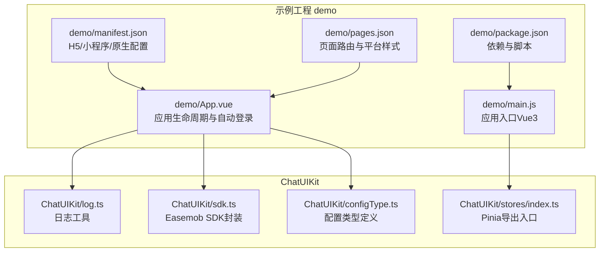
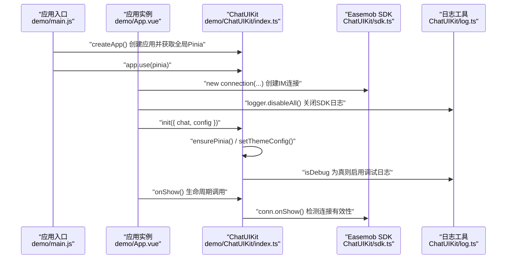
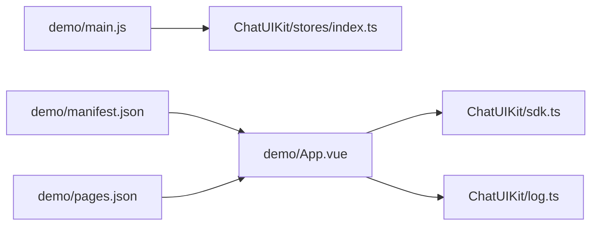

# 调试与测试

<cite>
**本文引用的文件**
- [ChatUIKit/log.ts](file://ChatUIKit/log.ts)
- [ChatUIKit/sdk.ts](file://ChatUIKit/sdk.ts)
- [ChatUIKit/configType.ts](file://ChatUIKit/configType.ts)
- [ChatUIKit/stores/index.ts](file://ChatUIKit/stores/index.ts)
- [demo/main.js](file://demo/main.js)
- [demo/App.vue](file://demo/App.vue)
- [demo/pages.json](file://demo/pages.json)
- [demo/manifest.json](file://demo/manifest.json)
- [demo/package.json](file://demo/package.json)
</cite>

## 目录
1. [简介](#简介)
2. [项目结构](#项目结构)
3. [核心组件](#核心组件)
4. [架构总览](#架构总览)
5. [详细组件分析](#详细组件分析)
6. [依赖关系分析](#依赖关系分析)
7. [性能考虑](#性能考虑)
8. [故障排查指南](#故障排查指南)
9. [结论](#结论)
10. [附录](#附录)

## 简介
本指南聚焦于UniApp多平台调试与测试实践，结合仓库中的实际代码，系统讲解以下内容：
- 多平台调试方法：H5、小程序、原生App
- Vue DevTools使用与组件状态检查、响应式数据追踪
- Easemob SDK调试配置、WebSocket连接监控与消息收发验证
- 单元测试与集成/端到端测试思路（含模拟与真实环境）
- 日志记录最佳实践、错误捕获与异常处理策略
- 性能分析工具使用、内存泄漏检测与优化技巧

## 项目结构
该仓库包含两个主要部分：
- ChatUIKit：可复用的聊天UI组件库与状态管理（基于Pinia）
- demo：示例工程，演示如何在不同平台上运行与调试

图表来源
- [demo/main.js](file://demo/main.js#L1-L28)
- [demo/App.vue](file://demo/App.vue#L1-L134)
- [demo/pages.json](file://demo/pages.json#L1-L200)
- [demo/manifest.json](file://demo/manifest.json#L1-L134)
- [demo/package.json](file://demo/package.json#L1-L18)
- [ChatUIKit/log.ts](file://ChatUIKit/log.ts#L1-L78)
- [ChatUIKit/sdk.ts](file://ChatUIKit/sdk.ts#L1-L13)
- [ChatUIKit/configType.ts](file://ChatUIKit/configType.ts#L1-L68)
- [ChatUIKit/stores/index.ts](file://ChatUIKit/stores/index.ts#L1-L31)

章节来源
- [demo/main.js](file://demo/main.js#L1-L28)
- [demo/App.vue](file://demo/App.vue#L1-L134)
- [demo/pages.json](file://demo/pages.json#L1-L200)
- [demo/manifest.json](file://demo/manifest.json#L1-L134)
- [demo/package.json](file://demo/package.json#L1-L18)
- [ChatUIKit/log.ts](file://ChatUIKit/log.ts#L1-L78)
- [ChatUIKit/sdk.ts](file://ChatUIKit/sdk.ts#L1-L13)
- [ChatUIKit/configType.ts](file://ChatUIKit/configType.ts#L1-L68)
- [ChatUIKit/stores/index.ts](file://ChatUIKit/stores/index.ts#L1-L31)

## 核心组件
- 日志工具：统一管理调试日志开关与输出级别，便于在开发阶段快速定位问题。
- SDK封装：对Easemob Web SDK进行封装，暴露类型与实例，便于在多平台接入。
- 配置类型：定义功能特性与主题配置接口，保证初始化参数的类型安全。
- Pinia Store：集中导出各模块状态，支持延迟初始化与全局激活。

章节来源
- [ChatUIKit/log.ts](file://ChatUIKit/log.ts#L1-L78)
- [ChatUIKit/sdk.ts](file://ChatUIKit/sdk.ts#L1-L13)
- [ChatUIKit/configType.ts](file://ChatUIKit/configType.ts#L1-L68)
- [ChatUIKit/stores/index.ts](file://ChatUIKit/stores/index.ts#L1-L31)

## 架构总览
下图展示了示例应用在启动时的关键流程：应用入口创建Vue3应用并注入全局Pinia；随后初始化ChatUIKit，传入IM连接实例与调试配置；在App生命周期中执行自动登录与连接有效性检测。

图表来源
- [demo/main.js](file://demo/main.js#L14-L27)
- [demo/App.vue](file://demo/App.vue#L14-L32)
- [ChatUIKit/index.ts](file://demo/ChatUIKit/index.ts#L84-L125)
- [ChatUIKit/sdk.ts](file://ChatUIKit/sdk.ts#L1-L13)
- [ChatUIKit/log.ts](file://ChatUIKit/log.ts#L18-L74)

章节来源
- [demo/main.js](file://demo/main.js#L14-L27)
- [demo/App.vue](file://demo/App.vue#L14-L32)
- [ChatUIKit/index.ts](file://demo/ChatUIKit/index.ts#L84-L125)
- [ChatUIKit/sdk.ts](file://ChatUIKit/sdk.ts#L1-L13)
- [ChatUIKit/log.ts](file://ChatUIKit/log.ts#L18-L74)

## 详细组件分析

### 日志与调试配置
- 日志工具提供统一的调试开关与多种日志级别，便于在开发阶段输出结构化信息。
- 示例应用通过关闭SDK日志并开启ChatUIKit调试模式，控制日志输出范围与粒度。

建议实践
- 开发期启用调试日志，生产期关闭或降级为warn/error。
- 对关键路径（如连接建立、消息收发、状态变更）添加日志埋点。

章节来源
- [ChatUIKit/log.ts](file://ChatUIKit/log.ts#L18-L74)
- [demo/App.vue](file://demo/App.vue#L22-L32)

### Easemob SDK接入与调试
- SDK封装导出类型与实例，确保在多平台（H5/小程序/原生）的一致性。
- 初始化时传入IM连接实例，并根据配置决定是否启用调试日志。

调试要点
- H5：关注WebSocket握手与心跳，检查跨域与证书配置。
- 小程序：留意网络限制与权限配置，避免频繁重连。
- 原生：注意白名单与NDK配置，监控连接断开与重连策略。

章节来源
- [ChatUIKit/sdk.ts](file://ChatUIKit/sdk.ts#L1-L13)
- [demo/App.vue](file://demo/App.vue#L14-L20)
- [ChatUIKit/index.ts](file://demo/ChatUIKit/index.ts#L84-L96)

### Pinia状态管理与响应式追踪
- Store集中导出，支持延迟初始化与全局激活，便于在组件中按需使用。
- 响应式数据可通过Vue DevTools观察，结合日志定位状态变更来源。

章节来源
- [ChatUIKit/stores/index.ts](file://ChatUIKit/stores/index.ts#L1-L31)
- [demo/main.js](file://demo/main.js#L18-L26)

### 页面路由与多平台配置
- pages.json定义页面与tabBar，针对不同平台（H5/小程序/原生）设置样式与行为差异。
- manifest.json提供H5开发服务器端口、路由模式等配置，便于本地联调。

章节来源
- [demo/pages.json](file://demo/pages.json#L1-L200)
- [demo/manifest.json](file://demo/manifest.json#L112-L131)

### 自动登录与生命周期联动
- App启动时尝试从本地存储恢复登录状态，成功后跳转到会话列表并触发IM连接检测。
- onShow生命周期中调用ChatUIKit.onShow以检测连接有效性。

章节来源
- [demo/App.vue](file://demo/App.vue#L86-L127)
- [ChatUIKit/index.ts](file://demo/ChatUIKit/index.ts#L114-L125)

## 依赖关系分析
- 应用入口依赖ChatUIKit的全局Pinia实例，确保Store在组件中可用。
- 应用实例依赖SDK封装与日志工具，完成初始化与调试配置。
- 平台配置由manifest与pages共同决定，影响运行时行为与调试体验。

图表来源
- [demo/main.js](file://demo/main.js#L18-L26)
- [demo/App.vue](file://demo/App.vue#L1-L13)
- [ChatUIKit/stores/index.ts](file://ChatUIKit/stores/index.ts#L1-L31)
- [ChatUIKit/sdk.ts](file://ChatUIKit/sdk.ts#L1-L13)
- [ChatUIKit/log.ts](file://ChatUIKit/log.ts#L1-L78)
- [demo/manifest.json](file://demo/manifest.json#L112-L131)
- [demo/pages.json](file://demo/pages.json#L1-L200)

章节来源
- [demo/main.js](file://demo/main.js#L18-L26)
- [demo/App.vue](file://demo/App.vue#L1-L13)
- [ChatUIKit/stores/index.ts](file://ChatUIKit/stores/index.ts#L1-L31)
- [ChatUIKit/sdk.ts](file://ChatUIKit/sdk.ts#L1-L13)
- [ChatUIKit/log.ts](file://ChatUIKit/log.ts#L1-L78)
- [demo/manifest.json](file://demo/manifest.json#L112-L131)
- [demo/pages.json](file://demo/pages.json#L1-L200)

## 性能考虑
- H5开发服务器：通过manifest.json配置devServer端口与路由模式，便于热更新与联调。
- 资源优化：H5端可关闭Tree Shaking以减少打包复杂度，但需权衡体积与加载速度。
- 连接稳定性：在App.onShow中检测连接有效性，避免无效连接导致的卡顿与异常。

章节来源
- [demo/manifest.json](file://demo/manifest.json#L118-L127)
- [ChatUIKit/index.ts](file://demo/ChatUIKit/index.ts#L114-L125)

## 故障排查指南
- 日志开关
  - 启用ChatUIKit调试日志，观察关键事件（初始化、登录、连接检测）。
  - 关闭SDK日志以减少噪声，聚焦业务日志。
- WebSocket连接
  - H5：检查跨域、证书与代理；确认握手与心跳正常。
  - 小程序：核对网络权限与域名白名单。
  - 原生：核对NDK与白名单配置。
- 状态异常
  - 使用Vue DevTools观察Store状态变化，结合日志定位变更来源。
  - 在组件中使用watch或computed进行关键状态追踪。
- 生命周期
  - 在App.onShow中调用ChatUIKit.onShow，确保连接有效性。
  - 登录失败时检查本地存储与Token有效性。

章节来源
- [ChatUIKit/log.ts](file://ChatUIKit/log.ts#L18-L74)
- [demo/App.vue](file://demo/App.vue#L86-L127)
- [ChatUIKit/index.ts](file://demo/ChatUIKit/index.ts#L114-L125)

## 结论
本指南基于仓库现有代码，总结了UniApp多平台调试与测试的关键实践：通过统一的日志工具、严谨的SDK接入与配置、以及完善的生命周期联动，能够显著提升问题定位效率与稳定性。建议在开发过程中持续完善日志埋点与状态追踪，并结合平台特性进行针对性优化。

## 附录

### 多平台调试清单
- H5
  - 开发服务器端口与路由模式：见manifest.json devServer与router配置
  - 跨域与证书：确保代理与HTTPS配置正确
- 小程序
  - 权限与域名白名单：核对manifest.json与开发者后台
  - 网络限制：避免频繁重连与大包传输
- 原生
  - NDK与白名单：确保SDK所需模块可用
  - 启动页与闪屏：优化首屏体验

章节来源
- [demo/manifest.json](file://demo/manifest.json#L112-L131)
- [demo/manifest.json](file://demo/manifest.json#L20-L88)

### 测试与验证建议
- 单元测试
  - 组件：使用Vue Test Utils或Jest，针对纯函数与计算属性进行断言
  - Store：对getter与action进行隔离测试，必要时mockSDK
- 集成测试
  - 页面导航与状态流转：通过页面路由配置(pages.json)验证
  - 生命周期联动：在App.vue中模拟onShow/onHide场景
- 端到端测试
  - 使用平台自带的自动化测试框架（H5可借助浏览器自动化），覆盖关键流程（登录、消息收发、连接检测）

章节来源
- [demo/pages.json](file://demo/pages.json#L1-L200)
- [demo/App.vue](file://demo/App.vue#L117-L127)