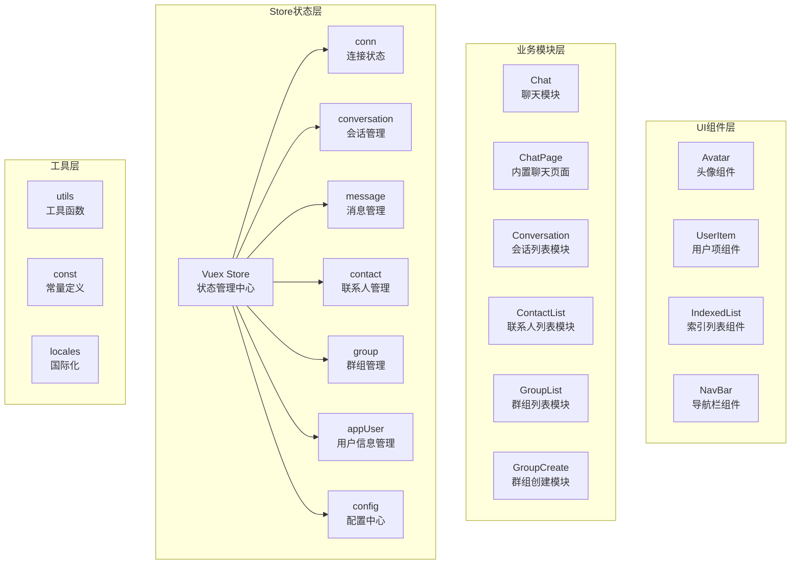
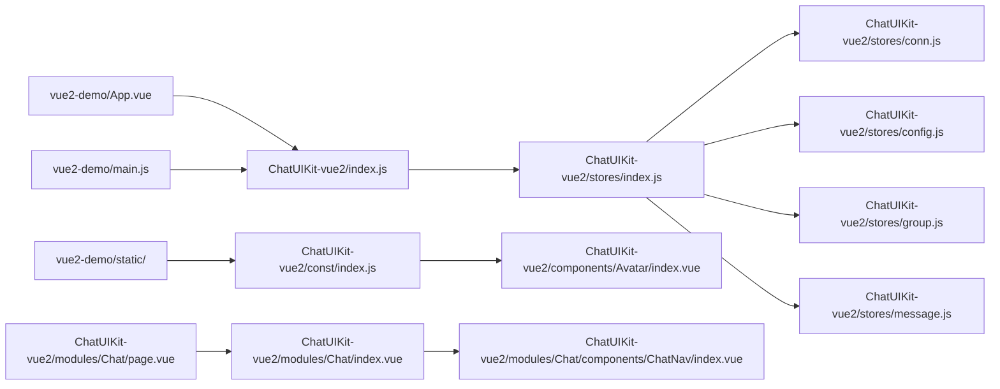

# 快速开始

<cite>
**本文引用的文件**
- [VUE2_QUICK_START.md](file://VUE2_QUICK_START.md)
- [ChatUIKit-vue2/modules/Chat/page.vue](file://ChatUIKit-vue2/modules/Chat/page.vue)
- [ChatUIKit-vue2/modules/Chat/index.vue](file://ChatUIKit-vue2/modules/Chat/index.vue)
- [ChatUIKit-vue2/modules/Chat/components/ChatNav/index.vue](file://ChatUIKit-vue2/modules/Chat/components/ChatNav/index.vue)
- [ChatUIKit-vue2/modules/Conversation/index.vue](file://ChatUIKit-vue2/modules/Conversation/index.vue)
- [ChatUIKit-vue2/modules/Conversation/components/ConversationList/index.vue](file://ChatUIKit-vue2/modules/Conversation/components/ConversationList/index.vue)
- [ChatUIKit-vue2/modules/ContactList/index.vue](file://ChatUIKit-vue2/modules/ContactList/index.vue)
- [vue2-demo/pages/chat/index.vue](file://vue2-demo/pages/chat/index.vue)
- [ChatUIKit-vue2/stores/index.js](file://ChatUIKit-vue2/stores/index.js)
- [ChatUIKit-vue2/stores/conn.js](file://ChatUIKit-vue2/stores/conn.js)
- [ChatUIKit-vue2/stores/config.js](file://ChatUIKit-vue2/stores/config.js)
- [ChatUIKit-vue2/stores/conversation.js](file://ChatUIKit-vue2/stores/conversation.js)
- [ChatUIKit-vue2/stores/group.js](file://ChatUIKit-vue2/stores/group.js)
- [ChatUIKit-vue2/stores/message.js](file://ChatUIKit-vue2/stores/message.js)
- [ChatUIKit-vue2/components/Avatar/index.vue](file://ChatUIKit-vue2/components/Avatar/index.vue)
- [ChatUIKit-vue2/const/index.js](file://ChatUIKit-vue2/const/index.js)
- [ChatUIKit-vue2/styles/common.scss](file://ChatUIKit-vue2/styles/common.scss)
- [vue2-demo/main.js](file://vue2-demo/main.js)
- [vue2-demo/App.vue](file://vue2-demo/App.vue)
- [vue2-demo/pages.json](file://vue2-demo/pages.json)
- [vue2-demo/manifest.json](file://vue2-demo/manifest.json)
- [copy-chat-uikit-vue2.js](file://copy-chat-uikit-vue2.js)
</cite>

## 目录
1. [简介](#简介)
2. [Vue2 架构概览](#vue2-架构概览)
3. [项目结构](#项目结构)
4. [核心组件](#核心组件)
5. [详细组件分析](#详细组件分析)
6. [内置聊天页面集成指南](#内置聊天页面集成指南)
7. [自定义聊天页面集成指南](#自定义聊天页面集成指南)
8. [路由跳转与参数格式](#路由跳转与参数格式)
9. [静态资源与CSS样式配置](#静态资源与css样式配置)
10. [依赖关系分析](#依赖关系分析)
11. [性能注意事项](#性能注意事项)
12. [故障排除指南](#故障排除指南)
13. [结论](#结论)
14. [附录](#附录)

## 简介
本指南面向新手开发者，帮助你在约30分钟内完成 Easemob UIKit Vue2 版本的环境准备、安装与基础集成，并看到可运行的效果。你将学习到：
- Vue2 环境要求与依赖
- 安装与复制 UIKit 资源
- 静态资源复制与配置
- 初始化 ChatUIKit 并接入 IM SDK
- 基本配置（主题、功能开关、资源地址）
- CSS样式与占位符头像设置
- 内置聊天页面的完整集成方案
- 自定义聊天页面的灵活定制方式
- 路由跳转机制与参数格式规范
- 常见问题与排错方法

**重要说明**：本指南专门针对 Vue2 版本的 ChatUIKit，与 Vue3 版本在架构、状态管理和 API 使用上有显著差异。现在提供双模式集成方案：内置页面（零配置）和自定义页面两种方式。

## Vue2 架构概览
Vue2 ChatUIKit 采用基于 Vuex 的状态管理模式，支持 H5、App 和微信小程序等多平台。整体架构分为四个层次：



**图表来源**
- [ChatUIKit-vue2/modules/Chat/page.vue:1-69](file://ChatUIKit-vue2/modules/Chat/page.vue#L1-L69)
- [ChatUIKit-vue2/modules/Chat/components/ChatNav/index.vue:1-134](file://ChatUIKit-vue2/modules/Chat/components/ChatNav/index.vue#L1-L134)
- [ChatUIKit-vue2/stores/index.js:13-23](file://ChatUIKit-vue2/stores/index.js#L13-L23)

## 项目结构
该仓库包含两个主要部分：
- ChatUIKit-vue2：Vue2 版本的组件库源码
- vue2-demo：基于 UniApp 的 Vue2 示例应用

```mermaid
graph TB
subgraph "ChatUIKit-vue2组件库"
A_index_js["ChatUIKit-vue2/index.js<br/>ChatUIKit主类"]
A_stores_index_js["ChatUIKit-vue2/stores/index.js<br/>Store入口"]
A_stores_conn_js["ChatUIKit-vue2/stores/conn.js<br/>连接Store"]
A_stores_config_js["ChatUIKit-vue2/stores/config.js<br/>配置Store"]
A_stores_group_js["ChatUIKit-vue2/stores/group.js<br/>群组Store"]
A_stores_message_js["ChatUIKit-vue2/stores/message.js<br/>消息Store"]
A_components_avatar_vue["ChatUIKit-vue2/components/Avatar/index.vue<br/>头像组件"]
A_modules_conversation_vue["ChatUIKit-vue2/modules/Conversation/index.vue<br/>会话模块"]
A_modules_grouplist_vue["ChatUIKit-vue2/modules/GroupList/index.vue<br/>群组列表模块"]
A_modules_groupcreate_vue["ChatUIKit-vue2/modules/GroupCreate/index.vue<br/>群组创建模块"]
A_modules_chat_page_vue["ChatUIKit-vue2/modules/Chat/page.vue<br/>内置聊天页面"]
A_modules_chat_index_vue["ChatUIKit-vue2/modules/Chat/index.vue<br/>聊天组件"]
A_modules_chat_nav_vue["ChatUIKit-vue2/modules/Chat/components/ChatNav/index.vue<br/>聊天导航栏"]
A_modules_contactlist_vue["ChatUIKit-vue2/modules/ContactList/index.vue<br/>联系人列表模块"]
A_const_index_js["ChatUIKit-vue2/const/index.js<br/>常量定义"]
A_styles_common_scss["ChatUIKit-vue2/styles/common.scss<br/>公共样式"]
end
subgraph "vue2-demo示例应用"
D_main_js["vue2-demo/main.js<br/>应用入口Vue2"]
D_App_vue["vue2-demo/App.vue<br/>应用初始化与登录流程"]
D_pages_json["vue2-demo/pages.json<br/>页面与Tab配置"]
D_manifest_json["vue2-demo/manifest.json<br/>平台配置"]
D_static_assets["vue2-demo/static/<br/>静态资源目录"]
D_demo_chat_page_vue["vue2-demo/pages/chat/index.vue<br/>自定义聊天页面示例"]
end
D_App_vue --> A_index_js
D_main_js --> A_index_js
A_index_js --> A_stores_index_js
A_stores_index_js --> A_stores_conn_js
A_stores_index_js --> A_stores_config_js
A_stores_index_js --> A_stores_group_js
A_stores_index_js --> A_stores_message_js
D_static_assets --> A_const_index_js
D_demo_chat_page_vue --> A_modules_chat_index_vue
```



**图表来源**
- [ChatUIKit-vue2/modules/Chat/page.vue:1-69](file://ChatUIKit-vue2/modules/Chat/page.vue#L1-L69)
- [ChatUIKit-vue2/modules/Chat/index.vue:1-310](file://ChatUIKit-vue2/modules/Chat/index.vue#L1-L310)
- [ChatUIKit-vue2/modules/Chat/components/ChatNav/index.vue:1-134](file://ChatUIKit-vue2/modules/Chat/components/ChatNav/index.vue#L1-L134)
- [vue2-demo/pages/chat/index.vue:1-62](file://vue2-demo/pages/chat/index.vue#L1-L62)
- [vue2-demo/main.js:1-82](file://vue2-demo/main.js#L1-L82)
- [vue2-demo/App.vue:1-77](file://vue2-demo/App.vue#L1-L77)
- [vue2-demo/pages.json:1-134](file://vue2-demo/pages.json#L1-L134)
- [ChatUIKit-vue2/const/index.js:12-19](file://ChatUIKit-vue2/const/index.js#L12-L19)

**章节来源**
- [VUE2_QUICK_START.md:1-611](file://VUE2_QUICK_START.md#L1-L611)

## 核心组件
- **ChatUIKit 主类**：负责创建并激活全局 Vuex、注入 IM SDK 实例、设置主题与功能配置、提供 onShow 生命周期检测等
- **配置 Store**：集中管理主题与功能开关，默认开启丰富能力，支持按需隐藏或显示
- **连接 Store**：封装 IM SDK 连接实例，提供类型安全的访问与初始化方法
- **群组 Store**：管理群组列表、群组详情、群组创建等核心功能
- **消息 Store**：管理消息的发送、接收、撤回、编辑、引用等操作
- **事件系统**：采用 uni.$emit/uni.$on 作为全局事件总线，实现跨组件通信
- **内置聊天页面**：提供零配置的完整聊天页面，支持单聊和群聊
- **聊天组件**：核心聊天界面组件，包含消息列表、输入框、工具栏等功能

**章节来源**
- [ChatUIKit-vue2/index.js:6-66](file://ChatUIKit-vue2/index.js#L6-L66)
- [ChatUIKit-vue2/stores/config.js:70-196](file://ChatUIKit-vue2/stores/config.js#L70-L196)
- [ChatUIKit-vue2/stores/conn.js:8-50](file://ChatUIKit-vue2/stores/conn.js#L8-L50)
- [ChatUIKit-vue2/stores/group.js:1-212](file://ChatUIKit-vue2/stores/group.js#L1-L212)
- [ChatUIKit-vue2/stores/message.js:1-880](file://ChatUIKit-vue2/stores/message.js#L1-L880)
- [ChatUIKit-vue2/modules/Chat/page.vue:1-69](file://ChatUIKit-vue2/modules/Chat/page.vue#L1-L69)
- [ChatUIKit-vue2/modules/Chat/index.vue:1-310](file://ChatUIKit-vue2/modules/Chat/index.vue#L1-L310)

## 详细组件分析

### 环境要求与安装
- **运行环境**：Node.js 16+、HBuilderX 3.6+、Vue 2.x、uni-app 3.x
- **平台支持**：Android、iOS、微信小程序、H5
- **依赖包**：easemob-websdk、vuex、pinyin-pro、easemob-uniapp-logger-plugin
- **复制 UIKit 资源**：将 ChatUIKit-vue2 目录复制到项目中，重命名为 ChatUIKit
- **静态资源复制**：将 ChatUIKit-vue2/assets 目录复制到项目 static 目录

**步骤摘要**
- 在项目根目录执行 `npm install easemob-websdk vuex pinyin-pro easemob-uniapp-logger-plugin`
- 复制 ChatUIKit-vue2 目录到项目根目录，重命名为 ChatUIKit
- 复制静态资源：`cp -r ChatUIKit-vue2/assets/* my-uniapp-project/static/`
- 配置 manifest.json 中的 vueVersion 为 "2"

**章节来源**
- [VUE2_QUICK_START.md:23-31](file://VUE2_QUICK_START.md#L23-L31)
- [VUE2_QUICK_START.md:44-54](file://VUE2_QUICK_START.md#L44-L54)
- [vue2-demo/manifest.json:102-102](file://vue2-demo/manifest.json#L102-L102)

### 基本配置与初始化
- **初始化入口**：ChatUIKit.init 接收 IM SDK 实例与配置对象
- **配置项**：
  - chat：环信 SDK 连接实例（必需）
  - sdk：环信 SDK 本身（可选）
  - config：配置对象（isDebug、language 等）
- **连接注入**：通过 this.$ChatUIKit.getChatConn 获取 SDK 实例
- **生命周期**：this.$ChatUIKit.onShow 会在应用 onShow 时检查连接有效性

**章节来源**
- [ChatUIKit-vue2/index.js:22-66](file://ChatUIKit-vue2/index.js#L22-L66)
- [vue2-demo/App.vue:39-64](file://vue2-demo/App.vue#L39-L64)

### 主题与功能开关
- **主题配置**：avatarShape 支持圆形/方形
- **功能开关**：默认开启输入区域、消息操作、会话管理、其他扩展功能
- **动态隐藏/显示**：可通过 hideFeature 或 showFeature 控制

**章节来源**
- [ChatUIKit-vue2/stores/config.js:8-46](file://ChatUIKit-vue2/stores/config.js#L8-L46)
- [ChatUIKit-vue2/stores/config.js:162-178](file://ChatUIKit-vue2/stores/config.js#L162-L178)

### 群组管理功能
**更新** 群组管理功能已从"创建、解散、邀请、踢人、群信息管理"更正为"群组列表、创建群组"

- **群组列表**：支持获取已加入的群组列表，显示群组名称和头像
- **群组创建**：支持搜索联系人、批量选择成员、创建群组
- **群组详情**：支持获取群组详细信息，包括群组名称、头像等

**章节来源**
- [ChatUIKit-vue2/modules/GroupList/index.vue:1-80](file://ChatUIKit-vue2/modules/GroupList/index.vue#L1-L80)
- [ChatUIKit-vue2/modules/GroupCreate/index.vue:1-394](file://ChatUIKit-vue2/modules/GroupCreate/index.vue#L1-L394)
- [ChatUIKit-vue2/stores/group.js:1-212](file://ChatUIKit-vue2/stores/group.js#L1-L212)

### 消息操作功能
**更新** 消息操作功能已从"撤回、编辑、引用、表情反应"更正为"撤回、编辑、引用"

- **消息操作菜单**：支持复制、编辑、回复、删除、撤回等操作
- **消息撤回**：支持在限定时间内撤回自己发送的消息
- **消息编辑**：支持编辑文本消息（需要消息已同步到服务器）
- **消息引用**：支持引用其他消息进行回复

**章节来源**
- [ChatUIKit-vue2/modules/Chat/components/Message/messageActions.vue:1-357](file://ChatUIKit-vue2/modules/Chat/components/Message/messageActions.vue#L1-L357)
- [ChatUIKit-vue2/stores/message.js:557-660](file://ChatUIKit-vue2/stores/message.js#L557-L660)

### 页面与路由
- **页面清单**：pages.json 定义了登录、会话列表、聊天页、联系人等页面路径与样式
- **Tab 配置**：消息、联系人、我的三个 tab，分别指向对应模块
- **路由参数**：聊天页面需要接收 conversationId 和 conversationType 参数

**章节来源**
- [vue2-demo/pages.json:1-134](file://vue2-demo/pages.json#L1-L134)
- [ChatUIKit-vue2/modules/Conversation/index.vue:1-19](file://ChatUIKit-vue2/modules/Conversation/index.vue#L1-L19)

### 示例：在应用中引入与初始化
- **main.js 配置**：引入 ChatUIKit、初始化 i18n、挂载到 Vue 原型
- **App.vue 初始化**：创建 IM SDK 连接实例并调用 ChatUIKit.init
- **登录流程**：支持账号密码与短信验证码两种登录方式

**章节来源**
- [vue2-demo/main.js:52-70](file://vue2-demo/main.js#L52-L70)
- [vue2-demo/App.vue:39-64](file://vue2-demo/App.vue#L39-L64)

### 示例：组件使用
- **头像组件**：支持在线状态显示、多种尺寸、占位图处理
- **会话列表**：直接渲染 ConversationList 组件，作为入口页面
- **聊天页面**：需要包装以接收路由参数，设置当前会话到 Store

**章节来源**
- [ChatUIKit-vue2/components/Avatar/index.vue:30-71](file://ChatUIKit-vue2/components/Avatar/index.vue#L30-L71)
- [ChatUIKit-vue2/modules/Conversation/index.vue:1-19](file://ChatUIKit-vue2/modules/Conversation/index.vue#L1-L19)

## 内置聊天页面集成指南

### 方式一：使用内置页面（推荐，零配置）
ChatUIKit 提供了完整的内置聊天页面，无需手动创建页面文件，只需在 pages.json 中配置路径即可。

#### 集成步骤
1. **配置页面路由**：在 pages.json 中添加内置聊天页面路径
2. **会话列表跳转**：会话列表点击后自动跳转到内置聊天页面
3. **联系人列表跳转**：联系人列表点击后自动跳转到内置聊天页面
4. **群组列表跳转**：群组列表点击后自动跳转到内置聊天页面

#### 路由跳转机制
使用内置页面时，UIKit 已经为你处理好了所有路由逻辑：

| 入口 | 跳转方式 | 跳转目标 | 返回行为 |
|------|----------|----------|----------|
| **会话列表** | `navigateTo` | `ChatUIKit/modules/Chat/page?conversationType=xxx&conversationId=xxx` | `navigateBack` 返回会话列表 |
| **会话搜索列表** | `navigateTo` | `ChatUIKit/modules/Chat/page?id=xxx&type=xxx` | `navigateBack` 返回搜索列表 |
| **联系人列表** | `navigateTo` | `ChatUIKit/modules/Chat/page?type=singleChat&id=xxx` | `navigateBack` 返回联系人列表 |
| **联系人搜索列表** | `redirectTo` | `ChatUIKit/modules/Chat/page?id=xxx&type=singleChat` | 返回联系人列表（关闭搜索页） |
| **群列表** | `navigateTo` | `ChatUIKit/modules/Chat/page?type=groupChat&id=xxx` | `navigateBack` 返回群列表 |
| **创建群组** | `redirectTo` | `ChatUIKit/modules/Chat/page?type=groupChat&id=xxx` | 返回群列表（关闭创建页） |
| **新建会话** | `redirectTo` | `ChatUIKit/modules/Chat/page?type=singleChat&id=xxx` | 返回上一级 |

**关键说明**：
- 大部分跳转使用 `uni.navigateTo`，返回时使用 `uni.navigateBack` 可以正确返回上一级页面
- 搜索、创建群组等临时页面使用 `redirectTo`（关闭当前页跳转），返回时直接回到列表页
- 聊天页面顶部的返回按钮已内置 `navigateBack` 逻辑
- 无需手动处理返回逻辑，UIKit 已完整实现

**章节来源**
- [VUE2_QUICK_START.md:340-407](file://VUE2_QUICK_START.md#L340-L407)
- [ChatUIKit-vue2/modules/Chat/page.vue:1-69](file://ChatUIKit-vue2/modules/Chat/page.vue#L1-L69)
- [ChatUIKit-vue2/modules/Chat/components/ChatNav/index.vue:98-102](file://ChatUIKit-vue2/modules/Chat/components/ChatNav/index.vue#L98-L102)

## 自定义聊天页面集成指南

### 方式二：自定义聊天页面
如果你需要自定义页面逻辑或样式，可以手动创建聊天页面。

#### 1. 创建页面文件
创建 `pages/chat/index.vue`：

```vue
<template>
  <view class="chat-page">
    <Chat 
      :conversation-id="conversationId" 
      :conversation-type="conversationType" 
    />
  </view>
</template>

<script>
import Chat from '../../ChatUIKit/modules/Chat/index.vue'

export default {
  components: { Chat },
  
  data() {
    return {
      conversationId: '',
      conversationType: ''
    }
  },
  
  onLoad(options) {
    // 支持两种参数格式：
    // 1. 从联系人/群组列表进入：?type=singleChat&id=xxx
    // 2. 从会话列表进入：?conversationType=singleChat&conversationId=xxx
    this.conversationType = options.type || options.conversationType
    this.conversationId = options.id || options.conversationId
    
    // 必须设置 currentConversation，否则发送消息时会报错
    if (this.conversationId) {
      this.$store.commit('conversation/SET_CURRENT_CONVERSATION', {
        conversationId: this.conversationId,
        conversationType: this.conversationType
      })
    } else {
      console.error('[ChatPage] conversationId is empty!')
      uni.showToast({ title: '会话ID不能为空', icon: 'none' })
    }
  },
  
  onUnload() {
    // 清理状态
    this.$store.dispatch('message/setQuoteMessage', null)
    this.$store.dispatch('message/setEditingMessage', null)
    this.$store.commit('conversation/SET_CURRENT_CONVERSATION', null)
  }
}
</script>

<style scoped>
.chat-page {
  width: 100%;
  height: 100vh;
  overflow: hidden;
}
</style>
```

#### 2. 配置页面路由
```json
{
  "pages": [
    {
      "path": "pages/chat/index",
      "style": { "navigationStyle": "custom" }
    }
  ]
}
```

#### 3. 从各入口跳转到自定义页面
**从会话列表跳转：**
```javascript
uni.navigateTo({
  url: `/pages/chat/index?conversationType=${conversationType}&conversationId=${conversationId}`
})
```

**从联系人列表跳转：**
```javascript
uni.navigateTo({
  url: `/pages/chat/index?type=singleChat&id=${userId}`
})
```

**从群列表跳转：**
```javascript
uni.navigateTo({
  url: `/pages/chat/index?type=groupChat&id=${groupId}`
})
```

**返回处理：**
聊天页面顶部返回按钮应调用 `uni.navigateBack()` 返回上一级：
```javascript
methods: {
  onBack() {
    uni.navigateBack()
  }
}
```

**章节来源**
- [VUE2_QUICK_START.md:410-554](file://VUE2_QUICK_START.md#L410-L554)
- [vue2-demo/pages/chat/index.vue:1-62](file://vue2-demo/pages/chat/index.vue#L1-L62)

## 路由跳转与参数格式

### 参数格式支持
内置聊天页面和自定义聊天页面都支持两种参数格式：

| 参数名 | 类型 | 说明 |
|--------|------|------|
| `type` / `conversationType` | string | 会话类型：`singleChat`（单聊）或 `groupChat`（群聊）|
| `id` / `conversationId` | string | 会话ID：单聊为用户ID，群聊为群组ID |

### 路由跳转机制详解

#### 会话列表跳转
- **会话列表** → 内置聊天页面：`/ChatUIKit/modules/Chat/page?conversationType=${type}&conversationId=${id}`
- **会话搜索列表** → 内置聊天页面：`/ChatUIKit/modules/Chat/page?id=${id}&type=${type}`

#### 联系人列表跳转
- **联系人列表** → 内置聊天页面：`/ChatUIKit/modules/Chat/page?type=singleChat&id=${userId}`
- **联系人搜索列表** → 内置聊天页面：`/ChatUIKit/modules/Chat/page?id=${userId}&type=singleChat`

#### 群组列表跳转
- **群列表** → 内置聊天页面：`/ChatUIKit/modules/Chat/page?type=groupChat&id=${groupId}`
- **创建群组** → 内置聊天页面：`/ChatUIKit/modules/Chat/page?type=groupChat&id=${groupId}`

#### 返回机制
- **navigateTo 跳转**：使用 `uni.navigateBack()` 返回上一级
- **redirectTo 跳转**：直接返回到列表页，关闭当前页
- **switchTab 跳转**：返回到 Tab 页面

### 常见问题解决

**问题1：进入聊天页面后发送消息报错 `Cannot read properties of null (reading 'conversationId')`**

**原因**：`onLoad` 中没有正确设置 `currentConversation`，或者 `conversationId` 参数为空。

**解决方案**：
1. 检查跳转 URL 是否正确传递了 `type`/`id` 或 `conversationType`/`conversationId` 参数
2. 确保在 `onLoad` 中调用了 `SET_CURRENT_CONVERSATION` mutation
3. 添加调试日志检查参数是否正确接收

**问题2：从聊天页面返回时无法正确返回上一级**

**原因**：可能使用了 `redirectTo` 或 `switchTab` 跳转，或者页面栈已清空。

**解决方案**：
1. 确保使用 `uni.navigateTo` 跳转到聊天页面（保留页面栈）
2. 确保聊天页面的返回按钮调用 `uni.navigateBack()`
3. 避免在跳转到聊天页面前使用 `redirectTo` 或 `reLaunch`

**章节来源**
- [VUE2_QUICK_START.md:388-416](file://VUE2_QUICK_START.md#L388-L416)
- [VUE2_QUICK_START.md:493-554](file://VUE2_QUICK_START.md#L493-L554)
- [ChatUIKit-vue2/modules/Chat/page.vue:24-52](file://ChatUIKit-vue2/modules/Chat/page.vue#L24-L52)

## 静态资源与CSS样式配置

### 静态资源复制与配置
**新增** 重要开发设置说明

- **静态资源目录结构**：assets 目录包含 emojis、icon、presence 三个子目录
- **默认头像配置**：USER_AVATAR_URL 和 GROUP_AVATAR_URL 指向 /static/user.png 和 /static/group.png
- **资源路径映射**：通过 ASSETS_URL 常量统一管理静态资源路径前缀

**章节来源**
- [VUE2_QUICK_START.md:44-54](file://VUE2_QUICK_START.md#L44-L54)
- [ChatUIKit-vue2/const/index.js:12-19](file://ChatUIKit-vue2/const/index.js#L12-L19)

### 占位符头像显示机制
**新增** 重要开发设置说明

- **头像加载流程**：Avatar 组件支持错误处理和加载状态管理
- **占位符策略**：当头像加载失败时自动切换到占位符图片
- **在线状态徽标**：支持多种在线状态（Online、Offline、Away、Busy、Do Not Disturb）

**章节来源**
- [ChatUIKit-vue2/components/Avatar/index.vue:151-167](file://ChatUIKit-vue2/components/Avatar/index.vue#L151-L167)
- [ChatUIKit-vue2/components/Avatar/index.vue:230-258](file://ChatUIKit-vue2/components/Avatar/index.vue#L230-L258)

### CSS样式配置
**新增** 重要开发设置说明

- **公共样式类**：ellipsis、hidden、msg-emoji 等通用样式类
- **应用样式**：common.scss 包含页面基础样式和主题色设置
- **组件样式**：Scoped CSS 确保样式隔离，避免冲突

**章节来源**
- [ChatUIKit-vue2/styles/common.scss:1-18](file://ChatUIKit-vue2/styles/common.scss#L1-L18)
- [vue2-demo/common.scss:1-26](file://vue2-demo/common.scss#L1-L26)

### 开发辅助工具
**新增** 重要开发设置说明

- **复制脚本**：copy-chat-uikit-vue2.js 提供自动化复制工具
- **开发效率**：简化重复性工作，确保资源一致性

**章节来源**
- [copy-chat-uikit-vue2.js:1-42](file://copy-chat-uikit-vue2.js#L1-L42)

## 依赖关系分析
- ChatUIKit-vue2/index.js 依赖 stores/index.js 与各种 Store 模块，负责统一初始化与对外暴露
- stores/index.js 依赖各个业务 Store 模块，提供 Vuex Store 实例
- vue2-demo/App.vue 依赖 ChatUIKit-vue2/index.js 与 IM SDK，负责应用层初始化与登录流程
- vue2-demo/main.js 依赖 ChatUIKit-vue2/index.js 获取全局 Store 实例
- 静态资源通过 ASSETS_URL 常量统一管理，确保资源路径一致性
- 内置聊天页面依赖聊天组件和导航栏组件，提供完整的聊天体验



**图表来源**
- [ChatUIKit-vue2/modules/Chat/page.vue:1-69](file://ChatUIKit-vue2/modules/Chat/page.vue#L1-L69)
- [ChatUIKit-vue2/modules/Chat/index.vue:1-310](file://ChatUIKit-vue2/modules/Chat/index.vue#L1-L310)
- [ChatUIKit-vue2/modules/Chat/components/ChatNav/index.vue:1-134](file://ChatUIKit-vue2/modules/Chat/components/ChatNav/index.vue#L1-L134)
- [vue2-demo/App.vue:1-77](file://vue2-demo/App.vue#L1-L77)
- [vue2-demo/main.js:1-82](file://vue2-demo/main.js#L1-L82)
- [ChatUIKit-vue2/index.js:1-13](file://ChatUIKit-vue2/index.js#L1-L13)
- [ChatUIKit-vue2/stores/index.js:1-27](file://ChatUIKit-vue2/stores/index.js#L1-L27)
- [ChatUIKit-vue2/const/index.js:12-19](file://ChatUIKit-vue2/const/index.js#L12-L19)

## 性能注意事项
- **资源加载**：默认资源地址可能受限，建议迁移至自有服务器并更新资源地址
- **消息数量控制**：单会话最大消息条数有限，避免一次性加载过多历史消息
- **微信小程序适配**：注意 Vue2 在小程序中的限制，如 scoped slot 支持问题
- **响应式优化**：SDK 实例存储在外部变量中，避免 Vue 响应式系统的影响
- **静态资源优化**：合理组织静态资源目录结构，避免不必要的文件复制
- **页面栈管理**：使用内置页面时，自动管理页面栈，减少内存占用
- **状态清理**：离开聊天页面时自动清理消息引用和编辑状态

**章节来源**
- [ChatUIKit-vue2/stores/conn.js:3-6](file://ChatUIKit-vue2/stores/conn.js#L3-L6)
- [ChatUIKit-vue2/stores/conversation.js:9-44](file://ChatUIKit-vue2/stores/conversation.js#L9-L44)
- [ChatUIKit-vue2/modules/Chat/page.vue:54-58](file://ChatUIKit-vue2/modules/Chat/page.vue#L54-L58)

## 故障排除指南
- **微信小程序提示 "util is not defined"**
  - 确保在 main.js 中添加了 Polyfill
  - 检查 manifest.json 中的 vueVersion 设置为 "2"
- **联系人/会话列表为空**
  - 检查是否正确初始化 SDK
  - 检查是否已登录
  - 查看控制台是否有错误信息
- **群组功能异常**
  - 确认群组列表接口调用正常
  - 检查群组创建参数是否正确
  - 验证群组权限设置
- **消息操作功能异常**
  - 检查消息撤回时间限制（2分钟内）
  - 确认消息已同步到服务器才能编辑
  - 验证消息引用功能的可用性
- **组件渲染异常**
  - 确认 props 类型和默认值设置正确
  - 检查数据加载顺序和空值保护
- **消息显示问题**
  - 确认消息 ID 转换处理（Long 类型）
  - 检查消息格式转换和存储
- **静态资源加载失败**
  - 确认静态资源已正确复制到 static 目录
  - 检查 ASSETS_URL 配置是否正确
  - 验证文件路径和权限设置
- **头像显示异常**
  - 检查占位符图片是否存在
  - 确认头像 URL 配置正确
  - 验证网络连接和图片格式
- **聊天页面无法跳转**
  - 检查 pages.json 中是否正确配置了内置聊天页面路径
  - 确认参数格式是否正确（type/id 或 conversationType/conversationId）
  - 验证会话ID是否有效
- **自定义聊天页面返回问题**
  - 确保使用 `uni.navigateTo` 跳转到自定义聊天页面
  - 检查返回按钮是否正确调用 `uni.navigateBack()`
  - 验证页面栈状态

**章节来源**
- [VUE2_QUICK_START.md:397-419](file://VUE2_QUICK_START.md#L397-L419)
- [VUE2_QUICK_START.md:535-554](file://VUE2_QUICK_START.md#L535-L554)

## 结论
通过本指南，你可以在约 30 分钟内完成 Vue2 版本 ChatUIKit 的环境准备、安装与基础集成，并看到登录后进入会话列表的效果。Vue2 版本使用 Vuex 管理状态，与 Vue3 的 Pinia 有显著差异，建议根据具体需求选择合适的版本。

**新增功能亮点**：
- **双模式集成方案**：内置页面（零配置）和自定义页面两种方式，满足不同开发需求
- **完整的路由跳转机制**：详细说明从会话列表、联系人列表、群组列表等各种入口的跳转方式
- **参数格式支持**：支持两种参数格式，提高兼容性和灵活性
- **自动返回机制**：内置页面自动处理返回逻辑，简化开发复杂度
- **状态自动清理**：离开聊天页面时自动清理相关状态，避免内存泄漏

新增的内置聊天页面集成指南为开发者提供了更完整的解决方案，无论是追求快速开发还是需要深度定制的场景，都能找到合适的集成方式。

## 附录

### 快速开始清单
- 准备 Node.js 16+ 与 HBuilderX 3.6+
- 在项目根目录安装依赖包
- 复制 ChatUIKit-vue2 目录到项目中
- 复制静态资源到 static 目录
- 配置 manifest.json 中的 vueVersion 为 "2"
- 在 main.js 中引入 ChatUIKit 并初始化 i18n
- 在 App.vue 中创建 IM SDK 实例并调用 ChatUIKit.init
- 配置 pages.json 中的页面与 Tab
- 运行项目并完成登录，进入会话列表

### 静态资源配置清单
- **默认头像**：user.png、group.png
- **表情包**：emojis/ 目录下所有表情图片
- **图标资源**：icon/ 目录下的各类图标
- **在线状态图标**：presence/ 目录下的状态徽标
- **资源路径**：/static/ 前缀统一管理

### 内置页面集成清单
- **页面配置**：在 pages.json 中添加内置聊天页面路径
- **会话列表跳转**：自动跳转到内置聊天页面
- **联系人列表跳转**：自动跳转到内置聊天页面
- **群组列表跳转**：自动跳转到内置聊天页面
- **返回机制**：自动处理页面返回逻辑

### 自定义页面集成清单
- **页面创建**：创建自定义聊天页面文件
- **参数处理**：支持两种参数格式（type/id 或 conversationType/conversationId）
- **状态设置**：在 onLoad 中设置 currentConversation
- **页面清理**：在 onUnload 中清理相关状态
- **返回处理**：调用 uni.navigateBack() 返回上一级

**章节来源**
- [VUE2_QUICK_START.md:5-42](file://VUE2_QUICK_START.md#L5-L42)
- [VUE2_QUICK_START.md:44-54](file://VUE2_QUICK_START.md#L44-L54)
- [VUE2_QUICK_START.md:340-407](file://VUE2_QUICK_START.md#L340-L407)
- [VUE2_QUICK_START.md:410-554](file://VUE2_QUICK_START.md#L410-L554)
- [vue2-demo/main.js:52-70](file://vue2-demo/main.js#L52-L70)
- [vue2-demo/App.vue:39-64](file://vue2-demo/App.vue#L39-L64)
- [vue2-demo/pages.json:1-134](file://vue2-demo/pages.json#L1-L134)
- [ChatUIKit-vue2/const/index.js:12-19](file://ChatUIKit-vue2/const/index.js#L12-L19)