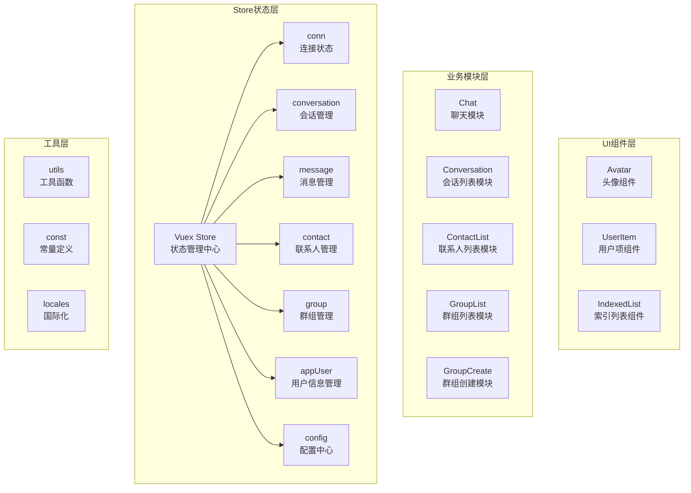
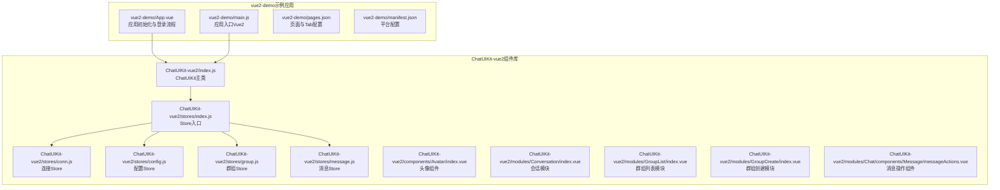
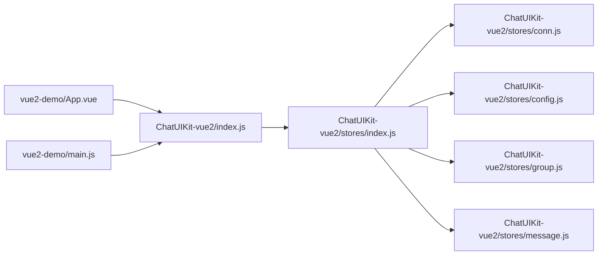

# 快速开始

<cite>
**本文引用的文件**
- [VUE2_QUICK_START.md](file://VUE2_QUICK_START.md)
- [VUE2_ARCHITECTURE.md](file://VUE2_ARCHITECTURE.md)
- [VUE2_INTEGRATION_GUIDE.md](file://VUE2_INTEGRATION_GUIDE.md)
- [VUE2_API_REFERENCE.md](file://VUE2_API_REFERENCE.md)
- [VUE2_README.md](file://VUE2_README.md)
- [ChatUIKit-vue2/index.js](file://ChatUIKit-vue2/index.js)
- [ChatUIKit-vue2/stores/index.js](file://ChatUIKit-vue2/stores/index.js)
- [ChatUIKit-vue2/stores/conn.js](file://ChatUIKit-vue2/stores/conn.js)
- [ChatUIKit-vue2/stores/config.js](file://ChatUIKit-vue2/stores/config.js)
- [ChatUIKit-vue2/stores/conversation.js](file://ChatUIKit-vue2/stores/conversation.js)
- [ChatUIKit-vue2/stores/group.js](file://ChatUIKit-vue2/stores/group.js)
- [ChatUIKit-vue2/stores/message.js](file://ChatUIKit-vue2/stores/message.js)
- [ChatUIKit-vue2/components/Avatar/index.vue](file://ChatUIKit-vue2/components/Avatar/index.vue)
- [ChatUIKit-vue2/modules/Conversation/index.vue](file://ChatUIKit-vue2/modules/Conversation/index.vue)
- [ChatUIKit-vue2/modules/GroupList/index.vue](file://ChatUIKit-vue2/modules/GroupList/index.vue)
- [ChatUIKit-vue2/modules/GroupCreate/index.vue](file://ChatUIKit-vue2/modules/GroupCreate/index.vue)
- [ChatUIKit-vue2/modules/Chat/components/Message/messageActions.vue](file://ChatUIKit-vue2/modules/Chat/components/Message/messageActions.vue)
- [vue2-demo/main.js](file://vue2-demo/main.js)
- [vue2-demo/App.vue](file://vue2-demo/App.vue)
- [vue2-demo/pages.json](file://vue2-demo/pages.json)
- [vue2-demo/manifest.json](file://vue2-demo/manifest.json)
</cite>

## 目录
1. [简介](#简介)
2. [Vue2 架构概览](#vue2-架构概览)
3. [项目结构](#项目结构)
4. [核心组件](#核心组件)
5. [详细组件分析](#详细组件分析)
6. [依赖关系分析](#依赖关系分析)
7. [性能注意事项](#性能注意事项)
8. [故障排除指南](#故障排除指南)
9. [结论](#结论)
10. [附录](#附录)

## 简介
本指南面向新手开发者，帮助你在约30分钟内完成 Easemob UIKit Vue2 版本的环境准备、安装与基础集成，并看到可运行的效果。你将学习到：
- Vue2 环境要求与依赖
- 安装与复制 UIKit 资源
- 初始化 ChatUIKit 并接入 IM SDK
- 基本配置（主题、功能开关、资源地址）
- 常见问题与排错方法

**重要说明**：本指南专门针对 Vue2 版本的 ChatUIKit，与 Vue3 版本在架构、状态管理和 API 使用上有显著差异。

## Vue2 架构概览
Vue2 ChatUIKit 采用基于 Vuex 的状态管理模式，支持 H5、App 和微信小程序等多平台。整体架构分为四个层次：

**图表来源**
- [VUE2_ARCHITECTURE.md:33-82](file://VUE2_ARCHITECTURE.md#L33-L82)
- [ChatUIKit-vue2/stores/index.js:13-23](file://ChatUIKit-vue2/stores/index.js#L13-L23)

## 项目结构
该仓库包含两个主要部分：
- ChatUIKit-vue2：Vue2 版本的组件库源码
- vue2-demo：基于 UniApp 的 Vue2 示例应用

**图表来源**
- [VUE2_ARCHITECTURE.md:33-82](file://VUE2_ARCHITECTURE.md#L33-L82)
- [vue2-demo/main.js:1-82](file://vue2-demo/main.js#L1-L82)
- [vue2-demo/App.vue:1-77](file://vue2-demo/App.vue#L1-L77)
- [vue2-demo/pages.json:1-134](file://vue2-demo/pages.json#L1-L134)
- [vue2-demo/manifest.json:102-102](file://vue2-demo/manifest.json#L102-L102)

**章节来源**
- [VUE2_README.md:70-85](file://VUE2_README.md#L70-L85)
- [VUE2_ARCHITECTURE.md:33-82](file://VUE2_ARCHITECTURE.md#L33-L82)

## 核心组件
- **ChatUIKit 主类**：负责创建并激活全局 Vuex、注入 IM SDK 实例、设置主题与功能配置、提供 onShow 生命周期检测等
- **配置 Store**：集中管理主题与功能开关，默认开启丰富能力，支持按需隐藏或显示
- **连接 Store**：封装 IM SDK 连接实例，提供类型安全的访问与初始化方法
- **群组 Store**：管理群组列表、群组详情、群组创建等核心功能
- **消息 Store**：管理消息的发送、接收、撤回、编辑、引用等操作
- **事件系统**：采用 uni.$emit/uni.$on 作为全局事件总线，实现跨组件通信

**章节来源**
- [ChatUIKit-vue2/index.js:6-66](file://ChatUIKit-vue2/index.js#L6-L66)
- [ChatUIKit-vue2/stores/config.js:70-196](file://ChatUIKit-vue2/stores/config.js#L70-L196)
- [ChatUIKit-vue2/stores/conn.js:8-50](file://ChatUIKit-vue2/stores/conn.js#L8-L50)
- [ChatUIKit-vue2/stores/group.js:1-212](file://ChatUIKit-vue2/stores/group.js#L1-L212)
- [ChatUIKit-vue2/stores/message.js:1-880](file://ChatUIKit-vue2/stores/message.js#L1-L880)

## 详细组件分析

### 环境要求与安装
- **运行环境**：Node.js 16+、HBuilderX 3.6+、Vue 2.x、uni-app 3.x
- **平台支持**：Android、iOS、微信小程序、H5
- **依赖包**：easemob-websdk、vuex、pinyin-pro、easemob-uniapp-logger-plugin
- **复制 UIKit 资源**：将 ChatUIKit-vue2 目录复制到项目中，重命名为 ChatUIKit

**步骤摘要**
- 在项目根目录执行 `npm install easemob-websdk vuex pinyin-pro easemob-uniapp-logger-plugin`
- 复制 ChatUIKit-vue2 目录到项目根目录，重命名为 ChatUIKit
- 配置 manifest.json 中的 vueVersion 为 "2"

**章节来源**
- [VUE2_QUICK_START.md:23-31](file://VUE2_QUICK_START.md#L23-L31)
- [VUE2_INTEGRATION_GUIDE.md:50-81](file://VUE2_INTEGRATION_GUIDE.md#L50-L81)
- [vue2-demo/manifest.json:102-102](file://vue2-demo/manifest.json#L102-L102)

### 基本配置与初始化
- **初始化入口**：ChatUIKit.init 接收 IM SDK 实例与配置对象
- **配置项**：
  - chat：环信 SDK 连接实例（必需）
  - sdk：环信 SDK 本身（可选）
  - config：配置对象（isDebug、language 等）
- **连接注入**：通过 this.$ChatUIKit.getChatConn 获取 SDK 实例
- **生命周期**：this.$ChatUIKit.onShow 会在应用 onShow 时检查连接有效性

**章节来源**
- [ChatUIKit-vue2/index.js:22-66](file://ChatUIKit-vue2/index.js#L22-L66)
- [ChatUIKit-vue2/index.js:368-376](file://ChatUIKit-vue2/index.js#L368-L376)
- [vue2-demo/App.vue:39-64](file://vue2-demo/App.vue#L39-L64)

### 主题与功能开关
- **主题配置**：avatarShape 支持圆形/方形
- **功能开关**：默认开启输入区域、消息操作、会话管理、其他扩展功能
- **动态隐藏/显示**：可通过 hideFeature 或 showFeature 控制

**章节来源**
- [ChatUIKit-vue2/stores/config.js:8-46](file://ChatUIKit-vue2/stores/config.js#L8-L46)
- [ChatUIKit-vue2/stores/config.js:162-178](file://ChatUIKit-vue2/stores/config.js#L162-L178)

### 群组管理功能
**更新** 群组管理功能已从"创建、解散、邀请、踢人、群信息管理"更正为"群组列表、创建群组"

- **群组列表**：支持获取已加入的群组列表，显示群组名称和头像
- **群组创建**：支持搜索联系人、批量选择成员、创建群组
- **群组详情**：支持获取群组详细信息，包括群组名称、头像等

**章节来源**
- [ChatUIKit-vue2/modules/GroupList/index.vue:1-80](file://ChatUIKit-vue2/modules/GroupList/index.vue#L1-L80)
- [ChatUIKit-vue2/modules/GroupCreate/index.vue:1-394](file://ChatUIKit-vue2/modules/GroupCreate/index.vue#L1-L394)
- [ChatUIKit-vue2/stores/group.js:1-212](file://ChatUIKit-vue2/stores/group.js#L1-L212)

### 消息操作功能
**更新** 消息操作功能已从"撤回、编辑、引用、表情反应"更正为"撤回、编辑、引用"

- **消息操作菜单**：支持复制、编辑、回复、删除、撤回等操作
- **消息撤回**：支持在限定时间内撤回自己发送的消息
- **消息编辑**：支持编辑文本消息（需要消息已同步到服务器）
- **消息引用**：支持引用其他消息进行回复

**章节来源**
- [ChatUIKit-vue2/modules/Chat/components/Message/messageActions.vue:1-357](file://ChatUIKit-vue2/modules/Chat/components/Message/messageActions.vue#L1-L357)
- [ChatUIKit-vue2/stores/message.js:557-660](file://ChatUIKit-vue2/stores/message.js#L557-L660)

### 页面与路由
- **页面清单**：pages.json 定义了登录、会话列表、聊天页、联系人等页面路径与样式
- **Tab 配置**：消息、联系人、我的三个 tab，分别指向对应模块
- **路由参数**：聊天页面需要接收 conversationId 和 conversationType 参数

**章节来源**
- [vue2-demo/pages.json:1-134](file://vue2-demo/pages.json#L1-L134)
- [ChatUIKit-vue2/modules/Conversation/index.vue:1-19](file://ChatUIKit-vue2/modules/Conversation/index.vue#L1-L19)

### 示例：在应用中引入与初始化
- **main.js 配置**：引入 ChatUIKit、初始化 i18n、挂载到 Vue 原型
- **App.vue 初始化**：创建 IM SDK 连接实例并调用 ChatUIKit.init
- **登录流程**：支持账号密码与短信验证码两种登录方式

**章节来源**
- [vue2-demo/main.js:52-70](file://vue2-demo/main.js#L52-L70)
- [vue2-demo/App.vue:39-64](file://vue2-demo/App.vue#L39-L64)
- [VUE2_QUICK_START.md:180-279](file://VUE2_QUICK_START.md#L180-L279)

### 示例：组件使用
- **头像组件**：支持在线状态显示、多种尺寸、占位图处理
- **会话列表**：直接渲染 ConversationList 组件，作为入口页面
- **聊天页面**：需要包装以接收路由参数，设置当前会话到 Store

**章节来源**
- [ChatUIKit-vue2/components/Avatar/index.vue:30-71](file://ChatUIKit-vue2/components/Avatar/index.vue#L30-L71)
- [ChatUIKit-vue2/modules/Conversation/index.vue:1-19](file://ChatUIKit-vue2/modules/Conversation/index.vue#L1-L19)

## 依赖关系分析
- ChatUIKit-vue2/index.js 依赖 stores/index.js 与各种 Store 模块，负责统一初始化与对外暴露
- stores/index.js 依赖各个业务 Store 模块，提供 Vuex Store 实例
- vue2-demo/App.vue 依赖 ChatUIKit-vue2/index.js 与 IM SDK，负责应用层初始化与登录流程
- vue2-demo/main.js 依赖 ChatUIKit-vue2/index.js 获取全局 Store 实例

**图表来源**
- [vue2-demo/App.vue:1-77](file://vue2-demo/App.vue#L1-L77)
- [vue2-demo/main.js:1-82](file://vue2-demo/main.js#L1-L82)
- [ChatUIKit-vue2/index.js:1-13](file://ChatUIKit-vue2/index.js#L1-L13)
- [ChatUIKit-vue2/stores/index.js:1-27](file://ChatUIKit-vue2/stores/index.js#L1-L27)

## 性能注意事项
- **资源加载**：默认资源地址可能受限，建议迁移至自有服务器并更新资源地址
- **消息数量控制**：单会话最大消息条数有限，避免一次性加载过多历史消息
- **微信小程序适配**：注意 Vue2 在小程序中的限制，如 scoped slot 支持问题
- **响应式优化**：SDK 实例存储在外部变量中，避免 Vue 响应式系统的影响

**章节来源**
- [ChatUIKit-vue2/stores/conn.js:3-6](file://ChatUIKit-vue2/stores/conn.js#L3-L6)
- [ChatUIKit-vue2/stores/conversation.js:9-44](file://ChatUIKit-vue2/stores/conversation.js#L9-L44)

## 故障排除指南
- **微信小程序提示 "util is not defined"**
  - 确保在 main.js 中添加了 Polyfill
  - 检查 manifest.json 中的 vueVersion 设置为 "2"
- **联系人/会话列表为空**
  - 检查是否正确初始化 SDK
  - 检查是否已登录
  - 查看控制台是否有错误信息
- **群组功能异常**
  - 确认群组列表接口调用正常
  - 检查群组创建参数是否正确
  - 验证群组权限设置
- **消息操作功能异常**
  - 检查消息撤回时间限制（2分钟内）
  - 确认消息已同步到服务器才能编辑
  - 验证消息引用功能的可用性
- **组件渲染异常**
  - 确认 props 类型和默认值设置正确
  - 检查数据加载顺序和空值保护
- **消息显示问题**
  - 确认消息 ID 转换处理（Long 类型）
  - 检查消息格式转换和存储

**章节来源**
- [VUE2_QUICK_START.md:397-419](file://VUE2_QUICK_START.md#L397-L419)
- [VUE2_INTEGRATION_GUIDE.md:648-711](file://VUE2_INTEGRATION_GUIDE.md#L648-L711)

## 结论
通过本指南，你可以在约 30 分钟内完成 Vue2 版本 ChatUIKit 的环境准备、安装与基础集成，并看到登录后进入会话列表的效果。Vue2 版本使用 Vuex 管理状态，与 Vue3 的 Pinia 有显著差异，建议根据具体需求选择合适的版本。

## 附录

### 快速开始清单
- 准备 Node.js 16+ 与 HBuilderX 3.6+
- 在项目根目录安装依赖包
- 复制 ChatUIKit-vue2 目录到项目中
- 配置 manifest.json 中的 vueVersion 为 "2"
- 在 main.js 中引入 ChatUIKit 并初始化 i18n
- 在 App.vue 中创建 IM SDK 实例并调用 ChatUIKit.init
- 配置 pages.json 中的页面与 Tab
- 运行项目并完成登录，进入会话列表

**章节来源**
- [VUE2_QUICK_START.md:5-42](file://VUE2_QUICK_START.md#L5-L42)
- [vue2-demo/main.js:52-70](file://vue2-demo/main.js#L52-L70)
- [vue2-demo/App.vue:39-64](file://vue2-demo/App.vue#L39-L64)
- [vue2-demo/pages.json:1-134](file://vue2-demo/pages.json#L1-L134)