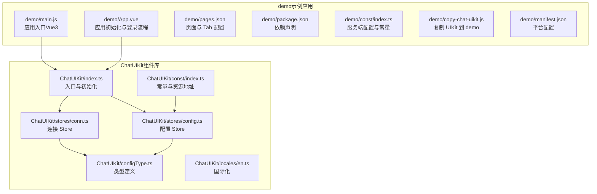
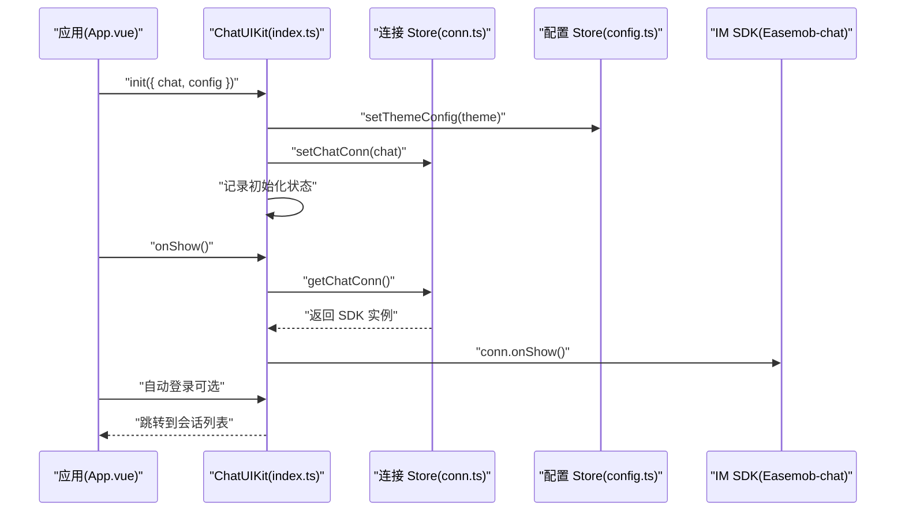
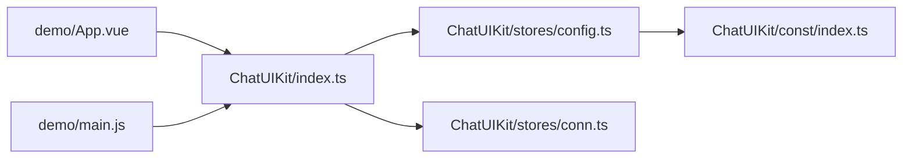

# 快速开始

<cite>
**本文引用的文件**
- [README.md](file://README.md)
- [ChatUIKit/README.md](file://ChatUIKit/README.md)
- [ChatUIKit/index.ts](file://ChatUIKit/index.ts)
- [ChatUIKit/configType.ts](file://ChatUIKit/configType.ts)
- [ChatUIKit/stores/config.ts](file://ChatUIKit/stores/config.ts)
- [ChatUIKit/stores/conn.ts](file://ChatUIKit/stores/conn.ts)
- [ChatUIKit/const/index.ts](file://ChatUIKit/const/index.ts)
- [ChatUIKit/locales/en.ts](file://ChatUIKit/locales/en.ts)
- [demo/main.js](file://demo/main.js)
- [demo/App.vue](file://demo/App.vue)
- [demo/pages.json](file://demo/pages.json)
- [demo/package.json](file://demo/package.json)
- [demo/const/index.ts](file://demo/const/index.ts)
- [demo/pages/Login/index.vue](file://demo/pages/Login/index.vue)
- [ChatUIKit/modules/Conversation/index.vue](file://ChatUIKit/modules/Conversation/index.vue)
- [demo/copy-chat-uikit.js](file://demo/copy-chat-uikit.js)
- [demo/manifest.json](file://demo/manifest.json)
</cite>

## 目录
1. [简介](#简介)
2. [项目结构](#项目结构)
3. [核心组件](#核心组件)
4. [架构总览](#架构总览)
5. [详细组件分析](#详细组件分析)
6. [依赖关系分析](#依赖关系分析)
7. [性能注意事项](#性能注意事项)
8. [故障排除指南](#故障排除指南)
9. [结论](#结论)
10. [附录](#附录)

## 简介
本指南面向新手开发者，帮助你在约30分钟内完成 Easemob UIKit 的环境准备、安装与基础集成，并看到可运行的效果。你将学习到：
- 环境要求与依赖
- 安装与复制 UIKit 资源
- 初始化 ChatUIKit 并接入 IM SDK
- 基本配置（主题、功能开关、资源地址）
- 常见问题与排错方法

## 项目结构
该仓库包含两部分：
- ChatUIKit：组件库源码与示例工程
- demo：基于 UniApp 的示例应用，演示如何集成 ChatUIKit

图表来源
- [ChatUIKit/index.ts](file://ChatUIKit/index.ts#L1-L139)
- [ChatUIKit/configType.ts](file://ChatUIKit/configType.ts#L1-L68)
- [ChatUIKit/stores/config.ts](file://ChatUIKit/stores/config.ts#L1-L124)
- [ChatUIKit/stores/conn.ts](file://ChatUIKit/stores/conn.ts#L1-L84)
- [ChatUIKit/const/index.ts](file://ChatUIKit/const/index.ts#L1-L37)
- [ChatUIKit/locales/en.ts](file://ChatUIKit/locales/en.ts#L1-L154)
- [demo/main.js](file://demo/main.js#L1-L28)
- [demo/App.vue](file://demo/App.vue#L1-L134)
- [demo/pages.json](file://demo/pages.json#L1-L200)
- [demo/package.json](file://demo/package.json#L1-L18)
- [demo/const/index.ts](file://demo/const/index.ts#L1-L32)
- [demo/copy-chat-uikit.js](file://demo/copy-chat-uikit.js#L1-L71)
- [demo/manifest.json](file://demo/manifest.json#L1-L134)

章节来源
- [README.md](file://README.md#L1-L63)
- [ChatUIKit/README.md](file://ChatUIKit/README.md#L1-L63)

## 核心组件
- ChatUIKit 初始化类：负责创建并激活全局 Pinia、注入 IM SDK 实例、设置主题与功能配置、提供 onShow 生命周期检测等。
- 配置 Store：集中管理主题与功能开关，默认开启丰富能力，支持按需隐藏或显示。
- 连接 Store：封装 IM SDK 连接实例，提供类型安全的访问与初始化方法。

章节来源
- [ChatUIKit/index.ts](file://ChatUIKit/index.ts#L1-L139)
- [ChatUIKit/stores/config.ts](file://ChatUIKit/stores/config.ts#L1-L124)
- [ChatUIKit/stores/conn.ts](file://ChatUIKit/stores/conn.ts#L1-L84)

## 架构总览
下图展示了从应用启动到进入会话列表的关键流程：应用初始化 -> 注入 ChatUIKit -> 登录 IM -> 跳转到会话列表。

图表来源
- [demo/App.vue](file://demo/App.vue#L1-L134)
- [ChatUIKit/index.ts](file://ChatUIKit/index.ts#L84-L125)
- [ChatUIKit/stores/conn.ts](file://ChatUIKit/stores/conn.ts#L25-L40)
- [ChatUIKit/stores/config.ts](file://ChatUIKit/stores/config.ts#L82-L121)

## 详细组件分析

### 环境要求与安装
- 运行环境：Node.js、npm 或 yarn、HBuilderX（推荐）或 uni-app CLI
- 平台支持：Android、iOS、微信小程序、H5
- 依赖包：easemob-websdk、pinia、pinyin-pro
- 复制 UIKit 资源到 demo：执行脚本将 ChatUIKit 源码复制到 demo 下，便于直接使用

步骤摘要
- 安装依赖：在 demo 目录执行安装命令
- 复制 UIKit：执行 npm 脚本复制组件库到 demo
- 启动项目：使用 HBuilderX 或 uni-app CLI 预览/编译

章节来源
- [demo/package.json](file://demo/package.json#L1-L18)
- [demo/copy-chat-uikit.js](file://demo/copy-chat-uikit.js#L1-L71)
- [README.md](file://README.md#L1-L63)

### 基本配置与初始化
- 初始化入口：ChatUIKit.init 接收 IM SDK 实例与配置对象
- 配置项：
  - theme：主题配置（如头像形状）
  - isDebug：是否开启调试日志
- 连接注入：通过 ChatUIKit.getChatConn 获取 SDK 实例
- 生命周期：ChatUIKit.onShow 会在应用 onShow 时检查连接有效性

章节来源
- [ChatUIKit/index.ts](file://ChatUIKit/index.ts#L84-L125)
- [ChatUIKit/configType.ts](file://ChatUIKit/configType.ts#L47-L67)
- [ChatUIKit/stores/conn.ts](file://ChatUIKit/stores/conn.ts#L25-L40)

### 主题与功能开关
- 主题配置：avatarShape 支持圆形/方形
- 功能开关：默认开启输入区域、消息操作、会话管理、其他扩展功能
- 动态隐藏/显示：可通过 hideFeature 或 showFeature 控制

章节来源
- [ChatUIKit/configType.ts](file://ChatUIKit/configType.ts#L42-L53)
- [ChatUIKit/stores/config.ts](file://ChatUIKit/stores/config.ts#L19-L57)
- [ChatUIKit/stores/config.ts](file://ChatUIKit/stores/config.ts#L97-L121)

### 资源与国际化
- 资源地址：默认托管于 OSS；建议替换为自有服务器地址以避免访问限制
- 国际化：英文文案集中于 locales/en.ts，可在应用中按需切换语言

章节来源
- [ChatUIKit/const/index.ts](file://ChatUIKit/const/index.ts#L7-L12)
- [ChatUIKit/locales/en.ts](file://ChatUIKit/locales/en.ts#L1-L154)

### 页面与路由
- 页面清单：pages.json 定义了登录、会话列表、聊天页、联系人等页面路径与样式
- Tab 配置：消息、联系人、个人中心三个 tab，分别指向对应模块

章节来源
- [demo/pages.json](file://demo/pages.json#L1-L200)

### 示例：在应用中引入与初始化
- 在应用入口注入 ChatUIKit 的 Pinia 实例
- 在 App.vue 中创建 IM SDK 连接实例并调用 ChatUIKit.init
- 可选：自动登录后跳转至会话列表

章节来源
- [demo/main.js](file://demo/main.js#L14-L27)
- [demo/App.vue](file://demo/App.vue#L14-L32)
- [demo/App.vue](file://demo/App.vue#L86-L114)

### 示例：登录与跳转
- 登录页提供账号密码与短信验证码两种登录方式
- 登录成功后缓存用户信息与 token，并跳转到会话列表

章节来源
- [demo/pages/Login/index.vue](file://demo/pages/Login/index.vue#L165-L198)
- [demo/pages/Login/index.vue](file://demo/pages/Login/index.vue#L200-L289)
- [demo/pages/Login/index.vue](file://demo/pages/Login/index.vue#L292-L302)

### 示例：会话列表
- 会话列表页面直接渲染 ConversationList 组件，作为入口页面

章节来源
- [ChatUIKit/modules/Conversation/index.vue](file://ChatUIKit/modules/Conversation/index.vue#L1-L12)

## 依赖关系分析
- ChatUIKit/index.ts 依赖 stores/config.ts 与 stores/conn.ts，负责统一初始化与对外暴露
- stores/config.ts 依赖 ChatUIKit/const/index.ts 提供资源地址
- demo/App.vue 依赖 ChatUIKit/index.ts 与 IM SDK，负责应用层初始化与登录流程
- demo/main.js 依赖 ChatUIKit/index.ts 获取全局 Pinia 实例

图表来源
- [demo/App.vue](file://demo/App.vue#L1-L134)
- [demo/main.js](file://demo/main.js#L1-L28)
- [ChatUIKit/index.ts](file://ChatUIKit/index.ts#L1-L139)
- [ChatUIKit/stores/config.ts](file://ChatUIKit/stores/config.ts#L1-L124)
- [ChatUIKit/stores/conn.ts](file://ChatUIKit/stores/conn.ts#L1-L84)
- [ChatUIKit/const/index.ts](file://ChatUIKit/const/index.ts#L1-L37)

## 性能注意事项
- 资源加载：默认资源地址可能受限，建议迁移至自有服务器并更新资源地址
- 消息数量控制：单会话最大消息条数有限，避免一次性加载过多历史消息
- 群组头像懒加载：示例中对未设置头像的群组进行懒加载，减少初始请求压力

章节来源
- [ChatUIKit/const/index.ts](file://ChatUIKit/const/index.ts#L7-L15)
- [demo/App.vue](file://demo/App.vue#L45-L84)

## 故障排除指南
- 无法连接 IM
  - 检查 APPKEY、REST 地址与 WebSocket 地址是否正确
  - 确认 ChatUIKit.init 已传入正确的 IM SDK 实例
- 登录失败
  - 查看登录页错误提示，确认账号密码或短信验证码是否正确
  - 检查 token 缓存与登录回调
- 页面无法显示
  - 确认 pages.json 中页面路径与样式配置正确
  - 确认 Tab 配置指向的模块路径存在
- 资源加载失败
  - 将资源地址替换为自有服务器地址
- 复制 UIKit 失败
  - 确认执行 copy-chat-uikit.js 脚本，且源目录与目标目录路径正确

章节来源
- [demo/const/index.ts](file://demo/const/index.ts#L4-L10)
- [demo/pages/Login/index.vue](file://demo/pages/Login/index.vue#L165-L198)
- [demo/pages/Login/index.vue](file://demo/pages/Login/index.vue#L200-L289)
- [demo/pages.json](file://demo/pages.json#L64-L165)
- [ChatUIKit/const/index.ts](file://ChatUIKit/const/index.ts#L7-L12)
- [demo/copy-chat-uikit.js](file://demo/copy-chat-uikit.js#L1-L71)

## 结论
通过本指南，你可以在约 30 分钟内完成环境准备、安装与基础集成，并看到登录后进入会话列表的效果。建议进一步探索功能开关与主题配置，结合自身业务定制 UI 与交互。

## 附录

### 快速开始清单
- 准备 Node.js 与 HBuilderX/uni-app CLI
- 在 demo 目录安装依赖并执行复制脚本
- 在 App.vue 中创建 IM SDK 实例并调用 ChatUIKit.init
- 在 pages.json 中配置页面与 Tab
- 运行项目并完成登录，进入会话列表

章节来源
- [demo/package.json](file://demo/package.json#L1-L18)
- [demo/copy-chat-uikit.js](file://demo/copy-chat-uikit.js#L1-L71)
- [demo/App.vue](file://demo/App.vue#L14-L32)
- [demo/pages.json](file://demo/pages.json#L1-L200)