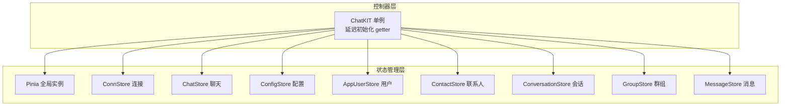
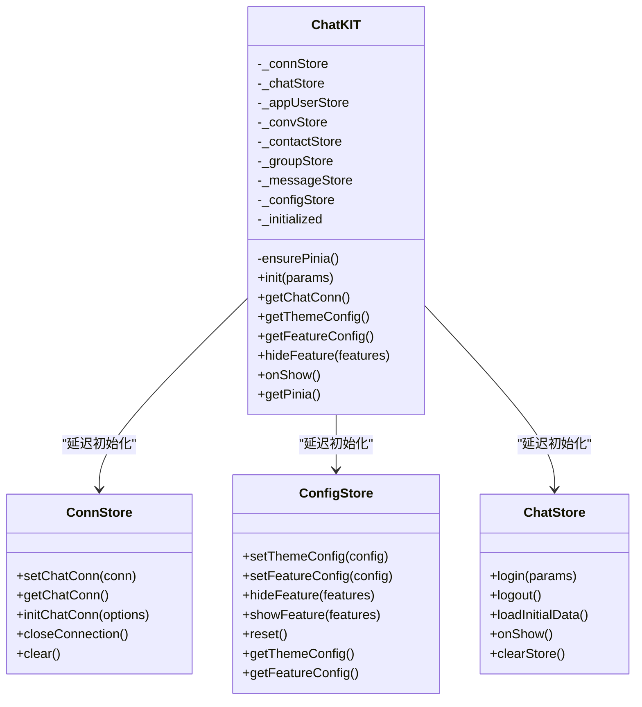
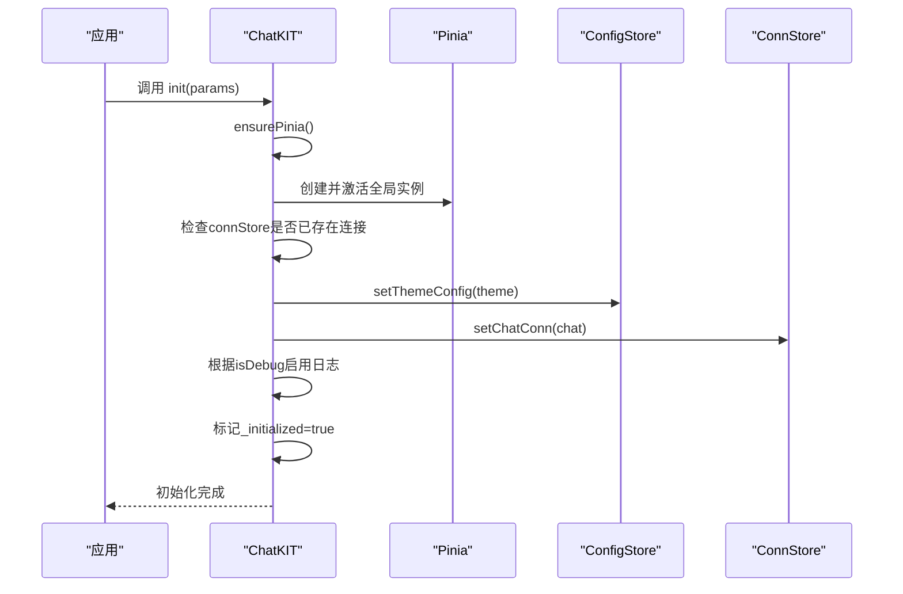
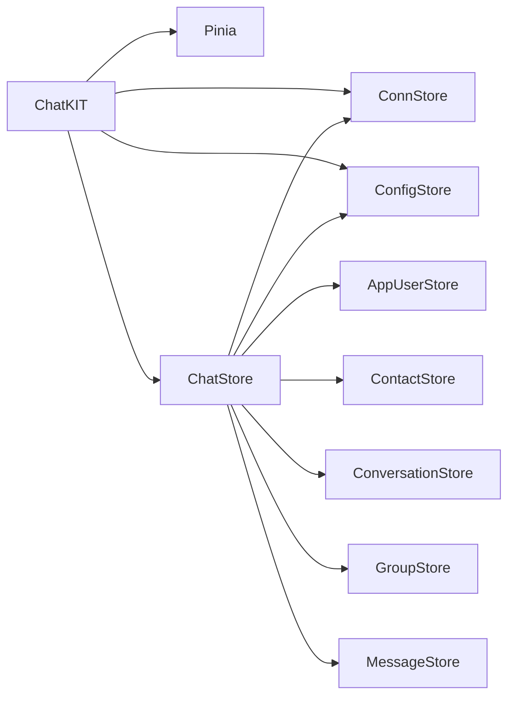

# ChatKIT主控制器

<cite>
**本文档引用的文件**
- [ChatUIKit/index.ts](file://ChatUIKit/index.ts)
- [ChatUIKit/stores/index.ts](file://ChatUIKit/stores/index.ts)
- [ChatUIKit/stores/conn.ts](file://ChatUIKit/stores/conn.ts)
- [ChatUIKit/stores/config.ts](file://ChatUIKit/stores/config.ts)
- [ChatUIKit/stores/chat.ts](file://ChatUIKit/stores/chat.ts)
- [ChatUIKit/configType.ts](file://ChatUIKit/configType.ts)
- [ChatUIKit/log.ts](file://ChatUIKit/log.ts)
- [ChatUIKit/sdk.ts](file://ChatUIKit/sdk.ts)
- [ChatUIKit/stores/appUser.ts](file://ChatUIKit/stores/appUser.ts)
- [ChatUIKit/stores/contact.ts](file://ChatUIKit/stores/contact.ts)
- [ChatUIKit/stores/conversation.ts](file://ChatUIKit/stores/conversation.ts)
</cite>

## 目录
1. [简介](#简介)
2. [项目结构](#项目结构)
3. [核心组件](#核心组件)
4. [架构概览](#架构概览)
5. [详细组件分析](#详细组件分析)
6. [依赖关系分析](#依赖关系分析)
7. [性能考虑](#性能考虑)
8. [故障排查指南](#故障排查指南)
9. [结论](#结论)

## 简介
本文件面向ChatKIT主控制器的使用者与维护者，系统性阐述其单例模式设计、延迟初始化机制、公共方法语义与使用场景，并提供完整的初始化流程、错误处理策略与最佳实践建议。ChatKIT通过Pinia全局状态管理，将IM连接、主题配置、功能开关、聊天状态等模块解耦，形成清晰的控制层与数据层分离。

## 项目结构
ChatKIT位于ChatUIKit目录，采用“控制器 + Store”双层架构：
- 控制器层：ChatKIT单例负责生命周期管理、初始化与对外接口
- Store层：按业务域拆分，包括连接、聊天、配置、用户、联系人、会话、消息等

图表来源
- [ChatUIKit/index.ts](file://ChatUIKit/index.ts#L18-L132)
- [ChatUIKit/stores/index.ts](file://ChatUIKit/stores/index.ts#L9-L21)

章节来源
- [ChatUIKit/index.ts](file://ChatUIKit/index.ts#L1-L139)
- [ChatUIKit/stores/index.ts](file://ChatUIKit/stores/index.ts#L1-L31)

## 核心组件
- ChatKIT单例：提供init()、getChatConn()、getThemeConfig()、getFeatureConfig()、hideFeature()、onShow()、getPinia()等公共方法；内部通过getter实现延迟初始化，避免构造函数中访问store导致的时序问题。
- Store集合：各Store封装各自领域模型与行为，通过Pinia统一调度，彼此通过getter/动作协作。

章节来源
- [ChatUIKit/index.ts](file://ChatUIKit/index.ts#L18-L132)
- [ChatUIKit/stores/conn.ts](file://ChatUIKit/stores/conn.ts#L20-L83)
- [ChatUIKit/stores/config.ts](file://ChatUIKit/stores/config.ts#L59-L123)
- [ChatUIKit/stores/chat.ts](file://ChatUIKit/stores/chat.ts#L29-L398)

## 架构概览
ChatKIT作为门面，协调Pinia与各Store，向上提供简洁API，向下屏蔽初始化细节与依赖关系。

图表来源
- [ChatUIKit/index.ts](file://ChatUIKit/index.ts#L18-L132)
- [ChatUIKit/stores/conn.ts](file://ChatUIKit/stores/conn.ts#L20-L83)
- [ChatUIKit/stores/config.ts](file://ChatUIKit/stores/config.ts#L59-L123)
- [ChatUIKit/stores/chat.ts](file://ChatUIKit/stores/chat.ts#L29-L398)

## 详细组件分析

### 单例模式与延迟初始化
- 设计理念
  - 通过私有getter在首次访问时创建对应Store实例，避免在构造函数阶段访问store导致的时序问题。
  - 通过ensurePinia确保Pinia实例在首次使用前被创建并激活，保证后续Store可用。
- 实现要点
  - 所有getter均先ensurePinia，再检查并懒加载对应Store。
  - ChatKIT构造函数为空，不进行任何store访问。
- 优势
  - 解耦初始化时机，允许在应用任意阶段调用getter。
  - 降低内存占用，仅在需要时创建Store实例。

章节来源
- [ChatUIKit/index.ts](file://ChatUIKit/index.ts#L30-L82)

### 初始化流程（init）
- 参数
  - chat: IM SDK连接实例（Chat.Connection）
  - config.theme: 主题配置（ThemeConfig）
  - config.isDebug: 是否开启调试模式（boolean）
- 步骤
  1) ensurePinia确保Pinia可用
  2) 若connStore已有连接则直接返回
  3) 设置主题配置（configStore.setThemeConfig）
  4) 设置IM连接（connStore.setChatConn）
  5) 根据isDebug决定是否启用调试日志
  6) 标记_initialized为true
- 注意事项
  - 重复调用init不会重复设置连接
  - 建议在应用启动早期调用，确保后续getter可用

图表来源
- [ChatUIKit/index.ts](file://ChatUIKit/index.ts#L84-L96)
- [ChatUIKit/stores/config.ts](file://ChatUIKit/stores/config.ts#L82-L95)
- [ChatUIKit/stores/conn.ts](file://ChatUIKit/stores/conn.ts#L42-L49)

章节来源
- [ChatUIKit/index.ts](file://ChatUIKit/index.ts#L84-L96)
- [ChatUIKit/configType.ts](file://ChatUIKit/configType.ts#L55-L65)

### 公共方法详解

#### getChatConn()
- 功能：获取IM连接实例
- 返回：Chat.Connection
- 使用场景：在需要直接调用SDK能力时使用（如手动心跳检测、离线推送处理）
- 延迟策略：通过connStore.getChatConn getter访问，内部会在未初始化时抛出明确错误

章节来源
- [ChatUIKit/index.ts](file://ChatUIKit/index.ts#L98-L101)
- [ChatUIKit/stores/conn.ts](file://ChatUIKit/stores/conn.ts#L25-L40)

#### getThemeConfig()
- 功能：获取UI主题配置
- 返回：ThemeConfig
- 使用场景：渲染组件样式（如头像形状等）

章节来源
- [ChatUIKit/index.ts](file://ChatUIKit/index.ts#L102-L105)
- [ChatUIKit/stores/config.ts](file://ChatUIKit/stores/config.ts#L65-L80)

#### getFeatureConfig()
- 功能：获取功能开关配置
- 返回：FeatureConfig
- 使用场景：根据开关动态渲染UI或禁用功能

章节来源
- [ChatUIKit/index.ts](file://ChatUIKit/index.ts#L106-L109)
- [ChatUIKit/stores/config.ts](file://ChatUIKit/stores/config.ts#L71-L80)

#### hideFeature(features)
- 功能：隐藏指定功能
- 参数：Array<keyof FeatureConfig>，传入要关闭的功能键名
- 使用场景：按需裁剪UIKIT功能，减少冗余交互
- 注意：该方法会修改全局配置，影响后续渲染与行为

章节来源
- [ChatUIKit/index.ts](file://ChatUIKit/index.ts#L110-L113)
- [ChatUIKit/stores/config.ts](file://ChatUIKit/stores/config.ts#L97-L113)

#### onShow()
- 功能：在应用前台可见时检测IM连接有效性
- 行为：若已登录且连接存在，则调用conn.onShow()
- 错误处理：捕获异常并忽略（connStore未初始化时）

章节来源
- [ChatUIKit/index.ts](file://ChatUIKit/index.ts#L114-L125)
- [ChatUIKit/stores/chat.ts](file://ChatUIKit/stores/chat.ts#L365-L371)

#### getPinia()
- 功能：获取全局Pinia实例，供应用注册
- 返回：Pinia实例
- 使用场景：在应用入口调用app.use(ChatUIKit.getPinia())

章节来源
- [ChatUIKit/index.ts](file://ChatUIKit/index.ts#L127-L131)
- [ChatUIKit/stores/index.ts](file://ChatUIKit/stores/index.ts#L18-L21)

### Getter延迟初始化策略与构造函数避坑
- 为什么不在构造函数中访问store
  - 构造函数执行时Pinia尚未激活，直接访问store会导致不可预期的行为
  - getter在首次访问时ensurePinia，确保Pinia与store可用
- 延迟初始化流程
  - ensurePinia：创建并激活全局Pinia
  - getter：检查实例是否存在，不存在则调用对应useXxxStore()创建
- 避免的问题
  - 避免“store未初始化”的运行时错误
  - 保证多平台（H5/小程序/APP）的一致行为

章节来源
- [ChatUIKit/index.ts](file://ChatUIKit/index.ts#L30-L82)

### 错误处理机制
- 连接未初始化
  - connStore.getChatConn在未设置连接时抛出明确错误，提示“连接未初始化”
- onShow异常捕获
  - onShow中对connStore未初始化进行try/catch，避免影响前台切换流程
- 日志系统
  - 通过logger统一输出info/warn/error/info，支持按isDebug开关控制输出

章节来源
- [ChatUIKit/stores/conn.ts](file://ChatUIKit/stores/conn.ts#L29-L34)
- [ChatUIKit/index.ts](file://ChatUIKit/index.ts#L114-L125)
- [ChatUIKit/log.ts](file://ChatUIKit/log.ts#L5-L78)

### 最佳实践示例
- 应用启动时尽早初始化
  - 在应用入口调用ChatUIKit.init({ chat, config: { theme, isDebug } })
  - 确保在路由导航前完成
- 动态隐藏功能
  - 根据业务需求调用hideFeature(['inputImage', 'inputAudio'])，减少UI复杂度
- 前台可见检测
  - 在应用onShow生命周期中调用ChatUIKit.onShow()，维持连接有效性
- Pinia注册
  - 在Vue应用中调用app.use(ChatUIKit.getPinia())注册全局状态

章节来源
- [ChatUIKit/index.ts](file://ChatUIKit/index.ts#L84-L131)
- [ChatUIKit/stores/config.ts](file://ChatUIKit/stores/config.ts#L97-L113)

## 依赖关系分析
- 控制器依赖
  - ChatKIT依赖Pinia全局实例与各Store的useXxxStore工厂函数
- Store间协作
  - ChatStore在登录、事件处理、数据加载时协调Conn/Config/AppUser/Contact/Conversation/Group/Message等Store
  - ConnStore提供Chat.Connection实例，ConfigStore提供主题与功能配置
- 外部依赖
  - easemob-websdk/uniApp/Easemob-chat作为IM SDK

图表来源
- [ChatUIKit/index.ts](file://ChatUIKit/index.ts#L1-L10)
- [ChatUIKit/stores/chat.ts](file://ChatUIKit/stores/chat.ts#L10-L20)

章节来源
- [ChatUIKit/index.ts](file://ChatUIKit/index.ts#L1-L10)
- [ChatUIKit/stores/chat.ts](file://ChatUIKit/stores/chat.ts#L10-L20)

## 性能考虑
- 延迟初始化降低冷启动开销，仅在首次访问时创建Store实例
- ChatStore在登录后批量加载会话、联系人、群组，避免多次网络请求
- 用户信息与在线状态按需拉取，减少不必要的网络与渲染

## 故障排查指南
- 症状：调用getChatConn时报错“连接未初始化”
  - 原因：未调用init或init未正确设置连接
  - 处理：确保在应用启动阶段调用init并传入有效的Chat.Connection实例
- 症状：onShow无效果
  - 原因：未登录或connStore未初始化
  - 处理：确认已登录且connStore.getChatConn可用
- 症状：功能开关无效
  - 原因：hideFeature未生效或未重新渲染
  - 处理：确认传入的键名存在于FeatureConfig，确保UI组件响应配置变化

章节来源
- [ChatUIKit/stores/conn.ts](file://ChatUIKit/stores/conn.ts#L29-L34)
- [ChatUIKit/index.ts](file://ChatUIKit/index.ts#L114-L125)
- [ChatUIKit/stores/config.ts](file://ChatUIKit/stores/config.ts#L97-L113)

## 结论
ChatKIT通过单例+延迟初始化的设计，将Pinia与各Store有机整合，提供简洁稳定的对外接口。遵循本文档的初始化流程、错误处理与最佳实践，可确保在多端环境下稳定运行并具备良好的扩展性。